# JUC并发编程

# JUC 概述

## 简介

在 Java 5.0 提供了 java.util.concurrent （简称 JUC ）包，在此包中增加了在并发编程中很常用 的实用工具类，用于定义类似于线程的自定义子 系统，包括线程池、异步 IO 和轻量级任务框架。 提供可调的、灵活的线程池。还提供了设计用于多线程上下文中的 Collection 实现等。

## 进程和线程的概念

### 进程（Process）

- 计算机中的程序关于某数据集合上的一次运行活动
- 进程是线程的容器
- 程序是指令、数据及其组织形式的描述，进程是程序的实体
- 系统进行资源分配和调度的基本单位，是操作系统结构的基础

### 线程（thread）

- 操作系统能够进行运算调度的最小单位
- 被包含在进程之中，是进程中的实际运作单位
- 一条线程指的是进程中一个单一顺序的控制流

简单来说就是，进程是一个应用程序而线程就是一个应用程序里面的其他操作，一个应用程序可以包含多个线程。

### 线程的状态

线程有5个状态，分别是NEW（新建）、RUNNABLE（准备就绪）、BLOCKED（阻塞）、WAITING（不见不散，一定得等到，不然不做其他的）、TIME-WAITING（过时不候：超过了时间就过去了）、TERMINATED（终结）。

### wait和sleep的区别

1. sleep是Thead的静态方法，wait是Object里面的方法，wait可以被任意实例后的对象调用。
2. sleep不会释放锁，它也不需要占用锁，但是调用他的前提是当前线程占有锁（即需要再synchronize中）
3. 他们都可以被interrupted中断。

### 并发

并发就是指在很短的一个时间段发生的事情，如到点抢票。

### 并行

并行就是指在同一时刻发生的事情。

### 管程Monitor

管程Monitor，**监视器**，也就是我们所说的**锁**，它是一种同步机制，保证同一个时间只有一个线程访问被保护数据或者代码，jvm同步基于进入和退出，使用管程对象实现的。

### 用户线程

自定义线程都是用户线程，主线程结束了，用户线程还在，jvm存活。

### 守护线程

系统特定的线程，比如垃圾回收，没有用户线程了，都是守护线程，jvm结束。

**测试用户进程和守护进程的代码**

```java
public class DaemonAndUserProcess {
    public static void main(String[] args) {
        Thread aa = new Thread(() -> {
            System.out.println(Thread.currentThread().getName() + "::" + Thread.currentThread().isDaemon());
            while (true) {

            }
        }, "aa");
        // 设置线程为守护线程
        aa.setDaemon(true);
        aa.start();     // 开启线程
        System.out.println(Thread.currentThread().getName() + " over");
    }
}
```


# LOCK接口

## Synchronized

### synchronized关键字

它是java中的关键字，是一种同步锁，它可以修饰以下几种：

1. 修改代码块，被修饰的代码块称为同步代码块，其作用范围就是大括号{}括起来的代码，作用对象就是调用这个代码的对象。
2. 修饰一个方法，被修饰的方法称为同步方法，其作用范围就是整个方法，作用的对象是调用这个方法的对象。
3. 修饰静态方法
4. 修饰一个类。

### 多线程编程步骤（上）

1. 创建资源类，编程属性和操作方法
2. 创建多线程，调用资源类的方法

### 售票例子

三个售票员，卖30张票

```java
package com.ten.juc.sync;

// 第一步：创建资源类，编写属性和操作方法
class Ticket{
    // 定义票的数量
    private int number = 30;
    // 定义操作方法：卖票，得加锁synchronized
    public synchronized void sale(){
        // 判断是否有剩余的票
        if (number > 0){
            System.out.println(Thread.currentThread().getName() + " : 卖出了：" + (number--) + " 剩余：" + number);
        }
    }
}
public class SaleTicket {
    // 第二部：编写多线程，调用操作资源
    public static void main(String[] args) {
        Ticket ticket = new Ticket();
        // 创建三个线程，利用匿名内部类
        new Thread(new Runnable() {
            @Override
            public void run() {
                // 编写操作
                for (int i = 0; i < 40; i++) {
                    ticket.sale();
                }
            }
        },"AA").start();

        new Thread(new Runnable() {
            @Override
            public void run() {
                // 编写操作
                for (int i = 0; i < 40; i++) {
                    ticket.sale();
                }
            }
        },"BB").start();

        new Thread(new Runnable() {
            @Override
            public void run() {
                // 编写操作
                for (int i = 0; i < 40; i++) {
                    ticket.sale();
                }
            }
        },"CC").start();

    }
}
```

## LOCK

### 什么是LOCK

LOCK锁实现提供了比使用同步方法和语句可以获得的更广泛的锁操作。LOCK是一个类，可以通过这个类实现同步访问。

**LOCK和synchronized的不同**

1. LOCK不是java内置的，synchronized是java语言的关键字。
2. LOCK需要用户手动去上锁和释放锁，synchronized不用，它会自动帮我们完成。
3. LOCK可以让等待的线程响应中断，而synchronized不能，使用synchronized的时候，需要一直等待下去，不能够响应中断
4. 通过lock可以知道有没有成功上锁，而synchronized不行
5. lock可以提高多个线程读操作的效率。

### ReentrantLock可重入锁

**代码实现**

```java
package com.ten.juc.lock;

import java.util.concurrent.locks.ReentrantLock;

// 第一步：创建资源类，别写属性和操作方法
class LTicket{
    private int number = 30;
    // 卖票：不用synchronized，用ReentrantLock
    ReentrantLock lock = new ReentrantLock();
    public void sale(){
        // 为了让释放锁无论怎么都执行，所以代码有try finally包裹起来
        try {
            // 上锁
            lock.lock();
           if(number > 0){
               System.out.println(Thread.currentThread().getName() + " : 卖出了：" + (number--) + " 剩余：" + number);
           }
        } finally {
            // 释放锁
            lock.unlock();
        }
    }
}
public class LSaleTicket {
    public static void main(String[] args) {
        // 第二步：创建多线程，调用操作方法
        LTicket lTicket = new LTicket();
        // 使用Lambda
        new Thread(() -> {
            for (int i = 0; i < 40; i++) {
                lTicket.sale();
            }
        },"AA").start();
        new Thread(() -> {
            for (int i = 0; i < 40; i++) {
                lTicket.sale();
            }
        },"BB").start();
        new Thread(() -> {
            for (int i = 0; i < 40; i++) {
                lTicket.sale();
            }
        },"CC").start();
    }
}
```


# 线程间的通信

## 多线程编程步骤（中、下）

第一步 创建资源类，在资源类中创建属性和编写操作方法

第二步 在资源类中操作方法

1. 判断
2. 干活
3. 通知

第三步 创建多个线程，调用资源类的操作方法。

第四步 **防止虚假唤醒问题**

## 利用synchronized

实现如下。

**测试代码**

```java
package com.ten.juc.sync;

// 第一步：创建资源类，编写属性和操作方法
class Share {
    private int number = 0;
    // 定义两个方法，一个加一，一个减一
    public synchronized void incr() throws InterruptedException {
        // 判断
        if(number != 0){
            this.wait();    // 如果不等于0，则等待，wait特点在哪里等待就在哪里开始执行
        }
        // 干活
        // 如果等于0了，加一
        number++;
        System.out.println(Thread.currentThread().getName() + "当前number为 " + number);
        // 通知
        this.notifyAll();
    }
    // 减一
    public synchronized void decr() throws InterruptedException {
        // 判断
        if (number != 1){
            this.wait();
        }
        // 干活
        number--;
        System.out.println(Thread.currentThread().getName() + "当前number为 " + number);
        // 通知
        this.notifyAll();
    }
}
public class TheadDemo1 {
    public static void main(String[] args) {
        // 第二步：创建多线程，调用操作资源
        Share share = new Share();
        new Thread(() -> {
            for (int i = 1; i <= 10; i++){
                try {
                    share.incr();
                } catch (InterruptedException e) {
                    e.printStackTrace();
                }
            }
        },"AA").start();

        new Thread(() -> {
            for (int i = 1; i <= 10; i++){
                try {
                    share.decr();
                } catch (InterruptedException e) {
                    e.printStackTrace();
                }
            }
        },"BB").start();
    }
}
```

**如果把上述的代码的多线程，再加两个CC和DD，则会出现不是1,0的结果。原因就是wait的特点是在哪里开始等待的就在哪里开始，wait需要用到循环中，即把if改成while循环，这个过程就是虚假唤醒。**

## **用LOCK实现代码**

```java
package com.ten.juc.lock;

import java.util.concurrent.locks.Condition;
import java.util.concurrent.locks.Lock;
import java.util.concurrent.locks.ReentrantLock;

class Share {
    private int number = 0;
    // 利用LOCK实现
    private Lock lock = new ReentrantLock();
    private Condition condition = lock.newCondition();
    // +1
    public void incr() throws InterruptedException {
        // 上锁
        lock.lock();
        try {
            // 判断 干活 通知
            while (number != 0){
                condition.await();
            }
            number++;
            System.out.println(Thread.currentThread().getName() + "当前number为 " + number);
            condition.signalAll();
        } finally {
            // 解锁
            lock.unlock();
        }
    }
    // -1
    public void decr() throws InterruptedException {
        // 上锁
        lock.lock();
        try {
            // 判断 干活 通知
            while (number != 1){
                condition.await();
            }
            number--;
            System.out.println(Thread.currentThread().getName() + "当前number为 " + number);
            condition.signalAll();
        } finally {
            lock.unlock();
        }
    }
}

public class ThreadDemo2 {
    public static void main(String[] args) {
        Share share = new Share();
        new Thread(()->{
            for (int i = 1; i <= 10; i++) {
                try {
                    share.incr();
                } catch (InterruptedException e) {
                    e.printStackTrace();
                }
            }
        },"AA").start();
        new Thread(()->{
            for (int i = 1; i <= 10; i++) {
                try {
                    share.decr();
                } catch (InterruptedException e) {
                    e.printStackTrace();
                }
            }
        },"BB").start();
        new Thread(()->{
            for (int i = 1; i <= 10; i++) {
                try {
                    share.incr();
                } catch (InterruptedException e) {
                    e.printStackTrace();
                }
            }
        },"CC").start();
        new Thread(()->{
            for (int i = 1; i <= 10; i++) {
                try {
                    share.decr();
                } catch (InterruptedException e) {
                    e.printStackTrace();
                }
            }
        },"DD").start();
    }
}
```


# 线程间定制化通信

 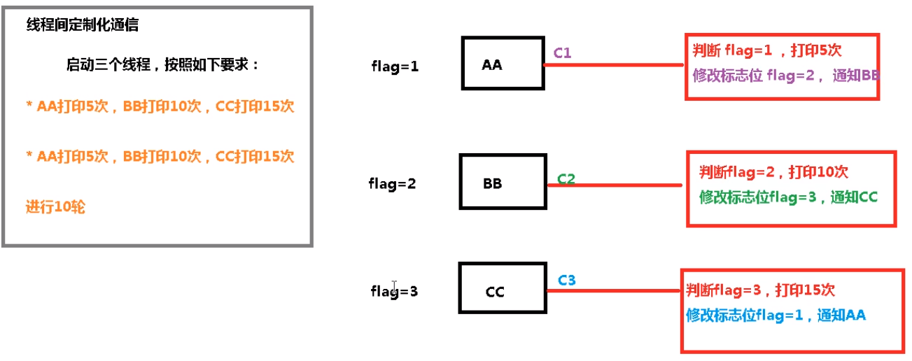

实现代码如下

```java
package com.ten.juc.lock;

import java.util.concurrent.locks.Condition;
import java.util.concurrent.locks.Lock;
import java.util.concurrent.locks.ReentrantLock;

// 第一步：创建资源类
class ShareResource {
    // 标志位
    private int flag = 1;   // 1:AA,2:BB,3:CC

    // 创建LOCK
    private Lock lock = new ReentrantLock();

    // 创建三个condition
    private Condition c1 =lock.newCondition();
    private Condition c2 =lock.newCondition();
    private Condition c3 =lock.newCondition();

    // 输出5次，loop为轮数
    public void print5(int loop) throws InterruptedException {
        // 上锁
        lock.lock();
        try {
            // 判断 干活 通知
            while (flag != 1){
                c1.await();
            }
            for (int i = 1; i <= 5; i++) {
                System.out.println(Thread.currentThread().getName() + "::" +i+ ": 轮数：" +loop);
            }
            // 通知之前先修改标志位
            flag = 2;
            // 通知BB
            c2.signal();
        } finally {
            // 解锁
            lock.unlock();
        }
    }
    // 输出10次，loop为轮数
    public void print10(int loop) throws InterruptedException {
        lock.lock();
        try {
            // 判断 干活 通知
            while (flag != 2){
                c2.await();
            }
            for (int i = 1; i <= 10; i++) {
                System.out.println(Thread.currentThread().getName() + "::" +i + ": 轮数：" +loop);
            }
            // 通知之前先修改标志位
            flag = 3;
            // 通知CC
            c3.signal();
        } finally {
            lock.unlock();
        }
    }
    // 输出15次，loop为轮数
    public void print15(int loop) throws InterruptedException {
        lock.lock();
        try {
            // 判断 干活 通知
            while (flag != 3){
                c3.await();
            }
            for (int i = 1; i <= 15; i++) {
                System.out.println(Thread.currentThread().getName() + "::" +i + ": 轮数：" +loop);
            }
            // 通知之前先修改标志位
            flag = 1;
            // 通知AA
            c1.signal();
        } finally {
            lock.unlock();
        }
    }

}
public class ThreadDemo3 {
    public static void main(String[] args) {
        ShareResource shareResource = new ShareResource();
        new Thread(()->{
            for (int i = 1; i <= 10; i++){
                try {
                    shareResource.print5(i);
                } catch (InterruptedException e) {
                    e.printStackTrace();
                }
            }
        },"AA").start();
        new Thread(()->{
            for (int i = 1; i <= 10; i++){
                try {
                    shareResource.print10(i);
                } catch (InterruptedException e) {
                    e.printStackTrace();
                }
            }
        },"BB").start();
        new Thread(()->{
            for (int i = 1; i <= 10; i++){
                try {
                    shareResource.print15(i);
                } catch (InterruptedException e) {
                    e.printStackTrace();
                }
            }
        },"CC").start();
    }
}
```


# 集合的线程安全

## ArrayList异常演示

下面以list集合演示线程不安全的情况，会出现ConcurrentModificationException并发修改异常。

```java
package com.ten.juc.lock;

import java.util.ArrayList;
import java.util.List;
import java.util.UUID;

/**
 * list线程不安全的演示
 */
public class ThreadDemo4 {
    public static void main(String[] args) {
        // 创建list集合
        List<String> list = new ArrayList<>();
        for (int i = 0; i < 30; i++){
            new Thread(() ->{
                // 生成随机数并添加到集合
                list.add(UUID.randomUUID().toString().substring(0,8));
                System.out.println(list);
            },String.valueOf(i)).start();
        }
    }
}
```

为什么会出现这个异常，通过观察list.add的源码可以发现，list.add方没有synchronized修饰，即没有加锁。

```java
/**
 * Appends the specified element to the end of this list.
 *
 * @param e element to be appended to this list
 * @return <tt>true</tt> (as specified by {@link Collection#add})
 */
public boolean add(E e) {
    ensureCapacityInternal(size + 1);  // Increments modCount!!
    elementData[size++] = e;
    return true;
}
```


### 解决方案-Vector

将上述的 List<String> list = new ArrayList<>();换成List<String> list = new Vector<>(); 再次进行测试，就不会报错了。通过观察Vector的源代码可以发现，add方法是有synchronized关键字修饰的，所以可以多线程修改。

```java
public synchronized void addElement(E obj) {
    modCount++;
    ensureCapacityHelper(elementCount + 1);
    elementData[elementCount++] = obj;
}
```

### 解决方案-Collections

将list集合换成List<String> list = Collections.synchronizedList(new ArrayList<>()); 再次进行测试也可以实现，但是以上两种都是比较古老的实现方式，实际上不经常用。

### 解决方案-CopyOnWriteArrayList

比较常用的多线程数组就是CopyOnWriteArrayList，他的实现的原理就是并发读，写的时候复制旧的数组内容，写完的时候再合并在一起。他的源码如下。

```java
/**
 * Appends the specified element to the end of this list.
 *
 * @param e element to be appended to this list
 * @return {@code true} (as specified by {@link Collection#add})
 */
public boolean add(E e) {
    final ReentrantLock lock = this.lock;
    lock.lock();	// 上锁
    try {
        Object[] elements = getArray();		// 获取数组
        int len = elements.length;			// 数组长度
        Object[] newElements = Arrays.copyOf(elements, len + 1);	// 创建新的数组
        newElements[len] = e;				// 写入新元素
        setArray(newElements);				// 合并
        return true;
    } finally {
        lock.unlock();						// 解锁
    }
}
```

**上述三种方案的所有代码**

```java
package com.ten.juc.lock;

import java.util.*;
import java.util.concurrent.CopyOnWriteArrayList;

/**
 * list线程不安全的演示
 */
public class ThreadDemo4 {
    public static void main(String[] args) {
        // 创建list集合
        //List<String> list = new ArrayList<>();
        //List<String> list = new Vector<>();   // 利用Vector解决
        //List<String> list = Collections.synchronizedList(new ArrayList<>());  // 用Collections解决
        List<String> list = new CopyOnWriteArrayList<>();   // 用CopyOnWriteArrayList解决
        for (int i = 0; i < 30; i++){
            new Thread(() ->{
                // 生成随机数并添加到集合
                list.add(UUID.randomUUID().toString().substring(0,8));
                System.out.println(list);
            },String.valueOf(i)).start();
        }
    }
}
```

## HashSet异常演示

以下代码也产生了并发修改异常

```java
// 演示HashSet线程不安全问题
Set<String> set = new HashSet<>();
for (int i = 0; i < 30; i++) {
    new Thread(() -> {
        // 生成随机数并添加到集合
        set.add(UUID.randomUUID().toString().substring(0, 8));
        System.out.println(set);
    }, String.valueOf(i)).start();
}
```

### 解决方案-CopyOnWriteArraySet

把set集合换成这个Set<String> set = new CopyOnWriteArraySet<>();就可以解决了

## HashMap异常演示

以下代码也产生了并发修改异常

```java
// 演示HashMap线程不安全问题
Map<String,String> map = new HashMap<>();
for (int i = 0; i < 30; i++) {
    String key = String.valueOf(i);
    new Thread(() -> {
        // 生成随机数并添加到集合
        map.put(key,UUID.randomUUID().toString().substring(0, 8));
        System.out.println(map);
    }, String.valueOf(i)).start();
}
```

### 解决方案-ConcurrentHashMap

将Map<String,String> map = new HashMap<>();换成Map<String,String> map = new ConcurrentHashMap<>(); 利用ConcurrentHashMap解决。


# 多线程锁

## synchronized

**synchronized**

锁的是当前对象this

**static synchronized**

锁的是当前的Class。

**synchronized实现同步的基础**：Java中的每一个对象都可以作为锁，具体表现为以下3中形式。

对于普通同步方法，锁是当前实例对象。

对于静态同步方法，锁是当前类的Class对象。

对于同步方法快，锁是synchronized括号里配置的对象。

## 公平锁和非公平锁

### 非公平锁

非公平锁可能会出现线程饿死的情况，它的效率高。

### 公平锁

公平锁阳光普照，不会出现线程饿死的情况，但是它每次都要询问是否有人占用资源，所以它的效率较低。

### 如何实现

通过查看ReentrantLock的源代码可以发现，在创建ReentrantLock的时候传入一个Boolean类型的参数即可，true为公平锁，false为非公平锁。

```java
/**
 * Creates an instance of {@code ReentrantLock}.
 * This is equivalent to using {@code ReentrantLock(false)}.
 */
public ReentrantLock() {
    sync = new NonfairSync();
}

/**
 * Creates an instance of {@code ReentrantLock} with the
 * given fairness policy.
 *
 * @param fair {@code true} if this lock should use a fair ordering policy
 */
public ReentrantLock(boolean fair) {
    sync = fair ? new FairSync() : new NonfairSync();
}
```


## 可重入锁

可重入锁也叫做**递归锁**，synchronized和lock都是可重入锁，**synchronized**是**隐式**的，**lock**是**显式**的。

### synchronized

synchronized的实现代码如下，外层开锁，里面的随便进入。

```java
package com.ten.juc.lock;

public class SyncLockDemo {
	//public synchronized void add(){
    //    add();
   // }
    public static void main(String[] args) {
      //  new SyncLockDemo().add();
        Object o = new Object();
        new Thread(() -> {
            synchronized (o) {
                System.out.println(Thread.currentThread().getName() + "外层");
                synchronized (o) {
                    System.out.println(Thread.currentThread().getName() + "中层");
                    synchronized (o) {
                        System.out.println(Thread.currentThread().getName() + "内层");
                    }
                }
            }
        }, "t1").start();
    }
}
```

### LOCK实现

```java
public class SyncLockDemo {

    public static void main(String[] args) {
        Lock lock = new ReentrantLock();
        new Thread(()->{
            try {
                // 上锁
                lock.lock();
                System.out.println(Thread.currentThread().getName()+"外层");
                try {
                    // 上锁
                    lock.lock();
                    System.out.println(Thread.currentThread().getName()+"内层");
                } finally {
                    // 解锁
                    lock.unlock();
                }
            } finally {
                // 解锁
                lock.unlock();
            }
        },"AA").start();
    }
}
```

所有的锁操作都要上锁和解锁，如果上述代码中的内层只上锁，没有解锁，只有他一个线程也可以运行，但是如果再加一个线程就不可以了，原因就是内层的锁没有释放，另一个线程继续等待锁。


## 死锁

### 什么是死锁

两个或者两个以上的进程在执行过程中，因为争夺资源而造成的一种相互等待的现象，如果没有外力干涉，他们无法在继续执行下去。

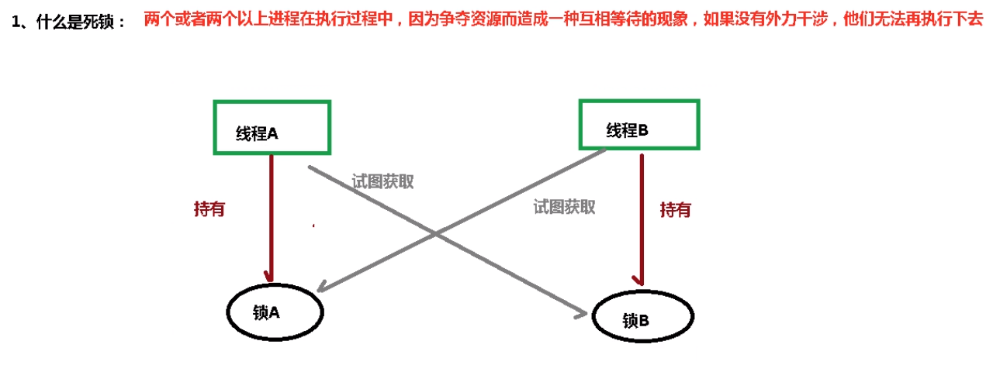

### 产生死锁的原因

1. 系统资源不足
2. 进程推进顺序不合适
3. 资源分配不当

### 验证是否是死锁

使用以下命令

1. **jps -l**：查出线程号，类似Linux的 ps -ef
2. **jstack+线程号**：jvm自带堆栈跟踪工具

```bash
E:\IdeaProject_code\juc>jps -l
11776 sun.tools.jps.Jps
8704 com.ten.juc.sync.DeadLock
11420
14572 org.jetbrains.jps.cmdline.Launcher

E:\IdeaProject_code\juc>jstack 8704
2022-03-04 15:26:01
Full thread dump Java HotSpot(TM) 64-Bit Server VM (25.221-b11 mixed mode):

"DestroyJavaVM" #14 prio=5 os_prio=0 tid=0x00000000032a2800 nid=0x3a88 waiting on condition [0x0000000000000000]
   java.lang.Thread.State: RUNNABLE

"A" #13 prio=5 os_prio=0 tid=0x000000001aa58000 nid=0x368c waiting for monitor entry [0x000000001b43f000]
   java.lang.Thread.State: BLOCKED (on object monitor)
        at com.ten.juc.sync.DeadLock.lambda$main$1(DeadLock.java:35)
        - waiting to lock <0x00000000d9560470> (a java.lang.Object)
        - locked <0x00000000d9560480> (a java.lang.Object)
        at com.ten.juc.sync.DeadLock$$Lambda$2/1078694789.run(Unknown Source)
        at java.lang.Thread.run(Thread.java:748)

"A" #12 prio=5 os_prio=0 tid=0x000000001aa51800 nid=0x36b8 waiting for monitor entry [0x000000001b33f000]
   java.lang.Thread.State: BLOCKED (on object monitor)
        at com.ten.juc.sync.DeadLock.lambda$main$0(DeadLock.java:22)
        - waiting to lock <0x00000000d9560480> (a java.lang.Object)
        - locked <0x00000000d9560470> (a java.lang.Object)
        at com.ten.juc.sync.DeadLock$$Lambda$1/1324119927.run(Unknown Source)
        at java.lang.Thread.run(Thread.java:748)

...........


Found one Java-level deadlock:
=============================
"A":
  waiting to lock monitor 0x000000000339bd48 (object 0x00000000d9560470, a java.lang.Object),
  which is held by "A"
"A":
  waiting to lock monitor 0x000000000339e3c8 (object 0x00000000d9560480, a java.lang.Object),
  which is held by "A"

Java stack information for the threads listed above:
===================================================
"A":
        at com.ten.juc.sync.DeadLock.lambda$main$1(DeadLock.java:35)
        - waiting to lock <0x00000000d9560470> (a java.lang.Object)
        - locked <0x00000000d9560480> (a java.lang.Object)
        at com.ten.juc.sync.DeadLock$$Lambda$2/1078694789.run(Unknown Source)
        at java.lang.Thread.run(Thread.java:748)
"A":
        at com.ten.juc.sync.DeadLock.lambda$main$0(DeadLock.java:22)
        - waiting to lock <0x00000000d9560480> (a java.lang.Object)
        - locked <0x00000000d9560470> (a java.lang.Object)
        at com.ten.juc.sync.DeadLock$$Lambda$1/1324119927.run(Unknown Source)
        at java.lang.Thread.run(Thread.java:748)

Found 1 deadlock.

```


# Callable接口

## 创建线程的几种方式

1. 继承Thead类
2. 实现Runnable接口
3. 实现Callable接口
4. 线程池

## Runnable和Callable的不同

1. 是否有返回值，Runnable没有返回值，Callable有返回值
2. 没有结果是否会出现异常，Runnable不会，Callable会抛出异常
3. 需要重写的方法不同，Runnable是run方法，Callable是call方法

Callable不能直接使用，需要寻找一个类来作为中间商，这个中间商就是FutureTask实现类（未来任务）

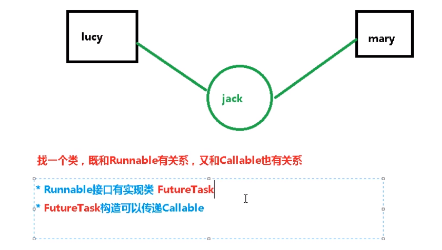

## 创建线程代码

```java
package com.ten.juc.callable;

import java.util.concurrent.Callable;
import java.util.concurrent.ExecutionException;
import java.util.concurrent.FutureTask;

// 用Runnable实现
class MyThread1 implements Runnable{

    @Override
    public void run() {
        System.out.println("MyThread1");
    }
}
// 用Callable实现
class MyThread2 implements Callable<Integer> {

    @Override
    public Integer call() throws Exception {
        return 200;
    }
}
public class CallableDemo {
    public static void main(String[] args) throws ExecutionException, InterruptedException {
        // 使用Runnable方式
        new Thread(new MyThread1(),"AA").start();

        // 使用FutureTask 未来任务，返回值只计算一次，后面有用到就直接返回
        FutureTask<Integer> futureTask1 = new FutureTask<>(new MyThread2());
        // 使用lombda表达式
        FutureTask<Integer> futureTask2 = new FutureTask<>(()->{
            return 1024;
        });

        new Thread(futureTask2,"BB").start();
        while (!futureTask2.isDone()){
            System.out.println("wait...");
        }
        System.out.println(futureTask2.get());
        System.out.println(futureTask2.get());  // 第二次直接返回结果，不用进行计算
        System.out.println(Thread.currentThread().getName() + " come over");

    }
}
```


# 辅助类

## 减少计数CountDownLatch

CountDownLatch类可以设置一个计算器，通过countDown方法来减一，使用await方法等待计数器不大于0，然后继续执行await方法之后的语句。具体实现代码如下。

```java
package com.ten.juc.juc;

import java.util.concurrent.CountDownLatch;

// 演示CountDownLatch
public class CountDownLatchDemo {
    // 6个同学陆续离开教室之后，班长锁门
    public static void main(String[] args) throws InterruptedException {
        // 创建CountDownLatch对象，设置初始值
        CountDownLatch countDownLatch = new CountDownLatch(6);
        for (int i = 1; i <= 6; i++) {
            new Thread(() ->{
                System.out.println(Thread.currentThread().getName() + " 号 离开了教室");
                // 操作一次就减一
                countDownLatch.countDown();
            },String.valueOf(i)).start();
        }
        // 如果不为0，就继续等待，如果为0了，就执行下面的输出
        countDownLatch.await();
        System.out.println(Thread.currentThread().getName() + "  over");
    }
}
```


## 循环栅栏CyclicBarrier

CyclicBarrier的意思是循环阻塞的意思，在使用中CyclicBarrier的构造方法第一个参数是目标障碍数，每次执行CyclicBarrier一次障碍数会加一，如果达到了目标障碍数，才会执行cyclicBarrier.await()之后的语句。可以将CyclicBarrier理解为+1的操作。

实现代码如下

```java
package com.ten.juc.juc;

import java.util.concurrent.CyclicBarrier;

// 演示 CyclicBarrier 循环栅栏
public class CyclicBarrierDemo {
    // 定义常量
    private static final int NUMBER = 7;

    public static void main(String[] args) {
        // 创建CyclicBarrier对象
        CyclicBarrier cyclicBarrier = new CyclicBarrier(NUMBER,()->{
            System.out.println("******7颗龙珠已集齐！！");
        });
        // 收集七颗龙珠过程
        for (int i = 1; i <= 7; i++) {
            new Thread(()->{
                try {
                    System.out.println(Thread.currentThread().getName() + "星龙珠已经收集了");
                    // 等待
                    cyclicBarrier.await();
                } catch (Exception e) {
                    e.printStackTrace();
                }
            },String.valueOf(i)).start();
        }
    }
}
```


## 信号灯Semaphore

当我们创建一个可扩展大小的线程池，并且需要在线程池内同时让有限数目的线程并发运行时，就需要用到Semaphore（信号灯机制），Semaphore 通常用于限制可以访问某些资源（物理或逻辑的）的线程数目，它是一个计数信号量，从概念上讲，信号量维护了一个许可集合，如有必要，在许可可用前会阻塞每一个acquire()，然后再获取该许可，每个release() 添加一个许可，从而可能释放一个正在阻塞的获取者。

```java
package com.ten.juc.juc;

import java.util.Random;
import java.util.concurrent.Semaphore;
import java.util.concurrent.TimeUnit;

// 6辆汽车，停3个车位
public class SemaphoreDemo {
    public static void main(String[] args) {
        // 创建Semaphore，设置许可数量
        Semaphore semaphore = new Semaphore(3);
        for (int i = 1; i <= 6; i++) {
            new Thread(()->{

                try {
                    // 占位
                    semaphore.acquire();
                    System.out.println(Thread.currentThread().getName() + " 抢占了车位");

                    // 等待
                    TimeUnit.SECONDS.sleep(new Random().nextInt(5));

                    System.out.println(Thread.currentThread().getName() + "----------离开了车位");
                } catch (InterruptedException e) {
                    e.printStackTrace();
                } finally {
                    // 释放
                    semaphore.release();
                }
            },String.valueOf(i)).start();
        }
    }
}
```


# 读写锁

## 简介

读写锁：一个资源可以被多个读线程访问，或者可以被一个写线程访问，但是不能同时存在读写线程，读写互斥，读读共享。

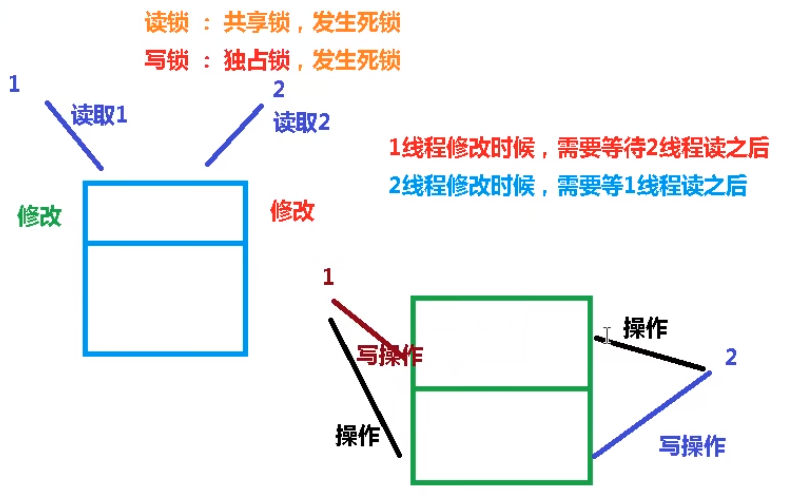

## 案例

```java
package com.ten.juc.readwrite;

import java.util.HashMap;
import java.util.Map;
import java.util.concurrent.TimeUnit;
import java.util.concurrent.locks.ReadWriteLock;
import java.util.concurrent.locks.ReentrantReadWriteLock;

// 创建资源类
class MyCatch{
    // 定义一个map，由于存储数据   因为涉及到取和读的次数比较多，所以用volatile
    private volatile Map<String,Object> map = new HashMap<>();
    // 定义读写锁
    private ReadWriteLock readWriteLock = new ReentrantReadWriteLock();
    // 存数据
    public void put(String key, Object value) {
        // 添加写锁
        readWriteLock.writeLock().lock();
        // 暂停一会
        try {
            System.out.println(Thread.currentThread().getName() + " 正在写数据" + key);
            TimeUnit.MILLISECONDS.sleep(300);
            // 写入
            map.put(key, value);
            System.out.println(Thread.currentThread().getName() + " 已写完" + key);
        } catch (InterruptedException e) {
            e.printStackTrace();
        } finally {
            // 释放写锁
            readWriteLock.writeLock().unlock();
        }

    }
    // 取数据
    public Object get(String key)  {
        Object result = null;
        // 添加读锁
        readWriteLock.readLock().lock();
        // 暂停一会
        try {
            System.out.println(Thread.currentThread().getName() + " 正在读取数据" + key);
            TimeUnit.MILLISECONDS.sleep(300);
            // 取数据
            result = map.get(key);
            System.out.println(Thread.currentThread().getName() + " 已读完" + key);
        } catch (InterruptedException e) {
            e.printStackTrace();
        } finally {
            // 释放读锁
            readWriteLock.readLock().unlock();
        }
        return result;
    }
}
public class ReadWriteLockDemo {
    public static void main(String[] args) {
        MyCatch myCatch = new MyCatch();
        // 先存5个
        for (int i = 1; i <= 5; i++){
            final int num = i;
            new Thread(() ->{
                myCatch.put(num+"",num);
            },String.valueOf(i)).start();
        }
        // 读取5个
        for (int i = 1; i <= 5; i++){
            final int num = i;
            new Thread(() ->{
                myCatch.get(num+"");
            },String.valueOf(i)).start();
        }
    }
}
```


## 读写锁的演变


## 读写锁的降级

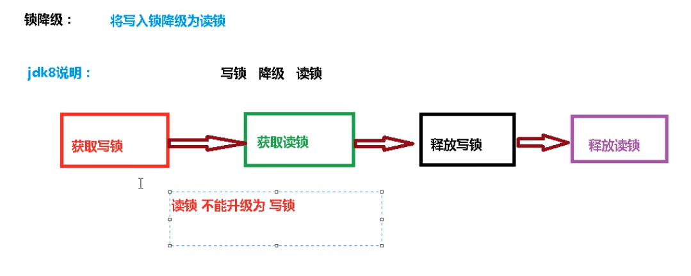

## **读写锁降级代码演示**

```java
package com.ten.juc.readwrite;

import java.util.concurrent.locks.ReentrantReadWriteLock;

// 读写锁的降级
public class Demotion {
    public static void main(String[] args) {
        ReentrantReadWriteLock readWriteLock = new ReentrantReadWriteLock();
        ReentrantReadWriteLock.WriteLock writeLock = readWriteLock.writeLock(); // 写锁
        ReentrantReadWriteLock.ReadLock readLock = readWriteLock.readLock();    // 读锁

        // 写锁
        writeLock.lock();
        System.out.println("write----------");

        // 读锁
        readLock.lock();
        System.out.println("read======");

        // 释放写锁
        writeLock.unlock();
        // 释放读锁
        readLock.unlock();
    }
}
```


# BlockingQueue阻塞队列

## 概述和架构

阻塞队列是一个共享队列，先进先出。当队列是空的时候，从队列中取元素会被阻塞，当队列满了，从队列中添加元素会别阻塞。

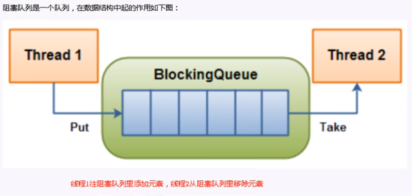

## 分类和核心方法介绍

### ArrayBlockiingQueue（常用）

由数组结构组成的有界阻塞队列

### LinkedBlockingQueue（常用）

由链表结构组成的阻塞队列。大小默认为integer.MAX_VALUE

### DelayQueue

使用优先级队列实现的延迟无界阻塞队列。

### PrioriityBlockingQueue

支持优先级排序的无界阻塞队列。

### SynchronousQueue

不存储元素的阻塞队列，也即单个元素的队列。

### LinkedTranferQueue

由链表组成的无界阻塞队列。

### LinkedBlockingDeque

有链表组成的双向阻塞队列。


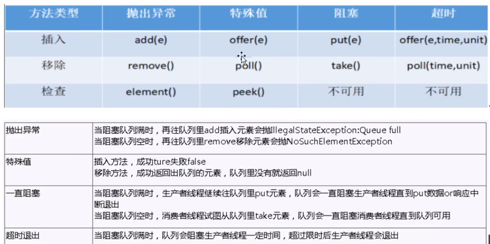


## 小结

1. 在多线程领域：所谓阻塞，在某些情况下会挂起线程（即阻塞），一旦条件满足，被挂起的线程又会自动唤起。


# 线程池 ThreadPool

## 概述和架构

线程池，是一种线程使用模式。线程过多会带来调度开销，进而影响缓存局部性和整体性能。而线程池维护者多个线程，等待着监督管理者分配可并发执行的任务。这避免了在处理短时间任务时创建于销毁线程的代价。线程池不仅能够保证内核的充分利用，还能防止过分调度。

**线程池优势**：线程池做的工作只要是控制运行的线程数量，处理过程中将任务放入队列，然后在线程创将后自动启动这些线程任务，如果线程数量超过了最大数量，超出数量的线程排队等候，等其他线程执行完毕，再从队列中取出任务来执行。

**特点：**

- 降低资源消耗：通过重复利用已创建的线程降低线程创建和销毁造成的消耗。
- 提高响应速度：当任务到达时，任务可以不需要等待线程创建就能立即执行。
- 提高线程的可管理性：线程是稀缺资源，如果无限制的创建，不仅会销毁系统资源，还回降低系统的稳定性，使用线程池可以统一的分配，调优和监控。
- java中的线程池是通过Executor框架实现的，该框架中用到了Executor，Executors，ExecutorService，ThreadPoolExecutor这几个类。

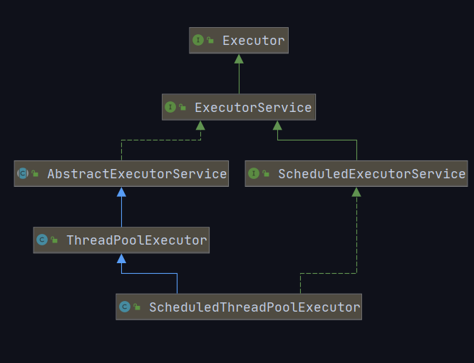


## 使用方式和底层原理

### newFixedThreadPoll（常用）

**作用：**创建一个可重用固定线程数的线程池，以共享的无界队列方式来运行这些线程。

**特征：**

- 线程池中的线程处于一定的量，可以很好的控制线程的并发量。
- 线程可以重复被使用，在显示关闭之前，都将一直存在。
- 超出一定量的线程被提交时候需要在队列中等待。


### 代码实现

```java
package com.ten.juc.pool;

import java.util.concurrent.Executor;
import java.util.concurrent.ExecutorService;
import java.util.concurrent.Executors;

// 常见的创建线程池
public class ThreadPoolDemo {
    public static void main(String[] args) {
        // 一池多线程
        //ExecutorService threadPool1 = Executors.newFixedThreadPool(5);

        // 一池一线程
        //ExecutorService threadPool2 = Executors.newSingleThreadExecutor();

        // 可扩容线程池
        ExecutorService threadPool3 = Executors.newCachedThreadPool();
        try {
            for (int i = 1; i <= 20; i++) {
                // 执行
                threadPool3.execute(()->{
                    System.out.println(Thread.currentThread().getName() + " 办理业务");
                });
            }
        } catch (Exception e){
            e.printStackTrace();
        } finally {
            // 释放资源
            threadPool3.shutdown();
        }
    }
}
```


通过观察这三种创建线程池方式源码可以发现，底层都是由ThreadPoolExecutor创建的。


### ThreadPoolExecutor的7个参数

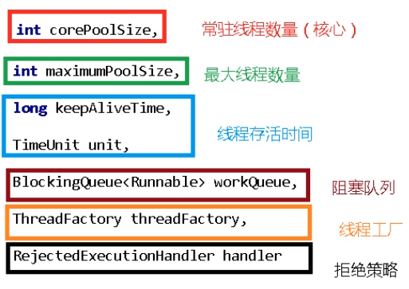

### 工作流程

主线程启动后，执行execute()方法，创建线程池（执行executor()之后才创建），假设最大线程数是5个，常住线程数是2，阻塞队列是3个。当常驻线程数1，2满了，后面来的3,4,5的就被安排到阻塞队列，如果这时还来了第6,7,8个，则启动线程池的其他三个没用的线程，直接给他们用，如果第9个来了，这个时候所有的线程和阻塞队列都满了，则执行handler的拒绝策略。

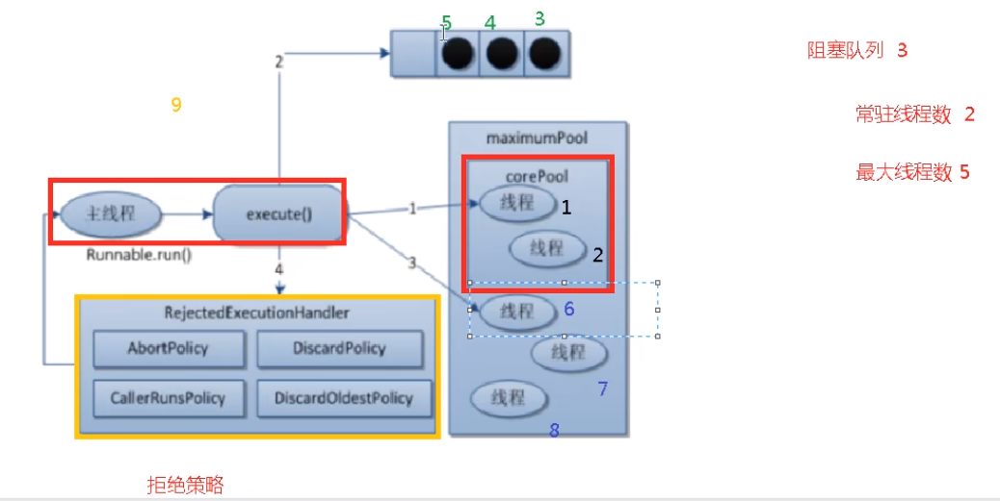


### 拒绝策略

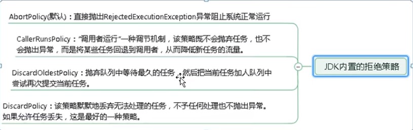


## 自定义线程池

实际上都会用自定义线程池。

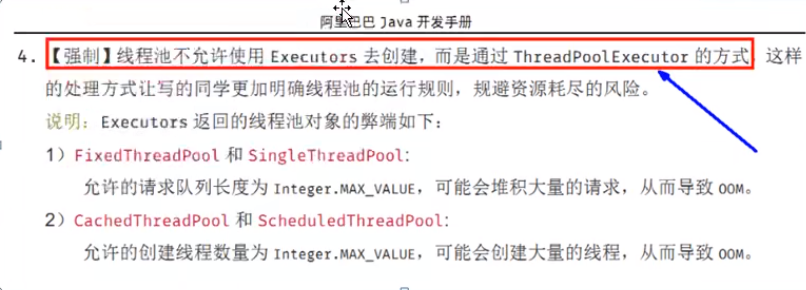

**代码演示**

```java
package com.ten.juc.pool;

import java.util.concurrent.*;

// 自定义线程池
public class ThreadPoolDemo2 {
    public static void main(String[] args) {
        ExecutorService threadPool = new ThreadPoolExecutor(
                2,
                5,
                2L,
                TimeUnit.SECONDS,
                new ArrayBlockingQueue<>(3),
                Executors.defaultThreadFactory(),
                new ThreadPoolExecutor.AbortPolicy()
        );
        try {
            for (int i = 1; i <= 20; i++) {
                // 执行
                threadPool.execute(()->{
                    System.out.println(Thread.currentThread().getName() + " 办理业务");
                });
            }
        } catch (Exception e){
            e.printStackTrace();
        } finally {
            // 释放资源
            threadPool.shutdown();
        }
    }
}
```


# Fork/Join 分支合并框架

Fork/Join它可以将一个大的任务拆分成多个子任务进行并行处理，最后将子任务结果合并成最后的计算结果，并进行输出。Fork/Join框架要完成两件事情：

Fork：把一个复杂任务进行分拆，大事化小。

Join：把拆分任务的结果进行合并

**代码演示**

```java
package com.ten.juc.forkjoin;

import java.util.concurrent.ExecutionException;
import java.util.concurrent.ForkJoinPool;
import java.util.concurrent.ForkJoinTask;
import java.util.concurrent.RecursiveTask;

// 演示分支合并
class MyTask extends RecursiveTask<Integer>{
    private static final  int VALUE = 10;    // 定义一个常量，用于判断两个数相加是否大于10
    private int begin;  // 开始的
    private int end;    // 结束的
    private int result; // 返回的结果

    // 构造方法
    public MyTask(int begin,int end){
        this.begin = begin;
        this.end = end;
    }
    @Override
    protected Integer compute() {
        // 如果他们相减小于10，则直接相加
        if((end - begin) <= VALUE){
            for (int i = begin; i <= end; i++){
                result = result + i;
            }
        } else {
            // 否则拆分
            // 计算中间的值
            int middle = (begin + end) / 2;
            // 向左拆分
            MyTask task1 = new MyTask(begin, middle);
            // 向右拆分
            MyTask task2 = new MyTask(middle + 1, end);
            // 拆分
            task1.fork();
            task2.fork();

            // 合并
            result = task1.join() + task2.join();
        }
        return result;
    }
}
public class ForkJoinDemo {
    public static void main(String[] args) throws ExecutionException, InterruptedException {
        // 创建任务对象
        MyTask myTask = new MyTask(0, 100);
        // 创建ForkJoinPool对象
        ForkJoinPool forkJoinPool = new ForkJoinPool();
        ForkJoinTask<Integer> forkJoinTask = forkJoinPool.submit(myTask);
        // 获取最终合并到的结果
        Integer result = forkJoinTask.get();
        System.out.println(result);
        // 关闭池对象
        forkJoinPool.shutdown();

    }
}
```


# CompletableFuture 异步回调

runAsync： 没有返回值

supplyAsync：有返回值

代码演示

```java
package com.ten.juc.completable;

import java.util.concurrent.CompletableFuture;
import java.util.concurrent.ExecutionException;
// 异步调用
public class CompletableFutureDemo {
    public static void main(String[] args) throws ExecutionException, InterruptedException {
        // 异步调用 没有返回值
        CompletableFuture<Void> completableFuture1 = CompletableFuture.runAsync(()->{
            System.out.println(Thread.currentThread().getName() + " --- completableFuture1");
        });
        completableFuture1.get();

        // 异步调用 有返回值
        CompletableFuture<Integer> completableFuture2 = CompletableFuture.supplyAsync(() ->{
            System.out.println(Thread.currentThread().getName() + " --- completableFuture2");
            // 模拟异常
            int i = 1 / 0;
            return 1024;
        });
        completableFuture2.whenComplete((t,u) -> {
            System.out.println("--------t=" +t);    // 返回值
            System.out.println("--------u=" +u);    // 异常
        }).get();
    }
}
```