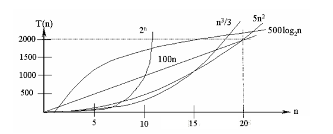
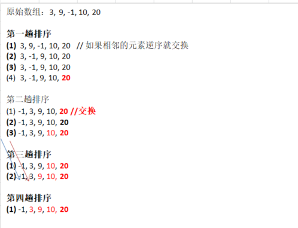
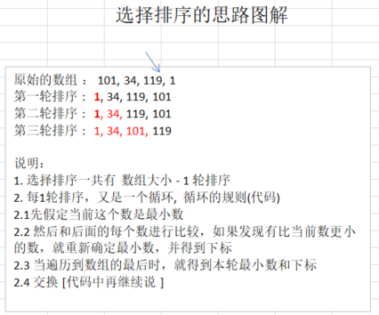
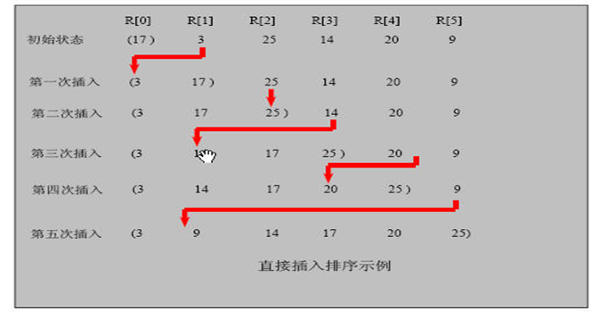
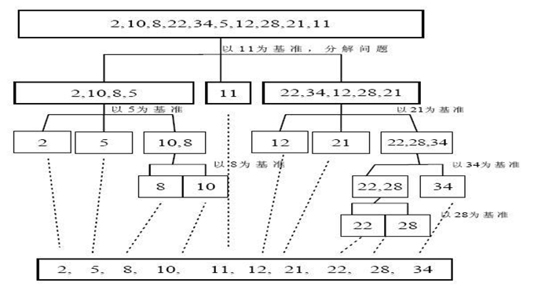
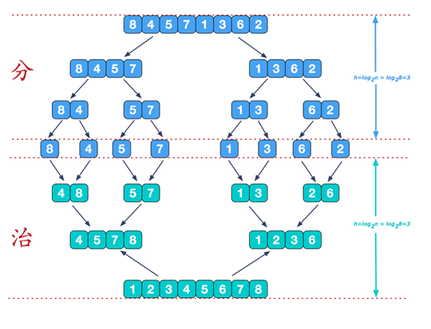
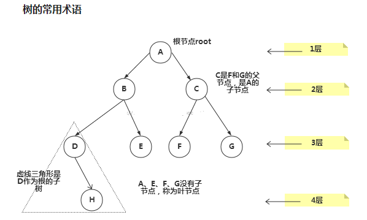
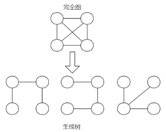

# Java数据结构和算法


# 第2章 数据结构和算法概述

## **2.1.1数据结构和算法的关系**

1. 数据data结构(structure)是一**门研究组织数据方式的学科**，有了编程语言也就有了数据结构.学好数据结构可以编写出更加漂亮,更加有效率的代码。

2. 要学习好数据结构就要多多考虑如何将生活中遇到的问题,用程序去实现解决.

3. **程序 = 数据结构 + 算法**

4. **数据结构是算法的基础,** 换言之，想要学好算法，需要把数据结构学到位。

   

## 2.2看几个实际编程中遇到的问题

### 2.2.1问题一-字符串替换问题


小结：需要使用到单链表数据结构

### 2.2.2一个五子棋程序


如何判断游戏的输赢，并可以完成存盘退出和继续上局的功能

1. 棋盘  **二维数组=>(稀疏数组)**-> 写入文件 【存档功能】
2. 读取文件->稀疏数组->二维数组 -> 棋盘 【接上局】

### 2.2.3约瑟夫(Josephu问题(丢手帕问题)

1. Josephu 问题为：设编号为1，2，… n的n个人围坐一圈，约定编号为k（1<=k<=n）的人从1开始报数，数到m 的那个人出列，它的下一位又从1开始报数，数到m的那个人又出列，依次类推，直到所有人出列为止，由此产生一个出队编号的序列。

   

2. **提示：**用一个不带头结点的循环链表来处理Josephu 问题：先构成一个有n个结点的单循环链表（**单向环形链表**），然后由k结点起从1开始计数，计到m时，对应结点从链表中删除，然后再从被删除结点的下一个结点又从1开始计数，直到最后一个结点从链表中删除算法结束。

3. 小结：完成约瑟夫问题，需要使用单向环形链表这个数据结构。

### 2.2.4其他常见问题


1. 修路问题 => 最小生成**树**(**加权值**)【**数据结构**】+ 普利姆算法
2. 最短路径问题 => 图+弗洛伊德算法
3. **汉诺塔** **=>** **分支算法**
4. 八皇后问题 => 回溯法

### 2.3线性结构和非线性结构

数据结构包括：**线性结构**和**非线性结构**。

#### 2.3.1**线性结构**

1. 线性结构作为最常用的数据结构，其特点是**数据元素之间存在一对一**的线性关系
2. 线性结构有两种不同的存储结构，即**顺序存储结构（数组）和链式存储结构（链表）**。顺序存储的线性表称为顺序表，顺序表中的**存储元素是连续**的
3. 链式存储的线性表称为链表，链表中的**存储元素不一定是连续的**，元素节点中存放数据元素以及相邻元素的地址信息
4. 线性结构常见的有：**数组、队列、链表和栈**，后面我们会详细讲解.

#### 2.3.2**非线性结构**

非线性结构包括：二维数组，多维数组，广义表，**树结构，图结构**


# **第3章 稀疏数组和队列**

## 3.1稀疏sparsearray数组

### 3.1.1先看一个实际的需求

编写的五子棋程序中，有**存盘退出**和续上盘的功能。


**分析问题**: 

因为该二维数组的很多值是默认值0, 因此记录了**很多没有意义的数据**.->**稀疏数组**。

### 3.1.2**基本介绍**

当一个数组中大部分元素为０，或者为同一个值的数组时，可以使用稀疏数组来保存该数组。

稀疏数组的处理方法是:

1. 记录数组**一共有几行几列，有多少个不同**的值
2. 把具有不同值的元素的行列及值记录在一个小规模的数组中，从而**缩小程序**的规模


### 3.1.3应用实例

1. 使用稀疏数组，来保留类似前面的二维数组(棋盘、地图等等)
2. 把稀疏数组存盘，并且可以从新恢复原来的二维数组数
3. 整体思路分析


4. 代码实现

   ```java
   package com.atguigu.sparsearray;
   
   public class SparseArray {
   
       public static void main(String[] args) {
           // 创建一个原始的二维数组11*11
           int chessArr1[][] = new int[11][11];
   
           // 0表示没有，1表示黑子，2表示蓝色
           chessArr1[1][2]=1;
           chessArr1[2][3]=2;
   
           // 输出原来的二维数组
           System.out.println("原来的二维数组：");
           for (int[] row : chessArr1) {
               for (int data : row) {
                   System.out.printf("%d\t",data);
               }
               System.out.println();
           }
   
           // 将二维数组转稀疏数组的思路
           // 1.遍历原来的二维数组得到非零数据的个数
           int sum = 0;
           for (int i = 0; i < chessArr1.length; i++) {
               for (int j = 0; j < chessArr1.length; j++) {
                   if (chessArr1[i][j] != 0){
                       sum++;
                   }
               }
           }
           System.out.println("sum="+sum);
   
   
           // 2.创建对应的稀疏数组
           int[][] sparseArr = new int[sum + 1][3];
   
           // 给稀疏数组赋值
           sparseArr[0][0] =11;
           sparseArr[0][1] =11;
           sparseArr[0][2] =sum;
   
           // 遍历二维数组，将非0的值存放到sparseArr中
           // count 用于记录是第几个非0数据
           int count = 0;
           for (int i = 0; i < chessArr1.length; i++) {
               for (int j = 0; j < chessArr1.length; j++) {
                   if (chessArr1[i][j] != 0){
                       count++;
                       sparseArr[count][0]=i;
                       sparseArr[count][1]=j;
                       sparseArr[count][2]=chessArr1[i][j];
                   }
               }
           }
   
           // 输出稀疏数组的形式
           System.out.println("=======得到的希尔数组为：=====");
           for (int i = 0; i < sparseArr.length; i++) {
               System.out.printf("%d\t%d\t%d\t\n",sparseArr[i][0],sparseArr[i][1],sparseArr[i][2]);
           }
   
           System.out.println();
   
           // 将稀疏数组恢复成原始的二维数组
   
           // 1.先读取稀疏数组的第一行，根据第一行的数据，创建原始的二维数组
           int[][] chessArr2 = new int[sparseArr[0][0]][sparseArr[0][1]];
   
           // 2.读取稀疏数组后几行（从第二行开始），并赋值给原始的二维数组
           for (int i = 1; i < sparseArr.length; i++) {
               chessArr2[ sparseArr[i][0]] [sparseArr[i][1] ]=sparseArr[i][2];
           }
   
           System.out.println("恢复后的数组");
           // 遍历二维数组，得到原始的数组
           for (int[] row : chessArr2) {
               for (int data : row) {
                   System.out.printf("%d\t",data);
               }
               System.out.println();
           }
   
       }
   
   }
   ```

   

### 3.1.4**课后练习**

要求：

1. 在前面的基础上，将稀疏数组保存到磁盘上，比如 map.data
2. 恢复原来的数组时，读取map.data 进行恢复


## 3.2队列

### 3.2.1队列的一个使用场景

银行排队的案例：


### 3.2.2**队列介绍**

1. 队列是一个**有序列表**，可以用**数组**或是**链表**来实现。
2. 遵循**先入先出**的原则。即：先存入队列的数据，要先取出。后存入的要后取出
3. 示意图：(使用数组模拟队列示意图)


### 3.2.3数组模拟队列思路

1. 队列本身是有序列表，若使用数组的结构来存储队列的数据，则队列数组的声明如下图, 其中 maxSize 是该队列的最大容量。
2. 因为队列的输出、输入是分别从前后端来处理，因此需要两个**变量front**及 **rear**分别**记录队列前后端**的下标，front 会随着数据输出而改变，而 rear则是随着数据输入而改变，如图所示:


当我们将数据存入队列时称为”addQueue”，addQueue 的处理需要有两个步骤：**思路分析** 

1. 将尾指针往后移：rear+1 , 当front == rear 【空】
2. 若尾指针 rear 小于队列的最大下标 maxSize-1，则将数据存入 rear所指的数组元素中，否则无法存入数据。 rear == maxSize - 1[队列满]

代码实现

```java
package com.atguigu.queue;

import java.util.Scanner;

public class ArrayQueueDemo {

    public static void main(String[] args) {

        // 创建一个队列
        ArrayQueue queue = new ArrayQueue(3);

        char key = ' ';     // 接收用户输入
        boolean loop = true;

        Scanner scanner = new Scanner(System.in);

        // 输出一个菜单
        while (loop){
            System.out.println("s(show)：显示队列");
            System.out.println("e(exit)：退出队列");
            System.out.println("a(add)：添加数据到队列");
            System.out.println("g(get)：从队列取出数据");
            System.out.println("h(head)：查看队列头的数据");

            key = scanner.next().charAt(0);     // 接收一个数据

            switch (key){
                case 's':
                    queue.showQueue();
                    break;

                case 'a':
                    System.out.println("请输入您要添加的数据：");
                    int value = scanner.nextInt();
                    queue.addQueue(value);
                    break;

                case 'g':
                    try {
                        int res = queue.getQueue();
                        System.out.println("取出的数据为："+res);
                    } catch (Exception e) {
                        e.printStackTrace();
                        System.out.println(e.getMessage());
                    }
                    break;

                case 'h':
                    try {
                        int res = queue.headQueue();
                        System.out.println("头队列为："+res);
                    } catch (Exception e) {
                        e.printStackTrace();
                        System.out.println(e.getMessage());
                    }
                    break;

                case 'e':
                    scanner.close();
                    loop = false;
                    break;

                default:
                    break;
            }
        }
        System.out.println("程序退出~~");

    }

}

// 使用数组模拟队列，编写一个ArrayQueue类
class ArrayQueue{

    private int maxSize;        // 表示数组最大容量
    private int rear;           // 头队列
    private int front;          // 尾队列
    private int []arr;          // 该数据用于存放数据，模拟队列

    // 创建队列的构造器
    public ArrayQueue(int arrMaxSize) {
        maxSize = arrMaxSize;
        arr = new int[maxSize];
        front = -1;             // 指向队列头部，分析出front是指向队列的前一个位置
        rear = -1;              // 指向队列尾部，即就是队列最后一个数据
    }

    // 判断队列是否已满
    public boolean isFull(){
        return rear == maxSize - 1;
    }

    // 判断队列是否为空
    public boolean isEmpty(){
        return rear == front;
    }

    // 添加数据到队列
    public void addQueue(int n){
        if (isFull()){
            System.out.println("队列已满~");
            return;
        }
        rear++;
        arr[rear]=n;
    }

    // 从队列中取出数据，出队列
    public int getQueue(){
        if (isEmpty()){
            throw new RuntimeException("队列为空，没有数据");
        }
        front++;
        return arr[front];
    }

    // 显示所有数据
    public void showQueue(){
        if (isEmpty()){
            System.out.println("队列为空，没有数据");
        }
        for (int i = 0; i < arr.length; i++) {
            System.out.printf("arr[%d]=%d\n",i,arr[i]);
        }
    }

    // 显示头数据，不是取出。
    public int headQueue(){
        if (isEmpty()){
            throw new RuntimeException("队列为空，没有数据");
        }
        return arr[front + 1];

    }

}
```

问题分析并优化

1. 目前数组使用一次就不能使用，没有达到复用的效果
2. 将这个数组使用算法，改进成一个**环形的队列** 取模： %

### 3.2.4**数组模拟环形队列**

对前面的数组模拟队列的优化，充分利用数组。因此将数组看做是一个环形的。(通过**取模**的方式来实现即可)

分析说明：

1. 尾索引的下一个为头索引时表示队列满，即将**队列容量空出一个作为约定**,这个在做判断队列满的
    时候需要注意 (rear + 1) % maxSize == front 满] 
2. rear == front [空]
3. 测试示意图:


4. 代码实现

   ```java
   package com.atguigu.queue;
   
   import java.util.Scanner;
   
   public class CircleArrayQueueDemo {
   
       public static void main(String[] args) {
   
           System.out.println("测试数组模拟环形队列的案例~~");
           
           // 创建一个队列
           CircleQueue queue = new CircleQueue(3);
   
           // 接收用户输入
           char key = ' ';
           boolean loop = true;
   
           Scanner scanner = new Scanner(System.in);
   
           // 输出一个菜单
           while (loop){
               System.out.println("s(show)：显示队列");
               System.out.println("e(exit)：退出队列");
               System.out.println("a(add)：添加数据到队列");
               System.out.println("g(get)：从队列取出数据");
               System.out.println("h(head)：查看队列头的数据");
   
               key = scanner.next().charAt(0);     // 接收一个数据
   
               switch (key){
                   case 's':
                       queue.showQueue();
                       break;
   
                   case 'a':
                       System.out.println("请输入您要添加的数据：");
                       int value = scanner.nextInt();
                       queue.addQueue(value);
                       break;
   
                   case 'g':
                       try {
                           int res = queue.getQueue();
                           System.out.println("取出的数据为："+res);
                       } catch (Exception e) {
                           e.printStackTrace();
                           System.out.println(e.getMessage());
                       }
                       break;
   
                   case 'h':
                       try {
                           int res = queue.headQueue();
                           System.out.println("头队列为："+res);
                       } catch (Exception e) {
                           e.printStackTrace();
                           System.out.println(e.getMessage());
                       }
                       break;
   
                   case 'e':
                       scanner.close();
                       loop = false;
                       break;
   
                   default:
                       break;
               }
           }
           System.out.println("程序退出~~");
   
       }
   
   }
   
   class CircleQueue{
   
       private int maxSize;        // 表示数组最大容量
       //1.front 变量的含义做一个调整： front 就指向队列的第一个元素, 也就是说 arr[front] 就是队列的第一个元素
       //front 的初始值 = 0
       private int front;          // 尾队列
   
       //2.  rear 变量的含义做一个调整：rear 指向队列的最后一个元素的后一个位置. 因为希望空出一个空间做为约定.
       //rear 的初始值 = 0
       private int rear;           // 头队列
   
       private int []arr;          // 该数据用于存放数据，模拟队列
   
       // 创建队列的构造器
       public CircleQueue(int arrMaxSize) {
           maxSize = arrMaxSize;
           arr = new int[maxSize];
       }
   
       // 判断队列是否已满
       public boolean isFull(){
           return (rear + 1) % maxSize == front;
       }
   
       // 判断队列是否为空
       public boolean isEmpty(){
           return rear == front;
       }
   
       // 添加数据到队列
       public void addQueue(int n){
           if (isFull()){
               System.out.println("队列已满~");
               return;
           }
           arr[rear] = n;
           rear = (rear + 1) % maxSize;
       }
   
       // 从队列中取出数据，出队列
       public int getQueue(){
           if (isEmpty()){
               throw new RuntimeException("队列为空，没有数据");
           }
           // 这里需要分析出front是指向队列的第一个元素
           // 1.先把front的值存入一个临时的变量
           // 2.将front后移，考虑取模
           // 3.将临时保存的值返回
           int value = arr[front];
           front = (front + 1) % maxSize;
           return value;
   
       }
   
       // 显示所有数据
       public void showQueue(){
           if (isEmpty()){
               System.out.println("队列为空，没有数据");
           }
           for (int i = front; i < front + size(); i++) {
               System.out.printf("arr[%d]=%d\n",i % maxSize,arr[i % maxSize]);
           }
       }
   
       // 获取有效个数
       public int size(){
           // rear = 1
           // maxSize = 3
           // front = 0
           return (rear +maxSize -front) % maxSize;
       }
   
       // 显示头数据，不是取出。
       public int headQueue(){
           if (isEmpty()){
               throw new RuntimeException("队列为空，没有数据");
           }
           return arr[front];
   
       }
   
   }
   ```

   

# 第4章 链表

## 4.1链表(Linked List)介绍

链表是有序的列表，但是它在内存中是存储如下


小结:

1. 链表是以节点的方式来存储,是**链式存储**
2. 每个节点包含 data 域， next 域：指向下一个节点.
3. 如图：发现链表的**各个节点不一定是连续存储**.
4. 链表分**带头节点的链表**和**没有头节点的链表**，根据实际的需求来确定

单链表(带头结点) **逻辑结构**示意图如下


## 4.2单链表的应用实例

使用带head头的单向链表实现 –水浒英雄排行榜管理完成对英雄人物的**增删改查**操作， 注: **删除和修改**,查找
可以考虑学员独立完成，也可带学员完成

1. 第一种方法在添加英雄时，直接添加到链表的尾部

   思路分析示意图：

   

2. 第二种方式在添加英雄时，**根据排名**将英雄插入到指定位置 (如果有这个排名，则添加失败，并给出提示)

   思路分析示意图：

   

3. 修改节点功能

   思路：1.先找到节点，通过遍历，2.temp.name = newHeroNode.name ;temp.nickName = newHeroNode.nickName

4. 删除节点

   思路分析示意图：

   

5. 代码演示：

```java
package com.atguigu.linkedlist;

public class SingleLinkedListDemo {

    public static void main(String[] args) {

        // 创建节点
        HeroNode hero1 = new HeroNode(1, "张三", "法外狂徒");
        HeroNode hero2 = new HeroNode(2, "李四", "法外狂徒2");
        HeroNode hero3 = new HeroNode(3, "王五", "法外狂徒3");
        HeroNode hero4 = new HeroNode(4, "阿六", "法外狂徒4");
        HeroNode hero5 = new HeroNode(5, "阿六5", "法外狂徒5");

        // 创建链表
        SingleLinkedList singleLinkedList = new SingleLinkedList();

/*        singleLinkedList.add(hero1);
        singleLinkedList.add(hero2);
        singleLinkedList.add(hero3);
        singleLinkedList.add(hero4);
        singleLinkedList.add(hero5);*/

        // 第二种方法，通过no排序
        singleLinkedList.addByOrder(hero1);
        singleLinkedList.addByOrder(hero3);
        singleLinkedList.addByOrder(hero2);
        singleLinkedList.addByOrder(hero4);
        singleLinkedList.addByOrder(hero5);

        System.out.println("更新前~~~");
        // 输出
        singleLinkedList.list();

        HeroNode newHeroNode = new HeroNode(2, "小李", "法外狂徒2~~~");

        // 更新
        singleLinkedList.update(newHeroNode);

        System.out.println("更新后~~~");

        singleLinkedList.list();

        singleLinkedList.delete(1);
        singleLinkedList.delete(2);
        singleLinkedList.delete(3);
        singleLinkedList.delete(4);
        singleLinkedList.delete(5);

        System.out.println("删除后~~");

        singleLinkedList.list();


    }

}

// 定义SingleLinkedList管理我的英雄
class SingleLinkedList{

    // 头结点
    private HeroNode head = new HeroNode(0,"","");

    // 添加节点到单向链表
    // 1.因为头结点不能动，定义一个临时变量，用来遍历
    // 2.先找到next为null的节点
    // 3.将头节点的next值指向下一个节点
    public void add(HeroNode heroNode){

        HeroNode temp = head;

        // 遍历，寻找最后一个next为空的节点
        while (true){
            // 找到链表最后
            if (temp.next == null){
                break;
            }

            // 如果没有找到，继续往后移
            temp = temp.next;
        }

        // temp.next指向heroNode
       temp.next = heroNode;
    }

    // 第二种方式在添加英雄时，根据排名将英雄插入到指定位置
    // (如果有这个排名，则添加失败，并给出提示
    public void addByOrder(HeroNode heroNode){

        HeroNode temp = head;

        // 定义flag，默认为false，表示插入的节点不存在
        boolean flag = false;

        while (true){
            // 最后一个，直接返回
            if (temp.next == null){
                break;
            }
            // 找到位置了，直接插入
            if (temp.next.no > heroNode.no){
                break;
            } else if (temp.next.no == heroNode.no){
                // 说明节点已经存在
                flag = true;
                break;
            }

            // 如果当前节点不符合，则将temp往后移
            temp = temp.next;
        }
        if (flag){  // 不能添加，节点已经存在
            System.out.printf("插入的节点 %d 已经存在，请重新插入！\n",heroNode.no);
        } else {
            // 将节点插到temp的后面
            heroNode.next = temp.next;
            temp.next = heroNode;
        }

    }

    // 修改
    // 找到原来的no，根据no修改名字和昵称
    public void update(HeroNode newHeroNode){

        if (head.next == null){
            System.out.println("链表为空");
            return;
        }

        HeroNode temp = head.next;

        // 默认没有找到no
        boolean flag = false;

        while (true){
            // 已经是最后一个节点
            if (temp == null ){
                break;
            }
            if (temp.no == newHeroNode.no){
                // 说明已经找到了
                flag = true;
                break;
            }
            // 往后移
            temp = temp.next;
        }
        if (flag){
            // 如果找到了，修改名字和昵称
            temp.name = newHeroNode.name;
            temp.nickName = newHeroNode.nickName;
        } else {
            System.out.printf("没有找到编号为 %d 的数据",newHeroNode.no);
        }

    }

    // 删除
    public void delete(int no){

        HeroNode temp = head;

        // 标志是否找到
        boolean flag = false;

        while (true){
            // 最后一个节点
            if (temp.next == null){
                break;
            }
            if (temp.next.no == no){
                // 找到了节点
                flag = true;
                break;
            }
            temp = temp.next;
        }

        if (flag){
            // 如果找到了，temp的下一个节点将指向删掉的节点的下一个节点
            // 被删除的节点，将不会有其它引用指向，会被垃圾回收机制回收
            temp.next= temp.next.next;

            //System.out.println("删除成功");
        } else {
            System.out.printf("没有找到编号为 %d 的节点",no);
        }

    }

    // 显示链表，遍历
    public void list(){
        // 判断是否为空
        if (head.next == null){
            System.out.println("链表为空");
            return;
        }

        // 通过一个辅助变量，遍历
        HeroNode temp = head.next;

        while (true){

            // 判断是否到链表最后
            if (temp == null){
                break;
            }

            // 输出节点信息
            System.out.println(temp);

            // temp 后移
            temp = temp.next;
        }

    }
    
}

// 定于HeroNode，每个HeroNode对象就是一个节点
class HeroNode{

    public int no;
    public String name;
    public String nickName;
    public HeroNode next;       // 指向下一个节点

    // 有参构造
    public HeroNode(int no, String name, String nickName) {
        this.no = no;
        this.name = name;
        this.nickName = nickName;
    }

    // 重写toString
    @Override
    public String toString() {
        return "HeroNode{" +
                "no=" + no +
                ", name='" + name + '\'' +
                ", nickName='" + nickName +
                '}';
    }

}
```


## 4.3单链表面试题(新浪、百度、腾讯）

单链表的常见面试题有如下:

1. 求单链表中有效节点的个数

   代码演示：

   ```java
   
   // 方法：获取到单链表的节点个数（如果是带头节点的链表，需要不统计头节点）
   /**
        *
        * @param head  链表的头结点
        * @return      返回的就是有效节点的个数
        */
   public static int getLength(HeroNode head){
   
       if (head.next == null){
           return 0;
       }
       int length = 0;
       // 定义一个辅助的变量，这里我们没有统计头节点
       HeroNode cur = head.next;
   
       while (cur != null){
           length++;
           cur = cur.next;
       }
   
       return length;
   }
   ```

   

2. 查找单链表中的倒数第k个结点 【新浪面试题】

   代码演示：

   ```java
   // 查找单链表中的倒数第K个节点【新浪面试题】
   // 思路
   // 1.编写一个方法，接收head节点，同时接收一个index
   // 2.index表示是倒数的第index个节点
   // 3.先把链表从头到尾遍历，得到链表的总的长度getLength
   // 4.得到size后，我们从链表的第一个开始遍历（size-index）个，就可以得到
   // 5.如果找到了，则返回节点，否则返回null
   public static HeroNode findLastIndexNode(HeroNode head,int index){
       // 判断如果链表为空，返回null
       if (head.next == null){
           return null;
       }
       // 第一遍历得到链表的长度（节点个数）
       int size = getLength(head);
   
       // 第二次遍历 size - index 位置，就是我们倒数的第k个节点
       // 先做一个index的检验
       if (index <= 0 || index > size){
           return null;
       }
   
       HeroNode cur = head.next;
   
       // 定义一个辅助变量，for 循环到倒数的index
       for (int i = 0 ; i < size - index ; i++ ){
           cur = cur.next;
       }
   
       return cur;
   
   }
   ```

   

3. 单链表的反转【腾讯面试题，有点难度】

   思路分析：

   

   

   

   代码演示：

   ```java
   // 实现单链表反转
   public static void reverseList(HeroNode head){
       // 判断链表是否为空,或者只有一个节点，无需反转，直接返回
       if (head.next == null || head.next.next ==null){
           return;
       }
   
       // 定义一个辅助的指针（变量），帮助我们遍历原来的链表
       HeroNode cur = head.next;
       HeroNode next = null;       // 当前节点[cur]的下一个节点
       HeroNode reverseHead = new HeroNode(0,"","");
   
       // 遍历原来的链表，每遍历一个节点，就将其取出，并放在新的链表reverseHead中 的最前端
       while (cur != null){
           next = cur.next;                // 先暂时保存当前节点的下一个节点，后面会用到
           cur.next = reverseHead.next;    // 将cur的下一个节点指向reverseHead的最前端
           reverseHead.next = cur;         // 将reverseHead和第一节点连接起来
           cur = next;                     // cur 下移一个
       }
       // 将head.next指向reverseHead.next，实现单链表反转
       head.next = reverseHead.next;
   }
   ```

   

4. 从尾到头打印单链表 【百度，要求方式1：反向遍历 。 方式2：Stack栈】

   思路分析：

   

   

   代码演示：

   ```java
   // 逆序打印单链表
   public static void reversePrint(HeroNode head){
       // 判断是否为空,或者是否只有一个
       if (head.next == null || head.next.next == null){
           return;
       }
   
       HeroNode cur = head.next;
   
       Stack<HeroNode> stack = new Stack<>();
   
       while (cur != null){
           stack.push(cur);    // 入栈
           cur = cur.next;     // 下移
       }
   
       // 出栈
       while (stack.size()>0){
           System.out.println(stack.pop());
       }
   }
   ```

   

5. 合并两个有序的单链表，合并之后的链表依然有序【课后练习.】


## 4.4双向链表应用实例

### 4.4.1双向链表的操作分析帝和实现

使用带head头的**双向链表**实现 –水浒英雄排行榜

管理单向链表的缺点分析: 

1. 单向链表，**查找的方向只能是一个方向**，而双向链表可以向前或者向后查找。
2. 单向链表不能自我删除，需要靠辅助节点 ，而双向 链表，则可以**自我删除**，所以前面我们单链表删除时节点，总是找到temp,temp是待删除节点的前一个节点(认真体会).
3. 示意图帮助理解删除


对上图的说明：

分析 双向链表的遍历，添加，修改，删除的操作思路===》代码实现

1) 遍历 方和 单链表一样，只是可以向前，也可以向后查找

2) 添加 (默认添加到双向链表的最后)

(1) 先找到双向链表的最后这个节点

(2) temp.next = newHeroNode

(3) newHeroNode.pre = temp;

3) **修改** 思路和 原来的单向链表一样.

4) **删除**

(1) 因为是双向链表，因此，我们可以实现自我删除某个节点

(2) 直接找到要删除的这个节点，比如temp

(3) temp.pre.next = temp.next

(4) temp.next.pre = temp.pre;

```java
package com.atguigu.linkedlist;

public class DoubleLinkedListDemo {

    public static void main(String[] args) {

        // 创建节点
        HeroNode2 hero1 = new HeroNode2(1, "张三", "法外狂徒");
        HeroNode2 hero2 = new HeroNode2(2, "李四", "法外狂徒2");
        HeroNode2 hero3 = new HeroNode2(3, "王五", "法外狂徒3");
        HeroNode2 hero4 = new HeroNode2(4, "阿六", "法外狂徒4");
        HeroNode2 hero5 = new HeroNode2(5, "阿六5", "法外狂徒5");
        HeroNode2 hero7 = new HeroNode2(7, "阿7", "法外狂徒5");

        DoubleLinkedList doubleLinkedList = new DoubleLinkedList();

        // 按照顺序插入
        doubleLinkedList.addByOrder(hero7);
        doubleLinkedList.addByOrder(hero5);
        doubleLinkedList.addByOrder(hero1);
        doubleLinkedList.addByOrder(hero3);
        doubleLinkedList.addByOrder(hero4);
        doubleLinkedList.addByOrder(hero2);

        System.out.println("按照编号顺序插入");
        doubleLinkedList.list();

      /*  doubleLinkedList.add(hero1);
        doubleLinkedList.add(hero2);
        doubleLinkedList.add(hero3);
        doubleLinkedList.add(hero4);
        doubleLinkedList.add(hero5);

        System.out.println("双向链表的便遍历");
        doubleLinkedList.list();

        HeroNode2 newHeroNode = new HeroNode2(2, "111111", "法外狂徒2");
        doubleLinkedList.update(newHeroNode);
        System.out.println("修改过后的链表");
        doubleLinkedList.list();

        doubleLinkedList.delete(2);
        System.out.println("删除过后的链表");
        doubleLinkedList.list();
*/

    }

}

// 创建一个双链表
class DoubleLinkedList{


    // 初始化头结点，头结点不要动，不存放具体的数据
    private HeroNode2 head = new HeroNode2(0,"","");

    // 返回头结点
    public HeroNode2 getHead() {
        return head;
    }

    // 按照编号顺序添加
    // (如果有这个排名，则添加失败，并给出提示
    public void addByOrder(HeroNode2 heroNode){

        HeroNode2 temp = head;

        // 定义flag，默认为false，表示插入的节点不存在
        boolean flag = false;

        while (true){
            // 最后一个，直接返回
            if (temp.next == null){
                break;
            }
            // 找到位置了，直接插入
            if (temp.next.no > heroNode.no){
                break;
            } else if (temp.next.no == heroNode.no){
                // 说明节点已经存在
                flag = true;
                break;
            }

            // 如果当前节点不符合，则将temp往后移
            temp = temp.next;
        }
        if (flag){  // 不能添加，节点已经存在
            System.out.printf("插入的节点 %d 已经存在，请重新插入！\n",heroNode.no);
        } else {
            // 将节点插到temp的后面
            // heroNode.next = temp.next;
            // temp.next = heroNode;
            if (temp.next != null){
                heroNode.next = temp.next;
                temp.next.pre = heroNode;
                temp.next = heroNode;
                heroNode.pre = temp;
            } else {
                temp.next = heroNode;
                heroNode.pre = temp;
            }
            
        }

    }

    // 遍历双向链表的方法
    public void list(){
        // 判断是否为空
        if (head.next == null){
            System.out.println("链表为空");
            return;
        }

        // 通过一个辅助变量，遍历
        HeroNode2 temp = head.next;

        while (true){

            // 判断是否到链表最后
            if (temp == null){
                break;
            }

            // 输出节点信息
            System.out.println(temp);

            // temp 后移
            temp = temp.next;
        }

    }

    // 添加一个 节点到链表最后
    public void add(HeroNode2 heroNode){

        HeroNode2 temp = head;

        // 遍历，寻找最后一个next为空的节点
        while (true){
            // 找到链表最后
            if (temp.next == null){
                break;
            }

            // 如果没有找到，继续往后移
            temp = temp.next;
        }

        // 当退出while循环是，temp指向了链表的最后
        // 形成了一个双向链表
        temp.next = heroNode;
        heroNode.pre = temp;

    }

    // 修改一个节点的内容，可以看到双向链表的节点内容修改和单链表一样
    // 找到原来的no，根据no修改名字和昵称
    public void update(HeroNode2 newHeroNode){

        if (head.next == null){
            System.out.println("链表为空");
            return;
        }

        HeroNode2 temp = head.next;

        // 默认没有找到no
        boolean flag = false;

        while (true){
            // 已经是最后一个节点
            if (temp == null ){
                break;
            }
            if (temp.no == newHeroNode.no){
                // 说明已经找到了
                flag = true;
                break;
            }
            // 往后移
            temp = temp.next;
        }
        if (flag){
            // 如果找到了，修改名字和昵称
            temp.name = newHeroNode.name;
            temp.nickName = newHeroNode.nickName;
        } else {
            System.out.printf("没有找到编号为 %d 的数据",newHeroNode.no);
        }

    }

    // 从双向链表中删除一个节点
    // 1 对于双向链表，我们可以直接找到要删除的这个节点
    // 2 找到后，自我删除
    // 删除
    public void delete(int no){

        if (head.next == null){
            System.out.println("链表为空，无法删除");
            return;
        }

        HeroNode2 temp = head.next;

        // 标志是否找到
        boolean flag = false;

        while (true){
            // 指向链表的最后
            if (temp == null){
                break;
            }
            if (temp.no == no){
                // 找到了节点
                flag = true;
                break;
            }
            temp = temp.next;
        }

        if (flag){
            // 如果找到了，temp的下一个节点将指向删掉的节点的下一个节点
            // 被删除的节点，将不会有其它引用指向，会被垃圾回收机制回收
            // temp.next= temp.next.next; [单链表]
            //System.out.println("删除成功");

            temp.pre.next = temp.next;

            // 有问题，如果是最后一个，出现null.pre空指针，所以先判断是否是最后一个
            if (temp.next != null){
                temp.next.pre = temp.pre;
            }

        } else {
            System.out.printf("没有找到编号为 %d 的节点",no);
        }

    }

}

// 定于HeroNode，每个HeroNode对象就是一个节点
class HeroNode2{

    public int no;
    public String name;
    public String nickName;
    public HeroNode2 next;       // 指向下一个节点
    public HeroNode2 pre;        // 指向前一个节点

    // 有参构造
    public HeroNode2(int no, String name, String nickName) {
        this.no = no;
        this.name = name;
        this.nickName = nickName;
    }

    // 重写toString
    @Override
    public String toString() {
        return "HeroNode{" +
                "no=" + no +
                ", name='" + name + '\'' +
                ", nickName='" + nickName +
                '}';
    }

}

```

### 4.4.2**课堂作业和思路提示**:

 双向链表的第二种添加方式,按照编号顺序 [示意图]按照单链表的顺序添加，稍作修改即可(已经加在4.4.1的代码中63-107行)。

```java
// 按照编号顺序添加
// (如果有这个排名，则添加失败，并给出提示
public void addByOrder(HeroNode2 heroNode){

    HeroNode2 temp = head;

    // 定义flag，默认为false，表示插入的节点不存在
    boolean flag = false;

    while (true){
        // 最后一个，直接返回
        if (temp.next == null){
            break;
        }
        // 找到位置了，直接插入
        if (temp.next.no > heroNode.no){
            break;
        } else if (temp.next.no == heroNode.no){
            // 说明节点已经存在
            flag = true;
            break;
        }

        // 如果当前节点不符合，则将temp往后移
        temp = temp.next;
    }
    if (flag){  // 不能添加，节点已经存在
        System.out.printf("插入的节点 %d 已经存在，请重新插入！\n",heroNode.no);
    } else {
        // 将节点插到temp的后面
        // heroNode.next = temp.next;
        // temp.next = heroNode;
        if (temp.next != null){
            heroNode.next = temp.next;
            temp.next.pre = heroNode;
            temp.next = heroNode;
            heroNode.pre = temp;
        } else {
            temp.next = heroNode;
            heroNode.pre = temp;
        }

    }

}
```


## 4.5单向环形链表应用场景

Josephu(约瑟夫、约瑟夫环) 问题

Josephu 问题为：设编号为1，2，… n的n个人围坐一圈，约定编号为k（1<=k<=n）的人从1开始报数，数到m 的那个人出列，它的下一位又从1开始报数，数到m的那个人又出列，依次类推，直到所有人出列为止，由此产生一个出队编号的序列。

提示：用一个不带头结点的循环链表来处理Josephu 问题：先构成一个有n个结点的单循环链表，然后由k结点起从1开始计数，计到m时，对应结点从链表中删除，然后再从被删除结点的下一个结点又从1开始计数，直到最后一个结点从链表中删除算法结束。


## 4.6 单向环形链表介绍


## 4.7 Josephu问题

约瑟夫问题的示意图 


**Josephu问题**

Josephu 问题为：设编号为1，2，… n的n个人围坐一圈，约定编号为k（1<=k<=n）的人从1开始报数，数到m 的那个人出列，它的下一位又从1开始报数，数到m的那个人又出列，依次类推，直到所有人出列为止，由此产生一个出队编号的序列。


**提示**

用一个不带头结点的循环链表来处理Josephu 问题：先构成一个有n个结点的单循环链表，然后由k结点起从1开始计数，计到m时，对应结点从链表中删除，然后再从被删除结点的下一个结点又从1开始计数，直到最后一个结点从链表中删除算法结束。


**约瑟夫问题-创建环形链表的思路图解**


**约瑟夫问题-小孩出圈的思路分析图**


## 4.8 Josephu问题的代码实现

```java
package com.atguigu.linkedlist;

public class Josephu {

    public static void main(String[] args) {

        CircleSingleLinkedList circleSingleLinkedList = new CircleSingleLinkedList();
        circleSingleLinkedList.addBoy(5);

        circleSingleLinkedList.showBoy();

        circleSingleLinkedList.countBoy(1,2,5);
    }

}


class CircleSingleLinkedList{

    // 先创建第一个节点，当前没有编号
    private Boy first = null;

    // 添加小孩节点，构建成一个环形的链表
    public void addBoy(int nums){

        // 校验输入的数据是否正确
        if (nums < 1){
            System.out.println("输入个数不正确");
            return;
        }
        // 辅助指针
        Boy curBoy = null;
        // 使用for来创建我们的环形链表
        for (int i = 1; i <= nums; i++) {

            // 根据编号创建小孩节点
            Boy boy = new Boy(i);
            // 如果是第一个小孩
            if (i == 1){
                first = boy;
                first.setNext(first);   // 构成环
                curBoy = first;         // 指向第一个小孩
            } else {
                curBoy.setNext(boy);
                boy.setNext(first);
                curBoy = boy;
            }

        }
    }

    // 遍历当前的环形单链表
    public void showBoy(){

        // 判断链表是否为空
        if (first == null){
            System.out.println("没有任何小孩");
            return;
        }

        // 因为first不能动，我们仍然使用一个辅助指针完成遍历
        Boy curBoy = first;

        while (true){

            System.out.printf("小孩的编号 %d \n",curBoy.getNo());
            // 遍历完毕
            if (curBoy.getNext() == first){
                break;
            }

            // curBoy后移
            curBoy = curBoy.getNext();

        }

    }

    // 根据用户的输入，计算出小孩出圈的顺序
    /**
     *
     * @param startNo   表示从第几个孩子开始数数
     * @param countNum  表示数几下
     * @param nums      表示最初有多少个孩子
     */
    public void countBoy(int startNo ,int countNum ,int nums){
        // 先对数据校验
        if (first == null || startNo <1 || countNum > nums){
            System.out.println("参数有误，请重新输入");
            return;
        }

        // 创建一个辅助节点，帮忙完成小孩出圈
        Boy helper = first;
        // 遍历，让helper指向链表的最后
        while (true){
            // 说明helper已经指向最后小孩节点
            if (helper.getNext() == first){
                break;
            }
            // 往后移
            helper = helper.getNext();
        }

        // 报数前，先移动到指定的个数作为开始
        for (int j = 0; j < startNo - 1; j++) {
            first = first.getNext();
            helper = helper.getNext();
        }

        // 报数时，遍历链表，从指定开始的数，根据要移动的次数（countNum -1）开始遍历，数数
        while (true){
            // 说明圈中只有一个小孩
            if (helper == first){
                break;
            }

            // 开始数数,让first 和 helper 同时移动到countNum -1
            for (int i = 0; i < countNum - 1; i++) {
                first = first.getNext();
                helper = helper.getNext();
            }
            // 这是first指向的节点就是要出圈的节点
            System.out.printf("小孩 %d 已经出圈 \n",first.getNo());
            first = first.getNext();    // 后移
            helper.setNext(first);      // 指向first

        }

        System.out.printf("最后留在圈中的小孩编号 %d \n",first.getNo());

    }

}

// 创建一个Boy类，表示一个节点
class Boy{

    private int no ;        // 编号
    private Boy next;       // 指向下一个节点，默认为null

    public Boy(int no) {
        this.no = no;
    }

    public int getNo() {
        return no;
    }

    public void setNo(int no) {
        this.no = no;
    }

    public Boy getNext() {
        return next;
    }

    public void setNext(Boy next) {
        this.next = next;
    }
}
```


# 第5章 栈

## 5.1 栈的一个实际需求

请输入一个表达式

计算式:[**7\*2\*2-5+1-5+3-3**] **点击计算****【****如下图****】**


请问: 计算机底层是如何运算得到结果的？ 注意不是简单的把算式列出运算,因为我们看这个算式 7 * 2 * 2 - 5, 但是计算机怎么理解这个算式的(对计算机而言，它接收到的就是一个字符串)，我们讨论的是这个问题**。-> **栈

## 5.2 栈的介绍

1. 栈的英文为(stack)
2. 栈是一个**先入后出**(FILO-First In Last Out)的有序列表。
3. 栈(stack)是限制线性表中元素的插入和删除**只能在线性表的同一端**进行的一种特殊线性表。允许插入和删除的一端，为变化的一端，称为**栈顶**(Top)，另一端为固定的一端，称为**栈底**(Bottom)。
4. 根据栈的定义可知，最先放入栈中元素在栈底，最后放入的元素在栈顶，而删除元素刚好相反，最后放入的元素最先删除，最先放入的元素最后删除

5. 出栈(pop)和入栈(push)的概念(如图所示)


## 5.3 栈的应用场景

1. 子程序的调用：在跳往子程序前，会先将下个指令的地址存到堆栈中，直到子程序执行完后再将地址取出，以回到原来的程序中。  
2. 处理递归调用：和子程序的调用类似，只是除了储存下一个指令的地址外，也将参数、区域变量等数据存入堆栈中。
3. 表达式的转换[中缀表达式转后缀表达式]与求值(实际解决)。
4. 二叉树的遍历。
5. 图形的深度优先(depth一first)搜索法。


## 5.4栈的快速入门

1. 用**数组模拟栈**的使用，由于栈是一种有序列表，当然可以使用数组的结构来储存栈的数据内容，下面我们就用数组模拟栈的**出栈**，**入栈**等操作。

2. 实现思路分析,并画出示意图

   

   代码实现

   ```java
   package com.atguigu.stack;
   
   import java.util.Scanner;
   
   public class ArrayStackDemo {
   
       public static void main(String[] args) {
   
           ArrayStack stack = new ArrayStack(4);
           String key = "";
           // 控制程序是否退出
           boolean loop = true;
           Scanner scanner = new Scanner(System.in);
   
           while (loop){
               System.out.println("show：表示展示栈的所有的数据");
               System.out.println("exit：表示退出程序");
               System.out.println("push：表示添加数据到栈（入栈）");
               System.out.println("pop：表示出栈");
               System.out.println("请输入您的选择：");
               key = scanner.next();
   
               switch (key){
                   case "show":
                       stack.list();
                       break;
   
                   case "push":
                       System.out.println("请输入您要添加的数据");
                       int value = scanner.nextInt();
                       stack.push(value);
                       break;
   
                   case "pop":
                       try {
                           int res = stack.pop();
                           System.out.printf("您要出栈的数据是 %d \n",res);
                       } catch (Exception e) {
                           e.printStackTrace();
                           System.out.println(e.getMessage());
                       }
                       break;
   
                   case "exit":
                       scanner.close();
                       loop = false;
                       break;
   
                   default:
                       break;
               }
           }
   
           System.out.println("程序已退出~~");
   
       }
   
   }
   
   // 定义一个ArrayStack 表示栈
   class ArrayStack{
   
       private int maxSize;    // 栈的大小
       private int[] stack;    // 数组，数组模拟栈，数据就放在该数组
       private int top = -1;   // 栈顶，初始化为-1
   
       // 构造器
       public ArrayStack (int maxSize){
           this.maxSize = maxSize;
           stack = new int[maxSize];
       }
   
       // 栈满
       public boolean isFull(){
           return top == maxSize -1;
       }
   
       // 栈空
       public boolean isEmpty(){
           return top == -1;
       }
   
       // 入栈
       public void push(int value){
           if (isFull()){
               System.out.println("栈已经满啦");
           }
   
           top++;
           stack[top]=value;
       }
   
       // 出栈，将栈顶的数据返回
       public int pop(){
           if (isEmpty()){
               // 抛出异常
               throw new RuntimeException("栈为空，出栈失败");
           }
           int value = stack[top];
           top--;
           return value;
       }
   
       // 显示栈的情况[遍历栈]，遍历时，需要从栈顶开始显示数据
       public void list(){
           if (isEmpty()){
               System.out.println("栈为空，显示栈失败");
               return;
           }
           // 需要从栈顶开始显示数据
           for (int i = top; i>=0 ; i--){
               System.out.printf("stack[%d] = %d \n",i,stack[i]);
           }
       }
   
   }
   ```

   

3. **课堂练习**，将老师写的程序改成使用**链表来模拟栈**.[单链表]

   思路分析：
   
   1. 先定义一个节点类Node
      - int no：节点编号
      - Node next：下一个节点
   2. 再定义一个单链表模拟数组
      - maxSize:存储节点的最大个数（既是模拟栈的大小）
      - isEmpty：判断栈是否为空
      - isFull：判断栈是否已满
      - add:模拟出栈（push）
      - pop：模拟出栈
      - list：查看栈的情况（使用了单链表的逆序输出：方式一：数组，方式二：栈）
   
   ```java
   package com.atguigu.stack.practice;
   
   import java.util.ArrayList;
   import java.util.Scanner;
   import java.util.Stack;
   
   public class TestStackByLinkedList {
   
       public static void main(String[] args) {
   
           SingleLinkedList singleLinkedList = new SingleLinkedList();
   
           singleLinkedList.setMaxSize(4);     // 设置最大节点数，模拟栈的最大数
           String key = "";                    // 用户输入的字符串
           boolean loop = true;                // 控制循环
           Scanner scanner = new Scanner(System.in);
   
           while (loop){
               System.out.println("add：添加节点，模拟入栈");
               System.out.println("exit：退出");
               System.out.println("pop：弹出节点，模拟出栈");
               System.out.println("list：遍历链表，模拟展示所以数据");
               System.out.println("请输入您要选择的选项：");
               key = scanner.next();
               switch (key){
                   case "add":
                       System.out.println("请输入您要添加的数据(数字)：");
                       int value = scanner.nextInt();
                       Node node = new Node(value);
                       singleLinkedList.add(node);
                       break;
   
                   case "pop":
                       try {
                           singleLinkedList.pop();
                       } catch (Exception e) {
                           e.printStackTrace();
                           System.out.println(e.getMessage());
                       }
                       break;
   
                   case "list":
                       singleLinkedList.list();
                       break;
   
                   case "exit":
                       scanner.close();
                       loop = false;
                       break;
   
                   default:
                       break;
   
               }
           }
           System.out.println("程序已退出~~");
   
       }
   
   }
   
   // 定义单链表模拟栈
   class SingleLinkedList{
   
       private int maxSize;    // 表示链表最大存储的节点
   
       public void setMaxSize(int maxSize) {
           this.maxSize = maxSize;
       }
   
       // 创建一个头head
       Node head = new Node(0);
   
       // 为空
       public boolean isEmpty(){
           return head.next == null;
       }
   
       // 判断是否已达到最大数量
       public boolean isFull(){
   
           Node temp = head;
           int count = 0;      // 定义一个count，,记录节点个数，用到判断是否已满
           while (true){
               // 说明已经找到了
               if (temp.next == null){
                   break;
               }
               // 下移
               count++;
               temp = temp.next;
           }
           // 将count和maxSize比较
           if (maxSize != count){
               return false;
           }
           //System.out.println("链表模拟栈已满~~");
           return true;
       }
   
       // 添加节点
       public void add(Node node){
           // 判断是否已满
           if (isFull()){
               System.out.println("栈已经满啦~~~");
           }
   
           // 定义一个辅助变量
           Node temp = head;
   
           while (true){
               // 说明找到了最后一个
               if (temp.next ==null){
                   break;
               }
               // 后移
               temp = temp.next;
           }
           // 将添加的节点加到链表中
           temp.next = node;
       }
   
       // 模拟出栈，将链表最后的一个元素弹出去，模拟栈的先进后出
       public void pop (){
           // 判断是否为空
           if (isEmpty()){
               throw new RuntimeException("模拟栈为空~~");
           }
   
           Node temp = head;
   
           while (true){
               // 说明已经 找到最后一个的前一个
               if (temp.next.next == null){
                   break;
               }
               // 下移
               temp = temp.next;
           }
           System.out.printf("出栈的节点是 %d \n",temp.next.no);
           temp.next = null;
   
       }
   
       // 展示所以的【遍历】，模拟栈的先进后出，即逆序输出链表
       // 方法一：用数组
       // 方法二：用栈
       public void list(){
   
           if (isEmpty()){
               System.out.println("模拟栈为空哦~~");
               return;
           }
           Node temp = head;
   
           // 方法一：利用数组
           ArrayList<Node> arrayList = new ArrayList<>();
           while (true){
               if (temp.next == null){
                   break;
               }
               arrayList.add(temp.next);
               temp = temp.next;
           }
           // 遍历数组
           for (int i = arrayList.size() -1 ; i>=0 ; i--){
               System.out.println("栈的情况为（利用栈）："+arrayList.get(i));
           }
   
           // 方法二：利用栈
          /* Stack<Node> stack = new Stack<>();
           while (true){
               if (temp.next == null){
                   break;
               }
               stack.push(temp.next);
               temp = temp.next;
               //System.out.println("栈的情况为："+temp.no);
   
           }
           while (stack.size()>0){
               System.out.println("栈的情况为（利用栈）："+stack.pop());
           }*/
       }
   
   
   }
   
   // 定义链表节点
   class Node{
       public int no;      // 编号
       public Node next;   // 下一个节点
   
       public Node(int no){
           this.no = no;
       }
   
       @Override
       public String toString() {
           return "Node{" +
                   "no=" + no +
                   '}';
       }
   }
   ```
   
   

## 5.5 栈实现综合计数器（中缀表达式）

使用栈来实现综合计算器-


思路分析：


- 代码实现[先实现一位运算，再扩展到多位运算]

  ```java
  package com.atguigu.stack;
  
  public class Calculator {
  
      public static void main(String[] args) {
  
          String expression = "300+20*6-2";  // 如果做多位数的为题？
          // 创建两个栈，数栈，一个符号栈
          ArrayStack2 numStack = new ArrayStack2(10);
          ArrayStack2 operStack = new ArrayStack2(10);
          // 定义相关的变量
          int index = 0;  // 用于扫描
          int num1 = 0;
          int num2 = 0;
          int oper = 0;
          int res = 0;
          char ch = ' ';      // 将每次扫描得到的存到ch
          String keepNum = "";    // 用于拼接，多位数
  
          while (true){
              // 依次得到expression的每一个字符
              ch = expression.substring(index,index+1).charAt(0);
              // 判断ch是什么，然后做相应的操作
              if (operStack.isOper(ch)){      // 如果是运算符
                  if (!operStack.isEmpty()){  // 判断当前符号是否为空
                      //如果符号栈有操作符，就进行比较,如果当前的操作符的优先级小于或者等于栈中的操作符，
                      // 就需要从数栈中pop出两个数,在从符号栈中pop出一个符号，
                      // 进行运算，将得到结果，入数栈，然后将当前的操作符入符号栈，
                      if (operStack.priority(ch) <= operStack.priority(operStack.peek())){
                          num1 = numStack.pop();
                          num2 = numStack.pop();
                          oper = operStack.pop();
                          res = numStack.cal(num1,num2,oper);
                          // 将运算结果入数栈
                          numStack.push(res);
                          operStack.push(ch);
                      } else {
                          // 如果当前的操作符的优先级大于栈中的操作符， 就直接入符号栈.
                          operStack.push(ch);
                      }
  
                  } else {
                      // 如果发现当前的符号栈为 空，就直接入栈
                      operStack.push(ch);
                  }
              } else {
                  // 如果是数字，直接入数栈
                  // numStack.push(ch -48);  // ?"1+3" char 型的ASCLL码，1 --> 48
                  // 分析思路
                  // 1.当处理多位数时，不能发现是一个数入栈，因为他可能是多位数
                  // 2.在处理数，需要向expression的表达式index后再看一位，如果是数就进行扫描，如果是符号就直接入栈
                  // 3.因此需要定义一个字符串，用于拼接
  
                  keepNum += ch;  // 拼接字符串，处理多位数
  
                  // 如果ch是最后一个，直接入栈
                  if (index == expression.length() -1){
                      numStack.push(Integer.parseInt(keepNum));
                  } else {
                      // 入栈前判断表达式下一个是否为符号，如果是符号，直接入栈，不是符号，拼接字符串
                      // 注意：是看后一位，不是index++
                      if (operStack.isOper(expression.substring(index + 1, index + 2).charAt(0))) {
                          numStack.push(Integer.parseInt(keepNum));
                          // 重要！！！！清空keepNum
                          keepNum = "";
                      }
                  }
  
              }
              // 下移判断下一个字符
              index++;
              if (index >= expression.length()){
                  break;
              }
          }
  
          // 当表达式扫描完毕，就顺序的从 数栈和符号栈中pop出相应的数和符号，并运行.
          while (true){
              // 如果运算符是空，数栈只有一个，说明是最后一个
              if (operStack.isEmpty()){
                  break;
              }
  
              num1 = numStack.pop();
              num2 = numStack.pop();
              oper = operStack.pop();
              res = numStack.cal(num1,num2,oper);
              numStack.push(res);
  
  
          }
          int res2 = numStack.pop();
          System.out.printf("表达式 %s = %d",expression,res2);
      }
  
  }
  
  
  
  // 定义一个ArrayStack 表示栈
  class ArrayStack2{
  
      private int maxSize;    // 栈的大小
      private int[] stack;    // 数组，数组模拟栈，数据就放在该数组
      private int top = -1;   // 栈顶，初始化为-1
  
      // 构造器
      public ArrayStack2 (int maxSize){
          this.maxSize = maxSize;
          stack = new int[maxSize];
      }
  
      // 增加一个方法，返回当前栈顶的值，但不是真正的pop
      public int peek(){
          return stack[top];
      }
  
      // 栈满
      public boolean isFull(){
          return top == maxSize -1;
      }
  
      // 栈空
      public boolean isEmpty(){
          return top == -1;
      }
  
      // 入栈
      public void push(int value){
          if (isFull()){
              System.out.println("栈已经满啦");
          }
  
          top++;
          stack[top]=value;
      }
  
      // 出栈，将栈顶的数据返回
      public int pop(){
          if (isEmpty()){
              // 抛出异常
              throw new RuntimeException("栈为空，出栈失败");
          }
          int value = stack[top];
          top--;
          return value;
      }
  
      // 显示栈的情况[遍历栈]，遍历时，需要从栈顶开始显示数据
      public void list(){
          if (isEmpty()){
              System.out.println("栈为空，显示栈失败");
              return;
          }
          // 需要从栈顶开始显示数据
          for (int i = top; i>=0 ; i--){
              System.out.printf("stack[%d] = %d \n",i,stack[i]);
          }
      }
  
      // 返回运算符的优先级别
      public int priority(int oper){
  
          if (oper == '*' || oper == '/'){
              return 1;
          }
          if (oper == '+' || oper == '-'){
              return 0;
          }else {
              return -1;  // 假设只有+,-,*, /
          }
  
      }
      // 判断是否是运算符
      public boolean isOper(int val){
          return val == '+' || val == '-' || val == '*' || val == '/';
      }
  
      // 运算
      public int cal(int num1,int num2,int oper){
          int res = 0;    // 用于保存计算结果
          switch (oper){
              case '+':
                  res = num1 + num2;
                  break;
  
              case '-':
                  res = num2 - num1;
                  break;
  
              case '*':
                  res = num1 * num2;
                  break;
  
              case '/':
                  res = num2 / num1;
                  break;
  
              default:
                  break;
          }
          return res;
      }
  
  }
  ```

  

  课后练习：给表达式加入小括号

## 5.6 逆波兰计算器


前缀：从右向左扫描

中缀：平常的运算

后缀：从左向右扫描，下面的元素减去上面的元素


我们完成一个逆波兰计算器，要求完成如下任务


1. 输入一个逆波兰表达(后缀表达式)，使用栈(Stack),计算其结果

2. 支持小括号和多位数整数，因为这里我们主要讲的是数据结构，因此计算器进行简化，只支持对整数的计算。

3. 思路分析

   ```java
   例如: (3+4)×5-6 对应的后缀表达式就是 3 4 + 5 × 6 - ,针对后缀表达式求值步骤如下:
   1. 从左至右扫描，将3和4压入堆栈；
   2. 遇到+运算符，因此弹出4和3（4为栈顶元素，3为次顶元素），计算出3+4的值，得7，再将7入栈；
   3. 将5入栈；
   4. 接下来是×运算符，因此弹出5和7，计算出7×5=35，将35入栈；
   5. 将6入栈；
   6. 最后是-运算符，计算出35-6的值，即29，由此得出最终结果
   ```

   

4. 代码完成

   ```java
   package com.atguigu.stack;
   
   import java.util.ArrayList;
   import java.util.List;
   import java.util.Stack;
   
   public class PolandNotation {
   
       public static void main(String[] args) {
   
           // 定义一个后缀表达式
   		// 为了方便，逆波兰表达式 的数字和符号使用空格隔开
           // String suffixExpression = "3 4 + 5 * 6 -";  // 29
           String suffixExpression = "4 5 * 8 - 60 + 8 2 / +";  // 76
   
           // 思路：
           // 1.先将3 4 + 5 * 6 - => 放到ArrayList中
           // 2.将ArrayList传递给一个方法，遍历 ArrayList 配合栈 完成计算
           List<String> list = getListString(suffixExpression);
           System.out.println("list="+list);
           int res = calculate(list);
           System.out.println("计算结果是="+res);
   
       }
   
       // 将一个逆波兰表达式，依次将数据和运算符放入到ArrayList中，分割字符串
       public static List<String> getListString(String suffixExpression){
           // 以空格分割
           String[] split = suffixExpression.split(" ");
           ArrayList<String> list = new ArrayList<>();
           for (String ele : split) {
               list.add(ele);
           }
           return list;
   
       }
   
       /**
        * 例如: (3+4)×5-6 对应的后缀表达式就是 **3 4 + 5 × 6 - ,** **针对后缀表达式求值步骤如下**:
        * 从左至右扫描，将3和4压入堆栈；
        * 遇到+运算符，因此弹出4和3（4为栈顶元素，3为次顶元素），计算出3+4的值，得7，再将7入栈；
        * 将5入栈；
        * 接下来是×运算符，因此弹出5和7，计算出7×5=35，将35入栈；
        * 将6入栈；
        * 最后是-运算符，计算出35-6的值，即29，由此得出最终结果
        */
       public static int calculate(List<String> ls){
           Stack<String> stack = new Stack<>();
           for (String item : ls) {
               // 正则表达式
               if (item.matches("\\d+")){ // 匹配多位数
                   stack.push(item);
               } else {
                   int num2 = Integer.parseInt(stack.pop());
                   int num1 = Integer.parseInt(stack.pop());
                   int res = 0;
                   if (item.equals("+")){
                       res = num1 + num2;
                   } else if (item.equals("-")){
                       res = num1 - num2;
                   } else if (item.equals("*")){
                       res = num1 * num2;
                   } else if (item.equals("/")){
                       res = num1 / num2;
                   } else {
                       throw new RuntimeException("运算符有误");
                   }
                   // 把res入栈
                   stack.push(""+res);
               }
           }
           // 最后留在stack栈中的数据是运算结果
           return Integer.parseInt(stack.pop());
       }
   }
   ```

   

## 5.7 中缀表达式转为后缀表达式

大家看到，后缀表达式适合计算式进行运算，但是人却不太容易写出来，尤其是表达式很长的情况下，因此在开发中，我们需要将 **中缀表达式**转成**后缀表达式**。

### 5.7.1**具体步骤如下**:

1. 初始化两个栈：运算符栈s1和储存中间结果的栈s2；

2. 从左至右扫描中缀表达式；

3. 遇到**操作数**时，将其压s2；

4. 遇到**运算符**时，比较其与s1栈顶运算符的优先级：

   (1)如果s1为空，或栈顶运算符为左括号“(”，则直接将此运算符入栈；

   (2)否则，若优先级比栈顶运算符的高，也将运算符压入s1；

   (3)否则，将s1栈顶的运算符弹出并压入到s2中，再次转到(4-1)与s1中新的栈顶运算符相比较； 

5. 遇到**括号**时：
    (1) 如果是左括号“(”，则直接压入s1
    (2) 如果是右括号“)”，则依次弹出s1栈顶的运算符，并压入s2，直到遇到左括号为止，此时将这一对括号丢弃

6. 重复步骤2至5，直到表达式的最右边

7. 将s1中剩余的运算符依次弹出并压入s2

8. 依次弹出s2中的元素并输出，**结果的逆序即为中缀表达式对应的后缀表达式**


### 5.7.2**举例说明**

将中缀表达式1+((2+3)×4)-5转换为后缀表达式的过程如下


**因此结果为** **"1 2 3 + 4 × + 5 –"**


### 5.7.3 **代码实现中缀表达式转为后缀表达式**

思路分析示意图：


**代码实现**：

```java
package com.atguigu.stack;

import java.util.ArrayList;
import java.util.List;
import java.util.Stack;

public class PolandNotation {

    public static void main(String[] args) {

        // 先定义一个中缀表达式
        String expression = "1+((2+3)*4)-5";
        List<String> infixExpressionList = toInfixExpressionList(expression);
        System.out.println("中缀表达式的List="+infixExpressionList);

        List<String> suffixExpressionList = paresSuffixExpressionList(infixExpressionList);
        System.out.println("后缀表达式的List="+suffixExpressionList);

        System.out.printf("后缀表达式运算结果：%d",calculate(suffixExpressionList));

        // 定义一个后缀表达式
        // 为了方便，逆波兰表达式 的数字和符号使用空格隔开
        // String suffixExpression = "3 4 + 5 * 6 -";  // 29
        /*String suffixExpression = "4 5 * 8 - 60 + 8 2 / +";  // 76

        // 思路：
        // 1.先将3 4 + 5 * 6 - => 放到ArrayList中
        // 2.将ArrayList传递给一个方法，遍历 ArrayList 配合栈 完成计算
        List<String> list = getListString(suffixExpression);
        System.out.println("list="+list);
        int res = calculate(list);
        System.out.println("计算结果是="+res);*/

    }

    // 将传进来的中缀表达式的list，转成后缀表达式的list
    public static List<String> paresSuffixExpressionList(List<String> ls){
        Stack<String> s1 = new Stack<>();           // 符号
        List<String> s2 = new ArrayList<>();   // 因为这个s2，只存数据，不取出(pop)数字，所以用list比用栈方便

        for (String item : ls) {
            // 如果是一个数
            if (item.matches("\\d+")){
                s2.add(item);
            } else if (item.equals("(")){
                s1.push(item);
            } else if (item.equals(")")){
                // 在s1中遍历。直到找到了左括号，将左括号之前的都弹出
                while (!s1.peek().equals("(")){
                    s2.add(s1.pop());
                }
                // 弹出左括号
                s1.pop();
            } else {
                // 如果是运算符,当item的运算符优先级小于等于s1栈顶的运算符优先级时，将s1中的弹出，加到s2中
                while (s1.size() != 0 && Operation.getValue(item) <= Operation.getValue(s1.peek()) ){
                    s2.add(s1.pop());
                }
                s1.push(item);
            }
        }

        // 将剩余的运算符都加到s2中
        while (s1.size() != 0){
            s2.add(s1.pop());
        }
        // 注意是因为存放到list中，按顺序出来就是对应的后缀表达式
        return s2;
    }

    // 方法：将中缀表达式转成对应的list
    public static List<String> toInfixExpressionList(String s){
        // 定义一个List，存放中缀表达式对应的内容
        ArrayList<String> ls = new ArrayList<>();
        int i = 0;      // 定义一个指针
        String str;     // 用于拼接多位数
        char c;         // 每遍历到一个字符，就放在c中

        do {
            // 如果是非数字，需要加入到ls中
            if ( (c = s.charAt(i)) <48 || (c = s.charAt(i)) >57 ){
                ls.add(""+c);
                i++;
            } else {    // 如果是一个数，需要考虑多位数
                str = "";   // 先将str置空0-9:[48]-[57]
                while ( i < s.length() && (c = s.charAt(i)) >=48 && (c = s.charAt(i)) <= 57){
                    str += c;
                    i++;        // i后移
                }
                ls.add(str);
            }

        } while (i<s.length());

        return ls;

    }

    // 将一个逆波兰表达式（后缀表达式），依次将数据和运算符放入到ArrayList中，分割字符串
    public static List<String> getListString(String suffixExpression){
        // 以空格分割
        String[] split = suffixExpression.split(" ");
        ArrayList<String> list = new ArrayList<>();
        for (String ele : split) {
            list.add(ele);
        }
        return list;

    }

    // 完成对逆波兰表达式的运算
    /**
     * 从左至右扫描，将3和4压入堆栈；
     * 遇到+运算符，因此弹出4和3（4为栈顶元素，3为次顶元素），计算出3+4的值，得7，再将7入栈；
     * 将5入栈；
     * 接下来是×运算符，因此弹出5和7，计算出7×5=35，将35入栈；
     * 将6入栈；
     * 最后是-运算符，计算出35-6的值，即29，由此得出最终结果
     */
    public static int calculate(List<String> ls){
        Stack<String> stack = new Stack<>();
        for (String item : ls) {
            // 这里使用正则表达式来取出数
            if (item.matches("\\d+")){ // 匹配的是多位数
                stack.push(item);
            } else {
                int num2 = Integer.parseInt(stack.pop());
                int num1 = Integer.parseInt(stack.pop());
                int res = 0;
                if (item.equals("+")){
                    res = num1 + num2;
                } else if (item.equals("-")){
                    res = num1 - num2;
                } else if (item.equals("*")){
                    res = num1 * num2;
                } else if (item.equals("/")){
                    res = num1 / num2;
                } else {
                    throw new RuntimeException("运算符有误");
                }
                // 把res入栈
                stack.push(""+res);
            }
        }
        // 最后留在stack栈中的数据是运算结果
        return Integer.parseInt(stack.pop());
    }
}

// 编写一个类，返回运算符优先级
class Operation{

    public static int ADD = 1;
    public static int SUB = 1;
    public static int MUL = 1;
    public static int DIV = 1;

    public static int getValue(String operation){
        int result = 0;
        switch (operation){
            case "+":
                result = ADD;
                break;

            case "-":
                result = SUB;
                break;

            case "*":
                result = MUL;
                break;

            case "/":
                result = DIV;
                break;

            default:
                System.out.println("运算符不存在");
                break;
        }
        return result;
    }

}
```


### 5.8 逆波兰计算器完整版

#### 5.8.1 完整版的逆波兰计算器，功能包括

1. 支持 + - * / ( ) 
2. 多位数，支持小数,
3. 兼容处理, 过滤任何空白字符，包括空格、制表符、换页符

逆波兰计算器完整版考虑的因素较多，下面给出完整版代码供同学们学习，其基本思路和前面一样，也是使用到：**中缀表达式转后缀表达式**。

```JAVA
package com.atguigu.stack;

import java.util.ArrayList;
import java.util.Collections;
import java.util.List;
import java.util.Stack;
import java.util.regex.Pattern;

public class ReversePolishMultiCalc {

	 /**
     * 匹配 + - * / ( ) 运算符
     */
    static final String SYMBOL = "\\+|-|\\*|/|\\(|\\)";

    static final String LEFT = "(";
    static final String RIGHT = ")";
    static final String ADD = "+";
    static final String MINUS= "-";
    static final String TIMES = "*";
    static final String DIVISION = "/";

    /**
     * 加減 + -
     */
    static final int LEVEL_01 = 1;
    /**
     * 乘除 * /
     */
    static final int LEVEL_02 = 2;

    /**
     * 括号
     */
    static final int LEVEL_HIGH = Integer.MAX_VALUE;


    static Stack<String> stack = new Stack<>();
    static List<String> data = Collections.synchronizedList(new ArrayList<String>());

    /**
     * 去除所有空白符
     * @param s
     * @return
     */
    public static String replaceAllBlank(String s ){
        // \\s+ 匹配任何空白字符，包括空格、制表符、换页符等等, 等价于[ \f\n\r\t\v]
        return s.replaceAll("\\s+","");
    }

    /**
     * 判断是不是数字 int double long float
     * @param s
     * @return
     */
    public static boolean isNumber(String s){
        Pattern pattern = Pattern.compile("^[-\\+]?[.\\d]*$");
        return pattern.matcher(s).matches();
    }

    /**
     * 判断是不是运算符
     * @param s
     * @return
     */
    public static boolean isSymbol(String s){
        return s.matches(SYMBOL);
    }

    /**
     * 匹配运算等级
     * @param s
     * @return
     */
    public static int calcLevel(String s){
        if("+".equals(s) || "-".equals(s)){
            return LEVEL_01;
        } else if("*".equals(s) || "/".equals(s)){
            return LEVEL_02;
        }
        return LEVEL_HIGH;
    }

    /**
     * 匹配
     * @param s
     * @throws Exception
     */
    public static List<String> doMatch (String s) throws Exception{
        if(s == null || "".equals(s.trim())) throw new RuntimeException("data is empty");
        if(!isNumber(s.charAt(0)+"")) throw new RuntimeException("data illeagle,start not with a number");

        s = replaceAllBlank(s);

        String each;
        int start = 0;

        for (int i = 0; i < s.length(); i++) {
            if(isSymbol(s.charAt(i)+"")){
                each = s.charAt(i)+"";
                //栈为空，(操作符，或者 操作符优先级大于栈顶优先级 && 操作符优先级不是( )的优先级 及是 ) 不能直接入栈
                if(stack.isEmpty() || LEFT.equals(each)
                        || ((calcLevel(each) > calcLevel(stack.peek())) && calcLevel(each) < LEVEL_HIGH)){
                    stack.push(each);
                }else if( !stack.isEmpty() && calcLevel(each) <= calcLevel(stack.peek())){
                    //栈非空，操作符优先级小于等于栈顶优先级时出栈入列，直到栈为空，或者遇到了(，最后操作符入栈
                    while (!stack.isEmpty() && calcLevel(each) <= calcLevel(stack.peek()) ){
                        if(calcLevel(stack.peek()) == LEVEL_HIGH){
                            break;
                        }
                        data.add(stack.pop());
                    }
                    stack.push(each);
                }else if(RIGHT.equals(each)){
                    // ) 操作符，依次出栈入列直到空栈或者遇到了第一个)操作符，此时)出栈
                    while (!stack.isEmpty() && LEVEL_HIGH >= calcLevel(stack.peek())){
                        if(LEVEL_HIGH == calcLevel(stack.peek())){
                            stack.pop();
                            break;
                        }
                        data.add(stack.pop());
                    }
                }
                start = i ;    //前一个运算符的位置
            }else if( i == s.length()-1 || isSymbol(s.charAt(i+1)+"") ){
                each = start == 0 ? s.substring(start,i+1) : s.substring(start+1,i+1);
                if(isNumber(each)) {
                    data.add(each);
                    continue;
                }
                throw new RuntimeException("data not match number");
            }
        }
        //如果栈里还有元素，此时元素需要依次出栈入列，可以想象栈里剩下栈顶为/，栈底为+，应该依次出栈入列，可以直接翻转整个stack 添加到队列
        Collections.reverse(stack);
        data.addAll(new ArrayList<>(stack));

        System.out.println(data);
        return data;
    }

    /**
     * 算出结果
     * @param list
     * @return
     */
    public static Double doCalc(List<String> list){
        Double d = 0d;
        if(list == null || list.isEmpty()){
            return null;
        }
        if (list.size() == 1){
            System.out.println(list);
            d = Double.valueOf(list.get(0));
            return d;
        }
        ArrayList<String> list1 = new ArrayList<>();
        for (int i = 0; i < list.size(); i++) {
            list1.add(list.get(i));
            if(isSymbol(list.get(i))){
                Double d1 = doTheMath(list.get(i - 2), list.get(i - 1), list.get(i));
                list1.remove(i);
                list1.remove(i-1);
                list1.set(i-2,d1+"");
                list1.addAll(list.subList(i+1,list.size()));
                break;
            }
        }
        doCalc(list1);
        return d;
    }

    /**
     * 运算
     * @param s1
     * @param s2
     * @param symbol
     * @return
     */
    public static Double doTheMath(String s1,String s2,String symbol){
        Double result ;
        switch (symbol){
            case ADD : result = Double.valueOf(s1) + Double.valueOf(s2); break;
            case MINUS : result = Double.valueOf(s1) - Double.valueOf(s2); break;
            case TIMES : result = Double.valueOf(s1) * Double.valueOf(s2); break;
            case DIVISION : result = Double.valueOf(s1) / Double.valueOf(s2); break;
            default : result = null;
        }
        return result;

    }

    public static void main(String[] args) {
        //String math = "9+(3-1)*3+10/2";
        String math = "12.8 + (2 - 3.55)*4+10/5.0";
        try {
            doCalc(doMatch(math));
        } catch (Exception e) {
            e.printStackTrace();
        }
    }

}
```


### 复盘写的逆波兰计算器代码


```java
package com.atguigu.stack.practice;

import java.util.ArrayList;
import java.util.List;
import java.util.Stack;

/**
 * 自己完成逆波兰计算器
 * 思路：中缀表达式 -> 后缀表达式 -> 计算
 * 中缀表达式 -> 后缀表达式：
 *      将中缀表达式转为InfixExpressionList，方便遍历
 *      创建两个栈，符号栈s1，和数栈s2，遍历中缀表达式
 *      当是操作数时，直接入数栈s2
 *      如果是左括号时，直接入s1
 *      如果是右括号，依次弹出s1栈顶的元素，直到找到左括号
 *      如果是运算符，与s1的栈顶运算符比较，如果s1为空，直接入栈；如果当前运算符优先级大于s1栈顶的，直接入栈，
 *      如果当前的运算符小于等于s1栈顶的，将s1栈顶的运算符弹出，压进s2中，再判断
 *
 *      处理完毕之后，将s1中剩余的运算符依次弹出加到s2中
 *      最后输出s2中的数据，他的结果的逆序就是后缀表达式
 *
 *      注意：这里需要更改一下，因为s2只做存数据，没有pop数据，所以这里将s2换成list，方便后面的遍历，不用逆序打印
 *
 * 计算：
 *      定义一个逆波兰计算器
 *
 */
public class TestPolandNotation {

    public static void main(String[] args) {
        String infixExpression = "1+((2+3)*4)-5";
        List<String> infixExpressionList = toInfixExpressionList(infixExpression);
        System.out.println("中缀表达式的list="+infixExpressionList);

        List<String> suffixExpressionList = toSuffixExpressionList(infixExpressionList);
        System.out.println("中缀转后缀的list="+suffixExpressionList);

        int result = calculate(suffixExpressionList);
        System.out.println("逆波兰的运算结果："+result); // 16
    }

    // 定义一个逆波兰计算器
    public static int calculate(List<String> ls){
        Stack<String> stack = new Stack<>();

        for (String item : ls) {
            // 如果是数字，考虑多位数
            if (item.matches("\\d+")){
                stack.push(item);
            } else {
                // 如果不是数字,pop出两个数据，
                int num2 = Integer.parseInt(stack.pop());
                int num1 = Integer.parseInt(stack.pop());
                int res = 0;
                // 判断运算符
                if (item.equals("+")){
                    res = num1 + num2;
                } else if (item.equals("-")){
                    // 注意：是将后面pop出来的数据减去前一个pop出来的！！！！
                    res = num1 - num2;
                } else if (item.equals("*")){
                    res = num1 * num2;
                } else if (item.equals("/")){
                    res = num1 / num2;
                } else {
                    throw new RuntimeException("运算符有误");
                }

                // 将得到的结果压入栈
                stack.push(""+res);

            }
        }

        // 最后留在栈的数据就是运算结果
        return Integer.parseInt(stack.pop());

    }

    // 将中缀表达式对应的list转为后缀表达式对应的list
    public static List<String> toSuffixExpressionList(List<String> ls){
        // 创建栈
        Stack<String> s1 = new Stack<>();
        // 这里不用栈，因为不需要pop数据 用list，方便后面遍历输出
        ArrayList<String> s2 = new ArrayList<>();

        for (String item : ls) {
            // 如果是操作数
            if (item.matches("\\d+")){
                s2.add(item);
            } else if (item.equals("(")){
                // 如果是左括号
                s1.push(item);
            } else if (item.equals(")")){
                // 如果是右括号
                while (!s1.peek().equals("(")){
                    // 将s1中的栈顶依次弹出，并添加到s2中
                    s2.add(s1.pop());
                }
                // 去掉左括号
                s1.pop();
            } else {
                // 如果是运算符,s1为空，直接入栈，s1不为空，当前运算符大于s1栈顶的，直接入栈，
                // 否则将s1栈顶弹出，并添加到s2，最后将当前符号入s1栈
                while (s1.size() != 0 && Operation.getOperation(item) <= Operation.getOperation(s1.peek())){
                    s2.add(s1.pop());
                }
                // 将s1栈顶弹出，并添加到s2中
                s1.push(item);
            }
        }

        // 最后将s1中剩余的运算符依次加到s2中
        while (s1.size()>0){
            s2.add(s1.pop());
        }

        // 返回s2
        return s2;

    }

    // 中缀表达式转为list
    public static List<String> toInfixExpressionList(String s){
        // 创建一个list
        ArrayList<String> ls = new ArrayList<>();

        int i = 0;      // 用于遍历的指针
        String str;     // 拼接多位数
        char c;         // 保存遍历的数据

        do {
            // 如果不是数字，直接添加进去
            if ((c=s.charAt(i))<48 || (c=s.charAt(i))>57 ){
                ls.add(""+c);
                i++;    // 往后移
            } else {
                // 如果是数字，需要考虑多位数
                str = "";   // 将str置空
               while (i<s.length() && (c = s.charAt(i))>=48 && (c=s.charAt(i))<=57){
                   str += c;
                   // 拼接完之后需要往后移
                   i++;
               }
               // 添加到list中
               ls.add(str);
            }

        } while (i<s.length());

        return ls;

    }

}

// 写一个返回运算符优先级的类
class Operation{
    private static int ADD = 1;
    private static int SUB = 1;
    private static int MUL = 2;
    private static int DIV = 2;

    public static int getOperation(String operation){

        int result = 0;

        switch (operation){
            case "+":
                result = ADD;
                break;

            case "-":
                result = SUB;
                break;

            case "*":
                result = MUL;
                break;

            case "/":
                result = DIV;
                break;

            default:
                System.out.println("操作符有误");
                break;
        }

        return result;
    }

}
```


# 第6章 递归

## 6.1 递归应用场景

看个实际应用场景，迷宫问题(回溯)， 递归(Recursion)


## 6.2 递归的概念

简单的说: 递归就是**方法自己调用自己**，每次调用时传入**不同的变量**。递归有助于编程者**解决复杂的问题**，同时可以让代码变得简洁。


## 6.3 递归调用机制

我列举两个小案例,来帮助大家理解递归，部分学员已经学习过递归了，这里在给大家回顾一下**递归调用机制**

1. 打印问题

2. 阶乘问题

3. 使用图解方式说明了递归的调用机制

   

4. 代码演示

   ```java
   package com.atguigu.Recursion;
   
   public class RecursionTest {
   
       public static void main(String[] args) {
           //test(4);
           int result = factorial(3);
           System.out.println("result="+result);
       }
   
       // 阶乘问题
       public static int factorial(int n) {
           if (n == 1) {
               return 1;
           } else {
               return factorial(n - 1) * n;
           }
       }
   
       // 打印
       public static void test(int n) {
           if (n > 2) {
               test(n - 1);
           } else {
               System.out.println("n=" + n);
           }
       }
   
   }
   ```

   

## 6.4 递归能解决什么样的问题

递归用于解决什么样的问题

1. 各种数学问题如: 8皇后问题 , 汉诺塔, 阶乘问题, 迷宫问题, 球和篮子的问题(google编程大赛)
2. 各种算法中也会使用到递归，比如快排，归并排序，二分查找，分治算法等.
3. 将用栈解决的问题-->第归代码比较简洁


## 6.5 递归需要遵守的重要规则

递归需要遵守的重要规则

1. 执行一个方法时，就创建一个新的受保护的独立空间(栈空间)
2. 方法的局部变量是独立的，不会相互影响, 比如n变量
3. 如果方法中使用的是引用类型变量(比如数组)，就会共享该引用类型的数据.
4. 递归**必须向退出递归的条件逼近**，否则就是无限递归,出现StackOverflowError，死龟了:)
5. 当一个方法执行完毕，或者遇到return，就会返回，**遵守谁调用，就将结果返回给谁**，同时当方法执行完毕或者返回时，该方法也就执行完毕。


## 6.6  递归-迷宫问题

### 6.6.1 迷宫问题


### 6.6.2 代码实现

```java
package com.atguigu.Recursion;

public class MiGong {

    public static void main(String[] args) {
        // 先创建一个二维数组 8*7的 ，模拟迷宫
        int[][] map = new int[8][7];

        // 让第1行和第8行都设置为1
        for (int i = 0; i < 7; i++) {
            map[0][i]=1;
            map[7][i]=1;
        }

        // 让第1列和第7列都设置为1
        for (int i = 0;i<8;i++){
            map[i][0] = 1;
            map[i][6] = 1;
        }

        map[3][1] = 1;
        map[3][2] = 1;
        // map[1][2] = 1;
        // map[2][2] = 1;

        // 输出迷宫
        for (int i = 0; i < 8; i++) {
            for (int j = 0; j < 7; j++) {
                System.out.printf("%d\t",map[i][j]);
            }
            System.out.println();
        }

        // setWay(map,1,1);
        setWay2(map,1,1);

        System.out.println("已经找到路径的迷宫：");
        // 输出迷宫
        for (int i = 0; i < 8; i++) {
            for (int j = 0; j < 7; j++) {
                System.out.printf("%d\t",map[i][j]);
            }
            System.out.println();
        }

    }
    // 1.0表示没有走过，1表示墙，2表示可以走，3表示可以走，但是走不通，回溯
    // 下->右->上->左
    // map[6][5] = 1结束
    /**
     *
     * @param map   地图
     * @param i     从第几行开始
     * @param j     从第几列开始
     * @return      有路就返回true，否则false
     */
    public static boolean setWay(int map[][],int i,int j){
        // 到达终点
        if (map[6][5] == 2){
            return true;
        } else {
            // 如果是0，说明没走过，可以走
            if (map[i][j] == 0){
                // 先假设他可以走
                map[i][j] = 2;
                if (setWay(map, i + 1, j)){         // 向下走
                    return true;
                } else if (setWay(map, i, j + 1)){  // 向右走
                    return true;
                } else if (setWay(map, i - 1, j)){  // 向上走
                    return true;
                } else if (setWay(map, i, j - 1)){  // 向左走
                    return true;
                } else {
                    // 都走不了，设置为3
                    map[i][j] = 3;
                    return false;
                }
            } else {
                // 如果map[i][j] != 0,则有1,2,3
                return false;
            }

        }

    }

    // 上，右，下，左
    public static boolean setWay2(int map[][],int i,int j){
        // 到达终点
        if (map[6][5] == 2){
            return true;
        } else {
            // 如果是0，说明没走过，可以走
            if (map[i][j] == 0){
                // 先假设他可以走
                map[i][j] = 2;
                if (setWay2(map, i - 1, j)){         // 向上走
                    return true;
                } else if (setWay2(map, i, j + 1)){  // 向右走
                    return true;
                } else if (setWay2(map, i + 1, j)){  // 向下走
                    return true;
                } else if (setWay2(map, i, j - 1)){  // 向左走
                    return true;
                } else {
                    // 都走不了，设置为3
                    map[i][j] = 3;
                    return false;
                }
            } else {
                // 如果map[i][j] != 0,则有1,2,3
                return false;
            }

        }

    }

}

```


### 6.6.3 对迷宫问题的讨论

1. 小球得到的路径，和程序员设置的找路策略有关即：找路的**上下左右**的顺序相关
2. 再得到小球路径时，可以先使用(下右上左)，再改成(上右下左)，看看路径是不是有变化
3. 测试回溯现象
4. **思考**: **如何求出最短路径**?


## 6.7 递归-八皇后问题(回溯算法）


### 6.7.1**八皇后问题介绍** 

八皇后问题，是一个古老而著名的问题，是**回溯算法的典型案例**。该问题是国际西洋棋棋手马克斯·贝瑟尔于1848年提出：在8×8格的国际象棋上摆放八个皇后，使其不能互相攻击，即：**任意两个皇后都不能处于同一行、同一列或同一斜线上，问有多少种摆法**。92


### 6.7.2 **八皇后问题算法思路分析**

1. 第一个皇后先放第一行第一列
2. 第二个皇后放在第二行第一列、然后判断是否OK， 如果不OK，继续放在第二列、第三列、依次把所有列都放完，找到一个合适
3. 继续第三个皇后，还是第一列、第二列……直到第8个皇后也能放在一个不冲突的位置，算是找到了一个正确解
4. 当得到一个正确解时，在栈回退到上一个栈时，就会开始回溯，即将第一个皇后，放到第一列的所有正确解，全部得到.
5. 然后回头继续第一个皇后放第二列，后面继续循环执行 1,2,3,4的步骤 【示意图】

6. 示意图

   

**说明**：理论上应该创建一个二维数组来表示棋盘，但是实际上可以通过算法，用一个一维数组即可解决问题. arr[8] = {0 , 4, 7, 5, 2, 6, 1, 3} //对应arr 下标 表示第几行，即第几个皇后，arr[i] = val , val 表示第i+1个皇后，放在第i+1行的第val+1列


### 6.7.3 八皇后问题算法代码实现

```java
package com.atguigu.Recursion;

public class Queue8 {

    // 定义一个max，共有多少个皇后
    int max = 8;
    // 定义数组array，保存皇后放置位置的结果，如arr={0,4,7,5,2,6,1,3}
    int[] array = new int[max];
    // 统计有多少个方法
    static int count = 0;
    // 统计判断了多少次
    static int judgeCount = 0;

    public static void main(String[] args) {
        long start = System.currentTimeMillis();
        Queue8 queue8 = new Queue8();
        queue8.check(0);
        long end = System.currentTimeMillis();
        System.out.printf("一共有 %d 个方法\n",count);        // 92种
        System.out.printf("一共判断了 %d 次\n",judgeCount);   //15720次
        System.out.println("一共耗时（毫秒）："+(end-start));
    }

    // 放置第n个皇后
    // 注意：check是每一次递归是，进入到check中都有  for (int i = 0; i <max; i++) 因此会有回溯
    private void check(int n){
        // n=8的时候说明已经是第9个了，已经全部放完了
        if (n == max){
            printf();
            return;
        }

        // 如果还没到第8个，继续遍历，放置皇后
        // 需要遍历max次，即8行
        for (int i = 0; i <max; i++) {
            // 先把第一个皇后n，放在该行的第一列
            array[n] = i;
            // 判断当前放置的第n个皇后到i列时，是否冲突
            if (judge(n)){
                // 如果不冲突，就放置下一个，进行递归
                check(n + 1);
            }
            // 如果冲突了，就会i++, 接着运行array[n] = i;，将该皇后移去下一位置（列）
        }

    }

    // 检查放置的第n个皇后是否和前面的 i个冲突
    // 同一斜线，同一列
    /**
     *
     * @param n     放置的第n个皇后
     * @return      如果不冲突，放回true，否则返回false
     */
    private boolean judge(int n){
        judgeCount++;
        // 判断第n个皇后之前
        for (int i = 0; i < n; i++) {
            // array[i] == array[n]：如果同一列
            // Math.abs(n - i) == Math.abs(array[n] - array[i]):在同一斜线上，
            // 行与行相减的绝对值，列与列相减的绝对值，如果两者相等，则同一斜线上
            if (array[i] == array[n] || Math.abs(n - i) == Math.abs(array[n] - array[i])){
                return false;
            }
        }
        // 因为每一行只放一个皇后，放完之后就会n+1，所以在这里不存在同一行
        return true;

    }

    // 遍历数组
    private void printf(){
        count++;
        for (int i = 0; i < array.length; i++) {
            System.out.print(array[i]+" ");
        }
        System.out.println();
    }

}
```


# 第7章 排序算法

## 7.1 排序算法的介绍

排序也称排序算法(Sort Algorithm)，排序是将一组数据，依指定的顺序进行排列的过程。

## 7.2 **排序的分类：**

1. 内部排序:

   指将需要处理的所有数据都加载到内部存储器中进行排序。

2. 外部排序法：

   数据量过大，无法全部加载到内 存中，需要借助外部存储进行排序。

3. 常见的排序算法分类(见右图):


## 7.3 算法的时间复杂度

### 7.3.1 度量一个程序(算法)执行时间的两种方法

1. 事后统计的方法

   这种方法可行, 但是有两个问题：一是要想对设计的算法的运行性能进行评测，需要实际运行该程序；二是所得时间的统计量依赖于计算机的硬件、软件等环境因素, **这种方式，要在同一台计算机的相同状态下运行，才能比较那个算法速度更快**。

2. 事前估算的方法
    通过分析某个算法的**时间复杂度**来判断哪个算法更优.

### 7.3.2 时间频度

- 基本介绍

  **时间频度**：一个算法花费的时间与算法中语句的执行次数成正比例，哪个算法中语句执行次数多，它花费时间就多。**一个算法中的语句执行次数称为语句频度或时间频度**。记为T(n)。[举例说明]

- 举例说明-基本案例

  比如计算1-100所有数字之和, 我们设计两种算法：


- 举例说明-忽略常数项


结论: 

1. 2n+20 和 2n 随着n 变大，执行曲线无限接近, 20可以忽略
2. 3n+10 和 3n 随着n 变大，执行曲线无限接近, 10可以忽略


- 举例说明-忽略低次项


结论: 

1. 2n^2+3n+10 和 2n^2 随着n 变大, 执行曲线无限接近, 可以忽略 3n+10
2. n^2+5n+20 和 n^2 随着n 变大,执行曲线无限接近, 可以忽略 5n+20


- 举例说明-忽略系数


结论: 

1. 随着n值变大，5n^2+7n 和 3n^2 + 2n ，执行曲线重合, 说明 这种情况下, 5和3可以忽略。
2. 而n^3+5n 和 6n^3+4n ，执行曲线分离，说明多少次方式关键


### 7.3.3  时间复杂度

1. 一般情况下，算法中的基本操作语句的重复执行次数是问题规模n的某个函数，用T(n)表示，若有某个辅助函数f(n)，使得当n趋近于无穷大时，T(n) / f(n) 的极限值为不等于零的常数，则称f(n)是T(n)的同数量级函数。记作 T(n)=Ｏ( f(n) )，称Ｏ( f(n) ) 为算法的渐进时间复杂度，简称时间复杂度。
2. T(n) 不同，但时间复杂度可能相同。 如：T(n)=n²+7n+6 与 T(n)=3n²+2n+2 它们的T(n) 不同，但时间复杂度相同，都为O(n²)。
3. 计算时间复杂度的方法：
   - 用常数1代替运行时间中的所有加法常数 T(n)=n²+7n+6 => T(n)=n²+7n+1
   - 修改后的运行次数函数中，只保留最高阶项 T(n)=n²+7n+1 => T(n) = n²
   - 去除最高阶项的系数 T(n) = n² => T(n) = n² => O(n²)

### 7.3.4 **常见的时间复杂度**

1. 常数阶O(1)
2. 对数阶O(log2n)
3. 线性阶O(n)
4. 线性对数阶O(nlog2n)
5. 平方阶O(n^2)
6. 立方阶O(n^3)
7. k次方阶O(n^k)
8. 指数阶O(2^n)

**常见的时间复杂度对应的图**：




1. 常数阶O(1)

   

2. 对数阶O(log2n)

   

3. 线性阶O(n)

   

4. 线性对数阶O(nlogN)

   

5. 平方阶O(n²)

   

6. 立方阶O(n³)**、**K次方阶O(n^k)

   **说明**：参考上面的O(n²) 去理解就好了，O(n³)相当于三层n循环，其它的类似


### 7.3.5 平均时间复杂度和最坏时间复杂度

1. 平均时间复杂度是指所有可能的输入实例均以等概率出现的情况下，该算法的运行时间。
2. 最坏情况下的时间复杂度称最坏时间复杂度。一般讨论的时间复杂度均是最坏情况下的时间复杂度。 这样做的原因是：最坏情况下的时间复杂度是算法在任何输入实例上运行时间的界限，这就保证了算法的运行时间不会比最坏情况更长。
3. 平均时间复杂度和最坏时间复杂度是否一致，和算法有关(如图:)。


## 7.4 算法的空间复杂度简介

### 7.4.1**基本介绍**

1. 类似于时间复杂度的讨论，一个算法的空间复杂度(Space Complexity)定义为该算法所耗费的存储空间，它也是问题规模n的函数。
2. 空间复杂度(Space Complexity)是对一个算法在运行过程中临时占用存储空间大小的量度。有的算法需要占用的临时工作单元数与解决问题的规模n有关，它随着n的增大而增大，当n较大时，将占用较多的存储单元，例如快速排序和归并排序算法就属于这种情况
3. 在做算法分析时，**主要讨论的是时间复杂度**。**从用户使用体验上看，更看重的程序执行的速度**。一些缓存产品(redis, memcache)和算法(基数排序)**本质就是用空间换时间**.


## 7.5  冒泡排序

### 7.5.1**基本介绍**

冒泡排序（Bubble Sorting）的基本思想是：通过对待排序序列从前向后（从下标较小的元素开始）,**依次比较相邻元素的值，若发现逆序则交换**，使值较大的元素逐渐从前移向后部，就象水底下的气泡一样逐渐向上冒。

优化：

因为排序的过程中，各元素不断接近自己的位置，**如果一趟比较下来没有进行过交换，就说明序列有序**，因此要在排序过程中设置

一个标志flag判断元素是否进行过交换。从而减少不必要的比较。(这里说的优化，可以在冒泡排序写好后，在进行)

### 7.5.2 演示冒泡过程的例子（图解）



小结冒泡排序规则

(1) 一共进行 数组的大小-1 次 大的循环

(2)每一趟排序的次数在逐渐的减少

(3) 如果我们发现在某趟排序中，没有发生一次交换， 可以提前结束冒泡排序。这个就是优化


### 7.5.3 **冒泡排序应用实例**

我们举一个具体的案例来说明冒泡法。我们将五个无序的数：**3, 9, -1, 10, -2 **使用冒泡排序法将其排成一个从小到大的有序数列。

代码实现：

```java
package com.atguigu.sort;

import java.text.SimpleDateFormat;
import java.util.Arrays;
import java.util.Date;

public class BubbleSort {

    public static void main(String[] args) {

        // 定义一个数组
        // int[] arr = {3, 9, -1, 10, -2};
        // int[] arr = {3, 9, -1, 10, 20};
        int [] arr = new int[80000];
        // 测试：排序80000个数据的数组需要多长时间
        for (int i = 0; i < 80000; i++){
            arr[i] = (int) (Math.random()*80000);       // [0,80000)的随机数字
        }

        Date date1 = new Date();
        SimpleDateFormat simpleDateFormat = new SimpleDateFormat("yyyy-MM-dd HH:mm:ss");
        String date1Str = simpleDateFormat.format(date1);
        System.out.println("开始排序前时间："+date1Str);


        bubbleSort(arr);
        //System.out.println(Arrays.toString(arr));

        Date date2 = new Date();
        String date2Str = simpleDateFormat.format(date2);
        System.out.println("开始排序后时间："+date2Str);    // 约10秒


      /*  // 临时变量
        int temp = 0;
        boolean flag = false;   // 判断是否执行过

        // 可以理解为第几大趟
        for (int i = 0; i<arr.length -1; i++){
            // 每遍历一趟，遍历次数就少一次
            for (int j = 0; j<arr.length - 1 -i; j++){
                // 如果当前的数，比后面一个的要大，则交换位置
                if (arr[j]>arr[j+1]){
                    flag = true;
                    temp = arr[j];
                    arr[j] = arr[j+1];
                    arr[j+1] = temp;
                }
            }

            if (!flag){     // 如果flag== false，说明没有进行排序，则直接放回
                break;
            } else {
                // 如果进行排序了，需要将flag置为false
                flag = false;
            }
            System.out.println("第"+(i+1)+"次遍历结果为："+Arrays.toString(arr));

        }
*/
        // 以下为推到过程
       /* // 第二趟
        for (int i = 0; i < array.length -1 -1; i++){
            // 如果前面的数，比后面一个要大，则将前面的数放到后面
            if (array[i]>array[i+1]){
                temp = array[i];
                array[i] = array[i+1];
                array[i+1] = temp;
            }

        }
        System.out.println("第二趟排序的结果："+ Arrays.toString(array));

        // 第三趟
        for (int i = 0; i < array.length -1 -2; i++){
            // 如果前面的数，比后面一个要大，则将前面的数放到后面
            if (array[i]>array[i+1]){
                temp = array[i];
                array[i] = array[i+1];
                array[i+1] = temp;
            }

        }
        System.out.println("第三趟排序的结果："+ Arrays.toString(array));

        // 第四趟
        for (int i = 0; i < array.length -1 -3; i++){
            // 如果前面的数，比后面一个要大，则将前面的数放到后面
            if (array[i]>array[i+1]){
                temp = array[i];
                array[i] = array[i+1];
                array[i+1] = temp;
            }

        }
        System.out.println("第四趟排序的结果："+ Arrays.toString(array));*/
    }

    // 将冒泡排序抽取出来
    public static void bubbleSort(int[] arr){
        // 定义一个变量
        int temp = 0;
        // 为了优化定义一个变量用作判断是否有交换
        boolean flag = false;
        // 进行第几趟排序
        for (int i = 0; i<arr.length - 1; i++){
            // 在该趟中，比较多少次
            for (int j = 0; j<arr.length - 1 - i; j++){
                // 如果当前的数，比后面一个要大，则交换位置
                if (arr[j]>arr[j+1]){
                    flag = true;        // 如果有交换
                    temp = arr[j];
                    arr[j] = arr[j+1];
                    arr[j+1] = temp;
                }
            }
            if (!flag){         // flag == false
                break;          // 如果没有交换，直接退出
            } else {
                flag = false;   // 如果有交换，则将flag置成false
            }
        }

    }

}

```


### 复盘冒泡排序完整的代码

```java
package com.atguigu.sort.practice;

import java.util.Arrays;
// 完整冒泡排序
public class TestBubbleSort {

    public static void main(String[] args) {
        // 定义数组
        int [] arr = { 3, 9, -1, 10, 20};
        // 定义临时变量
        int temp = 0;
        // 判断是否有发生交换
        boolean flag = false;
        // 第几趟
        for (int i = 0; i < arr.length - 1; i++) {
            // 该趟中，交换多少次
            for (int j = 0; j < arr.length - 1 - i; j++) {
                if (arr[j]>arr[j+1]){
                    flag = true;           // 如果发生交换
                    temp = arr[j];
                    arr[j] = arr[j+1];
                    arr[j+1] = temp;
                }
            }
            if (!flag){                    // 既flag == false，没有交换
                break;
            } else {
                flag = false;              // 如果发生了交换，重置flag
            }
        }

        System.out.println("排序结果为："+ Arrays.toString(arr));

    }

}
```


## 7.6 选择排序

### 7.6.1 基本介绍

选择式排序也属于内部排序法，是从欲排序的数据中，按指定的规则选出某一元素，再依规定交换位置后达到排序的目的。

### 7.6.2 选择排序思想:

选择排序（select sorting）也是一种简单的排序方法。它的**基本思想**是：第一次从arr[0]~arr[n-1]中选取最小值，与arr[0]交换，第二次从arr[1]~arr[n-1]中选取最小值，与arr[1]交换，第三次从arr[2]~arr[n-1]中选取最小值，与arr[2]交换，…，第i次从arr[i-1]~arr[n-1]中选取最小值，与arr[i-1]交换，…, 第n-1次从arr[n-2]~arr[n-1]中选取最小值，与arr[n-2]交换，总共通过n-1次，得到一个按排序码从小到大排列的有序序列。

### 7.6.3  选择排序思路分析图:


对一个数组的选择排序再进行讲解



### 7.6.4 选择排序应用实例:

有一群牛 **,** 颜值分别是 101, 34, 119, 1 请使用选择排序从低到高进行排序 **[**101, 34, 119, 1**]** 说明: 测试效率的数据 80000，看耗时


代码实现：

```java
package com.atguigu.sort;

import java.text.SimpleDateFormat;
import java.util.Arrays;
import java.util.Date;

public class SelectSort {

    public static void main(String[] args) {
        // int[] arr = {3,65,4,14};

        int[] arr = new int[80000];
        for (int i = 0;i<80000;i++){
            arr[i] = (int) (Math.random()*80000);
        }

        Date date1 = new Date();
        SimpleDateFormat simpleDateFormat = new SimpleDateFormat("yyyy-MM-dd HH:mm:ss");
        String dateStr1 = simpleDateFormat.format(date1);
        System.out.println("排序前的时间："+dateStr1);

        selectSort(arr);

        Date date2 = new Date();
        String dateStr2 = simpleDateFormat.format(date2);
        System.out.println("排序前的时间："+dateStr2);         // 相差2秒

        /*System.out.println("选择排序前的数组："+Arrays.toString(arr));
        selectSort(arr);
        System.out.println("选择排序后的数组："+Arrays.toString(arr));*/

    }

    // 选择排序
    public static void selectSort(int [] arr){
        // 只需要走arr.length -1 趟，最后一个数不用排序
        for (int i = 0; i < arr.length -1; i++) {
            // 定义一个最小值索引
            int minIndex = i;
            // 假设第一个为最小的
            int min = arr[i];
            // 从第二个开始比较，找到最小值
            for (int j = i + 1; j < arr.length; j++){
                // 判断第一个和第二个的大小，并记录了当前位置
                if (min >arr[j]){     // 说明第一个比第二个大，则将最小的值赋值给min，并重置minIndex
                    min = arr[j];
                    minIndex = j;
                }
            }
            // 交换位置，将最小的放到第一位
            if (minIndex != i){
                arr[minIndex] = arr[i];
                arr[i] = min;

            }
        }


       /* // 定义一个最小值索引
        int minIndex = 0;
        // 假设第一个为最小的
        int min = arr[0];
        // 从第二个开始比较，找到最小值
        for (int j = 0 + 1; j < arr.length; j++){
            // 判断第一个和第二个的大小，并记录了当前位置
            if (min >arr[j]){     // 说明第一个比第二个大，则将最小的值赋值给min，并重置minIndex
                min = arr[j];
                minIndex = j;
            }
        }
        // 交换位置，将最小的放到第一位
        arr[minIndex] = arr[0];
        arr[0] = min;
        System.out.println("第一个排序结果为："+ Arrays.toString(arr));


        minIndex = 1;
        min = arr[1];

        for (int j = 1 + 1; j<arr.length; j++){
            if (min> arr[j]){
                min = arr[j];
                minIndex =j;
            }
        }
        arr[minIndex] = arr[1];
        arr[1] = min;
        System.out.println("第二个排序结果为："+ Arrays.toString(arr));

        minIndex = 2;
        min = arr[2];

        for (int j = 2 + 1; j<arr.length; j++){
            if (min> arr[j]){
                min = arr[j];
                minIndex =j;
            }
        }
        if (minIndex != 2){
            arr[minIndex] = arr[2];
            arr[2] = min;

        }
        System.out.println("第三个排序结果为："+ Arrays.toString(arr));

*/
    }

}
```


### 选择排序复盘代码

```java
package com.atguigu.sort.practice;

import java.util.Arrays;

public class TestSelectSort {

    public static void main(String[] args) {
        int[] arr = {1,121,-21,1,14541,2341,0};
        // 从索引为0开始比较第一趟，比较的次数为数组的长度 -1
        for (int i = 0; i < arr.length - 1; i++) {
            // 假设当前的索引为最小的索引
            int minIndex = i;
            // 假设当前的值为最小的值
            int min = arr[i];
            // 将第i个值后面的依次进行比较
            for (int j = i+1; j < arr.length; j++) {
                if (min > arr[j]){
                    min = arr[j];
                    minIndex = j;
                }
            }
            // 优化：如果当前的值不相等，则先将最小的放到i位置上，如果相等，则不需再换位，已经在最小的位置上了
            if (minIndex != i){
                arr[minIndex] = arr[i];
                arr[i] = min;
            }

        }
        System.out.println("排序后的数组为："+ Arrays.toString(arr));

    }

}
```


## 7.7 插入排序

### 7.7.1 插入排序法介绍:

插入式排序属于内部排序法，是对于欲排序的元素以插入的方式找寻该元素的适当位置，以达到排序的目的。

### 7.7.2 插入排序法思想:

插入排序（Insertion Sorting）的基本思想是：**把n个待排序的元素看成为一个有序表和一个无序表**，开始时**有序表中只包含一个元素**，**无序表中包含有n-1个元素**，排序过程中每次从无序表中取出第一个元素，把它的排序码依次与有序表元素的排序码进行比较，将它插入到有序表中的适当位置，使之成为新的有序表。

### 7.7.3  插入排序思路图:



### 7.7.4 插入排序法应用实例:

有一群小牛, 考试成绩分别是 101, 34, 119, 1  请从小到大排序

**代码实现**

```java
package com.atguigu.sort;

import java.text.SimpleDateFormat;
import java.util.Arrays;
import java.util.Date;

// 直接插入排序，将第一个为有序的，后面的为无序的
public class InsertSort {

    public static void main(String[] args) {
        //int[] arr = {100,33,46,74,2,646,4,74,4,9,-1,-38};

        int[] arr = new int[80000];
        for (int i = 0;i<80000;i++){
            arr[i] = (int) (Math.random()*80000);
        }
        Date date1 = new Date();
        SimpleDateFormat simpleDateFormat = new SimpleDateFormat("yyyy-MM-dd HH:mm:ss");
        String dateStr1 = simpleDateFormat.format(date1);
        System.out.println("排序前的时间："+dateStr1);

        insertSort(arr);

        Date date2 = new Date();
        String dateStr2 = simpleDateFormat.format(date2);
        System.out.println("排序后的时间："+dateStr2);         // 相差1秒

    }

    public static void insertSort(int[] arr){

        for (int i = 1; i < arr.length; i++){
            int insertVal = arr[i];
            int insertIndex = i - 1;
            while (insertIndex >= 0 && insertVal < arr[insertIndex]){
                arr[insertIndex + 1] =arr[insertIndex];
                insertIndex--;
            }
            arr[insertIndex + 1] = insertVal;
            // System.out.println("第"+i+"次排序结果为："+Arrays.toString(arr));
        }

        /*// 第一轮
        int insertVal = arr[1];
        int insertIndex = 1 - 1;
        // insertIndex >= 0 :防止下标越界
        // insertVal < arr[insertIndex]：无序表的第一个如果小于前面一个，则说明没找到位置，
        while (insertIndex >= 0 && insertVal < arr[insertIndex]) {
            // 没有找到位置，则将arr[insertIndex]的向后移
            arr[insertIndex + 1] = arr[insertIndex];
            // 索引减一
            insertIndex--;
        }
        // 如果这时是第一个元素了，insertIndex--之后就等于-1，insertIndex<0了，找到位置了，直接插入
        // 但是，索引需要加一
        arr[insertIndex + 1] = insertVal;
        System.out.println("第一次排序的结果为："+ Arrays.toString(arr));

        // 第二轮
        insertVal = arr[2];
        insertIndex = 2 - 1;
        // insertIndex >= 0 :防止下标越界
        // insertVal < arr[insertIndex]：无序表的第一个如果小于前面一个，则说明没找到位置，
        while (insertIndex >= 0 && insertVal < arr[insertIndex]) {
            // 没有找到位置，则将arr[insertIndex]的向后移
            arr[insertIndex + 1] = arr[insertIndex];
            // 索引减一
            insertIndex--;
        }
        // 如果这时是第一个元素了，insertIndex--之后就等于-1，insertIndex<0了，找到位置了，直接插入
        // 但是，索引需要加一
        arr[insertIndex + 1] = insertVal;
        System.out.println("第二次排序的结果为："+ Arrays.toString(arr));

        // 第三轮
        insertVal = arr[3];
        insertIndex = 3 - 1;
        // insertIndex >= 0 :防止下标越界
        // insertVal < arr[insertIndex]：无序表的第一个如果小于前面一个，则说明没找到位置，
        while (insertIndex >= 0 && insertVal < arr[insertIndex]) {
            // 没有找到位置，则将arr[insertIndex]的向后移
            arr[insertIndex + 1] = arr[insertIndex];
            // 索引减一
            insertIndex--;
        }
        // 如果这时是第一个元素了，insertIndex--之后就等于-1，insertIndex<0了，找到位置了，直接插入
        // 但是，索引需要加一
        arr[insertIndex + 1] = insertVal;
        System.out.println("第三次排序的结果为："+ Arrays.toString(arr));*/
    }

}
```


### 复盘插入排序代码

```java
package com.atguigu.sort.practice;

import java.util.Arrays;

// 测试插入排序
public class TestInsertSort {

    public static void main(String[] args) {
        int [] arr = {64,22,2,56,-1,36,4,777,5};
        // 定义待插入的数
        int insertVal = 0;
        // arr[i]前面一个数的下标（索引）
        int insertIndex = 0;
        // 从无序表的第一个，开始第i轮排序
        for (int i = 1; i < arr.length; i++) {
            // 要插入的值
            insertVal = arr[i];
            // arr[i]前面一个数的下标（索引）
            insertIndex = i - 1;
            // 给insertVal找到要插入的位置
            while (insertIndex >= 0 && insertVal < arr[insertIndex]){
                arr[insertIndex + 1] = arr[insertIndex];
                insertIndex--;
            }
            // 如果不满足上面的条件，就说明已经找到位置了
            // 注意，索引应该加一，比如当insertIndex=-1的时候，需要加一到0 的位置
            // 优化：先判断是否需要换位,即判断索引是否相等
            if (insertIndex != i){
                arr[insertIndex + 1] = insertVal;
            }
        }
        System.out.println("插入排序的结果为："+ Arrays.toString(arr));

    }

}
```


## 7.8 希尔排序

### 7.8.1**简单插入排序存在的问题**

我们看简单的插入排序可能存在的问题.

数组 arr = {2,3,4,5,6,1} 这时需要插入的数 1(最小), 这样的过程是：

{2,3,4,5,6,6}

{2,3,4,5,5,6}

{2,3,4,4,5,6}

{2,3,3,4,5,6}

{2,2,3,4,5,6}

{1,2,3,4,5,6}

**结论**:当需要插入的数是较小的数时，后移的次数明显增多，对效率有影响.


### 7.8.2**希尔排序法介绍**

希尔排序是希尔（Donald Shell）于1959年提出的一种排序算法。希尔排序也是一种**插入排序**，它是简单插入排序经过改进之后的一个**更高效的版本**，也称为**缩小增量排序**。


### 7.8.3**希尔排序法基本思想**

希尔排序是把记录按下标的一定增量分组，对每组使用直接插入排序算法排序；随着增量逐渐减少，每组包含的关键词越来越多，**当增量减至1时**，整个文件恰被分成一组，算法便终止


### 7.8.4**希尔排序法的示意图**


### 7.8.5 **希尔排序法应用实例**:

有一群小牛, 考试成绩分别是 {8,9,1,7,2,3,5,4,6,0} 请从小到大排序. 请分别使用

1. 希尔排序时， 对有序序列在插入时采用**交换法**, 并测试排序速度.

2. 希尔排序时， 对有序序列在插入时**采用移动法**, 并测试排序速度

3. 代码实现

   ```java
   package com.atguigu.sort;
   
   import java.text.SimpleDateFormat;
   import java.util.Arrays;
   import java.util.Date;
   
   public class ShellSort {
   
       public static void main(String[] args) {
           //int[] arr = {8,9,1,7,2,3,5,4,6,0};
   
           int[] arr = new int[80000];
           for (int i = 0;i<80000;i++){
               arr[i] = (int) (Math.random()*80000);
           }
           Date date1 = new Date();
           SimpleDateFormat simpleDateFormat = new SimpleDateFormat("yyyy-MM-dd HH:mm:ss");
           String dateStr1 = simpleDateFormat.format(date1);
           System.out.println("排序前的时间："+dateStr1);
   
           //shellSort(arr);     // 6~8秒
           shellSort2(arr);      // 1秒左右
           //System.out.println("希尔排序的结果为："+ Arrays.toString(arr));
   
           Date date2 = new Date();
           String dateStr2 = simpleDateFormat.format(date2);
           System.out.println("排序后的时间："+dateStr2);
   
   
       }
   
       // 使用逐步推导的方式来编写希尔排序
       // 希尔排序时，对有序序列在插入是采用交换法
       public static void shellSort(int [] arr){
   
           int temp = 0;
           // 根据前面的逐步分析，使用循环处理，分组
           for (int gap = arr.length / 2; gap >0; gap /= 2){
               for (int i = gap; i < arr.length; i++){
                   // 遍历每组中所有的元素（共gap组，每组个元素），步长为gap
                   for (int j = i - gap; j >= 0; j -= gap){
                       // 如果当前元素大于加上步长后的那个元素，说明交换
                       if (arr[j] > arr[j+gap]){
                           temp = arr[j];
                           arr[j] = arr[j+gap];
                           arr[j+gap] = temp;
                       }
                   }
               }
              // System.out.println("希尔排序的结果为："+ Arrays.toString(arr));
           }
   
           /*// 第一轮将10个数组分成5组
           for (int i = 5; i < arr.length; i++){
               // 遍历每组中所有的元素（共5组，每组2个元素），步长为5
               for (int j = i - 5; j >= 0; j -= 5){
                   if (arr[j] > arr[j+5]){
                       temp = arr[j];
                       arr[j] = arr[j+5];
                       arr[j+5] = temp;
                   }
               }
           }
           System.out.println("第1轮希尔排序的结果为："+ Arrays.toString(arr));
   
           // 第2轮将5个数组分成2组
           for (int i = 2; i < arr.length; i++){
               // 遍历每组中所有的元素（共5组，每组2个元素），步长为5
               for (int j = i - 2; j >= 0; j -= 2){
                   if (arr[j] > arr[j+2]){
                       temp = arr[j];
                       arr[j] = arr[j+2];
                       arr[j+2] = temp;
                   }
               }
           }
           System.out.println("第2轮希尔排序的结果为："+ Arrays.toString(arr));
   
           // 第3轮将2个数组分成1组
           for (int i = 1; i < arr.length; i++){
               // 遍历每组中所有的元素（共5组，每组2个元素），步长为5
               for (int j = i - 1; j >= 0; j -= 1){
                   if (arr[j] > arr[j+1]){
                       temp = arr[j];
                       arr[j] = arr[j+1];
                       arr[j+1] = temp;
                   }
               }
           }
           System.out.println("第3轮希尔排序的结果为："+ Arrays.toString(arr));*/
       }
   
       // 对交换式的希尔排序进行优化--> 移位法
       public static void shellSort2(int[] arr){
           // 分组，增量gap，并逐步的缩小增量
           for (int gap = arr.length / 2; gap >0; gap /= 2){
               // 从第gap个元素开始，逐个对其所在的组进行直接插入排序
               for (int i = gap; i<arr.length; i ++){
                   // 用直接插入排序
                   int j = i;
                   int temp = arr[j];
                   if (arr[j] < arr[j -gap]){
                       while (j - gap >= 0 && temp < arr[j - gap]){
                           // 移动
                           arr[j] = arr[j - gap];
                           j -= gap;
                       }
                       // 退出while说明已经找到了，直接移动
                      arr[j] = temp;
                   }
               }
           }
       }
   
   }
   ```

   

### 希尔排序复盘代码(交换法+移位法)

```java
package com.atguigu.sort.practice;

import java.util.Arrays;

// 希尔排序
public class TestShellSort {

    public static void main(String[] args) {
        int[] arr = {5,57,2,0,3,-1,4,6,47};
        shellSort(arr);
        System.out.println("希尔排序（交换法）的结果为：" + Arrays.toString(arr));
        shellSort2(arr);
        System.out.println("希尔排序（移动法）的结果为：" + Arrays.toString(arr));
    }
    // 方式一：交换法
    public static void shellSort(int[] arr){
        // 分组
        for (int gap = arr.length / 2; gap > 0; gap /= 2){
            // 遍历每组中所有的元素，步长为grap
            for (int i = gap; i < arr.length; i++){
                // j为从第一个开始，即i - gap步长
                for (int j =i - gap ; j >= 0; j -= gap){
                    // 判断arr[j]是否小于arr[j - grap]
                    if (arr[j] > arr[j + gap]){
                        // 交换
                        int temp = arr[j + gap];
                        arr[j + gap] = arr[j];
                        arr[j] = temp;
                    }
                }
            }
        }
    }

    // 方式二：移动法，直接插入
    public static void shellSort2(int[] arr){
        // 分组
        for (int gap = arr.length / 2; gap > 0; gap /= 2){
            // 遍历每组
            for (int i = gap; i< arr.length; i++){
                // 遍历每组的元素，采用直接插入法
                // 先判断，再while循环找到位置直接插入
                // 直接插入法
                int j = i;
                int temp = arr[j];
                if (arr[j] < arr[j - gap]){
                    // 找位置
                    while (j - gap >= 0 && temp < arr[j -gap]){
                        // 移动
                        arr[j] = arr[j - gap];
                        j -= gap;
                    }
                    arr[j] = temp;
                }
            }
        }
    }

}
```


## 7.9 快速排序

### 7.9.1 **快速排序法介绍**:

快速排序（Quicksort）是对**冒泡排序**的一种改进。基本思想是：通过一趟排序将要排序的数据分割成独立的两部分，其中一部分的所有数据都比另外一部分的所有数据都要小，然后再按此方法对这两部分数据分别进行快速排序，**整个排序过程可以递归进行**，以此达到整个数据变成有序序列

### 7.9.2 快速排序法示意图:




### 7.9.3  快速排序法应用实例:

**要求**: 对 [-9,78,0,23,-567,70] 进行**从小到大**的
 排序，要求使用快速排序法。【测试8w和800w】 

说明[验证分析]:

1. 如果取消左右递归，结果是 **-9 -567 0 23 78 70**

2. 如果取消右递归,结果是**-567 -9 0 23 78 70**

3. 如果取消左递归,结果是 **-9 -567 0 23 70 78**

4. 代码实现

   ```java
   package com.atguigu.sort;
   
   import java.text.SimpleDateFormat;
   import java.util.Arrays;
   import java.util.Date;
   
   public class QuickSort {
   
       public static void main(String[] args) {
           //int[] arr = {-9,78,0,23,-567,70};
   
           int[] arr = new int[800000];
           for (int i = 0;i<800000;i++){
               arr[i] = (int) (Math.random()*80000);
           }
   
           Date date1 = new Date();
           SimpleDateFormat simpleDateFormat = new SimpleDateFormat("yyyy-MM-dd HH:mm:ss");
           String dateStr1 = simpleDateFormat.format(date1);
           System.out.println("排序前的时间："+dateStr1);
   
           quickSort(arr,0,arr.length - 1);
           //System.out.println("快速排序的结果为："+ Arrays.toString(arr));
   
           Date date2 = new Date();
           String dateStr2 = simpleDateFormat.format(date2);
           System.out.println("排序前的时间："+dateStr2);         // 8千万，耗时9秒
   
       }
   
       public static void quickSort(int[] arr,int left,int right){
           // 左下标
           int l = left;
           // 右下标
           int r = right;
           // pivot中轴值
           int pivot = arr[(left + right) /2 ];
           // 临时变量，作为交换时使用
           int temp = 0;
   
           // 以中轴pivot中心，将大于pivot的放在右边，小于pivot的放在左边
           while (l<r){
               // 在pivot的左边一直找，找到大于等于pivot值，才退出
               while (arr[l] < pivot){
                   l += 1;     // l后移
               }
               // 在pivot的右边一直找，找到小于等于pivot值，才退出
               while (arr[r] > pivot){
                   r -= 1;     // r前移
               }
   
               // 当l>=r时，pivot左边的已经全部小于等于pivot的值了，右边的全部都是大于等于pivot的值
               if (l >= r){
                   break;
               }
   
               // 交换
               temp = arr[l];
               arr[l] = arr[r];
               arr[r] = temp;
   
               // 交换完之后，如果arr[l] == pivot ，r--，前移
               if (arr[l] == pivot){
                   r -= 1;
               }
               // 交换完之后，如果arr[r] == pivot ，l--，后移
               if (arr[r] == pivot){
                   l += 1;
               }
           }
           // 如果l == r ，必须l++ ,r--,否则为出现栈溢出，右递归会出现死循环
           if (l == r){
               l += 1;
               r -= 1;
           }
           // 向左递归
           if (left < r){
               quickSort(arr,left,r);
           }
           // 向右递归
           if (right > l){
               quickSort(arr,l,right);
           }
       }
   
   }
   ```

   

### 快速排序复盘代码

```java
package com.atguigu.sort.practice;

import java.util.Arrays;

public class TestQuickSort {

    public static void main(String[] args) {
        int[] arr = {-9,78,0,23,-567,70};
        quickSort(arr,0,arr.length -1);
        System.out.println("arr="+ Arrays.toString(arr));
    }

    public static void quickSort(int[] arr , int left ,int right){
        int l = left;       // 左下标
        int r = right;      // 右下标
        int pivot = arr[( left + right) / 2];   // 中轴值
        int temp = 0;       // 临时变量
        // 找到比pivot小的值放到左边，比pivot大的值放到右边
        while (l<r){

            while (arr[l] < pivot){
                l += 1;     // l后移
            }
            while (arr[r] > pivot){
                r -= 1;     // r前移
            }
            // 如果l == r 说明左右两边的值已经归为，退出循环
            if (l == r){
                break;
            }

            // 交换
            temp = arr[l];
            arr[l] = arr[r];
            arr[r] = temp;

            // 交换完之后，如果 arr[l] == pivot ,则需r--
            if (arr[l] == pivot){
                r -= 1;
            }

            if (arr[r] == pivot){
                l += 1;
            }

        }
        // 如果l == r 了，需要将l往后移和r往前移动，否则会在右递归的时候出现死循环
        if (l == r){
            l += 1;
            r -= 1;
        }

        // 左递归
        if (left < r) {
            quickSort(arr, left, r);
        }
        // 右递归
        if (right > l){
            quickSort(arr,l,right);
        }
    }

}
```


##  7.10 归并排序

### 7.10.1 归并排序介绍:

归并排序（MERGE-SORT）是利用归并的思想实现的排序方法，该算法采用经典的**分治（divide-and-conquer）策略**（分治法将问题分(divide)成一些**小的问题然后递归求解**，而治(conquer)的阶段则将分的阶段得到的各答案"修补"在一起，即分而治之)。

### 7.10.2 归并排序思想示意图1-基本思想:



**说明**:

可以看到这种结构很像一棵完全二叉树，本文的归并排序我们采用递归去实现（也可采用迭代的方式去实现）。分阶段可以理解为就是递归拆分子序列的过程。

### 7.10.3 归并排序思想示意图2-合并相邻有序子序列:

再来看看治阶段，我们需要将两个已经有序的子序列合并成一个有序序列，比如上图中的最后一次合并，要将[4,5,7,8]和[1,2,3,6]两个已经有序的子序列，合并为最终序列[1,2,3,4,5,6,7,8]，来看下实现步骤


### 7.10.4 **归并排序的应用实例**:

给你一个数组,  val arr = Array(9,8,7,6,5,4,3,2,1),  请使用归并排序完成排序。

```java
package com.atguigu.sort;

import java.text.SimpleDateFormat;
import java.util.Arrays;
import java.util.Date;

public class MergeSort {

    public static void main(String[] args) {
       // int [] arr = {3,6,2,1,7,5,8,4};


        int[] arr = new int[80000000];
        for (int i = 0;i<80000000;i++){
            arr[i] = (int) (Math.random()*80000);
        }

        Date date1 = new Date();
        SimpleDateFormat simpleDateFormat = new SimpleDateFormat("yyyy-MM-dd HH:mm:ss");
        String dateStr1 = simpleDateFormat.format(date1);
        System.out.println("排序前的时间："+dateStr1);

        int [] temp = new int[arr.length];
        mergeSort(arr,0,arr.length - 1,temp);
       // System.out.println("arr="+ Arrays.toString(arr));

        Date date2 = new Date();
        String dateStr2 = simpleDateFormat.format(date2);
        System.out.println("排序前的时间："+dateStr2);         // 8千万，耗时11秒

    }

    // 分+合方法
    public static void mergeSort(int[] arr, int left,int right,int[] temp){

        if (left < right){
            int mid = (left + right) / 2;   // 中间索引
            // 向左递归进行分解
            mergeSort(arr, left, mid, temp);
            // 向右递归进行分解
            mergeSort(arr, mid + 1, right, temp);
            // 合并
            merge(arr,left,mid,right,temp);
        }
    }

    // 合并的方法
    /**
     *
     * @param arr   排序的原数组
     * @param left  左边有序序列的初始索引
     * @param mid   中间索引
     * @param right 右边索引
     * @param temp  中转的数组
     */
    public static void merge(int [] arr , int left ,int mid, int right, int[] temp){
        //System.out.println("xxxx");
        int i = left;       // 初始化i，左边有序序列的初始索引
        int j = mid + 1;    // 初始化j，右边有序序列的初始化索引
        int t = 0;          // 指向temp数组的当前索引

        // (一) 将左右两边的数据按照规则放到temp中，直到两边的有序序列有一边处理完毕为止
        while (i <= mid && j <= right){
            // 如果左边的有序序列的当前元素小于等于右边的，则将左边的数据加到temp中
            // 然后 t++，i++
            if (arr[i] < arr[j]){
                temp[t] = arr[i];
                i += 1;
                t += 1;
            } else {    // 反之，则将右边的加到temp中
                temp[t] = arr[j];
                j += 1;
                t += 1;
            }
        }

        // (二) 将剩余的一边数据全部依次填充到temp中
        // 左边剩余
        while (i <= mid){
            temp[t] = arr[i];
            i += 1;
            t += 1;
        }
        // 右边剩余
        while (j <= right){
            temp[t] = arr[j];
            j += 1;
            t += 1;
        }

        // (三) 将temp中的数据copy到arr中
        t = 0;
        int tempLeft = left;
        // 并不是每次都是合并8个数据，最后一次才是8个数据
        // 第一次合并tempLeft = 0 right = 1,tempLeft = 2 right = 3
        // 最后一次tempLeft = 0 right = 7
       // System.out.println("tempLeft="+tempLeft+" right="+right);
        while (tempLeft <= right){
            arr[tempLeft] = temp[t];
            t += 1;
            tempLeft += 1;
        }

    }

}
```


### 复盘归并排序代码

```java
package com.atguigu.sort.practice;

import java.util.Arrays;

// 归并排序
// 分而治之
public class TestMergeSort {

    public static void main(String[] args) {
        int [] arr = {2,5,7,4,8,6,1,0,9};
        int [] temp = new int[arr.length];
        mergeSort(arr,0,arr.length - 1,temp);
        System.out.println("arr=" + Arrays.toString(arr));
    }

    // 分+合
    public static void mergeSort(int [] arr ,int left ,int right,int [] temp){

        if (left < right){
            int mid = (left + right) / 2;
            // 向左递归
            mergeSort(arr, left, mid, temp);
            // 向右递归
            mergeSort(arr, mid + 1, right, temp);
            // 合并
            merge(arr,left,mid,right,temp);
        }
    }

    // 合并
    public static void merge(int[] arr, int left, int mid, int right, int[] temp){
        int i = left;       // 初始化左边有序序列的索引i
        int j = mid + 1;    // 初始化中间索引
        int t = 0;          // temp的下标

        // 1.将有序序列的值依次加到temp中，直到一边的有序序列处理完毕为止
        while (i <= mid && j <= right){
            // 如果arr[i]的值比arr[j]的小，则将arr[i]加到temp中
            if (arr[i] < arr[j]){
                temp[t] = arr[i];
                t += 1;
                i += 1;
            } else {        // 否则将arr[j]加到temp中
                temp[t] = arr[j];
                t += 1;
                j += 1;
            }
        }

        // 2.将剩余的一边的有序序列依次加到temp中
        // 左边剩余
        while (i <= mid){
            temp[t] = arr[i];
            t += 1;
            i += 1;
        }
        // 右边剩余
        while (j <= right){
            temp[t] = arr[j];
            t += 1;
            j += 1;
        }

        // 3.将temp数组copy到arr
        t = 0;      // 从第一个开始
        int tempLeft = left;    // 辅助变量

        while (tempLeft <= right){
            arr[tempLeft] = temp[t];
            t += 1;
            tempLeft += 1;
        }

    }

}
```


## 7.11 基数排序

### 7.11.1 基数排序(桶排序)介绍

1. 基数排序（radix sort）属于“分配式排序”（distribution sort），又称“桶子法”（bucket sort）或bin sort，顾名思义，它是通过键值的各个位的值，将要排序的元素分配至某些“桶”中，达到排序的作用
2. 基数排序法是属于稳定性的排序，基数排序法的是效率高的稳定性排序法
3. 基数排序(Radix Sort)是桶排序的扩展
4. 基数排序是1887年赫尔曼·何乐礼发明的。它是这样实现的：将整数按位数切割成不同的数字，然后按每个位数分别比较。

### 7.11.2 基数排序基本思想

1. 将所有待比较数值统一为同样的数位长度，数位较短的数前面补零。然后，从最低位开始，依次进行一次排序。这样从最低位排序一直到最高位排序完成以后, 数列就变成一个有序序列。
2. 这样说明，比较难理解，下面我们看一个图文解释，理解基数排序的步骤

### 7.11.3 基数排序图文说明

将数组 {53, 3, 542, 748, 14, 214 } 使用基数排序, 进行升序排序


### 7.11.4 **基数排序代码实现**

 **要求：**将数组 {53, 3, 542, 748, 14, 214 } 使用基数排序, 进行升序排序

**思路分析：**前面的图文已经讲明确

**代码实现：**看老师演示

```java
package com.atguigu.sort;

import java.text.SimpleDateFormat;
import java.util.Arrays;
import java.util.Date;

public class RadixSort {

    public static void main(String[] args) {
        //int [] arr =  {53,3,542,748,14,214};

        int[] arr = new int[8000000];
        for (int i = 0;i<8000000;i++){
            arr[i] = (int) (Math.random()*80000);
        }

        Date date1 = new Date();
        SimpleDateFormat simpleDateFormat = new SimpleDateFormat("yyyy-MM-dd HH:mm:ss");
        String dateStr1 = simpleDateFormat.format(date1);
        System.out.println("排序前的时间："+dateStr1);

        radixSort(arr);

        Date date2 = new Date();
        String dateStr2 = simpleDateFormat.format(date2);
        System.out.println("排序前的时间："+dateStr2);         // 8百万，耗时1~2秒

    }
    // 基数排序方法
    public static void radixSort(int[] arr){
        // 根据前面的推到过程，我们可以得到最终的基数排序代码
        // 1.得到数组中最大的数的位数
        int max = arr[0];   // 假设arr[0]为最大的

        // 找出数组中最大的元素
        for (int i = 0; i < arr.length; i++){
            if (arr[i] > arr[0]){
                max = arr[i];
            }
        }
        // 获取最大元素是几位数
        int maxLength = (max + "").length();

        // 定义一个二维数组，表示10个捅，每个捅就是一个一维数组
        // 1.二维数组包含10个一维数组
        // 2.为了防止在放入数的时候，数据溢出，则每个一维数组（捅），大小定义为arr.length
        // 3.明确，基数排序是使用空间换时间的经典算法

        // 十个捅
        int[][] bucket = new int[10][arr.length];
        // 每个捅中的数据个数 bucketElementCounts[0] 记录的就是bucket[0]捅放入的数据
        int[] bucketElementCounts = new int[10];

        // 这里使用循环代码处理
        for (int i = 0, n = 1; i < maxLength; i++, n *= 10){

            // 第i+1轮，对应的位数，第一次是个位，第二次是十位....
            // 往捅里面放数据
            for (int j = 0; j < arr.length; j++){
                // 取到个位数
                int digitOfElement = arr[j] /n % 10;
                // 放到对应的捅中
                bucket[digitOfElement][bucketElementCounts[digitOfElement]] = arr[j];
                bucketElementCounts[digitOfElement]++;
            }

            // 从捅里取出数据到arr中
            // 遍历每个捅
            int index = 0;  // 辅助变量，辅助遍历数组，取出数据
            for (int k = 0; k < bucketElementCounts.length; k++){
                // 判断捅中是否有元素
                if (bucketElementCounts[k] != 0){
                    // 遍历捅中的每个数据，就是bucketElementCounts[k]的个数
                    for (int l = 0; l < bucketElementCounts[k]; l++){
                        arr[index++] = bucket[k][l];
                    }
                }
                // 置空 bucketElementCounts[k]，否则会报ArrayIndexOutOfBoundsException的错
                bucketElementCounts[k] = 0;
            }

           // System.out.println("第"+(i+1)+"轮基数排序结果为：arr="+ Arrays.toString(arr));
        }


       /* // 十个捅
        int[][] bucket = new int[10][arr.length];
        // 每个捅中的数据个数
        int[] bucketElementCounts = new int[10];

        // 第1轮，个位数
        // 往捅里面放数据
        for (int j = 0; j < arr.length; j++){
            // 取到个位数
            int digitOfElement = arr[j] % 10;
            bucket[digitOfElement][bucketElementCounts[digitOfElement]] = arr[j];
            bucketElementCounts[digitOfElement]++;
        }

        // 从捅里取出数据到arr中
        // 遍历每个捅
        int index = 0;  // 辅助变量，辅助遍历数组，取出数据
        for (int k = 0; k < bucketElementCounts.length; k++){
            // 判断捅中是否有元素
            if (bucketElementCounts[k] != 0){
                // 遍历捅中的每个数据，就是bucketElementCounts[k]的个数
                for (int l = 0; l < bucketElementCounts[k]; l++){
                    arr[index++] = bucket[k][l];
                }
            }
            // 置空 bucketElementCounts[k]，否则会报ArrayIndexOutOfBoundsException的错
            bucketElementCounts[k] = 0;
        }

        System.out.println("第1轮基数排序结果为：arr="+ Arrays.toString(arr));

        // 第2轮，十位数
        // 往捅里面放数据
        for (int j = 0; j < arr.length; j++){
            // 取到个位数
            int digitOfElement = arr[j] /10 % 10;
            bucket[digitOfElement][bucketElementCounts[digitOfElement]] = arr[j];
            bucketElementCounts[digitOfElement]++;
        }

        // 从捅里取出数据到arr中
        // 遍历每个捅
        index = 0;  // 辅助变量，辅助遍历数组，取出数据
        for (int k = 0; k < bucketElementCounts.length; k++){
            // 判断捅中是否有元素
            if (bucketElementCounts[k] != 0){
                // 遍历捅中的每个数据，就是bucketElementCounts[k]的个数
                for (int l = 0; l < bucketElementCounts[k]; l++){
                    arr[index++] = bucket[k][l];
                }
            }
            // 置空 bucketElementCounts[k]，否则会报ArrayIndexOutOfBoundsException的错
            bucketElementCounts[k] = 0;
        }
        System.out.println("第2轮基数排序结果为：arr="+ Arrays.toString(arr));

        // 第3轮，百位数
        // 往捅里面放数据
        for (int j = 0; j < arr.length; j++){
            // 取到个位数
            int digitOfElement = arr[j] /100 % 10;
            bucket[digitOfElement][bucketElementCounts[digitOfElement]] = arr[j];
            bucketElementCounts[digitOfElement]++;
        }

        // 从捅里取出数据到arr中
        // 遍历每个捅
        index = 0;  // 辅助变量，辅助遍历数组，取出数据
        for (int k = 0; k < bucketElementCounts.length; k++){
            // 判断捅中是否有元素
            if (bucketElementCounts[k] != 0){
                // 遍历捅中的每个数据，就是bucketElementCounts[k]的个数
                for (int l = 0; l < bucketElementCounts[k]; l++){
                    arr[index++] = bucket[k][l];
                }
            }
            // 置空 bucketElementCounts[k]，否则会报ArrayIndexOutOfBoundsException的错
            bucketElementCounts[k] = 0;
        }
        System.out.println("第3轮基数排序结果为：arr="+ Arrays.toString(arr));*/

    }

}
```


### 7.11.5 基数排序的说明:

1. 基数排序是对传统桶排序的扩展，速度很快.
2. 基数排序是经典的空间换时间的方式，占用内存很大, 当对海量数据排序时，容易造成 OutOfMemoryError 。
3. 基数排序时稳定的。[注:假定在待排序的记录序列中，存在多个具有相同的关键字的记录，若经过排序，这些记录的相对次序保持不变，即在原序列中，r[i]=r[j]，且r[i]在r[j]之前，而在排序后的序列中，r[i]仍在r[j]之前，则称这种排序算法是稳定的；否则称为不稳定的
4. 有负数的数组，我们不用基数排序来进行排序,如果要支持负数，参考: **https://code.i-harness.com/zh-CN/q/e98fa9**


### 复盘基数排序代码

```java
package com.atguigu.sort.practice;

import java.util.Arrays;

// 基数排序
public class TestRadixSort {

    public static void main(String[] args) {
        int[] arr = {53, 3, 542, 748, 14, 214};
        radixSort(arr);
        System.out.println("基数排序的结果为："+ Arrays.toString(arr));
    }

    public static void radixSort(int[] arr){
        // 假设第一个为最大的
        int max = arr[0];
        // 找到最大的元素
        for (int i = 0; i < arr.length; i++){
            if (arr[i] > arr[0]){
                max = arr[i];
            }
        }
        // 最大的位数
        int maxLength = (max + "").length();
        // 10个捅
        int[][] bucket = new int[10][arr.length];
        // 每个捅记录的数据
        int[] bucketElementCounts = new int[10];

        for (int i = 0, n = 1; i < maxLength; i++, n *= 10){

            // 遍历数组往捅里放数据
            for (int j = 0; j < arr.length; j++){
                // 取到个位数，找到对应的捅
                int digitElement = arr[j] /n % 10;
                // 放数据
                bucket[digitElement][bucketElementCounts[digitElement]] = arr[j];
                bucketElementCounts[digitElement]++;
            }

            // 从捅里取出数据
            int index = 0;  // 辅助变量，辅助将数据放到arr数组中
            // 遍历每个捅
            for (int k = 0; k < bucketElementCounts.length; k++){
                // 判断捅里是否有数据
                if (bucketElementCounts[k] != 0){
                    // 遍历捅里的每一个数据
                    for (int l = 0; l < bucketElementCounts[k]; l++){
                        // 这里记得index++ 否则会出错
                        arr[index++] = bucket[k][l];
                    }
                }
                // 将bucketElementCounts[k]置空
                bucketElementCounts[k] = 0;
            }
        }

    }

}
```


## 7.12 常用排序算法总结和对比

### 7.12.1 一张排序算法的比较图


### 7.12.2 相关术语解释

1. **稳定**：如果a原本在b前面，而a=b，排序之后a仍然在b的前面；
2. **不稳定**：如果a原本在b的前面，而a=b，排序之后a可能会出现在b的后面；
3. **内排序**：所有排序操作都在内存中完成；
4. **外排序**：由于数据太大，因此把数据放在磁盘中，而排序通过磁盘和内存的数据传输才能进行；
5. **时间复杂度：** 一个算法执行所耗费的时间。
6. **空间复杂度**：运行完一个程序所需内存的大小。
7. **n:** 数据规模
8. **k:** “桶”的个数
9. **In-place:**  不占用额外内存
10. **Out-place:** 占用额外内存


## 7.13 复盘以上所学的排序代码

```java
package com.atguigu.sort.practice;

import java.util.Arrays;

// 回顾常见的算法
public class ReviewAllSort {

    public static void main(String[] args) {
        int [] bubbleArr = {3,9,-1,10,20};
        int[] arr = {101,34,119,1};
       /* bubbleSort(bubbleArr);
        selectSort(arr);
        insertSort(arr);
        shellSort(arr);
        shellSort2(arr);
        quickSort(arr,0,arr.length - 1);
        int[] temp = new int[arr.length];
        margeSort(arr,0,arr.length - 1,temp);
        System.out.println("归并排序的结果为："+ Arrays.toString(arr));*/
       radixSort(arr);

    }

    // 基数排序（捅排序）
    public static void radixSort(int[] arr){

        int max = arr[0];   // 假设第一位为最大的位数
        // 找到最大的数
        for (int i = 0; i < arr.length; i++){
            if (arr[i] > max){
                max = arr[i];
            }
        }
        // 获取最大位数
        int maxLength = (max + "").length();

        // 定义一个二维数组，模拟十个捅
        int[][] bucket = new int[10][arr.length];
        // 定义一个一维数组，记录每个捅的数据个数
        int[] bucketElementCounts = new int[10];

        for (int i = 0, n = 1; i < maxLength; i++, n *= 10){
            // 第一轮，个位数
            // 遍历数组，拿到个位数，放到对应的捅中
            for (int j = 0; j < arr.length; j++){
                // 取到个位数
                int digitElement = arr[j] / n % 10;
                bucket[digitElement][bucketElementCounts[digitElement]] = arr[j];
                bucketElementCounts[digitElement]++;
            }

            // 从捅里拿出数据
            int index = 0;      // 指向捅的索引，方便从桶里取出数据
            // 遍历每个捅
            for (int k = 0; k < bucketElementCounts.length; k++){
                // 判断捅里是否有数据
                if (bucketElementCounts[k] != 0){
                    // 遍历捅里面的每一个数据，并放到arr中
                    for (int l = 0; l <bucketElementCounts[k]; l++){
                        arr[index++] = bucket[k][l];
                    }
                }
                // 将捅置空
                bucketElementCounts[k] = 0;
            }
        }


        System.out.println("基数排序结果为："+Arrays.toString(arr));

    }

    // 归并排序
    // 分+合
    public static void margeSort(int[] arr, int left, int right,int[] temp){
        if (left < right){
            int mid = (left + right) / 2;
            // 向左拆分
            margeSort(arr, left, mid, temp);
            // 向右拆分
            margeSort(arr, mid + 1, right, temp);
            // 合并
            marge(arr,left,mid,right,temp);
        }
    }

    // 归并排序（分而治之）
    // 合并
    public static void marge(int[]arr , int left ,int mid, int right, int[] temp){
        int i = left;           // 初始化左边有序序列的初始索引
        int j = mid + 1;        // 初始化右边有序序列的索引
        int t = 0;              // temp的索引

        // 一.将arr的数据按照规则依次放到temp中，直到一边处理完毕为止
        while (i <= mid && j <= right){
            if (arr[i] < arr[j]){
                temp[t] = arr[i];
                t += 1;
                i += 1;
            } else {
                temp[t] = arr[j];
                t += 1;
                j += 1;
            }
        }
        // 二.将剩余的一边的数据依次放到temp中
        // 左边剩余
        if (i <= mid){
            temp[t] = arr[i];
            t += 1;
            i += 1;
        }
        // 右边剩余
        if (j <= right){
            temp[t] = arr[j];
            t += 1;
            j += 1;
        }

        // 3.将temp的数据copy回到arr中
        t = 0;                  // 从temp的第一个开始
        int tempLeft = left;    // 定义一个辅助变量，方便从temp中取出数据放到arr中
        while (tempLeft <= right ){
            arr[tempLeft] = temp[t];
            tempLeft += 1;
            t += 1;
        }

    }

    // 快速排序: 中轴值pivot
    public static void quickSort(int[]arr ,int left, int right){
        int l = left;                       // 初始化左边的下标
        int r = right;                      // 初始化右边的下标
        int pivot = arr[(left + right) / 2];     // 中轴值
        int temp = 0;
        // 以pivot为中轴，大的放在右边，小的放在左边
        while (l < r){
            // 在左边找到比pivot大的才退出循环
            while (arr[l] < pivot){
                l += 1;
            }
            // 在pivot右边找到比pivot小的才退出循环
            while (arr[r] > pivot){
                r -= 1;
            }
            // 如果下标l大于等于r了，说明已经全部找到了，退出
            if (l >= r){
                break;
            }

            // 找到之后就交换
            temp = arr[l];
            arr[l] = arr[r];
            arr[r] = temp;

            // 交换完之后，如果一边有剩余，多的一边往对应的方向移动
            if (arr[l] == pivot){
                r -= 1;     // 前移
            }
            if (arr[r] == pivot){
                l += 1;     // 后移
            }

        }
        // 如果l == r，则需要移动l和r，否则右递归不正确
        if (l == r){
            l += 1;
            r -= 1;
        }

        // 退出循环后，左右两边的值都已经按照规则归为，但是还不是有序的
        // 左递归
        if (left < r){
            quickSort(arr, left, r);
        }
        // 右递归
        if (right > l){
            quickSort(arr, l, right);
        }
        System.out.println("快速排序的结果为："+Arrays.toString(arr));
    }

    // 希尔排序：除2，缩小排量
    // 方法一：交换法
    public static void shellSort(int[] arr){
        int temp = 0;   // 辅助变量
        // 第几轮
        for (int gap = arr.length / 2; gap > 0; gap /= 2){
            // 遍历每组（分组），步长为gap
            for (int i = gap; i < arr.length; i++){
                // 遍历每组的所有数据
                for (int j = i - gap; j >= 0; j -= gap){
                    // 比较两个数
                    if (arr[j] > arr[j + gap]){
                        // 交换
                        temp = arr[j];
                        arr[j] = arr[j+gap];
                        arr[j+gap] = temp;
                    }
                }
            }
        }
        System.out.println("希尔排序方法一（交换法）的结果为："+Arrays.toString(arr));
    }

    // 希尔排序
    // 方法二：移位法（直接插入）
    public static void shellSort2(int[] arr){
        // 第几轮
        for (int gap = arr.length / 2; gap > 0; gap /= 2){
            // 分组
            for (int i = gap; i < arr.length; i++){
                int j = i;          // 要插入的下标
                int temp = arr[j];  // 要插入的值
                // 遍历每个组所有的数据，找到要插入的位置
                while (j - gap >= 0 && temp < arr[j-gap]){
                    arr[j] = arr[j - gap];
                    j -= gap;
                }
                // 退出之后就找到了，交换
                arr[j] = temp;
            }
        }
        System.out.println("希尔排序方法二；（移位法即直接插入）结果为："+Arrays.toString(arr));
    }

    // 插入排序:一个有序表，一个无序表，将无序表中的第一个插入到有序中相对应的位置
    public static void insertSort(int[] arr){
        // 第i轮，从下标为1（无序表第一个）开始遍历
        for (int i = 1; i < arr.length; i++){
            // 要插入的值
            int insertVal = arr[i];
            // 要插入地方的下标（索引）
            int insertIndex = i - 1;
            // 循环遍历比较有序表和无序表的大小,先找到位置
            while (insertIndex >= 0 && insertVal < arr[insertIndex]){
                arr[insertIndex + 1] = arr[insertIndex];
                // 索引向前移动
                insertIndex--;
            }
            // 退出循环后，已找到位置,退出时insertIndex为-1
            arr[insertIndex + 1] = insertVal;
        }
        System.out.println("插入排序结果为："+Arrays.toString(arr));
    }

    // 选择排序：第一次在arr.length - 1中找到最小的，并放在第一个
    public static void selectSort(int[] arr){
        int min = 0;   // 拿到最小值
        int minIndex = 0;   // 最小值的索引
        // 第i轮
        for (int i = 0; i < arr.length - 1; i++){
            min = arr[i];   // 假设第一个为最小
            minIndex = i;   // 最小索引为i
            // 遍历数组，找出最小值，从第二个开始比较
            for (int j = i + 1; j < arr.length; j++){

                if (min > arr[j]){
                    // 记录最小值的索引和值
                    min = arr[j];
                    minIndex = j;
                }
            }
            // 交换，优化，如果索引不相等再交换
            if (minIndex != i){
                arr[minIndex] = arr[i];
                arr[i] = min;
            }

        }
        System.out.println("选择排序结果为："+Arrays.toString(arr));

    }

    // 冒泡，找到最大的放到最后一个
    public static void bubbleSort(int[] arr){
        // 定义索引，方便遍历
        int temp = 0;
        // 优化，标志是否有交换
        boolean flag = false;
        // 第i大轮
        for (int i = 0; i < arr.length - 1; i++){
            // 第i大论里面的第j小轮，既是比较两个数，找出最大的一个放到最后
            for (int j = 0; j < arr.length - i - 1; j++){
                // 如果前一个比后一个大，则交换
                if (arr[j] > arr[j+1]){
                    flag = true;
                    temp = arr[j];
                    arr[j] = arr[j+1];
                    arr[j+1] = temp;
                }
            }
            // 如果flag == false,则没有交换，直接退出循环
            if (!flag){
                break;
            } else {
                flag = false;
            }

        }
        System.out.println("冒泡排序结果为："+ Arrays.toString(arr));
    }

}
```


# 第8章 查找算法

## 8.1 查找算法介绍

 在java中，我们常用的查找有四种:

1.  顺序(线性)查找
2.  二分查找/折半查找
3.   插值查找
4.   斐波那契查找


## 8.2 线性查找算法

有一个数列 {1,8, 10, 89, 1000, 1234}，判断数列中是否包含此名称【顺序查找】要求:如果找到了，就提示找到，并给出下标值。

思路：如果查找到全部符合条件的值。[思路分析]

代码实现

```java
package com.atguigu.search;

public class SeqSearch {

    public static void main(String[] args) {
        int arr[] = {2,53,23,64,6,4,7,-1};		// 没有顺序的数组
        int index = seqSearch(arr, 3);
        if (index == -1){
            System.out.println("没有找到");
        } else {
            System.out.println("找到，下标为："+index);
        }
    }

    /**
     * 这里我们实现的线性查找是找到一个满足条件的值，就返回
     * @param arr
     * @param value
     * @return
     */
    public static int seqSearch(int arr[] ,int value){
        // 线性查找是逐一对比，发现有相同的值，就返回下标
        for (int i = 0; i < arr.length; i++){
            if (arr[i] == value){
                return i;
            }
        }
        return -1;
    }

}
```


## 8.3 二分查找算法

### 8.3.1 二分查找：

请对一个有序数组进行二分查找 {1,8, 10, 89, 1000, 1234} ，输入一个数看看该数组是否存在此数，并且求出下标，如果没有就提示"没有这个数"。

### 8.3.2 二分查找算法的思路：


### 8.3.3 二分查找的代码

说明：增加了找到所有满足田条件的元素下标：

课后思考题： {1,8, 10, 89, 1000, 1000，1234} 当一个有序数组中，有多个相同的数值时，如何将所有的数值都查找到，比如这里的1000。

```java
package com.atguigu.search;

import java.util.ArrayList;
import java.util.List;

// 注意：使用二分查找的前提是该数组是有序的
public class BinarySearch {

    public static void main(String[] args) {
        int arr[] = {1,8,10,89,1000,1000,1000,1234};
        /*int indexVal = binarySearch(arr, 0, arr.length - 1, 123);
        System.out.println("indexVal = " + indexVal);*/
        List<Integer> list = binarySearch2(arr, 0, arr.length - 1, 1000);
        System.out.println("list = "+ list);
    }

    // 二分查找

    /**
     *
     * @param arr       数组
     * @param left      左边的索引
     * @param right     右边的索引
     * @param findVal   要查找的值
     * @return          如果找到就返回下标，如果没有找到就返回-1
     */
    public static int binarySearch(int[] arr,int left, int right, int findVal){
        // 当left > right时，说明没有找到，退出递归
        if (left > right){
            return -1;
        }
        int mid = (left + right) / 2;
        int midVal = arr[mid];
        if (findVal > midVal){      // 向右递归
            return binarySearch(arr, mid + 1, right, findVal);
        } else if (findVal < midVal){   // 向左递归
            return binarySearch(arr, left, mid - 1, findVal);
        } else {
            return mid;
        }

    }

    // 完成一个课后思考题

    /**
     * 课后思考题： {1,8, 10, 89, 1000, 1000，1234} 当一个有序数组中，
     * 有多个相同的数值时，如何将所有的数值都查找到，比如这里的 1000.
     * 思路分析：
     * 1.在找到temp索引值，不要马上返回
     * 2.向mid索引值的左边扫描，将所有满足1000的元素的下标，加入到集合ArrayList中
     * 3.向mid索引值的右边扫描，将所有满足1000的元素的下标，加入到集合ArrayList中
     * 4.将ArrayList返回
     * @param arr
     * @param left
     * @param right
     * @param findVal
     * @return
     */
    public static List<Integer> binarySearch2(int[] arr,int left, int right, int findVal){
        // 当left > right时，说明没有找到，退出递归
        if (left > right){
            return new ArrayList<Integer>();
        }
        int mid = (left + right) / 2;
        int midVal = arr[mid];
        if (findVal > midVal){      // 向右递归
            return binarySearch2(arr, mid + 1, right, findVal);
        } else if (findVal < midVal){   // 向左递归
            return binarySearch2(arr, left, mid - 1, findVal);
        } else {

            List<Integer> resIndexList = new ArrayList<>();

            // 向左边扫描
            int temp = mid - 1;

            while (true){
                // 说明没有找到，退出循环
                if (temp < 0 || findVal != arr[temp]){
                    break;
                }
                // 否则，将temp放入到resIndexList中
                resIndexList.add(temp);
                temp -= 1;      // temp左移
            }
            resIndexList.add(mid);

            // 向右边扫描
            temp = mid + 1;
            while (true){
                if (temp > arr.length - 1 || findVal != arr[temp]){
                    break;
                }
                resIndexList.add(temp);
                temp += 1;      // temp右移
            }
            return resIndexList;
        }

    }

}
```


### 二分查找复盘代码

```java
package com.atguigu.search.practice;

import java.util.ArrayList;
import java.util.List;

// 二分查找（有序数组） 
public class TestBinarySearch {

    public static void main(String[] args) {
        int [] arr = {1,1,1,1,36,74,567,3467};
       /* int index = binarySearch(arr, 0, arr.length - 1, 1);
        System.out.println("index = "+ index);*/
        List<Integer> list = binarySearch2(arr, 0, arr.length - 1, 1);
        System.out.println("list = "+ list);
    }

    // 二分查找（有序数组），找到值，返回下标，
    // 方法一：不考虑重复的值
    /**
     *
     * @param arr       数组
     * @param left      左边索引
     * @param right     右边索引
     * @param findVal   要找的值
     * @return          返回找到的值的下标
     */
    public static int binarySearch(int[] arr, int left ,int right,int findVal){
        // 退出递归条件
        if (left > right){
            return -1;
        }
        // 中间的索引
        int mid = (left + right) / 2;
        // 中间的值
        int midVal = arr[mid];

        if (findVal > midVal){      // 向右递归
            return binarySearch(arr, mid + 1, right, findVal);
        } else if (findVal < midVal){   // 向左递归
            return binarySearch(arr, left, mid - 1, findVal);
        } else {
            // 否则，返回下标
            return mid;
        }
    }

    // 方法二：考虑重复的，利用ArrayList记录下来
    public static List<Integer> binarySearch2(int arr[],int left,int right,int findVal){
        // 没有找到，返回空集合，退出递归
        if (left > right){
            return new ArrayList<>();
        }
        // 中间索引
        int mid = (left + right) / 2;
        // 中间值
        int midVal = arr[mid];
        if (findVal > midVal){
            // 向右递归
            return binarySearch2(arr, mid + 1, right, findVal);
        } else if (findVal < midVal){
            // 向左递归
            return binarySearch2(arr, left, mid - 1, findVal);
        } else {
            // 不直接返回下标，先记录起来，放到ArrayList中，最后返回ArrayList
            List<Integer> resIndexList = new ArrayList<>();
            // 向左边扫描
            int temp = mid - 1;
            while (true){
                // 如果没有找到，则退出
                if (temp < 0 || findVal != arr[temp]){
                    break;
                }
                // 如果找到了，则将下标加到ArrayList中
                resIndexList.add(temp);
                temp -= 1;      // temp 前移
            }
            // 将中间值也加到集合中
            resIndexList.add(mid);
            // 向右边扫描
            temp = mid + 1;
            while (true){
                // 如果没有找到，退出循环
                if (temp > right || findVal != arr[temp]){
                    break;
                }
                // 找到了，将入集合
                resIndexList.add(temp);
                temp += 1;      // temp后移
            }
            return resIndexList;
        }
    }
}
```


## 8.4 插值查找算法

1. 插值查找原理介绍:

   插值查找算法类似于二分查找，不同的是插值查找每次从**自适应****mid**处开始查找。

2. 将折半查找中的求mid 索引的公式 , low 表示左边索引left, high表示右边索引right.
    key 就是前面我们讲的 findVal

   

3. int mid = low + (high - low) * (key - arr[low]) / (arr[high] - arr[low]) ;/*插值索引*/
    对应前面的代码公式：
    int mid = left + (right – left) * (findVal – arr[left]) / (arr[right] – arr[left])

4. 举例说明插值查找算法 1-100 的数组


### 8.4.1 插值查找应用案例

请对一个有序数组进行插值查找 **{1,8, 10, 89, 1000, 1234}** ，输入一个数看看该数组是否存在此数，并且求出下标，如果没有就提示"没有这个数"。

- 代码实现

  ```java
  package com.atguigu.search;
  
  import java.util.Arrays;
  
  public class insertValueSearch {
  
      public static void main(String[] args) {
  /*
          int arr[] = new int[100];
          for (int i = 0; i < 100; i++){
              arr[i] = i + 1;
          }*/
          // System.out.println(Arrays.toString(arr));
  
          int arr[] = {1,8,10,89,1000,1000,1000,1234};
  
          int index = insertValueSearch(arr, 0, arr.length - 1, 1234);
         //int index = binarySearch(arr, 0, arr.length - 1, 1234);
  
          System.out.println("index = " + index);
  
      }
  
      // 二分查找
      /**
       *
       * @param arr       数组
       * @param left      左边的索引
       * @param right     右边的索引
       * @param findVal   要查找的值
       * @return          如果找到就返回下标，如果没有找到就返回-1
       */
      public static int binarySearch(int[] arr,int left, int right, int findVal){
          System.out.println("二分查找次数~~");
          // 当left > right时，说明没有找到，退出递归
          if (left > right){
              return -1;
          }
          int mid = (left + right) / 2;
          int midVal = arr[mid];
          if (findVal > midVal){      // 向右递归
              return binarySearch(arr, mid + 1, right, findVal);
          } else if (findVal < midVal){   // 向左递归
              return binarySearch(arr, left, mid - 1, findVal);
          } else {
              return mid;
          }
  
      }
  
      // 插值查找（有序），数据量大，关键字比较均匀，关键字不均匀的前提下不一定比二分查找要好
      /**
       *
       * @param arr       数组
       * @param left      左边索引
       * @param right     右边索引
       * @param findVal   查找值
       * @return          如果找到，就返回对应的下标，如果没有，返回-1
       */
      public static int insertValueSearch(int [] arr, int left, int right, int findVal){
          System.out.println("插值查找次数~");
          // 不存在，退出递归，返回-1
          // findVal < arr[0] || findVal > arr[arr.length - 1] 必须要加，否则mid可能会越界
          if (left > right || findVal < arr[0] || findVal > arr[arr.length - 1]){
              return -1;
          }
          // 求出mid 自适应
          int mid = left + (right - left) * (findVal - arr[left]) / (arr[right] - arr[left]);
          int midVal = arr[mid];
  
          if (findVal > midVal){
              // 向右递归
              return insertValueSearch(arr, mid + 1, right, findVal);
          } else if (findVal < midVal){
              // 向左递归
              return insertValueSearch(arr, left, mid - 1, findVal);
          } else {
              return mid;
          }
  
      }
  
  }
  ```

  

### 8.4.2 插值查找注意事项：

1. 对于数据量较大，**关键字分布比较均匀**的查找表来说，采用**插值查找**,速度较快.
2. 关键字分布不均匀的情况下，该方法不一定比折半查找要好


## 8.5 斐波那契(黄金分割法)查找算法

### 8.5.1 斐波那契(黄金分割法)查找基本介绍: 

1. 黄金分割点是指把一条线段分割为两部分，使其中一部分与全长之比等于另一部分与这部分之比。取其前三位数字的近似值是0.618。由于按此比例设计的造型十分美丽，因此称为黄金分割，也称为中外比。这是一个神奇的数字，会带来意向不大的效果。
2. **斐波那契数列** {1, 1, 2, 3, 5, 8, 13, 21, 34, 55 } 发现斐波那契数列的两个相邻数 的比例，无限接近 黄金分割值0.618


### 8.5.2 斐波那契(黄金分割法)原理

斐波那契查找原理与前两种相似，仅仅改变了中间结点（mid）的位置，mid不再是中间或插值得到，而是位于黄金分割点附近，即**mid=low+F(k-1)-1** （F代表斐波那契数列），如下图所示


**对F(k-1)-1的理解：**

1. 由斐波那契数列 F[k]=F[k-1]+F[k-2] 的性质，可以得到 （F[k]-1）=（F[k-1]-1）+（F[k-2]-1）+1 。该式说明：只要顺序表的长度为**F[k]-1**，则可以将该表分成长度为**F[k-1]-1**和**F[k-2]-1**的两段，即如上图所示。从而中间位置为mid=low+F(k-1)-1
2. 类似的，每一子段也可以用相同的方式分割
3. 但顺序表长度n不一定刚好等于F[k]-1，所以需要将原来的顺序表长度n增加至F[k]-1。这里的k值只要能使得F[k]-1恰好大于或等于n即可，由以下代码得到,顺序表长度增加后，新增的位置（从n+1到F[k]-1位置），都赋为n位置的值即可。

```java
while(n>fib(k)-1)
    k++;
```


### 8.5.3 斐波那契查找应用案例：

请对一个有序数组进行斐波那契查找 **{1,8, 10, 89, 1000, 1234}** ，输入一个数看看该数组是否存在此数，并且求出下标，如果没有就提示"没有这个数"。

代码实现

```java
package com.atguigu.search;

import java.util.Arrays;

public class FibonacciSearch {

    public static int maxSize = 20;
    public static void main(String[] args) {
        int[] arr = {1,8,10,89,1000,1234};
        int index = fibSearch(arr, 1234);
        System.out.println("index = " + index);
    }

    // 获取斐波那契数列
    // 非递归
    public static int[] fib(){
        int[] f = new int[maxSize];
        f[0] = 1;
        f[1] = 1;
        for (int i = 2; i < maxSize; i++){
            f[i] = f[i - 1] + f[i - 2];
        }
        return f;
    }

    // 编写斐波那契查找方法
    // 使用非递归
    /**
     * mid = low + f[k - 1] - 1;
     * @param a 数组
     * @param key 要查找的关键值
     * @return 找到就返回下标，否则返回-1
     */
    public static int fibSearch(int [] a, int key){
        int low = 0;
        int high = a.length - 1;
        int mid = 0;        // 保存mid的值
        int k = 0;          // 保存斐波那契分割点的下标
        int[] f = fib();    // 斐波那契数组

        // 获取到斐波那契分割值的下标
        while (high > f[k] -1){
            k++;
        }
        // 将a数组copy到temp中
        int[] temp = Arrays.copyOf(a, f[k]);

        // 由于temp的长度可能大于a的长度，直接copy过来后面多出来的是用0补齐，实际上需要用最后一个high来补齐
        for (int i = high + 1; i < temp.length; i++){
            temp[i] = a[high];
        }

        // 开始循环处理，找到我们的key
        while (low <= high){

            mid =low + f[k - 1] - 1;

            if (key < temp[mid]){
                // 向左边查找
                high = mid - 1;
                // 因为前面有k-1个元素，下次从f[k - 1]开始拆分，即下次的mid = low + f[k - 1 - 1] - 1
                // 后面有k - 2个元素，从f[k - 2]开始拆分，mid = low + f[k - 1 - 2] - 1
                // 1.说明：全部元素 = 前面的元素 + 后边的元素
                // 2.f[k] = f[k-1] + f[f - 2]
                // 因为前面有f[k-1]个元素，所以可以继续拆分f[f-1] = f[k -2] + f[k - 3]
                // 即在f[k-1]的前面继续查找k--，下次循环mid = f[k-1-1] -1;
                k--;
            } else if (key > temp[mid]){
                // 向右边查找
                low = mid + 1;
                // 说明
                // 1.全部元素 = 前面的元素 + 后边的元素
                // 2.f[k] = f[k - 1] + f[k -2]
                // 3.因为后面我们有f[k-2]所以继续拆分f[k-1] = f[k - 3] + f[k - 4]
                // 4.即在f[k-2]的前面进行查找 k -= 2
                // 5.下次循环mid = f[k - 1 - 2] - 1
                k -= 2;
            } else {
                // 返回较小的一个
                if (mid <= high){
                    return mid;
                } else {
                    return high;
                }
            }
        }
        // 找不到返回-1
        return -1;

    }

}
```


### 斐波那契算法复盘代码

```java
package com.atguigu.search.practice;

import java.util.Arrays;

// 斐波那契算法查找（有序列表）
public class TestFibonacciSearch {

    public static int maxSize = 20;
    public static void main(String[] args) {
        int[] arr = {1,35,65,745,856,3456};
        int index = fibSearch(arr, 1);
        System.out.println("index = " + index);
    }

    // 获取斐波那契数列
    public static int[] fib(){
        int[] f = new int[maxSize];
        f[0] = 1;
        f[1] = 1;
        for (int i = 2; i < maxSize; i++){
            f[i] = f[i -1] + f[i -2];
        }
        return f;
    }

    // 编写斐波那契算法,有序列表

    /**
     *
     * @param arr 数组
     * @param key 要查找的值
     * @return 找到就返回下标，没有就返回-1
     */
    public static int fibSearch(int[] arr, int key){
        int low = 0;                // 左rr边的索引
        int high = arr.length - 1;  // 右边的索引
        int mid = 0;                // 保存mid的值
        int k = 0;                  // 斐波那契的分割值的下标（索引）
        int[] f = fib();            // 获得斐波那契数列

        // 获取斐波那契分割值的下标k
        while (high > f[k] - 1){
            k++;
        }

        // 将数组arr copy到temp中
        int[] temp = Arrays.copyOf(arr, f[k]);

        // 因为temp中的长度可能大于arr的长度，copy过去之后会在后面填充0，但实际上是填充arr最后的一个值
        for (int i = high + 1; i < temp.length; i++){
            temp[i] = arr[high];
        }

        // 数组准备完毕后，开始循环，查找我们要找的key
        while (low <= high){
            // 找到分割点mid的值
            mid = low + f[k - 1] - 1;
            // 判断key的值与temp[mid]的值的大小
            if (key < temp[mid]){
                // 向左边查找
                high = mid - 1;
                // 以f[k - 1]为开始拆分
                k--;
            } else if (key > temp[mid]){
                // 向右边查找
                low = mid + 1;
                // 以f[k - 2]开始拆分
                k -= 2;
            } else {
                // 找到之后，返回比较小的值
                if (mid <= high){
                    return mid;
                } else {
                    return high;
                }
            }


        }
        // 都没有找到返回-1
        return -1;

    }

}
```


# 第9章 哈希表

## 9.1 哈希表(散列)-Google上机题

1. 看一个实际需求，google公司的一个上机题: 

2. 有一个公司,当有新的员工来报道时,要求将该员工的信息加入(id,性别,年龄,住址..),当输入该员工的id时,要求查找到该员工的 所有信息.

3. 要求: 不使用数据库,尽量节省内存,速度越快越好=>哈希表(散列)

## 9.2 哈希表的基本介绍

散列表（Hash table，也叫哈希表），是根据关键码值(Key value)而直接进行访问的数据结构。也就是说，它通过把关键码值映射到表中一个位置来访问记录，以加快查找的速度。这个映射函数叫做散列函数，存放记录的数组叫做散列表。


## 9.3 google公司的一个上机题: 

有一个公司,当有新的员工来报道时,要求将该员工的信息加入(id,性别,年龄,名字,住址..),当输入该员工的id时,要求查找到该员工的 所有信息。

**要求:** 

1. 不使用数据库,,速度越快越好=>哈希表(散列)

2. 添加时，保证按照id从低到高插入  [课后思考：如果id不是从低到高插入，但要求各条链表仍是从低到高，怎么解决?]

3. 使用链表来实现哈希表, 该链表不带表头[即: 链表的第一个结点就存放雇员信息] 

4. 思路分析并画出示意图

   

5. 代码实现[增删改查(显示所有员工，按id查询)]

   已经加入删除和按照顺序添加的功能。

```java
package com.atguigu.hashtab;

import javax.management.StandardEmitterMBean;
import java.awt.event.ItemEvent;
import java.util.Scanner;

public class HashTalDemo {

    public static void main(String[] args) {
        // 创建哈希表
        HashTab hashTab = new HashTab(7);
        String key = "";
        Scanner scanner = new Scanner(System.in);
        while (true){
            System.out.println("add: 添加雇员");
            System.out.println("asc: 按照顺序添加雇员");
            System.out.println("list:遍历雇员");
            System.out.println("find:查找雇员");
            System.out.println("del: 删除雇员");
            System.out.println("exit:退出系统");
            System.out.println("请输入您的操作：");
            key = scanner.next();
            switch (key){
                case "add":
                    System.out.println("请输入id");
                    int id = scanner.nextInt();
                    System.out.println("请输入名字");
                    String name = scanner.next();
                    Emp emp = new Emp(id, name);
                    hashTab.add(emp);
                    break;

                case "asc":
                    System.out.println("请输入id");
                    id = scanner.nextInt();
                    System.out.println("请输入名字");
                    name = scanner.next();
                    emp = new Emp(id, name);
                    hashTab.addByAsc(emp);
                    break;

                case "list":
                    hashTab.list();
                    break;

                case "find":
                    System.out.println("请输入要查找的id");
                    id = scanner.nextInt();
                    hashTab.findEmpById(id);
                    break;

                case "del":
                    System.out.println("请输入您要删除的id");
                    id = scanner.nextInt();
                    hashTab.delEmpById(id);
                    break;

                case "exit":
                    scanner.close();
                    System.exit(0);
                default:
                    break;
            }
        }

    }

}

// 创建HashTab 管理多条链表
class HashTab{
    private EmpLinkedList[] empLinkedListArray;
    private int size;       // 表示有多少条链表
    // 构造器
    public HashTab(int size){
        this.size = size;
        // 初始化数组
        empLinkedListArray = new EmpLinkedList[size];
        // 初始化每一条链表
        for (int i = 0; i < size; i++){
            empLinkedListArray[i] = new EmpLinkedList();
        }
    }

    // 添加
    public void add(Emp emp){
        // 根据id得到员工应该加到哪条链表
        int empLinkedListNO = hashFan(emp.id);
        // 将emp添加到对应的链表中
        empLinkedListArray[empLinkedListNO].add(emp);
    }

    // 遍历所有的链表，遍历hashtab
    public void list(){
        for (int i = 0; i < size; i++) {
            empLinkedListArray[i].list(i);
        }
    }

    // 根据id查找雇员
    public void findEmpById(int id){
        int empLinkedListNO = hashFan(id);
        Emp emp = empLinkedListArray[empLinkedListNO].findEmpById(id);
        if (emp != null){
            // 找到了
            System.out.printf("在第 %d 条链表中找到了雇员,id = %d \n",(empLinkedListNO+1),id);
        } else {
            System.out.println("在哈希表中，没有找到该雇员~");
        }
    }

    // 根据id删除雇员
    public void delEmpById(int id){
        int empLinkedListNO = hashFan(id);
        empLinkedListArray[empLinkedListNO].delById(id);
    }

    // 按照顺序添加
    public void addByAsc(Emp emp){
        // 根据id得到员工应该加到哪条链表
        int empLinkedListNO = hashFan(emp.id);
        // 将emp添加到对应的链表中
        empLinkedListArray[empLinkedListNO].addByAsc(emp);
    }

    // 编写一个散列函数，使用一个简单取模法
    public int hashFan(int id){
        return id % size;
    }
}

// 创建EmpLinkedList，表示链表
class EmpLinkedList{
    // 头指针，执行第一个Emp，因此我们这个链表的head是直接指向第一个Emp
    private Emp head;    // 头结点，默认为null

    // 添加
    // 假定，当添加雇员时，id是自增长的，即id的分配总是从小到大的
    // 因此我们将该雇员直接加入到本链表的最后即可
    public void add(Emp emp){
        // 如果是第一个雇员
        if (head == null){
            head = emp;
            return;
        }
        // 如果不是第一个雇员，则使用一个辅助指针，帮忙定位到最后，添加到最后
        Emp curEmp = head;
        // 找到最后一个
        while (true){
            if (curEmp.next == null){
                // 说明已经到链表最后
                break;
            }
            curEmp = curEmp.next;   // 后移
        }
        curEmp.next = emp;
    }


    // 遍历链表雇员的信息
    public void list(int no){
        // 说明链表为空
        if (head == null){
            System.out.println("第"+(no + 1)+"链表为空");
            return;
        }
        System.out.print("第"+(no + 1)+"条链表信息为");
        Emp curEmp = head;  // 辅助变量，方便遍历
        while (true){
            System.out.printf(" => id = %d  name = %s \t",curEmp.id,curEmp.name);
            if (curEmp.next == null){
                // 说明已经到链表最后
                break;
            }
            curEmp = curEmp.next;   // 后移
        }
        System.out.println();
    }

    // 根据id查找
    // 如果查找到，就返回Emp，如果没有找到，就返回null
    public Emp findEmpById(int id){
        // 判断是否为空
        if (head == null){
            System.out.println("链表为空");
            return null;
        }

        // 辅助变量
        Emp curEmp = head;
        while (true){
            // 已经找到
            if (curEmp.id == id){
                break;
            }
            // 退出
            // 说明遍历完当前链表没有找到该雇员
            if (curEmp.next == null){
                curEmp = null;
                break;
            }
            curEmp = curEmp.next;   // 后移
        }
        return curEmp;
    }

    // 根据id删除Emp
    public void delById(int id){
        // 判断是否为空
        if (head == null){
            System.out.println("删除失败，链表为空");
            return;     // 注意：如果删除失败，需要放回，否则空指针异常
        }
        // 辅助指针，方便遍历
        Emp curEmp = head;
        int res = 0;
        // 定位到需要删除的id
        while (true){
            // 如果链表只有一个元素，先判断当前curEmp的id与传进来的id是否相等
            if (curEmp.id == id){
                res = 1;
                break;
            }
            // 如果当前链表不是一个元素，再判断curEmp下一个id，空出一个来删除
            if (curEmp.next != null && curEmp.next.id == id){
                res = 2;
                break;
            }

            if (curEmp.next == null){
                // 已经到链表最后
                break;
            }

            curEmp = curEmp.next;   // 后移
        }
        if (res == 1){
            if (curEmp.next == null){
                head = null;
            } else {
                head = curEmp.next;
            }
            System.out.println("删除成功");
        } else if (res == 2){
            curEmp.next = curEmp.next.next;
            System.out.println("删除成功");
        } else {
            System.out.println("该链表没有您要查到的雇员~");
        }
    }

    // 按id从小到大的顺序添加雇员
    public void addByAsc(Emp emp){
        // 如果是第一个雇员
        if (head == null){
            head = emp;
            return;
        }

        // 如果不是第一个，则根据id，找到位置，再插入即可
        Emp curEmp = head;
        boolean flag = false;   // 表示插入节点不存在
        int res = 0;
        while (true){

            // 如果id相等
            if (curEmp.id == emp.id) {
                flag = true;
                break;
            }
            // 在第一个位置插入
            if (curEmp.id > emp.id) {
                // 已经找到
                res = 1;
                break;
            }
            // 在最后一个位置插入
            if (curEmp.next == null) {
                // 已经是最后一个，直接插入
                res = 2;
                break;
            }
            // 在中间插入
            if (curEmp.id < emp.id && curEmp.next.id > emp.id) {
                // 说明已经找到
                res = 3;
                break;
            }
            curEmp = curEmp.next;    // 后移
        }
        if (flag){
            System.out.printf("id = %d 已经存在，请重新输入~~ \n",emp.id);
        } else {
            if (res == 1){
                emp.next = curEmp;
                head = emp;
            }
            if (res == 2){
                curEmp.next = emp;
            }
            if (res == 3){
                emp.next = curEmp.next;
                curEmp.next = emp;
            }
        }

    }


}

// 创建Emp，表示一个雇员
class Emp{
    public int id;
    public String name;
    public Emp next;    // next 默认为null

    public Emp(int id, String name) {
        this.id = id;
        this.name = name;
    }
}
```


# 第10章 树结构基础部分

## 10.1 二叉树

### 10.1.1 为什么需要树这种数据结构

1. 数组存储方式的分析

   **优点**：通过**下标方式访问**元素，速度快。对于有序数组，还可使用**二分查找**提高检索速度。

   **缺点**：如果要检索具体某个值，或者**插入值(按一定顺序)会整体移动**，效率较低 [示意图]

   

2. 链式存储方式的分析

   **优点**：在一定程度上对数组存储方式有优化(比如：插入一个数值节点，只需要将**插入**节点，链接到链表中即可， **删除**效率也很好)。

   **缺点：**在进行**检索时**，效率仍然较低，比如(检索某个值，需要从头节点开始遍历) 【示意图】

   

3. 树存储方式的分析

   能提高数据**存储，读取**的效率,  比如利用 **二叉排序树**(Binary Sort Tree)，既可以保证数据的检索速度，同时也可以保证数据的**插入，删除，修改**的速度。【示意图,后面详讲】

   案例: [7, 3, 10, 1, 5, 9, 12]


### 10.1.2 树示意图



树的常用术语(结合示意图理解):

1)节点

2)根节点

3)父节点

4)子节点

5)叶子节点 (没有子节点的节点)

6)节点的权(节点值)

7)路径(从root节点找到该节点的路线)

8)层

9)子树

10)树的高度(最大层数)

11)森林 :多颗子树构成森林


### 10.1.3 二叉树的概念

1. 树有很多种，每个节点**最多只能有两个子节点**的一种形式称为二叉树。

2. 二叉树的子节点分为左节点和右节点。

3. 示意图

   

4. 如果该二叉树的**所有叶子节点都在最后一层**，并且结点总数= 2^n -1 , n 为层数，则我们称为**满二叉树。**

   

5. 如果该二叉树的**所有叶子节点都在最后一层或者倒数第二层**，而且**最后一层**的叶子节点在**左边连**续，**倒数第二层**的叶子节点在**右边连续**，我们称**为完全二叉树**。


### 10.1.4 二叉树遍历的说明

使用前序，中序和后序对下面的二叉树进行遍历.

1. 前序遍历: **先输出父节点**，再遍历左子树和右子树
2. 中序遍历: 先遍历左子树，**再输出父节点**，再遍历右子树
3. 后序遍历: 先遍历左子树，再遍历右子树，**最后输出父节点**
4. **小结**: 看输出父节点的顺序，就确定是前序，中序还是后序


### 10.1.5 二叉树遍历应用实例(前序,中序,后序)

应用实例的说明和思路


- 代码实现

  ```java
  package com.atguigu.binaryTree;
  
  public class BinaryTreeDemo {
  
      public static void main(String[] args) {
          BinaryTree binaryTree = new BinaryTree();
          HeroNode root = new HeroNode(1, "宋江");
          HeroNode node2 = new HeroNode(2, "吴用");
          HeroNode node3 = new HeroNode(3, "卢俊义");
          HeroNode node4 = new HeroNode(4, "林冲");
          HeroNode node5 = new HeroNode(5, "关胜");
  
          root.setLeft(node2);
          root.setRight(node3);
          node3.setRight(node4);
          node3.setLeft(node5);
          binaryTree.setRoot(root);
  
          System.out.println("前序遍历");
          binaryTree.preOrder();  // 1,2,3,5,4
  
  
          System.out.println("中序遍历");
          binaryTree.infixOrder();    // 2,1,5,3,4
  
          System.out.println("后序遍历");
          binaryTree.postOrder();     // 2,5,4,3,1
  
      }
  
  }
  
  // 创建二叉树
  class BinaryTree{
      private HeroNode root;
  
      public void setRoot(HeroNode root) {
          this.root = root;
      }
  
      // 前序遍历
      public void preOrder(){
          if (this.root != null){
              this.root.preOrder();
          } else {
              System.out.println("二叉树为空，无法遍历");
          }
      }
      // 中序遍历
      public void infixOrder(){
          if (this.root != null){
              this.root.infixOrder();
          } else {
              System.out.println("二叉树为空，无法遍历");
          }
      }
  
      // 后序遍历
      public void postOrder(){
          if (this.root != null){
              this.root.postOrder();
          } else {
              System.out.println("二叉树为空，无法遍历");
          }
      }
  
  }
  
  // 创建英雄结点
  class HeroNode{
      private int id;
      private String name;
      private HeroNode left;  // 默认为空
      private HeroNode right; // 默认为空
  
      public HeroNode(int id, String name) {
          this.id = id;
          this.name = name;
      }
  
      public int getId() {
          return id;
      }
  
      public void setId(int id) {
          this.id = id;
      }
  
      public String getName() {
          return name;
      }
  
      public void setName(String name) {
          this.name = name;
      }
  
      public HeroNode getLeft() {
          return left;
      }
  
      public void setLeft(HeroNode left) {
          this.left = left;
      }
  
      public HeroNode getRight() {
          return right;
      }
  
      public void setRight(HeroNode right) {
          this.right = right;
      }
  
      @Override
      public String toString() {
          return "HeroNode{" +
                  "id=" + id +
                  ", name='" + name + '\'' +
                  '}';
      }
  
      // 前序遍历
      public void preOrder(){
          // 先输入当前节点
          System.out.println(this);
          // 左边
          if (this.left != null){
              this.left.preOrder();
          }
          // 右边
          if (this.right != null){
              this.right.preOrder();
          }
      }
  
      // 中序遍历
      public void infixOrder(){
          // 左边
          if (this.left != null){
              this.left.infixOrder();
          }
          // 当前
          System.out.println(this);
          // 右边
          if (this.right != null){
              this.right.infixOrder();
          }
      }
  
      // 后序遍历
      public void postOrder(){
          // 左边
          if (this.left != null){
              this.left.postOrder();
          }
          // 右边
          if (this.right != null){
              this.right.postOrder();
          }
          System.out.println(this);
      }
  
  }
  ```


### 10.1.6 二叉树-查找指定节点

要求

1. 请编写前序查找，中序查找和后序查找的方法。

2. 并分别使用三种查找方式，查找 heroNO = 5 的节点

3. 并分析各种查找方式，分别比较了多少次

4. 思路分析图解

   

5. 代码实现

   ```java
   package com.atguigu.binaryTree;
   
   public class BinaryTreeDemo {
   
       public static void main(String[] args) {
           BinaryTree binaryTree = new BinaryTree();
           HeroNode root = new HeroNode(1, "宋江");
           HeroNode node2 = new HeroNode(2, "吴用");
           HeroNode node3 = new HeroNode(3, "卢俊义");
           HeroNode node4 = new HeroNode(4, "林冲");
           HeroNode node5 = new HeroNode(5, "关胜");
   
           root.setLeft(node2);
           root.setRight(node3);
           node3.setRight(node4);
           node3.setLeft(node5);
           binaryTree.setRoot(root);
   
           System.out.println("前序遍历");
           binaryTree.preOrder();  // 1,2,3,5,4
   
   
           System.out.println("中序遍历");
           binaryTree.infixOrder();    // 2,1,5,3,4
   
           System.out.println("后序遍历");
           binaryTree.postOrder();     // 2,5,4,3,1
   
   /*        // 前序遍历查找
           // 比较次数4
           HeroNode resNode = binaryTree.preOrderSearch(5);
           if (resNode != null){
               System.out.printf("该结点信息为：id = %d name = %s",resNode.getId(),resNode.getName());
           } else {
               System.out.println("结点不存在");
           }*/
   
   /*        // 中序遍历查找
           // 比较次数3
           HeroNode resNode = binaryTree.infixOrderSearch(5);
           if (resNode != null){
               System.out.printf("该结点信息为：id = %d name = %s",resNode.getId(),resNode.getName());
           } else {
               System.out.println("结点不存在");
           }*/
   
           // 后序遍历查找
           // 比较次数2
           HeroNode resNode = binaryTree.postOrderSearch(5);
           if (resNode != null){
               System.out.printf("该结点信息为：id = %d name = %s",resNode.getId(),resNode.getName());
           } else {
               System.out.println("结点不存在");
           }
   
       }
   
   }
   
   // 创建二叉树
   class BinaryTree{
       private HeroNode root;
   
       public void setRoot(HeroNode root) {
           this.root = root;
       }
   
       // 前序遍历
       public void preOrder(){
           if (this.root != null){
               this.root.preOrder();
           } else {
               System.out.println("二叉树为空，无法遍历");
           }
       }
       // 中序遍历
       public void infixOrder(){
           if (this.root != null){
               this.root.infixOrder();
           } else {
               System.out.println("二叉树为空，无法遍历");
           }
       }
   
       // 后序遍历
       public void postOrder(){
           if (this.root != null){
               this.root.postOrder();
           } else {
               System.out.println("二叉树为空，无法遍历");
           }
       }
   
       // 前序遍历查找
       public HeroNode preOrderSearch(int no){
           // 判断当前根节点是否为空
           if (this.root != null){
               // 不为空，调用前序遍历查找，返回结点
               return this.root.preOrderSearch(no);
           } else {
               // 如果根结点为空，返回null
               return null;
           }
       }
   
       // 中序遍历查找
       public HeroNode infixOrderSearch(int no ){
           if (this.root != null){
               return this.root.infixOrderSearch(no);
           } else {
               return null;
           }
       }
   
       // 后序遍历查找
       public HeroNode postOrderSearch(int no){
           if (this.root != null){
               return this.root.postOrderSearch(no);
           } else {
               return null;
           }
       }
   
   }
   
   // 创建英雄结点
   class HeroNode{
       private int id;
       private String name;
       private HeroNode left;  // 默认为空
       private HeroNode right; // 默认为空
   
       public HeroNode(int id, String name) {
           this.id = id;
           this.name = name;
       }
   
       public int getId() {
           return id;
       }
   
       public void setId(int id) {
           this.id = id;
       }
   
       public String getName() {
           return name;
       }
   
       public void setName(String name) {
           this.name = name;
       }
   
       public HeroNode getLeft() {
           return left;
       }
   
       public void setLeft(HeroNode left) {
           this.left = left;
       }
   
       public HeroNode getRight() {
           return right;
       }
   
       public void setRight(HeroNode right) {
           this.right = right;
       }
   
       @Override
       public String toString() {
           return "HeroNode{" +
                   "id=" + id +
                   ", name='" + name + '\'' +
                   '}';
       }
   
       // 前序遍历
       public void preOrder(){
           // 先输入当前节点
           System.out.println(this);
           // 左边
           if (this.left != null){
               this.left.preOrder();
           }
           // 右边
           if (this.right != null){
               this.right.preOrder();
           }
       }
   
       // 中序遍历
       public void infixOrder(){
           // 左边
           if (this.left != null){
               this.left.infixOrder();
           }
           // 当前
           System.out.println(this);
           // 右边
           if (this.right != null){
               this.right.infixOrder();
           }
       }
   
       // 后序遍历
       public void postOrder(){
           // 左边
           if (this.left != null){
               this.left.postOrder();
           }
           // 右边
           if (this.right != null){
               this.right.postOrder();
           }
           System.out.println(this);
       }
   
       // 前序查找
       public HeroNode preOrderSearch(int no ){
           System.out.println("进入前序查找~");
           // 先判断当前结点是否相等
           if (this.id == no){
               return this;
           }
           // 判断左边是否为空
           HeroNode resNode = null;
           if (this.left != null){     // 不为空，则进行左边前序查找
               resNode = this.left.preOrderSearch(no);
           }
           // 如果不为空，则说明左子树已经找到了，返回当前结点
           if (resNode != null){
               return resNode;
           }
           // 如果没找到，进行右边前序查找
           if (this.right != null){
               resNode = this.right.preOrderSearch(no);
           }
           return resNode;
   
       }
   
       // 中序查找
       public HeroNode infixOrderSearch(int no){
           HeroNode resNode = null;
           // 先判断左子树是否为空
           if (this.left != null){
               // 如果不为空，进行左子树的中序遍历
               resNode = this.left.infixOrderSearch(no);
           }
           if (resNode != null){
               // 说明左子树已经找到，返回
               return resNode;
           }
           System.out.println("进入中序查找~");
           // 判断当前结点是否相等
           if (this.id == no){
               return this;
           }
           // 判断右子树是否为空
           if (this.right != null){
               resNode = this.right.infixOrderSearch(no);
           }
           return resNode;
       }
   
       // 后序查找
       public HeroNode postOrderSearch(int no){
           HeroNode resNode = null;
           // 判断左子树是否为空
           if (this.left != null){
               // 左子树进行后序查找
               resNode = this.left.postOrderSearch(no);
           }
           if (resNode != null){
               // 如果不为空，说明左子树已经找到，返回结点
               return resNode;
           }
           // 判断右子树是否为空
           if (this.right != null){
               // 不为空，则向右子树进行后序查找，返回结点
               resNode = this.right.postOrderSearch(no);
           }
           // 判断返回的结点是否为空
           if (resNode != null){
               return resNode;
           }
           System.out.println("进入后序查找");
           // 判断当前结点的id是否与传入的id相等
           if (this.id == no){
               // 相等则返回当前结点
               return this;
           }
           // 不管有没有找到，返回结点，有找到就返回结点，没有就返回的是null
           return resNode;
       }
   
   }
   
   ```

   

### 10.1.7 二叉树-删除节点

要求

1. 如果删除的节点是叶子节点，则删除该节点
2. 如果删除的节点是非叶子节点，则删除该子树.
3. 测试，删除掉 5号叶子节点 和 3号子树.
4. 思路分析


代码实现：

```java
// 在HeroNode类添加删除方法
 // 删除结点
    public void delNode(int no){
        // 如果当前结点的左结点不为空，并且就是要删除的结点，则置空，返回结束递归
        if (this.left != null && this.left.id == no){
            this.left = null;
            return;
        }
        // 如果当前节点的右结点不为空，并且就是要删除的结点，则置空，返回结束递归
        if (this.right != null && this.right.id == no){
            this.right = null;
            return;
        }

        // 上面两步都没有扎到，则左递归删除
        if (this.left != null){
            this.left.delNode(no);
        }
        // 向右递归删除
        if (this.right != null){
            this.right.delNode(no);
        }

    }

// 在BinaryTree类中添加删除方法

// 删除结点
    public void delNode(int no){
        // 如果当前的root不为空，
        if (this.root != null){
            // 判断是否是需要删除的
            if (this.root.getId() == no){
                this.root = null;
            } else {
                // 否则，从root开始递归删除
                root.delNode(no);
            }
        } else {
            System.out.println("空树，无法删除~");
        }
    }


// 在主方法测试

        // 测试删除
        System.out.println("删除前，前序遍历");     // 1,2,3,5,4
        binaryTree.preOrder();
        //binaryTree.delNode(5);
        binaryTree.delNode(3);
        System.out.println("删除后，前序遍历");     // 1,2,3,4
        binaryTree.preOrder();
```


### 10.1.8 思考题(课后练习)

1. 如果要删除的节点是非叶子节点，现在我们不希望将该非叶子节点为根节点的子树删除，需要指定规则, 假如规定如下:
2. 如果该非叶子节点A只有一个子节点B，则子节点B替代节点A
3. 如果该非叶子节点A有左子节点B和右子节点C，则让左子节点B替代节点A。
4. 请大家思考，如何完成该删除功能, 老师给出提示.(课后练习)
5. 后面在讲解 二叉排序树时，在给大家讲解具体的删除方法

代码实现：

```java
// 在HeroNode类添加按照规则删除的方法
// 指定规则删除

    /**
      如果要删除的节点是非叶子节点，现在我们不希望将该非叶子节点为根节点的子树删除，需要指定规则, 假如规定如下:
      如果该非叶子节点A只有一个子节点B，则子节点B替代节点A
      如果该非叶子节点A有左子节点B和右子节点C，则让左子节点B替代节点A。
     */
    public void delByRule(int no){
        // 临时变量，方便保存需要删除的结点的下一个节点
        HeroNode temp = null;
        // 如果左结点不为空，并且为要删除的节点
        if (this.left != null && this.left.id == no){
            // 如果要删除的结点的左结点不为空，右结点为空，既是只有一个节点
            if (this.left.left != null && this.left.right == null){
                // 则将左结点替换要删除的节点的位置
                this.left = this.left.left;
            } else if(this.left.left == null && this.left.right != null){
                // 如果要删除的结点的左结点为空，右结点不为空，则将要删除的右结点放到删除的位置
                this.left = this.left.right;
            } else if (this.left.left != null && this.left.right != null){
                // 要删除的左右结点都不为空，则将要删除的结点的左结点替换要删除的结点，
                // 并将要删除结点的右结点挂在新的结点上面
                temp = this.left.right;
                this.left = this.left.left;
                this.left.right = temp;
            } else {
                // 要删除的左右结点都为空，则直接置空
                this.left = null;
            }
        }

        // 如果当前结点的右结点不为空，并且为要删除的节点
        if (this.right != null && this.right.id == no){
            // 如果要删除的结点只有左结点
            if (this.right.left != null && this.right.right == null){
                this.right = this.right.left;
            } else if (this.right.left == null && this.right.right != null){
                // 只有右结点
                this.right = this.right.right;
            } else if (this.right.left != null && this.right.right != null){
                // 有左右两个节点，将左结点作为新的节点
                temp = this.right.right;
                this.right = this.right.left;
                this.right.right = temp;
            } else {
                this.right = null;
            }
        }

        // 进行左递归删除
        if (this.left != null){
            this.left.delByRule(no);
        }
        // 进行右递归删除
        if (this.right != null){
            this.right.delByRule(no);
        }

    }

// 在BinaryTree类中添加按照规则的方法
// 按照规则删除，只限用在当前的规则下和例子下面，否则会有bug
    public void delByRule(int no){
        if (this.root != null){
            // 如果要删除根节点，则将整棵树删除
            if (this.root.getId() == no){
                this.root = null;
            } else {
                // 否则递归删除
                this.root.delByRule(no);
            }
        } else {
            System.out.println("空树，无法删除~~~");
        }
    }

// 在主方法测试
```


### 二叉树复盘代码

```java
package com.atguigu.binaryTree.practice;

public class BinaryTreeReview {

    public static void main(String[] args) {
        BinaryTree1 binaryTree = new BinaryTree1();

        HeroNode1 node1 = new HeroNode1(1, "宋江");
        HeroNode1 node2 = new HeroNode1(2, "吴用");
        HeroNode1 node3 = new HeroNode1(3, "卢俊义");
        HeroNode1 node4 = new HeroNode1(4, "林冲");
        HeroNode1 node5 = new HeroNode1(5, "关胜");

        binaryTree.setRoot(node1);
        node1.setLeft(node2);
        node1.setRight(node3);
        node3.setLeft(node5);
        node3.setRight(node4);

        // 前序遍历
        System.out.println("前序遍历~~");
        binaryTree.preOrder();

        // 中序遍历
        System.out.println("中序遍历~~");
        binaryTree.infixOrder();

        // 后序遍历
        System.out.println("后序遍历");
        binaryTree.postOrder();


        HeroNode1 resNode = binaryTree.postOrderSearch(1);
        if (resNode != null){
            System.out.printf("结果为：id = %d name = %s",resNode.getId(),resNode.getName());
        } else {
            System.out.println("没有找到结果");
        }

        System.out.println("==================");
        System.out.println("删除前，前序遍历");
        binaryTree.preOrder();
        binaryTree.delNode(5);
        System.out.println("删除后，前序遍历");
        binaryTree.preOrder();

    }

}

// 创建树
class BinaryTree1{
    private HeroNode1 root;

    public void setRoot(HeroNode1 root) {
        this.root = root;
    }

    // 删除
    public void delNode(int no){
        if (this.root != null){
            // 如果只有一个节点，判断是否要删除的
            if (this.root.getId() == no){
                this.root = null;
            } else {
                // 如果root不是要删除的，则递归删除
                this.root.delNode(no);
            }
        } else {
            System.out.println("树为空，无法删除~~");
        }
    }

    // 前序遍历查找，有则返回结点，无则返回null
    public HeroNode1 preOrderSearch(int no){
        if (this.root != null){
            return this.root.preOrderSearch(no);
        } else {
            return null;
        }
    }

    // 中序遍历查找
    public HeroNode1 infixOrderSearch(int no){
        if (this.root != null){
            return this.root.infixOrderSearch(no);
        } else {
            return null;
        }
    }

    // 后序遍历查找
    public HeroNode1 postOrderSearch(int no){
        if (this.root != null){
            return this.root.postOrderSearch(no);
        } else {
            return null;
        }
    }


    // 前序遍历
    public void preOrder(){
        // 如果根结点不为空
        if (this.root != null){
            this.root.preOrder();
        } else {
            System.out.println("树为空，无法遍历~~");
        }
    }

    // 中序遍历
    public void infixOrder(){
        if (this.root != null){
            this.root.infixOrder();
        } else {
            System.out.println("树为空，无法遍历~~");
        }
    }

    // 后序遍历
    public void postOrder(){
        if (this.root != null){
            this.root.postOrder();
        } else {
            System.out.println("树为空，无法遍历~~");
        }
    }

}


// 先创建结点
class HeroNode1{
    private int id;
    private String name;
    private HeroNode1 left;
    private HeroNode1 right;

    public HeroNode1(int id, String name) {
        this.id = id;
        this.name = name;
    }

    public int getId() {
        return id;
    }

    public void setId(int id) {
        this.id = id;
    }

    public String getName() {
        return name;
    }

    public void setName(String name) {
        this.name = name;
    }

    public HeroNode1 getLeft() {
        return left;
    }

    public void setLeft(HeroNode1 left) {
        this.left = left;
    }

    public HeroNode1 getRight() {
        return right;
    }

    public void setRight(HeroNode1 right) {
        this.right = right;
    }

    @Override
    public String toString() {
        return "HeroNode1{" +
                "id=" + id +
                ", name='" + name + '\'' +
                '}';
    }

    // 删除：如果是结点，直接删除，如果是子树，将整颗树删除
    public void delNode(int no){
        // 先判断左结点不为空，并且等于要删除的，则直接删除
        if (this.left != null && this.left.id == no){
            this.left = null;
            return;
        }
        // 判断右结点不为空，并且等于要删除的，直接删除，返回
        if (this.right != null && this.right.id == no){
            this.right = null;
            return;
        }
        // 向左边递归删除
        if (this.left != null){
            this.left.delNode(no);
        }
        // 向右边递归删除
        if (this.right != null){
            this.right.delNode(no);
        }
    }

    // 前序遍历查找
    public HeroNode1 preOrderSearch(int no){
        // 判断当前的
        if (this.id == no){
            return this;
        }
        // 判断左结点是否为空
       HeroNode1 resNode = null;
        if (this.left != null){
            resNode = this.left.preOrderSearch(no);
        }
        // 判断左递归返回的值是否为空
        if (resNode != null){
            return resNode;
        }
        // 右递归
        if (this.right != null){
            resNode = this.right.preOrderSearch(no);
        }
        return resNode;
    }

    // 中序遍历查找
    public HeroNode1 infixOrderSearch(int no){
        HeroNode1 resNode = null;
        // 先判断左结点，不为空，则进行左递归查找
        if (this.left != null){
            resNode = this.left.infixOrderSearch(no);
        }
        if (resNode != null){
            return resNode;
        }
        // 当前
        if (this.id == no){
            return this;
        }
        // 判断右结点，不为空，则向右递归查找
        if (this.right != null){
            resNode = this.right.infixOrderSearch(no);
        }
        return resNode;
    }

    // 后序遍历查找
    public HeroNode1 postOrderSearch(int no){
        // 接收递归的返回值
        HeroNode1 resNode = null;
        // 左结点不为空，向左递归进行后序查找
        if (this.left != null){
            resNode = this.left.postOrderSearch(no);
        }
        if (resNode != null){
            return resNode;
        }
        // 右结点不为空，则向右递归进行后序查找
        if (this.right != null){
            resNode = this.right.postOrderSearch(no);
        }
        if (this.id == no){
            return this;
        }
        return resNode;
    }

    // 前序遍历
    public void preOrder(){
        // 先输出当前结点
        System.out.println(this);
        // 左递归
        if (this.left != null){
            this.left.preOrder();
        }
        // 右递归
        if (this.right != null){
            this.right.preOrder();
        }
    }

    // 中序遍历
    public void infixOrder(){
        // 左递归
        if (this.left != null){
            this.left.infixOrder();
        }
        // 输出当前结点
        System.out.println(this);
        // 右递归
        if (this.right != null){
            this.right.infixOrder();
        }

    }

    // 后序遍历
    public void postOrder(){
        // 左递归
        if (this.left != null){
            this.left.postOrder();
        }
        // 右递归
        if (this.right != null){
            this.right.postOrder();
        }
        System.out.println(this);
    }
}
```


## 10.2 顺序存储二叉树

### 10.2.1 顺序存储二叉树的概念

基本说明

从数据存储来看，数组存储方式和树的存储方式可以相互转换，即数组可以转换成树，树也可以转换成数组，看右面的示意图。


要求:

1. 右图的二叉树的结点，要求以数组的方式来存放 arr : [1, 2, 3, 4, 5, 6, 6]
2. 要求在遍历数组 arr时，仍然可以以**前序遍历**，**中序遍历**和**后序遍历**的方式完成结点的遍历


顺序存储二叉树的**特点**:

1. 顺序二叉树通常只考虑完全二叉树
2. 第n个元素的左子节点为 2 * n + 1 
3. 第n个元素的右子节点为 2 * n + 2
4. 第n个元素的父节点为 (n-1) / 2
5. n : 表示二叉树中的第几个元素(按0开始编号
    如图所示)


### 10.2.2 顺序存储二叉树遍历

需求: 给你一个数组 {1,2,3,4,5,6,7}，要求以二叉树前序遍历的方式进行遍历。 前序遍历的结果应当为 1,2,4,5,3,6,7

代码实现：

```java
package com.atguigu.tree;

public class ArrBinaryTreeDemo {
    public static void main(String[] args) {
        int[] arr = {1,2,3,4,5,6,7};
        ArrBinaryTree arrBinaryTree = new ArrBinaryTree(arr);
        System.out.println("顺序存储二叉树，前序遍历~~");
        arrBinaryTree.preOrder();      // 1,2,4,5,3,6,7
    }
}

// 编写一个ArrBinaryTree类，实现顺序存储二叉树
// 第n个结点的左子结点：2*n + 1
// 第n个结点的右子结点：2*n + 2
// 第n个结点的父节点为：(n - 1) / 2
class ArrBinaryTree{

    private int[] arr;

    public ArrBinaryTree(int[] arr) {
        this.arr = arr;
    }
    // 重载preOrder
    public void preOrder(){
        this.preOrder(0);
    }

    // 顺序存储二叉树，前序遍历
    public void preOrder(int index){
        if (arr == null || arr.length == 0){
            System.out.println("数组为空，无法前序遍历");
        }
        // 先输出当前的结点
        System.out.println(arr[index]);
        // 向左递归
        if (2 * index + 1 < arr.length){
            preOrder(2 * index + 1);
        }
        // 向右递归
        if (2 * index + 2 < arr.length){
            preOrder(2 * index + 2);
        }
    }
}
```


#### 课后练习：

请同学们完成对数组以二叉树中序，后序遍历方式的代码。

**完整代码：**

```java
package com.atguigu.tree;

public class ArrBinaryTreeDemo {
    public static void main(String[] args) {
        int[] arr = {1,2,3,4,5,6,7};
        ArrBinaryTree arrBinaryTree = new ArrBinaryTree(arr);
        System.out.println("顺序存储二叉树，前序遍历~~");
        arrBinaryTree.preOrder();      // 1,2,4,5,3,6,7

        System.out.println("顺序存储二叉树，中序遍历~~");
        arrBinaryTree.infixOrder(0);        // 4,2,5,1,6,3,7

        System.out.println("顺序存储二叉树，后续遍历~~");
        arrBinaryTree.postOrder(0);         // 4,5,2,6,7,3,1

    }
}

// 编写一个ArrBinaryTree类，实现顺序存储二叉树
// 第n个结点的左子结点：2*n + 1
// 第n个结点的右子结点：2*n + 2
// 第n个结点的父节点为：(n - 1) / 2
class ArrBinaryTree{

    private int[] arr;

    public ArrBinaryTree(int[] arr) {
        this.arr = arr;
    }
    // 重载preOrder
    public void preOrder(){
        this.preOrder(0);
    }

    // 顺序存储二叉树，前序遍历
    public void preOrder(int index){
        if (arr == null || arr.length == 0){
            System.out.println("数组为空，无法前序遍历");
        }
        // 先输出当前的结点
        System.out.println(arr[index]);
        // 向左递归
        if (2 * index + 1 < arr.length){
            preOrder(2 * index + 1);
        }
        // 向右递归
        if (2 * index + 2 < arr.length){
            preOrder(2 * index + 2);
        }
    }

    // 顺序存储二叉树，中序遍历
    public void infixOrder(int index){
        if (arr == null || arr.length == 0){
            System.out.println("二叉树为空，无法中序遍历");
        }
        // 先向左边递归
        if (2 * index + 1 < arr.length){
            infixOrder(2 * index + 1);
        }
        // 输入当前结点
        System.out.println(arr[index]);

        // 向右边递归
        if (2 * index + 2 < arr.length){
            infixOrder(2 * index + 2);
        }
    }

    // 顺序存储二叉树，后序遍历
    public void postOrder(int index){
        if (arr == null || arr.length == 0){
            System.out.println("二叉树为空，无法进行后序遍历");
        }
        // 向左递归
        if (2 * index + 1 < arr.length){
            postOrder(2 * index + 1);
        }
        // 向右递归
        if (2 * index + 2 < arr.length){
            postOrder(2 * index + 2);
        }
        // 输出当前结点
        System.out.println(arr[index]);
    }
}
```


### 10.2.3 顺序存储二叉树应用实例

八大排序算法中的堆排序，就会使用到顺序存储二叉树， 关于堆排序，我们放在<<树结构实际应用>> 章节讲解 


## 10.3 线索化二叉树

### 10.3.1 先看一个问题

将数列 {1, 3, 6, 8, 10, 14  } 构建成一颗二叉树.  n+1=7


问题分析: 

1. 当我们对上面的二叉树进行中序遍历时，数列为 {8, 3, 10, 1, 6, 14 }
2. 但是 6, 8, 10, 14 这几个节点的 左右指针，并没有完全的利用上.
3. 如果我们希望充分的利用 各个节点的左右指针， 让各个节点可以指向自己的前后节点,怎么办?
4. 解决方案-线索二叉树


### 10.3.2 线索二叉树基本介绍

1. n个结点的二叉链表中含有n+1  【公式 2n-(n-1)=n+1】 个空指针域。利用二叉链表中的空指针域，存放指向该结点在某种遍历次序下的前驱和后继结点的指针（这种附加的指针称为"线索"）

2. 这种加上了线索的二叉链表称为线索链表，相应的二叉树称为线索二叉树(Threaded BinaryTree)。根据线索性质的不同，线索二叉树可分为前序线索二叉树、中序线索二叉树和后序线索二叉树三种

3. 一个结点的前一个结点，称为前驱结点
4. 一个结点的后一个结点，称为后继结点


### 10.3.3 线索二叉树应用案例

应用案例说明：将下面的二叉树，进行中序线索二叉树。中序遍历的数列为 {8, 3, 10, 1, 14, 6}


**思路分析:**  中序遍历的结果：{8, 3, 10, 1, 14, 6}


说明: 当线索化二叉树后，Node节点的 属性 left和right，有如下情况:

1. left 指向的是左子树，也可能是指向的前驱节点. 比如 ① 节点 left 指向的左子树, 而 ⑩ 节点的 left 指向的就是前驱节点.
2. right指向的是右子树，也可能是指向后继节点，比如 ① 节点right 指向的是右子树，而⑩ 节点的right 指向的是后继节点.

代码实现：

```java
package com.atguigu.tree.threadedbinarytree;

public class ThreadedBinaryTreeDemo {

    public static void main(String[] args) {
        // 创建结点
        HeroNode root = new HeroNode(1, "tom");
        HeroNode node2 = new HeroNode(3, "jack");
        HeroNode node3 = new HeroNode(6, "smith");
        HeroNode node4 = new HeroNode(8, "milan");
        HeroNode node5 = new HeroNode(10, "dim");
        HeroNode node6 = new HeroNode(14, "mary");
        // 构建二叉树
        root.setLeft(node2);
        root.setRight(node3);
        node2.setLeft(node4);
        node2.setRight(node5);
        node3.setLeft(node6);

        ThreadedBinaryTree threadedBinaryTree = new ThreadedBinaryTree();
        threadedBinaryTree.setRoot(root);
        // 线索化
        threadedBinaryTree.threadedNode();

        // 以10号结点测试
        HeroNode node5Left = node5.getLeft();
        HeroNode node5Right = node5.getRight();
        System.out.println("10 号的前驱结点 = " + node5Left);
        System.out.println("10 号的后继节点为 =  "+ node5Right);

        // 测试遍历线索化二叉树
        threadedBinaryTree.threadedList();
    }

}

// 创建二叉树
class ThreadedBinaryTree{
    private HeroNode root;

    // 前驱结点
    private HeroNode pre = null;

    public void setRoot(HeroNode root) {
        this.root = root;
    }

    // 重载threadedNode
    public void threadedNode(){
        this.threadedNode(root);
    }
    // 线索化二叉树中序遍历
    /**
     *
     * @param node 就是当前需要线索化的结点
     */
    public void threadedNode(HeroNode node){
        // 如果当前结点为空，直接返回
        if (node == null){
            return;
        }

        // 先线索化左子树
        threadedNode(node.getLeft());

        // 输出当前结点
        // 处理前驱结点
        if (node.getLeft() == null){
            // 如果当前结点的左结点为空，则指向前驱结点
            node.setLeft(pre);
            // 设置当前节点的类型,1：前驱结点
            node.setLeftType(1);
        }
        // 处理后继节点，node下移一位后再处理后继节点
        if (pre != null && pre.getRight() == null){
            // 设置后继节点
            pre.setRight(node);
            // 设置类型，后继节点
            pre.setRightType(1);
        }

        // !!!每处理一个节点，让当前节点是下一个结点的前驱结点
        pre = node;

        // 再线索化右子树
        threadedNode(node.getRight());

    }
}

// 创建英雄结点
class HeroNode{
    private int id;
    private String name;
    private HeroNode left;  // 默认为空
    private HeroNode right; // 默认为空

    // leftType == 0表示是左子树，1表示是前驱结点
    private int leftType;
    // rightType == 0表示是右子树，1表示是后继节点
    private int rightType;

    public int getLeftType() {
        return leftType;
    }

    public void setLeftType(int leftType) {
        this.leftType = leftType;
    }

    public int getRightType() {
        return rightType;
    }

    public void setRightType(int rightType) {
        this.rightType = rightType;
    }

    public HeroNode(int id, String name) {
        this.id = id;
        this.name = name;
    }

    public int getId() {
        return id;
    }

    public void setId(int id) {
        this.id = id;
    }

    public String getName() {
        return name;
    }

    public void setName(String name) {
        this.name = name;
    }

    public HeroNode getLeft() {
        return left;
    }

    public void setLeft(HeroNode left) {
        this.left = left;
    }

    public HeroNode getRight() {
        return right;
    }

    public void setRight(HeroNode right) {
        this.right = right;
    }

    @Override
    public String toString() {
        return "HeroNode{" +
                "id=" + id +
                ", name='" + name + '\'' +
                '}';
    }

}
```


### 10.3.4 遍历线索化二叉树

1. 说明：对前面的中序线索化的二叉树， 进行遍历
2. 分析：因为线索化后，各个结点指向有变化，因此原来的遍历方式不能使用，这时需要使用新的方式遍历线索化二叉树，各个节点可以通过线型方式遍历，因此无需使用递归方式，这样也提高了遍历的效率。 遍历的次序应当和中序遍历保持一致。
3. 代码

```java
package com.atguigu.tree.threadedbinarytree;

public class ThreadedBinaryTreeDemo {

    public static void main(String[] args) {
        // 创建结点
        HeroNode root = new HeroNode(1, "tom");
        HeroNode node2 = new HeroNode(3, "jack");
        HeroNode node3 = new HeroNode(6, "smith");
        HeroNode node4 = new HeroNode(8, "milan");
        HeroNode node5 = new HeroNode(10, "dim");
        HeroNode node6 = new HeroNode(14, "mary");
        // 构建二叉树
        root.setLeft(node2);
        root.setRight(node3);
        node2.setLeft(node4);
        node2.setRight(node5);
        node3.setLeft(node6);

        ThreadedBinaryTree threadedBinaryTree = new ThreadedBinaryTree();
        threadedBinaryTree.setRoot(root);
        // 线索化
        threadedBinaryTree.threadedNode();

        // 测试中序遍历线索化二叉树
        threadedBinaryTree.threadedList();
    }

}

// 创建二叉树
class ThreadedBinaryTree{
    private HeroNode root;

    // 前驱结点
    private HeroNode pre = null;

    public void setRoot(HeroNode root) {
        this.root = root;
    }

    // 遍历线索化二叉树
    public void threadedList(){
        // 定义一个指针，辅助遍历
        HeroNode node = root;
        // 如果当前的node不为空，一直遍历
        while (node != null){
            // 中序遍历，先左子树
            // 也就是找到leftType == 1(前驱结点)的时候退出循环，将其输出
            while (node.getLeftType() == 0){
                // leftType等于0时，一直找
                node = node.getLeft();
            }
            // 打印当前结点
            System.out.println(node);

            // 如果当前的结点的指针指的是后继结点，就一直输出
            while (node.getRightType() == 1){
                node = node.getRight();
                System.out.println(node);
            }
            // 替换遍历这个结点
            node = node.getRight();
        }
    }

}

// 创建英雄结点
class HeroNode{
    private int id;
    private String name;
    private HeroNode left;  // 默认为空
    private HeroNode right; // 默认为空

    // leftType == 0表示是左子树，1表示是前驱结点
    private int leftType;
    // rightType == 0表示是右子树，1表示是后继节点
    private int rightType;

    public int getLeftType() {
        return leftType;
    }

    public void setLeftType(int leftType) {
        this.leftType = leftType;
    }

    public int getRightType() {
        return rightType;
    }

    public void setRightType(int rightType) {
        this.rightType = rightType;
    }

    public HeroNode(int id, String name) {
        this.id = id;
        this.name = name;
    }

    public int getId() {
        return id;
    }

    public void setId(int id) {
        this.id = id;
    }

    public String getName() {
        return name;
    }

    public void setName(String name) {
        this.name = name;
    }

    public HeroNode getLeft() {
        return left;
    }

    public void setLeft(HeroNode left) {
        this.left = left;
    }

    public HeroNode getRight() {
        return right;
    }

    public void setRight(HeroNode right) {
        this.right = right;
    }

    @Override
    public String toString() {
        return "HeroNode{" +
                "id=" + id +
                ", name='" + name + '\'' +
                '}';
    }

}
```


### 10.3.5 线索二叉树应用案例

课后作业:
我这里讲解了中序线索化二叉树，前序线索化二叉树和后序线索化二叉树的分析思路类似，同学们作为课后作业完成.

后序遍历线索化二叉树不会

```	java
package com.atguigu.tree.threadedbinarytree;

public class ThreadedBinaryTreeDemo {

    public static void main(String[] args) {
        // 创建结点
        HeroNode root = new HeroNode(1, "tom");
        HeroNode node2 = new HeroNode(3, "jack");
        HeroNode node3 = new HeroNode(6, "smith");
        HeroNode node4 = new HeroNode(8, "milan");
        HeroNode node5 = new HeroNode(10, "dim");
        HeroNode node6 = new HeroNode(14, "mary");
        // 构建二叉树
        root.setLeft(node2);
        root.setRight(node3);
        node2.setLeft(node4);
        node2.setRight(node5);
        node3.setLeft(node6);

        ThreadedBinaryTree threadedBinaryTree = new ThreadedBinaryTree();
        threadedBinaryTree.setRoot(root);
        // 中序线索化
        //threadedBinaryTree.threadedInfixNode();
/*
        // 以10号结点测试中序线索化
        HeroNode node5Left = node5.getLeft();
        System.out.println("10号的中序线索化前驱结点 = " + node5Left);*/

        // 测试中序遍历线索化二叉树
        //threadedBinaryTree.threadedList();

        // 测试前序线索化二叉树
/*
        threadedBinaryTree.threadedPreNode(root);
        HeroNode node5LeftPre = node5.getLeft();
        System.out.println("10号前序线索化前驱结点 = " + node5LeftPre);
        // 前序遍历二叉树
        threadedBinaryTree.threadedPreList();
*/

        // 测试后序线索化二叉树
        threadedBinaryTree.threadedPostNode(root);
        HeroNode node5RightPost = node5.getRight();
        System.out.println("后序线索化10号的后继结点 = " + node5RightPost);
        // 后序遍历线索化二叉树
        threadedBinaryTree.threadedPostList();
    }

}

// 创建二叉树
class ThreadedBinaryTree{
    private HeroNode root;

    // 前驱结点
    private HeroNode pre = null;

    public void setRoot(HeroNode root) {
        this.root = root;
    }

    // 后序遍历线索化二叉树
   

    // 后序线索化二叉树
    public void threadedPostNode(HeroNode node){

        if (node == null){
            return;
        }
        // 先递归线索化左子树
        threadedPostNode(node.getLeft());
        // 右子树
        threadedPostNode(node.getRight());
        // 再处理当前的
        // 前驱结点
        if (node.getLeft() == null){
            node.setLeft(pre);
            node.setLeftType(1);
        }
        // 后继结点
        if (pre != null && pre.getRight() == null){
            pre.setRight(node);
            pre.setRightType(1);
        }
        pre = node;
    }

    // 前序遍历线索化二叉树
    public void threadedPreList(){
        HeroNode node = root;
        while (node != null){
            // 先输出当前
            System.out.println(node);
            // 处理左子树
            while (node.getLeftType() == 0){
                node = node.getLeft();
                System.out.println(node);

            }
            // 处理右子树
            while (node.getRightType() == 1){
                node = node.getRight();
                System.out.println(node);
            }

            node = node.getRight();
        }
    }

    /**
     * 前序线索化二叉树
     * @param node 当前要线索化的结点
     */
    public void threadedPreNode(HeroNode node){
        if (node == null){
            return;
        }
        // 处理当前的
        // 前驱结点
        if (node.getLeft() == null){
            // 设置前驱结点
            node.setLeft(pre);
            // 更改结点类型
            node.setLeftType(1);
        }
        // 处理后继结点
        if (pre != null && pre.getRight() == null){
            // 设置后继结点
            pre.setRight(node);
            // 设置类型
            pre.setRightType(1);
        }
        // 每处理完一个，就让当前结点是下一个结点的前驱结点
        pre = node;

        // 前序递归左子树，先判断是否是左子树再进行递归
        if (node.getLeftType() == 0){
            threadedPreNode(node.getLeft());
        }

        // 前序递归右子树
        if (node.getRightType() == 0){
            threadedPreNode(node.getRight());
        }
    }

    // 中序遍历线索化二叉树
    public void threadedList(){
        // 定义一个指针，辅助遍历
        HeroNode node = root;
        // 如果当前的node不为空，一直遍历
        while (node != null){
            // 中序遍历，先左子树
            // 也就是找到leftType == 1(前驱结点)的时候退出循环，将其输出
            while (node.getLeftType() == 0){
                // leftType等于0时，一直找
                node = node.getLeft();
            }
            // 打印当前结点
            System.out.println(node);

            // 如果当前的结点的指针指的是后继结点，就一直输出
            while (node.getRightType() == 1){
                node = node.getRight();
                System.out.println(node);
            }
            // 替换遍历这个结点
            node = node.getRight();
        }
    }

    // 重载threadedInfixNode
    public void threadedInfixNode(){
        this.threadedInfixNode(root);
    }


    // 中序线索二叉树
    /**
     *
     * @param node 就是当前需要线索化的结点
     */
    public void threadedInfixNode(HeroNode node){
        // 如果当前结点为空，直接返回
        if (node == null){
            return;
        }

        // 先线索化左子树
        threadedInfixNode(node.getLeft());

        // 输出当前结点
        // 处理前驱结点
        if (node.getLeft() == null){
            // 如果当前结点的左结点为空，则指向前驱结点
            node.setLeft(pre);
            // 设置当前节点的类型,1：前驱结点
            node.setLeftType(1);
        }
        // 处理后继节点，node下移一位后再处理后继节点
        if (pre != null && pre.getRight() == null){
            // 设置后继节点
            pre.setRight(node);
            // 设置类型，后继节点
            pre.setRightType(1);
        }

        // !!!每处理一个节点，让当前节点是下一个结点的前驱结点
        pre = node;

        // 再线索化右子树
        threadedInfixNode(node.getRight());

    }

}

// 创建英雄结点
class HeroNode{
    private int id;
    private String name;
    private HeroNode left;  // 默认为空
    private HeroNode right; // 默认为空

    // leftType == 0表示是左子树，1表示是前驱结点
    private int leftType;
    // rightType == 0表示是右子树，1表示是后继节点
    private int rightType;

    public int getLeftType() {
        return leftType;
    }

    public void setLeftType(int leftType) {
        this.leftType = leftType;
    }

    public int getRightType() {
        return rightType;
    }

    public void setRightType(int rightType) {
        this.rightType = rightType;
    }

    public HeroNode(int id, String name) {
        this.id = id;
        this.name = name;
    }

    public int getId() {
        return id;
    }

    public void setId(int id) {
        this.id = id;
    }

    public String getName() {
        return name;
    }

    public void setName(String name) {
        this.name = name;
    }

    public HeroNode getLeft() {
        return left;
    }

    public void setLeft(HeroNode left) {
        this.left = left;
    }

    public HeroNode getRight() {
        return right;
    }

    public void setRight(HeroNode right) {
        this.right = right;
    }

    @Override
    public String toString() {
        return "HeroNode{" +
                "id=" + id +
                ", name='" + name + '\'' +
                '}';
    }

}
```


# 第11章 树结构实际应用

## 11.1 堆排序

### 11.1.1 堆排序基本介绍

1. 堆排序是利用堆这种数据结构而设计的一种排序算法，堆排序是一种选择排序，它的最坏，最好，平均时间复杂度均为O(nlogn)，它也是不稳定排序。
2. 堆是具有以下性质的完全二叉树：每个结点的值都大于或等于其左右孩子结点的值，称为大顶堆, 注意 : 没有要求结点的左孩子的值和右孩子的值的大小关系。
3. 每个结点的值都小于或等于其左右孩子结点的值，称为小顶堆
4. 大顶堆举例说明


5.  小顶堆举例说明


6. 一般升序采用大顶堆，降序采用小顶堆 

### 11.1.2 堆排序基本思想

1. 堆排序的基本思想是：
   将待排序序列构造成一个大顶堆
2. 此时，整个序列的最大值就是堆顶的根节点。
3. 将其与末尾元素进行交换，此时末尾就为最大值。
4. 然后将剩余n-1个元素重新构造成一个堆，这样会得到n个元素的次小值。如此反复执行，便能得到一个有序序列了。


可以看到在构建大顶堆的过程中，元素的个数逐渐减少，最后就得到一个有序序列了.

### 11.1.3 堆排序步骤图解说明

要求：给你一个数组 {4,6,8,5,9} , 要求使用堆排序法，将数组升序排序。


**步骤一 构造初始堆。将给定无序序列构造成一个大顶堆（一般升序采用大顶堆，降序采用小顶堆)。**

1) .假设给定无序序列结构如下


2) .此时我们从最后一个非叶子结点开始（叶结点自然不用调整，第一个非叶子结点 arr.length/2-1=5/2-1=1，也就是下面的6结点），从左至右，从下至上进行调整。


3) .找到第二个非叶节点4，由于[4,9,8]中9元素最大，4和9交换。


4) 这时，交换导致了子根[4,5,6]结构混乱，继续调整，[4,5,6]中6最大，交换4和6。


此时，我们就将一个无序序列构造成了一个大顶堆。

**步骤二 将堆顶元素与末尾元素进行交换，使末尾元素最大。然后继续调整堆，再将堆顶元素与末尾元素交换，得到第二大元素。如此反复进行交换、重建、交换。**

1) .将堆顶元素9和末尾元素4进行交换


2) .重新调整结构，使其继续满足堆定义


3) .再将堆顶元素8与末尾元素5进行交换，得到第二大元素8.


4) 后续过程，继续进行调整，交换，如此反复进行，最终使得整个序列有序


**再简单总结下堆排序的基本思路：**

​		**1).将无序序列构建成一个堆，根据升序降序需求选择大顶堆或小顶堆;**

　　**2).将堆顶元素与末尾元素交换，将最大元素"沉"到数组末端;**

　　**3).重新调整结构，使其满足堆定义，然后继续交换堆顶元素与当前末尾元素，反复执行调整+交换步骤，直到整个序列有序。**

 

### 11.1.4 堆排序代码实现

要求：给你一个数组 {4,6,8,5,9} , 要求使用堆排序法，将数组升序排序。

代码实现：看老师演示: 

说明：

1. 堆排序不是很好理解，老师通过Debug 帮助大家理解堆排序
2. 堆排序的速度非常快，在我的机器上 8百万数据 3 秒左右。O(nlogn) 
3. 代码实现

```java
package com.atguigu.tree;

import java.text.SimpleDateFormat;
import java.util.Arrays;
import java.util.Date;

public class HeapSort {

    public static void main(String[] args) {
        //int[] arr = {4,6,8,5,9,-1,195,359,-9000};
        int [] arr = new int[8000000];

        for (int i = 0; i < 8000000; i++){
            arr[i] = (int) (Math.random()*80000);       // [0,80000)的随机数字
        }

        Date date1 = new Date();
        SimpleDateFormat simpleDateFormat = new SimpleDateFormat("yyyy-MM-dd HH:mm:ss");
        String date1Str = simpleDateFormat.format(date1);
        System.out.println("开始排序前时间："+date1Str);

        heapSort(arr);

        Date date2 = new Date();
        String date2Str = simpleDateFormat.format(date2);
        System.out.println("开始排序后时间："+date2Str);    // 约2秒*/

        //System.out.println(Arrays.toString(arr));

    }

    // 堆排序
    public static void heapSort(int arr[]){
        int temp = 0;
        //System.out.println("堆排序！！");
/*        adjustHeap(arr,1,arr.length);
        System.out.println("第一次：" + Arrays.toString(arr));  // 4,9,8,5,6
        adjustHeap(arr,0,arr.length);
        System.out.println("第二次：" + Arrays.toString(arr));  // 9,6,8,5,4*/

        // 将无序序列构建成一个堆，根据升序降序需求选择大顶堆或小顶堆;
        for (int i = arr.length /2 - 1; i >= 0; i-- ){
            adjustHeap(arr,i,arr.length);
        }
        //System.out.println("数组：" + Arrays.toString(arr));

        // 将堆顶元素与末尾元素交换，将最大元素"沉"到数组末端;
        // 重新调整结构，使其满足堆定义，然后继续交换堆顶元素与当前末尾元素，反复执行调整+交换步骤，直到整个序列有序。
        for (int j = arr.length - 1; j >= 0; j--){
            temp = arr[j];
            arr[j] = arr[0];
            arr[0] = temp;
            adjustHeap(arr,0,j);
        }
        //System.out.println(Arrays.toString(arr));
    }

    // 构建一个大顶堆
    /**
     *
     * @param arr       需要构建大顶堆的数组（二叉树）
     * @param i         表示非叶子结点在数组中的索引
     * @param length    表示对多少个元素继续调整，length是逐渐减少的
     */
    public static void adjustHeap(int arr[], int i, int length){
        // 先保存当前的元素，临时变量
        int temp = arr[i];
        // int k = 2 * i + 1 这个就是i结点的左子结点
        for (int k = 2 * i + 1; k < length; k = 2 * k + 1){
            // 比较左右结点的值的大小
            if (k + 1 < length && arr[k] < arr[k+1]){
                // 如果右结点的大，让k指向右结点
                k++;
            }
            if (arr[k] > temp){
                // 如果arr[k] > 父节点的temp值，则将arr[k]的值放到父节点
                arr[i] = arr[k];
                i = k;  // 让i指向k
            } else {
                // 如果arr[k] 小于temp，则直接break
                break;
            }
        }
        // 当for循环结束之后，我们已经将以i为父结点的最大值放在了顶堆上面（局部），
        arr[i] = temp;  // 将temp的值放到调整后的位置

    }
}
```


### 堆排序复盘代码

```java
package com.atguigu.tree.practice;

import java.util.Arrays;

public class TestHeapSort {

    public static void main(String[] args) {
        int [] arr = {5,4,6,3,9};
        heapSort(arr);
        System.out.println("堆排序后的数组：" + Arrays.toString(arr));
    }

    // 堆排序
    public static void heapSort(int arr[]){
        int temp = 0;
        // 将无序序列构建成一个堆，按照规则构建成大顶堆或者小顶堆
        for (int i = arr.length / 2 - 1; i >= 0; i--){
            adjustHeap(arr,i,arr.length);
        }
        // 将大的数据放在数组最后
        for (int j = arr.length - 1; j >= 0; j--){
            // 交换
            temp = arr[j];
            arr[j] = arr[0];
            arr[0] = temp;
            // 将剩下的数据，继续构建大顶堆，完成排序，i的下标从0开始
            adjustHeap(arr,0,j);
        }
    }

    // 构建大顶堆
    /**
     *
     * @param arr       需要构建大顶堆的数组（二叉树）
     * @param i         第一个非叶子结点的索引
     * @param length    数组的长度，逐渐减少
     */
    public static void adjustHeap(int []arr,int i ,int length){
        int temp = arr[i];
        // 先找到i结点左右结点
        for (int k = 2 * i + 1; k < length; k = 2 * k + 1){
            // 比较左右结点的大小
            if (k + 1 < length && arr[k] < arr[k+1]){
                // 将指针定位到较大的右结点
                k++;
            }
            // 比较arr[k]与temp的大小
            if (arr[k] > temp){
                // 将k为索引的值放到父结点上
                arr[i] = arr[k];
                // 将i指向k
                i = k;
            } else {
                // 如果arr[k] < temp，直接break
                break;
            }
        }
        // 结束for循环后，将temp归位,这时的i已经指向k的位置
        arr[i] = temp;
    }

}
```


## 11.2 赫夫曼树

### 11.2.1 基本介绍

1. 给定n个权值作为n个叶子结点，构造一棵二叉树，若该树的带权路径长度(wpl)达到最小，称这样的二叉树为最优二叉树，也称为哈夫曼树(Huffman Tree), 还有的书翻译为霍夫曼树。

2. 赫夫曼树是带权路径长度最短的树，权值较大的结点离根较近。


### 11.2.2 赫夫曼树几个重要概念和举例说明

1. 路径和路径长度：在一棵树中，从一个结点往下可以达到的孩子或孙子结点之间的通路，称为路径。通路中分支的数目称为路径长度。若规定根结点的层数为1，则从根结点到第L层结点的路径长度为L-1
2. 结点的权及带权路径长度：若将树中结点赋给一个有着某种含义的数值，则这个数值称为该结点的权。结点的带权路径长度为：从根结点到该结点之间的路径长度与该结点的权的乘积
3. **树的带权路径长度：**树的带权路径长度规定为所有**叶子结点**的带权路径长度之和，记为WPL(weighted path length) ,权值越大的结点离根结点越近的二叉树才是最优二叉树。
4. **WPL**最小的就是赫夫曼树


### 11.2.3 赫夫曼树创建思路图解

给你一个数列 {13, 7, 8, 3, 29, 6, 1}，要求转成一颗赫夫曼树.

思路分析(示意图)：

{13, 7, 8, 3, 29, 6, 1}  

构成赫夫曼树的步骤：

1. 从小到大进行排序, 将每一个数据，每个数据都是一个节点 ， 每个节点可以看成是一颗最简单的二叉树
2. 取出根节点权值最小的两颗二叉树 
3. 组成一颗新的二叉树, 该新的二叉树的根节点的权值是前面两颗二叉树根节点权值的和  
4. 再将这颗新的二叉树，以根节点的权值大小 再次排序， 不断重复  1-2-3-4 的步骤，直到数列中，所有的数据都被处理，就得到一颗赫夫曼树
5. 图解


### 11.2.4 赫夫曼树的代码实现

代码实现：

```java
package com.atguigu.huffmantree;

import com.sun.istack.internal.NotNull;

import java.util.ArrayList;
import java.util.Collections;

public class HuffmanTree {

    public static void main(String[] args) {
        int[] arr = {13, 7, 8, 3, 29, 6, 1};
        Node root = createHuffmanTree(arr);
        preOrder(root);
    }

    // 前序遍历
    public static void preOrder(Node root){
        if (root != null){
            root.preOrder();
        } else {
            System.out.println("树为空，不能遍历");
        }
    }

    // 创建赫夫曼树
    public static Node createHuffmanTree(int arr[]){
        // 为了操作方便，将arr中的每一个元素放到node中，将node放到ArrList集合中
        ArrayList<Node> nodes = new ArrayList<>();
        for (int node : arr) {
            nodes.add(new Node(node));
        }

        while (nodes.size() > 1){
            // 排序
            Collections.sort(nodes);
            //System.out.println(nodes);

            // 将最小的两个值，构建成一颗二叉树
            Node leftNode = nodes.get(0);
            Node rightNode = nodes.get(1);
            Node parent = new Node(leftNode.value + rightNode.value);
            parent.left = leftNode;
            parent.right = rightNode;

            // 将原来在数组的结点删除，并加入父结点
            nodes.remove(leftNode);
            nodes.remove(rightNode);
            nodes.add(parent);

            //System.out.println(nodes);
        }

        return nodes.get(0);
    }
}


// 创建结点
class Node implements Comparable<Node>{

    int value;      // 权值
    Node left;      // 左结点
    Node right;     // 右结点

    public Node(int value) {
        this.value = value;
    }

    // 前序遍历
    public void preOrder(){
        System.out.println(this);
        if (this.left != null){
            this.left.preOrder();
        }
        if (this.right != null){
            this.right.preOrder();
        }
    }

    @Override
    public String toString() {
        return "Node{" +
                "value=" + value +
                '}';
    }

    @Override
    public int compareTo(Node o) {
        // 从小到大排序
        return this.value - o.value;
    }
}
```


## 11.3赫夫曼编码

### 11.3.1 基本介绍

1. 赫夫曼编码也翻译为    哈夫曼编码(Huffman Coding)，又称霍夫曼编码，是一种编码方式, 属于一种程序算法
2. 赫夫曼编码是赫哈夫曼树在电讯通信中的经典的应用之一。
3. 赫夫曼编码广泛地用于数据文件压缩。其压缩率通常在20%～90%之间
4. 赫夫曼码是可变字长编码(VLC)的一种。Huffman于1952年提出一种编码方法，称之为最佳编码


### 11.3.2 原理剖析

- 通信领域中信息的处理方式1-定长编码


- 通信领域中信息的处理方式2-变长编码


- 通信领域中信息的处理方式3-赫夫曼编码

传输的 字符串 

1) i like like like java do you like a java  

2) d:1 y:1 u:1 j:2 v:2 o:2 l:4 k:4 e:4 i:5 a:5  :9 // 各个字符对应的个数

3) 按照上面字符出现的次数构建一颗赫夫曼树, 次数作为权值 

步骤：

构成赫夫曼树的步骤：

1) 从小到大进行排序, 将每一个数据，每个数据都是一个节点 ， 每个节点可以看成是一颗最简单的二叉树

2) 取出根节点权值最小的两颗二叉树 

3) 组成一颗新的二叉树, 该新的二叉树的根节点的权值是前面两颗二叉树根节点权值的和 

4) 再将这颗新的二叉树，以根节点的权值大小 再次排序， 不断重复 1-2-3-4 的步骤，直到数列中，所有的数据都被处理，就得到一颗赫夫曼树


4) 根据赫夫曼树，给各个字符,规定编码 (前缀编码)， 向左的路径为0 向右的路径为1 ， 编码如下:

o: 1000  u: 10010 d: 100110 y: 100111 i: 101

a : 110   k: 1110  e: 1111    j: 0000    v: 0001

l: 001     : 01

5) 按照上面的赫夫曼编码，我们的"i like like like java do you like a java"  字符串对应的编码为 (注意这里我们使用的无损压缩)

101010010111101111010011011110111101001101111011110100001100001110011001111000011001111000100100100110111101111011100100001100001110 通过赫夫曼编码处理 长度为 133


6） 长度为 ： 133 

说明:

原来长度是 359 , 压缩了 (359-133) / 359 = 62.9%

此编码满足前缀编码, 即字符的编码都不能是其他字符编码的前缀。不会造成匹配的多义性

赫夫曼编码是无损处理方案


#### 注意：

注意, 这个赫夫曼树根据排序方法不同，也可能不太一样，**这样对应的赫夫曼编码也不完全一样**，但是wpl 是一样的，都是最小的, 比如: 如果我们让每次生成的新的二叉树总是排在权值相同的二叉树的最后一个，则生成的二叉树为:


### 11.3.3 最佳实践-数据压缩(创建赫夫曼树)

将给出的一段文本，比如 "i like like like java do you like a java" ， 根据前面的讲的赫夫曼编码原理，对其进行数据压缩处理 ，形式如 "1010100110111101111010011011110111101001101111011110100001100001110011001111000011001111000100100100110111101111011100100001100001110
" 

步骤1：根据赫夫曼编码压缩数据的原理，需要创建 "i like like like java do you like a java" 对应的赫夫曼树.

思路：前面已经分析过了，而且我们已然讲过了构建赫夫曼树的具体实现。
代码实现：看老师演示:

```java
// 创建赫夫曼树
    private static Node createHuffmanTree(List<Node> nodes){
        while (nodes.size() > 1){
            // 将传进来的集合排序，从小到大
            Collections.sort(nodes);
            // 取出最小和次小的两个数组成一颗二叉树
            Node leftNode = nodes.get(0);
            Node rightNode = nodes.get(1);
            Node parent = new Node(null,leftNode.weight + rightNode.weight);

            parent.left = leftNode;
            parent.right = rightNode;

            // 将已经处理好的结点从集合中去掉
            nodes.remove(leftNode);
            nodes.remove(rightNode);
            // 将新构成的父结点加入到nodes集合中
            nodes.add(parent);
        }
        // 重复上面的步骤，最后将剩下的父结点返回
        return nodes.get(0);
    }
```


### 11.3.4 生成赫夫曼编码和赫夫曼编码后的数据

我们已经生成了 赫夫曼树, 下面我们继续完成任务
生成赫夫曼树对应的赫夫曼编码  , 如下表:=01 a=100 d=11000 u=11001 e=1110 v=11011 i=101 y=11010 j=0010 k=1111 l=000 o=0011
使用赫夫曼编码来生成赫夫曼编码数据 ,即按照上面的赫夫曼编码，将"i like like like java do you like a java"   字符串生成对应的编码数据, 形式如下.1010100010111111110010001011111111001000101111111100100101001101110001110000011011101000111100101000101111111100110001001010011011100
思路：前面已经分析过了，而且我们讲过了生成赫夫曼编码的具体实现。
代码实现：看老师演示:

```java
 // 编写一个方法，将字符串对应的byte[] 数组，根据赫夫曼编码，返回一个经过赫夫曼编码压缩的一个byte[]
    /**
     *
     * @param bytes         字符串数组对应的bytes数组
     * @param huffmanCodes   赫夫曼编码
     * @return              返回以经过赫夫曼编译压缩的byte数组
     */
    private static byte[] zip (byte[] bytes, Map<Byte,String> huffmanCodes){
        // 传进来的byte[]数组转成赫夫曼编码对应的字符串
        StringBuilder stringBuilder = new StringBuilder();
        for (byte b : bytes) {
            stringBuilder.append(huffmanCodes.get(b));
        }
        // 10101000101111111100100010111111110010001011111111001001010....
        // System.out.println(stringBuilder);

        // 将赫夫曼编码对应的字符串，分成8位一个，统计分成了多少个len，根据len创建byte[]
        int len;
        if (stringBuilder.length() % 8 == 0){
            len = stringBuilder.length() / 8;
        } else {
            len = stringBuilder.length() / 8 + 1;
        }
        byte[] huffmanCodesBytes = new byte[len];

        // 遍历生成的字符串数组，将数据加到huffmanCodesBytes中
        int index = 0;  // huffmanCodesBytes数组的下标
        for (int i = 0; i < stringBuilder.length(); i += 8){
            String strByte;
            if (i + 8 > stringBuilder.length()){
                // 如果超过了StringBuilder的长度，则将后面的字符串直接加入即可
                strByte = stringBuilder.substring(i);
            } else {
                // 如果没超过，则8位一个加入strByte中
                strByte = stringBuilder.substring(i, i + 8);
            }

            // 将strByte转成byte放到huffmanCodeBytes中
            huffmanCodesBytes[index] = (byte) Integer.parseInt(strByte,2);
            index++;

        }


        return huffmanCodesBytes;
    }

    // 生成赫夫曼树对应的赫夫曼编码
    // 将赫夫曼编码存放在map中
    static Map<Byte,String> huffmanCodes = new HashMap<>();
    // 生成的赫夫曼编码表示，需要去拼接路径
    static StringBuilder stringBuilder = new StringBuilder();

    // 为了调用方便，重载getCodes，
    private static Map<Byte,String> getCodes(Node root){
        if (root == null){
            return null;
        }
        // 处理左子树
        getCodes(root.left,"0",stringBuilder);
        // 处理右子树
        getCodes(root.right,"1",stringBuilder);
        return huffmanCodes;
    }

    /**
     * 功能，将传入的node结点的所有叶子结点的赫夫曼编码得到，并放在huffmanCodes中
     * @param node 传入的结点
     * @param code 路径：0表示左子结点，1表示右子结点
     * @param stringBuilder 用于拼接路径
     */
    private static void getCodes(Node node,String code,StringBuilder stringBuilder){
        StringBuilder stringBuilder2 = new StringBuilder(stringBuilder);
        // 将得到的code加入到StringBuilder2中
        stringBuilder2.append(code);

        if (node != null){  // 如果node == null不处理
            // 判断是否是非叶子结点
            if (node.data == null){
                // 说明不是非叶子结点，
                // 向左递归
                getCodes(node.left, "0", stringBuilder2);

                // 向右递归
                getCodes(node.right, "1", stringBuilder2);
            } else {
                // 说明是一个叶子结点
                // 表示已经找到某个叶子结点的最后
                huffmanCodes.put(node.data,stringBuilder2.toString());
            }
        }
    }

```


### 11.3.5 使用赫夫曼编码解码

使用赫夫曼编码来解码数据，具体要求是

前面我们得到了赫夫曼编码和对应的编码byte[] , 即:[-88, -65, -56, -65, -56, -65, -55, 77, -57, 6, -24, -14, -117, -4, -60, -90, 28]

现在要求使用赫夫曼编码， 进行解码，又重新得到原来的字符串"i like like like java do you like a java"

思路：解码过程，就是编码的一个逆向操作。

代码实现：看老师演示:

```java
 /**
     * 解码：
     * 1.将传进来的已经经过赫夫曼编码表处理过的byte字节数组转成对应的二进制
     * 2.把原来的赫夫曼编码表反转，如，原来：a -> 97 反转后：97 -> a
     * 3.根据反转后的赫夫曼编码，遍历生成的二进制字符串，进行解码
     * @param huffmanCodes 赫夫曼编码表 map
     * @param huffmanBytes 经过赫夫曼编码表处理过的字节数组
     * @return  返回的是原来字符串对应的数组
     */
    private static byte[] decode(Map<Byte,String> huffmanCodes, byte[] huffmanBytes){
        // 先获得huffmanBytes对应的二进制
        StringBuilder stringBuilder = new StringBuilder();
        // 将bytes数组转为二进制字符串
        for (int i = 0; i < huffmanBytes.length; i++) {
            // 先拿到huffmanBytes的数据
            byte b = huffmanBytes[i];
            // 设置一个flag，是否已经到达数组最后，如果已经是最后一个，设为true
            boolean flag = (i == (huffmanBytes.length - 1));
            // 将遍历得到的b，转换成对应的二进制，并加入到stringBuilder中
            stringBuilder.append(byteToBitString(!flag,b));
        }
        // 10101000101111111100100010111111...
         // System.out.println("stringBuilder = " + stringBuilder);


        // 根据赫夫曼编码进行解码
        // 把赫夫曼编码表反转，a -> 97 , 97 -> a
        Map<String, Byte> map = new HashMap<>();
        for (Map.Entry<Byte, String> entry : huffmanCodes.entrySet()) {
            map.put(entry.getValue(),entry.getKey());
        }

        // System.out.println("map = " + map);

        // 遍历stringBuilder，拿到原来的字符
        // 创建集合，存放byte
        List<Byte> list = new ArrayList<>();
        for (int i = 0; i < stringBuilder.length();) {
            int count = 1;           // 小计数器，截取到哪里
            boolean flag = true;     // 循环结束条件
            Byte b = null;           // 定义一个byte来接收遍历出来 的byte字节
            // 如果flag = true 的时候，还没有找到
            while (flag){
                // 递增的取出key 如第一次1，第二次10，第三次101...
                String key = stringBuilder.substring(i, i+count); // i 不动，count移动
                // 从取出的key中，和赫夫曼编码表map对比，看看是否匹配
                b = map.get(key);
                // 判断b是否为空，如果为空，则不匹配，继续查找
                if (b == null){
                    count++;
                } else {
                    // 如果匹配了，直接退出循环
                    flag = false;
                }
            }
            // 将字节b加入到list集合中
            list.add(b);
            // 将i指向新的位置count上
            i += count;
        }
        // for循环结束后，已经得到了原来的字符串i like like like java do you like a java 的list集合
        // 将list集合的数据放到byte[]，并返回
        byte[] b = new byte[list.size()];
        for (int i = 0; i < b.length; i++) {
            b[i] = list.get(i);
        }

        return b;
    }

    /**
     * 将一个byte转成一个二进制字符串
     * @param flag 标识是是否需要补高位，如果是true，则需要补高位，否则不用，是针对最后一个
     * @param b    传入的byte
     * @return     是该 b对应的二进制字符串（注意是反码返回）
     */
    private static String byteToBitString(boolean flag, byte b){
        // 将b转成int类型，方便利用Integer类转成对应的二进制
        int temp = b;
        // 如果是正数，还要在高位补位
        if (flag){
            // 如果为true，则需要补位
            temp |= 256;    // 按位与，只有都为0的时候为0，只要有1出现都为1 ，1 0000 0000 | 0000 00001 = 1 0000 0001
        }

        String str = Integer.toBinaryString(temp);  // 返回的是对应二进制的补码
        // 如果高位补位了，截取后面8为返回
        if (flag){
            return str.substring(str.length() - 8); // 截取后面的8为
        } else {
            // 否则直接返回
            return str;
        }

    }

```


### 11.3.6 最佳实践-文件压缩

我们学习了通过赫夫曼编码对一个字符串进行编码和解码, 下面我们来完成对文件的压缩和解压， 具体要求：给你一个图片文件，要求对其进行无损压缩, 看看压缩效果如何。
思路：读取文件-> 得到赫夫曼编码表 -> 完成压缩

代码实现：

```java
    /**
     * 编写方法，将以文件进行压缩
     * @param srcFile 需要压缩的文件路径
     * @param dstFile 压缩后的文件存放路径
     */
    private static void zipFile(String srcFile,String dstFile){
        // 创建一个输入流
        FileInputStream is = null;
        // 输出流
        FileOutputStream os = null;
        ObjectOutputStream oos = null;

        try {
            // 创建输出流
            is = new FileInputStream(srcFile);
            // 创建一个和原文件大小一样的byte数组
            byte[] b = new byte[is.available()];
            // 读取文件
            is.read(b);
            // 直接对源文件压缩
            byte[] huffmanBytes = huffmanZip(b);
            // 创建输出流，存放压缩文件
            os = new FileOutputStream(dstFile);
            // 创建ObjectOutputStream，方便后面的解压
            oos = new ObjectOutputStream(os);
            // 将压缩好的huffmanBytes放入oos中
            oos.writeObject(huffmanBytes);
            // 顺便把赫夫曼编码表也放进去，否则无法解码
            oos.writeObject(huffmanCodes);

        } catch (IOException e) {
            System.out.println(e.getMessage());
        } finally {
            try {
                os.close();
                oos.close();
                is.close();
            } catch (IOException e) {
                System.out.println(e.getMessage());
            }
        }
    }
```


### 11.3.7 最佳实践-文件解压(文件恢复)

具体要求：将前面压缩的文件，重新恢复成原来的文件。
思路：读取压缩文件(数据和赫夫曼编码表)-> 完成解压(文件恢复)

代码实现：

```java
 /**
     * 编写一个方法，完成对文件的解压
     * @param zipFile 准备解压的文件
     * @param dstFile 将文件解压到哪个路径
     */
    private static void unZip(String zipFile, String dstFile){
        // 定义文件输入流
        InputStream is = null;
        // 定义一个对象输入流
        ObjectInputStream ois = null;
        OutputStream os = null;
        try {
            // 创建文件输入流
            is = new FileInputStream(zipFile);
            // 创建一个和is关联的对象输入流
            ois = new ObjectInputStream(is);
            // 读取huffmanBytes数组
            byte[] huffmanBytes = (byte[]) ois.readObject();
            // 读取赫夫曼编码表
            Map<Byte,String> huffmanCodes = (Map<Byte, String>) ois.readObject();
            // 解码
            byte[] bytes = decode(huffmanCodes, huffmanBytes);
            // 将bytes数组写入目标文件
            os = new FileOutputStream(dstFile);
            os.write(bytes);
        } catch (Exception e) {
            System.out.println(e.getMessage());
        } finally {
            try {
                os.close();
                ois.close();
                is.close();
            } catch (IOException e) {
                System.out.println(e.getMessage());
            }

        }
    }
```


### 11.3.8 完整代码

```java
package com.atguigu.huffmancode;

import java.io.*;
import java.util.*;

public class HuffmanCode {

    public static void main(String[] args) {

       /* String srcFile = "E:\\11\\src.bmp";
        String dstFile = "E:\\11\\dst.zip";
        zipFile(srcFile,dstFile);
        System.out.println("压缩成功~~");*/

       unZip("E:\\11\\dst.zip","E:\\11\\src1111.bmp");
        System.out.println("解压成功~");

        /*String content = "i like like like java do you like a java";
        byte[] contentBytes = content.getBytes();
        System.out.println(contentBytes.length);    // 40
        byte[] huffmanCodeBytes = huffmanZip(contentBytes);
        System.out.println("huffmanCodeBytes = " + Arrays.toString(huffmanCodeBytes));

        String str = byteToBitString(false,(byte) 1);
        System.out.println(str);

        byte[] sourceBytes = decode(huffmanCodes, huffmanCodeBytes);
        System.out.println("原来的字符串为：" + new String(sourceBytes));*/


       /* // 获取nodes集合
        List<Node> nodes = getNodes(contentBytes);
        System.out.println(nodes);

        // 测试创建的赫夫曼树
        System.out.println("赫夫曼树");
        Node huffmanTreeRoot = createHuffmanTree(nodes);
        System.out.println("前序遍历");
        huffmanTreeRoot.preOrder();

        getCodes(huffmanTreeRoot);
        System.out.println("生成的赫夫曼编码 = " + huffmanCodes);

        byte[] huffmanCodeBytes = zip(contentBytes, huffmanCodes);
        System.out.println("huffmanCodeBytes = " + Arrays.toString(huffmanCodeBytes));*/

    }

    /**
     * 编写一个方法，完成对文件的解压
     * @param zipFile 准备解压的文件
     * @param dstFile 将文件解压到哪个路径
     */
    private static void unZip(String zipFile, String dstFile){
        // 定义文件输入流
        InputStream is = null;
        // 定义一个对象输入流
        ObjectInputStream ois = null;
        OutputStream os = null;
        try {
            // 创建文件输入流
            is = new FileInputStream(zipFile);
            // 创建一个和is关联的对象输入流
            ois = new ObjectInputStream(is);
            // 读取huffmanBytes数组
            byte[] huffmanBytes = (byte[]) ois.readObject();
            // 读取赫夫曼编码表
            Map<Byte,String> huffmanCodes = (Map<Byte, String>) ois.readObject();
            // 解码
            byte[] bytes = decode(huffmanCodes, huffmanBytes);
            // 将bytes数组写入目标文件
            os = new FileOutputStream(dstFile);
            os.write(bytes);
        } catch (Exception e) {
            System.out.println(e.getMessage());
        } finally {
            try {
                os.close();
                ois.close();
                is.close();
            } catch (IOException e) {
                System.out.println(e.getMessage());
            }

        }
    }

    /**
     * 编写方法，将以文件进行压缩
     * @param srcFile 需要压缩的文件路径
     * @param dstFile 压缩后的文件存放路径
     */
    private static void zipFile(String srcFile,String dstFile){
        // 创建一个输入流
        FileInputStream is = null;
        // 输出流
        FileOutputStream os = null;
        ObjectOutputStream oos = null;

        try {
            // 创建输出流
            is = new FileInputStream(srcFile);
            // 创建一个和原文件大小一样的byte数组
            byte[] b = new byte[is.available()];
            // 读取文件
            is.read(b);
            // 直接对源文件压缩
            byte[] huffmanBytes = huffmanZip(b);
            // 创建输出流，存放压缩文件
            os = new FileOutputStream(dstFile);
            // 创建ObjectOutputStream，方便后面的解压
            oos = new ObjectOutputStream(os);
            // 将压缩好的huffmanBytes放入oos中
            oos.writeObject(huffmanBytes);
            // 顺便把赫夫曼编码表也放进去，否则无法解码
            oos.writeObject(huffmanCodes);

        } catch (IOException e) {
            System.out.println(e.getMessage());
        } finally {
            try {
                os.close();
                oos.close();
                is.close();
            } catch (IOException e) {
                System.out.println(e.getMessage());
            }
        }
    }

    /**
     * 解码：
     * 1.将传进来的已经经过赫夫曼编码表处理过的byte字节数组转成对应的二进制
     * 2.把原来的赫夫曼编码表反转，如，原来：a -> 97 反转后：97 -> a
     * 3.根据反转后的赫夫曼编码，遍历生成的二进制字符串，进行解码
     * @param huffmanCodes 赫夫曼编码表 map
     * @param huffmanBytes 经过赫夫曼编码表处理过的字节数组
     * @return  返回的是原来字符串对应的数组
     */
    private static byte[] decode(Map<Byte,String> huffmanCodes, byte[] huffmanBytes){
        // 先获得huffmanBytes对应的二进制
        StringBuilder stringBuilder = new StringBuilder();
        // 将bytes数组转为二进制字符串
        for (int i = 0; i < huffmanBytes.length; i++) {
            // 先拿到huffmanBytes的数据
            byte b = huffmanBytes[i];
            // 设置一个flag，是否已经到达数组最后，如果已经是最后一个，设为true
            boolean flag = (i == (huffmanBytes.length - 1));
            // 将遍历得到的b，转换成对应的二进制，并加入到stringBuilder中
            stringBuilder.append(byteToBitString(!flag,b));
        }
        // 10101000101111111100100010111111...
         // System.out.println("stringBuilder = " + stringBuilder);


        // 根据赫夫曼编码进行解码
        // 把赫夫曼编码表反转，a -> 97 , 97 -> a
        Map<String, Byte> map = new HashMap<>();
        for (Map.Entry<Byte, String> entry : huffmanCodes.entrySet()) {
            map.put(entry.getValue(),entry.getKey());
        }

        // System.out.println("map = " + map);

        // 遍历stringBuilder，拿到原来的字符
        // 创建集合，存放byte
        List<Byte> list = new ArrayList<>();
        for (int i = 0; i < stringBuilder.length();) {
            int count = 1;           // 小计数器，截取到哪里
            boolean flag = true;     // 循环结束条件
            Byte b = null;           // 定义一个byte来接收遍历出来 的byte字节
            // 如果flag = true 的时候，还没有找到
            while (flag){
                // 递增的取出key 如第一次1，第二次10，第三次101...
                String key = stringBuilder.substring(i, i+count); // i 不动，count移动
                // 从取出的key中，和赫夫曼编码表map对比，看看是否匹配
                b = map.get(key);
                // 判断b是否为空，如果为空，则不匹配，继续查找
                if (b == null){
                    count++;
                } else {
                    // 如果匹配了，直接退出循环
                    flag = false;
                }
            }
            // 将字节b加入到list集合中
            list.add(b);
            // 将i指向新的位置count上
            i += count;
        }
        // for循环结束后，已经得到了原来的字符串i like like like java do you like a java 的list集合
        // 将list集合的数据放到byte[]，并返回
        byte[] b = new byte[list.size()];
        for (int i = 0; i < b.length; i++) {
            b[i] = list.get(i);
        }

        return b;
    }

    /**
     * 将一个byte转成一个二进制字符串
     * @param flag 标识是是否需要补高位，如果是true，则需要补高位，否则不用，是针对最后一个
     * @param b    传入的byte
     * @return     是该 b对应的二进制字符串（注意是反码返回）
     */
    private static String byteToBitString(boolean flag, byte b){
        // 将b转成int类型，方便利用Integer类转成对应的二进制
        int temp = b;
        // 如果是正数，还要在高位补位
        if (flag){
            // 如果为true，则需要补位
            temp |= 256;    // 按位与，只有都为0的时候为0，只要有1出现都为1 ，1 0000 0000 | 0000 00001 = 1 0000 0001
        }

        String str = Integer.toBinaryString(temp);  // 返回的是对应二进制的补码
        // 如果高位补位了，截取后面8为返回
        if (flag){
            return str.substring(str.length() - 8); // 截取后面的8为
        } else {
            // 否则直接返回
            return str;
        }

    }

    // 将前面的步骤封装起来
    private static byte[] huffmanZip(byte[] bytes){
        // 获取nodes集合
        List<Node> nodes = getNodes(bytes);
        // 创建赫夫曼树
        Node huffmanTreeRoot = createHuffmanTree(nodes);
        // 对应的赫夫曼编码
        Map<Byte, String> huffmanCodes = getCodes(huffmanTreeRoot);
        // 根据赫夫曼编码，压缩得到压缩后的赫夫曼编码字节数组
        byte[] huffmanCodeBytes = zip(bytes, huffmanCodes);

        return huffmanCodeBytes;
    }

    // 编写一个方法，将字符串对应的byte[] 数组，根据赫夫曼编码，返回一个经过赫夫曼编码压缩的一个byte[]
    /**
     *
     * @param bytes         字符串数组对应的bytes数组
     * @param huffmanCodes   赫夫曼编码
     * @return              返回以经过赫夫曼编译压缩的byte数组
     */
    private static byte[] zip (byte[] bytes, Map<Byte,String> huffmanCodes){
        // 传进来的byte[]数组转成赫夫曼编码对应的字符串
        StringBuilder stringBuilder = new StringBuilder();
        for (byte b : bytes) {
            stringBuilder.append(huffmanCodes.get(b));
        }
        // 10101000101111111100100010111111110010001011111111001001010....
        // System.out.println(stringBuilder);

        // 将赫夫曼编码对应的字符串，分成8位一个，统计分成了多少个len，根据len创建byte[]
        int len;
        if (stringBuilder.length() % 8 == 0){
            len = stringBuilder.length() / 8;
        } else {
            len = stringBuilder.length() / 8 + 1;
        }
        byte[] huffmanCodesBytes = new byte[len];

        // 遍历生成的字符串数组，将数据加到huffmanCodesBytes中
        int index = 0;  // huffmanCodesBytes数组的下标
        for (int i = 0; i < stringBuilder.length(); i += 8){
            String strByte;
            if (i + 8 > stringBuilder.length()){
                // 如果超过了StringBuilder的长度，则将后面的字符串直接加入即可
                strByte = stringBuilder.substring(i);
            } else {
                // 如果没超过，则8位一个加入strByte中
                strByte = stringBuilder.substring(i, i + 8);
            }

            // 将strByte转成byte放到huffmanCodeBytes中
            huffmanCodesBytes[index] = (byte) Integer.parseInt(strByte,2);
            index++;

        }


        return huffmanCodesBytes;
    }

    // 生成赫夫曼树对应的赫夫曼编码
    // 将赫夫曼编码存放在map中
    static Map<Byte,String> huffmanCodes = new HashMap<>();
    // 生成的赫夫曼编码表示，需要去拼接路径
    static StringBuilder stringBuilder = new StringBuilder();

    // 为了调用方便，重载getCodes，
    private static Map<Byte,String> getCodes(Node root){
        if (root == null){
            return null;
        }
        // 处理左子树
        getCodes(root.left,"0",stringBuilder);
        // 处理右子树
        getCodes(root.right,"1",stringBuilder);
        return huffmanCodes;
    }

    /**
     * 功能，将传入的node结点的所有叶子结点的赫夫曼编码得到，并放在huffmanCodes中
     * @param node 传入的结点
     * @param code 路径：0表示左子结点，1表示右子结点
     * @param stringBuilder 用于拼接路径
     */
    private static void getCodes(Node node,String code,StringBuilder stringBuilder){
        StringBuilder stringBuilder2 = new StringBuilder(stringBuilder);
        // 将得到的code加入到StringBuilder2中
        stringBuilder2.append(code);

        if (node != null){  // 如果node == null不处理
            // 判断是否是非叶子结点
            if (node.data == null){
                // 说明不是非叶子结点，
                // 向左递归
                getCodes(node.left, "0", stringBuilder2);

                // 向右递归
                getCodes(node.right, "1", stringBuilder2);
            } else {
                // 说明是一个叶子结点
                // 表示已经找到某个叶子结点的最后
                huffmanCodes.put(node.data,stringBuilder2.toString());
            }
        }
    }

    // 前序遍历
    private static void preOrder(Node root){
        if (root != null){
            root.preOrder();
        } else {
            System.out.println("树为空，不能遍历~~~");
        }
    }

    // 将数组的每一个数据都放在node中，并将node加入到ArrayList
    private static List<Node> getNodes(byte[] bytes){
        // 创建ArrayList
        ArrayList<Node> nodes = new ArrayList<>();
        // 存储每个byte出现的次数
        Map<Byte, Integer> counts = new HashMap<>();
        // 遍历bytes，统计每一个byte出现的次数
        for (byte b : bytes) {
            Integer count = counts.get(b);
            // 如果次数等于0
            if (count == null){
                // 则将其加到map中，并设置次数为1
                counts.put(b,1);
            } else {
                // 如果已经存在了，则加一
                counts.put(b, count + 1);
            }
        }
        // 处理完上面这个for循环后，就已经得到了各个字符出现的次数了
        // 接下来就将node加入到ArrayList集合中
        for (Map.Entry<Byte, Integer> entry : counts.entrySet()) {
            nodes.add(new Node(entry.getKey(),entry.getValue()));
        }
        // 最后将集合返回
        return nodes;
    }

    // 创建赫夫曼树
    private static Node createHuffmanTree(List<Node> nodes){
        while (nodes.size() > 1){
            // 将传进来的集合排序，从小到大
            Collections.sort(nodes);
            // 取出最小和次小的两个数组成一颗二叉树
            Node leftNode = nodes.get(0);
            Node rightNode = nodes.get(1);
            Node parent = new Node(null,leftNode.weight + rightNode.weight);

            parent.left = leftNode;
            parent.right = rightNode;

            // 将已经处理好的结点从集合中去掉
            nodes.remove(leftNode);
            nodes.remove(rightNode);
            // 将新构成的父结点加入到nodes集合中
            nodes.add(parent);
        }
        // 重复上面的步骤，最后将剩下的父结点返回
        return nodes.get(0);
    }
}


// 创建结点Node
class Node implements Comparable<Node>{

    Byte data;      // 存放数据（字符）本身
    int weight;     // 权值，表示字符出现的次数
    Node left;
    Node right;

    public Node(Byte data, int weight) {
        this.data = data;
        this.weight = weight;
    }

    @Override
    public String toString() {
        return "Node{" +
                "data=" + data +
                ", weight=" + weight +
                '}';
    }

    // 前序遍历
    public void preOrder(){
        System.out.println(this);
        if (this.left != null){
            this.left.preOrder();
        }
        if (this.right != null){
            this.right.preOrder();
        }
    }

    @Override
    public int compareTo(Node o) {
        // 从小到大排序
        return this.weight - o.weight;
    }
}
```


### 11.3.9赫夫曼编码压缩文件注意事项

1. 如果文件本身就是经过压缩处理的，那么使用赫夫曼编码再压缩效率不会有明显变化, 比如视频,ppt 等等文件  [举例压一个 .ppt]
2. 赫夫曼编码是按字节来处理的，因此可以处理所有的文件(二进制文件、文本文件) [举例压一个.xml文件]
3. 如果一个文件中的内容，重复的数据不多，压缩效果也不会很明显。


## 11.4 二叉排序树

### 11.4.1 先看一个需求

给你一个数列 (7, 3, 10, 12, 5, 1, 9)，要求能够高效的完成对数据的查询和添加。

### 11.4.2 解决方案分析

1. 使用数组

- 数组未排序， 优点：直接在数组尾添加，速度快。 缺点：查找速度慢. [示意图]
- 数组排序，优点：可以使用二分查找，查找速度快，缺点：为了保证数组有序，在添加新数据时，找到插入位置后，后面的数据需整体移动，速度慢。[示意图]

2. 使用链式存储-链表不管链表是否有序，查找速度都慢，添加数据速度比数组快，不需要数据整体移动。[示意图]

3. 使用二叉排序树


### 11.4.3 二叉排序树介绍

二叉排序树：BST: (Binary Sort(Search) Tree), 对于二叉排序树的任何一个非叶子节点，要求左子节点的值比当前节点的值小，右子节点

的值比当前节点的值大。

特别说明：如果有相同的值，可以将该节点放在左子节点或右子节点

比如针对前面的数据 (7, 3, 10, 12, 5, 1, 9) ，对应的二叉排序树为：


### 11.4.4 二叉排序树创建和遍历

一个数组创建成对应的二叉排序树，并使用中序遍历二叉排序树，比如: 数组为 Array(7, 3, 10, 12, 5, 1, 9) ， 创建成对应的二叉排序树为 :


### 11.4.5 二叉排序树的删除

二叉排序树的删除情况比较复杂，有下面三种情况需要考虑

1. 删除叶子节点 (比如：2, 5, 9, 12)
2. 删除只有一颗子树的节点 (比如：1)
3. 删除有两颗子树的节点. (比如：7, 3，10 )
4. 操作的思路分析


```
对删除的结点的各种情况思路分析：

第一种情况:
删除叶子节点 (比如：2, 5, 9, 12)
思路
(1) 需求先去找到要删除的结点  targetNode
(2)  找到targetNode 的 父结点 parent 
(3)  确定 targetNode 是 parent的左子结点 还是右子结点
(4)  根据前面的情况来对应删除
左子结点 parent.left = null
右子结点 parent.right = null;

第二种情况: 删除只有一颗子树的节点 比如 1
思路
(1) 需求先去找到要删除的结点  targetNode
(2)  找到targetNode 的 父结点 parent 
(3) 确定targetNode 的子结点是左子结点还是右子结点
(4) targetNode 是 parent 的左子结点还是右子结点
(5) 如果targetNode 有左子结点
5. 1 如果 targetNode 是 parent 的左子结点
parent.left = targetNode.left;
5.2  如果 targetNode 是 parent 的右子结点
parent.right = targetNode.left;
(6) 如果targetNode 有右子结点
6.1 如果 targetNode 是 parent 的左子结点
parent.left = targetNode.right;
6.2 如果 targetNode 是 parent 的右子结点
parent.right = targetNode.right

情况三 ： 删除有两颗子树的节点. (比如：7, 3，10 )
思路
(1) 需求先去找到要删除的结点  targetNode
(2)  找到targetNode 的 父结点 parent 
(3)  从targetNode 的右子树找到最小的结点
(4) 用一个临时变量，将 最小结点的值保存 temp = 11
(5)  删除该最小结点
(6)  targetNode.value = temp

```


### 11.4.6 二叉排序树删除结点的代码实现

```java
package com.atguigu.binarysorttree;

public class BinarySortTreeDemo {

    public static void main(String[] args) {

        int[] arr = {7, 3, 10, 12, 5, 1, 9, 2};
        BinarySortTree binarySortTree = new BinarySortTree();
        // 循环添加结点到二叉排序树
        for (int i = 0; i < arr.length; i++) {
            binarySortTree.add(new Node(arr[i]));
        }
        System.out.println("二叉排序树中序遍历");
        binarySortTree.infixOrder();    // 1, 3, 5, 7, 9, 10, 12

        // 测试删除
        binarySortTree.delNode(7);
        binarySortTree.delNode(3);
        binarySortTree.delNode(10);
        binarySortTree.delNode(12);
        binarySortTree.delNode(5);
        binarySortTree.delNode(1);
        binarySortTree.delNode(9);
        binarySortTree.delNode(2);
        System.out.println("删除后：");
        binarySortTree.infixOrder();

    }

}

// 创建树
class BinarySortTree{
    private Node root;

    // 添加
    public void add(Node node){
        if (root == null){
            root = node;
        } else {
            root.add(node);
        }
    }
    // 中序遍历
    public void infixOrder(){
        if (root != null){
            root.infixOrder();
        } else {
            System.out.println("树为空，不能遍历~~");
        }
    }

    // 查找要删除的结点
    public Node search (int value){
        if (root == null){
            return null;
        } else {
            return root.search(value);
        }
    }
    // 查找要删除的结点的父结点
    public Node searchParent(int value){
        if (root == null){
            return null;
        } else {
            return root.searchParent(value);
        }
    }

    /**
     * 1.返回以node为根结点的二叉排序树的最小结点的值
     * 2.删除node为根结点的二叉排序树的最小结点
     * @param node  传入的node（可以当做是根结点）
     * @return 返回node为根结点的二叉排序树的最小值
     */
    public int delRightTreeMin(Node node){
        Node target = node;
        // 当target的左结点不为空时，继续向左找
        while (target.left != null){
            target = target.left;
        }
        // 退出循环后，已经找到最小结点
        // 根据最小结点的值，删除结点
        delNode(target.value);
        // 返回最小值
        return target.value;
    }

    // 删除结点
    public void delNode(int value){
        // 如果根结点为空，直接返回
        if (root == null){
            return;
        } else {
            // 1.找到需要删除的结点
            Node targetNode = search(value);
            // 判断找到的结点是否存在
            if (targetNode == null){
                return;
            }
            // 判断是否只有根结点
            if (root.left == null && root.right == null){
                // 说明只有根结点
                root = null;
                return;
            }
            // 找到父结点
            Node parent = searchParent(value);

            // 如果要删除的结点是叶子结点
            if (targetNode.left == null && targetNode.right == null){
                // 判断是父结点的左右结点
                // 如果是左结点
                if (parent.left != null && parent.left.value == value){
                    parent.left = null;
                } else if (parent.right != null && parent.right.value == value){
                    // 如果是右子结点
                    parent.right = null;
                }
            } else if (targetNode.left != null && targetNode.right != null){   // 如果要删除的结点有两颗子树的结点
                // 从targetNode的右子树查找最小的值
                int minValue = delRightTreeMin(targetNode.right);
                // 将最小的值赋值给当前的targetNode
                targetNode.value = minValue;
            } else {
                // 如果要删除的结点只有一颗子树
                // 如果要删除的结点有左结点
                if (targetNode.left != null){
                    // 如果不判断parent是否为空，当二叉排序树只有根结点和一颗子树的时候会抛出空指针异常
                    if (parent != null){
                        // 如果targetNode是parent的左结点
                        if (parent.left.value == value){
                            parent.left = targetNode.left;
                        } else {
                            // 如果targetNode是parent的右结点
                            parent.right = targetNode.left;
                        }
                    } else {
                        // 如果parent为空了，直接让targetNode的左子结点指向root即可
                        root = targetNode.left;
                    }

                } else {
                    if (parent != null){
                        // 如果要删除的结点有右结点
                        // 判断targetNode是parent的左右结点，如果是左
                        if (parent.left.value == value){
                            parent.left = targetNode.right;
                        } else {
                            // 如果targetNode是parent的右结点
                            parent.right = targetNode.right;
                        }
                    } else {
                        root = targetNode.right;
                    }

                }
            }
        }
    }
}

// 创建结点
class Node{
    int value;
    Node left;
    Node right;

    public Node(int value) {
        this.value = value;
    }

    @Override
    public String toString() {
        return "Node{" +
                "value=" + value +
                '}';
    }

    /**
     * 查找要删除的结点
     * @param value 需要删除的结点的值
     * @return 如果找到就返回当前结点，如果没有，则返回null
     */
    public Node search(int value){
        // 如果找到了，直接返回
        if (this.value == value){
            return this;
        } else if (value < this.value){     // 如果要查找的结点小于当前结点的值
            // 判断左子结点是否为空
            if (this.left == null){
                return null;
            }
            // 不为空的话，向左递归查找
            return this.left.search(value);
        } else {
            // 如果要查找的结点不小于当前的结点的值
            if(this.right == null){
                return null;
            }
            // 向右递归查找
            return this.right.search(value);
        }
    }

    /**
     * 查找要删除结点的父结点
     * @param value 要查找的值
     * @return 如果找到就返回父结点，没有就返回null
     */
    public Node searchParent(int value){
        if ((this.left != null && this.left.value == value) ||
                (this.right != null && this.right.value == value)){
            // 满足上述条件后，当前的结点就是父结点
            return this;
        } else {
            // 如果要查找的值小于当前的值，并且左子结点不为空
            if (value < this.value && this.left != null){
                // 向左递归查找
                return this.left.searchParent(value);
            } else if (value >= this.value && this.right != null){
                // 向右递归查找
                return this.right.searchParent(value);
            } else {
                return null; // 没有父结点
            }
        }
    }

    // 添加
    public void add(Node node){
        // 如果结点为空，直接返回
        if (node == null){
            return;
        }
        if (this.value > node.value){
            // 如果插入的值比当前的要小，判断左子结点是否为空
            if (this.left == null){
                // 如果左子结点为空，直接插入
                this.left = node;
            } else {
                // 如果左子结点不为空，向左递归添加
                this.left.add(node);
            }
        } else {
            // 如果要插入的值，大于等于当前的值
            // 判断右子结点是否为空
            if (this.right == null){
                // 为空，直接插入
                this.right = node;
            } else {
                // 不为空，向右递归添加
                this.right.add(node);
            }
        }
    }

    // 中序遍历
    public void infixOrder(){
        if (this.left != null){
            this.left.infixOrder();
        }
        System.out.println(this);
        if (this.right != null){
            this.right.infixOrder();
        }
    }
}

```


### 11.4.7 课后练习

如果我们从左子树找到最大的结点。

```java
// BinarySortTree 类中添加下面方法
/**
     * 1.查找以node为结点的左子树的最大值
     * 2.删除最大值的结点
     * @param node 传进来的结点（可以说是根结点）
     * @return 返回以node为结点的最大值
     */
    public int delLeftTreeMax(Node1 node){
        Node1 target = node;
        // 二叉排序树的最大值在右子树
        while (target.right != null){
            target = target.right;
        }
        delNode(target.value);
        // 返回最大值
        return target.value;
    }
```

在delNode方法中，修改下列代码

```java
else if (targetNode.left != null && targetNode.right != null){ // 如果要删除的结点有两颗子树
                // 采用右子树最小值
                /*int minValue = delRightTreeMin(targetNode.right);
                targetNode.value = minValue;*/
                // 采用左子树最大值
                int maxValue = delLeftTreeMax(targetNode.left);
                targetNode.value = maxValue;
            }
```


## 11.5 平衡二叉树(AVL树)

### 11.5.1 看一个案例(说明二叉排序树可能的问题)

给你一个数列{1,2,3,4,5,6}，要求创建一颗二叉排序树(BST), 并分析问题所在.


左边BST 存在的问题分析:

1. 左子树全部为空，从形式上看，更像一个单链表.
2. 插入速度没有影响
3. 查询速度明显降低(因为需要依次比较), 不能发挥BST的优势，因为每次还需要比较左子树，其查询速度比单链表还慢
4. 解决方案-平衡二叉树(AVL)


### 11.5.2 基本介绍

1. 平衡二叉树也叫平衡二叉搜索树（Self-balancing binary search tree）又被称为AVL树， 可以保证查询效率较高。
2. 具有以下特点：它是一 棵空树或它的左右两个子树的高度差的绝对值不超过1，并且左右两个子树都是一棵平衡二叉树。平衡二叉树的常
3. 用实现方法有红黑树、AVL、替罪羊树、Treap、伸展树等。

举例说明, 看看下面哪些AVL树, 为什么?


### 11.5.3 应用案例-单旋转(左旋转)

1. 要求: 给你一个数列，创建出对应的平衡二叉树.数列 {4,3,6,5,7,8}

2. 思路分析(示意图)
3. 代码实现 

```java
// 左旋转，
    private void leftRotate(){
        // 1.以根结点的值创建新的结点
        Node newNode = new Node(value);
        // 2.新结点的左子结点为当前结点的左子树
        newNode.left = left;
        // 3.新结点的右子树为当前结点的右子树的左子树
        newNode.right = right.left;
        // 4.将当前结点的值该为当前结点的右子树的值
        value = right.value;
        // 5.当前结点的右子树指向当前结点的右子树的右子树
        right = right.right;
        // 6.当前结点的左子树指向新的结点
        left = newNode;
    }
```


### 11.5.4 应用案例-单旋转(右旋转)

1. 要求: 给你一个数列，创建出对应的平衡二叉树.数列 {10,12, 8, 9, 7, 6}

2. 思路分析(示意图)
3. 代码实现 

```java
// 右旋转
    private void rightRotate(){
        // 1.以当前根结点的值创建新结点的值
        Node newNode = new Node(value);
        // 2.新结点的右子树为当前结点的右子结点
        newNode.right = right;
        // 3.新结点的左子树为当前结点的左子树的右子树
        newNode.left = left.right;
        // 4.将当前结点的值改为当前结点的左子树的值
        value = left.value;
        // 5.当前结点的左子树指向当前结点的左子树的左子树
        left = left.left;
        // 6.当前结点的右子树指向新的结点
        right = newNode;
    }
```


### 11.5.6 应用案例-双旋转

前面的两个数列，进行单旋转(即一次旋转)就可以将非平衡二叉树转成平衡二叉树,但是在某些情况下，单旋转不能完成平衡二叉树的转换。比如数列

int[] arr = { 10, 11, 7, 6, 8, 9 };  运行原来的代码可以看到，并没有转成 AVL树.

int[] arr = {2,1,6,5,7,3}; // 运行原来的代码可以看到，并没有转成 AVL树

1)问题分析


2)解决思路分析

1. 当符合右旋转时
2. 如果当前结点的左子结点的右子树高度大于当前结点的左子结点的左子树高度
3. 先对当前结点的左子结点左旋转
4. 再对当前结点做右旋转

如果符合左旋转也是同理，将上述步骤中的左右调换即可！

3)代码实现(完整代码)

```java
package com.atguigu.avl;

public class AVLTreeDemo {

    public static void main(String[] args) {
        //int[] arr = {4,3,6,5,7,8};
        //int[] arr = {10,12, 8, 9, 7, 6};
        int[] arr = {10, 11, 7, 6, 8, 9 };
        AVLTree avlTree = new AVLTree();
        for (int i = 0; i < arr.length; i++) {
            avlTree.add(new Node(arr[i]));
        }
        System.out.println("中序遍历");
        avlTree.infixOrder();

        System.out.println("平衡处理后");
        System.out.println("当前树的高度"+avlTree.getRoot().height());
        System.out.println("当前左子树的高度"+avlTree.getRoot().leftHeight());
        System.out.println("当前右子树的高度"+avlTree.getRoot().rightHeight());
    }

}
// 创建AVLTree
class AVLTree{
    private Node root;

    public Node getRoot() {
        return root;
    }

    // 添加
    public void add(Node node){
        if (root == null){
            root = node;
        } else {
            root.add(node);
        }
    }
    // 中序遍历
    public void infixOrder(){
        if (root != null){
            root.infixOrder();
        } else {
            System.out.println("树为空，不能遍历~~");
        }
    }
    
}

// 创建结点
class Node{

    int value;
    Node left;
    Node right;

    public Node(int value) {
        this.value = value;
    }

    @Override
    public String toString() {
        return "Node{" +
                "value=" + value +
                '}';
    }

    // 返回左子树的高度
    public int leftHeight(){
        if (left == null){
            return 0;
        }
        return left.height();
    }

    // 返回右子树的高度
    public int rightHeight(){
        if (right == null){
            return 0;
        }
        return right.height();
    }

    /**
     *
     * @return 返回以当前结点为根结点的树的高度
     */
    public int height(){
        return Math.max(left == null ? 0 : left.height(),right == null ? 0 : right.height()) + 1;
    }

    // 左旋转，
    private void leftRotate(){
        // 1.以根结点的值创建新的结点
        Node newNode = new Node(value);
        // 2.新结点的左子结点为当前结点的左子树
        newNode.left = left;
        // 3.新结点的右子树为当前结点的右子树的左子树
        newNode.right = right.left;
        // 4.将当前结点的值该为当前结点的右子树的值
        value = right.value;
        // 5.当前结点的右子树指向当前结点的右子树的右子树
        right = right.right;
        // 6.当前结点的左子树指向新的结点
        left = newNode;
    }

    // 右旋转
    private void rightRotate(){
        // 1.以当前根结点的值创建新结点的值
        Node newNode = new Node(value);
        // 2.新结点的右子树为当前结点的右子结点
        newNode.right = right;
        // 3.新结点的左子树为当前结点的左子树的右子树
        newNode.left = left.right;
        // 4.将当前结点的值改为当前结点的左子树的值
        value = left.value;
        // 5.当前结点的左子树指向当前结点的左子树的左子树
        left = left.left;
        // 6.当前结点的右子树指向新的结点
        right = newNode;
    }
    

    // 添加
    public void add(Node node){
        // 如果结点为空，直接返回
        if (node == null){
            return;
        }
        if (this.value > node.value){
            // 如果插入的值比当前的要小，判断左子结点是否为空
            if (this.left == null){
                // 如果左子结点为空，直接插入
                this.left = node;
            } else {
                // 如果左子结点不为空，向左递归添加
                this.left.add(node);
            }
        } else {
            // 如果要插入的值，大于等于当前的值
            // 判断右子结点是否为空
            if (this.right == null){
                // 为空，直接插入
                this.right = node;
            } else {
                // 不为空，向右递归添加
                this.right.add(node);
            }
        }

        // 当添加完一个结点后，如果(右子树的高度 - 左子树的高度) > 1，则左旋转
        if (rightHeight() - leftHeight() > 1){
            // 如果当前结点的右子结点的左子树高度大于当前结点的右子结点的右子树
            if (right != null && right.leftHeight() > right.rightHeight()){
                // 先将当前结点的右子结点做右旋转，
                right.rightRotate();
                // 再对当前结点做左旋转
                leftRotate();
            } else {
                // 左旋转
                leftRotate();
            }
            // 如果处理符合上述条件，处理完后，必须return，否则会出问题
            return;
        }

        // 当添加完一个结点后，如果(左子树的高度 - 右子树的高度) > 1 则右旋转
        if (leftHeight() - rightHeight() > 1){
            // 如果当前结点的左子结点的右子树高度大于当前结点的左子结点的左子树
            if (left != null && left.rightHeight() > left.leftHeight()){
                // 先将当前结点的左子结点做左旋转
                left.leftRotate();
                // 再对当前结点做右旋转
                rightRotate();
            } else {
                // 否则，直接右旋转
                rightRotate();
            }

        }
    }

    // 中序遍历
    public void infixOrder(){
        if (this.left != null){
            this.left.infixOrder();
        }
        System.out.println(this);
        if (this.right != null){
            this.right.infixOrder();
        }
    }

}
```


# 第12章 多路查找树

## 12.1 二叉树与B树

### 12.1.1 二叉树的问题分析

二叉树的操作效率较高，但是也存在问题, 请看下面的二叉树


1. 二叉树需要加载到内存的，如果二叉树的节点少，没有什么问题，但是如果二叉树的节点很多(比如1亿)， 就存在如下问题:
2. 问题1：在构建二叉树时，需要多次进行i/o操作(海量数据存在数据库或文件中)，节点海量，构建二叉树时，速度有影响
3. 问题2：节点海量，也会造成二叉树的高度很大，会降低操作速度.


### 12.1.2 多叉树

1. 在二叉树中，每个节点有数据项，最多有两个子节点。如果允许每个节点可以**有更多的数据项和更多的子节点**，就是**多叉树**（multiway tree）
2. 后面我们讲解的2-3树，2-3-4树就是多叉树，多叉树通过重新组织节点，**减少树的高度**，能对**二叉树进行优化**。
3. 举例说明(下面2-3树就是一颗多叉树)


### 12.1.3 B树的基本介绍

B树通过重新组织节点，降低树的高度，并且减少i/o读写次数来提升效率。


1. 如图B树通过重新组织节点， 降低了树的高度.
2. 文件系统及数据库系统的设计者利用了磁盘预读原理，将一个节点的大小设为等于一个页(页得大小通常为4k)，这样每个节点只需要一次
3. I/O就可以完全载入
4. 将树的度M设置为1024，在600亿个元素中最多只需要4次I/O操作就可以读取到想要的元素, B树(B+)广泛应用于文件存储系统以及数据库系统中

## 12.2  2-3树

### 12.2.1   2-3树基本介绍

2-3树是最简单的B树结构, 具有如下特点:

1. 2-3树的所有叶子节点都在同一层.(只要是B树都满足这个条件)
2. 有两个子节点的节点叫二节点，二节点要么没有子节点，要么有两个子节点.
3. 有三个子节点的节点叫三节点，三节点要么没有子节点，要么有三个子节点.
   2-3树是由二节点和三节点构成的树。


### 12.2.2   2-3树应用案例

将数列{16, 24, 12, 32, 14, 26, 34, 10, 8, 28, 38, 20} 构建成2-3树，并保证数据插入的大小顺序。(演示一下构建2-3树的过程.)


插入规则:

1. 2-3树的所有叶子节点都在同一层.(只要是B树都满足这个条件)
2. 有两个子节点的节点叫二节点，二节点要么没有子节点，要么有两个子节点.
3. 有三个子节点的节点叫三节点，三节点要么没有子节点，要么有三个子节点
4. 当按照规则插入一个数到某个节点时，不能满足上面三个要求，就需要拆，先向上拆，如果上层满，则拆本层，拆后仍然需要满足上面3个条件。 
5. 对于三节点的子树的值大小仍然遵守(BST 二叉排序树)的规则


### 12.2.3 其它说明

除了23树，还有234树等，概念和23树类似，也是一种B树。 如图:


## 12.3 B树、B+树和B*树

### 12.3.1 B树的介绍

 B-tree树即B树，B即Balanced，平衡的意思。有人把B-tree翻译成B-树，容易让人产生误解。会以为B-树是一种树，而B树又是另一种树。实际上，B-tree就是指的B树。

前面已经介绍了2-3树和2-3-4树，他们就是B树(英语：B-tree 也写成B-树)，这里我们再做一个说明，我们在学习Mysql时，经常听到说某种类型的索引是基于B树或者B+树的，如图:


B树的说明:

1. B树的阶：节点的最多子节点个数。比如2-3树的阶是3，2-3-4树的阶是4
2. B-树的搜索，从根结点开始，对结点内的关键字（有序）序列进行二分查找，如果命中则结束，否则进入查询关键字所属范围的儿子结点；重复，直到所对应的儿子指针为空，或已经是叶子结点
3. 关键字集合分布在整颗树中, 即叶子节点和非叶子节点都存放数据.
4. 搜索有可能在非叶子结点结束
5. 其搜索性能等价于在关键字全集内做一次二分查找


### 12.3.2 B+树的介绍

B+树是B树的变体，也是一种多路搜索树。


B+树的说明:

1. B+树的搜索与B树也基本相同，区别是B+树只有达到叶子结点才命中（B树可以在非叶子结点命中），其性能也等价于在关键字全集做一次二分查找
2. **所有关键字都出现在叶子结点的链表中**（即数据只能在叶子节点【也叫稠密索引】），且链表中的关键字(数据)恰好是有序的。
   不可能在非叶子结点命中
3. 非叶子结点相当于是叶子结点的索引（稀疏索引），叶子结点相当于是存储（关键字）数据的数据层
4. 更适合文件索引系统
5. B树和B+树各有自己的应用场景，不能说B+树完全比B树好，反之亦然.


### 12.3.3 B*树的介绍

B*树是B+树的变体，在B+树的非根和非叶子结点再增加指向兄弟的指针。


B*树的说明:

1. B*树定义了非叶子结点关键字个数至少为(2/3)M，即块的最低使用率为2/3，而B+树的块的最低使用率为B+树的1/2。
2. *从第1个特点我们可以看出，B*树分配新结点的概率比B+树要低，空间使用率更高


# 第13章 图

## 13.1  图基本介绍

### 13.1.1 为什么要有图

1. 前面我们学了线性表和树
2. 线性表局限于一个直接前驱和一个直接后继的关系
3. 树也只能有一个直接前驱也就是父节点
4. 当我们需要表示多对多的关系时， 这里我们就用到了图


### 13.1.2 图的举例说明

图是一种数据结构，其中结点可以具有零个或多个相邻元素。两个结点之间的连接称为边。 结点也可以称为顶点。如图：


### 13.1.3 图的常用概念

1. 顶点(vertex)
2. 边(edge)
3. 路径
4. 无向图(右图)


5. 有向图

6. 带权图


## 13.2 图的表示方式

图的表示方式有两种：二维数组表示（邻接矩阵）；链表表示（邻接表）。

### 13.2.1邻接矩阵

邻接矩阵是表示图形中顶点之间相邻关系的矩阵，对于n个顶点的图而言，矩阵是的row和col表示的是1....n个点。


### 13.2.2 邻接表

1. 邻接矩阵需要为每个顶点都分配n个边的空间，其实有很多边都是不存在,会造成空间的一定损失.
2. 邻接表的实现只关心存在的边，不关心不存在的边。因此没有空间浪费，邻接表由数组+链表组成
3. 举例说明


## 13.3 图的快速入门案例

1. 要求: 代码实现如下图结构.


2. 思路分析 (1) 存储顶点String 使用 ArrayList (2) 保存矩阵 int[][] edges 

3. 代码实现

```java
// 核心代码

	// 插入顶点
    public void insertVertex(String vertex){
        vertexList.add(vertex);
    }

    // 添加边
    /**
     *
     * @param v1 表示点的下标从第几个开始，A->0,B->1...
     * @param v2 第二个顶点的下标
     * @param weight 有连线，表示1，没有则为0
     */
    public void insertEdges(int v1, int v2, int weight){
        // 无向图
        edges[v1][v2] = weight;
        edges[v2][v1] = weight;
        numOfEdges++;
    }
```


## 13.4 图的深度优先遍历介绍

### 13.4.1 图遍历介绍

所谓图的遍历，即是对结点的访问。一个图有那么多个结点，如何遍历这些结点，需要特定策略，一般有两种访问策略: (1)深度优先遍历 (2)广度优先遍历

### 13.4.2 深度优先遍历基本思想

图的深度优先搜索(Depth First Search) 。

1. 深度优先遍历，从初始访问结点出发，初始访问结点可能有多个邻接结点，深度优先遍历的策略就是首先访问第一个邻接结点，然后再以这个被访问的邻接结点作为初始结点，访问它的第一个邻接结点， 可以这样理解：每次都在访问完当前结点后首先访问当前结点的第一个邻接结点。
2. 我们可以看到，这样的访问策略是优先往纵向挖掘深入，而不是对一个结点的所有邻接结点进行横向访问。
3. 显然，深度优先搜索是一个递归的过程


### 13.4.3 深度优先遍历算法步骤

1. 访问初始结点v，并标记结点v为已访问。
2. 查找结点v的第一个邻接结点w。
3. 若w存在，则继续执行4，如果w不存在，则回到第1步，将从v的下一个结点继续。
4. 若w未被访问，对w进行深度优先遍历递归（即把w当做另一个v，然后进行步骤123）。
5. 查找结点v的w邻接结点的下一个邻接结点，转到步骤3。


### 13.4.4 深度优先算法的代码实现

```java
// 深度优先遍历
    private void dfs(boolean[] isVisited, int i){
        // 首先访问初始结点，输出
        System.out.print(getValueByIndex(i) + "->");
        // 将结点设置为已经访问
        isVisited[i] = true;
        // 获取v的第一个邻接结点w
        int w = getFirstNeighbor(i);
        while ( w != -1){   // 说明w存在
            if (!isVisited[w]){
                // 说明w存在但没被访问过，以w为另外一个v，继续执行深度优先遍历
                dfs(isVisited, w);
            }
            // 如果已经被访问过了，则访问w的下一个邻接结点
            w = getNextNeighbor(i,w);
        }
    }

    // 对dfs重载，遍历我们所有的结点，并进行dfs
    public void dfs(){
        isVisited = new boolean[vertexList.size()];
        // 遍历所有结点，进行dfs[回溯]
        for (int i = 0; i < getNumOfVertex(); i++){
            if (!isVisited[i]){
                // 如果没有被访问过，进行dfs
                dfs(isVisited,i);
            }
        }
    }
```


## 13.5 图的广度优先遍历

### 13.5.1 广度优先遍历基本思想

1. 图的广度优先搜索(Broad First Search) 。
2. 类似于一个分层搜索的过程，广度优先遍历需要使用一个队列以保持访问过的结点的顺序，以便按这个顺序来访问这些结点的邻接结点


### 13.5.2 广度优先遍历算法步骤

1. 访问初始结点v并标记结点v为已访问。

2. 结点v入队列

3. 当队列非空时，继续执行，否则算法结束。

4. 出队列，取得队头结点u。

5. 查找结点u的第一个邻接结点w。

6. 若结点u的邻接结点w不存在，则转到步骤3；否则循环执行以下三个步骤：

   6.1 若结点w尚未被访问，则访问结点w并标记为已访问。 
   6.2 结点w入队列 
   6.3 查找结点u的继w邻接结点后的下一个邻接结点w，转到步骤6。


## 13.6 广度优先遍历代码实现

```java
// 广度优先遍历
    private void bfs(boolean[] isVisited, int i){
        int u;  // 头结点的下标
        int w;  // u的第一个邻接结点
        // 队列，保持访问的结点的顺序
        LinkedList queue = new LinkedList();
        // 访问当前结点
        System.out.print(getValueByIndex(i) + "=>");
        // 设置为已经访问
        isVisited[i] = true;
        // 将i入队列
        queue.addLast(i);
        // 当队列为非空时，继续执行
        while (!queue.isEmpty()){
            // u结点出队列
            u = (int) queue.removeFirst();
            // 获取下一个邻接结点
            w = getFirstNeighbor(i);
            // 如果w存在
            while (w != -1){
                // 判断是否被访问过
                if (!isVisited[w]){
                    // 如果没有被访问过，则输出
                    System.out.print(getValueByIndex(w) + "=>");
                    // 设置已经访问
                    isVisited[w] = true;
                    // 结点w入队列
                    queue.addLast(w);
                }
                // 访问邻接结点后的一个邻接结点
                w = getNextNeighbor(u,w);
            }
        }

    }

    // 遍历所有结点，并且bfs
    public void bfs(){
        isVisited = new boolean[vertexList.size()];
        for (int i = 0; i < getNumOfVertex(); i++){
            if (!isVisited[i]){
                bfs(isVisited,i);
            }
        }
    }
```


## 13.7 图的完整代码

```java
package com.atguigu.graph;

import java.util.ArrayList;
import java.util.Arrays;
import java.util.LinkedList;

public class Graph {

    private ArrayList<String> vertexList;   // 存储顶点集合
    private int[][] edges;                  // 存储图的邻接矩阵
    private int numOfEdges;                 // 边的数目
    private boolean[] isVisited;            // 标志是否被访问过

    public static void main(String[] args) {
        int n = 8;  // 结点个数
        String Vertexs[] = {"1","2","3","4","5","6","7","8"};   // 创建结点

        // 创建图
        Graph graph = new Graph(n);
        // 添加顶点
        for (String vertex : Vertexs) {
            graph.insertVertex(vertex);
        }

        // 添加边
        // A-B,A-C,B-C,B-D,B-E
        /*graph.insertEdges(0,1,1);
        graph.insertEdges(0,2,1);
        graph.insertEdges(1,2,1);
        graph.insertEdges(1,3,1);
        graph.insertEdges(1,4,1);*/

        graph.insertEdges(0, 1, 1);
        graph.insertEdges(0, 2, 1);
        graph.insertEdges(1, 3, 1);
        graph.insertEdges(1, 4, 1);
        graph.insertEdges(3, 7, 1);
        graph.insertEdges(4, 7, 1);
        graph.insertEdges(2, 5, 1);
        graph.insertEdges(2, 6, 1);
        graph.insertEdges(5, 6, 1);


        // 显示图
        graph.showGraph();

        // 测试深度优先遍历
        System.out.println("深度优先遍历");
        graph.dfs();
        System.out.println();
        System.out.println("广度优先遍历");
        graph.bfs();
    }

    // 构造器，n为结点个数
    public Graph (int n){
        vertexList = new ArrayList<>(n);    // 初始化顶点
        edges = new int[n][n];              // 初始化图的邻接矩阵
        numOfEdges = 0;                     // 边的数目，默认为0
        isVisited = new boolean[n];         // 表示是否被访问过
    }

    // 获取v的第一个邻接结点的下标w
    /**
     *
     * @param index
     * @return 如果存在则返回对应的下标，如果不存在，则返回-1
     */
    public int getFirstNeighbor(int index){
        for (int j = 0; j < vertexList.size(); j++){
            // 如果edges[index][j] > 0，说明存在，返回下标
            if (edges[index][j] > 0){
                return j;
            }
        }
        return -1;
    }

    // 返回v的w邻接结点的下一个结点的下标
    // 根据前一个邻接结点的下标来获取下一个邻接结点
    public int getNextNeighbor(int v1, int v2){
        for (int j = v2 + 1; j < vertexList.size(); j++){
            if (edges[v1][j] > 0){
                // 说明存在
                return j;
            }
        }
        return -1;
    }

    // 深度优先遍历
    private void dfs(boolean[] isVisited, int i){
        // 首先访问初始结点，输出
        System.out.print(getValueByIndex(i) + "->");
        // 将结点设置为已经访问
        isVisited[i] = true;
        // 获取v的第一个邻接结点w
        int w = getFirstNeighbor(i);
        while ( w != -1){   // 说明w存在
            if (!isVisited[w]){
                // 说明w存在但没被访问过，以w为另外一个v，继续执行深度优先遍历
                dfs(isVisited, w);
            }
            // 如果已经被访问过了，则访问w的下一个邻接结点
            w = getNextNeighbor(i,w);
        }
    }

    // 对dfs重载，遍历我们所有的结点，并进行dfs
    public void dfs(){
        isVisited = new boolean[vertexList.size()];
        // 遍历所有结点，进行dfs[回溯]
        for (int i = 0; i < getNumOfVertex(); i++){
            if (!isVisited[i]){
                // 如果没有被访问过，进行dfs
                dfs(isVisited,i);
            }
        }
    }

    // 广度优先遍历
    private void bfs(boolean[] isVisited, int i){
        int u;  // 头结点的下标
        int w;  // u的第一个邻接结点
        // 队列，保持访问的结点的顺序
        LinkedList queue = new LinkedList();
        // 访问当前结点
        System.out.print(getValueByIndex(i) + "=>");
        // 设置为已经访问
        isVisited[i] = true;
        // 将i入队列
        queue.addLast(i);
        // 当队列为非空时，继续执行
        while (!queue.isEmpty()){
            // u结点出队列
            u = (int) queue.removeFirst();
            // 获取下一个邻接结点
            w = getFirstNeighbor(i);
            // 如果w存在
            while (w != -1){
                // 判断是否被访问过
                if (!isVisited[w]){
                    // 如果没有被访问过，则输出
                    System.out.print(getValueByIndex(w) + "=>");
                    // 设置已经访问
                    isVisited[w] = true;
                    // 结点w入队列
                    queue.addLast(w);
                }
                // 访问邻接结点后的一个邻接结点
                w = getNextNeighbor(u,w);
            }
        }

    }

    // 遍历所有结点，并且bfs
    public void bfs(){
        isVisited = new boolean[vertexList.size()];
        for (int i = 0; i < getNumOfVertex(); i++){
            if (!isVisited[i]){
                bfs(isVisited,i);
            }
        }
    }

    // 图中常用的方法
    // 返回结点个数
    public int getNumOfVertex(){
        return vertexList.size();
    }
    // 返回边的数量
    public int getNumOfEdges(){
        return numOfEdges;
    }
    // 返回结点i对应的数据，如0->A,1->B...
    public String getValueByIndex(int i){
        return vertexList.get(i);
    }
    // 返回v1和v2对应的权值
    public int getWeight(int v1, int v2){
        return edges[v1][v2];
    }
    // 显示图
    public void showGraph(){
        for (int[] link : edges) {
            System.out.println(Arrays.toString(link));
        }
    }
    // 插入顶点
    public void insertVertex(String vertex){
        vertexList.add(vertex);
    }

    // 添加边
    /**
     *
     * @param v1 表示点的下标从第几个开始，A->0,B->1...
     * @param v2 第二个顶点的下标
     * @param weight 有连线，表示1，没有则为0
     */
    public void insertEdges(int v1, int v2, int weight){
        // 无向图
        edges[v1][v2] = weight;
        edges[v2][v1] = weight;
        numOfEdges++;
    }
}
```


## 13.8 图的深度优先VS 广度优先


# 第14章 程序员常用10种算法

## 14.1 二分查找算法(非递归)

### 14.1.1 二分查找算法(非递归)介绍

1. 前面我们讲过了二分查找算法，是使用递归的方式，下面我们讲解二分查找算法的非递归方式
2. 二分查找法只适用于从有序的数列中进行查找(比如数字和字母等)，将数列排序后再进行查找
3. 二分查找法的运行时间为对数时间O(㏒₂n) ，即查找到需要的目标位置最多只需要㏒₂n步，假设从[0,99]的队列(100个数，即n=100)中寻到目标数30，则需要查找步数为㏒₂100 , 即最多需要查找7次( 2^6 < 100 < 2^7)

### 14.1.2 二分查找算法(非递归)代码实现

1. 数组 {1,3, 8, 10, 11, 67, 100}, 编程实现二分查找， 要求使用非递归的方式完成.

2. 思路分析：
3. 代码实现：

```java
package com.atguigu.binarysearchnorecuision;

public class BinarySearchNoRecursion {

    public static void main(String[] args) {
        int[] arr = {1, 3, 8, 10, 11, 67, 100};
        int index = binarySearch(arr, 80);
        System.out.println("index = " + index);
    }

    // 二分查找，非递归
    /**
     *
     * @param arr 要查找的数组
     * @param target 要查找的值
     * @return 找到就返回下标，否则-1
     */
    public static int binarySearch(int[] arr, int target){
        int left = 0;                    // 初始化左边
        int right = arr.length - 1;     // 初始化右边
        while (left <= right){          // 条件成立，一直循环
            int mid = (left + right) / 2;   // 初始化mid
            //判断arr[mid]与target的值
            if (arr[mid] == target){
                // 说明已经找到了
                return mid;
            } else if (arr[mid] > target){
                // 向左边查找
                right = mid - 1;
            } else {
                // 向右边查找
                left = mid + 1;
            }
        }
        // 如果没有找到，就返回-1
        return -1;
    }

}
```


## 14.2 分治算法

### 14.2.1 分治算法介绍

1. 分治法是一种很重要的算法。字面上的解释是“分而治之”，就是把一个复杂的问题分成两个或更多的相同或相似的子问题，再把子问题分成更小的子问题……直到最后子问题可以简单的直接求解，原问题的解即子问题的解的合并。这个技巧是很多高效算法的基础，如排序算法(快速排序，归并排序)，傅立叶变换(快速傅立叶变换)……
2. 分治算法可以求解的一些经典问题

- 二分搜索
- 大整数乘法
- 棋盘覆盖
- 合并排序
- 快速排序
- 线性时间选择
- 最接近点对问题
- 循环赛日程表
- 汉诺塔


### 14.2.2 分治算法的基本步骤

分治法在每一层递归上都有三个步骤：

1. 分解：将原问题分解为若干个规模较小，相互独立，与原问题形式相同的子问题
2. 解决：若子问题规模较小而容易被解决则直接解，否则递归地解各个子问题
3. 合并：将各个子问题的解合并为原问题的解。

### 14.2.3 分治(Divide-and-Conquer(P))算法设计模式如下：

```
if |P|≤n0
   then return(ADHOC(P))
//将P分解为较小的子问题 P1 ,P2 ,…,Pk
for i←1 to k
do yi ← Divide-and-Conquer(Pi)   递归解决Pi
T ← MERGE(y1,y2,…,yk)   合并子问题
return(T)
```

其中|P|表示问题P的规模；n0为一阈值，表示当问题P的规模不超过n0时，问题已容易直接解出，不必再继续分解。ADHOC(P)是该分治法中的基本子算法，用于直接解小规模的问题P。因此，当P的规模不超过n0时直接用算法ADHOC(P)求解。算法MERGE(y1,y2,…,yk)是该分治法中的合并子算法，用于将P的子问题P1 ,P2 ,…,Pk的相应的解y1,y2,…,yk合并为P的解。


### 14.2.4 分治算法最佳实践-汉诺塔

汉诺塔的传说

汉诺塔：汉诺塔（又称河内塔）问题是源于印度一个古老传说的益智玩具。大梵天创造世界的时候做了三根[金刚石](https://baike.baidu.com/item/金刚石/80698)柱子，在一根柱子上从下往上按照大小顺序摞着64片黄金圆盘。大梵天命令婆罗门把圆盘从下面开始按大小顺序重新摆放在另一根柱子上。并且规定，在小圆盘上不能放大圆盘，在三根柱子之间一次只能移动一个圆盘。

假如每秒钟一次，共需多长时间呢？移完这些金片需要5845.54亿年以上，太阳系的预期寿命据说也就是数百亿年。真的过了5845.54亿年，地球上的一切生命，连同梵塔、庙宇等，都早已经灰飞烟灭。


汉诺塔游戏的**演示**和**思路分析**:  

1)如果是有一个盘， A->C

如果我们有 n >= 2 情况，我们总是可以看做是两个盘 1.最下边的盘 2. 上面的盘

1)先把 最上面的盘 A->B

2)把最下边的盘 A->C

3)把B塔的所有盘 从 B->C  

代码演示：

```java
package com.atguigu.dac;

public class HanoiTower {

    public static void main(String[] args){
        hanoiTower(5 , 'A', 'B', 'C');
    }

    // 汉诺塔的移动方法
    // 使用分治算法

    /**
     *
     * @param num 汉诺塔的数量
     * @param a a柱
     * @param b b柱
     * @param c c柱
     */
    public static void hanoiTower(int num, char a ,char b, char c){
        // 如果只有一个盘
        if (num == 1){
            System.out.println("第1个盘从" +a+ "->" +c);
        } else {
            // 如果有多个盘，可以看成上面到倒数第二块为一个盘，最下面一块为一盘，
            // 1.将最上面所有的盘 A->B，中间借助c
            hanoiTower(num - 1,a,c,b);
            // 2.接着将最后一块移动到c，A->C 
            System.out.println("第" +num+ "个盘从" +a+ "->" +c);
            // 3,将b柱的所有盘移动到c柱,中间借助a
            hanoiTower(num - 1,b,a,c);
        }
    }

}
```


## 14.3 动态规划算法

### 14.3.1 应用场景-背包问题

背包问题：有一个背包，容量为4磅 ， 现有如下物品


1. 要求达到的目标为装入的背包的总价值最大，并且重量不超出
2. 要求装入的物品不能重复


### 14.3.2 动态规划算法介绍

1. 动态规划(Dynamic Programming)算法的核心思想是：将大问题划分为小问题进行解决，从而一步步获取最优解的处理算法
2. 动态规划算法与分治算法类似，其基本思想也是将待求解问题分解成若干个子问题，先求解子问题，然后从这些子问题的解得到原问题的解。
3. 与分治法不同的是，适合于用动态规划求解的问题，经分解得到子问题往往不是互相独立的。 ( 即下一个子阶段的求解是建立在上一个子阶段的解的基础上，进行进一步的求解 )
4. 动态规划可以通过填表的方式来逐步推进，得到最优解。


### 14.3.3 动态规划算法最佳实践-背包问题

1. 要求达到的目标为装入的背包的总价值最大，并且重量不超出
2. 要求装入的物品不能重复
3. 思路分析和图解
4. 背包问题主要是指一个给定容量的背包、若干具有一定价值和重量的物品，如何选择物品放入背包使物品的价值最大。其中又分01背包和完全背包(完全背包指的是：每种物品都有无限件可用)
5. 这里的问题属于01背包，即每个物品最多放一个。而无限背包可以转化为01背包。
6. 算法的主要思想，利用动态规划来解决。每次遍历到的第i个物品，根据w[i]和v[i]来确定是否需要将该物品放入背包中。即对于给定的n个物品，设v[i]、w[i]分别为第i个物品的价值和重量，C为背包的容量。再令v[i][j]表示在前i个物品中能够装入容量为j的背包中的最大价值。则我们有下面的结果：

```
(1)  v[i][0]=v[0][j]=0; //表示 填入表 第一行和第一列是0
(2) 当w[i]> j 时：v[i][j]=v[i-1][j]   // 当准备加入新增的商品的容量大于 当前背包的容量时，就直接使用上一个单元格的装入策略
(3) 当j>=w[i]时： v[i][j]=max{v[i-1][j], v[i]+v[i-1][j-w[i]]}  
// 当 准备加入的新增的商品的容量小于等于当前背包的容量,
// 装入的方式:
v[i-1][j]： 就是上一个单元格的装入的最大值
v[i] : 表示当前商品的价值 
v[i-1][j-w[i]] ： 装入i-1商品，到剩余空间j-w[i]的最大值
当j>=w[i]时： v[i][j]=max{v[i-1][j], v[i]+v[i-1][j-w[i]]} : 

```

7. 图解


### 14.3.4 动态规划算法最佳实践-背包问题代码实现

```java
package com.atguigu.dynamic;

// 动态规划算法解决背包问题
public class KnapsackProblem {

    public static void main(String[] args) {
        int[] w = {1,4,3};              // 商品的重量
        int[] val = {1500,3000,2000};   // 商品的价值
        int m = 4;                      // 背包的容量
        int n = val.length;             // 商品的个数

        // v[i][j]，这个表示在前i个商品中，能够装入容量为j的背包的最大价值
        int[][] v = new int[n + 1][m + 1];
        // 为了记录放入的商品是哪个，这里定义一个二维数组存放路径
        int[][] path = new int[n + 1][m + 1];

        // 初始化第一行和第一列
        for (int i = 0; i < v[0].length; i++){
            v[0][i] = 0;    // 第一行都为0
        }
        for (int i = 0; i < v.length; i++){
            v[i][0] = 0;    // 第一列都为0
        }
        // 开始填充
        for (int i = 1; i < v.length; i++){
            for (int j = 1; j < v[0].length; j++){
                // 如果商品的重量大于背包的容量
                // w[i - 1]:i是从1开始的，而商品是要从下标为0开始，所以减一
                if (w[i - 1] > j){
                    // 直接将上一个单元格的填充策略填入当前的单元格
                    v[i][j] = v[i - 1][j];
                } else {
                    // 如果j >= w[i - 1],这里的val[i - 1]，和上面的w[i - 1]一样，从下标为0的第一商品开始
                    // v[i][j] = Math.max(v[i - 1][j], val[i - 1] + v[i - 1][j - w[i - 1]]);
                    // 为了清楚具体的商品，这里对代码改造，新增一个二维数组记录商品
                    if (v[i - 1][j] < val[i - 1] + v[i - 1][j - w[i - 1]]){
                        v[i][j] = val[i - 1] + v[i - 1][j - w[i - 1]];
                        // 记录最后一个的商品，不是最后一个不用记录
                        path[i][j] = 1;
                    } else {
                        v[i][j] = v[i - 1][j];
                    }
                }
            }
        }

        // 输出二维数组
        for (int i = 0; i < v.length; i++) {
            for (int j = 0; j < v[0].length; j++) {
                System.out.print(v[i][j] + " ");
            }
            System.out.println();
        }

        // 输出商品
/*        for (int i = 0; i < path.length; i++){
            for (int j = 0; j < path[0].length; j++){
                // 只需要打印最后的商品
                if (path[i][j] == 1){
                    System.out.printf("第%d个商品\n",i);
                }
            }
        }*/
        // 改造输出商品，从最后开始向前遍历
        int i = path.length - 1;        // 行
        int j = path[0].length - 1;     // 列
        while (i > 0 && j > 0){     // 符合这个条件一直循环
            if (path[i][j] == 1){
                System.out.printf("第%d个商品\n",i);
                // 输出完一个后，j需要减去当前的重量
                j -= w[i - 1];
            }
            i--;
        }

    }

}
```


## 14.4 KMP算法

### 14.4.1 应用场景-字符串匹配问题

字符串匹配问题：

1. 有一个字符串 str1= ""硅硅谷 尚硅谷你尚硅 尚硅谷你尚硅谷你尚硅你好""，和一个子串 str2="尚硅谷你尚硅你"
2. 现在要判断 str1 是否含有 str2, 如果存在，就返回第一次出现的位置, 如果没有，则返回-1


### 14.4.2 暴力匹配算法

如果用暴力匹配的思路，并假设现在str1匹配到 i 位置，子串str2匹配到 j 位置，则有:

1. 如果当前字符匹配成功（即**str1[i] == str2[j]），则i++，j++**，继续匹配下一个字符
2. 如果失配（即**str1[i]! = str2[j]**），令**i = i - (j - 1)**，j = 0。相当于每次匹配失败时，i 回溯，j 被置为0。
3. 用暴力方法解决的话就会有大量的回溯，每次只移动一位，若是不匹配，移动到下一位接着判断，浪费了大量的时间。(不可行!)
4. 暴力匹配算法实现.

```java
package com.atguigu.kmp;

public class ViolenceMatch {

    public static void main(String[] args) {
        String str1 = "硅硅谷 尚硅谷你尚硅 尚硅谷你尚硅谷你尚硅你好";
        String str2 = "尚硅谷你尚硅你~";
        int index = violenceMatch(str1, str2);
        System.out.println("index = " + index);

    }

    // 暴力匹配
    public static int violenceMatch(String str1, String str2){
        char[] s1 = str1.toCharArray();
        char[] s2 = str2.toCharArray();

        int s1Len = s1.length;  // s1的长度
        int s2Len = s2.length;  // s2的长度

        int i = 0;  // 指向s1的指针
        int j = 0;  // 指向s2的指针
        while (i < s1Len && j < s2Len){     // 防止越界
            // 开始比较
            if (s1[i] == s2[j]){
                // 说明成功
                i++;
                j++;
            } else {
                // 如果不成功，i回到第一个匹配成功的后一个，也就是i - (j - 1)个，j置0,(i - j + 1)
                i = i - (j - 1);
                j = 0;
            }
        }
        // 退出循环的时候判断是否已经找到
        if (j == s2Len){    // 当j匹配到最后的时候说明已经找到
            // 返回下标，第一个字符的下标
            return i - j;
        } else {
            // 否则返回-1
            return -1;
        }
    }

}

```


### 14.4.3 KMP算法介绍

1. KMP是一个解决模式串在文本串是否出现过，如果出现过，最早出现的位置的经典算法
2. Knuth-Morris-Pratt 字符串查找算法，简称为 “KMP算法”，常用于在一个文本串S内查找一个模式串P 的出现位置，这个算法由Donald Knuth、Vaughan Pratt、James H. Morris三人于1977年联合发表，故取这3人的姓氏命名此算法.
3. KMP方法算法就利用之前判断过信息，通过一个next数组，保存模式串中前后最长公共子序列的长度，每次回溯时，通过next数组找到，前面匹配过的位置，省去了大量的计算时间
4. 参考资料：https://www.cnblogs.com/ZuoAndFutureGirl/p/9028287.html 


### 14.4.4 KMP算法最佳应用-字符串匹配问题

字符串匹配问题：

1. 有一个字符串 str1= "BBC ABCDAB ABCDABCDABDE"，和一个子串 str2="ABCDABD"
2. 现在要判断 str1 是否含有 str2, 如果存在，就返回第一次出现的位置, 如果没有，则返回-1
3. 要求：使用KMP算法完成判断，不能使用简单的暴力匹配算法.

思路分析图解

 

举例来说，有一个字符串 Str1 = “BBC ABCDAB ABCDABCDABDE”，判断，里面是否包含另一个字符串 Str2 = “ABCDABD”？

1.首先，用Str1的第一个字符和Str2的第一个字符去比较，不符合，关键词向后移动一位 

 

 

\2.  重复第一步，还是不符合，再后移 

 


 

\3.  一直重复，直到Str1有一个字符与Str2的第一个字符符合为止

 


 

\4.  接着比较字符串和搜索词的下一个字符，还是符合。 

 


 

5.遇到Str1有一个字符与Str2对应的字符不符合。

 

 

6.这时候，想到的是继续遍历Str1的下一个字符，重复第1步。(其实是很不明智的，因为此时BCD已经比较过了，没有必要再做重复的工作，一个基本事实是，当空格与D不匹配时，你其实知道前面六个字符是”ABCDAB”。KMP 算法的想法是，设法利用这个已知信息，不要把”搜索位置”移回已经比较过的位置，继续把它向后移，这样就提高了效率。) 

 

 

7.怎么做到把刚刚重复的步骤省略掉？可以对Str2计算出一张《部分匹配表》，这张表的产生在后面介绍 

 


 

8.已知空格与D不匹配时，前面六个字符”ABCDAB”是匹配的。查表可知，最后一个匹配字符B对应的”部分匹配值”为2，因此按照下面的公式算出向后移动的位数： 

移动位数 = 已匹配的字符数 - 对应的部分匹配值

因为 6 - 2 等于4，所以将搜索词向后移动 4 位。 

 

 

9.因为空格与Ｃ不匹配，搜索词还要继续往后移。这时，已匹配的字符数为2（”AB”），对应的”部分匹配值”为0。所以，移动位数 = 2 - 0，结果为 2，于是将搜索词向后移 2 位。 

 

 

 

10.因为空格与A不匹配，继续后移一位。 

 


 

11.逐位比较，直到发现C与D不匹配。于是，移动位数 = 6 - 2，继续将搜索词向后移动 4 位。 

 

 

12.逐位比较，直到搜索词的最后一位，发现完全匹配，于是搜索完成。如果还要继续搜索（即找出全部匹配），移动位数 = 7 - 0，再将搜索词向后移动 7 位，这里就不再重复了。 

 

 

13.介绍《部分匹配表》怎么产生的 

先介绍前缀，后缀是什么 


 

“部分匹配值”就是”前缀”和”后缀”的最长的共有元素的长度。以”ABCDABD”为例， 

－”A”的前缀和后缀都为空集，共有元素的长度为0；

－”AB”的前缀为[A]，后缀为[B]，共有元素的长度为0；

－”ABC”的前缀为[A, AB]，后缀为[BC, C]，共有元素的长度0； 

－”ABCD”的前缀为[A, AB, ABC]，后缀为[BCD, CD, D]，共有元素的长度为0； 

－”ABCDA”的前缀为[A, AB, ABC, ABCD]，后缀为[BCDA, CDA, DA, A]，共有元素为”A”，长度为1； 

－”ABCDAB”的前缀为[A, AB, ABC, ABCD, ABCDA]，后缀为[BCDAB, CDAB, DAB, AB, B]，共有元素为”AB”，长度为2； 

－”ABCDABD”的前缀为[A, AB, ABC, ABCD, ABCDA, ABCDAB]，后缀为[BCDABD, CDABD, DABD, ABD, BD, D]，共有元素的长度为0。

 

14.”部分匹配”的实质是，有时候，字符串头部和尾部会有重复。比如，”ABCDAB”之中有两个”AB”，那么它的”部分匹配值”就是2（”AB”的长度）。搜索词移动的时候，第一个”AB”向后移动 4 位（字符串长度-部分匹配值），就可以来到第二个”AB”的位置。 

 

 

到此KMP算法思想分析完毕!

 

**代码实现**

```java
package com.atguigu.kmp;

import java.util.Arrays;

public class KMPAlgorithm {

    public static void main(String[] args) {
        String str1 = "ASFDFABCAcAGDFDAABCAcABGD";
        //String dest = "ABCAcABG";
        String dest = "AGDFDAAB";

        int[] next = kmpNext(dest);
        System.out.println("next = " + Arrays.toString(next));

        int index = kmpSearch(next, str1, dest);
        System.out.println("index = " + index);

    }

    // KMP 算法
    /**
     *
     * @param next 模式串的next数组
     * @param str1 源字符串
     * @param str2 要匹配的子串
     * @return 找到返回下标，否则返回-1
     */
    public static int kmpSearch(int[] next, String str1, String str2){

        for (int i = 0, j = 0; i < str1.length(); i++){

            // 如果不相等，j = next[j - 1]
            while (j > 0 && str1.charAt(i) != str2.charAt(j)){
                j = next[j - 1];
            }

            // 如果相等
            if (str1.charAt(i) == str2.charAt(j)){
                j++;
            }

            if (j == str2.length()){
                // 如果找到了就返回下标
                return i - j + 1;
            }
        }
        return -1;
    }

    // 获取next[]数组
    public static int[] kmpNext(String dest){
        int[] next = new int[dest.length()];
        next[0] = 0;    // 如果长度为1，则部分匹配值为0
        for (int i = 1,j = 0; i < dest.length(); i++){

            // 如果两个字符串不相等,让j移动 next[j - 1]
            while (j > 0 && dest.charAt(j) != dest.charAt(i)){
                j = next[j - 1];
            }

            // 如果两个字符相等
            if (dest.charAt(j) == dest.charAt(i)){
                j++;
            }
            // 将j的值赋给next[i]
            next[i] = j;
        }

        return next;
    }

}
```


### 14.4.5 自己理解的KMP算法

#### KMP的next数组分析


#### KMP算法原理分析：


## 14.5 贪心算法

### 14.5.1 应用场景-集合覆盖问题

假设存在下面需要付费的广播台，以及广播台信号可以覆盖的地区。 如何选择最少的广播台，让所有的地区都可以接收到信号


### 14.5.2 贪心算法介绍

1. 贪婪算法(贪心算法)是指在对问题进行求解时，在每一步选择中都采取最好或者最优(即最有利)的选择，从而希望能够导致结果是最好或者最优的算法

2. 贪婪算法所得到的结果不一定是最优的结果(有时候会是最优解)，但是都是相对近似(接近)最优解的结果


### 14.5.3 贪心算法最佳应用-集合覆盖

1. 假设存在如下表的需要付费的广播台，以及广播台信号可以覆盖的地区。 如何选择最少的广播台，让所有的地区都可以接收到信号


2. 思路分析: 

如何找出覆盖所有地区的广播台的集合呢，使用穷举法实现,列出每个可能的广播台的集合，这被称为幂集。假设总的有n个广播台，则广播台的组合总共有2ⁿ -1 个,假设每秒可以计算10个子集， 如图:


使用贪婪算法，效率高:

1. 目前并没有算法可以快速计算得到准备的值， 使用贪婪算法，则可以得到非常接近的解，并且效率高。选择策略上，因为需要覆盖全部地区的最小集合:
2. 遍历所有的广播电台, 找到一个覆盖了最多未覆盖的地区的电台(此电台可能包含一些已覆盖的地区，但没有关系） 
3. 将这个电台加入到一个集合中(比如ArrayList), 想办法把该电台覆盖的地区在下次比较时去掉。
4. 重复第1步直到覆盖了全部的地区

代码实现：

```java
package com.atguigu.greedy;

import java.util.ArrayList;
import java.util.HashMap;
import java.util.HashSet;

public class GreedyAlgorithm {

    public static void main(String[] args) {
        // 创建广播HashMap
        HashMap<String, HashSet<String>> broadcasts = new HashMap<>();

        HashSet<String> hashSet1 = new HashSet<>();
        hashSet1.add("北京");
        hashSet1.add("上海");
        hashSet1.add("天津");

        HashSet<String> hashSet2 = new HashSet<>();
        hashSet2.add("广州");
        hashSet2.add("北京");
        hashSet2.add("深圳");

        HashSet<String> hashSet3 = new HashSet<>();
        hashSet3.add("成都");
        hashSet3.add("上海");
        hashSet3.add("杭州");

        HashSet<String> hashSet4 = new HashSet<>();
        hashSet4.add("上海");
        hashSet4.add("天津");

        HashSet<String> hashSet5 = new HashSet<>();
        hashSet5.add("杭州");
        hashSet5.add("大连");

        broadcasts.put("K1",hashSet1);
        broadcasts.put("K2",hashSet2);
        broadcasts.put("K3",hashSet3);
        broadcasts.put("K4",hashSet4);
        broadcasts.put("K5",hashSet5);

        // 创建一个HashSet表示能覆盖的所有地区
        HashSet<String> allAreas = new HashSet<>();
        allAreas.add("北京");
        allAreas.add("上海");
        allAreas.add("天津");
        allAreas.add("广州");
        allAreas.add("深圳");
        allAreas.add("成都");
        allAreas.add("杭州");
        allAreas.add("大连");

        // 定义一个ArrayList存放广播台
        ArrayList<String> selects = new ArrayList<>();

        // 定义一个临时变量，存放覆盖所有地区allAreas和当前覆盖地区的交集
        HashSet<String> tempSet = new HashSet<>();

        // 定义一个maxKey，指向能覆盖最大地区的电台的key
        String maxKey = null;

        // 遍历
        while (allAreas.size() != 0){
            // 每次进行while都要将maxKey置空
            maxKey = null;

            // 遍历broadcast.keySet拿到所有的key
            for (String key : broadcasts.keySet()) {

                // 每次进行for都要将tempSet置空
                tempSet.clear();

                // 将key所对应的覆盖地区加入到tempSet中
                HashSet<String> areas = broadcasts.get(key);
                tempSet.addAll(areas);
                // 求tempSet和allAreas的交集，并赋给tempSet
                tempSet.retainAll(allAreas);

                // 判断当前tempSet指向的key是否是覆盖最多地区的，如果是，将maxKey指向当前的key
                // tempSet.size() > broadcasts.get(maxKey).size()：当前key指向的电台覆盖地区比maxKey的还要多
                if (tempSet.size() > 0  && (maxKey == null || tempSet.size() > broadcasts.get(maxKey).size())){
                    maxKey = key;
                }

            }
            // 先判断maxKey是否空，不为空，再将maxKey加入selects
            if (maxKey != null){
                // 将maxKey所指的电台加入selects中
                selects.add(maxKey);
                // 将maxKey所覆盖的地区从allAreas中去掉
                allAreas.removeAll(broadcasts.get(maxKey));
            }

        }
        System.out.println("得到的电台为：" + selects);
    }

}
```


### 14.5.4 贪心算法注意事项和细节

1. 贪婪算法所得到的结果不一定是最优的结果(有时候会是最优解)，但是都是相对近似(接近)最优解的结果
2. 比如上题的算法选出的是K1, K2, K3, K5，符合覆盖了全部的地区
3. 但是我们发现 K2, K3,K4,K5 也可以覆盖全部地区，如果K2 的使用成本低于K1,那么我们上题的 K1, K2, K3, K5 虽然是满足条件，但是并不是最优的.


## 14.6 普里姆算法

### 14.6.1 应用场景-修路问题

看一个应用场景和问题：


1. 有胜利乡有7个村庄(A, B, C, D, E, F, G) ，现在需要修路把7个村庄连通
2. 各个村庄的距离用边线表示(权) ，比如 A – B 距离 5公里
3. 问：如何修路保证各个村庄都能连通，并且总的修建公路总里程最短?

思路: 将10条边，连接即可，但是总的里程数不是最小.
正确的思路，就是尽可能的选择少的路线，并且每条路线最小，保证总里程数最少. 


### 14.6.2 最小生成树

修路问题本质就是就是最小生成树问题， 先介绍一下最小生成树(Minimum Cost Spanning Tree)，简称MST。

1. 给定一个带权的无向连通图,如何选取一棵生成树,使树上所有边上权的总和为最小,这叫最小生成树 
   N个顶点，一定有N-1条边
2. 包含全部顶点
3. N-1条边都在图中
4. 举例说明(如图:)
5. 求最小生成树的算法主要是普里姆算法和克鲁斯卡尔算法



### 14.6.3 普里姆算法介绍

普利姆(Prim)算法求最小生成树，也就是在包含n个顶点的连通图中，找出只有(n-1)条边包含所有n个顶点的连通子图，也就是所谓的极小连通子图

普利姆的算法如下:

1. 设G=(V,E)是连通网，T=(U,D)是最小生成树，V,U是顶点集合，E,D是边的集合 
2. 若从顶点u开始构造最小生成树，则从集合V中取出顶点u放入集合U中，标记顶点v的visited[u]=1
3. 若集合U中顶点ui与集合V-U中的顶点vj之间存在边，则寻找这些边中权值最小的边，但不能构成回路，将顶点vj加入集合U中，将边（ui,vj）加入集合D中，标记visited[vj]=1
4. 重复步骤②，直到U与V相等，即所有顶点都被标记为访问过，此时D中有n-1条边
5. 提示: 单独看步骤很难理解，我们通过代码来讲解，比较好理解.
6. 图解


### 14.6.4 普里姆算法最佳实践(修路问题)


1. 胜利乡有7个村庄(A, B, C, D, E, F, G) ，现在需要修路把7个村庄连通
2. 各个村庄的距离用边线表示(权) ，比如 A – B 距离 5公里
3. 问：如何修路保证各个村庄都能连通，并且总的修建公路总里程最短?
4. 看老师思路分析+代码演示: 

```java
package com.atguigu.prim;

import java.util.Arrays;

public class PrimAlgorithm {

    public static void main(String[] args) {
        char[] data = {'A', 'B', 'C', 'D', 'E', 'F', 'G'};
        int verxs = data.length;
        int[][] weight = new int[][]{
                {10000, 5, 7, 10000, 10000, 10000, 2},
                {5, 10000, 10000, 9, 10000, 10000, 3},
                {7, 10000, 10000, 10000, 8, 10000, 10000},
                {10000, 9, 10000, 10000, 10000, 4, 10000},
                {10000, 10000, 8, 10000, 10000, 5, 4},
                {10000, 10000, 10000, 4, 5, 10000, 6},
                {2, 3, 10000, 10000, 4, 6, 10000}
        };
        // 创建一个图对象
        MGraph graph = new MGraph(verxs);
        // 创建MinTree对象
        MinTree minTree = new MinTree();
        minTree.createGraph(graph,verxs,data,weight);

        // 显示图
        minTree.showGraph(graph);

        // 测试普里姆算法
        minTree.prim(graph,0 );
    }

}

// 创建最小生成树
class MinTree{

    // 创建邻接矩阵
    /**
     *
     * @param graph 图对象
     * @param verxs 图的结点个数
     * @param data 图的数据
     * @param weight 图的邻接矩阵
     */
    public void createGraph(MGraph graph, int verxs, char[] data, int[][] weight){
        int i, j;
        for (i = 0; i < verxs; i++){        // 顶点
            graph.data[i] = data[i];
            for (j = 0; j < verxs; j++){
                graph.weight[i][j] = weight[i][j];
            }
        }
    }

    // 显示图的方法
    public void showGraph(MGraph graph){
        for (int[] link : graph.weight) {
            System.out.println(Arrays.toString(link));
        }
    }

    /**
     * 普利姆算法
     * @param graph 需要生成最小成树的图
     * @param v 表示从图的第几个顶点开始
     */
    public void prim(MGraph graph,int v){
        // 表示已经访问过的顶点
        int[] visited = new int[graph.verxs];

        // 设置当前v为已经访问
        visited[v] = 1;

        // 定义两个辅助变量，记录两个结点的下标
        int h1 = -1;
        int h2 = -1;
        int minWeight = 10000;      // 表示两边之间的权值，会被小的替换

        // 开始遍历边，因为有graph.verxs顶点，普利姆算法结束后，有graph.verxs - 1边
        for (int k = 1; k < graph.verxs; k++){
            // 这个是确定每一次生成的子图，和哪个结点的距离最近
            for (int i = 0; i < graph.verxs; i++){      // 遍历已经访问过的结点
                for (int j = 0; j < graph.verxs; j++){  // 遍历还没访问过的结点
                    if (visited[i] == 1 && visited[j] == 0 && graph.weight[i][j] < minWeight){
                        // 将当前小的边换成minWeight
                        minWeight = graph.weight[i][j];
                        // 记录当前两个结点的下标
                        h1 = i;
                        h2 = j;
                    }
                }
            }
            // 退出循环时，已经找到一条边了
            System.out.println("<" + graph.data[h1] + "," + graph.data[h2] + "> 权值：" + graph.weight[h1][h2]);
            // 将h2的结点标记为已经访问过
            visited[h2] = 1;
            // 将minWeight的值重置为10000，表示不通
            minWeight = 10000;

        }
    }

}

class MGraph{

    int verxs;      // 表示图的结点个数
    char[] data;    // 表示图的存放的数据
    int[][] weight; // 表示图的边，邻接矩阵

    public MGraph(int verxs){
        this.verxs = verxs;
        data = new char[verxs];
        weight = new int[verxs][verxs];
    }

}
```


## 14.7 克鲁斯卡尔算法

### 14.7.1 应用场景-公交站问题

看一个应用场景和问题：


1. 某城市新增7个站点(A, B, C, D, E, F, G) ，现在需要修路把7个站点连通
2. 各个站点的距离用边线表示(权) ，比如 A – B 距离 12公里
3. 问：如何修路保证各个站点都能连通，并且总的修建公路总里程最短? 


### 14.7.2 克鲁斯卡尔算法介绍

1. 克鲁斯卡尔(Kruskal)算法，是用来求加权连通图的最小生成树的算法。
2. 基本思想：按照权值从小到大的顺序选择n-1条边，并保证这n-1条边不构成回路
3. 具体做法：首先构造一个只含n个顶点的森林，然后依权值从小到大从连通网中选择边加入到森林中，并使森林中不产生回路，直至森林变成一棵树为止

### 14.7.3 克鲁斯卡尔算法图解说明

以城市公交站问题来图解说明 克鲁斯卡尔算法的原理和步骤：

在含有n个顶点的连通图中选择n-1条边，构成一棵极小连通子图，并使该连通子图中n-1条边上权值之和达到最小，则称其为连通网的最小生成树。 
 [](https://github.com/wangkuiwu/datastructs_and_algorithm/blob/master/pictures/graph/kruskal/01.jpg?raw=true)

例如，对于如上图G4所示的连通网可以有多棵权值总和不相同的生成树。

 


 

#### **克鲁斯卡尔算法图解**

以上图G4为例，来对克鲁斯卡尔进行演示(假设，用数组R保存最小生成树结果)。


第1步：将边<E,F>加入R中。
   边<E,F>的权值最小，因此将它加入到最小生成树结果R中。
 第2步：将边<C,D>加入R中。 
   上一步操作之后，边<C,D>的权值最小，因此将它加入到最小生成树结果R中。 
 第3步：将边<D,E>加入R中。 
   上一步操作之后，边<D,E>的权值最小，因此将它加入到最小生成树结果R中。 
 第4步：将边<B,F>加入R中。 
   上一步操作之后，边<C,E>的权值最小，但<C,E>会和已有的边构成回路；因此，跳过边<C,E>。同理，跳过边<C,F>。将边<B,F>加入到最小生成树结果R中。 
 第5步：将边<E,G>加入R中。 
   上一步操作之后，边<E,G>的权值最小，因此将它加入到最小生成树结果R中。 
 第6步：将边<A,B>加入R中。
   上一步操作之后，边<F,G>的权值最小，但<F,G>会和已有的边构成回路；因此，跳过边<F,G>。同理，跳过边<B,C>。将边<A,B>加入到最小生成树结果R中。

此时，最小生成树构造完成！它包括的边依次是：<E,F> <C,D> <D,E> <B,F> <E,G> <A,B>。

#### **克鲁斯卡尔算法分析**

根据前面介绍的克鲁斯卡尔算法的基本思想和做法，我们能够了解到，克鲁斯卡尔算法重点需要解决的以下两个问题： 
 **问题一** 对图的所有边按照权值大小进行排序。 
 **问题二** 将边添加到最小生成树中时，怎么样判断是否形成了回路。

问题一很好解决，采用排序算法进行排序即可。

问题二，处理方式是：记录顶点在"最小生成树"中的终点，顶点的终点是"在最小生成树中与它连通的最大顶点"。然后每次需要将一条边添加到最小生存树时，判断该边的两个顶点的终点是否重合，重合的话则会构成回路。

 

#### **如何判断是否构成回路-举例说明(如图)**

 


 

在将<E,F> <C,D> <D,E>加入到最小生成树R中之后，这几条边的顶点就都有了终点：

**(01)** C的终点是F。 
 **(02)** D的终点是F。 
 **(03)** E的终点是F。 
 **(04)** F的终点是F。

 

关于终点的说明：

1) 就是将所有顶点按照从小到大的顺序排列好之后；某个顶点的终点就是"与它连通的最大顶点"。 

2) 因此，接下来，虽然<C,E>是权值最小的边。但是C和E的终点都是F，即它们的终点相同，因此，将<C,E>加入最小生成树的话，会形成回路。这就是判断回路的方式。也就是说，我们加入的边的两个顶点不能都指向同一个终点，否则将构成回路。【后面有代码说明】


 

### 14.7.4 克鲁斯卡尔最佳实践-公交站问题

看一个公交站问题：


1. 有北京有新增7个站点(A, B, C, D, E, F, G) ，现在需要修路把7个站点连通
2. 各个站点的距离用边线表示(权) ，比如 A – B 距离 12公里
3. 问：如何修路保证各个站点都能连通，并且总的修建公路总里程最短? 
4. 代码实现

```java
package com.atguigu.kruskal;

import java.util.Arrays;

public class KruskalCase {

    private int edgeNum;    // 边的个数
    private char[] vertexs; // 顶点数组
    private int[][] matrix; // 邻接矩阵

    // 定义一个Integer的最大值，表示两点不连通
    private static final int INF =Integer.MAX_VALUE;

    public static void main(String[] args) {

        char[] vertexs = {'A','B','C','D','E','F','G'};
        int[][] matrix = {
                {0,12,INF,INF,INF,16,14},
                {12,0,10,INF,INF,7,INF},
                {INF,10,0,3,5,6,INF},
                {INF,INF,3,0,4,INF,INF},
                {INF,INF,5,4,0,2,8},
                {16,7,6,INF,2,0,9},
                {14,INF,INF,INF,8,9,0}
        };
        KruskalCase kruskalCase = new KruskalCase(vertexs, matrix);
        // 输出
        kruskalCase.printf();

        /*EData[] edges = kruskalCase.getEdges();
        System.out.println("排序前：");
        System.out.println(Arrays.toString(edges));
        kruskalCase.sortEdges(edges);
        System.out.println("排序后");
        System.out.println(Arrays.toString(edges));*/

        kruskalCase.kruskal();

    }

    // 构造器
    public KruskalCase(char[] vertexs, int[][] matrix){
        // 初始化边和顶点
        int vlen = vertexs.length;

        this.vertexs = new char[vlen];
        // 初始化顶点，复制的方式
        for (int i = 0; i < vertexs.length; i++){
            this.vertexs[i] = vertexs[i];
        }

        // 初始化边
        this.matrix = new int[vlen][vlen];
        for (int i = 0; i < matrix.length; i++){
            for (int j = 0; j < matrix.length; j++){
                this.matrix[i][j] = matrix[i][j];
            }
        }

        // 统计边的条数
        for (int i = 0; i < vlen; i++){
            for (int j = i + 1; j < vlen; j++) {
                if (this.matrix[i][j] != INF){
                    edgeNum++;
                }
            }
        }
    }

    // 克鲁斯卡尔算法
    public void kruskal(){
        int index = 0;  // 表示最后结果数组的索引
        int[] ends = new int[edgeNum];  // 用于保存“已有最小生成树”中的每一个顶点再最小生成树中的终点
        // 创建数组，保存最后的最小生成树
        EData[] rets = new EData[edgeNum];

        // 获取图中所有的边的集合
        EData[] edges = getEdges();
        System.out.println("图中的集合= " + Arrays.toString(edges) + "共" + edges.length);

        // 按照边的大小进行排序，从小到大
        sortEdges(edges);

        // 遍历edges数组，将边添加到最小生成树中时，判断是准备加入的边是否形成了回路，如果没有，就加入rets，否则不能加入
        for (int i = 0; i < edgeNum; i++){
            // 获取第i条边的始点
            int p1 = getPosition(edges[i].start);
            // 获取第i条边的终点
            int p2 = getPosition(edges[i].end);

            // 获取p1的终点
            int m = getEnd(ends, p1);
            // 获取p2的终点
            int n = getEnd(ends, p2);
            if (m != n){
                // 说明不存在回路
                // 先将终点的下标放进ends数组中
                ends[m] = n;
                // 将新的边加入到rets数组
                rets[index++] = edges[i];
            }

        }
        System.out.println("最小生成树为：");
        for (int i = 0; i < index; i++){
            System.out.println(rets[i]);
        }
    }

    // 打印邻接矩阵
    public void printf(){
        System.out.println("邻接矩阵为：");
        for (int i = 0; i < vertexs.length; i++){
            for (int j = 0; j <vertexs.length; j++){
                System.out.printf("%12d",matrix[i][j]);
            }
            System.out.println();
        }
    }

    // 对边进行排序：冒泡排序
    private void sortEdges(EData[] eDatas){
        for (int i = 0; i < eDatas.length - 1; i++){
            for (int j = 0; j < eDatas.length - 1 - i; j++){
                if (eDatas[j].weight > eDatas[j + 1].weight){
                    EData temp = eDatas[j];
                    eDatas[j] = eDatas[j + 1];
                    eDatas[j + 1] = temp;
                }
            }
        }
    }

    // 获取顶点的值对应的下标
    /**
     * 功能：获取顶点的值对应的下标
     * @param ch 传进来的值，如'A','B'...
     * @return 返回对应的下标，否则返回-1
     */
    private int getPosition(char ch){
        for (int i = 0; i <vertexs.length; i++){
            // 说明找到了
            if (vertexs[i] == ch){
                return i;
            }
        }
        return -1;
    }

    // 获取图中的边，放到EData[]数组中，方便后面的遍历
    private EData[] getEdges(){
        int index = 0;
        EData[]  eDatas = new EData[edgeNum];
        for (int i = 0; i < vertexs.length; i++){
            for (int j = i + 1; j < vertexs.length; j++){
                if (matrix[i][j] != INF){
                    eDatas[index++] = new EData(vertexs[i],vertexs[j],matrix[i][j]);
                }
            }
        }
        return eDatas;
    }

    /**
     * 功能：获取下标为i的顶点的终点，用于后面判断两个顶点的终点是否相同
     * @param ends  数组就是记录各个顶点对应的终点是哪一个
     * @param i     表示传入的顶点对应的下标
     * @return 返回的就是下标为i的这个顶点对应的终点的下标
     */
    private int getEnd(int[] ends, int i){
        // ends[i] != 0, 表示的是，顶点下标为i的顶点，它有终点，并且终点的下标就是ends[i]的值
        // ends[i] 数组里面的i表示的是起始顶点的下标，终点的下标为数组的值，即下标为i对应的数组的值
        while (ends[i] != 0){   // 说明有终点
            // 将终点的下标返回给i
            i = ends[i];
        }
        return i;
    }

}

// 创建一个EData类，他的对象实例表示的就是一条边
class EData{

    char start;     // 边的一个点
    char end;       // 边的另一个点
    int weight;     // 边的权值

    public EData(char start,char end, int weight){
        this.start = start;
        this.end = end;
        this.weight = weight;
    }

    @Override
    public String toString() {
        return "EData{" +
                "<" + start +
                ", " + end +
                "> = " + weight +
                '}';
    }
}
```


## 14.8 迪杰斯特拉算法

### 14.8.1 应用场景-最短路径问题

看一个应用场景和问题：


1. 战争时期，胜利乡有7个村庄(A, B, C, D, E, F, G) ，现在有六个邮差，从G点出发，需要分别把邮件分别送到 A, B, C , D, E, F 六个村庄
2. 各个村庄的距离用边线表示(权) ，比如 A – B 距离 5公里
3. 问：如何计算出G村庄到 其它各个村庄的最短距离? 
4. 如果从其它点出发到各个点的最短距离又是多少?


### 14.8.2 迪杰斯特拉(Dijkstra)算法介绍

迪杰斯特拉(Dijkstra)算法是典型最短路径算法，用于计算一个结点到其他结点的最短路径。 它的主要特点是以起始点为中心向外层层扩展(广度优先搜索思想)，直到扩展到终点为止。


### 14.8.3 迪杰斯特拉(Dijkstra)算法过程

1. 设置出发顶点为v，顶点集合V{v1,v2,vi...}，v到V中各顶点的距离构成距离集合Dis，Dis{d1,d2,di...}，Dis集合记录着v到图中各顶点的距离(到自身可以看作0，v到vi距离对应为di)
2. 从Dis中选择值最小的di并移出Dis集合，同时移出V集合中对应的顶点vi，此时的v到vi即为最短路径
3. 更新Dis集合，更新规则为：比较v到V集合中顶点的距离值，与v通过vi到V集合中顶点的距离值，保留值较小的一个(同时也应该更新顶点的前驱节点为vi，表明是通过vi到达的)
4. 重复执行两步骤，直到最短路径顶点为目标顶点即可结束


### 14.8.4 迪杰斯特拉(Dijkstra)算法最佳应用-最短路径


1. 战争时期，胜利乡有7个村庄(A, B, C, D, E, F, G) ，现在有六个邮差，从G点出发，需要分别把邮件分别送到 A, B, C , D, E, F 六个村庄
2. 各个村庄的距离用边线表示(权) ，比如 A – B 距离 5公里
3. 问：如何计算出G村庄到 其它各个村庄的最短距离? 
4. 如果从其它点出发到各个点的最短距离又是多少?


代码实现

```java
package com.atguigu.dijkstra;

import java.util.Arrays;

public class DijkstraAlgorithm {

    public static void main(String[] args) {
        char[] vertex = {'A','B','C','D','E','F','G'};
        int[][] matrix = new int[vertex.length][vertex.length];
        final int N = 65535;
        matrix[0] = new int[]{N,5,7,N,N,N,2};
        matrix[1] = new int[]{5,N,N,9,N,N,3};
        matrix[2] = new int[]{7,N,N,N,8,N,N};
        matrix[3] = new int[]{N,9,N,N,N,4,N};
        matrix[4] = new int[]{N,N,8,N,N,5,4};
        matrix[5] = new int[]{N,N,N,4,5,N,6};
        matrix[6] = new int[]{2,3,N,N,4,6,N};

        // 创建图
        Graph graph = new Graph(vertex,matrix);
        graph.showGraph();

        // 测试dsj
        graph.dsj(6);
        graph.showDijkstra();

    }

}

// 创建图类
class Graph{
    private char[] vertex;  // 顶点数组
    private int[][] matrix; // 邻接矩阵
    private VisitedVertex vv;   // 表示已经访问过的顶点

    public Graph(char[] vertex, int[][] matrix){
        this.vertex = vertex;
        this.matrix = matrix;
    }

    // 显示结果
    public void showDijkstra(){
        vv.show();
    }

    // 显示图
    public void showGraph(){
        for (int[] link : matrix){
            System.out.println(Arrays.toString(link));
        }
    }

    // 迪杰斯特拉算法

    /**
     *
     * @param index 表示出发顶点出发的下标
     */
    public void dsj(int index){
        vv = new VisitedVertex(vertex.length, index);
        update(index);  // 更新index顶点到周围顶点的距离和前驱结点
        for (int j = 1; j < vertex.length; j++){
            index = vv.updateArr(); // 选择并返回新的访问顶点
            update(index);          // 更新index顶点到周围顶点的距离和前驱顶点
        }
    }

    // 更新index下标顶点到周围顶点的距离和周围顶点的前驱顶点
    private void update(int index){
        int len = 0;
        // 遍历邻接矩阵的matrix[index]这一行
        for (int j = 0; j < matrix[index].length; j++){
            // len表示从当前顶点到index的距离+index顶点到j顶点的距离
            len = vv.getDis(index) + matrix[index][j];
            // 如果j顶点没有被访问过，并且len小于出发顶点到j顶点的距离，就需要更新
            if (!vv.in(j) && len < vv.getDis(j)){
                vv.updatePre(j,index);      // 更新j顶点的前驱为index顶点
                vv.updateDis(j,len);        // 更新出发顶点到 j顶点的距离
            }
        }
    }

}

class VisitedVertex{
    // 记录各个顶点是否访问过 1表示访问过，0未访问过，会动态更新
    public int[] already_arr;
    // 每个下标对应的值为前一个顶点下标
    public int[] pre_visited;
    // 记录出发顶点到其他所有顶点的距离，比如G为出发顶点，就会记录出G到其他顶点的距离
    public int[] dis;

    /**
     *
     * @param length 表示顶点的个数
     * @param index 出发顶点对应的下标，G为6
     */
    public VisitedVertex(int length, int index){
        this.already_arr = new int[length];
        this.pre_visited = new int[length];
        this.dis = new int[length];
        // 初始化dis
        Arrays.fill(dis,65535);
        already_arr[index] = 1;     // 设置出发顶点为已经访问过
        dis[index] = 0;             // 设置出发顶点的访问距离为0
    }

    /**
     * 判断顶点是否被访问过
     * @param index
     * @return 如果访问过就返回true，否则返回false
     */
    public boolean in(int index){
        return already_arr[index] == 1;
    }

    /**
     * 更新出发顶点到index的顶点距离
     * @param index
     * @param len
     * @return
     */
    public void updateDis(int index, int len){
        dis[index] = len;
    }


    /**
     * 更新pre这个顶点的前驱顶点为index顶点
     * @param pre
     * @param index
     */
    public void updatePre(int pre, int index){
        pre_visited[pre] = index;
    }

    // 返回出发顶点到index顶点的距离
    public int getDis(int index){
        return dis[index];
    }

    /**
     * 继续选择并返回新的访问顶点，比如这里的G完后，就是A点作为新的访问顶点（注意不是出发顶点）
     * @return
     */
    public int updateArr(){
        int min = 65535,index = 0;
        for (int i = 0; i < already_arr.length; i++){
            if (already_arr[i] == 0 && dis[i] < min){
                min = dis[i];
                index = i;
            }
        }
        // 更新index顶点被访问过
        already_arr[index] = 1;
        return index;
    }

    // 显示最后的结果
    public void show(){
        System.out.println("=============");

        for (int i : already_arr) {
            System.out.print(i + " ");
        }
        System.out.println();

        for (int i : pre_visited) {
            System.out.print(i + " ");
        }
        System.out.println();
        for (int i : dis) {
            System.out.print(i+ " ");
        }

        System.out.println();
        // 为了方便查看，再做处理
        char[] vertex = {'A','B','C','D','E','F','G'};
        int count = 0;
        for (int i : dis) {
            if (i != 65535){
                System.out.print(vertex[count] + "("+i+")");
            } else {
                System.out.print("N");
            }
            count++;
        }
    }

}
```


## 14.9 弗洛伊德算法

### 14.9.1 弗洛伊德(Floyd)算法介绍

1. 和Dijkstra算法一样，弗洛伊德(Floyd)算法也是一种用于寻找给定的加权图中顶点间最短路径的算法。该算法名称以创始人之一、1978年图灵奖获得者、斯坦福大学计算机科学系教授罗伯特·弗洛伊德命名
2. 弗洛伊德算法(Floyd)计算图中各个顶点之间的最短路径
3. 迪杰斯特拉算法用于计算图中某一个顶点到其他顶点的最短路径。
4. 弗洛伊德算法 VS 迪杰斯特拉算法：迪杰斯特拉算法通过选定的被访问顶点，求出从出发访问顶点到其他顶点的最短路径；弗洛伊德算法中每一个顶点都是出发访问点，所以需要将每一个顶点看做被访问顶点，求出从每一个顶点到其他顶点的最短路径。

### 14.9.2 弗洛伊德(Floyd)算法图解分析

1. 设置顶点vi到顶点vk的最短路径已知为Lik，顶点vk到vj的最短路径已知为Lkj，顶点vi到vj的路径为Lij，则vi到vj的最短路径为：min((Lik+Lkj),Lij)，vk的取值为图中所有顶点，则可获得vi到vj的最短路径
2. 至于vi到vk的最短路径Lik或者vk到vj的最短路径Lkj，是以同样的方式获得
3. 弗洛伊德(Floyd)算法图解分析-举例说明

#### 示例：求最短路径为例说明


 


第一轮循环中，以A(下标为：0)作为中间顶点，距离表和前驱关系更新为：


 

 

分析如下：

1) 以A顶点作为中间顶点是，B->A->C的距离由N->9，同理C到B；C->A->G的距离由N->12，同理G到C

2) 更换中间顶点，循环执行操作，直到所有顶点都作为中间顶点更新后，计算结束


### 14.9.3 弗洛伊德(Floyd)算法最佳应用-最短路径


1. 胜利乡有7个村庄(A, B, C, D, E, F, G)
2. 各个村庄的距离用边线表示(权) ，比如 A – B 距离 5公里
3. 问：如何计算出各村庄到 其它各村庄的最短距离? 
4. 代码实现

```java
package com.atguigu.floyd;

import java.util.Arrays;

public class FloydAlgorithm {

    public static void main(String[] args) {
        char[] vertex = {'A', 'B', 'C', 'D', 'E', 'F', 'G'};
        // 创建邻接矩阵
        int[][] matrix = new int[vertex.length][vertex.length];
        final int N = 65535;
        matrix[0] = new int[]{0, 5, 7, N, N, N, 2};
        matrix[1] = new int[]{5, 0, N, 9, N, N, 3};
        matrix[2] = new int[]{7, N, 0, N, 8, N, N};
        matrix[3] = new int[]{N, 9, N, 0, N, 4, N};
        matrix[4] = new int[]{N, N, 8, N, 0, 5, 4};
        matrix[5] = new int[]{N, N, N, 4, 5, 0, 6};
        matrix[6] = new int[]{2, 3, N, N, 4, 6, 0};

        Graph graph = new Graph(vertex.length, matrix, vertex);

        graph.floyd();
        graph.show();
    }

}

// 创建图
class Graph{
    private char[] vertex;  // 存放顶点的数据
    private int[][] dis;    // 保存各个顶点出发到其他顶点的距离，最后的结果也保存在该数组中
    private int[][] pre;    // 保存到达目标顶点的前驱顶点

    /**
     *
     * @param length 大小
     * @param matrix 邻接矩阵
     * @param vertex 顶点数组
     */
    public Graph(int length, int[][] matrix, char[] vertex){
        this.vertex = vertex;
        this.dis = matrix;
        this.pre = new int[length][length];
        // 对pre数组初始化，注意存放的是前驱结点
        for (int i = 0; i < length; i++){
            Arrays.fill(pre[i],i);
        }
    }

    // 显示
    public void show(){

        // 为了方便阅读，这里对代码进行改进
        char[] vertex = {'A', 'B', 'C', 'D', 'E', 'F', 'G'};
        for (int k = 0; k < vertex.length; k++){
            // 输出pre
            for (int i = 0; i < vertex.length; i++){
                System.out.print(vertex[pre[k][i]] + " ");
            }

            System.out.println();
            // 输出dis
            for (int i = 0; i < vertex.length; i++){
                System.out.print("("+vertex[k]+"到"+vertex[i]+"的最短路劲是"+dis[k][i] + ") ");
            }
            System.out.println();
        }
    }

    // 弗洛伊德算法
    public void floyd(){
        int len = 0;    // 用于保存距离
        // 中间顶点['A','B'...]
        for (int k = 0; k < dis.length; k++){
            // 开始顶点
            for (int i = 0; i < dis.length; i++){
                // 结束顶点
                for (int j = 0; j < dis.length; j++){
                    len = dis[i][k] + dis[k][j];    // 从i到k的距离，加上从k到i的距离
                    if (len < dis[i][j]){
                        // 更换小的距离
                        len = dis[i][j];
                        // 更新前驱顶点
                        pre[i][j] = pre[k][j];
                    }
                }
            }
        }
    }

}
```


## 14.10 马踏棋盘算法

### 14.10.1 马踏棋盘算法介绍和游戏演示

1. 马踏棋盘算法也被称为骑士周游问题

2. 将马随机放在国际象棋的8×8棋盘Board[0～7][0～7]的某个方格中，马按走棋规则(马走日字)进行移动。要求每个方格只进入一次，走遍

   棋盘上全部64个方格

3. 游戏演示: http://www.4399.com/flash/146267_2.htm 


### 14.10.2 马踏棋盘游戏代码实现

1. 马踏棋盘问题(骑士周游问题)实际上是图的深度优先搜索(DFS)的应用。
2. 如果使用回溯（就是深度优先搜索）来解决，假如马儿踏了53个点，如图：走到了第53个，坐标（1,0），发现已经走到尽头，没办法，那就只能回退了，查看其他的路径，就在棋盘上不停的回溯…… ，思路分析+代码实现

3. 分析第一种方式的问题，并使用贪心算法（greedyalgorithm）进行优化。解决马踏棋盘问题.
   使用前面的游戏来验证算法是否正确。

对第一种实现方式的思路图解


分析第一种存在的问题，并使用贪心算法进行优化，解决马踏棋盘问题


代码实现

```java
package com.atguigu.horse;

import java.awt.*;
import java.util.ArrayList;
import java.util.Comparator;

public class HorseChessboard {

    private static int X;   // 表示列
    private static int Y;   // 表示行
    // 创建一个数组，标记棋盘的各个位置是否被访问过
    private static boolean visited[];
    // 使用一个属性，标记是否棋盘的所有位置都被访问
    private static boolean finished;

    public static void main(String[] args) {
        System.out.println("骑士周游算法开始运行~~");
        // 测试骑士周游算法是否正确
        X = 8;
        Y = 8;
        int row = 1;    // 马儿初始位置的行，从1开始编号
        int column = 1; // 马儿初始位置的列，从1开始编号
        int[][] chessboard = new int[X][Y];
        visited = new boolean[X * Y];   // 初始化都是false
        // 测试一下耗时
        long start = System.currentTimeMillis();
        traversalChessboard(chessboard,row - 1,column - 1,1);
        long end = System.currentTimeMillis();
        System.out.println("共耗时：" + (end - start) + "毫秒");

        // 输出棋盘的情况
        for (int[] rows : chessboard){
            for (int step : rows){
                System.out.print(step + "\t");
            }
            System.out.println();
        }

    }

    /**
     * 完成马踏棋盘问题的算法
     * @param chessboard 棋盘
     * @param row 马儿当前的行，从0开始
     * @param column 马儿当前的列，从0开始
     * @param step 是第几步，初始位置为1
     */
    public static void traversalChessboard(int[][] chessboard, int row, int column, int step){
        // 走第一步
        chessboard[row][column] = step;
        visited[row * X + column] = true;   // 标记为已经访问过
        // 获取当前位置的下一个位置的集合
        ArrayList<Point> ps = next(new Point(column, row));
        // 对ps排序
        sort(ps);
        // 遍历ps
        while (!ps.isEmpty()){
            // 取出下一个可以走的地方
            Point p = ps.remove(0);
            // 判断是否已经被访问过
            if (!visited[p.y * X + p.x]){
                // 说明还没被访问过
                traversalChessboard(chessboard, p.y, p.x, step + 1);
            }
        }
        // 判断马儿是否完成了任务，使用step和应该走的步数比较
        // 如果没有达到要求，则表示没有完成任务，将整个棋盘置0
        if (step < X * Y && !finished){
            chessboard[row][column] = 0;
            visited[row * X + column] = false;
        } else {
            finished = true;
        }
    }

    /**
     * 功能：根据当前位置（Point对象），计算马儿还能走哪些位置（Point），并放入到集合ArrayList中，最多8个
     * @param curPoint
     * @return
     */
    public static ArrayList<Point> next(Point curPoint){
        // 创建一个ArrayList
        ArrayList<Point> ps = new ArrayList<>();
        // 创建一个Point
        Point p1 = new Point();
        // 表示马儿可以走5这个位置
        if ((p1.x = curPoint.x - 2) >= 0 && (p1.y = curPoint.y - 1) >= 0){
            ps.add(new Point(p1));
        }
        // 表示马儿可以走6这个位置
        if ((p1.x = curPoint.x - 1) >= 0 && (p1.y = curPoint.y - 2) >= 0){
            ps.add(new Point(p1));
        }
        // 表示马儿可以走7这个位置
        if ((p1.x = curPoint.x + 1) < X  && (p1.y = curPoint.y - 2) >= 0){
            ps.add(new Point(p1));
        }
        // 表示马儿可以走0这个位置
        if ((p1.x = curPoint.x + 2) < X  && (p1.y = curPoint.y - 1) >= 0){
            ps.add(new Point(p1));
        }
        // 表示马儿可以走1这个位置
        if ((p1.x = curPoint.x + 2) < X  && (p1.y = curPoint.y + 1) < Y){
            ps.add(new Point(p1));
        }
        // 表示马儿可以走2这个位置
        if ((p1.x = curPoint.x + 1) < X  && (p1.y = curPoint.y + 2) < Y){
            ps.add(new Point(p1));
        }
        // 表示马儿可以走3这个位置
        if ((p1.x = curPoint.x - 1) >= 0  && (p1.y = curPoint.y + 2) < Y){
            ps.add(new Point(p1));
        }
        // 表示马儿可以走4这个位置
        if ((p1.x = curPoint.x - 2) >= 0  && (p1.y = curPoint.y + 1) < Y){
            ps.add(new Point(p1));
        }

        return ps;

    }
    // 根据当前这一步的所有的下一步的选择位置，进行非递减排序，减少回溯的次数
    public static void sort(ArrayList<Point> ps){
        ps.sort(new Comparator<Point>() {
            @Override
            public int compare(Point o1, Point o2) {
                // 获取o1的下一步到所有位置的个数
                int count1 = next(o1).size();
                // 获取o2的下一步到所有位置的个数
                int count2 = next(o2).size();
                if (count1 < count2){
                    return -1;
                } else if (count1 == count2) {
                    return 0;
                } else {
                    return 1;
                }
            }
        });
    }

}
```

