# MybatisPlus

需要的基础：Mybatis、Spring、SpringMVC

为什么要学习这个？MybatisPlus可以节省我们大量工作时间，所有的CRUD代码它都可以自动化完成！

JPA,tk-mapper.MybatisPlusl

# 简介

什么是MybatisPlus？MyBatis-Plus （简称 MP）是一个 MyBatis 的增强工具，在 MyBatis 的基础上只做增强不做改变，为简化开发、提高效率而生。

官网：https://mp.baomidou.com/

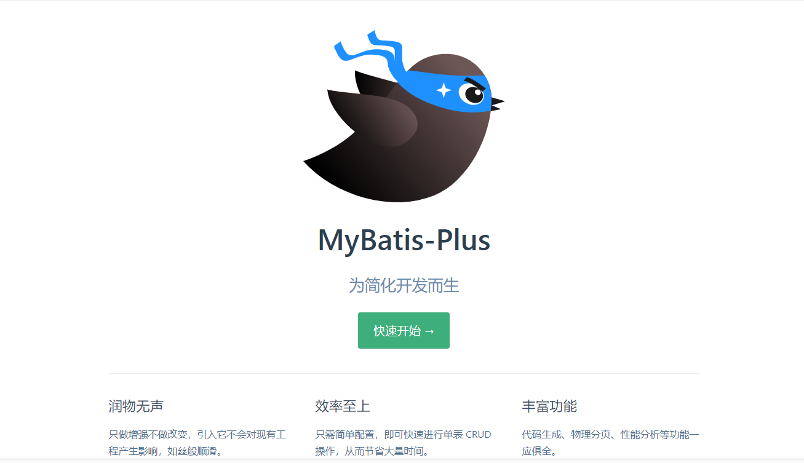


## 特性

- **无侵入**：只做增强不做改变，引入它不会对现有工程产生影响，如丝般顺滑
- **损耗小**：启动即会自动注入基本 CURD，性能基本无损耗，直接面向对象操作
- **强大的 CRUD 操作**：内置通用 Mapper、通用 Service，仅仅通过少量配置即可实现单表大部分 CRUD 操作，更有强大的条件构造器，满足各类使用需求
- **支持 Lambda 形式调用**：通过 Lambda 表达式，方便的编写各类查询条件，无需再担心字段写错
- **支持主键自动生成**：支持多达 4 种主键策略（内含分布式唯一 ID 生成器 - Sequence），可自由配置，完美解决主键问题
- **支持 ActiveRecord 模式**：支持 ActiveRecord 形式调用，实体类只需继承 Model 类即可进行强大的 CRUD 操作
- **支持自定义全局通用操作**：支持全局通用方法注入（ Write once, use anywhere ）
- **内置代码生成器**：采用代码或者 Maven 插件可快速生成 Mapper 、 Model 、 Service 、 Controller 层代码，支持模板引擎，更有超多自定义配置等您来使用
- **内置分页插件**：基于 MyBatis 物理分页，开发者无需关心具体操作，配置好插件之后，写分页等同于普通 List 查询
- **分页插件支持多种数据库**：支持 MySQL、MariaDB、Oracle、DB2、H2、HSQL、SQLite、Postgre、SQLServer 等多种数据库
- **内置性能分析插件**：可输出 SQL 语句以及其执行时间，建议开发测试时启用该功能，能快速揪出慢查询
- **内置全局拦截插件**：提供全表 delete 、 update 操作智能分析阻断，也可自定义拦截规则，预防误操作


# 快速入门

地址：https://mp.baomidou.com/guide/quick-start.html#初始化工程

使用第三方组件：

1. 导入对应的依赖
2. 研究依赖如何配置
3. 代码如何编写
4. 提高扩展技术能力

**步骤**：

1. 创建数据库
2. 创建用户表

```mysql
CREATE DATABASE mybaits_plus;

CREATE TABLE USER
(
	id BIGINT(20) NOT NULL COMMENT '主键ID',
	NAME VARCHAR(30) NULL DEFAULT NULL COMMENT '姓名',
	age INT(11) NULL DEFAULT NULL COMMENT '年龄',
	email VARCHAR(50) NULL DEFAULT NULL COMMENT '邮箱',
	PRIMARY KEY (id)
);

INSERT INTO USER (id, NAME, age, email) VALUES
(1, 'Jone', 18, 'test1@baomidou.com'),
(2, 'Jack', 20, 'test2@baomidou.com'),
(3, 'Tom', 28, 'test3@baomidou.com'),
(4, 'Sandy', 21, 'test4@baomidou.com'),
(5, 'Billie', 24, 'test5@baomidou.com');
-- 真实开发中，version（乐观锁），deleted（逻辑删除）、gmt_create、gmt_modified
```

3. 编写项目，初始化项目！使用SringBoot初始化

4. 导入依赖

   ```xml
   
   <!-- mysql驱动 -->
   <dependency>
       <groupId>mysql</groupId>
       <artifactId>mysql-connector-java</artifactId>
   </dependency>
   
   <!-- Lombok -->
   <dependency>
       <groupId>org.projectlombok</groupId>
       <artifactId>lombok</artifactId>
   </dependency>
   
   <!-- mybatis-plus -->
   <!-- mybatis-plus 是自己开发的，并非官方 -->
   <dependency>
       <groupId>com.baomidou</groupId>
       <artifactId>mybatis-plus-boot-starter</artifactId>
       <version>3.0.5</version>
   </dependency>
   
   ```

   说明：我们使用mybatis-plus可以节省我们大量的代码，尽量不要同时导入mybatis和mybatis-plus！版本的差异！

5. 连接数据库，这一步和mybatis相同。

   ```properties
   # mysql 5 驱动不同 com.mysql.jdbc.Driver
   # mysql 8 驱动不同com.mysql.cj.jdbc.Driver 需要增加时区的配置 serverTimezone=GMT%2B8
   
   spring.datasource.name=root
   spring.datasource.password=root
   spring.datasource.url=jdbc:mysql://localhost:3306?mybatis_plus?useSSL=false&useUnicode=true&charecterEncoding=utf-8&serverTimezone=GMT%2B8
   spring.datasource.driver-class-name=com.mysql.cj.jdbc.Driver
   
   
   ```

   传统方式pojo-dao(连接mybatis，配置mapper.xml文件)-server-controller

6. 使用mybatis-plus之后

   - pojo

     ```java
     @Data
     @NoArgsConstructor
     @AllArgsConstructor
     public class User{
     
         private Long id;
         private String name;
         private Integer age;
         private String email;
     
     }
     ```

     

   - mapper接口

     ```java
     // 在对应的Mapper上面继承基本的接口BaseMapper
     // 代表持久层
     @Repository
     public interface UserMapper extends BaseMapper<User> {
     
         // 所有的CRUD操作都已经编写完成了
         
     }
     
     ```

     注意点：我们需要在启动类上去扫描mapper包下的所有接口。`@MapperScan("com.kuang.mapper")`

   - 测试类中的测试

     ```java
     
     @SpringBootTest
     class MybatisPlusApplicationTests {
     
         // 继承了BaseMapper，所有的方法都来继承父类
         @Autowired
         private UserMapper userMapper;
     
         @Test
         void contextLoads() {
     
             // 参数是一个Wrapper，条件构造器，这里我们先不用 ，null
             // 查询全部用户
             List<User> userList = userMapper.selectList(null);
     
             userList.forEach(System.out::println);
     
         }
     
     }
     
     ```

     

   - 结果

     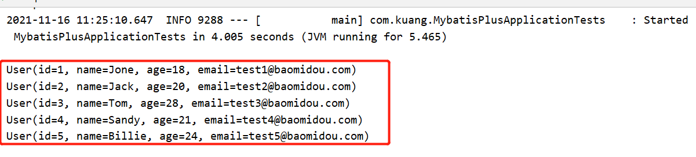

   

# 配置日志

```properties
# 配置日志输入
mybatis-plus.configuration.log-impl=org.apache.ibatis.logging.stdout.StdOutImpl
```


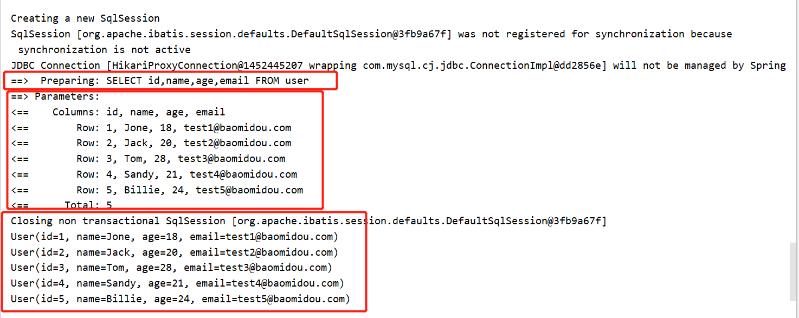


# CRUD扩展

## insert插入

```java
// 测试insert
@Test
public void testInsert(){
    User user = new User();
    user.setName("狂神说Java");
    user.setAge(3);
    user.setEmail("123456789@qq.com");

    // 自动生成id
    int result = userMapper.insert(user);
    System.out.println(result);
    System.out.println(user);
}
```

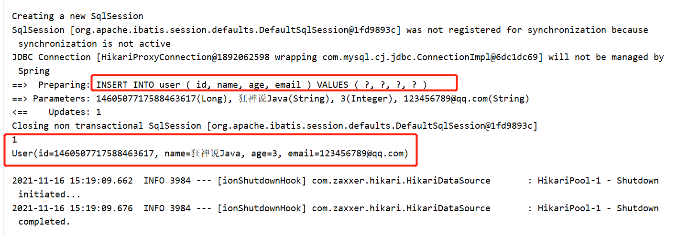


数据库插入的id的默认值为：全局的唯一id

## 主键生成策略

**默认ID_WORKER全局唯一id**

分布式系统唯一id生成：https://www.cnblogs.com/haoxinyue/p/5208136.html

snowflake是Twitter开源的分布式ID生成算法，结果是一个long型的ID。其核心思想是：使用41bit作为毫秒数，10bit作为机器的ID（5个bit是数据中心，5个bit的机器ID），12bit作为毫秒内的流水号（意味着每个节点在每毫秒可以产生 4096 个 ID），最后还有一个符号位，永远是0。具体实现的代码可以参看https://github.com/twitter/snowflake。雪花算法支持的TPS可以达到419万左右（2^22*1000）。

**主键自增**

我们需要配置主键自增：

1. 实体类字段上`@TableId(type = IdType.AUTO)`
2. 数据库字段一定是自增。

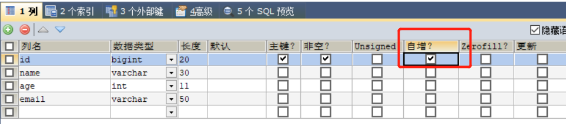


**其他的源码解析**

```java
public enum IdType {
    AUTO(0),				// 数据库id自增
    NONE(1),				// 未设置主键
    INPUT(2),				// 手动输入
    ID_WORKER(3),			// 默认的全局唯一id
    UUID(4),				// 全局唯一id UUID
    ID_WORKER_STR(5);		// ID_WORKER 字符串表示法
}
```


## 更新操作

```java
 // 测试更新
@Test
public void testUpdate(){
    User user = new User();

    // 通过条件自动拼接动态SQL
    user.setId(6L);
    user.setAge(18);

    // updateById 参数是对象
    int i = userMapper.updateById(user);
    System.out.println(i);

}
```


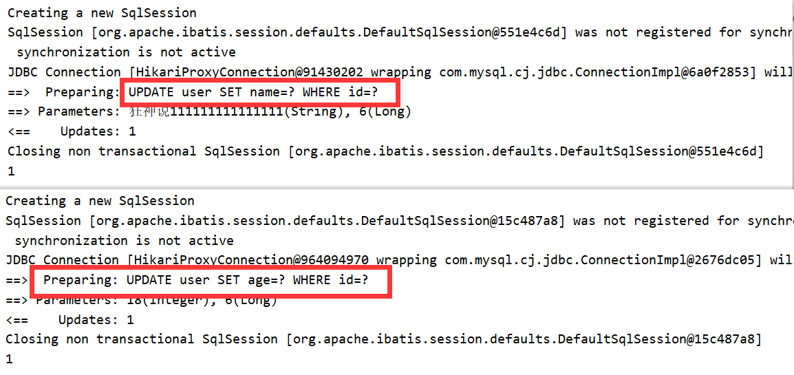

所有的SQL都是自动帮你动态配置的！


## 自动填充

创建时间、修改时间！这些操作都是自动化完成的，我们不需要手动更新！

阿里巴巴开发手册：所有的数据库表：gmt_create、gmt_modified几乎所有的表都要配置上！而且需要自动化。


### 方式一：数据库级别（工作中不允许修改数据库）

1. 在表中新增create_time，update_time

datatime在mysql5.6之后的版本才支持根据时间戳更新 可以用timestamp

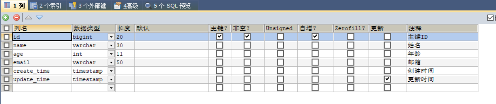


2. 再次测试插入方法，我们需要先把实体类同步。

   ```java
   private Date createTime;
   private Date updateTime;
   ```

3. 查看结果

   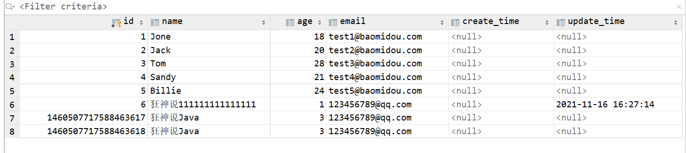


### 方式二：代码级别：

1. 删除数据库的默认值、更新操作！

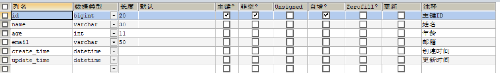


2. 实体类字段属性上需要增加注解 

   ```java
   // 字段添加填充内容
   @TableField(fill = FieldFill.INSERT)
   private Date createTime;
   
   @TableField(fill = FieldFill.INSERT_UPDATE)
   private Date updateTime;
   ```

   

3. 编写处理器来处理这个注解即可

   ```java
   package com.kuang.handler;
   
   import com.baomidou.mybatisplus.core.handlers.MetaObjectHandler;
   import lombok.extern.slf4j.Slf4j;
   import org.apache.ibatis.reflection.MetaObject;
   import org.springframework.stereotype.Component;
   
   import java.util.Date;
   
   @Slf4j
   // 加入到IOC容器中
   @Component
   public class MyMetaObjectHandler implements MetaObjectHandler {
   
       // 插入时的填充策略
       @Override
       public void insertFill(MetaObject metaObject) {
   
           log.info("start insert fill...");
   
           // default MetaObjectHandler setFieldValByName(
           // String fieldName, Object fieldVal, MetaObject metaObject)
           this.setFieldValByName("creatTime",new Date(),metaObject);
           this.setFieldValByName("updateTime",new Date(),metaObject);
   
       }
   
       // 更新时的填充策略
       @Override
       public void updateFill(MetaObject metaObject) {
           log.info("start update fill...");
           this.setFieldValByName("updateTime",new Date(),metaObject);
   
       }
   }
   ```

   

4. 测试插入，创建时间和更新时间都会变化

   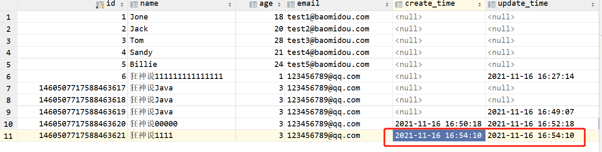

5. 测试更新，只有更新时间发送变化

   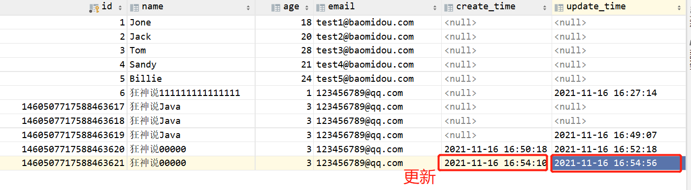


## 乐观锁

**乐观锁：**顾名思义十分乐观，它总是认为不会出现问题，无论干么都不去上锁！如果出现问题了，再次更新值测试

**悲观锁：**十分悲观，认为什么事情都会出现问题，无论干什么都会上锁，再去操作。

当要更新一条记录的时候，希望这条记录没有被别人更新
乐观锁实现方式：

- 取出记录时，获取当前version
- 更新时，带上这个version
- 执行更新时， set version = newVersion where version = oldVersion
- 如果version不对，就更新失败 


### 测试一下MP的乐观锁插件

1. 给数据库中增加version字段

   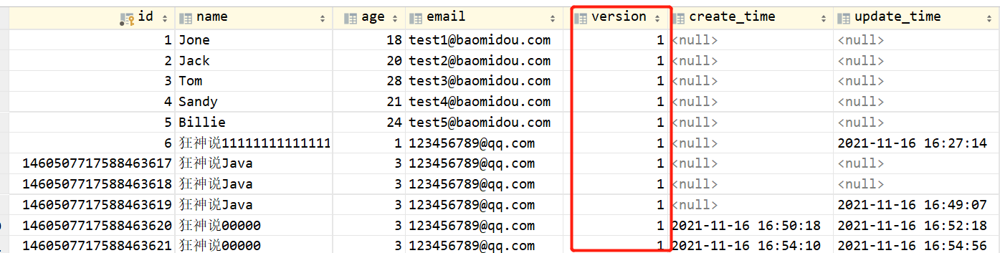

2. 实体类加对应的字段

   ```java
   // 乐观锁注解
   @Version
   private Integer version;
   ```

   

3. 注册组件

   ```java
   // 扫描Mapper文件夹
   @MapperScan("com.kuang.mapper")
   @EnableTransactionManagement
   @Configuration
   public class MybatisPlusConfig {
   
       // 注册乐观锁插件
   
       /**
        * 旧版
        */
       @Bean
       public OptimisticLockerInterceptor optimisticLockerInterceptor() {
           return new OptimisticLockerInterceptor();
       }
   
   
       /**
        * 新版，需要更换较新的MybatisPlus的版本
        *//*
       @Bean
       public MybatisPlusInterceptor mybatisPlusInterceptor() {
           MybatisPlusInterceptor mybatisPlusInterceptor = new MybatisPlusInterceptor();
           mybatisPlusInterceptor.addInnerInterceptor(new OptimisticLockerInnerInterceptor());
           return mybatisPlusInterceptor;
       }
   */
   }
   
   ```

   

4. 测试

   ```java
   // 测试乐观锁成功
   @Test
   public void testOptimisticLocker(){
   
       // 1.查询用户信息
       User user = userMapper.selectById(1L);
   
       // 2.修改用户信息
       user.setName("kuangshen");
       user.setEmail("11111111111@qq.com");
   
       // 3.执行操作
       userMapper.updateById(user);
   
   }
   
   // 测试乐观锁失败，多线程下
   @Test
   public void testOptimisticLocker1(){
   
       //  线程1
       User user = userMapper.selectById(1L);
       user.setName("kuangshen111");
       user.setEmail("11111111111@qq.com");
   
       // 模拟多线性插队操作
       User user1 = userMapper.selectById(1L);
       user1.setName("kuangshen222222");
       user1.setEmail("11111111111@qq.com");
       userMapper.updateById(user1);
   
       // 插入失败，因为加了乐观锁，version与查询时不一样。
       userMapper.updateById(user);	
   
   }
   ```


## 查询操作

```java
// 测试查询
@Test
public void testSelectById(){
    User user = userMapper.selectById(1L);
    System.out.println(user);
}

// 测试批量查询
@Test
public void testSelectByBatchId(){
    List<User> userList = userMapper.selectBatchIds(Arrays.asList(1, 2, 3));
    userList.forEach(System.out::println);
}

// 按条件查询之一 map操作
@Test
public void testSelectByBatchIds(){

    HashMap<String, Object> map = new HashMap<>();

    map.put("name","狂神说Java");
    map.put("age",3);

    userMapper.selectByMap(map);

}

```


## 分页查询

分页在网站使用的十分多。

1. 原始的limit进行分页
2. PageHelper第三方插件
3. MP其实也内置了分页插件！

**使用**

1. 配置拦截器组件

   ```java
   // 旧版
   @Bean
   public PaginationInterceptor paginationInterceptor() {
       /*PaginationInterceptor paginationInterceptor = new PaginationInterceptor();
           // 设置请求的页面大于最大页后操作， true调回到首页，false 继续请求  默认false
           // paginationInterceptor.setOverflow(false);
           // 设置最大单页限制数量，默认 500 条，-1 不受限制
           // paginationInterceptor.setLimit(500);
           // 开启 count 的 join 优化,只针对部分 left join
           paginationInterceptor.setCountSqlParser(new JsqlParserCountOptimize(true));
           return paginationInterceptor;*/
       // 修改之后
       return new PaginationInterceptor();
   }
   
   // 最新版
   /* @Bean
       public MybatisPlusInterceptor mybatisPlusInterceptor() {
           MybatisPlusInterceptor interceptor = new MybatisPlusInterceptor();
           interceptor.addInnerInterceptor(new PaginationInnerInterceptor(DbType.H2));
           return interceptor;
       }*/
   ```

   

2. 直接使用page对象

   ```java
   @Test
   public void testPage(){
   
       // 第一个参数：当前页数
       // 第二个参数：一页的个数
       // 使用了分页插件之后，所有的页面操作也变得简单了
       Page<User> page = new Page<User>(1,5);
   
       userMapper.selectPage(page,null);
   
       page.getRecords().forEach(System.out::println);
   
   
       // getSize：当前页面有多少条数据
       System.out.println("getSize="+page.getSize());
   
       // getCurrent：当前是第几页
       System.out.println("getCurrent="+page.getCurrent());
   
       // getTotal：一共有多少条数据
       System.out.println("getTotal="+page.getTotal());
   
       // getPages：一共有多少页
       System.out.println("getPages="+page.getPages());
   }
   ```


## 删除操作

基本的删除操作

```java
// 测试删除
@Test
public void testDeleteById(){
    userMapper.deleteById(1460507717588463621L);
}

// 通过id批量删除
@Test
public void testDeleteByBatchId(){
    userMapper.deleteBatchIds(Arrays.asList(1460507717588463620L,1460507717588463619L));
}

// 通过map删除
@Test
public void testDeleteByMap(){

    HashMap<String, Object> map = new HashMap<>();

    map.put("name","狂神说Java");

    userMapper.deleteByMap(map);
}
```

工作当中会遇到的一些问题：逻辑删除！


## 逻辑删除

**物理删除：**从数据库中直接移除

**逻辑删除：**在数据库中没有移除，而是通过一个变量来让他失效！deleted = 0 => deteled 1

管理员可以查看被删除的记录！防止数据的丢失！类似回收站。

1. 在数据库表中增加一个deleted字段

   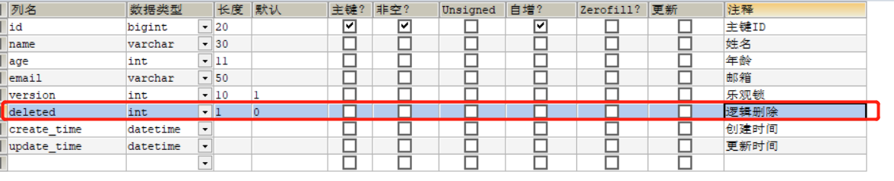

2. 在实体类中增加属性

   ```java
   // 逻辑删除
   @TableLogic
   private Integer deleted;
   ```

   

3. 配置

   ```java
   // 逻辑删除组件(新版本已经没有了。)
   @Bean
   public ISqlInjector sqlInjector(){
       return new LogicSqlInjector();
   }
   ```

   

   ```properties
   # 配置逻辑删除
   mybatis-plus.global-config.db-config.logic-delete-value=1
   mybatis-plus.global-config.db-config.logic-not-delete-value=0
   ```

   

4. 测试

   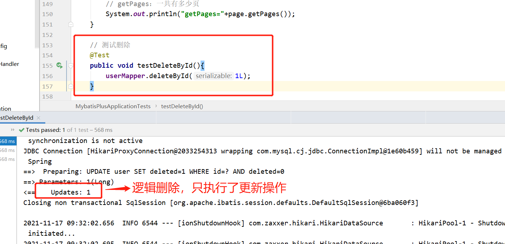

   记录依旧在数据库，但是值已经变了。

   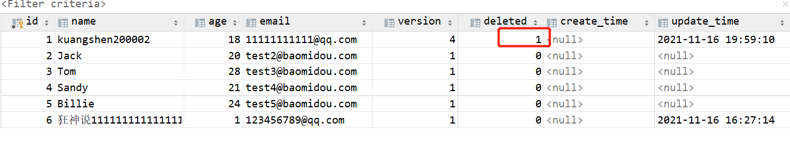

   查询的时候，会自动过滤已经被逻辑删除的字段。

   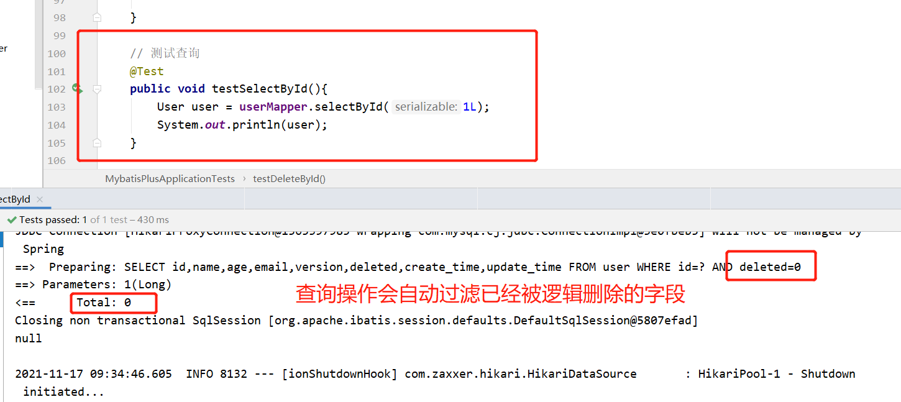

以上所有的CRUD操作以及其扩展操作，我们都必须精通掌握，会大大提升工作和写项目的效率。


## 性能分析插件

我们在平时的开发中，会遇到一些慢sql。测试！druid...

作用：性能分析烂机器，用于输出每条SQL语句以及其执行时间。

MP也提供了性能分析插件，如果超过这个时间即就停止运行。

1. 导入插件

   ```java
   /**
   *sql执行效率
   */
   @Bean
   @Profile({"dev","test"})    // 设置dev test 环境开启，保证我们的效率
   public PerformanceInterceptor performanceInterceptor(){
       PerformanceInterceptor performanceInterceptor = new PerformanceInterceptor();
   
       // ms 设置SQL执行的最大时间，如果超过这个时间就不会执行了。
       performanceInterceptor.setMaxTime(100);
       performanceInterceptor.setFormat(true);
       return performanceInterceptor;
   }
   ```

   记得，要在springboot中配置环境为dev或者test环境

2. 测试使用

   ```java
   @Test
   void contextLoads() {
   
       // 参数是一个Wrapper，条件构造器，这里我们先不用 ，null
       // 查询全部用户
       List<User> userList = userMapper.selectList(null);
   
       userList.forEach(System.out::println);
   
   }
   ```

   超过了规定时间就会抛出异常。

   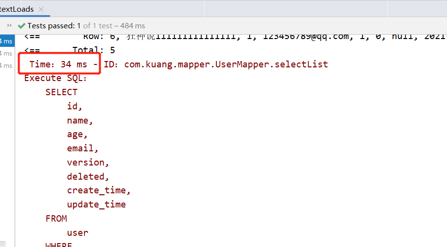

使用性能分析插件，可以帮助我们提高效率！


## 条件构造器

十分重要：Wrapper

我们写一些复杂的SQL就可以使用它来替代！

1. 测试一

   ```java
   @Test
   void contextLoads() {
   
       // 查询name不为空的用户，并且邮箱不为控的用户，年龄大于等于12岁
       QueryWrapper<User> wrapper = new QueryWrapper<>();
   
       wrapper
           .isNotNull("name")
           .isNotNull("email")
           .ge("age",12);
   
       userMapper.selectList(wrapper).forEach(System.out::println);
   
   }
   ```

   

2. 测试二

   ```java
   @Test
   void test2(){
       QueryWrapper<User> wrapper = new QueryWrapper<>();
       wrapper.eq("name","狂神说111111111111111");
   
       // 查询一个数据，出现多个结果使用list或者map
       User user = userMapper.selectOne(wrapper);
       System.out.println(user);
   }
   ```

   

3. 测试三

   ```java
   @Test
   void test3(){
       // 查询年龄在20~30岁之间的用户
       QueryWrapper<User> wrapper = new QueryWrapper<>();
   
       // 区间
       wrapper.between("age",20,30);
   
       // 查询结果数
       Integer count = userMapper.selectCount(wrapper);
       System.out.println(count);
   }
   ```

   

4. 测试四

   ```java
   // 模糊查询
   @Test
   void test4(){
   
       QueryWrapper<User> wrapper = new QueryWrapper<>();
       // 左和右 t%:右
       wrapper
           .notLike("name","e")
           .likeRight("email","t");
   
   
       List<Map<String, Object>> maps = userMapper.selectMaps(wrapper);
       maps.forEach(System.out::println);
   }
   ```

   

5. 测试五

   ```java
   // 模糊查询
   @Test
   void test5(){
   
       QueryWrapper<User> wrapper = new QueryWrapper<>();
       // id 在子查询中查出来
       wrapper.inSql("id","select id from user where id<3");
   
       List<Object> objects = userMapper.selectObjs(wrapper);
       objects.forEach(System.out::println);
   }
   ```

   

6. 测试六

   ```java
   @Test
   void test6(){
   
       QueryWrapper<User> wrapper = new QueryWrapper<>();
       // 通过id降序
       wrapper.orderByDesc("id");
   
       List<User> userList = userMapper.selectList(wrapper);
       userList.forEach(System.out::println);
   }
   ```

   

## 代码生成器

根据实际情况，结合官网修改。