# Redis笔记

Redis是一个开源的使用ANSI C语言编写、支持网络、可基于内存亦可持久化的日志型、Key-Value数据库，并提供多种语言的API。从2010年3月15日起，Redis的开发工作由VMware主持。

<!--more-->

官网：https://redis.io/

中文网：http://www.redis.cn/

# Nosql概述

## 为什么用Nosql

1. 单击MySQL的年代

   - 数据量如果太大，一个机器内存放不了

   - 数据的索引（B+Tree），一个机器内存也放不下

   - 访问量（读写混合），一个服务器承受不来

   

2. memcached（缓存）+MySQL+垂直拆分（读写分离）

   - 发展过程：优化数据结构和索引-->文件缓存（IO）--> Memcached（当时最热门的技术）

   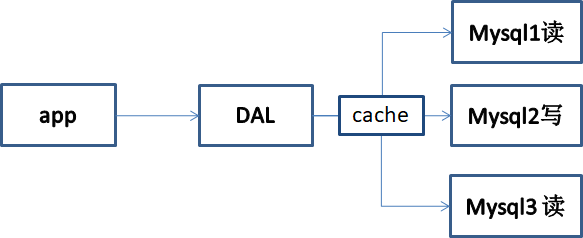

3. 分库分表+水平拆分+mysql集群

   - ==本质：数据库（读、写）==

   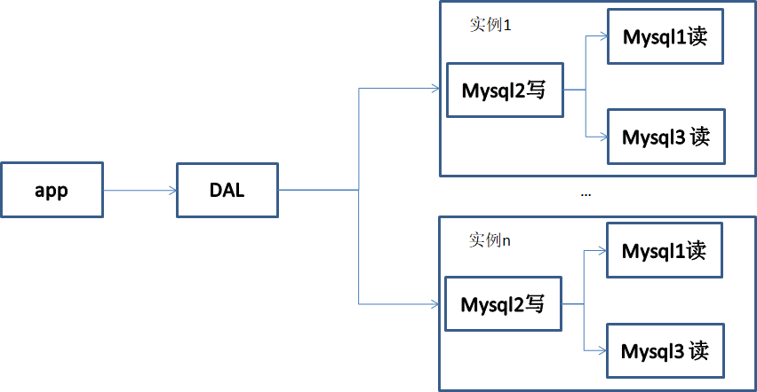

4. 如今

   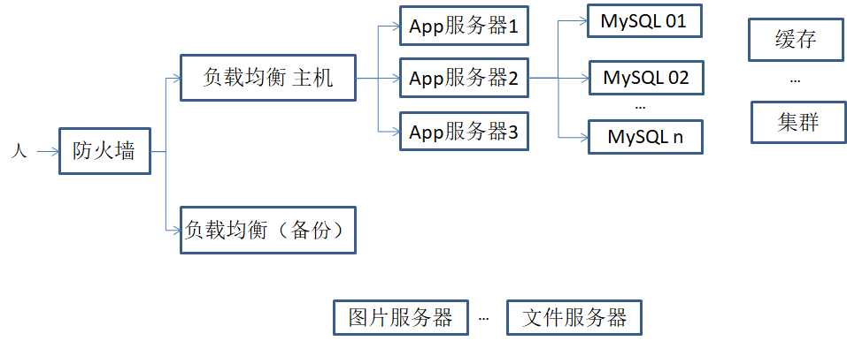

5. 为什么用Nosql

   用户的个人信息，社交网络，地理位置。用户自己产生的数据，用户日志等等爆发式的增长


## 什么是NoSQL

NoSQL = Not Only SQL

泛指非关系型数据库，传统的关系型数据库难以对付web2.0时代！，NoSQL在当今大数据时代环境下迅速发展，Redis。

关系型数据库：表格，行，列


## NoSQL特点

1. 方便扩展（数据之间没有关系，很好扩展）

2. 大数据量高性能（Redis一秒抄写8万次，读取11万，Nosql的缓存记录集，是一种细粒度的缓存，性能较高）

3. 数据类型，多样性 

4. 传统的RDBMS和Nosql

   ```
   传统的RDBMS
   - 结构化组织
   - SQL
   - 数据和关系都存在单独的表中
   - 操作，数据定义语言
   - 严格的一致性
   - 基础的事务
   ```

   ```
   Nosql
   - 不仅仅是数据
   - 没有固定的查询语言
   - 键值对存储，列存储，文档存储，图形数据库（社交关系）
   - 最终一致性
   - CAP定理和BASE(异地多活)
   - 高性能，高可用，高并发
   ```

   

   

了解：3v+3高

**3v：**

1. 海量volume
2. 多样variety
3. 实时velocity

**3高：**

1. 高并发
2. 高可用(或者高可扩，随时水平拆分，机器不够了，可用扩展机器)
3. 高性能


## NoSQL的四大分类

**KV键值对：**

- redis

**文档类型数据库(bson格式和json一样)：**

- MongoDB（一般必须掌握）
  - MongoDB是一个基于分布式文件存储的数据库，主要用来处理大量的文档
  - MongoDB是一个介于关系型数据库和非关系型数据中间的产品 ，MongoDB是非关系型数据库中功能最丰富，最像关系型数据库的

**列存储数据库**

- HBase
- 分布式文件系统

**图关系数据库**

- 存关系，比如朋友圈社交网络，广告推荐
- Neo4j， InfoGrid


# Redis入门

## 概述

Redis （Remote Dictionnary Server）,即远程字典服务。 是一个开源的使用ANSI C语言编写、支持网络、可基于内存亦可持久化的日志型、Key-Value数据库，并提供多种语言的API。


## Redis能干嘛

1. 内存存储、持久化，内存中是断点即失，所以说持久化很重要（rdb，aof）
2. 效率高，可以用于高速缓存
3. 发布订阅系统
4. 地图信息分析
5. 计时器、计数器（浏览量） 
6. ....

## 特性

1. 多样的数据类型
2. 持久化
3. 集群
4. 事务
5. ...

## 安装

wsl（Windows下的Linux子系统）

### **Windows安装**


### **Linux安装**

1. 下载安装包

2. 解压到/opt目录下

   ```bash
   [root@localhost opt]# ls 
   redis-6.2.6  redis-6.2.6.tar.gz
   [root@localhost opt]# 
   
   ```

3. 进到redis目录下，下载yum

   ```bash
   yum install gcc-c++
   ```

   结果报了以下错误

   ```bash
   [root@localhost redis-6.2.6]# yum install gcc-c++
   Loaded plugins: fastestmirror, langpacks
   Loading mirror speeds from cached hostfile
   Could not retrieve mirrorlist http://mirrorlist.centos.org/?release=7&arch=x86_64&repo=os&infra=stock error was
   14: curl#6 - "Could not resolve host: mirrorlist.centos.org; Unknown error"
   
   
    One of the configured repositories failed (Unknown),
    and yum doesn't have enough cached data to continue. At this point the only
    safe thing yum can do is fail. There are a few ways to work "fix" this:
   
        1. Contact the upstream for the repository and get them to fix the problem.
   
        2. Reconfigure the baseurl/etc. for the repository, to point to a working
           upstream. This is most often useful if you are using a newer
           distribution release than is supported by the repository (and the
           packages for the previous distribution release still work).
   
        3. Run the command with the repository temporarily disabled
               yum --disablerepo=<repoid> ...
   
        4. Disable the repository permanently, so yum won't use it by default. Yum
           will then just ignore the repository until you permanently enable it
           again or use --enablerepo for temporary usage:
   
               yum-config-manager --disable <repoid>
           or
               subscription-manager repos --disable=<repoid>
   
        5. Configure the failing repository to be skipped, if it is unavailable.
           Note that yum will try to contact the repo. when it runs most commands,
           so will have to try and fail each time (and thus. yum will be be much
           slower). If it is a very temporary problem though, this is often a nice
           compromise:
   
               yum-config-manager --save --setopt=<repoid>.skip_if_unavailable=true
   
   Cannot find a valid baseurl for repo: base/7/x86_64
   
   ```

   解决方案：

   - 检查网络，发现ping不通，网络有问题

   ```bash
   [admin@localhost ~]$ ping baidu.com
   ping: baidu.com: Name or service not known
   [admin@localhost ~]$ 
   ```

   ```bash
   BOOTPROTO=static
   DEFROUTE=yes
   IPADDR=192.168.242.3
   NETMSAK=255.255.255.0
   GATEWAY=192.168.242.2
   ONBOOT=yes
   DNS1=192.168.242.2				# 原来是之前配置网络的时候，这一行忘记配置了
   
   ```

   - 配置好，重启服务器，即可

   ```bash
   service network restart
   ```

   - 重新执行安装yum的命令。建议使用

     ```bash
     yum install -y gcc-c++		# -y表示出现的询问都同意
     ```

   检查是否安装成功

   ```bash
   gcc -v
   ```

   

4. 在redis的目录下执行以下命令

   ```bash
   make
   make install
   ```

   

5. redis安装默认路径`/usr/local/bin`

6. 拷贝/opt下面的redis的中的conf文件到/usr/local/bin/myredisconfig文件夹下面

   ```bash
   cp /opt/redis-6.2.6/redis.conf ./myredisconfig
   ```

   

7. redis默认不是后台运行，键daemonize处的no改为yes

   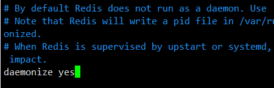

8. 设置密码，找到\# requirepass foobared，另起一行（除了设置这些之外，还可以设置redis开机自启等等，具体可以网上搜索）

   ```bash
   requirepass xxx			# xxx是你的密码
   ```

9. 启动redis，但是没有信息出来，所以使用 `ps -ef |gref redis`查看6379端口号是否在使用，接着启动客户端

   ```bash
   [root@localhost bin]# pwd
   /usr/local/bin
   [root@localhost bin]# ./redis-server myredisconfig/redis.conf 
   [root@localhost bin]# ps -ef |grep redis
   root      10525      1  0 21:53 ?        00:00:00 ./redis-server 127.0.0.1:6379
   root      10539   3057  0 21:54 pts/0    00:00:00 grep --color=auto redis
   [root@localhost bin]# 
   
   ```

   ```bash
   [root@localhost bin]# ./redis-cli -p 6379
   127.0.0.1:6379> 
   ```

   

10. 测试，发现值存不进去

    ```bash
    127.0.0.1:6379> set name Ten
    (error) NOAUTH Authentication required.
    ```

    经过查找，原来是上一步我们设置了密码，需要认证，输入密码就可以了`auth "xxx"`，xxx是你的密码

    ```bash
    127.0.0.1:6379> auth xxx
    OK
    127.0.0.1:6379>
    ```

    

11. 关闭redis服务`shutdown`，再次使用ps -ef |grep redis 查看，redis进程已经被关闭


## 测试性能

**redis-benchmark**：是一个官方自带的压力测试工具！

```bash
# 测试：100个并发连接 100000请求
redis-benchmark -h localhost -p 6379 -c 100 -n 100000 
```

如果redis设置了密码认证，可以先去redis.conf将密码暂时去掉


来自菜鸟教程的表格

|      |                           |                                            |           |
| :--- | :------------------------ | :----------------------------------------- | :-------- |
| 序号 | 选项                      | 描述                                       | 默认值    |
| 1    | **-h**                    | 指定服务器主机名                           | 127.0.0.1 |
| 2    | **-p**                    | 指定服务器端口                             | 6379      |
| 3    | **-s**                    | 指定服务器 socket                          |           |
| 4    | **-c**                    | 指定并发连接数                             | 50        |
| 5    | **-n**                    | 指定请求数                                 | 10000     |
| 6    | **-d**                    | 以字节的形式指定 SET/GET 值的数据大小      | 2         |
| 7    | **-k**                    | 1=keep alive 0=reconnect                   | 1         |
| 8    | **-r**                    | SET/GET/INCR 使用随机 key, SADD 使用随机值 |           |
| 9    | **-P**                    | 通过管道传输 <numreq> 请求                 | 1         |
| 10   | **-q**                    | 强制退出 redis。仅显示 query/sec 值        |           |
| 11   | **--csv**                 | 以 CSV 格式输出                            |           |
| 12   | ***-l\*（L 的小写字母）** | 生成循环，永久执行测试                     |           |
| 13   | **-t**                    | 仅运行以逗号分隔的测试命令列表。           |           |
| 14   | ***-I\*（i 的大写字母）** | Idle 模式。仅打开 N 个 idle 连接并等待。   |           |


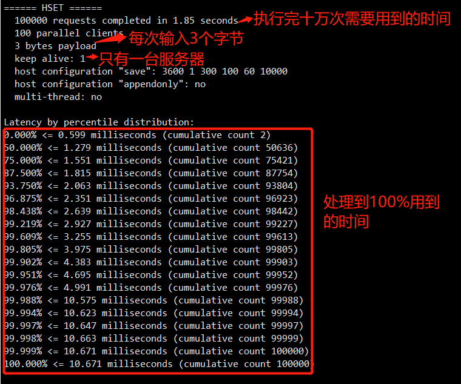


## 基础知识

redis默认有16个数据库

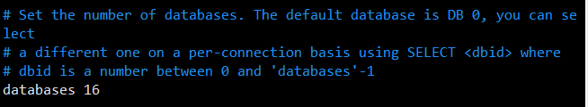

默认使用第0个

可以使用`select 2`切换第2个数据库

```bash
select 2	# 切换到2号数据库
dbsize		# 查看当前数据库的大小
keys *		# 查询所有的key
flushdb		# 清除当前的数据库
flushall	# 清空所有的数据库
```


**redis是单线程**（redis6.0之后是多线程）

**redis为什么单线程还这么快？**

误区1：高性能的服务器一定是多线程的？

误区2：多线程（CPU上下文会切换）一定比单线程效率高

核心：redis是将所有的数据全部放在内存中的，所以说使用单线程去操作效率是最高的，多线程（CPU上下文会切换：耗时的操作），对于内存系统来说，如果没有上下文切换效率就是最高的。多次读写都是在一个CPU上的，在内存情况下，这个就是最佳方案！

 

# 五大数据类型

## Redis-Key

```bash
exists name			# 判断是否存在name
move name 1			# 移动当前的数据库的name到1号数据库
del name			# 删除name
expire name 10  	# 设置name 10秒后过期 
ttl name			# 查看剩余时间
type name			# 查看当前的name的类型 
```


## String（字符串）


```bash
append key1 "hello"			# 在key1后面追加“hello”，如果当前key1不存在，则新建
strlen key1					# 获取当前key1的字符长度
```


**incr自增，计数器**

```bash
127.0.0.1:6379> set views 0			# 设置一个值为0的views
OK
127.0.0.1:6379> get views
"0"
127.0.0.1:6379> INCR views			# 将views的值加一
(integer) 1
127.0.0.1:6379> get views
"1"
127.0.0.1:6379> 

```


**decr自减**

```bash
127.0.0.1:6379> get views
"2"
127.0.0.1:6379> DECR views			# 将views减一
(integer) 1
127.0.0.1:6379> get views
"1"
127.0.0.1:6379> 

```


**INCRBY views 10**

```bash
127.0.0.1:6379> get views"1"127.0.0.1:6379> INCRBY views 10		# 一次性加10(integer) 11127.0.0.1:6379> 
```


**DECRBY views 5**

```bash
127.0.0.1:6379> INCRBY views 10
(integer) 11
127.0.0.1:6379> DECRBY views 5		# 一次性减5
(integer) 6
127.0.0.1:6379> 

```


**getrange**:取一个字符串范围，取全部为0 -1

```bash
127.0.0.1:6379> set key1 "hello,Ten"
OK
127.0.0.1:6379> GETRANGE key1 1 3
"ell"
127.0.0.1:6379> GETRANGE key1 0 3
"hell"
127.0.0.1:6379> GETRANGE key1 0 -1
"hello,Ten"
127.0.0.1:6379> 
```


**setrange**:替换某范围的字符串 

```bash
127.0.0.1:6379> set key2 abcdefg
OK
127.0.0.1:6379> get key2
"abcdefg"
127.0.0.1:6379> SETRANGE key2 1 xx
(integer) 7
127.0.0.1:6379> get key2
"axxdefg"
127.0.0.1:6379> 
```


**setex:**设置过期时间

```bash
127.0.0.1:6379> setex key3 30 "hello"OK127.0.0.1:6379> ttl key3(integer) 21
```


**setnx**：不存在再设置，如果存在则不设置（在分布式锁中会常用到）

```bash
127.0.0.1:6379> setnx mykey "redis"(integer) 1127.0.0.1:6379> get mykey"redis"127.0.0.1:6379> setnx mykey "Mongodb"(integer) 0127.0.0.1:6379> get mykey"redis"127.0.0.1:6379> 
```


**mset，mget，批量存值和取值**

```bash
127.0.0.1:6379> mset k1 v1 k2 v2 k3 v3OK127.0.0.1:6379> keys *1) "k2"2) "k3"3) "k1"127.0.0.1:6379> mget k1 k2 k31) "v1"2) "v2"3) "v3"127.0.0.1:6379> keys *1) "k2"2) "k3"3) "k1"127.0.0.1:6379> msetnx k1 v1 k4 v4			# msetnx是原子性操作，要不成功，要不失败(integer) 0127.0.0.1:6379> 
```


**key的巧妙设置**

```bash
# set user:1 {name:zhangsan,age:2}	# 设置一个user:1 对象，值为json字符来保存一个对象# 这里的key是以巧妙的设计： user:{id}:{filed}127.0.0.1:6379> mset user:1:name zhangsan user:1:age 2OK127.0.0.1:6379> mget user:1:name user:1:age1) "zhangsan"2) "2"127.0.0.1:6379> 
```


**getset**，先get，再set，如果不存在值，则返回null，再设置新的值进入。如果存在先取出，再设置进去。

```bash
127.0.0.1:6379> getset db redis(nil)127.0.0.1:6379> get db"redis"127.0.0.1:6379> getset db mongodb"redis"127.0.0.1:6379> get db"mongodb"127.0.0.1:6379> 
```

String类似的使用场景：value除了我们的字符串还可以是数字。

- 计数器
- 统计多单位的数量
- 粉丝数
- 对象缓存存储


## List(列表)

在redis里面，我们可以把list玩成，栈、队列、阻塞队列。

**lpush list one**：往list中存入一个one的值（头部）

**lrange list 0 -1**：取出list中所有的值

 **RPUSH list right**：在右边加入right的值（尾部）


```bash
127.0.0.1:6379> lpush list one(integer) 1127.0.0.1:6379> lpush list two(integer) 2127.0.0.1:6379> keys *1) "list"127.0.0.1:6379> LRANGE list 0 -11) "two"2) "one"127.0.0.1:6379> RPUSH list right(integer) 3127.0.0.1:6379> LRANGE list 0 -11) "two"2) "one"3) "right"127.0.0.1:6379> 
```


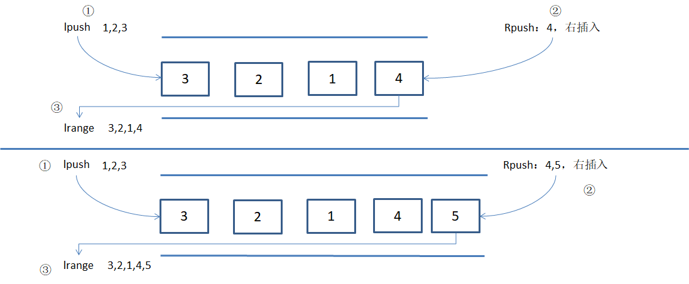


**lpop**：从左边移除

**rpop**：从右边移除

```bash
127.0.0.1:6379> LRANGE list 0 -11) "two"2) "one"3) "right"127.0.0.1:6379> LPOP list"two"127.0.0.1:6379> RPOP list"right"127.0.0.1:6379> LRANGE list 0 -11) "one"127.0.0.1:6379> 
```


**lindex list 0** ：获取list索引为0的元素

**llen list** ：查看当前list的长度 

**lrem list 2 one**：移除list中的两个one（list中的值可以重复，如果超过最大数量，只移除存在的最大数量）

**ltrim mylist 1 2**：截取mylist中的索引为1 和2的值

```bash
127.0.0.1:6379> LRANGE list 0 -11) "1"2) "2"3) "3"127.0.0.1:6379> LTRIM list 0 1OK127.0.0.1:6379> LRANGE list 0 -11) "1"2) "2"127.0.0.1:6379> 
```


**rpoplpush list otherlist**：移除list中最后一个元素，并加到otherlist中

```bash
127.0.0.1:6379> LRANGE list 0 -11) "1"2) "2"3) "3"127.0.0.1:6379> rpoplpush list otherlist"3"127.0.0.1:6379> LRANGE list 0 -11) "1"2) "2"127.0.0.1:6379> LRANGE otherlist 0 -11) "3"127.0.0.1:6379> 
```


**lset list 0 item：**将list中索引为0的值改成item（前提是，list中相对应的索引存在）

```bash
127.0.0.1:6379> lpush list 0				# 插入元素(integer) 1127.0.0.1:6379> LRANGE list 0 0				# 查看是否存在相对应的元素1) "0"127.0.0.1:6379> lset list 0 itemOK127.0.0.1:6379> LRANGE list 0 01) "item"127.0.0.1:6379> lset list 1 other			# 索引为1的元素不存在，所以报错(error) ERR index out of range127.0.0.1:6379> 
```


**linsert list before|after "world" "my"**：在list中的world之前（之后）加上my

```bash
127.0.0.1:6379> clear127.0.0.1:6379> rpush list "hello"(integer) 1127.0.0.1:6379> rpush list "world"(integer) 2127.0.0.1:6379> LINSERT list before "world" "my"		# 在list中的world之前插入my(integer) 3127.0.0.1:6379> LRANGE list 0 -11) "hello"2) "my"3) "world"127.0.0.1:6379> 
```


## Set（集合）

set中的值是不可以重复的，无序的

**sadd myset "hello"**：往myset中添加一个字符串hello

**smembers myset：**取出myset中的值

**sismembers myset hello：**判断myset里面是否有这个hello，如果有返回1，没有返回0

**scard myset**：获取myset中的个数

**srem myset hello：**移除myset中的hello元素

**srandmember myset 2：**在myset中随机抽取两个数字，不要数字就是默认取一个

**spop myset：**随机弹出myset中的一个元素

**smove myset myset2 holle：**将myset中的hello元素移动到myset2中

**sdiff key1 key2：**key1集合减去key2集合（==差集==）

**sinter key1 key2:** key1和key2的==交集==

**sunion key1 key2**：key1和key2的==并集==

```bash
127.0.0.1:6379> sadd key1 1
(integer) 1
127.0.0.1:6379> sadd key1 2
(integer) 1
127.0.0.1:6379> sadd key1 3
(integer) 1
127.0.0.1:6379> sadd key2 3
(integer) 1
127.0.0.1:6379> sadd key2 4
(integer) 1
127.0.0.1:6379> sadd key2 5
(integer) 1
127.0.0.1:6379> SDIFF key1 key2			# 差集
1) "1"
2) "2"
127.0.0.1:6379> SINTER key1 key2		# 交集（共同好友）
1) "3"
127.0.0.1:6379> SUNION key1 key2		# 并集
1) "1"
2) "2"
3) "3"
4) "4"
5) "5"
127.0.0.1:6379> 
```

微博，A用户将所有关注的人放在一个set集合中，将它的粉丝也放在一个集合中

共同关注，共同爱好，推荐好友


## Hash（哈希）

Map集合，key-Map集合，key-<key-value>

hset myhash field1 hello:

hget

```bash
127.0.0.1:6379> hset myhash field1 hello
(integer) 1
127.0.0.1:6379> hget myhash field1
"hello"
127.0.0.1:6379>
```

**hmset**:一次存多个值，如果重复会自动覆盖（redis4.0后已被官方弃用，建议使用hset）

**hmget**:一次取多个值

```bash
127.0.0.1:6379> hmset myhash field1 hello field2 world
OK
127.0.0.1:6379> hmget myhash field1 field2
1) "hello"
2) "world"
127.0.0.1:6379> 
```

**hgetall**：获取hash中所有的键值对 

```bash
127.0.0.1:6379> hgetall myhash
1) "field1"
2) "hello"
3) "field2"
4) "world"

```

**hdel myhash field1**：删除myhash 中的field1，即删除hash中指定的key，对应的value值也被删除

```bash
127.0.0.1:6379> hdel myhash field1
(integer) 1
127.0.0.1:6379> HGETALL myhash
1) "field2"
2) "world"
127.0.0.1:6379>
```

**hlen myhash：**查看myhash中key的个数

```bash
127.0.0.1:6379> hgetall myhash
1) "field2"
2) "world"
3) "field1"
4) "hello"
127.0.0.1:6379> hlen myhash
(integer) 2
127.0.0.1:6379> 
```

**hexists**：判断hash中的某一个字段是否存在

```bash
127.0.0.1:6379> hexists myhash field1
(integer) 1
127.0.0.1:6379> hexists myhash field3
(integer) 0
127.0.0.1:6379> 

```

**hkeys myhash：**获取myhash中所有的key

**hvals myhash：**获取myhash中所有的value

```bash
127.0.0.1:6379> hkeys myhash
1) "field2"
2) "field1"
127.0.0.1:6379> hvals myhash
1) "world"
2) "hello"
127.0.0.1:6379> 
```

**hincrby：**自增

**hsetnx：**判断是否存在，如果存在则不创建，不存在则新建

```bash
127.0.0.1:6379> hset myhash field3 5(integer) 1127.0.0.1:6379> hincrby myhash field3 1				# 自增1(integer) 6127.0.0.1:6379> hincrby myhash field3 -1(integer) 5127.0.0.1:6379> hsetnx myhash field4 hello			# field4不存在，新建(integer) 1127.0.0.1:6379> HGETALL myhash1) "field2"2) "world"3) "field1"4) "hello"5) "field3"6) "5"7) "field4"8) "hello"127.0.0.1:6379> hsetnx myhash field4 hello			# field4已经存在，创建失败(integer) 0127.0.0.1:6379> 
```

hash变更的数据 user name age ，尤其是用户信息之类的，经常变动的信息。hash更适合对象的存储，String更加适合字符串。 


## Zset(有序集合)

在set的基础上，增加了一个值，set k1 v1 ，zset k1 score1 v1

**zadd**:添加

**zrange**:查看

```bash
127.0.0.1:6379> zadd zset 1 one(integer) 1127.0.0.1:6379> zadd zset 2 two(integer) 1127.0.0.1:6379> zadd zset 3 three(integer) 1127.0.0.1:6379> ZRANGE zset 0 -11) "one"2) "two"3) "three"127.0.0.1:6379> 
```


**zrangebyscore：**通过score排序

**zrevrange**:降序

```bash
127.0.0.1:6379> zadd salary 2500 xiaohong
(integer) 1
127.0.0.1:6379> zadd salary 5000 zhangsan
(integer) 1
127.0.0.1:6379> zadd salary 200 Ten
(integer) 1
127.0.0.1:6379> zrangebyscore salary -inf +inf				# 显示所有用户，从小到大排序，不带score排序
1) "Ten"
2) "xiaohong"
3) "zhangsan"
127.0.0.1:6379> zrangebyscore salary -inf +inf withscores	# 带有score排序
1) "Ten"
2) "200"
3) "xiaohong"
4) "2500"
5) "zhangsan"
6) "5000"
127.0.0.1:6379> ZRANGE salary 0 -1
1) "Ten"
2) "zhangsan"
127.0.0.1:6379> ZREVRANGE salary 0 -1						# 降序，从高到底
1) "zhangsan"
2) "Ten"
127.0.0.1:6379> ZREVRANGE salary 0 -1 withscores
1) "zhangsan"
2) "5000"
3) "Ten"
4) "200"
127.0.0.1:6379> 
```

**zrem：**移除元素

```bash
127.0.0.1:6379> ZRANGE salary 0 -1
1) "Ten"
2) "xiaohong"
3) "zhangsan"
127.0.0.1:6379> zrem salary xiaohong
(integer) 1
127.0.0.1:6379> ZRANGE salary 0 -1
1) "Ten"
2) "zhangsan"
127.0.0.1:6379> 
```

**zcard**:获取有序集合中的个数

**zcount**：获取指范围之间的个数

```bash
127.0.0.1:6379> zadd myzset 1 hello 2 world 3 Ten
(integer) 3
127.0.0.1:6379> zcount myzset 1 3
(integer) 3
127.0.0.1:6379> zcount myzset 1 2
(integer) 2
127.0.0.1:6379> zcount myzset 0 1
(integer) 1
127.0.0.1:6379> zcount myzset 0 2
(integer) 2
127.0.0.1:6379> 
```

案例思路：set 排序，存储班级成绩表，工资表排序

普通消息 1 ，重要消息 2 ，带权重进行判断！

排行榜应用实现，取Top N测试。


# 三种特殊数据类型

## geospatail 地理位置

朋友的定位，附近的人，打车的距离计算

redis的geo在redis3.2版本就推出了。这个功能可以推算地理位置的信息，两地之间的距离，方圆几里的人。

**geoadd**：添加地址位置

规则：两极无法直接添加，我们一般会下载城市数据，直接通过java程序一次性导入

有效的经度从-180度到180度

有效的纬度从-85.05112878到85.05112878度

```bash
127.0.0.1:6379> geoadd china:city 116.40 39.90 beijing(integer) 1127.0.0.1:6379> geoadd china:city 121.47 31.23 shanghai(integer) 1127.0.0.1:6379> geoadd china:city 106.20 29.53 chongqin 114.05 22.52 shengzhen(integer) 2127.0.0.1:6379> geoadd china:city 120.16 30.24 hangzhou 108.96 34.26 xian(integer) 2127.0.0.1:6379> 
```

**geopos**：获取位置信息

```bash
127.0.0.1:6379> geopos china:city beijing1) 1) "116.39999896287918091"   2) "39.90000009167092543"127.0.0.1:6379> geopos china:city chongqin1) 1) "106.19999796152114868"   2) "29.52999957900659211"127.0.0.1:6379> 
```

**geodist**：

两人之间的距离

单位：

- **m**表示单位为米
- **km**表示单位为千米
- **mi**表示单位为英里
- **ft**表示单位为英尺

```bash
127.0.0.1:6379> GEODIST china:city beijing shanghai"1067378.7564"127.0.0.1:6379> GEODIST china:city beijing shanghai km"1067.3788"127.0.0.1:6379> 
```

**georedius**：以给定的经纬度为中心，找出某一半径的元素

附近的人？（获得所有附近的地址，定位！）通过半径来查询。

```bash
27.0.0.1:6379> GEORADIUS china:city 110 30 100000 km	 # 以110，30 这个经纬度为中心，寻找方圆1000km内的城市
1) "chongqin"
2) "xian"
3) "shengzhen"
4) "hangzhou"
5) "shanghai"
6) "beijing
127.0.0.1:6379> GEORADIUS china:city 110 30 1000 km
1) "chongqin"
2) "xian"
3) "shengzhen"
4) "hangzhou"
127.0.0.1:6379> GEORADIUS china:city 110 30 500 km withdist		# 带有直线距离
1) 1) "chongqin"
   2) "370.5852"
2) 1) "xian"
   2) "483.8340"
127.0.0.1:6379> GEORADIUS china:city 110 30 500 km withcoord	# 带有经纬度
1) 1) "chongqin"
   2) 1) "106.19999796152114868"
      2) "29.52999957900659211"
2) 1) "xian"
   2) 1) "108.96000176668167114"
      2) "34.25999964418929977"
127.0.0.1:6379> 
```

获得指定的个数

```bash
127.0.0.1:6379> GEORADIUS china:city 110 30 500 km withdist withcoord count 1
1) 1) "chongqin"
   2) "370.5852"
   3) 1) "106.19999796152114868"
      2) "29.52999957900659211"
127.0.0.1:6379> GEORADIUS china:city 110 30 500 km withdist withcoord count 2
1) 1) "chongqin"
   2) "370.5852"
   3) 1) "106.19999796152114868"
      2) "29.52999957900659211"
2) 1) "xian"
   2) "483.8340"
   3) 1) "108.96000176668167114"
      2) "34.25999964418929977"
127.0.0.1:6379> GEORADIUS china:city 110 30 500 km withdist withcoord count 3
1) 1) "chongqin"
   2) "370.5852"
   3) 1) "106.19999796152114868"
      2) "29.52999957900659211"
2) 1) "xian"
   2) "483.8340"
   3) 1) "108.96000176668167114"
      2) "34.25999964418929977"
127.0.0.1:6379> 
```


**georediusbymember**：以某个城市为中心，搜索方圆1000km的地方

```bash
127.0.0.1:6379> GEORADIUSBYMEMBER china:city beijing 1000 km
1) "beijing"
2) "xian"
127.0.0.1:6379> 
```


**geohash**：返回一个或多个位置元素的geohash字符串,将二维的经纬度转换为一维的字符串

```bash
127.0.0.1:6379> geohash china:city beijing chongqin
1) "wx4fbxxfke0"
2) "wm5xbxu2xq0"
127.0.0.1:6379> 
```

**geo 底层的实现原是Zset ，我们可以使用Zset命名来操作**

```bash
127.0.0.1:6379> zrange china:city 0 -1
1) "chongqin"
2) "xian"
3) "shengzhen"
4) "hangzhou"
5) "shanghai"
6) "beijing"
127.0.0.1:6379> zrem china:city chongqin
(integer) 1
127.0.0.1:6379> zrange china:city 0 -1
1) "xian"
2) "shengzhen"
3) "hangzhou"
4) "shanghai"
5) "beijing"
127.0.0.1:6379> 
```


## Hyperloglog

**什么是基数？**一个集合中的元素不重复元素的数量

A{1,3,5,7,8,7}

B{1,3,5,7,8}

基数（不重复的元素） = 5个 ，可以接收误差！

**简介**

redis 2.8.9版本就更新了Hyperloglog 数据结构！

Redis Hyperloglog 基数统计的算法！

优点：占用的内存是固定的，2^64不同的元素的技术，只需要12kb内存！如果要从内存角度来比较的话Hyperloglog首选

**网页的UV（一个人访问一个网站多次，但是还是算作一个人）**

传统的方式，set保存用户的id，然后就可以统计set中的元素数量作为标准判断！

这个方式如果保存大量的用户id，就会比较麻烦，我们的目的是为计数，而不是保存用户id。


**pfadd**：添加

**pfcount：**统计个数

**pfmerge**：将两个集合合并，去除重复的

```bash
127.0.0.1:6379> pfadd mykey a b c d e f g h i j
(integer) 1
127.0.0.1:6379> PFCOUNT mykey
(integer) 10
127.0.0.1:6379> pfadd mykey2 i j z x c v b n m
(integer) 1
127.0.0.1:6379> PFCOUNT mykey2
(integer) 9
127.0.0.1:6379> PFMERGE mykey3 mykey mykey2
OK
127.0.0.1:6379> PFCOUNT mykey3
(integer) 15
127.0.0.1:6379> 
```

如果允许容错，那么一定可以使用Hyperloglog。

如果不允许容错，就使用set或者自己的数据类型即可。


## Bitmap

**位存储**

统计用户信息，活跃，不活跃！登录、未登录！打卡，两个状态的，都可以使用Bitmap！

Bitmap位图，数据结构！都是操作二进制位来进行记录，就是只有0和1两个状态！


**setbit**：存

**getbit**：取

**bitcount**:统计打卡天数

记录一周是否打卡，0未打卡，1已打卡

```bash
127.0.0.1:6379> setbit sign 0 1
(integer) 0
127.0.0.1:6379> setbit sign 1 0
(integer) 0
127.0.0.1:6379> setbit sign 2 0
(integer) 0
127.0.0.1:6379> setbit sign 3 1
(integer) 0
127.0.0.1:6379> setbit sign 4 1
(integer) 0
127.0.0.1:6379> setbit sign 5 1
(integer) 0
127.0.0.1:6379> setbit sign 6 0
(integer) 0
127.0.0.1:6379> getbit sign 4
(integer) 1
127.0.0.1:6379> getbit sign 6
(integer) 0
127.0.0.1:6379> BITCOUNT sign 
(integer) 4
127.0.0.1:6379> 
```


# 事务

redis事务本质：一组命令的集合！一个事务中所有命令都会被序列化，在事务执行过程中，会按照顺序执行！

一次性、顺序性、排他性！执行一些列的命令。

```bash
---- 队列 set set set set 执行 ----
```

==redis事务没有隔离级别的概念==

所有的命令在事务中，并没有直接被执行，只有发起执行命令的时候才会执行！Exec

==redis单条命名是保证原子性的，但是事务不保证原子性==

redis的事务：

- 开启事务（multi）
- 命令入队（...）
- 执行事务（exec）

**正常执行事务：**

```bash
127.0.0.1:6379> multi				# 开启事务
OK
127.0.0.1:6379(TX)> set k1 v1		# 命令
QUEUED
127.0.0.1:6379(TX)> set k2 v2
QUEUED
127.0.0.1:6379(TX)> get k2
QUEUED
127.0.0.1:6379(TX)> set k3 v3
QUEUED
127.0.0.1:6379(TX)> exec			# 执行事务
1) OK
2) OK
3) "v2"
4) OK
127.0.0.1:6379>
```

**放弃事务：**discard

```bash
127.0.0.1:6379> multi
OK
127.0.0.1:6379(TX)> set k1 v1
QUEUED
127.0.0.1:6379(TX)> set k2 v2
QUEUED
127.0.0.1:6379(TX)> set k4 v4
QUEUED
127.0.0.1:6379(TX)> DISCARD			# 放弃事务
OK
127.0.0.1:6379> get k4				# 事务没有被执行到，所以找不到
(nil)
127.0.0.1:6379> 
```


**编译型异常**（代码有问题！命令有错），事务中所有的命令都不会被执行

```bash
127.0.0.1:6379> multi
OK
127.0.0.1:6379(TX)> set k1 v1
QUEUED
127.0.0.1:6379(TX)> set k2 v2
QUEUED
127.0.0.1:6379(TX)> getset k3
(error) ERR wrong number of arguments for 'getset' command
127.0.0.1:6379(TX)> set k4 v4
QUEUED
127.0.0.1:6379(TX)> exec
(error) EXECABORT Transaction discarded because of previous errors.
127.0.0.1:6379> get k4
(nil)
127.0.0.1:6379> 
```


**运行时异常**（1/0），如果事务队列中存在语法性错误，那么执行命令的时候，其他命令是可以正常执行的，错误命令抛出异常。

```bash
127.0.0.1:6379> set k1 "v1"
OK
127.0.0.1:6379> multi
OK
127.0.0.1:6379(TX)> incr k1				# 让字符串加一，语法没问题，但是实际结果会报错
QUEUED
127.0.0.1:6379(TX)> set k2 v2
QUEUED
127.0.0.1:6379(TX)> set k3 v3
QUEUED
127.0.0.1:6379(TX)> get k3
QUEUED
127.0.0.1:6379(TX)> exec
1) (error) ERR value is not an integer or out of range
2) OK
3) OK
4) "v3"
127.0.0.1:6379> 
```


# 监控 Watch（面试常问）

**悲观锁**

- 很悲观，认为什么时候都会出问题，无论做什么都会加锁。

**乐观锁**：

- 很乐观，认为什么时候都不会出问题，所以不上锁！更新数据的时候去判断一下，在此期间是否有人修改过这个数据
- 获取version
- 更新的时候比较version


**redis监视测试**

正常执行成功

```bash
127.0.0.1:6379> set money 100
OK
127.0.0.1:6379> set out 0
OK
127.0.0.1:6379> watch money			# 监视money
OK
127.0.0.1:6379> multi				# 事务正常结束，数据期间没有发生变动，这个时候就正常执行成功
OK
127.0.0.1:6379(TX)> DECRBY money 20
QUEUED
127.0.0.1:6379(TX)> INCRBY out 20
QUEUED
127.0.0.1:6379(TX)> exec
1) (integer) 80
2) (integer) 20
127.0.0.1:6379> 
```


测试多线程修改值，使用watch可以当做redis的乐观锁操作！

```bash
127.0.0.1:6379> watch money					# 监视 money
OK
127.0.0.1:6379> multi
OK
127.0.0.1:6379(TX)> DECRBY money 10
QUEUED
127.0.0.1:6379(TX)> INCRBY out 10			# 执行到这一行的时候，突然下面的线程二将money的值改变了
QUEUED
127.0.0.1:6379(TX)> exec					# 执行失败，因为money加了watch乐观锁
(nil)
127.0.0.1:6379> 
```


线程二：

```bash
127.0.0.1:6379> get money
"80"
127.0.0.1:6379> set money 1000
OK
127.0.0.1:6379> 
```


如何解决？

先解锁，再去做其他的操作（事务执行结束之后，redis会自动解锁）

```bash
127.0.0.1:6379> unwatch					# 解锁
OK
127.0.0.1:6379> watch money				# 获取最新的值，再次加监视
OK
127.0.0.1:6379> multi
OK
127.0.0.1:6379(TX)> DECRBY money 1
QUEUED
127.0.0.1:6379(TX)> INCRBY out 1		
QUEUED
127.0.0.1:6379(TX)> exec				# 对比监视的值是否发生了变化，如果没有，则执行成功
1) (integer) 99
2) (integer) 1
```


# Jedis

我们要使用java来操作redis

什么是Jedis？ 是redis官方推荐的java连接开发工具！使用java操作redis的**中间件**！如果你要使用java操作redis，那么一定要对Jedis十分熟悉。


**常用的API**

String

List

Set

Hash

Zset

所有的API命令，就是我们对应的上面学习的命令，一个都没有变化！

```xml
<dependencies>
    <!-- https://mvnrepository.com/artifact/redis.clients/jedis -->
    <dependency>
        <groupId>redis.clients</groupId>
        <artifactId>jedis</artifactId>
        <version>4.0.0-beta2</version>
    </dependency>

    <!-- https://mvnrepository.com/artifact/com.alibaba/fastjson -->
    <dependency>
        <groupId>com.alibaba</groupId>
        <artifactId>fastjson</artifactId>
        <version>1.2.78</version>
    </dependency>
</dependencies>
```


```java
public class TestTX {

    public static void main(String[] args) {

        Jedis jedis = new Jedis("192.168.242.3", 6379);

        jedis.auth("123456");

        JSONObject jsonObject = new JSONObject();
        jsonObject.put("hello","world");
        jsonObject.put("name","Ten");

        // 开启事务
        Transaction multi = jedis.multi();

        String result = jsonObject.toJSONString();

        try {
            multi.set("user1",result);
            multi.set("user2",result);

            multi.exec();
        } catch (Exception e) {
            // 放弃事务
            multi.discard();
            e.printStackTrace();

            System.out.println(jedis.get("user1"));
            System.out.println(jedis.get("user2"));

        } finally {
            jedis.close();
        }

    }

}
```


# SpringBoot 整合

SpringBoot操作数据：spring-data ,jpa,jdbc,mongodb,redis!

SpringData 也就是和SpringBoot齐名的项目

说明：在SpringBoot2.x之后，原来使用的jedis被替换为了lettuce。

jedis：采用的直连，多个线程操作的话，是不安全的，如果想要避免不安全的，使用jedis pool 连接池！BIO

lettuce：采用netty，实例可以在多个线程中进行共享，不存在线程不安全的情况！可以减少线程数据了。更像NIO模式


源码分析：

```java
   @Bean
    @ConditionalOnMissingBean(			// 我们可以自己定义一个redisTemplate来替换这个默认的
        name = {"redisTemplate"}
    )
    @ConditionalOnSingleCandidate(RedisConnectionFactory.class)
    public RedisTemplate<Object, Object> redisTemplate(RedisConnectionFactory redisConnectionFactory) {
        // 默认的RedisTemplate没有过多的设置，redis对象都是需要序列化
        // 两个泛型都是Object, Object 的类型，我们后面使用需要强制转换<String , Object>
        RedisTemplate<Object, Object> template = new RedisTemplate();
        template.setConnectionFactory(redisConnectionFactory);
        return template;
    }

    @Bean
    @ConditionalOnMissingBean 			// 由于String是redis中最常用的使用类型，所以也单独提出来了一个bean
    @ConditionalOnSingleCandidate(RedisConnectionFactory.class)
    public StringRedisTemplate stringRedisTemplate(RedisConnectionFactory redisConnectionFactory) {
        StringRedisTemplate template = new StringRedisTemplate();
        template.setConnectionFactory(redisConnectionFactory);
        return template;
    }
```


1. 导入依赖

   ```xml
   <?xml version="1.0" encoding="UTF-8"?>
   <project xmlns="http://maven.apache.org/POM/4.0.0" xmlns:xsi="http://www.w3.org/2001/XMLSchema-instance"
            xsi:schemaLocation="http://maven.apache.org/POM/4.0.0 https://maven.apache.org/xsd/maven-4.0.0.xsd">
       <modelVersion>4.0.0</modelVersion>
       <parent>
           <groupId>org.springframework.boot</groupId>
           <artifactId>spring-boot-starter-parent</artifactId>
           <version>2.5.6</version>
           <relativePath/> <!-- lookup parent from repository -->
       </parent>
       <groupId>com.ten</groupId>
       <artifactId>02-redis-springboot</artifactId>
       <version>0.0.1-SNAPSHOT</version>
       <name>02-redis-springboot</name>
       <description>Demo project for Spring Boot</description>
       <properties>
           <java.version>1.8</java.version>
       </properties>
       <dependencies>
           <!-- redis整合SpringBoot -->
           <dependency>
               <groupId>org.springframework.boot</groupId>
               <artifactId>spring-boot-starter-data-redis</artifactId>
           </dependency>
           <dependency>
               <groupId>org.springframework.boot</groupId>
               <artifactId>spring-boot-starter-web</artifactId>
           </dependency>
   
           <dependency>
               <groupId>org.springframework.boot</groupId>
               <artifactId>spring-boot-devtools</artifactId>
               <scope>runtime</scope>
               <optional>true</optional>
           </dependency>
           <dependency>
               <groupId>org.springframework.boot</groupId>
               <artifactId>spring-boot-configuration-processor</artifactId>
               <optional>true</optional>
           </dependency>
           <dependency>
               <groupId>org.projectlombok</groupId>
               <artifactId>lombok</artifactId>
               <optional>true</optional>
           </dependency>
           <dependency>
               <groupId>org.springframework.boot</groupId>
               <artifactId>spring-boot-starter-test</artifactId>
               <scope>test</scope>
           </dependency>
       </dependencies>
   
       <build>
           <plugins>
               <plugin>
                   <groupId>org.springframework.boot</groupId>
                   <artifactId>spring-boot-maven-plugin</artifactId>
                   <configuration>
                       <excludes>
                           <exclude>
                               <groupId>org.projectlombok</groupId>
                               <artifactId>lombok</artifactId>
                           </exclude>
                       </excludes>
                   </configuration>
               </plugin>
           </plugins>
       </build>
   
   </project>
   
   ```

   

2. 配置

   ```properties
   # 配置redis
   spring.redis.host=192.168.242.3
   spring.redis.port=6379
   spring.redis.password=123456			# redis设置了密码的需加这一行配置
   ```

   

3. 测试

   ```java
   @SpringBootTest
   class ApplicationTests {
   
       @Autowired
       private RedisTemplate redisTemplate;
   
       @Test
       void contextLoads() {
   
           // opsForValue 操作字符串 类似String
           // opsForList 操作list 类似list
           // redisTemplate.opsForList();
   
           // 除了基本的操作，我们常用的方法都可以直接通过RedisTemplate操作，比如事务，和基本的CRUD
   
           // 获取redis的连接对象
           // RedisConnection connection = redisTemplate.getConnectionFactory().getConnection();
           // connection.flushDb();
   
           redisTemplate.opsForValue().set("mykey","hello,world");
           System.out.println(redisTemplate.opsForValue().get("mykey"));
   
       }
   
   }
   ```

   关于数据的保存

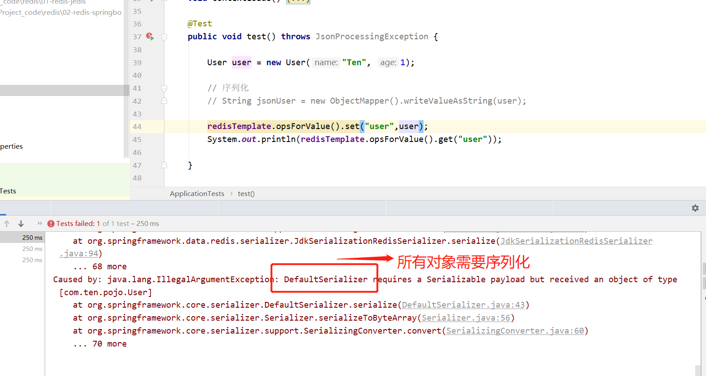


编写自己序列化配置类

```java
@Configuration
public class RedisConfig {

    // 编写我们自己的配置类

    @Bean
    @SuppressWarnings("all")
    public RedisTemplate<String, Object> redisTemplate(RedisConnectionFactory redisConnectionFactory) {

        // 我们为了自己开发方便，一般直接使用<String, Object>
        RedisTemplate<String, Object> template = new RedisTemplate<String, Object> ();
        template.setConnectionFactory(redisConnectionFactory);

        // json序列化配置
        Jackson2JsonRedisSerializer jackson2JsonRedisSerializer = new Jackson2JsonRedisSerializer(Object.class);
        ObjectMapper om = new ObjectMapper();
        om.setVisibility(PropertyAccessor.ALL, JsonAutoDetect.Visibility.ANY);
        om.enableDefaultTyping(ObjectMapper.DefaultTyping.NON_FINAL);
        jackson2JsonRedisSerializer.setObjectMapper(om);

        // String序列化
        StringRedisSerializer stringRedisSerializer = new StringRedisSerializer();

        // key采用string的序列化方式
        template.setKeySerializer(stringRedisSerializer);

        // hash的key也采用String的序列化方式
        template.setHashKeySerializer(stringRedisSerializer);

        // value序列化方式采用Jackson
        template.setValueSerializer(jackson2JsonRedisSerializer);

        // hash的value序列化方式采用jackson
        template.setHashKeySerializer(jackson2JsonRedisSerializer);

        template.afterPropertiesSet();

        return template;
    }
}
```


实际开发，为了方便，可以将这些方法抽取成工具类。（网上搜索RedisUtils有很多，具体结合实际项目）


思路：

1. 导入依赖
2. 编写配置文件
3. 测试
4. 根据实际要求，编写自己需要的序列化配置文件
5. 将redis中的方法抽取出来，做成工具类，以便后期开发使用。


# Redis.conf详解


1. 配置文件unit单位对大小写不敏感。

   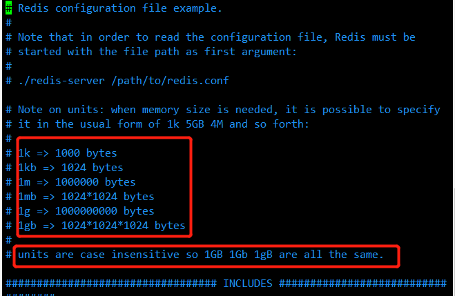

2. 包含，就好比我们学习Spring、import，include

   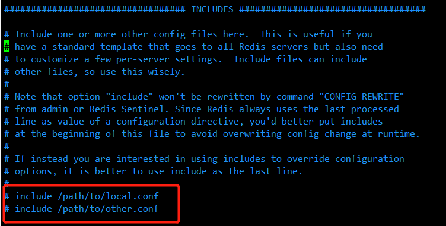

3. 网络

   ```bash
   bind 127.0.0.1 -::1		# 绑定的ip
   protected-mode yes		# 保护模式
   port 6379				# 端口设置
   ```

   

4. 通用GENERAL

   ```bash
   daemonize yes						# 以守护进程的方式运行（后台运行），默认是no，需要修改为yes
   pidfile /var/run/redis_6379.pid		# 如果以后台的方式运行，我们就需要指定一个pid文件
   
   # 日志
   # Specify the server verbosity level.
   # This can be one of:
   # debug (a lot of information, useful for development/testing)
   # verbose (many rarely useful info, but not a mess like the debug level)
   # notice (moderately verbose, what you want in production probably)				生产环境
   # warning (only very important / critical messages are logged)
   loglevel notice
   logfile ""					# 日志生成的文件位置名，如果为空，则为默认的位置输出
   databases 16				# 默认数据库数量为16个
   always-show-logo no			# 是否总是显示logo（开启服务时，数据库的logo）
   
   ```

   

5. 快照

   持久化，在规定的时间内，执行了多少次操作，则会持久化到文件 .rdb .aof

   redis是内存数据库，如果没有持久化，那么数据断点就会丢失！

   ```bash
   save 3600 1							# 如果900秒内，至少有1个key进行了修改，我们就进行持久化操作
   save 300 100						# 如果300秒内，至少有100个key进行了修改，我们就进行持久化操作
   save 60 10000						# 如果60秒内，至少有10000个key进行了修改，我们就进行持久化操作
   
   # 我们后面学习持久化，会自己定义这个测试
   
   stop-writes-on-bgsave-error yes		# 当bgsave快照操作出错时停止写数据到磁盘
   
   rdbcompression yes					# 是否压缩rdb文件，需要消耗一些cpu资源
   rdbchecksum yes						# 保存rdb文件的时候，进行错误的检查校验
   dir ./								# rdb持久化保存文件的目录
   ```

   

6. REPLICATION 复制，我们后面讲解主从复制的时候再讲解

   

7. SECURITY 安全

   ```bash
   config set requirepass "123456"		# 设置redis密码
   config get requirepass				# 获得密码
   auth 123456							# 使用密码登录认证
   ```

    

8. 限制CLIENTS

   ```bash
   maxclients 10000					# 设置能连接上redis的客户端的最大数量
   maxmemory <bytes>					# redis 配置最大的内存容量
   maxmemory-policy noeviction			# 内存到达上限之后的处理策略
   
   1、volatile-lru：只对设置了过期时间的key进行LRU（默认值） 
   2、allkeys-lru ： 删除lru算法的key   
   3、volatile-random：随机删除即将过期key   
   4、allkeys-random：随机删除   
   5、volatile-ttl ： 删除即将过期的   
   6、noeviction ： 永不过期，返回错误
   ```

   

9. APPEND ONLY 模式 aof配置

   ```bash
   appendonly no						# 默认是不开启aof模式的，默认使用rdb方式持久化的，在大部分情况下，rdb够用了
   appendfilename "appendonly.aof" 	# 持久化文件的名字
   
   # appendfsync always				# 每次修改都会sync。消耗性能
   appendfsync everysec				# 每秒执行一次 sync ，可能会丢失这1s的数据！
   # appendfsync no					# 不执行sync，这个时候操作系统自己同步数据，速度最快
   
   ```

   

# Redis持久化

面试和工作，持久化都是重点！

Redis是内存数据库，如果不将内存中的数据库状态保存到磁盘，那么一旦服务器进程退出，服务器中的数据库状态也会消失。所以Redis提供了持久化功能！

## RDB（RedisDataBase）

什么是RDB？ 

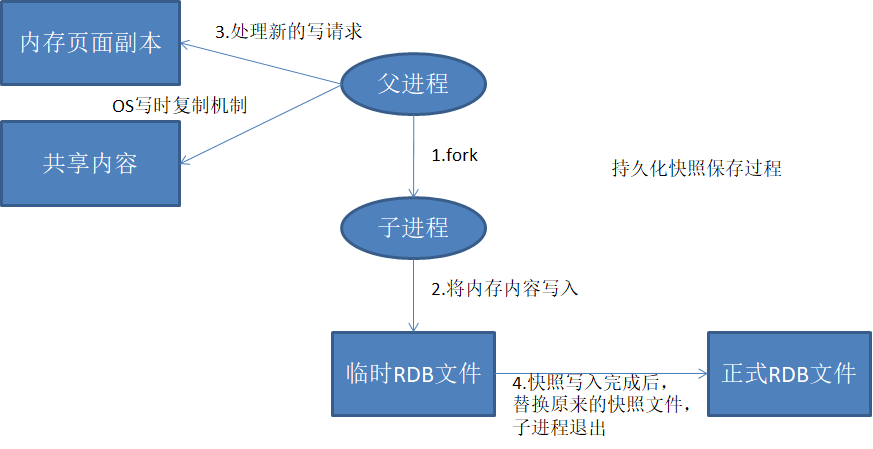

在指定的时间间隔内将内存中的数据极快写入磁盘，也就是行话说Snapshot快照，他恢复时是将快照文件直接读到内存里。

Redis会单独创建（fork）一个子进程来进行持久化，会先将数据写入到一个临时文件中，待持久化过程结束了，再用这个临时文件替换上次持久化好的文件。整个过程中，主进程是不进行任何IO操作的。这就确保了极高的性能。如果需要进行大规模数据的恢复，且对于数据恢复的完整性不是非常灵敏，那RDB方法要比AOF方式更加的高效。RDB的缺点是最后一次持久化后的数据可能会丢失。我们默认的就是RDB，一般情况下不需要修改这个配置！

==rdb保存的文件是dump.rdb==,都是在配置文件中的快照选项中配置的。


**触发机制**

1. save的规则满足的情况下，会自动触发rdb规则
2. 执行flushall命令，也会触发我们的rdb规则
3. 退出redis，也会产生rdb文件 

备份完就自动生成一个dump.rdb

**如何恢复rdb文件**

1. 只需要将rdb文件放在我们redis启动目录就可以，redis启动的时候会自动检查dump.rdb恢复其中的数据。

2. 查看需要存放的位置

   ```bash
   127.0.0.1:6379> config get dir
   1) "dir"
   2) "/usr/local/bin"					# 如果在这个目录下存在dump.rdb文件，启动就会自动恢复其中的数据。
   127.0.0.1:6379> 
   ```

    

   ```bash
   appendonly no						# 默认是不开启aof模式的，默认使用rdb方式持久化的，在大部分情况下，rdb够用了
   appendfilename "appendonly.aof" 	# 持久化文件的名字
   
   # appendfsync always				# 每次修改都会sync。消耗性能
   appendfsync everysec				# 每秒执行一次 sync ，可能会丢失这1s的数据！
   # appendfsync no					# 不执行sync，这个时候操作系统自己同步数据，速度最快
   
   ```


**重写规则说明**

aof默认的是无限追加，文件会越来远大。

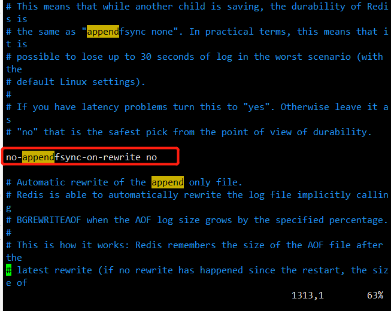

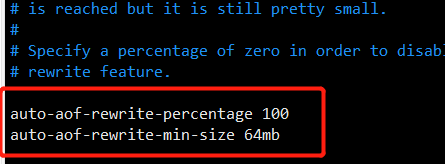

如果aof文件大于64m，将fork一个新的进程来将我们的文件进行重写。


**优点：**

1. 适合大规模的数据恢复！dump.rdb
2. 对数据的完整性要求不高

**缺点：**

1. 需要一定的时间间隔进行操作。如果redis意外宕机了，这个最后的一次修改数据就没了。
2. fork进程的时候，会占用一定的内容空间。


## AOF（Append Only File）

将我们所有的命令都记录下来，history，恢复的时候就把这个文件全部在执行一遍。


以日志形式来记录每个写操作，将redis执行过的执行记录下来（读操作不记录），只 许追加文件不可以改写文件，redis启动之初会读取该文件重新构建数据，换言之，redis重启的话就根据日志文件的内容将写指令从前到后执行一次以完成数据的恢复工作

aof保存的是appendonly.aof 文件

**append**

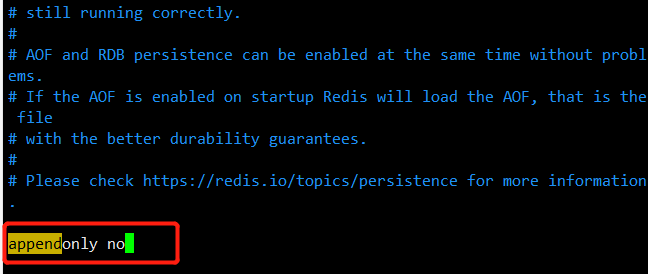

默认是不开启的，我们需要手动进行配置。我们只需要将appendonly改为yes就可以开启aof了

重启，redis就可以生效了。

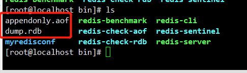

如果这个aof文件有错误，这时候redis是启动不起来的，我们需要修复这个aof文件，redis给我们提供了这样一个工具`redis-check-aof` （删掉错误的代码）

```bash
# redis-check-aof --fix appendonly.aof

[root@localhost bin]# ./redis-check-aof --fix appendonly.aof 
0x              87: Expected \r\n, got: 6661
AOF analyzed: size=153, ok_up_to=110, ok_up_to_line=33, diff=43
This will shrink the AOF from 153 bytes, with 43 bytes, to 110 bytes
Continue? [y/N]: y
Successfully truncated AOF
[root@localhost bin]# 
```

如果文件正常了，启动redis就可以恢复了。

优点：

1. 每次修改都会同步，文件的完整会更加好！
2. 每秒同步一次，可能会丢失一秒的数据
3. 从不同步，效率最高。

缺点：

1. 相对于数据文件来说，aof远远大于rdb，修复的速度也被rdb慢。
2. aof运行效率也要比rdb慢，所以我们redis默认的配置就是rdb持久化！


# Redis发布订阅

Redis发布订阅（pub/sub)是一种==消息通信模式==：发送者(pub)发送消息，订阅者(sub)接收消息。微信、微博、关注系统。

Redis客户端可以订阅任意数量的频道

订阅/发布消息图：

第一个：消息发送者，第二个：频道，第三个：消息订阅者

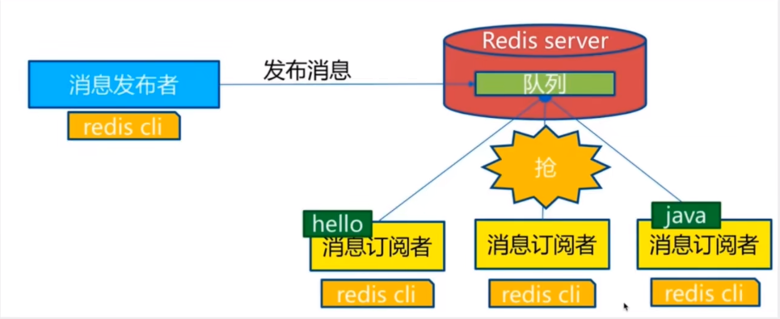

下图展示了频道channel1，以及订阅这个频道的三个客户端——client2、client5、client1之间的关系：

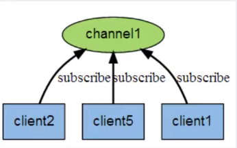

当有新消息通过publish命令发送到频道channel1时，这个消息会被发送给订阅他的三个客户端：


**命令**

这些命令被广泛用于构建即时通信应用，比如网络聊天室（chatroom)和实时广播、实时提醒等。


**测试**

先订阅一个频道Ten

```bash
127.0.0.1:6379> SUBSCRIBE Ten
Reading messages... (press Ctrl-C to quit)
1) "subscribe"
2) "Ten"
3) (integer) 1
```

再开一个进程，发布消息

```bash
127.0.0.1:6379> PUBLISH Ten "hello Ten"
(integer) 1
127.0.0.1:6379> 
```

最后频道这么就会自动更新内容

```bash
127.0.0.1:6379> SUBSCRIBE Ten
Reading messages... (press Ctrl-C to quit)
1) "subscribe"
2) "Ten"
3) (integer) 1
1) "message"
2) "Ten"
3) "hello Ten"
```


# Redis主从复制

### 概念

主从复制,是指将一台Redis服务器的数据，复制到其他的Redis服务器。前者称为主节点(master/leader)，后者称为从节点(slave/follower)；==数据的复制是单向的，只能由主节点到从节点==。Master以写为主 ，Slave以读为主。

==默认情况下，每台Redis服务器都是主节点==；且一个主节点可以有多个从节点(或没有从节点) ，但一个从节点只能有一个主节点。

主从复制的作用主要包括：

1. 数据冗余：主从复制实现了数据的热备份,是持久化之外的一种数据冗余方式。

2. 故障恢复：当主节点出现问题时，可以由从节点提供服务，实现快速的故障恢复；实际上是一种服务的冗余。

3. 负载均衡：在主从复制的基础，上配合读写分离，可以由主节点提供写服务，由从节点提供读服务(即写Redis数据时应用连接

   主节点，读Redis数据时应用连接从节点) ， 分担服务器负载；尤其是在写少读多的场景下，通过多个从节点分担读负载，可以大

   大提高Redis服务器的并发量。

4. 高可用（集群）基石：除了上述作用以外，主从复制还是哨兵和集群能够实施的基础，因此说主从复制是Redis高可用的基础。

     

一般来说,要将Redis运用于工程项目中，只使用一台Redis是万万不能的（宕机），原因如下：

1. 从结构上，单个Redis服务器会发生单点故障，并且一台服务器需要处理所有的请求负载，压力较大；
2. 从容量上，单个Redis服务器内存容量有限，就算一台Redis服务器内存容量为256G ，也不能将所有内存用作Redis存储内存，一般来说，==单台Redis最大使用内存不应该超过20G==。

电商网站上的商品，一般都是一次上传，无数次浏览的，说专业点也就是"多读少写"。

对于这种场景我们可以使如下这种架构 ：

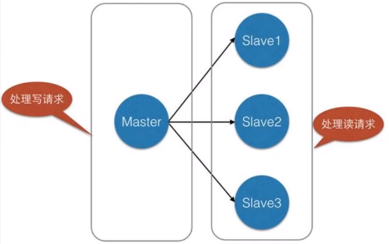

主从复制，读写分离！80%的情况下都是在进行读操作！减缓服务器的压力。架构中经常使用。一主二从。


### 环境配置

只配置从库，不用配置主库。

```bash
127.0.0.1:6379> info replication							# 查看当前库的信息
# Replication												
role:master													# 角色master
connected_slaves:0											# 没有从机	
master_failover_state:no-failover
master_replid:c24b4990216f9f43edd239880dd084fb611f24d6
master_replid2:0000000000000000000000000000000000000000
master_repl_offset:0
second_repl_offset:-1
repl_backlog_active:0
repl_backlog_size:1048576
repl_backlog_first_byte_offset:0
repl_backlog_histlen:0
127.0.0.1:6379> 
```

复制三个文件，修改对应的信息

1. 端口
2. pid名字
3. log文件名字
4. dump.rdb名字

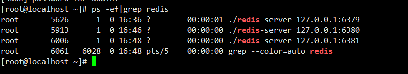


### 一主二从

==默认情况下，每台Redis服务器都是主节点==；我们一般情况下只用配置从机就好了

```bash
slaveof 127.0.0.1 6379			# 找主机

```

主机有密码的，在从机的配置文件conf里加上：masterpass 密码

主机

```bash
127.0.0.1:6379> info replication
# Replication
role:master
connected_slaves:2
slave0:ip=127.0.0.1,port=6381,state=online,offset=56,lag=1
slave1:ip=127.0.0.1,port=6380,state=online,offset=56,lag=0
master_failover_state:no-failover
master_replid:9a9b9c66882dedab9eeacbc42faaea7da17252c5
master_replid2:0000000000000000000000000000000000000000
master_repl_offset:56
second_repl_offset:-1
repl_backlog_active:1
repl_backlog_size:1048576
repl_backlog_first_byte_offset:1
repl_backlog_histlen:56
127.0.0.1:6379> 
```

从机

```bash
127.0.0.1:6380> info replication
# Replication
role:slave
master_host:127.0.0.1
master_port:6379
master_link_status:up
master_last_io_seconds_ago:10
master_sync_in_progress:0
slave_read_repl_offset:28
slave_repl_offset:28
slave_priority:100
slave_read_only:1
replica_announced:1
connected_slaves:0
master_failover_state:no-failover
master_replid:9a9b9c66882dedab9eeacbc42faaea7da17252c5
master_replid2:0000000000000000000000000000000000000000
master_repl_offset:28
second_repl_offset:-1
repl_backlog_active:1
repl_backlog_size:1048576
repl_backlog_first_byte_offset:1
repl_backlog_histlen:28
127.0.0.1:6380> 
```


**细节**

主机可以写，从机不可以写，只能读！主机中的所有信息和数据，都会自动被从机保存。

```bash
127.0.0.1:6379> keys *
(empty array)
127.0.0.1:6379> set k1 v1
OK
127.0.0.1:6379> 
```

从机只读

```bash
127.0.0.1:6380> keys *
1) "k1"
127.0.0.1:6380> get k1
"v1"
127.0.0.1:6380> set k2 v2
(error) READONLY You can't write against a read only replica.
127.0.0.1:6380>
```

测试：主机断开连接，从机依旧连接到主机的，但是没有写操作了，这个时候，主机如果回来了依旧可以获取到主机写的信息！

如果是使用命令行，来配置的主从，这个时候如果重启了，就会变成主机！只要变为从机，立马就会从主机中获取值！


**复制原理**

Slave启动成功连接到master后会发送一个sync命令

Master接到命令，启动后台的存盘进程，同时收集所有接收到的用于修改数据集命令，在后台进程执行完毕之后，==master将传送整个数据文件到slave，并完成一次完全同步==。

==全量复制==：而slave服务在接收到数据库文件数据后，将其存盘并加载到内存中。

==增量复制==：Master继续将新的所有收集到的修改命令依次传给slave，完成同步

但是只要是重新连接master，一次完全同步（全量复制）将被自动执行。


**层层链路**

上一个M链接下一个S,也可以完成主从复制。

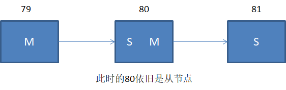

如果主机断开了连接，我们可以使用`SLAVEOF no one`手动变成主机。其他节点就可以手动连接到这个最新的主机 


### 哨兵模式

（自动选举主机的模式）

**概述**

主从切换技术的方法是：当主服务器宕机后，需要手动把一台服务器切换为主服务器，这就需要人工干预，费时费力，还会造成一段时间内服务不可用。这不是推荐的方式，更多的时候，我们优先考虑哨兵模式。Redis从2.8开始正式提供了Sentinel（哨兵）架构来解决这个问题。

自动版，能够后台监控主机是否故障，如果故障了根据投票数==自动将从库转换为主库==。

哨兵模式是一种特殊的模式，首先Redis提供了哨兵的命令，哨兵是一个独立的进程，作为进程，它会独立运行。其原理是哨兵通过发送命令，等待Redis服务器响应，从而监控运行的多个Redis实例。

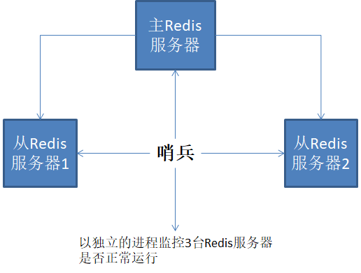


这里的哨兵的两个作用

- 通过发送命令，让Redis服务器返回监控其运行状态，包括主服务器和从服务器。
- 当哨兵检测到了master宕机，会自动将slave切换成master，然后通过==发布订阅模式==通知其他的从服务器，修改配置文件，让它们切换主机

然而一个哨兵进程对Redis服务器进行监控，可能会出现问题，为此，我们可以使用多个哨兵进行监控。各个哨兵之间还回进行监控，这样就行程了多哨兵的模式。


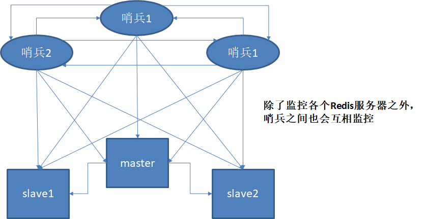

假设主服务器宕机，哨兵1先检测到这个结果，系统并不会马上进行failover过程，仅仅是哨兵1主观的认为主服务器不可用，这个现象为**主观下线**。当后面的哨兵也检测到主服务器不可用，并且达到一定值时，那么哨兵之间就会进行一次投票，投票的结果由一个哨兵发起，进行failover（故障转移）操作。切换成功后，就会通过发布订阅模式，让各个哨兵把自己监控的从服务器实现切换主机，这个过程称为**客观下线**。


**测试**

1. 配置哨兵配置文件sentinel.config

   ```bash
   # sentinel monitor 被监视的名称 host port 1sentinel monitor myredis 127.0.0.1 6379 1
   ```

   后面的1，代表主机挂了之后，slave投票看让谁接替成为主机。

2. 启动

   ```bash
   [root@localhost bin]# ./redis-sentinel ./myredisconf/sentinel.conf		# 启动
   ```

   

   ```bash
   [root@localhost bin]# ./redis-sentinel ./myredisconf/sentinel.conf 
   8463:X 10 Nov 2021 20:38:26.820 # oO0OoO0OoO0Oo Redis is starting oO0OoO0OoO0Oo
   8463:X 10 Nov 2021 20:38:26.820 # Redis version=6.2.6, bits=64, commit=00000000, modified=0, pid=8463, just started
   8463:X 10 Nov 2021 20:38:26.820 # Configuration loaded
   8463:X 10 Nov 2021 20:38:26.821 * Increased maximum number of open files to 10032 (it was originally set to 1024).
   8463:X 10 Nov 2021 20:38:26.821 * monotonic clock: POSIX clock_gettime
                   _._                                                  
              _.-``__ ''-._                                             
         _.-``    `.  `_.  ''-._           Redis 6.2.6 (00000000/0) 64 bit
     .-`` .-```.  ```\/    _.,_ ''-._                                  
    (    '      ,       .-`  | `,    )     Running in sentinel mode
    |`-._`-...-` __...-.``-._|'` _.-'|     Port: 26379
    |    `-._   `._    /     _.-'    |     PID: 8463
     `-._    `-._  `-./  _.-'    _.-'                                   
    |`-._`-._    `-.__.-'    _.-'_.-'|                                  
    |    `-._`-._        _.-'_.-'    |           https://redis.io       
     `-._    `-._`-.__.-'_.-'    _.-'                                   
    |`-._`-._    `-.__.-'    _.-'_.-'|                                  
    |    `-._`-._        _.-'_.-'    |                                  
     `-._    `-._`-.__.-'_.-'    _.-'                                   
         `-._    `-.__.-'    _.-'                                       
             `-._        _.-'                                           
                 `-.__.-'                                               
   
   8463:X 10 Nov 2021 20:38:26.822 # WARNING: The TCP backlog setting of 511 cannot be enforced because /proc/sys/net/core/somaxconn is set to the lower value of 128.
   8463:X 10 Nov 2021 20:38:26.837 # Sentinel ID is bd3c3a2017d9d9c4ee03c810ae071661cd4be1d7
   8463:X 10 Nov 2021 20:38:26.837 # +monitor master myredis 127.0.0.1 6379 quorum 1
   8463:X 10 Nov 2021 20:38:26.838 * +slave slave 127.0.0.1:6380 127.0.0.1 6380 @ myredis 127.0.0.1 6379
   8463:X 10 Nov 2021 20:39:37.137 * +slave slave 127.0.0.1:6381 127.0.0.1 6381 @ myredis 127.0.0.1 6379
   ```

   如果主机挂了，哨兵会自动投票选举出新的主机。

   哨兵日志

   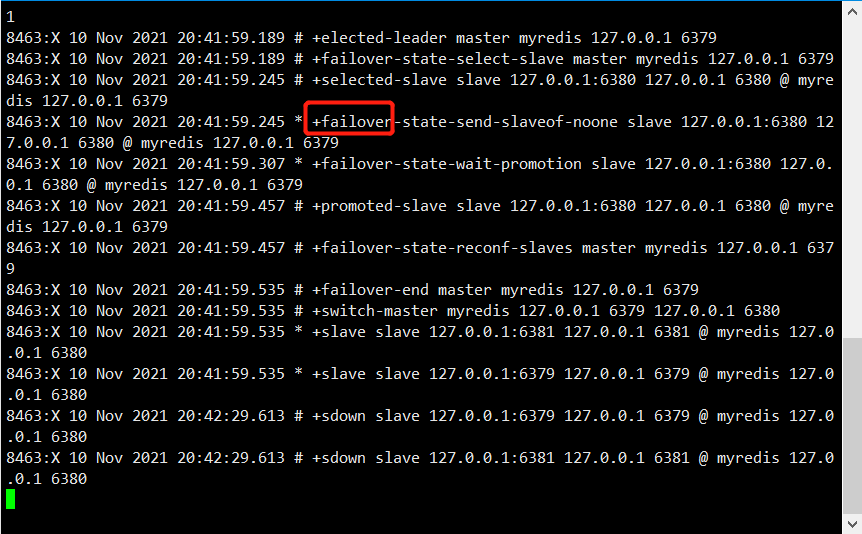

如果主机再次恢复过来，也只能是归并到新的主机下，当做从机，这就是哨兵模式的规则。


**哨兵模式**

优点：

1. 哨兵集群，基于主从复制模式，所有的主从配置优点，他全有。
2. 主从可以切换，故障可以转移，系统的可用性就会更好。
3. 哨兵模式就是主从模式的升级，手动到自动，更加健壮。

缺点：

1. Redis不好在线扩容，集群容量一旦到达上限，在线扩容级十分麻烦。
2. 实现哨兵模式的配置其实是很麻烦的，里面有很多选择。


**哨兵模式的全部配置**

```bash
# Example sentinel.conf  
  
# 哨兵sentinel实例运行的端口 默认26379  
port 26379  
  
# 哨兵sentinel的工作目录  
dir /tmp  
  
# 哨兵sentinel监控的redis主节点的 ip port   
# master-name  可以自己命名的主节点名字 只能由字母A-z、数字0-9 、这三个字符".-_"组成。  
# quorum 当这些quorum个数sentinel哨兵认为master主节点失联 那么这时 客观上认为主节点失联了  
# sentinel monitor <master-name> <ip> <redis-port> <quorum>  
  sentinel monitor mymaster 127.0.0.1 6379 2  
  
# 当在Redis实例中开启了requirepass foobared 授权密码 这样所有连接Redis实例的客户端都要提供密码  
# 设置哨兵sentinel 连接主从的密码 注意必须为主从设置一样的验证密码  
# sentinel auth-pass <master-name> <password>  
sentinel auth-pass mymaster MySUPER--secret-0123passw0rd  
  
  
# 指定多少毫秒之后 主节点没有应答哨兵sentinel 此时 哨兵主观上认为主节点下线 默认30秒  
# sentinel down-after-milliseconds <master-name> <milliseconds>  
sentinel down-after-milliseconds mymaster 30000  
  
# 这个配置项指定了在发生failover主备切换时最多可以有多少个slave同时对新的master进行 同步，  
这个数字越小，完成failover所需的时间就越长，  
但是如果这个数字越大，就意味着越 多的slave因为replication而不可用。  
可以通过将这个值设为 1 来保证每次只有一个slave 处于不能处理命令请求的状态。  
# sentinel parallel-syncs <master-name> <numslaves>  
sentinel parallel-syncs mymaster 1  
  
  
  
# 故障转移的超时时间 failover-timeout 可以用在以下这些方面：   
#1. 同一个sentinel对同一个master两次failover之间的间隔时间。  
#2. 当一个slave从一个错误的master那里同步数据开始计算时间。直到slave被纠正为向正确的master那里同步数据时。  
#3.当想要取消一个正在进行的failover所需要的时间。    
#4.当进行failover时，配置所有slaves指向新的master所需的最大时间。不过，即使过了这个超时，slaves依然会被正确配置为指向master，但是就不按parallel-syncs所配置的规则来了  
# 默认三分钟  
# sentinel failover-timeout <master-name> <milliseconds>  
sentinel failover-timeout mymaster 180000  
  
# SCRIPTS EXECUTION  
  
#配置当某一事件发生时所需要执行的脚本，可以通过脚本来通知管理员，例如当系统运行不正常时发邮件通知相关人员。  
#对于脚本的运行结果有以下规则：  
#若脚本执行后返回1，那么该脚本稍后将会被再次执行，重复次数目前默认为10  
#若脚本执行后返回2，或者比2更高的一个返回值，脚本将不会重复执行。  
#如果脚本在执行过程中由于收到系统中断信号被终止了，则同返回值为1时的行为相同。  
#一个脚本的最大执行时间为60s，如果超过这个时间，脚本将会被一个SIGKILL信号终止，之后重新执行。  
  
#通知型脚本:当sentinel有任何警告级别的事件发生时（比如说redis实例的主观失效和客观失效等等），将会去调用这个脚本，  
这时这个脚本应该通过邮件，SMS等方式去通知系统管理员关于系统不正常运行的信息。调用该脚本时，将传给脚本两个参数，  
一个是事件的类型，  
一个是事件的描述。  
如果sentinel.conf配置文件中配置了这个脚本路径，那么必须保证这个脚本存在于这个路径，并且是可执行的，否则sentinel无法正常启动成功。  
#通知脚本  
# sentinel notification-script <master-name> <script-path>  
  sentinel notification-script mymaster /var/redis/notify.sh  
  
# 客户端重新配置主节点参数脚本  
# 当一个master由于failover而发生改变时，这个脚本将会被调用，通知相关的客户端关于master地址已经发生改变的信息。  
# 以下参数将会在调用脚本时传给脚本:  
# <master-name> <role> <state> <from-ip> <from-port> <to-ip> <to-port>  
# 目前<state>总是“failover”,  
# <role>是“leader”或者“observer”中的一个。   
# 参数 from-ip, from-port, to-ip, to-port是用来和旧的master和新的master(即旧的slave)通信的  
# 这个脚本应该是通用的，能被多次调用，不是针对性的。  
# sentinel client-reconfig-script <master-name> <script-path>  
 sentinel client-reconfig-script mymaster /var/redis/reconfig.sh
```


# Redis缓存穿透、击穿和雪崩

面试高频，工作常用。服务的高可用问题。

Redis缓存的使用，极大的提升了应用程序的性能和效率，特别是数据查询方面。但同时，他也带来了一些问题。其中，最要害的问题，就是数据的一致性问题，从严格意义上讲，这个问题无解。如果对数据的一致性要求很高，那么就不能使用缓存。

另外的一些典型问题就是，缓存穿透、缓存雪崩和缓存击穿。目录，业界也都有比较流行的解决方案。

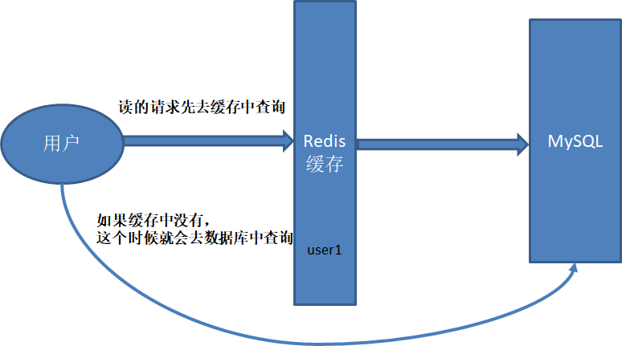

## 缓存穿透（查不到）

**概念**

缓存穿透的概念很简单，用户想要查询一个数据，发现redis内存数据库中没有，也就是缓存没有命中，于是向持久层数据库查询。发现也没有，本次查询失败。当用户很多的时候，缓存都没有命中（秒杀），都去请求了持久层数据库。这会给持久层数据库造成很大的压力，这时候就相当于缓存穿透。


**布隆过滤器**

布隆过滤器是一种数据结构，对所有可能查询的参数以hash形式存储，在控制层先进行校验，不符合则丢弃，从而避免了对底层存储系统的查询压力；


**缓存空对象**

当存储层不命中后，即使返回的空对象也将其缓存起来，同时会设置一个过期时间，之后再访问这个数据将会从缓存中获取，保护了后端数据源。

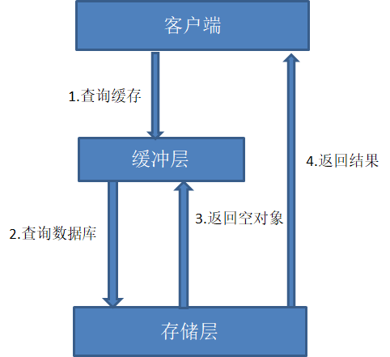

但是这种方法会存在两个问题：

1. 如果空值能够被缓存起来，这就意味着缓存需要更多的空间存储更多的键，因为这当中可能会有很多的空值的键；
2. 即使对空值设置了过期时间，还是会存在缓冲层和存储层的数据会有一段时间窗口的不一致，这对于需要保存一致性的业务会有影响。


## 缓存击穿（量太大，缓存过期）

**概述**

这里需要注意和缓存穿透的区别，缓存击穿是指一个key非常热点，在不停的扛着大并发，大并发集中对这一个点进行访问，当这个key在失效的瞬间，持续的大并发级穿透缓存，直接请求数据库，就像在一个屏幕上凿开了一个洞。

当某个key在过期瞬间，有大量的请求并发访问，这类数据一般都是热点数据，由于缓存过期，会同时访问数据库来查询最新数据，并且回写缓存，会导致数据库瞬间压力过大。


**解决方案**

**设置热点数据永不过期**

从缓存层面来看，没有设置过期时间，所以不会出现热点key过期后产生的问题。

**加互斥锁**

分布式锁：使用分布式锁，保证对于每个key同时只有一个线程去查询后端服务，其他线程没有获得分布式锁的权限，因此只需要等待即可。这种方式将高并发的压力转移到分布式锁，因此对分布式锁的考验很大。

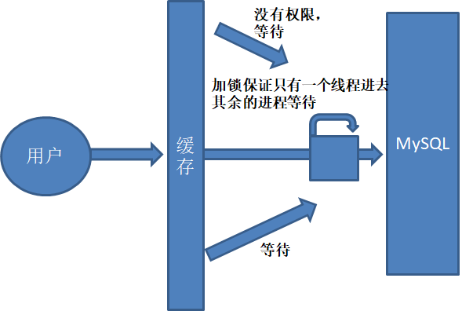

## 缓存雪崩 

**概念**

缓存雪崩，是指在某一个时间段，缓存集中过期失效。Redis宕机！

产生雪崩的原因之一，比如双十一零点抢购，这波商品时间比较集中的放入了缓存，假设缓存一个小时。那么到凌晨一点的时候，这批商品的缓存就过期了。而这批商品的访问查询，都落到了数据库上，对于数据库而言，就会产生周期性的压力波峰。于是所有的请求都会达到存储层，存储层的调用会暴增，造成存储层也会挂掉的情况。

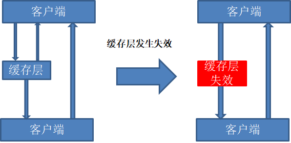

其实集中过期倒不是非常致命，比较致命的缓存雪崩是缓存服务器某个节点宕机或者断网。因为自然形成的缓存雪崩，一定是在某个时间段集中创建缓存，这个时候数据库也是可以顶住压力的。无非就是对数据库产生周期性的压力而已。而缓存服务节点的宕机，对数据库服务器造成的压力是不可预知的，很有可能瞬间就把数据库压垮。

 

**解决方案**

**redis高可用**

这个思想的含义是，既然redis有可能挂掉，那我就多增设几台redis，这样一台挂掉之后其他的还可以继续工作，其实就是搭建的集群（异地多活）。

**限流降级**

这个解决方案的思想就是在缓存失效后，通过加锁或者队列来控制读数据库缓存的线程数量。比如对某个key只允许一个线程查询数据和写缓存，其他线程等待。

**数据预热**

数据预热的含义就是在正式部署之前，先把可能的数据预先访问一遍，这样部分可能大量访问的数据就会加载到缓存中。在即将发生大并发访问前手动触发加载缓存不同的key，设置不同的过期时间，让缓存失效的时间尽量均匀。

