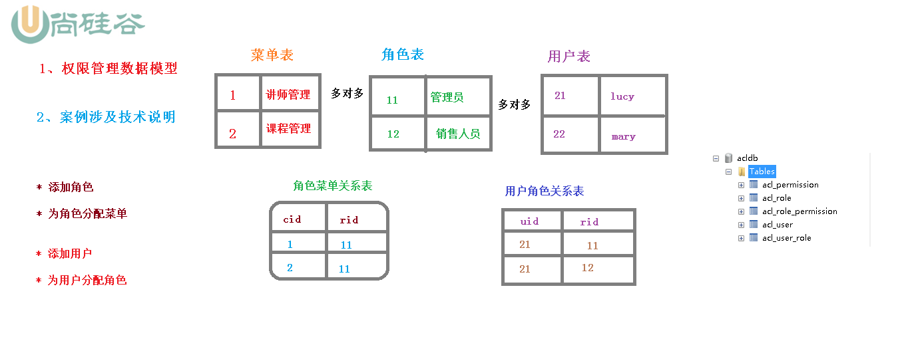

# SpringSecurity笔记

# 1 SpringSecurity介绍

## 1.1 概要

用户认证（authentication）和用户授权（authorization）

用户认证指：登录

用户授权指：是否有权限做某些事件

## 1.2 同款产品对比

### **SpringSecurity**

- SpringSecurity 特点：
- 和 Spring 无缝整合。 
- 全面的权限控制。
- 专门为 Web 开发而设计。
  - 旧版本不能脱离 Web 环境使用。 
  - 新版本对整个框架进行了分层抽取，分成了核心模块和 Web 模块。单独 引入核心模块就可以脱离 Web 环境。 
- 重量级。


### **Shiro**

特点： 

- 轻量级。Shiro 主张的理念是把复杂的事情变简单。针对对性能有更高要求 的互联网应用有更好表现。 
- 通用性。 
  - 好处：不局限于 Web 环境，可以脱离 Web 环境使用。
  - 缺陷：在 Web 环境下一些特定的需求需要手动编写代码定制。


# 2 入门案例

创建一个springboot工程，导入依赖，编写一个controller，访问端口号，看到登录页面，账号为user,密码为控制台输出的一串，输入完成后，就可以看到controller返回的内容了。

# SpringSecurity 基本原理

## 本质

SpringSecurity 本质是一个**过滤器链**：

代码底层流程：重点看三个过滤器：

 **FilterSecurityInterceptor**：是一个**方法级的**权限过滤器, 基本位于过滤链的最底部


super.beforeInvocation(fi) 表示查看之前的 filter 是否通过。

 fi.getChain().doFilter(fi.getRequest(), fi.getResponse());表示真正的调用后台的服务。


**ExceptionTranslationFilter**：是个**异常过滤器**，用来处理在认证授权过程中抛出的异常


**UsernamePasswordAuthenticationFilter** ：对**/login 的 POST 请求做拦截**，校验表单中用户 名，密码。


## 过滤器加载过程

### 使用SpringSecurity配置过滤器

DelegatingFilterProxy

找到doFilter方法，里面有一个初始化initDelegate方法


点进去，重点在getBean这里，这里就是加载了过滤链，FilterChainProxy


打开FilterChainProxy类，找到doFilter方法，发现不管怎么样，都调用了doFilterInternal这个方法


打开doFilterInternal方法，发现这个是List集合的过滤链


继续进去getFilters，发现这个是迭代器，里面实现了拦截器的获取，并返回


## 两个重要接口

### UserDetailsService接口

查询数据库用户名和密码过程

创建类继承`UsernamePasswordAuthenticationFilter`，重写三个方法`attemptAuthentication`,`successfulAuthentication`,

`unsuccessfulAuthentication`，验证用户名和密码，如果成功就调用成功的方法，失败就调用失败的。后面两个方法在父类`AbstractAuthenticationProcessingFilter`.

创建类实现`UserDetailsService`接口，编写查询数据库的过程，返回User对象，这个User对象是安全框架提供的。


### PasswordEncoder接口

数据加密接口，用于返回User对象里面密码加密


# web权限方案-用户认证

## 方法一：在配置文件添加用户信息

```properties
server.port=8111
spring.security.user.name=atguigu
spring.security.user.password=atguigu
```


## 方法二：编写配置类

```java
@Configuration
public class SecurityConfig extends WebSecurityConfigurerAdapter {
    @Override
    protected void configure(AuthenticationManagerBuilder auth) throws Exception {
        auth.inMemoryAuthentication().withUser("lucy").password("123").roles("admin");
    }
}
```

启动的时候，发现报错

java.lang.IllegalArgumentException: There is no PasswordEncoder mapped for the id "null"

加密的时候，需要用到一个接口，否则无法加密

**解决：**

注入一个Bean，` PasswordEncoder `，返回密码对象

完整代码

```java
@Configuration
public class SecurityConfig extends WebSecurityConfigurerAdapter {
    @Override
    protected void configure(AuthenticationManagerBuilder auth) throws Exception {
        BCryptPasswordEncoder passwordEncoder = new BCryptPasswordEncoder();
        String password = passwordEncoder.encode("123");
        auth.inMemoryAuthentication().withUser("lucy").password(password).roles("admin");
    }
    @Bean
    PasswordEncoder passwordEncoder(){
        return new BCryptPasswordEncoder();
    }
}
```


## 方法三：自定义配置类

第一步：编写一个配置类，设置使用哪个UserDetailsService实现类

```java
@Configuration
public class SecurityConfigTest extends WebSecurityConfigurerAdapter {
    @Autowired
    private UserDetailsService userDetailsService;
    @Override
    protected void configure(AuthenticationManagerBuilder auth) throws Exception {
       auth.userDetailsService(userDetailsService).passwordEncoder(passwordEncoder());
    }
    @Bean
    PasswordEncoder passwordEncoder(){
        return new BCryptPasswordEncoder();
    }
}
```

第二步：创建一个实现类，返回User对象，User对象有用户名密码和操作权限

```java
@Service("userDetailsService")
public class MyUserDetailsService implements UserDetailsService {
    @Override
    public UserDetails loadUserByUsername(String s) throws UsernameNotFoundException {
        List<GrantedAuthority> auths = AuthorityUtils.commaSeparatedStringToAuthorityList("role");
        return new User("mary",new BCryptPasswordEncoder().encode("123"),auths);
    }
}
```


## 实现数据库认证来完成用户登录

创建数据库和对应的表

```mysql
USE demo;

CREATE TABLE users(
 id BIGINT PRIMARY KEY AUTO_INCREMENT,
username VARCHAR(20) UNIQUE NOT NULL,
PASSWORD VARCHAR(100)
);

INSERT INTO users VALUES(1,'张
san','$2a$10$2R/M6iU3mCZt3ByG7kwYTeeW0w7/UqdeXrb27zkBIizBvAven0/na');
-- 密码 atguigu
INSERT INTO users VALUES(2,'李
si','$2a$10$2R/M6iU3mCZt3ByG7kwYTeeW0w7/UqdeXrb27zkBIizBvAven0/na');
```


导入依赖

```xml
<dependencies>
    <dependency>
        <groupId>org.springframework.boot</groupId>
        <artifactId>spring-boot-starter</artifactId>
    </dependency>

    <dependency>
        <groupId>org.springframework.boot</groupId>
        <artifactId>spring-boot-starter-web</artifactId>
    </dependency>

    <dependency>
        <groupId>org.springframework.boot</groupId>
        <artifactId>spring-boot-starter-security</artifactId>
    </dependency>

    <dependency>
        <groupId>org.springframework.boot</groupId>
        <artifactId>spring-boot-starter-test</artifactId>
        <scope>test</scope>
    </dependency>

    <!--mybatis-plus-->
    <dependency>
        <groupId>com.baomidou</groupId>
        <artifactId>mybatis-plus-boot-starter</artifactId>
        <version>3.0.5</version>
    </dependency>
    <!--mysql-->
    <dependency>
        <groupId>mysql</groupId>
        <artifactId>mysql-connector-java</artifactId>
    </dependency>
    <!--lombok 用来简化实体类-->
    <dependency>
        <groupId>org.projectlombok</groupId>
        <artifactId>lombok</artifactId>
    </dependency>

</dependencies>
```


在配置文件中添加数据库配置

```properties
# 数据库配置
spring.datasource.driver-class-name=com.mysql.cj.jdbc.Driver
spring.datasource.url=jdbc:mysql://localhost:3306/demo?serverTimezone=GMT%2B8
spring.datasource.username=root
spring.datasource.password=root
```

编写实体类

```java
@Data
public class Users {
    private Integer id;
    private String username;
    private String password;
}
```

编写mapper

```java
@Repository
public interface UsersMapper extends BaseMapper<Users> {
}
```

编写service

```java
@Service("userDetailsService")
public class MyUserDetailsService implements UserDetailsService {
    @Autowired
    private UsersMapper usersMapper;
    @Override
    public UserDetails loadUserByUsername(String username) throws UsernameNotFoundException {
        // 根据用户名查询数据库
        QueryWrapper<Users> wrapper = new QueryWrapper<>();
        wrapper.eq("username",username);
        Users users = usersMapper.selectOne(wrapper);
        if (users == null){
            // 如果user为空，直接抛出异常
            throw new UsernameNotFoundException("用户为空");
        }

        List<GrantedAuthority> auths = AuthorityUtils.commaSeparatedStringToAuthorityList("role");
        return new User(users.getUsername(),new BCryptPasswordEncoder().encode(users.getPassword()),auths);
    }
}
```

debug测试


## 自定义完成登录页面

在配置类中重写configure方法

```java
@Configuration
public class SecurityConfigTest extends WebSecurityConfigurerAdapter {
    @Autowired
    private UserDetailsService userDetailsService;
    @Override
    protected void configure(AuthenticationManagerBuilder auth) throws Exception {
       auth.userDetailsService(userDetailsService).passwordEncoder(passwordEncoder());
    }
    @Bean
    PasswordEncoder passwordEncoder(){
        return new BCryptPasswordEncoder();
    }

    @Override
    protected void configure(HttpSecurity http) throws Exception {
        http.formLogin()    // 自定义编写的登录页面
                .loginPage("/login.html")       // 登录页面设置
                .loginProcessingUrl("/user/login")  // 登录页面访问路径
                .defaultSuccessUrl("/text/index").permitAll()   // 登录成功跳转到的页面
                .and().authorizeRequests()
                    .antMatchers("/","/test/hello","/user/login").permitAll()      // 哪些请求可以放行
                .anyRequest().authenticated()
                .and().csrf().disable();        // 关闭csrf防护
    }
}
```

编写登录页面

```html
<!DOCTYPE html>
<html lang="en">
<head>
    <meta charset="UTF-8">
    <title>Title</title>
</head>
<body>
    <form action="/user/login" method="post">
        用户名：<input type="text" name="username">
        密码：<input type="text" name="password">
        <input type="submit" value="login">
    </form>
</body>
</html>
```

新增controller

```java
@RestController
@RequestMapping("/test")
public class testController {

    @GetMapping("hello")
    public String hello(){
        return "hello security";
    }
    @GetMapping("index")
    public String index(){
        return "hello index";
    }
}
```

测试，先访问/test/hello,再访问/test/index


# web权限方案-用户授权

## 基于权限访问控制

### hasAuthority方法和hasAnyAuthority方法

(type=Forbidden, status=403).没有权限

在实现类添加权限List<GrantedAuthority> auths = AuthorityUtils.commaSeparatedStringToAuthorityList("admins");

在配置类添加下面的方法

```java
@Override
protected void configure(HttpSecurity http) throws Exception {
    http.formLogin()    // 自定义编写的登录页面
            .loginPage("/login.html")       // 登录页面设置
            .loginProcessingUrl("/user/login")  // 登录页面访问路径
            .defaultSuccessUrl("/text/index").permitAll()   // 登录成功跳转到的页面
            .and().authorizeRequests()
                .antMatchers("/","/test/hello","/user/login").permitAll()      // 哪些请求可以放行
            // 当前用户登录，只有只有admins权限才可以访问这个路径
            // hasAuthority方法，只能一个
            //.antMatchers("/test/index").hasAuthority("admins")

            // hasAnyAuthority方法，可以多个
            .antMatchers("/test/index").hasAnyAuthority("admins,role")
            .anyRequest().authenticated()
            .and().csrf().disable();        // 关闭csrf防护
}
```


## 基于角色访问控制

## hasRole和hasAnyRole

在实现类中添加role的时候要注意格式，需要加上ROLE_前缀，可以通过查看源码发现

```java
List<GrantedAuthority> auths = AuthorityUtils.commaSeparatedStringToAuthorityList("admins,ROLE_sale");
```

配置类

```java
// 3.hasRole
.antMatchers("/test/index").hasRole("sale")
```

hasAnyRole和上面的类型，多个角色用逗号隔开就行。


## 自定义403页面


```java
@Override
protected void configure(HttpSecurity http) throws Exception {
    // 配置没有权限跳转的页面
    http.exceptionHandling().accessDeniedPage("/unauth.html");
```

页面

```html
<!DOCTYPE html>
<html lang="en">
<head>
    <meta charset="UTF-8">
    <title>Title</title>
</head>
<body>
    <h1>没有访问权限！</h1>
</body>
</html>
```


## 注解使用

 使用注解先要开启注解功能！ @EnableGlobalMethodSecurity(securedEnabled=true)

###  @Secured

需要具有某些角色才可以访问

判断是否具有角色，另外需要注意的是这里匹配的字符串需要添加前缀“ROLE_“。 使用注解先要开启注解功能！ @EnableGlobalMethodSecurity(securedEnabled=true)

### @PreAuthoriz

在方法执行前进行验证权限

开启注解，@EnableGlobalMethodSecurity(prePostEnabled = true)

### @PostAuthorize

方法执行之后再进行权限验证，适合用在有返回值的方法

```java
@GetMapping("update")
//@Secured({"normal","ROLE_sale"})   // 需要拥有这些角色才可以访问
//@PreAuthorize("hasAnyAuthority('admins')") // 需要拥有这个权限才可以访问,PreAuthorize注解适合进入方法前的权限验证
//@PostAuthorize("hasAnyAuthority('admins1')")    // 执行方法后再进行权限认证，适合验证带返回值的
public String update(){
    System.out.println("update...");
    return "hello update";
}
```


### @PostFilter

权限验证之后对数据进行过滤 留下用户名是 admin1 的数据

表达式中的 filterObject 引用的是方法返回值 List 中的某一个元素

```java
@RequestMapping("getAll")
@PostAuthorize("hasAnyAuthority('admins1')")
@PostFilter("filterObject.username == 'admin1'")        // 对数据进行过滤，只留下admin1的
public List<Users> getAllUser(){
    ArrayList<Users> list = new ArrayList<>();
    list.add(new Users(1,"admin1","6666"));
    list.add(new Users(2,"admin2","888"));
    System.out.println(list);
    return list;
}
```


### @PreFilter

 @PreFilter: 进入控制器之前对数据进行过滤，和上面这个注解类似


# web权限方案-用户注销

编写登录成功的页面

```html
<!DOCTYPE html>
<html lang="en">
<head>
    <meta charset="UTF-8">
    <title>Title</title>
</head>
<body>
    <p>登录成功</p>
    <a href="/logout">退出</a>
</body>
</html>
```

在配置类添加配置

```java
@Override
protected void configure(HttpSecurity http) throws Exception {
    // 配置退出登录
    http.logout().logoutUrl("/logout").logoutSuccessUrl("/test/index").permitAll();
```

修改登录成功的页面到上面的页面

**测试**

访问登录页面，登录成功后跳转到成功的页面，再打开一个窗口，访问需要权限的方法，在登录成功的页面退出登录，回到需要权限的方法刷新，看看是否生效。


# web权限方案-自动登录

## 原理分析


## **查看源码：**

**上图的1,2,3,4详细流程**


**11,12,13,14详细流程**


## 代码实现

在配置类中添加数据源

```java
@Autowired
private DataSource dataSource;

@Bean
PersistentTokenRepository persistentTokenRepository(){
    JdbcTokenRepositoryImpl jdbcTokenRepository = new JdbcTokenRepositoryImpl();
    // 赋值数据源
    jdbcTokenRepository.setDataSource(dataSource);
    // 自动创建表,第一次执行会创建，以后要执行就要删除掉！
    //jdbcTokenRepository.setCreateTableOnStartup(true);
    return jdbcTokenRepository;
}
```

在configure中开启记住我功能

```java
// 开启记住我
.and().rememberMe().tokenRepository(persistentTokenRepository())
.tokenValiditySeconds(60)
.userDetailsService(userDetailsService)
.and().csrf().disable();        // 关闭csrf防护
```

在页面添加复选框

```html
记住我<input type="checkbox" name="remember-me">
```


# web权限方案-CSRF功能

1. 生成 csrfToken 保存到 HttpSession 或者 Cookie 中

2. 请求到来时，从请求中提取 csrfToken，和保存的 csrfToken 做比较，进而判断当 前请求是否合法。主要通过 CsrfFilter 过滤器来完成。


# 微服务权限方案-认证授权过程分析


# 微服务权限方案-数据模型介绍



# 微服务权限方案-搭建项目工程

参照谷粒学院的


# 微服务权限方案-编写security工具类

## 密码处理

DefaultPasswordEncoder

```java
import com.atguigu.utils.MD5;
import org.springframework.security.crypto.password.PasswordEncoder;
import org.springframework.stereotype.Component;

/**
 * 密码处理
 */
@Component
public class DefaultPasswordEncoder implements PasswordEncoder {

    public DefaultPasswordEncoder() {
        this(-1);
    }
    // 有参构造
    public DefaultPasswordEncoder(int strength) {
    }

    // MD5工具处理密码
    @Override
    public String encode(CharSequence rawPassword) {
        return MD5.encrypt(rawPassword.toString());
    }

    /**
     * 判断密码是否匹配
     * @param rawPassword 输入的密码
     * @param encodedPassword 已经处理过的密码
     * @return 两个比较，如果相同，返回true，否则false
     */
    @Override
    public boolean matches(CharSequence rawPassword, String encodedPassword) {
        return encodedPassword.equals(MD5.encrypt(rawPassword.toString()));
    }
}
```

## token事务

```java
@Component
public class TokenManager {
    // token 过期时间
    private long tokenExpiration = 1000*60*60*24;   // 一天
    // 密钥
    private String tokenSignKey = "123456";

    // 生成token
    public String createToken(String username){
        String token = Jwts.builder().setSubject(username)     // 设置用户名
                .setExpiration(new Date(System.currentTimeMillis() + tokenExpiration))        // 设置过期时间
                .signWith(SignatureAlgorithm.HS512, tokenSignKey).compressWith(CompressionCodecs.GZIP).compact();// 设置密码
        // 返回token
        return token;
    }

    // 根据token获取用户信息
    public String getUserInfoFromToken(String token){
        String user = Jwts.parser().setSigningKey(tokenSignKey).parseClaimsJws(token).getBody().getSubject();
        return user;
    }

    // 删除token
    public void removeToken(String token){
        // jwttoken无需删除，客户端扔掉即可。
    }
}
```


## 退出登录处理器

```java
/**
 * 退出登录处理器
 */
@Component
public class TokenLogoutHandler implements LogoutHandler {

    private TokenManager tokenManager;
    private RedisTemplate redisTemplate;

    // 有参构成
    public TokenLogoutHandler(TokenManager tokenManager,RedisTemplate redisTemplate){
        this.tokenManager = tokenManager;
        this.redisTemplate = redisTemplate;
    }

    @Override
    public void logout(HttpServletRequest request, HttpServletResponse response, Authentication authentication) {
        // 删除token，根据token获取用户名，根据用户名从redis中删除相关信息
        // 获取token
        String token = request.getHeader("token");
        if (token != null){
            // 删除token
            tokenManager.removeToken(token);

            // 清空当前用户缓存中的权限数据
            String username = tokenManager.getUserInfoFromToken(token);
            redisTemplate.delete(username);
        }
        // 退出
        ResponseUtil.out(response, R.ok());
    }
}
```


# 微服务权限方案-编写security认证过滤器

```java
/**
 * 认证的过滤器
 */
public class TokenLoginFilter extends UsernamePasswordAuthenticationFilter {
    private TokenManager tokenManager;
    private RedisTemplate redisTemplate;
    private AuthenticationManager authenticationManager;

    // 有参构造
    public TokenLoginFilter(AuthenticationManager authenticationManager, TokenManager tokenManager, RedisTemplate redisTemplate) {
        this.authenticationManager = authenticationManager;
        this.tokenManager = tokenManager;
        this.redisTemplate = redisTemplate;
        this.setPostOnly(false);
        this.setRequiresAuthenticationRequestMatcher(new AntPathRequestMatcher("/admin/acl/login","POST"));
    }

    // 认证用户名和密码,获取表单提交用户名和密码
    @Override
    public Authentication attemptAuthentication(HttpServletRequest request, HttpServletResponse response) throws AuthenticationException {
        // 获取表单提交数据
        try {
            User user = new ObjectMapper().readValue(request.getInputStream(), User.class);
            return authenticationManager.authenticate(new UsernamePasswordAuthenticationToken(user.getUsername(),user.getPassword(),
                    new ArrayList<>()));
        } catch (IOException e) {
            e.printStackTrace();
            throw new RuntimeException();
        }
    }

    // 认证成功执行
    @Override
    protected void successfulAuthentication(HttpServletRequest request,
                                            HttpServletResponse response, FilterChain chain, Authentication authResult)
            throws IOException, ServletException {
        // 得到用户认证成功后的信息
        SecurityUser user = (SecurityUser) authResult.getPrincipal();
        // 生成token信息
        String token = tokenManager.createToken(user.getCurrentUserInfo().getUsername());
        // 存到redis，k为用户名，value为权限值
        redisTemplate.opsForValue().set(user.getCurrentUserInfo().getUsername(),user.getPermissionValueList());

        ResponseUtil.out(response, R.ok().data("token",token));
    }

    // 认证失败执行
    @Override
    protected void unsuccessfulAuthentication(HttpServletRequest request,
                                              HttpServletResponse response, AuthenticationException failed)
            throws IOException, ServletException {
        ResponseUtil.out(response,R.error());
    }
}
```


# 微服务权限方案-security授权过滤器

```java
/**
 * 授权过滤器
 */
public class TokenAuthenticationFilter extends BasicAuthenticationFilter {

    private TokenManager tokenManager;
    private RedisTemplate redisTemplate;

    public TokenAuthenticationFilter(AuthenticationManager authenticationManager) {
        super(authenticationManager);
        this.tokenManager = tokenManager;
        this.redisTemplate = redisTemplate;
    }

    @Override
    protected void doFilterInternal(HttpServletRequest request, HttpServletResponse response, FilterChain chain) throws IOException, ServletException {
        // 获取当前认证成功的用户信息
        UsernamePasswordAuthenticationToken authRequest = getAuthentication(request);
        // 判断如果有权限值，就放到权限上下文中
        if (authRequest != null){
            SecurityContextHolder.getContext().setAuthentication(authRequest);
        }
        
        chain.doFilter(request,response);
    }

    private UsernamePasswordAuthenticationToken getAuthentication(HttpServletRequest request){
        // 从header中获取token信息
        String token = request.getHeader("token");
        if (token != null){
            // 根据token信息获取用户信息
            String username = tokenManager.getUserInfoFromToken(token);
            // 从redis中查询对应的权限列表
            List<String> permissionValueList = (List<String>) redisTemplate.opsForValue().get(username);
            // 将权限列表的类型转换为GrantedAuthority
            Collection<GrantedAuthority> authorities = new ArrayList<>();

            for (String permission : permissionValueList) {
                SimpleGrantedAuthority auth = new SimpleGrantedAuthority(permission);
                authorities.add(auth);
            }

            return new UsernamePasswordAuthenticationToken(username,token,authorities);
        }
        return null;
    }
}
```


# 微服务权限方案-核心配置类

```java
/**
 * 核心配置类
 */
@Configuration
public class TokenWebSecurityConfig extends WebSecurityConfigurerAdapter {
    private TokenManager tokenManager;
    private RedisTemplate redisTemplate;
    private UserDetailsService userDetailsService;
    private DefaultPasswordEncoder defaultPasswordEncoder;

    @Autowired
    public TokenWebSecurityConfig(UserDetailsService userDetailsService, DefaultPasswordEncoder defaultPasswordEncoder,
                                  TokenManager tokenManager, RedisTemplate redisTemplate) {
        this.userDetailsService = userDetailsService;
        this.defaultPasswordEncoder = defaultPasswordEncoder;
        this.tokenManager = tokenManager;
        this.redisTemplate = redisTemplate;
    }

    /**
     * 配置设置
     * @param http
     * @throws Exception
     */
    @Override
    protected void configure(HttpSecurity http) throws Exception {
        http.exceptionHandling()
                .authenticationEntryPoint(new UnauthEntryPoint())       // 没有权限访问
                .and().csrf().disable()
                .authorizeRequests()
                .anyRequest().authenticated()
                .and().logout().logoutUrl("/admin/acl/index/logout")    // 设置退出路径
                .addLogoutHandler(new TokenLogoutHandler(tokenManager,redisTemplate)).and()
                .addFilter(new TokenLoginFilter(authenticationManager(), tokenManager, redisTemplate))
                .addFilter(new TokenAuthenticationFilter(authenticationManager(), tokenManager, redisTemplate)).httpBasic();
    }

    // 调用userDetailsService和密码处理
    @Override
    protected void configure(AuthenticationManagerBuilder auth) throws Exception {
        auth.userDetailsService(userDetailsService).passwordEncoder(defaultPasswordEncoder);
    }

    // 不进行认证的路径，可以直接访问
    @Override
    public void configure(WebSecurity web) throws Exception {
        web.ignoring().antMatchers("/api/**");
    }
}
```


# 微服务权限方案-UserDetailsService实现类

```java
/**
 * security的UserDetailsService实现类
 */
@Service("userDetailsService")
public class UserDetailsServiceImpl implements UserDetailsService {

    @Autowired
    private UserService userService;
    @Autowired
    private PermissionService permissionService;

    @Override
    public UserDetails loadUserByUsername(String username) throws UsernameNotFoundException {
        // 根据用户名查询数据
        User user = userService.selectByUsername(username);
        // 判断
        if (user == null){
            throw new UsernameNotFoundException("用户不存在");
        }
        com.atguigu.entity.User curUser = new com.atguigu.entity.User();
        BeanUtils.copyProperties(user,curUser);

        // 根据用户id查询权限列表
        List<String> permissionValueList = permissionService.selectPermissionValueByUserId(user.getId());
        SecurityUser securityUser = new SecurityUser();
        securityUser.setPermissionValueList(permissionValueList);
        return securityUser;
    }
}
```


#  微服务权限-整合网关和权限

```java
/**
 * 解决跨域
 */
@Configuration
public class CorsConfig {
    // 方法，请求头，跨域都可以访问
    @Bean
    public CorsWebFilter corsWebFilter() {
        CorsConfiguration config = new CorsConfiguration();
        config.addAllowedMethod("*");
        config.addAllowedOrigin("*");
        config.addAllowedHeader("*");

        UrlBasedCorsConfigurationSource source = new UrlBasedCorsConfigurationSource(new PathPatternParser());
        source.registerCorsConfiguration("/**", config);

        return new CorsWebFilter(source);
    }
}
```


配置文件

```properties
# 服务端口
server.port=8222
# 服务名
spring.application.name=service-gateway
# nacos服务地址
spring.cloud.nacos.discovery.server-addr=127.0.0.1:8848
#使用路由发现
spring.cloud.gateway.discovery.locator.enabled=true

#设置路由id
spring.cloud.gateway.routes[0].id=service-acl
#设置路由的uri   lb://nacos注册服务名称
spring.cloud.gateway.routes[0].uri=lb://service-acl
#设置路由断言,代理servicerId为auth-service的/auth/路径
spring.cloud.gateway.routes[0].predicates= Path=/*/acl/**
```


# SpringSecurity原理总结

源码：