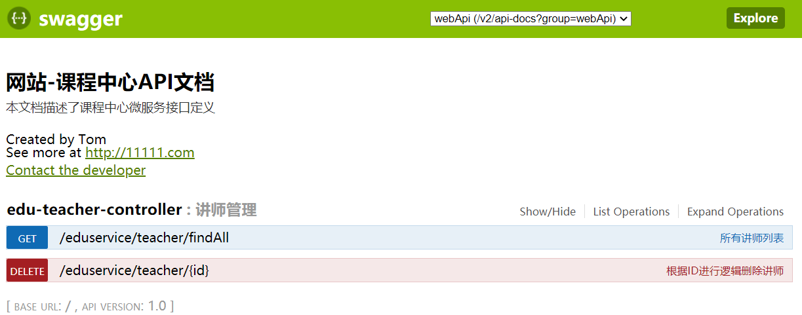

# day02-项目环境搭建


# 逻辑删除讲师功能

## 1、在EduConfig中配置逻辑删除插件

```java
    /**
     * 逻辑删除插件
     */
    @Bean
    public ISqlInjector sqlInjector() {
        return new LogicSqlInjector();
    }
```


## 2、在实体类添加注解

```java
    @ApiModelProperty(value = "逻辑删除 1（true）已删除， 0（false）未删除")
    @TableLogic
    private Boolean isDeleted;
```


## 3、在EduTeacherController添加删除方法

```java
    // 2.逻辑删除讲师
    @DeleteMapping("{id}")
    public boolean removeTeacher(@PathVariable String id){
        boolean flag = teacherService.removeById(id);
        return flag;
    }
```


# 整合Swagger2

在guli_parent中创建maven项目，名common模块

在common模块中的pom文件导入依赖

```xml
<?xml version="1.0" encoding="UTF-8"?>
<project xmlns="http://maven.apache.org/POM/4.0.0"
         xmlns:xsi="http://www.w3.org/2001/XMLSchema-instance"
         xsi:schemaLocation="http://maven.apache.org/POM/4.0.0 http://maven.apache.org/xsd/maven-4.0.0.xsd">
    <parent>
        <artifactId>guli_parent</artifactId>
        <groupId>com.atguigu</groupId>
        <version>0.0.1-SNAPSHOT</version>
    </parent>
    <modelVersion>4.0.0</modelVersion>
    <artifactId>common</artifactId>
    <packaging>pom</packaging>
    <modules>
        <module>servicebase</module>
    </modules>
    <dependencies>
        <dependency>
            <groupId>org.springframework.boot</groupId>
            <artifactId>spring-boot-starter-web</artifactId>
            <scope>provided </scope>
        </dependency>
        <!--mybatis-plus-->
        <dependency>
            <groupId>com.baomidou</groupId>
            <artifactId>mybatis-plus-boot-starter</artifactId>
            <scope>provided </scope>
        </dependency>
        <!--lombok用来简化实体类：需要安装lombok插件-->
        <dependency>
            <groupId>org.projectlombok</groupId>
            <artifactId>lombok</artifactId>
            <scope>provided </scope>
        </dependency>
        <!--swagger-->
        <dependency>
            <groupId>io.springfox</groupId>
            <artifactId>springfox-swagger2</artifactId>
            <scope>provided </scope>
        </dependency>
        <dependency>
            <groupId>io.springfox</groupId>
            <artifactId>springfox-swagger-ui</artifactId>
            <scope>provided </scope>
        </dependency>
        <!-- redis -->
        <dependency>
            <groupId>org.springframework.boot</groupId>
            <artifactId>spring-boot-starter-data-redis</artifactId>
        </dependency>
        <!-- spring2.X集成redis所需common-pool2
        <dependency>
            <groupId>org.apache.commons</groupId>
            <artifactId>commons-pool2</artifactId>
            <version>2.6.0</version>
        </dependency>-->
    </dependencies>
</project>
```


在common模块中创建servicebase模块，在servicebase模块中创建swagger配置类

创建包com.atguigu.servicebase，创建类SwaggerConfig

```java
@Configuration
@EnableSwagger2
public class SwaggerConfig {

    @Bean
    public Docket webApiConfig(){
        return new Docket(DocumentationType.SWAGGER_2)
                .groupName("webApi")
                .apiInfo(webApiInfo())
                .select()
                .paths(Predicates.not(PathSelectors.regex("/admin/.*")))
                .paths(Predicates.not(PathSelectors.regex("/error.*")))
                .build();
    }

    private ApiInfo webApiInfo(){
        return new ApiInfoBuilder()
                .title("网站-课程中心API文档")
                .description("本文档描述了课程中心微服务接口定义")
                .version("1.0")
                .contact(new Contact("Tom", "http://11111.com", "11111@qq.com"))
                .build();
    }
}
```


在service模块中的pom文件引入依赖

```xml
<dependency>
    <groupId>com.atguigu</groupId>
    <artifactId>service_base</artifactId>
    <version>0.0.1-SNAPSHOT</version>
</dependency>
```

在service_edu模块的启动类加上注解@ComponentScan(basePackages = {"com.atguigu"})，在启动的时候扫描包


**定义接口说明和参数说明**

定义在类上：@Api

定义在方法上：@ApiOperation

定义在参数上：@ApiParam

```java
@Api(description = "讲师管理")
@RestController
@RequestMapping("/eduservice/teacher")
public class EduTeacherController {

    @Autowired
    private EduTeacherService teacherService;

    // 1.查询所有的数据
    // rest风格
    @ApiOperation(value = "所有讲师列表")
    @GetMapping("findAll")
    public List<EduTeacher> findAll(){
        // 调用service的方法查询所有数据
        List<EduTeacher> list = teacherService.list(null);
        return list;
    }

    // 2.逻辑删除讲师
    @ApiOperation("根据ID进行逻辑删除讲师")
    @DeleteMapping("{id}")
    public boolean removeById(
            @ApiParam(name = "id",value = "讲师ID",required = true)
            @PathVariable String id){
        boolean flag = teacherService.removeById(id);
        return flag;
    }

}
```


**测试**

启动启动类，在浏览器中访问http://localhost:8001/swagger-ui.html




# 统一返回结果

在common模块中创建commonutils子模块，创建包com.atguigu.commonutils，

创建ResultCode接口

```java
public interface ResultCode {
    public static Integer SUCCESS = 20000;  // 成功
    public static Integer ERROR = 20001;  // 失败
}
```

创建R类，统一返回结果

```java
@Data
public class R {
    @ApiModelProperty(value = "是否成功")
    private Boolean success;

    @ApiModelProperty(value = "返回码")
    private Integer code;

    @ApiModelProperty(value = "返回消息")
    private String message;

    @ApiModelProperty(value = "返回数据")

    private Map<String, Object> data = new HashMap<String, Object>();

    // 构造私有化，链式编程R.ok().success().
    private R(){}

    public static R ok(){
        R r = new R();
        r.setSuccess(true);
        r.setCode(ResultCode.SUCCESS);
        r.setMessage("成功");
        return r;
    }
    public static R error(){
        R r = new R();
        r.setSuccess(false);
        r.setCode(ResultCode.ERROR);
        r.setMessage("失败");
        return r;
    }
    public R success(Boolean success){
        this.setSuccess(success);
        return this;
    }
    public R message(String message){
        this.setMessage(message);
        return this;
    }
    public R code(Integer code){
        this.setCode(code);
        return this;
    }
    public R data(String key, Object value){
        this.data.put(key, value);
        return this;
    }
    public R data(Map<String, Object> map){
        this.setData(map);
        return this;
    }
}
```


在service模块中引用依赖

```xml
<dependency>
    <groupId>com.atguigu</groupId>
    <artifactId>common_utils</artifactId>
    <version>0.0.1-SNAPSHOT</version>
</dependency>
```


在controller中使用返回R类型（不要引错包）

```java
@Api(description = "讲师管理")
@RestController
@RequestMapping("/eduservice/teacher")
public class EduTeacherController {

    @Autowired
    private EduTeacherService teacherService;

    // 1.查询所有的数据
    // rest风格
    @ApiOperation(value = "所有讲师列表")
    @GetMapping("findAll")
    public R findAll(){
        // 调用service的方法查询所有数据
        List<EduTeacher> list = teacherService.list(null);
        return R.ok().data("items",list);
    }

    // 2.逻辑删除讲师
    @ApiOperation("根据ID进行逻辑删除讲师")
    @DeleteMapping("{id}")
    public R removeById(
            @ApiParam(name = "id",value = "讲师ID",required = true)
            @PathVariable String id){
        boolean flag = teacherService.removeById(id);

        if (flag){
            return R.ok();
        } else {
            return R.error();
        }

    }

}
```


# 讲师分页查询

在EduConfig类中添加分页插件

```java
 /**
  * 分页插件
  */
@Bean
public PaginationInterceptor paginationInterceptor() {
    return new PaginationInterceptor();
}
```

在EduTeacherController类添加方法

```java
// 3.分页查询讲师
@ApiOperation("分页查询讲师")
@GetMapping("pageTeacher/{current}/{limit}")
public R pageTeacher(

    @ApiParam(name = "current", value = "当前页数",required = true)
    @PathVariable Long current,
    @ApiParam(name = "limit", value = "条数",required = true)
    @PathVariable Long limit){

    // 创建分页对象
    Page<EduTeacher> teacherPage = new Page<>(current,limit);

    // 查询数据库
    teacherService.page(teacherPage,null);

    long total = teacherPage.getTotal();    // 总记录数
    List<EduTeacher> records = teacherPage.getRecords();    // 所有的讲师list

    // 或者使用map
    /* Map map = new HashMap();
        map.put("total",total);
        map.put("rows",records);
        return R.ok().data(map);*/

    return R.ok().data("total",total).data("rows",records);
}
```

在swagger中测试接口正确性


# 讲师条件查询带分页

思路：（暂时写在controller，后面所有的业务都写在serviceImpl）

1. 创建分页对象
2. 创建wrapper对象
   - 填充条件
3. 查询数据库
4. 获取数据
5. 返回

```java
// 条件查询带分页
    @ApiOperation(value = "条件查询讲师列表带分页")
    @PostMapping("pageTeacherCondition/{current}/{limit}")
    public R pageTeacherCondition(
            @ApiParam(name = "current", value = "当前页数",required = true)
            @PathVariable Long current,

            @ApiParam(name = "limit", value = "条数",required = true)
            @PathVariable Long limit,

            @ApiParam(name = "teacherQuery", value = "查询对象",required = false)
            @RequestBody(required = false) TeacherQuery teacherQuery){

        // 创建page分页对象
        Page<EduTeacher> teacherPage = new Page<>(current,limit);

        // 创建wrapper对象
        QueryWrapper<EduTeacher> wrapper = new QueryWrapper<>();

        String name = teacherQuery.getName();
        Integer level = teacherQuery.getLevel();
        String begin = teacherQuery.getBegin();
        String end = teacherQuery.getEnd();
        // 条件查询
        if (!StringUtils.isEmpty(name)){
            // 模糊查询名字
            wrapper.like("name",name);
        }
        if (!StringUtils.isEmpty(level)){
            // 级别
            wrapper.eq("level",level);
        }
        if (!StringUtils.isEmpty(begin)){
            // 开始时间>=
            wrapper.ge("gmt_create",begin);
        }
        if (!StringUtils.isEmpty(end)){
            // 结束时间 <=
            wrapper.le("gmt_modified",end);
        }


        // 查询
        teacherService.page(teacherPage,wrapper);

        long total = teacherPage.getTotal();    // 总记录数
        List<EduTeacher> records = teacherPage.getRecords();    // 所有的讲师list
        return R.ok().data("total",total).data("rows",records);


    }
```


测试


# 新增讲师

在EduTeacher类中的创建时间和更新时间添加自动填充注解

```java
@ApiModelProperty(value = "创建时间")
@TableField(fill = FieldFill.INSERT)
private Date gmtCreate;

@ApiModelProperty(value = "更新时间")
@TableField(fill = FieldFill.INSERT_UPDATE)
private Date gmtModified;
```

在servicebase模块中创建handler包，并在handler包中创建MyMetaObjectHandler类

```java
@Component
public class MyMetaObjectHandler implements MetaObjectHandler {
    @Override
    public void insertFill(MetaObject metaObject) {
        this.setFieldValByName("gmtCreate", new Date(), metaObject);
        this.setFieldValByName("gmtModified", new Date(), metaObject);
    }
    @Override
    public void updateFill(MetaObject metaObject) {
        this.setFieldValByName("gmtModified", new Date(), metaObject);
    }
}
```

在EduTeacherController中编写方法

```java
// 添加讲师
@ApiOperation("添加讲师")
@PostMapping("addTeacher")
public R addTeacher(
    @ApiParam(name = "teacher",value = "讲师对象",required = true)
    @RequestBody EduTeacher teacher){
    boolean save = teacherService.save(teacher);
    if (save){
        return R.ok();
    } else {
        return R.error();
    }
}
```

测试


# 根据id查询讲师

在EduTeacherController中编写方法

```java
// 根据id查询讲师
@ApiOperation("根据id查询讲师")
@GetMapping("getTeacher/{id}")
public R getTeacher(@ApiParam(name = "id",value = "讲师id",required = true)@PathVariable String id){
    EduTeacher teacher = teacherService.getById(id);
    return R.ok().data("teacher",teacher);
}
```

# 更新讲师

在EduTeacherController中编写方法

```java
// 更新讲师信息
@ApiOperation("更新讲师")
@PostMapping("updateTeacher")
public R updateTeacher(@ApiParam(name = "teacher",value = "讲师对象")@RequestBody EduTeacher teacher){
    boolean flag = teacherService.updateById(teacher);
    if (flag){
        return R.ok();
    } else {
        return R.error();
    }
}
```

测试


# 统一异常处理

## 全局异常处理

在servicebase模块，创建exceptionhandler包，新建GlobalExceptionHandler类

```java
@ControllerAdvice
public class GlobalExceptionHandler {

    @ExceptionHandler(Exception.class)  // 发生什么异常的时候执行
    @ResponseBody   // 为了返回数据
    public R error(Exception e){
        e.getStackTrace();
        return R.error().message("执行了全局异常处理....");
    }

}
```

在service_base的pom文件中添加common_utils依赖

```xml
<dependency>
    <groupId>com.atguigu</groupId>
    <artifactId>common_utils</artifactId>
    <version>0.0.1-SNAPSHOT</version>
</dependency>
```


这个时候需要将service模块中的common_utils依赖去掉，因为依赖会传递，不去掉可能会有问题


## 特殊异常处理

在`com.atguigu.servicebase.exceptionhandler`的GlobalExceptionHandler类中添加方法

```java
// 特殊异常处理
@ExceptionHandler(ArithmeticException.class)  // 发生什么异常的时候执行
@ResponseBody   // 为了返回数据
public R error(ArithmeticException e){
    e.getStackTrace();
    return R.error().message("执行了ArithmeticException异常处理....");
}
```


## 自定义异常

在com.atguigu.servicebase.exceptionhandler包中创建GuliException类

```java
@Data
@AllArgsConstructor
@NoArgsConstructor
public class GuliException extends RuntimeException {

    @ApiModelProperty(value = "状态码")
    private Integer code;   // 状态码
    private String msg;     // 异常信息

}
```


在`com.atguigu.servicebase.exceptionhandler`的GlobalExceptionHandler类中添加方法

```java
// 自定义异常处理
@ExceptionHandler(GuliException.class)  // 发生什么异常的时候执行
@ResponseBody   // 为了返回数据
public R error(GuliException e){
    e.getStackTrace();
    return R.error().code(e.getCode()).message(e.getMsg());
}
```

在会发生异常的地方进行下面处理

```java
try {
    int a = 10 / 0;
} catch (Exception e) {
    throw new GuliException(20001,"执行了自定义异常");
}
```

测试


# 统一日志处理

先把application.properties中的日志配置文件去掉

```java
## 设置日志级别
#logging.level.root=WARN
##mybatis日志
#mybatis-plus.configuration.log-impl=org.apache.ibatis.logging.stdout.StdOutImpl
```

 在resources包下创建logback-spring.xml

```xml
<?xml version="1.0" encoding="UTF-8"?>
<configuration  scan="true" scanPeriod="10 seconds">
    <!-- 日志级别从低到高分为TRACE < DEBUG < INFO < WARN < ERROR < FATAL，如果设置为WARN，则低于WARN的信息都不会输出 -->
    <!-- scan:当此属性设置为true时，配置文件如果发生改变，将会被重新加载，默认值为true -->
    <!-- scanPeriod:设置监测配置文件是否有修改的时间间隔，如果没有给出时间单位，默认单位是毫秒。当scan为true时，此属性生效。默认的时间间隔为1分钟。 -->
    <!-- debug:当此属性设置为true时，将打印出logback内部日志信息，实时查看logback运行状态。默认值为false。 -->
    <contextName>logback</contextName>
    <!-- name的值是变量的名称，value的值时变量定义的值。通过定义的值会被插入到logger上下文中。定义变量后，可以使“${}”来使用变量。 -->
    <property name="log.path" value="E:/1/guli_log/edu" />
    <!-- 彩色日志 -->
    <!-- 配置格式变量：CONSOLE_LOG_PATTERN 彩色日志格式 -->
    <!-- magenta:洋红 -->
    <!-- boldMagenta:粗红-->
    <!-- cyan:青色 -->
    <!-- white:白色 -->
    <!-- magenta:洋红 -->
    <property name="CONSOLE_LOG_PATTERN"
              value="%yellow(%date{yyyy-MM-dd HH:mm:ss}) |%highlight(%-5level) |%blue(%thread) |%blue(%file:%line) |%green(%logger) |%cyan(%msg%n)"/>
    <!--输出到控制台-->
    <appender name="CONSOLE" class="ch.qos.logback.core.ConsoleAppender">
        <!--此日志appender是为开发使用，只配置最底级别，控制台输出的日志级别是大于或等于此级别的日志信息-->
        <!-- 例如：如果此处配置了INFO级别，则后面其他位置即使配置了DEBUG级别的日志，也不会被输出 -->
        <filter class="ch.qos.logback.classic.filter.ThresholdFilter">
            <level>INFO</level>
        </filter>
        <encoder>
            <Pattern>${CONSOLE_LOG_PATTERN}</Pattern>
            <!-- 设置字符集 -->
            <charset>UTF-8</charset>
        </encoder>
    </appender>
    <!--输出到文件-->
    <!-- 时间滚动输出 level为 INFO 日志 -->
    <appender name="INFO_FILE" class="ch.qos.logback.core.rolling.RollingFileAppender">
        <!-- 正在记录的日志文件的路径及文件名 -->
        <file>${log.path}/log_info.log</file>
        <!--日志文件输出格式-->
        <encoder>
            <pattern>%d{yyyy-MM-dd HH:mm:ss.SSS} [%thread] %-5level %logger{50} - %msg%n</pattern>
            <charset>UTF-8</charset>
        </encoder>
        <!-- 日志记录器的滚动策略，按日期，按大小记录 -->
        <rollingPolicy class="ch.qos.logback.core.rolling.TimeBasedRollingPolicy">
            <!-- 每天日志归档路径以及格式 -->
            <fileNamePattern>${log.path}/info/log-info-%d{yyyy-MM-dd}.%i.log</fileNamePattern>
            <timeBasedFileNamingAndTriggeringPolicy class="ch.qos.logback.core.rolling.SizeAndTimeBasedFNATP">
                <maxFileSize>100MB</maxFileSize>
            </timeBasedFileNamingAndTriggeringPolicy>
            <!--日志文件保留天数-->
            <maxHistory>15</maxHistory>
        </rollingPolicy>
        <!-- 此日志文件只记录info级别的 -->
        <filter class="ch.qos.logback.classic.filter.LevelFilter">
            <level>INFO</level>
            <onMatch>ACCEPT</onMatch>
            <onMismatch>DENY</onMismatch>
        </filter>
    </appender>
    <!-- 时间滚动输出 level为 WARN 日志 -->
    <appender name="WARN_FILE" class="ch.qos.logback.core.rolling.RollingFileAppender">
        <!-- 正在记录的日志文件的路径及文件名 -->
        <file>${log.path}/log_warn.log</file>
        <!--日志文件输出格式-->
        <encoder>
            <pattern>%d{yyyy-MM-dd HH:mm:ss.SSS} [%thread] %-5level %logger{50} - %msg%n</pattern>
            <charset>UTF-8</charset> <!-- 此处设置字符集 -->
        </encoder>
        <!-- 日志记录器的滚动策略，按日期，按大小记录 -->
        <rollingPolicy class="ch.qos.logback.core.rolling.TimeBasedRollingPolicy">
            <fileNamePattern>${log.path}/warn/log-warn-%d{yyyy-MM-dd}.%i.log</fileNamePattern>
            <timeBasedFileNamingAndTriggeringPolicy class="ch.qos.logback.core.rolling.SizeAndTimeBasedFNATP">
                <maxFileSize>100MB</maxFileSize>
            </timeBasedFileNamingAndTriggeringPolicy>
            <!--日志文件保留天数-->
            <maxHistory>15</maxHistory>
        </rollingPolicy>
        <!-- 此日志文件只记录warn级别的 -->
        <filter class="ch.qos.logback.classic.filter.LevelFilter">
            <level>warn</level>
            <onMatch>ACCEPT</onMatch>
            <onMismatch>DENY</onMismatch>
        </filter>
    </appender>
    <!-- 时间滚动输出 level为 ERROR 日志 -->
    <appender name="ERROR_FILE" class="ch.qos.logback.core.rolling.RollingFileAppender">
        <!-- 正在记录的日志文件的路径及文件名 -->
        <file>${log.path}/log_error.log</file>
        <!--日志文件输出格式-->
        <encoder>
            <pattern>%d{yyyy-MM-dd HH:mm:ss.SSS} [%thread] %-5level %logger{50} - %msg%n</pattern>
            <charset>UTF-8</charset> <!-- 此处设置字符集 -->
        </encoder>
        <!-- 日志记录器的滚动策略，按日期，按大小记录 -->
        <rollingPolicy class="ch.qos.logback.core.rolling.TimeBasedRollingPolicy">
            <fileNamePattern>${log.path}/error/log-error-%d{yyyy-MM-dd}.%i.log</fileNamePattern>
            <timeBasedFileNamingAndTriggeringPolicy class="ch.qos.logback.core.rolling.SizeAndTimeBasedFNATP">
                <maxFileSize>100MB</maxFileSize>
            </timeBasedFileNamingAndTriggeringPolicy>
            <!--日志文件保留天数-->
            <maxHistory>15</maxHistory>
        </rollingPolicy>
        <!-- 此日志文件只记录ERROR级别的 -->
        <filter class="ch.qos.logback.classic.filter.LevelFilter">
            <level>ERROR</level>
            <onMatch>ACCEPT</onMatch>
            <onMismatch>DENY</onMismatch>
        </filter>
    </appender>
    <!--
        <logger>用来设置某一个包或者具体的某一个类的日志打印级别、以及指定<appender>。
        <logger>仅有一个name属性，
        一个可选的level和一个可选的addtivity属性。
        name:用来指定受此logger约束的某一个包或者具体的某一个类。
        level:用来设置打印级别，大小写无关：TRACE, DEBUG, INFO, WARN, ERROR, ALL 和 OFF，
              如果未设置此属性，那么当前logger将会继承上级的级别。
    -->
    <!--
        使用mybatis的时候，sql语句是debug下才会打印，而这里我们只配置了info，所以想要查看sql语句的话，有以下两种操作：
        第一种把<root level="INFO">改成<root level="DEBUG">这样就会打印sql，不过这样日志那边会出现很多其他消息
        第二种就是单独给mapper下目录配置DEBUG模式，代码如下，这样配置sql语句会打印，其他还是正常DEBUG级别：
     -->
    <!--开发环境:打印控制台-->
    <springProfile name="dev">
        <!--可以输出项目中的debug日志，包括mybatis的sql日志-->
        <logger name="com.guli" level="INFO" />
        <!--
            root节点是必选节点，用来指定最基础的日志输出级别，只有一个level属性
            level:用来设置打印级别，大小写无关：TRACE, DEBUG, INFO, WARN, ERROR, ALL 和 OFF，默认是DEBUG
            可以包含零个或多个appender元素。
        -->
        <root level="INFO">
            <appender-ref ref="CONSOLE" />
            <appender-ref ref="INFO_FILE" />
            <appender-ref ref="WARN_FILE" />
            <appender-ref ref="ERROR_FILE" />
        </root>
    </springProfile>
    <!--生产环境:输出到文件-->
    <springProfile name="pro">
        <root level="INFO">
            <appender-ref ref="CONSOLE" />
            <appender-ref ref="DEBUG_FILE" />
            <appender-ref ref="INFO_FILE" />
            <appender-ref ref="ERROR_FILE" />
            <appender-ref ref="WARN_FILE" />
        </root>
    </springProfile>
</configuration>
```


在com.atguigu.servicebase.exceptionhandler包的GlobalExceptionHandler类上面添加注解@Slf4j

```java
package com.atguigu.servicebase.exceptionhandler;

import com.atguigu.commonutils.R;
import lombok.extern.slf4j.Slf4j;
import org.springframework.web.bind.annotation.ControllerAdvice;
import org.springframework.web.bind.annotation.ExceptionHandler;
import org.springframework.web.bind.annotation.ResponseBody;

@ControllerAdvice
@Slf4j
public class GlobalExceptionHandler {
	...

    // 自定义异常处理
    @ExceptionHandler(GuliException.class)  // 发生什么异常的时候执行
    @ResponseBody   // 为了返回数据
    public R error(GuliException e){
        log.info(e.getMessage());	// 输出日志
        e.getStackTrace();
        return R.error().code(e.getCode()).message(e.getMsg());
    }
}

```

