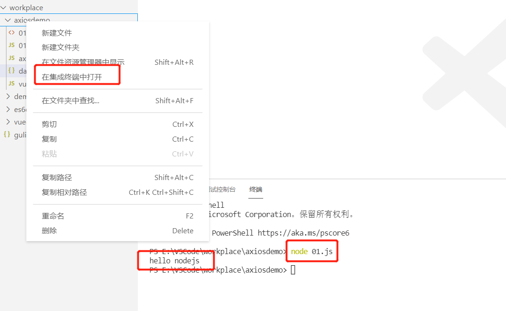
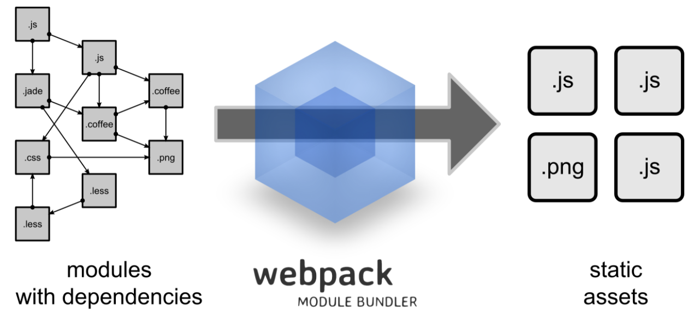
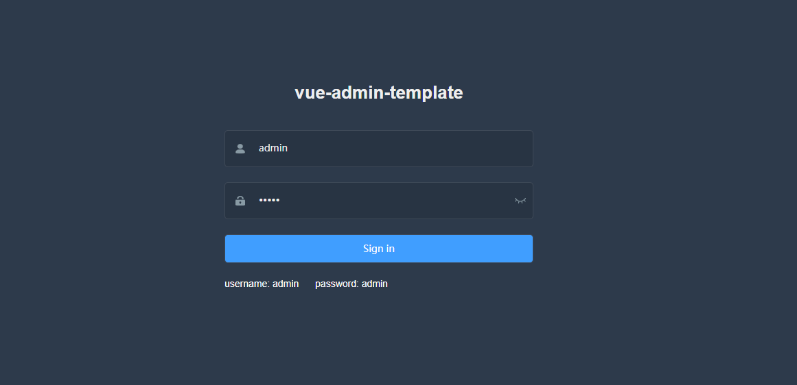

# day04-项目的前端基本知识二


# axios

axios是独立于vue的一个项目，基于promise用于浏览器和node.js的http客户端

- 在浏览器中可以帮助我们完成 ajax请求的发送
- 在node.js中可以向远程接口发送请求

1. 导入axios.min.js文件
2. 编写一个json数据，模拟接口

```json
{
    "success":true,
    "code":20000,
    "message":"成功",
    "data":{
        "items":[
            {"name":"lucy","age":"10"},
            {"name":"mary","age":"20"},
            {"name":"jack","age":"30"}
        ]
    }
}
```


4. 编写代码

```html
<!DOCTYPE html>
<html lang="en">

<head>
    <meta charset="UTF-8">
    <meta name="viewport" content="width=device-width, initial-scale=1.0">
    <meta http-equiv="X-UA-Compatible" content="ie=edge">
    <title>Document</title>
</head>

<body>
    <div id="app">
        <!--如何显示数据-->
        <div v-for="user in userList">
            {{user.name}} -- {{user.age}}
        </div>

    </div>
    <script src="vue.min.js"></script>
    <script src="axios.min.js"></script>
    <script>
        new Vue({
            el: '#app',
            data: {
                // 定义一个空数组
                userList:[]
            },
            created (){     // 页面渲染之前执行
                // 调用方法
                this.getUserList()
            },
            methods:{       // 编写具体方法

                // 创建方法，查询所有用户
                getUserList(){
                    // 使用axios的ajax请求
                    // axios.提交方式("请求接口地址").then().catch()
                    axios.get("data.json")
                        .then(response =>{      // 请求成功执行then
                            // response就是请求放回的数据
                            //console.log(response);
                            // 通过response获取具体的值，赋值给定义空数组
                            this.userList = response.data.data.items
                            //console.log(this.userList);
                        })     
                        .catch(error =>{    //  请求失败执行catch

                        })    
                }
            }
        })
    </script>
</body>

</html>
```

测试

# element-ui

官网： http://element-cn.eleme.io/#/zh-CN


# nodejs

可以模拟服务器，执行JavaScript代码。

简单使用

创建一个js文件

```js
console.log('hello nodejs');
```

用cmd进入js文件所在的位置，执行命令node 01.js，即可

```bash
E:\VSCode\workplace\axiosdemo>node 01.js
hello nodejs
```


在vscode中使用，右键选中文件，在终端中打开，输入启动命令和需要启动的文件即可。




# npm包管理器

node package manager，类似后端的maven，maven管理jar包，npm管理js库，如jQuery等


## 使用npm项目初始化操作

npm init

npm init -y；都默认按照

```bash
PS E:\VSCode\workplace\npmdemo> npm init
This utility will walk you through creating a package.json file.
It only covers the most common items, and tries to guess sensible defaults.

See `npm help init` for definitive documentation on these fields
and exactly what they do.

Use `npm install <pkg>` afterwards to install a package and
save it as a dependency in the package.json file.

Press ^C at any time to quit.
package name: (npmdemo)
version: (1.0.0)
description:
entry point: (index.js)
test command:
git repository:
keywords:
author:
license: (ISC)
About to write to E:\VSCode\workplace\npmdemo\package.json:

{
  "name": "npmdemo",
  "version": "1.0.0",
  "description": "",
  "main": "index.js",
  "scripts": {
    "test": "echo \"Error: no test specified\" && exit 1"
  },
  "author": "",
  "license": "ISC"
}


Is this OK? (yes) yes
PS E:\VSCode\workplace\npmdemo> 
```


生成package.json文件，类似后端的pom.xml文件


## npm 下载依赖

npm install 依赖名称

如下载jQuery ,

```bash
 # 会下载最新版本
 install jquery 
```

如果想指定版本，则用

```bash
npm install jquery@2.1.x
```


下载完成之后，会出现node_modules文件夹里面会有jQuery的文件和一个package-lock.json文件，package-lock.json文件是锁定当前版本的jQuery版本。

package.json文件中的dependencies是依赖的版本

```json
  "dependencies": {
    "jquery": "^3.6.0"
  }
```


## 通过package.json下载依赖

先把原有的node_modules文件删除，接着执行下面的命令（需要再项目根目录）

```bash
npm install
```


# babel转码器

将es6代码转成es5代码，目的：有些浏览器不兼容es6代码，为了提高兼容性

新创建一个文件，初始化项目

```bash
npm init -y
```


安装babel工具

```bash
npm install --global babel-cli
```

查看版本号

```bash
babel --version
```

创建es6文件夹，创建js文件

```js
// 转码前
// 定义数据类型
let input = [1,2,3]
// 将数组元素的每一个元素+1
input = input.map(item => item+1)
console.log(input);
```

在项目根目录创建.babelrc配置文件

```
{
    "presets":["es2015"],
    "plugins": []
}
```

安装es2015转码器

```bash
npm install --save-dev babel-preset-es2015
```

**根据文件转码**

es6/01.js:源文件

dist/001.js：生成的文件路径以及文件名字

```bash
babel es6/01.js -o dist/001.js
```

**根据文件夹转换**

```bash
babel es6 -d dist
```


生成的es5文件

```js
"use strict";

// 转码前
// 定义数据类型
var input = [1, 2, 3];
// 将数组元素的每一个元素+1
input = input.map(function (item) {
  return item + 1;
});
console.log(input);

```


==**注意：转码的时候需要在项目的根目录下才可以转码，否则会报文件不存在的错误**==


# 模块化

开发后端接口时候，开发controller service mapper，controller注入service，service注入mapper，在后端中，类与类之间的调用成为后端模块化操作

前端模块化，在前端中，js与js之间调用成为前端模块化操作


## es5实现模块化操作

创建1.js文件，提供方法

```js
// 1.创能方法
const sum = function(a,b){
    return parseInt(a) + parseInt(b)
}
const substract = function(a,b){
    return parseInt(a) - parseInt(b)
}

module.exports ={
    sum,
    substract
}
```

创建2.js文件，调用

```js
// 调用1.js的方法
// 1.引入js文件
const m = require('./1.js')

// 调用方法
console.log(m.sum(1,1));
console.log(m.substract(3,1));
```

在终端测试

```bash
PS E:\VSCode\workplace\moduledemo\es5moduledemo> node 2.js
2
2
PS E:\VSCode\workplace\moduledemo\es5moduledemo> 
```


## es6模块化

### 第一种方法

 创建1.js文件，提供方法

```js
// 定义方法
export function getList(){
    console.log("getList....");
}

export function save(){
    console.log("save....");
}
```

创建2.js文件，调用方法

```js
// 调用1.js的方法
import { getList,save } from "./1";
getList()
save()
```

由于es6不能直接在nodejs环境下运行，所以先用babel转成es5代码再进行测试


### 第二种方法

创建1.js文件，提供方法

```js
// 定义方法
export default{
    getList(){
        console.log('getList.....');
    },
    save(){
        console.log('save.....');
    }

}
```

创建2.js文件，调用方法

```js
// 调用1.js的方法
import m from './1'
m.getList()
m.save()
```

测试


# Webpack

## webpack是什么

Webpack 是一个前端**资源加载/打包**工具。它将根据模块的依赖关系进行静态分析，然后将这些模块按照指定的规则生成对应的静态资源。

从图中我们可以看出，Webpack 可以**将多种静态资源** js、css、less 转**换成一个静态文件**，**减少了页面的请求**。 




## 安装webpack

```bash
npm install -g webpack webpack-cli
```

查看版本

```bash
webpack -v
```


```bash
PS E:\VSCode\workplace\webpackdemo> npm install -g webpack webpack-cli

added 3 packages, removed 4 packages, and changed 117 packages in 9s

3 packages are looking for funding
  run `npm fund` for details
PS E:\VSCode\workplace\webpackdemo> webpack -v
webpack: 5.65.0
webpack-cli: 4.9.1
webpack-dev-server not installed
PS E:\VSCode\workplace\webpackdemo> 
```


## 创建src文件

src下创建common.js

```js
exports.info = function (str) {
    document.write(str);
}
```

src下创建utils.js

```js
exports.add = function (a, b) {
        return a + b;
}
```

src下创建main.js

```js
const common = require('./common');
const utils = require('./utils');

common.info('Hello world!' + utils.add(100, 200));
```


## 打包js

### **webpack目录下创建配置文件**webpack.config.js

以下配置的意思是：读取当前项目目录下src文件夹中的main.js（入口文件）内容，分析资源依赖，把相关的js文件打包，打包后的文件放入当前目录的dist文件夹下，打包后的js文件名为bundle.js

```js
const path = require("path"); //Node.js内置模块
module.exports = {
    entry: './src/main.js', //配置入口文件
    output: {
        path: path.resolve(__dirname, './dist'), //输出路径，__dirname：当前文件所在路径
        filename: 'bundle.js' //输出文件
    }
}
```

打包

```bash
webpack		# 有黄色警告
webpack --mode==development	 # 没有警告
```

警告信息

```bash
PS E:\VSCode\workplace\webpackdemo> webpack
asset bundle.js 308 bytes [emitted] [minimized] (name: main)
./src/main.js 124 bytes [built] [code generated]
./src/common.js 60 bytes [built] [code generated]
./src/utils.js 57 bytes [built] [code generated]

WARNING in configuration
The 'mode' option has not been set, webpack will fallback to 'production' for this value.
Set 'mode' option to 'development' or 'production' to enable defaults for each environment.
You can also set it to 'none' to disable any default behavior. Learn more: https://webpack.js.org/configuration/mode/

webpack 5.65.0 compiled with 1 warning in 279 ms
PS E:\VSCode\workplace\webpackdemo>
```


测试

在webpack目录下创建1.html，引用bundle.js，打开浏览器访问即可

```html
<script src="dist/bundle.js"></script>
```


## 打包css

### **安装style-loader和 css-loader**

首先我们需要安装相关Loader插件，css-loader 是将 css 装载到 javascript；style-loader 是让 javascript 认识css

```bash
npm install --save-dev style-loader css-loader 
```

创建一个style.css文件

```css
body{
    background-color: red;
}
```

在main.js中引入

```js
const common = require('./common');
const utils = require('./utils');

require('./style.css');

common.info('Hello world!' + utils.add(100, 200));
```

在webpack.config.js中加入下面的代码

```js
const path = require("path"); //Node.js内置模块
module.exports = {
    entry: './src/main.js', //配置入口文件
    output: {
        path: path.resolve(__dirname, './dist'), //输出路径，__dirname：当前文件所在路径
        filename: 'bundle.js' //输出文件
    },
    module: {
        rules: [  
            {  
                test: /\.css$/,    //打包规则应用到以css结尾的文件上
                use: ['style-loader', 'css-loader']
            }  
        ]  
    }
}
```

重新打包，最后访问1.html测试。


# 搭建项目前端页面

## vue-admin-template

## 简介

vueAdmin-template是基于vue-element-admin的一套后台管理系统基础模板（最少精简版），可作为模板进行二次开发。

**GitHub地址：**https://github.com/PanJiaChen/vue-admin-template

**建议：**你可以在 `vue-admin-template` 的基础上进行二次开发，把 `vue-element-admin`当做工具箱，想要什么功能或者组件就去 `vue-element-admin` 那里复制过来。

在根目录下执行npm install命令下载依赖，如果下载失败（报一个ERESOLVE unable to resolve dependency tree），可以使用cnpm install下载。如果下载失败，按照提示删除node_modules文件夹，再次下载。

```bash
Install fail! RunScriptError: post install error, please remove node_modules before retry!ru
```


如果报错node-sass不支持当前版本，可以重新卸载，再安装

```bash
npm uninstall --save node-sass

cnpm install node-sass -D
```

如果上面还不行就更换nodejs的版本，降低版本，可能是本地的nodejs版本过高导致的，我的由16.13.0降到14.18.2就行了

下载成功后，利用命令启动

```bash
npm run dev
```



看到这个页面说明成功


# 项目前端框架介绍

```
. 
├── build // 构建脚本
├── config // 全局配置 
├── node_modules // 项目依赖模块
├── src //项目源代码
├── static // 静态资源
└── package.jspon // 项目信息和依赖配置
```


```
src 
├── api // 各种接口 
├── assets // 图片等资源 
├── components // 各种公共组件，非公共组件在各自view下维护 
├── icons //svg icon 
├── router // 路由表 
├── store // 存储 
├── styles // 各种样式 
├── utils // 公共工具，非公共工具，在各自view下维护 
├── views // 各种layout
├── App.vue //***项目顶层组件*** 
├── main.js //***项目入口文件***
└── permission.js //认证入口
```


