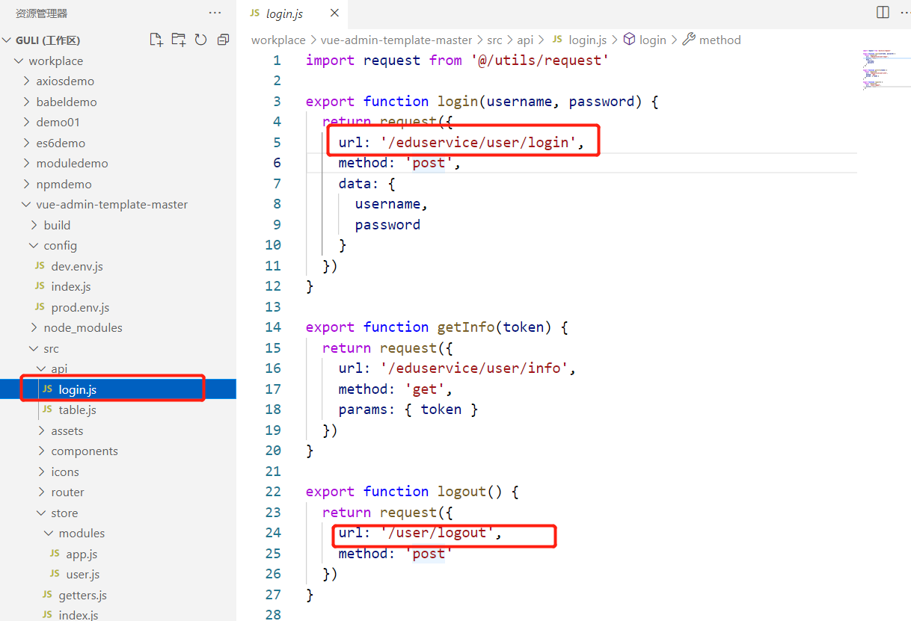
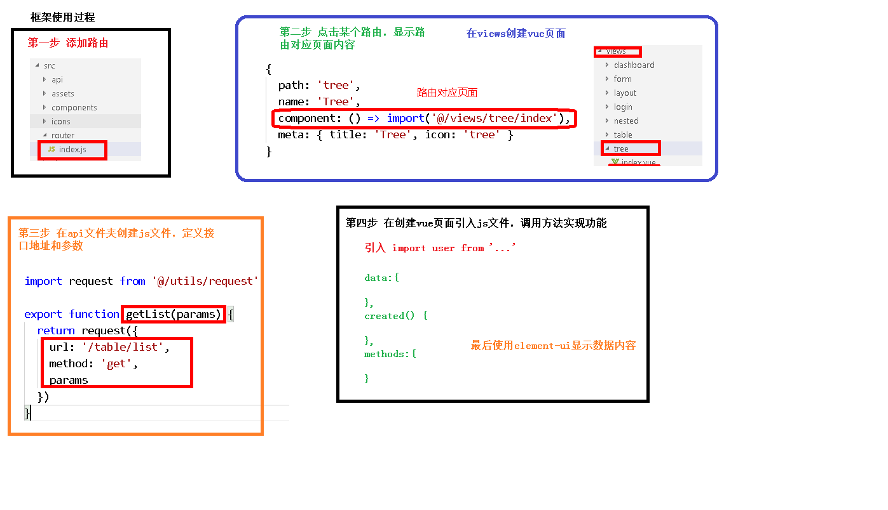

# day05-讲师管理模块前端开发

# 后台系统登录功能改造

在config中的dev.env.js把地址改成下面的

```js
'use strict'
const merge = require('webpack-merge')
const prodEnv = require('./prod.env')

module.exports = merge(prodEnv, {
  NODE_ENV: '"development"',
  //BASE_API: '"https://easy-mock.com/mock/5950a2419adc231f356a6636/vue-admin"',
  BASE_API: '"http://localhost:8001"',
})

```


在com.atguigu.eduservice.controller包下面，先模拟一个登录controller

```java
@RestController
@RequestMapping("/eduservice/user")
@CrossOrigin    // 解决跨域
public class EduLoginController {

    // login
    @PostMapping("login")
    public R login(){
        return R.ok().data("token","token");
    }
    // info
    @GetMapping("info")
    public R info(){
        return R.ok().data("roles","roles").data("name","name").data("avatar","http://img.hb.aicdn.com/7378f66599670a3614ce38edf79bf1551dacd8d0f5c70-53yvFv_fw580");
    }
}
```


在vue的api文件夹中修改url




启动后端服务器和前端页面，这时会报一个跨域的错误，只需要在controller上面加@CrossOrigin，重启服务器即可解决跨域问题。


# 前端框架开发过程介绍




# 讲师管理前端

## 讲师列表

添加路由

在src的router的index.js文件中，添加讲师管理路由

```js
  {
    path: '/teacher',
    component: Layout,
    redirect: '/teacher/table',
    name: '讲师管理',
    meta: { title: '讲师管理', icon: 'example' },
    children: [
      {
        path: 'table',
        name: '讲师列表',
        component: () => import('@/views/edu/teacher/list'),
        meta: { title: '讲师列表', icon: 'table' }
      },
      {
        path: 'save',
        name: '添加讲师',
        component: () => import('@/views/edu/teacher/save'),
        meta: { title: '添加讲师', icon: 'tree' }
      }
    ]
  },
```


在views/edu/teacher下创建list.vue和save.vue文件

```vue
<template>
    <div class="app-container">
        讲师列表
    </div>
</template>
```


在api/edu下面创建teacher.js文件，写方法

```js
import request from '@/utils/request'

export default{
    // 1.讲师列表（条件查询分页）
    // current:当前分页，limit每页记录数，teacherQuery条件对象
    getTeacherListPage(current,limit,teacherQuery){
        return request({
            // 可以拼接
            //url: '/eduservice/teacher/pageTeacherCondition'+"/"+'current',
            url: `/eduservice/teacher/pageTeacherCondition/${current}/${limit}`,
            method: 'post',
            // teacherQuery条件对象，后端使用RequestBody获取数据
            // data表示把对象转成json进行传递到接口里面
            data:teacherQuery
          })
    }
}

```


回到刚刚创建的list.vue页面将teacher.js文件引入当前页面，开始编码

```vue
<template>
    <div class="app-container">
        讲师列表
    </div>
</template>

<script>
// 引入teacher.js文
import teacher from '@/api/edu/teacher'

export default {
    data(){     // 定义变量和初始值
        return{
            list:null,  // 查询之后接口返回集合
            page : 1,   // 当前页
            limit : 10, // 每页的记录数
            total : 0,  // 总记录数
            teacherQuery:{}    // 条封装对象

        }
    },
    created(){      // 页面渲染之前执行，调用创建的方法
        this.getList
    },
    methods:{
        // 讲师列表
        getList(){
            teacher.getTeacherListPage(this.current,this.limit,this.teacherQuery)
            .then(response =>{// 执行成功
                // response接口接口返回的数据
                console.log(response);
            })     
            .catch(error =>{ // 执行失败
                console.log(error);
            })   
        }
    }
}
</script>
```


测试看显示是否正确。正确之后，进行数据显示，完整代码如下

```vue
<template>
    <div class="app-container">
        <!-- 表格 -->
        <el-table
        v-loading="listLoading"
        :data="list"
        element-loading-text="数据加载中"
        border
        fit
        highlight-current-row>
        <el-table-column
            label="序号"
            width="70"
            align="center">
            <template slot-scope="scope">
            {{ (page - 1) * limit + scope.$index + 1 }}
            </template>
        </el-table-column>
        <el-table-column prop="name" label="名称" width="80" />
        <el-table-column label="头衔" width="80">
            <template slot-scope="scope">
            {{ scope.row.level===1?'高级讲师':'首席讲师' }}
            </template>
        </el-table-column>
        <el-table-column prop="intro" label="资历" />
        <el-table-column prop="gmtCreate" label="添加时间" width="160"/>
        <el-table-column prop="sort" label="排序" width="60" />
        <el-table-column label="操作" width="200" align="center">
            <template slot-scope="scope">
            <router-link :to="'/edu/teacher/edit/'+scope.row.id">
                <el-button type="primary" size="mini" icon="el-icon-edit">修改</el-button>
            </router-link>
            <el-button type="danger" size="mini" icon="el-icon-delete" @click="removeDataById(scope.row.id)">删除</el-button>
            </template>
        </el-table-column>
        </el-table>
    </div>
</template>

<script>
// 引入teacher.js文
import teacher from '@/api/edu/teacher'

export default {
    data(){     // 定义变量和初始值
        return{
            list:null,  // 查询之后接口返回集合
            page:1,   // 当前页
            limit:10, // 每页的记录数
            total:0,  // 总记录数
            teacherQuery:{}    // 条封装对象

        }
    },
    created(){      // 页面渲染之前执行，调用创建的方法
        this.getList()
    },
    methods:{
        // 讲师列表
        getList(){
            teacher.getTeacherListPage(this.page,this.limit,this.teacherQuery)
                .then(response =>{// 执行成功
                    // response接口接口返回的数据
                    //console.log(response)
                    this.list = response.data.rows
                    this.total = response.data.total
                    console.log(this.list)
                    console.log(this.total)
                })     
                .catch(error =>{ // 执行失败
                    console.log(error)
                })   
        }
    }
}
</script>
```


再次测试。


## 讲师分页

在src/views/edu/teacher/list.vue中的table标签外加分页组件

```js
 <!-- 分页 -->
    <el-pagination
      :current-page="page"
      :page-size="limit"
      :total="total"
      style="padding: 30px 0; text-align: center;"
      layout="total, prev, pager, next, jumper"
      @current-change="getList"
    />
```


在getList方法中作下面的修改

```js
 // 讲师列表
        getList(page = 1){
            this.page = page
            teacher.getTeacherListPage(this.page,this.limit,this.teacherQuery)
```


## 讲师条件查询

在table标签上面添加表单

```js
<!--查询表单-->
     <el-form :inline="true" class="demo-form-inline">
       <el-form-item>
         <el-input v-model="teacherQuery.name" placeholder="讲师名"/>
       </el-form-item>
	   
       <el-form-item>
         <el-select v-model="teacherQuery.level" clearable placeholder="讲师头衔">
           <el-option :value="1" label="高级讲师"/>
           <el-option :value="2" label="首席讲师"/>
         </el-select>
       </el-form-item>
	   
       <el-form-item label="添加时间">
         <el-date-picker
           v-model="teacherQuery.begin"
           type="datetime"
           placeholder="选择开始时间"
           value-format="yyyy-MM-dd HH:mm:ss"
           default-time="00:00:00"
         />
       </el-form-item>
	   
       <el-form-item>
         <el-date-picker
           v-model="teacherQuery.end"
           type="datetime"
           placeholder="选择截止时间"
           value-format="yyyy-MM-dd HH:mm:ss"
           default-time="00:00:00"
         />
       </el-form-item>
	   
       <el-button type="primary" icon="el-icon-search" @click="getList()">查询</el-button>
       <el-button type="default" @click="resetData()">清空</el-button>
	   
    </el-form>
```


在mothods中添加清空方法

```js
 methods:{
        resetData(){    //清空
            // 清空所有数据
            this.teacherQuery = {}
            // 查询所有用户
            this.getList()
        }
    }
```


## 讲师删除

在api/edu下面的teacher.js文件，添加删除讲师方法

```js
// 删除讲师
deleteTeacherId(id) {
    return request({
        url: `/eduservice/teacher/${id}`,
        method: 'delete'
    })
}
```

在src/views/edu/teacher/list.vue中的methods标签里面加删除方法

```js
// 删除讲师
removeDataById(id){

    this.$confirm('此操作将永久删除讲师记录, 是否继续?', '提示', {
        confirmButtonText: '确定',
        cancelButtonText: '取消',
        type: 'warning'
    }).then(() => {     // 确认删除，执行then
        // 调用删除方法
        teacher.deleteTeacherId(id)
            .then(response =>{     // 删除成功
            // 提示信息
            this.$message({
                type: 'success',
                message: '删除成功!'
            });
            // 回到列表页面
            this.getList()
        })

    })
}
```


## 讲师添加

初始化src/views/edu/teacher/save.vue页面

```js
<template>
    <div class="app-container">
        讲师添加
        <el-form label-width="120px">
       <el-form-item label="讲师名称">
         <el-input v-model="teacher.name"/>
       </el-form-item>
       <el-form-item label="讲师排序">
         <el-input-number v-model="teacher.sort" controls-position="right" min="0"/>
       </el-form-item>
       <el-form-item label="讲师头衔">
         <el-select v-model="teacher.level" clearable placeholder="请选择">
           <!--
             数据类型一定要和取出的json中的一致，否则没法回填
             因此，这里value使用动态绑定的值，保证其数据类型是number
           -->
           <el-option :value="1" label="高级讲师"/>
           <el-option :value="2" label="首席讲师"/>
         </el-select>
       </el-form-item>
       <el-form-item label="讲师资历">
         <el-input v-model="teacher.career"/>
       </el-form-item>
       <el-form-item label="讲师简介">
         <el-input v-model="teacher.intro" :rows="10" type="textarea"/>
       </el-form-item>
       <!-- 讲师头像：TODO -->
       <el-form-item>
         <el-button :disabled="saveBtnDisabled" type="primary" @click="saveOrUpdate">保存</el-button>
       </el-form-item>
     </el-form>
    </div>
</template>

<script>

export default {
    data(){
        return{

        }
    },
    create(){

    },
    methods:{

    }
}
</script>
```

在api/edu下面的teacher.js文件，编写添加讲师方法

```js
/ 添加讲师
addTeacher(teacher){
    return request({
        url: `/eduservice/teacher/addTeacher`,
        method: 'post',
        data:teacher
    })
}
```

完成save.vue中方法的编写和调用，完整代码如下

```js
<template>
    <div class="app-container">
        讲师添加
        <el-form label-width="120px">
       <el-form-item label="讲师名称">
         <el-input v-model="teacher.name"/>
       </el-form-item>
       <el-form-item label="讲师排序">
         <el-input-number v-model="teacher.sort" controls-position="right" min="0"/>
       </el-form-item>
       <el-form-item label="讲师头衔">
         <el-select v-model="teacher.level" clearable placeholder="请选择">
           <!--
             数据类型一定要和取出的json中的一致，否则没法回填
             因此，这里value使用动态绑定的值，保证其数据类型是number
           -->
           <el-option :value="1" label="高级讲师"/>
           <el-option :value="2" label="首席讲师"/>
         </el-select>
       </el-form-item>
       <el-form-item label="讲师资历">
         <el-input v-model="teacher.career"/>
       </el-form-item>
       <el-form-item label="讲师简介">
         <el-input v-model="teacher.intro" :rows="10" type="textarea"/>
       </el-form-item>
       <!-- 讲师头像：TODO -->
       <el-form-item>
         <el-button :disabled="saveBtnDisabled" type="primary" @click="saveOrUpdate">保存</el-button>
       </el-form-item>
     </el-form>
    </div>
</template>

<script>
import teacherAPI from '@/api/edu/teacher'
export default {
    data(){
        return{
            teacher:{
                name: '',
                sort: 0,
                level: 1,
                career: '',
                intro: '',
                avatar: ''
            }
        }
    },
    create(){

    },
    methods:{
        // 
        saveOrUpdate(){
            // 添加
            this.saveTeacher()
        },
        // 添加讲师
        saveTeacher(){
            teacherAPI.addTeacher(this.teacher)
            .then(response =>{      //添加成功
            // 提示信息
            this.$message({
                type: 'success',
                message: '删除成功!'
            });
            // 返回list页面
            this.$router.push({path:'/teacher/table'})
            })
        }

    }
}
</script>
```


## 讲师修改

### 添加路由

在src/router/index.js添加一个隐藏路由

```js
      {
        path: 'edit/:id',
        name: 'EduTeacherEdit',
        component: () => import('@/views/edu/teacher/save'),
        meta: { title: '编辑讲师', noCache:true },
        hidden:true
      }
```

在src/views/edu/teacher/list.vue中的修改按钮处做修改

```vue
            <router-link :to="'/teacher/edit/'+scope.row.id">
                <el-button type="primary" size="mini" icon="el-icon-edit">修改</el-button>
            </router-link>
```

测试效果，实现点击修改按钮，路由跳转到添加的页面


### 数据回显

在api/edu下面的teacher.js文件，编写根据讲师id查询信息方法

```js
// 根据id查询讲师    
getTeacherInfo(id){
    return request({
        url: `/eduservice/teacher/getTeacher/${id}`,
        method: 'get'
    })
}
```

在save.vue中添加根据讲师id查询信息

```vue
 methods:{
        // 根据讲师id查询信息
        getInfo(id){
            teacherAPI.getTeacherInfo(id)
            .then(response =>{
                this.teacher = response.data.teacher
            }) 
        },
        saveOrUpdate(){
            // 添加
            this.saveTeacher()
        },
        // 添加讲师
        saveTeacher(){
            teacherAPI.addTeacher(this.teacher)
            .then(response =>{      //添加成功
            // 提示信息
            this.$message({
                type: 'success',
                message: '删除成功!'
            });
            // 返回list页面
            this.$router.push({path:'/teacher/table'})
            })
        }

    }
```

由于添加讲师的方法和修改讲师的方法的路径有差别，添加讲师的没有带id，修改讲师的有带id，所以根据路由的参数的id判断是否需要数据回显

```vue
    created(){   // 页面渲染之前执行
        // 判断路径是否有id值
        if (this.$route.params && this.$route.params.id) {
        // 从路径获取id值
        const id = this.$route.params.id
        // 调用根据id查询的方法
        this.getInfo(id)
        }
    },
```


### 完成修改

在api/edu下面的teacher.js文件，编写修改讲师方法

```js
    // 修改讲师
    updateTeacherInfo(teacher){
        return request({
            url: `/eduservice/teacher/updateTeacher`,
            method: 'post',
            data:teacher
        })
    }
```

在save.vue的methods中添加方法

```vue
 // 修改讲师
        updateTeacher(){
            teacherAPI.updateTeacherInfo(this.teacher)
            .then(response =>{
                // 提示信息
                this.$message({
                    type: 'success',
                    message: '修改成功!'
                });
                // 返回list页面
                this.$router.push({path:'/teacher/table'})
    
            })
        },
```

由于添加和修改都在同一个页面，先判断是哪个方法,在save.vue的methods

```vue
        saveOrUpdate(){
            // 判断修改还是添加
            // 根据teacher是否有id
            if(!this.teacher.id){
                // 添加
            this.saveTeacher()
            } else{
                // 修改
                this.updateTeacher()
            }
            
        },
```

save.vue完整代码

```vue
<template>
    <div class="app-container">
        讲师添加
        <el-form label-width="120px">
       <el-form-item label="讲师名称">
         <el-input v-model="teacher.name"/>
       </el-form-item>
       <el-form-item label="讲师排序">
         <el-input-number v-model="teacher.sort" controls-position="right" min="0"/>
       </el-form-item>
       <el-form-item label="讲师头衔">
         <el-select v-model="teacher.level" clearable placeholder="请选择">
           <!--
             数据类型一定要和取出的json中的一致，否则没法回填
             因此，这里value使用动态绑定的值，保证其数据类型是number
           -->
           <el-option :value="1" label="高级讲师"/>
           <el-option :value="2" label="首席讲师"/>
         </el-select>
       </el-form-item>
       <el-form-item label="讲师资历">
         <el-input v-model="teacher.career"/>
       </el-form-item>
       <el-form-item label="讲师简介">
         <el-input v-model="teacher.intro" :rows="10" type="textarea"/>
       </el-form-item>
       <!-- 讲师头像：TODO -->
       <el-form-item>
         <el-button :disabled="saveBtnDisabled" type="primary" @click="saveOrUpdate">保存</el-button>
       </el-form-item>
     </el-form>
    </div>
</template>

<script>
import teacherAPI from '@/api/edu/teacher'
export default {
    data(){
        return{
            teacher:{
                name: '',
                sort: 0,
                level: 1,
                career: '',
                intro: '',
                avatar: ''
            },
            saveBtnDisabled:false    // 保存按钮是否禁止
        }
    },
    created(){   // 页面渲染之前执行
        // 判断路径是否有id值
        if (this.$route.params && this.$route.params.id) {
        // 从路径获取id值
        const id = this.$route.params.id
        // 调用根据id查询的方法
        this.getInfo(id)
        }
    },
    methods:{
        // 根据讲师id查询信息
        getInfo(id){
            teacherAPI.getTeacherInfo(id)
            .then(response =>{
                this.teacher = response.data.teacher
            }) 
        },

        saveOrUpdate(){
            // 判断修改还是添加
            // 根据teacher是否有id
            if(!this.teacher.id){
                // 添加
            this.saveTeacher()
            } else{
                // 修改
                this.updateTeacher()
            }
            
        },

        // 修改讲师
        updateTeacher(){
            teacherAPI.updateTeacherInfo(this.teacher)
            .then(response =>{
                // 提示信息
                this.$message({
                    type: 'success',
                    message: '修改成功!'
                });
                // 返回list页面
                this.$router.push({path:'/teacher/table'})
    
            })
        },

        // 添加讲师
        saveTeacher(){
            teacherAPI.addTeacher(this.teacher)
            .then(response =>{      //添加成功
            // 提示信息
            this.$message({
                type: 'success',
                message: '删除成功!'
            });
            // 返回list页面
            this.$router.push({path:'/teacher/table'})
            })
        }

    }
}
</script>
```

测试添加和修改方法都成功


# 遇到问题

第一次点击修改，进行数据回显

第二次再去点击 添加讲师，进入表单页面，数据没有清空，正确效果是清空

# 解决方案

在添加讲师前将表单清空

在原有的created中添加一个else

```vue
    created(){   // 页面渲染之前执行
        // 判断路径是否有id值
        if (this.$route.params && this.$route.params.id) {
        // 从路径获取id值
        const id = this.$route.params.id
        // 调用根据id查询的方法
        this.getInfo(id)
        } else {    // 路径没有id，做添加
            // 表单清空
            this.teacher = {}
        }
    },
```

发现结果还是不行。这个情况不是代码问题，因为created在页面渲染之前就执行，并且只执行一次，所以当点击修改的时候已经执行了，再次点击添加的时候就不会执行（同一个页面），为了让这个created方法可以再次执行，可以加一个监听watch。

将created的内容抽取出来，放在methods中init方法，在created调用init，并加监听

```vue
created(){   // 页面渲染之前执行
        this.init()
    },
    watch:{
        $route(to,from){    // 路由变化方式
        // 路由发生变化时，方法就会被执行
            this.init()
        }
    },
    methods:{
        init(){
               // 判断路径是否有id值
            if (this.$route.params && this.$route.params.id) {
            // 从路径获取id值
            const id = this.$route.params.id
            // 调用根据id查询的方法
            this.getInfo(id)
            } else {    // 路径没有id，做添加
                // 表单清空
                this.teacher = {}
            }
        
        },
```

测试效果，完美解决。


save.vue完整代码

```vue
<template>
    <div class="app-container">
        讲师添加
        <el-form label-width="120px">
       <el-form-item label="讲师名称">
         <el-input v-model="teacher.name"/>
       </el-form-item>
       <el-form-item label="讲师排序">
         <el-input-number v-model="teacher.sort" controls-position="right" min="0"/>
       </el-form-item>
       <el-form-item label="讲师头衔">
         <el-select v-model="teacher.level" clearable placeholder="请选择">
           <!--
             数据类型一定要和取出的json中的一致，否则没法回填
             因此，这里value使用动态绑定的值，保证其数据类型是number
           -->
           <el-option :value="1" label="高级讲师"/>
           <el-option :value="2" label="首席讲师"/>
         </el-select>
       </el-form-item>
       <el-form-item label="讲师资历">
         <el-input v-model="teacher.career"/>
       </el-form-item>
       <el-form-item label="讲师简介">
         <el-input v-model="teacher.intro" :rows="10" type="textarea"/>
       </el-form-item>
       <!-- 讲师头像：TODO -->
       <el-form-item>
         <el-button :disabled="saveBtnDisabled" type="primary" @click="saveOrUpdate">保存</el-button>
       </el-form-item>
     </el-form>
    </div>
</template>

<script>
import teacherAPI from '@/api/edu/teacher'
export default {
    data(){
        return{
            teacher:{
                name: '',
                sort: 0,
                level: 1,
                career: '',
                intro: '',
                avatar: ''
            },
            saveBtnDisabled:false    // 保存按钮是否禁止
        }
    },
    created(){   // 页面渲染之前执行
        this.init()
    },
    watch:{
        $route(to,from){    // 路由变化方式
        // 路由发生变化时，方法就会被执行
            this.init()
        }
    },
    methods:{
        init(){
               // 判断路径是否有id值
            if (this.$route.params && this.$route.params.id) {
            // 从路径获取id值
            const id = this.$route.params.id
            // 调用根据id查询的方法
            this.getInfo(id)
            } else {    // 路径没有id，做添加
                // 表单清空
                this.teacher = {}
            }
        
        },

        // 根据讲师id查询信息
        getInfo(id){
            teacherAPI.getTeacherInfo(id)
            .then(response =>{
                this.teacher = response.data.teacher
            }) 
        },

        saveOrUpdate(){
            // 判断修改还是添加
            // 根据teacher是否有id
            if(!this.teacher.id){
                // 添加
            this.saveTeacher()
            } else{
                // 修改
                this.updateTeacher()
            }
            
        },

        // 修改讲师
        updateTeacher(){
            teacherAPI.updateTeacherInfo(this.teacher)
            .then(response =>{
                // 提示信息
                this.$message({
                    type: 'success',
                    message: '修改成功!'
                });
                // 返回list页面
                this.$router.push({path:'/teacher/table'})
    
            })
        },

        // 添加讲师
        saveTeacher(){
            teacherAPI.addTeacher(this.teacher)
            .then(response =>{      //添加成功
            // 提示信息
            this.$message({
                type: 'success',
                message: '删除成功!'
            });
            // 返回list页面
            this.$router.push({path:'/teacher/table'})
            })
        }

    }
}
</script>
```

