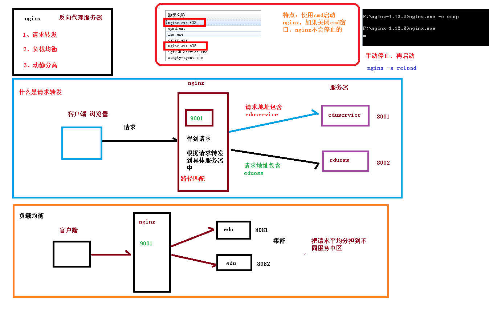
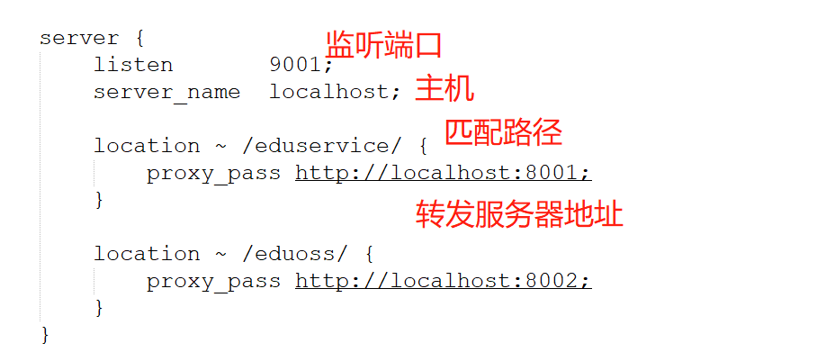

# day06-整合阿里云oss和Excel导入分类


# 讲师管理-上传讲师头像后端接口

## 后端环境搭建

### 搭建阿里云OSS项目环境

在service模块下创建子模块service_oss

配置pom.xml

```xml
<dependencies>

        <!-- 阿里云oss依赖 -->
        <dependency>
            <groupId>com.aliyun.oss</groupId>
            <artifactId>aliyun-sdk-oss</artifactId>
        </dependency>

        <!-- 日期工具栏依赖 -->
        <dependency>
            <groupId>joda-time</groupId>
            <artifactId>joda-time</artifactId>
        </dependency>

    </dependencies>
```

配置application.properties

```properties
#服务端口
server.port=8002

#服务名
spring.application.name=service-oss

#环境设置：dev、test、prod
spring.profiles.active=dev

#阿里云 OSS
#不同的服务器，地址不同
aliyun.oss.file.endpoint=your endpoint
aliyun.oss.file.keyid=your accessKeyId
aliyun.oss.file.keysecret=your accessKeySecret
#bucket可以在控制台创建，也可以使用java代码创建
aliyun.oss.file.bucketname=guli-file
```

创建启动类，启动项目，发现报了一个需要配置数据库的问题

```bash
***************************
APPLICATION FAILED TO START
***************************

Description:

Failed to configure a DataSource: 'url' attribute is not specified and no embedded datasource could be configured.

Reason: Failed to determine a suitable driver class


Action:

Consider the following:
	If you want an embedded database (H2, HSQL or Derby), please put it on the classpath.
	If you have database settings to be loaded from a particular profile you may need to activate it (no profiles are currently active).

```

解决方案

一，在配置文件中加入数据库的配置（由于该模块只做上传功能，不需要加入）。

二，在启动类上加入@SpringBootApplication(exclude = DataSourceAutoConfiguration.class)这个便可，排除数据库自动装配的文件


## 创建常量类

创建com.atguigu.oss.utils包，创建类ConstantPropertiesUtils

```java
// 项目启动，spring接口，spring加载之后，执行接口一个方法
@Component
public class ConstantPropertiesUtils implements InitializingBean {
    // 读取配置文件内容
    @Value("${aliyun.oss.file.endpoint}")
    private String endpoint;

    @Value("${aliyun.oss.file.keyid}")
    private String keyId;

    @Value("${aliyun.oss.file.keysecret}")
    private String keySecret;

    @Value("${aliyun.oss.file.bucketname}")
    private String bucketName;

    public static String END_POINT;
    public static String ACCESS_KEY_ID;
    public static String ACCESS_KEY_SECRET;
    public static String BUCKET_NAME;

    @Override
    public void afterPropertiesSet() throws Exception {
        END_POINT = endpoint;
        ACCESS_KEY_ID = keyId;
        ACCESS_KEY_SECRET = keySecret;
        BUCKET_NAME = bucketName;
    }
}

```

InitializingBean这个接口是为了让其他人可以调用里面定义的属性


## 后端接口实现

在com.atguigu.oss.controller创建OssController类

```java
@RestController
@RequestMapping("eduoss/fileoss")
@CrossOrigin
@Api(description = "Oss文件上传")
public class OssController {

    @Autowired
    private OssService ossService;

    // 上传头像方法
    @ApiOperation("头像上传")
    @PostMapping
    public R uploadFile(@ApiParam(name = "file",value = "上传文件",required = false) MultipartFile file){
        // 获取上传文件，MultipartFile
        // 返回上传文件的oss路径
        String url = ossService.uploadFileAvatar(file);
        return R.ok().data("url",url);
    }

}

```

在com.atguigu.oss.service创建service接口

```java
public interface OssService {
    // 上传头像方法
    String uploadFileAvatar(MultipartFile file);
}

```

在com.atguigu.oss.service.impl实现service接口

```java
@Service
public class OssServiceImpl implements OssService {

    // 上传头像方法
    @Override
    public String uploadFileAvatar(MultipartFile file) {
        // 工具类获取值
        String endpoint = ConstantPropertiesUtils.END_POINT;
        String accessKeyId = ConstantPropertiesUtils.ACCESS_KEY_ID;
        String accessKeySecret = ConstantPropertiesUtils.ACCESS_KEY_SECRET;
        String bucketName = ConstantPropertiesUtils.BUCKET_NAME;


        try {
            // 创建ossClient实例
            OSS ossClient = new OSSClientBuilder().build(endpoint, accessKeyId, accessKeySecret);

            // 上传文件流
            InputStream inputStream = file.getInputStream();

            // 获取文件名称
            String filename = file.getOriginalFilename();

            // 第一个参数：bucket名称
            // 第二个参数：上传到oss文件路径和文件名称 /aa/bb/1.jpg
            // 第三个参数：上传文件流
            ossClient.putObject(bucketName, filename, inputStream);

            // 关闭OSSClient。
            ossClient.shutdown();

            // 返回url
            // https://project-guli-oss.oss-cn-shenzhen.aliyuncs.com/1.png
            String url = "https://"+bucketName+"."+endpoint+"/"+filename;
            return url;

        } catch (IOException e) {
            e.printStackTrace();
            return null;
        }
    }
}

```


利用swagger-ui进行测试。


### 问题

1. 多次上传相同名称文件，造成最后一次上传会把之前上传的文件覆盖
2. 把文件进行分类管理

**解决方案**

1. 在文件名称添加随机唯一值，让每个文件名不同
2. 利用DateTime进行分类

```java
@Service
public class OssServiceImpl implements OssService {

    // 上传头像方法
    @Override
    public String uploadFileAvatar(MultipartFile file) {
        // 工具类获取值
        String endpoint = ConstantPropertiesUtils.END_POINT;
        String accessKeyId = ConstantPropertiesUtils.ACCESS_KEY_ID;
        String accessKeySecret = ConstantPropertiesUtils.ACCESS_KEY_SECRET;
        String bucketName = ConstantPropertiesUtils.BUCKET_NAME;


        try {
            // 创建ossClient实例
            OSS ossClient = new OSSClientBuilder().build(endpoint, accessKeyId, accessKeySecret);

            // 上传文件流
            InputStream inputStream = file.getInputStream();

            // 获取文件名称
            String fileName = file.getOriginalFilename();

            // 1.在文件名里面添加随机唯一值
            String uuid = UUID.randomUUID().toString().replaceAll("-", "");
            // 24g501.jpg
            fileName = uuid+fileName;

            // 2.将文件按照日期分类管理
            // 2021/1/1
            String datePath = new DateTime().toString("yyyy/MM/dd");
            // 拼接
            // 2021/1/1/ge3201.jgp
            fileName = datePath+"/"+fileName;

            // 第一个参数：bucket名称
            // 第二个参数：上传到oss文件路径和文件名称 /aa/bb/1.jpg
            // 第三个参数：上传文件流
            ossClient.putObject(bucketName, fileName, inputStream);

            // 关闭OSSClient。
            ossClient.shutdown();

            // 返回url
            // https://project-guli-oss.oss-cn-shenzhen.aliyuncs.com/1.png
            String url = "https://"+bucketName+"."+endpoint+"/"+fileName;
            return url;

        } catch (IOException e) {
            e.printStackTrace();
            return null;
        }
    }
}
```


# Nginx回顾

## 介绍



下载Nginx压缩包，解压直接使用。使用方式，通过cmd启动，关闭Nginx利用命令Nginx程序名 -s stop

## Nginx配置

修改Nginx端口，80改为81

```
server {
        listen       81;
        server_name  localhost;
```


在http内加入以下转发规则

```
server {
		listen       9001;
		server_name  localhost;
	
		location ~ /eduservice/ {           
			proxy_pass http://localhost:8001;
		}
	
		location ~ /eduoss/ {           
			proxy_pass http://localhost:8002;
		}
}
```



最后再前端config/dev.env.js中的地址改成Nginx的地址，最后启动服务器测试，观察请求路径是否为Nginx配置的就可以。 


# 讲师管理-上传讲师头像前端实现

## 复制头像上传组件

**从vue-element-admin复制组件：**

vue-element-admin/src/components/ImageCropper

vue-element-admin/src/components/PanThumb

## 前端添加文件上传组件

**src/views/edu/teacher/save.vue**

template：

```vue
!-- 讲师头像：TODO -->
       <!-- 讲师头像 -->
        <el-form-item label="讲师头像">

            <!-- 头衔缩略图 -->
            <pan-thumb :image="teacher.avatar"/>

            <!-- 文件上传按钮 -->
            <el-button type="primary" icon="el-icon-upload" @click="imagecropperShow=true">更换头像
            </el-button>
            <!--
            v-show：是否显示上传组件
            :key：类似于id，如果一个页面多个图片上传控件，可以做区分
            :url：后台上传的url地址
            @close：关闭上传组件
            @crop-upload-success：上传成功后的回调 -->
            <image-cropper
                        v-show="imagecropperShow"
                        :width="300"
                        :height="300"
                        :key="imagecropperKey"
                        :url="BASE_API+'/eduoss/fileoss'"
                        field="file"
                        @close="close"
                        @crop-upload-success="cropSuccess"/>
        </el-form-item>
```

引入组件模块

```vue
import ImageCropper from '@/components/ImageCropper'
import PanThumb from '@/components/PanThumb'
```

## 设置默认头像

config/dev.env.js中添加阿里云oss bucket地址

```js
OSS_PATH: '"https://guli-file.oss-cn-beijing.aliyuncs.com"'
```

组件中初始化头像默认地址

```vue
const defaultForm = {
  ......,
  avatar: process.env.OSS_PATH + '/avatar/default.jpg'
}
```

## js脚本实现上传和图片回显

```vue
export default {
    components: { ImageCropper, PanThumb },
    data(){
        return{
           ...
            BASE_API: process.env.BASE_API, // 接口API地址
            imagecropperShow: false, // 是否显示上传组件
            imagecropperKey: 0, // 上传组件id
            saveBtnDisabled:false    // 保存按钮是否禁止
        }
    },
    ....
    methods:{
        // 上传成功饭的回调函数
        cropSuccess(data){
            this.imagecropperShow = false
            this.teacher.avatar = data.url
            // 上传成功后，重新打开上传组件时初始化组件，否则显示上一次的上传结果
            this.imagecropperKey = this.imagecropperKey + 1
        },

        // 关闭上传组件
        close(){
            this.imagecropperShow = false
			// 上传失败后，重新打开上传组件时初始化组件，否则显示上一次的上传结果
     		 this.imagecropperKey = this.imagecropperKey + 1
        },

      ....

    }
}
```


测试


# 课程分类管理-添加课程分类后端

## EasyExcel写操作

出了下面这个，还需要poi依赖

```xml
<dependencies>
    <!-- https://mvnrepository.com/artifact/com.alibaba/easyexcel -->
    <dependency>
        <groupId>com.alibaba</groupId>
        <artifactId>easyexcel</artifactId>
        <version>2.1.1</version>
    </dependency>
    <dependency>
        <groupId>org.apache.poi</groupId>
        <artifactId>poi</artifactId>
        <version>3.17</version>
    </dependency>
</dependencies>
```

编写实体类

```java
@Data
public class DemoData {
	// 设置Excel表头名称
    @ExcelProperty("学生编号")
    private int sno;

    @ExcelProperty("学生姓名")
    private String sname;

}
```

测试

```java
public class TestExcel {

    public static void main(String[] args) {
        String fileName = "E:\\1\\write.xlsx";
        // 这里 需要指定写用哪个class去写，然后写到第一个sheet，名字为模板 然后文件流会自动关闭
        // 如果这里想使用03 则 传入excelType参数即可
        EasyExcel.write(fileName,DemoData.class).sheet("学生信息").doWrite(getData());
    }

    public static List<DemoData> getData(){
        List<DemoData> list = new ArrayList<>();
        for (int i = 0; i < 10; i++) {
            DemoData demoData = new DemoData();
            demoData.setSno(i);
            demoData.setSname("lucy" + i);
            list.add(demoData);
        }
        return list;
    }

}
```


## EasyExcel读操作

编写实体类

```java
@Data
public class DemoData {
    // 设置Excel表头名称
    @ExcelProperty(value = "学生编号",index = 0)
    private int sno;

    @ExcelProperty(value = "学生姓名",index = 1)
    private String sname;

}
```

创建监听器

```java
// 创建监听器
public class ExcelListener extends AnalysisEventListener<DemoData> {

    // 一行一行的读，不读表头
    @Override
    public void invoke(DemoData data, AnalysisContext analysisContext) {
        System.out.println("****" + data);
    }

    // 读表头
    public void invokeHeadMap(Map<Integer, String> headMap, AnalysisContext context) {
        System.out.println("表头" + headMap);
    }

    // 完成读后的操作
    @Override
    public void doAfterAllAnalysed(AnalysisContext analysisContext) {

    }
}
```

测试

```java
public static void main(String[] args) {
    // 写
    /*String fileName = "E:\\1\\write.xlsx";
    // 这里 需要指定写用哪个class去写，然后写到第一个sheet，名字为模板 然后文件流会自动关闭
    // 如果这里想使用03 则 传入excelType参数即可
    EasyExcel.write(fileName,DemoData.class).sheet("学生信息").doWrite(getData());*/

    // 读Excel操作
    String fileName = "E:\\1\\write.xlsx";
    EasyExcel.read(fileName,DemoData.class,new ExcelListener()).sheet().doRead();
}
```

结果

```bash
表头{0=学生编号, 1=学生姓名}
****DemoData(sno=0, sname=lucy0)
****DemoData(sno=1, sname=lucy1)
****DemoData(sno=2, sname=lucy2)
****DemoData(sno=3, sname=lucy3)
****DemoData(sno=4, sname=lucy4)
****DemoData(sno=5, sname=lucy5)
****DemoData(sno=6, sname=lucy6)
****DemoData(sno=7, sname=lucy7)
****DemoData(sno=8, sname=lucy8)
****DemoData(sno=9, sname=lucy9)
```


## 添加课程分类

导入依赖，上面已经导入了，不需要再次导入

利用代码生成器生成代码

编写controller

```java
@RestController
@RequestMapping("/eduservice/subject")
@CrossOrigin
public class EduSubjectController {

    @Autowired
    private EduSubjectService subjectService;

    // 添加课程分类
    // 获取上传的文件，把文件内容读取出来
    @PostMapping("addSubject")
    public R addSubject(MultipartFile file){
        // 上传过来的Excel文件
        subjectService.saveSubject(file, subjectService);
        return R.ok();
    }

}
```

编写service接口

```java
public interface EduSubjectService extends IService<EduSubject> {

    // 添加课程分类
    void saveSubject(MultipartFile file,EduSubjectService subjectService);
}
```

编写service实现类

```java
@Service
public class EduSubjectServiceImpl extends ServiceImpl<EduSubjectMapper, EduSubject> implements EduSubjectService {

    // 添加课程分类
    @Override
    public void saveSubject(MultipartFile file,EduSubjectService subjectService) {
        try {
            // 文件输入流
            InputStream in = file.getInputStream();
            // 调用方法进行读取
            EasyExcel.read(in, SubjectData.class,new SubjectExcelListener(subjectService)).sheet().doRead();
        } catch (IOException e) {
            e.printStackTrace();
        }

    }
}
```

在com.atguigu.eduservice.entity.excel中编写表格的属性实体类

```java
@Data
public class SubjectData {

    @ExcelProperty(index = 0)
    private String oneSubjectName;
    @ExcelProperty(index = 1)
    private String twoSubjectName;

}
```

在com.atguigu.eduservice.listener编写监听类

```java
public class SubjectExcelListener extends AnalysisEventListener<SubjectData> {

    // 因为SubjectExcelListener不能交给spring管理，需要自己new，不能注入其他对象
    // 不能实现数据的操作
    public EduSubjectService subjectService;

    public SubjectExcelListener() {
    }
    public SubjectExcelListener(EduSubjectService subjectService) {
        this.subjectService = subjectService;
    }

    // 一行一行读取
    @Override
    public void invoke(SubjectData subjectData, AnalysisContext analysisContext) {
        if (subjectData == null){
            throw new GuliException(20001,"文件数据为空");
        }

        // 一行一行读取，每次读取有两个值，第一个值一级分类，第二值二级分类
        // 判断一级分类是否重复
        EduSubject exitOneSubject = this.exitOneSubject(subjectService, subjectData.getOneSubjectName());
        if (exitOneSubject == null){    // 说明不存在相同的一级分类，可以添加
            exitOneSubject = new EduSubject();
            exitOneSubject.setParentId("0");
            exitOneSubject.setTitle(subjectData.getOneSubjectName());
            subjectService.save(exitOneSubject);
        }

        // 获取一级分类id
        String pid = exitOneSubject.getId();

        // 判断二级分类是否重复
        EduSubject exitTwoSubject = this.exitTwoSubject(subjectService, subjectData.getOneSubjectName(),pid);
        if (exitTwoSubject == null){    // 说明不存在相同的一级分类，可以添加
            exitTwoSubject = new EduSubject();
            exitTwoSubject.setParentId(pid);
            exitTwoSubject.setTitle(subjectData.getTwoSubjectName());
            subjectService.save(exitTwoSubject);
        }

    }

    // 判断一级分类不能重复添加
    private EduSubject exitOneSubject(EduSubjectService subjectService,String name){
        QueryWrapper<EduSubject> wrapper = new QueryWrapper<>();
        wrapper.eq("title",name);
        wrapper.eq("parent_id","0");
        EduSubject oneSubject = subjectService.getOne(wrapper);
        return oneSubject;
    }

    // 判断二级分类不能重复添加
    private EduSubject exitTwoSubject(EduSubjectService subjectService,String name,String pid){
        QueryWrapper<EduSubject> wrapper = new QueryWrapper<>();
        wrapper.eq("title",name);
        wrapper.eq("parent_id",pid);
        EduSubject twoSubject = subjectService.getOne(wrapper);
        return twoSubject;
    }


    @Override
    public void doAfterAllAnalysed(AnalysisContext analysisContext) {

    }
}
```

利用swagger测试。


# 课程分类管理-添加课程分类前端

## 添加路由

vue-admin-template-master\src\router\index.js

```js
{
    path: '/subject',
    component: Layout,
    redirect: '/subject/list',
    name: '课程分类管理',
    meta: { title: '课程分类管理', icon: 'example' },
    children: [
      {
        path: 'list',
        name: '课程列表',
        component: () => import('@/views/edu/subject/list'),
        meta: { title: '课程列表', icon: 'table' }
      },
      {
        path: 'save',
        name: '添加课程分类',
        component: () => import('@/views/edu/subject/save'),
        meta: { title: '添加课程分类', icon: 'tree' }
      }
    ]
  },
```

## 添加vue组件

list.vue和save.vue

## template

```vue
<template>
   <div class="app-container">
     <el-form label-width="120px">
       <el-form-item label="信息描述">
         <el-tag type="info">excel模版说明</el-tag>
         <el-tag>
           <i class="el-icon- "/>
           <a :href="'/static/01.xlsx'">点击下载模版</a>
         </el-tag>
       </el-form-item>
       <el-form-item label="选择Excel">
         <el-upload
           ref="upload"
           :auto-upload="false"
           :on-success="fileUploadSuccess"
           :on-error="fileUploadError"
           :disabled="importBtnDisabled"
           :limit="1"
           :action="BASE_API+'/eduservice/subject/addSubject'"
           name="file"
           accept="application/vnd.ms-excel">
           <el-button slot="trigger" size="small" type="primary">选取文件</el-button>
           <el-button
             :loading="loading"
             style="margin-left: 10px;"
             size="small"
             type="success"
             @click="submitUpload">上传到服务器</el-button>
         </el-upload>
       </el-form-item>
     </el-form>
   </div>
 </template>
```

## js定义数据

```vue
<script>
 export default {
     data(){

         return{
            BASE_API: process.env.BASE_API,     // 接口API地址
            importBtnDisabled: false,           // 按钮是否禁用,
            loading: false
         }

     },
     created(){

     },
     methods:{
         // 上传到服务器
         submitUpload(){
           
         },
         // 上传成功
         fileUploadSuccess(){
           
         },

         // 上传失败
         fileUploadError(){
         
         }
     }
 }
 </script>
```

## js上传方法

```vue
// 上传到服务器
submitUpload(){
    this.fileUploadBtnText = '正在上传'
    this.importBtnDisabled = true
    this.loading = true
    this.$refs.upload.submit()
},
```

## 回调函数

```vue
// 上传成功
fileUploadSuccess(){
    this.loading = false
    this.$message({
        type: 'success',
        message: '添加课程分类成功'
	})
// 跳转到课程分类列表
},

// 上传失败
fileUploadError(){
    this.loading = false
    this.$message({
        type: 'error',
        message: '添加课程分类失败'
    })
}
```

save.vue完整代码

```vue
<template>
   <div class="app-container">
     <el-form label-width="120px">
       <el-form-item label="信息描述">
         <el-tag type="info">excel模版说明</el-tag>
         <el-tag>
           <i class="el-icon- "/>
           <a :href="'/static/01.xlsx'">点击下载模版</a>
         </el-tag>
       </el-form-item>
       <el-form-item label="选择Excel">
         <el-upload
           ref="upload"
           :auto-upload="false"
           :on-success="fileUploadSuccess"
           :on-error="fileUploadError"
           :disabled="importBtnDisabled"
           :limit="1"
           :action="BASE_API+'/eduservice/subject/addSubject'"
           name="file"
           accept="application/vnd.ms-excel">
           <el-button slot="trigger" size="small" type="primary">选取文件</el-button>
           <el-button
             :loading="loading"
             style="margin-left: 10px;"
             size="small"
             type="success"
             @click="submitUpload">上传到服务器</el-button>
         </el-upload>
       </el-form-item>
     </el-form>
   </div>
 </template>

 <script>
 export default {
     data(){

         return{
            BASE_API: process.env.BASE_API,     // 接口API地址
            importBtnDisabled: false,           // 按钮是否禁用,
            loading: false
         }

     },
     created(){

     },
     methods:{
         // 上传到服务器
         submitUpload(){
            this.fileUploadBtnText = '正在上传'
            this.importBtnDisabled = true
            this.loading = true
            this.$refs.upload.submit()
         },
         // 上传成功
         fileUploadSuccess(){
            this.loading = false
            this.$message({
            type: 'success',
                message: '添加课程分类成功'
            })
            // 跳转到课程分类列表，路由转发
            this.$router.push({path:'/subject/list'})
         },

         // 上传失败
         fileUploadError(){
            this.loading = false
            this.$message({
                type: 'error',
                message: '添加课程分类失败'
            })
         }

     }
 }
 </script>
```


# 课程分类管理-课程分类显示接口

树形结构，框架需要的返回数据，进行接口的编写

## 实体类

在com.atguigu.eduservice.entity.subject下创建对应的实体类

一级分类

```java
// 一级分类
@Data
public class OneSubject {
    private String id;
    private String title;
    // 存放二级分类
    List<TwoSubject> children = new ArrayList<>();

}
```

二级分类

```java
// 二级分类
@Data
public class TwoSubject {
    private String id;
    private String title;
}
```

## controller

```java
@RestController
@RequestMapping("/eduservice/subject")
@CrossOrigin
public class EduSubjectController {

    @Autowired
    private EduSubjectService subjectService;

	....

    // 查看所有课程分类（树形结构）
    @GetMapping("findAllSubject")
    public R findAllSubject(){
        List<OneSubject> allSubjectList = subjectService.findOneTwoSubject();
        return R.ok().data("allSubjectList",allSubjectList);
    }

}
```

## service接口

```java
public interface EduSubjectService extends IService<EduSubject> {

    ....
        
    // 查看所有课程分类（树形结构）
    List<OneSubject> findOneTwoSubject();
}
```

## serviceImpl实现类

```java
@Service
public class EduSubjectServiceImpl extends ServiceImpl<EduSubjectMapper, EduSubject> implements EduSubjectService {

		....
            
    // 查看所有课程分类（树形结构）
    @Override
    public List<OneSubject> findOneTwoSubject() {
        // 一级分类的parent_id为0，二级的不为0
        // 1.查询所有一级分类
        QueryWrapper<EduSubject> oneSubjectWrapper = new QueryWrapper<>();
        oneSubjectWrapper.eq("parent_id","0");

        // 调用BaseMapper查询数据库
        List<EduSubject> oneSubjectsList = baseMapper.selectList(oneSubjectWrapper);

        // 2.查询所有二级分类
        QueryWrapper<EduSubject> twoSubjectWrapper = new QueryWrapper<>();
        twoSubjectWrapper.ne("parent_id","0");
        List<EduSubject> twoSubjectsList = baseMapper.selectList(twoSubjectWrapper);

        // 创建一个最终返回的list集合
        List<OneSubject> finalSubjectList = new ArrayList<>();

        // 3.封装一级分类
        for (int i = 0; i < oneSubjectsList.size(); i++){
            // 先从集合中得到一个EduSubject对象
            EduSubject eduSubject = oneSubjectsList.get(i);

            // 创建一个OneSubject对象，将从集合中取出的值加入进去oneSubject
            OneSubject oneSubject = new OneSubject();

            // 第一种写法
            //oneSubject.setId(eduSubject.getId());
            //oneSubject.setTitle(eduSubject.getTitle());

            // 第二种写法，利用工具类，将eduSubject的值赋给oneSubject，效果和上面的一样
            BeanUtils.copyProperties(eduSubject,oneSubject);

            // 将oneSubject加入到最终的集合finalSubjectList
            finalSubjectList.add(oneSubject);

            // 4.封装二级分类
            // 先创建一个集合保存二级分类
            List<TwoSubject> finalTwoSubjectList = new ArrayList<>();

            // 遍历twoSubjectsList，拿到数据
            for (int m = 0; m < twoSubjectsList.size(); m++) {
                // 从遍历twoSubjectsList中取一个EduSubject对象
                EduSubject tSubject = twoSubjectsList.get(m);

                // 创建一个twoSubject，方便从twoSubjectsList取出来的tSubject加入
                TwoSubject twoSubject = new TwoSubject();

                // 判断是否需要该一级分类的
                if (tSubject.getParentId().equals(eduSubject.getId())){
                    // 如果二级分类的ParentId等于一级分类的id就说明是同一分类的，则将tSubject赋值给twoSubject
                    BeanUtils.copyProperties(tSubject,twoSubject);

                    // 将赋值后的twoSubject加入到finalTwoSubjectList中
                    finalTwoSubjectList.add(twoSubject);
                }
            }
            // 当这个for循环结束后，将二级分类集合加入到当前一级分类
            oneSubject.setChildren(finalTwoSubjectList);
        }

        return finalSubjectList;
    }
}
```

测试


# 课程分类管理-课程分类显示前端

在vue-admin-template-master\src\api\edu\subject.js，添加方法

```js
export default{
    // 查询课程分类列表
    getSubjectList(){
        return request({
            url: `/eduservice/subject/findAllSubject`,
            method: 'get'
          })
    }
   
}

```

在vue-admin-template-master\src\views\edu\subject\list.vue将data2的值置空

```vue
  data() {
    return {
      filterText: '',
      data2: [],
      defaultProps: {
        children: 'children',
        label: 'title'
      }
    }
  }s
```

导入方法

```vue
import subject from '@/api/edu/subject'
```

调用方法

```vue
 created(){
    // 调用查询课程分类的方法
    this.getAllSubject()
  },
...

  methods: {
    // 查询课程分类列表
    getAllSubject(){
        subject.getSubjectList()
        .then(response =>{
            this.data2 = response.data.list
        })
    },
```

检索功能优化，优化区分大小写，优化后不区分大小写

```vue
filterNode(value, data) {
      if (!value) return true
      return data.title.toLowerCase().indexOf(value.toLowerCase()) !== -1
    }
```


list.vue完整代码

```vue
<template>
  <div class="app-container">
    <el-input v-model="filterText" placeholder="Filter keyword" style="margin-bottom:30px;" />

    <el-tree
      ref="tree2"
      :data="data2"
      :props="defaultProps"
      :filter-node-method="filterNode"
      class="filter-tree"
      default-expand-all
    />

  </div>
</template>

<script>

import subject from '@/api/edu/subject'

export default {

  data() {
    return {
      filterText: '',
      data2: [],
      defaultProps: {
        children: 'children',
        label: 'title'
      }
    }
  },
  created(){
    // 调用查询课程分类的方法
    this.getAllSubject()
  },
  watch: {
    filterText(val) {
      this.$refs.tree2.filter(val)
    }
  },

  methods: {
    // 查询课程分类列表
    getAllSubject(){
        subject.getSubjectList()
        .then(response =>{
            this.data2 = response.data.list
        })
    },

    filterNode(value, data) {
      if (!value) return true
      return data.title.toLowerCase().indexOf(value.toLowerCase()) !== -1
    }
  }
}
</script>


```

