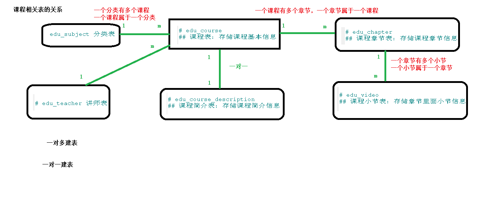
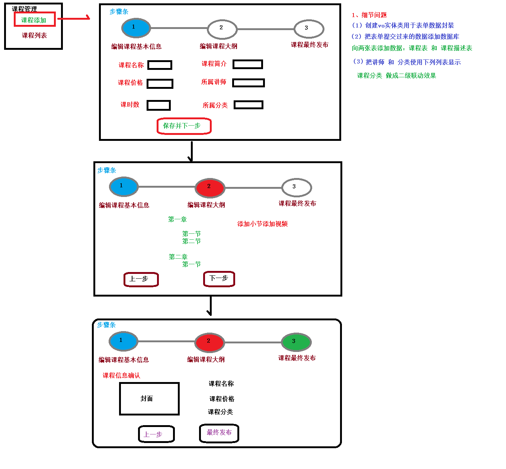

# day07-课程发布-添加课程信息


# 课程管理-添加课程信息接口

课程相关表的关系



课程发布流程



执行代码生成器，将这四个表"edu_course","edu_course_description","edu_chapter","edu_video"的相关代码生成

## 编写CourseInfoVo

用于接收传进来的信息

```java
@ApiModel(value = "课程基本信息", description = "编辑课程基本信息的表单对象")
@Data
public class CourseInfoVo {

    @ApiModelProperty(value = "课程ID")
    private String id;

    @ApiModelProperty(value = "课程讲师ID")
    private String teacherId;

    @ApiModelProperty(value = "课程专业ID")
    private String subjectId;

    @ApiModelProperty(value = "课程专业父级ID")
    private String subjectParentId;

    @ApiModelProperty(value = "课程标题")
    private String title;

    @ApiModelProperty(value = "课程销售价格，设置为0则可免费观看")
    // 0.01
    private BigDecimal price;

    @ApiModelProperty(value = "总课时")
    private Integer lessonNum;

    @ApiModelProperty(value = "课程封面图片路径")
    private String cover;

    @ApiModelProperty(value = "课程简介")
    private String description;

}
```

## 编写EduCourseController

```java
@Api(description="课程管理")
@RestController
@RequestMapping("/eduservice/course")
@CrossOrigin
public class EduCourseController {

    @Autowired
    private EduCourseService eduCourseService;

    // 添加课程信息
    @ApiOperation(value = "新增课程")
    @PostMapping("addCourseInfo")
    public R addCourseInfo(
            @ApiParam(name = "CourseInfoForm", value = "课程基本信息", required = true)
            @RequestBody CourseInfoVo courseInfoVo){
        eduCourseService.saveCourseInfo(courseInfoVo);
        return R.ok();
    }

}
```

## EduCourseService接口

```java
public interface EduCourseService extends IService<EduCourse> {
    // 添加课程信息
    void saveCourseInfo(CourseInfoVo courseInfoVo);
}
```

## EduCourseServiceImpl实现类

```java
@Service
public class EduCourseServiceImpl extends ServiceImpl<EduCourseMapper, EduCourse> implements EduCourseService {

    // 为了添加课程描述信息到数据库
    @Autowired
    private EduCourseDescriptionService eduCourseDescriptionService;

    // 添加课程信息
    @Override
    public void saveCourseInfo(CourseInfoVo courseInfoVo) {
        // 添加课程基本信息
        // 由于添加到数据库需要的是EduCourse，所以先创建一个EduCourse对象
        EduCourse eduCourse = new EduCourse();
        // 将传进来的vo对象赋值给新建的EduCourse对象
        BeanUtils.copyProperties(courseInfoVo,eduCourse);
        // 保存到数据库
        int insert = baseMapper.insert(eduCourse);

        if (insert == 0){
            throw new GuliException(20001,"课程信息保存失败");
        }

        // 获取课程信息的id
        String cid = eduCourse.getId();

        // 添加课程描述信息
        EduCourseDescription eduCourseDescription = new EduCourseDescription();
        eduCourseDescription.setDescription(courseInfoVo.getDescription());
        eduCourseDescription.setId(cid);

        eduCourseDescriptionService.save(eduCourseDescription);

    }
}
```

## 修改EduCourseDescription的主键生成策略

```java
@ApiModelProperty(value = "创建时间")
@TableField(fill = FieldFill.INSERT)
private Date gmtCreate;

@ApiModelProperty(value = "更新时间")
@TableField(fill = FieldFill.INSERT_UPDATE)
private Date gmtModified;
```


# 课程管理-添加课程信息前端

## 添加路由

```js
{
    path: '/course',
    component: Layout,
    redirect: '/course/list',
    name: 'Course',
    meta: { title: '课程管理', icon: 'form' },
    children: [
      {
        path: 'list',
        name: 'EduCourseList',
        component: () => import('@/views/edu/course/list'),
        meta: { title: '课程列表' }
      },
      {
        path: 'info',
        name: 'EduCourseInfo',
        component: () => import('@/views/edu/course/info'),
        meta: { title: '发布课程' }
      },
      {
        path: 'info/:id',
        name: 'EduCourseInfoEdit',
        component: () => import('@/views/edu/course/info'),
        meta: { title: '编辑课程基本信息', noCache: true },
        hidden: true
      },
      {
        path: 'chapter/:id',
        name: 'EduCourseChapterEdit',
        component: () => import('@/views/edu/course/chapter'),
        meta: { title: '编辑课程大纲', noCache: true },
        hidden: true
      },
      {
        path: 'publish/:id',
        name: 'EduCoursePublishEdit',
        component: () => import('@/views/edu/course/publish'),
        meta: { title: '发布课程', noCache: true },
        hidden: true
      }
    ]
  },
```

## 添加vue组件

chapter.vue,info,vue,list.vue,publish.vue

## 课程信息页面

info.vue

```vue
<template>
   <div class="app-container">
     <h2 style="text-align: center;">发布新课程</h2>
     <el-steps :active="1" process-status="wait" align-center style="margin-bottom: 40px;">
       <el-step title="填写课程基本信息"/>
       <el-step title="创建课程大纲"/>
       <el-step title="课程发布"/>
     </el-steps>
     <el-form label-width="120px">
       <el-form-item>
         <el-button :disabled="saveBtnDisabled" type="primary" @click="next">保存并下一步</el-button>
       </el-form-item>
     </el-form>
   </div>
 </template>
<script>
export default {
    data(){
        return{
            saveBtnDisabled:false    // 保存按钮是否禁用
        }
    },
    created(){

    },
    methods:{
        next(){
            this.$router.push({ path: '/course/chapter/1' })
        }
    }
}
</script>
```

## 课程大纲页面

chapter.vue

```vue
<template>
   <div class="app-container">
     <h2 style="text-align: center;">发布新课程</h2>
     <el-steps :active="2" process-status="wait" align-center style="margin-bottom: 40px;">
       <el-step title="填写课程基本信息"/>
       <el-step title="创建课程大纲"/>
       <el-step title="最终发布"/>
     </el-steps>
     <el-form label-width="120px">
       <el-form-item>
         <el-button @click="previous">上一步</el-button>
         <el-button :disabled="saveBtnDisabled" type="primary" @click="next">下一步</el-button>
       </el-form-item>
     </el-form>
   </div>
 </template>
 <script>
 export default {
   data() {
     return {
       saveBtnDisabled: false // 保存按钮是否禁用
     }
   },
   created() {
     console.log('chapter created')
   },
   methods: {
     previous() {
       this.$router.push({ path: '/course/info/1' })
     },
     next() {
       console.log('next')
       this.$router.push({ path: '/course/publish/1' })
     }
   }
 }
 </script>
```

## 课程发布页面

publish.vue

```vue
<template>
   <div class="app-container">
     <h2 style="text-align: center;">发布新课程</h2>
     <el-steps :active="3" process-status="wait" align-center style="margin-bottom: 40px;">
       <el-step title="填写课程基本信息"/>
       <el-step title="创建课程大纲"/>
       <el-step title="最终发布"/>
     </el-steps>
     <el-form label-width="120px">
       <el-form-item>
         <el-button @click="previous">返回修改</el-button>
         <el-button :disabled="saveBtnDisabled" type="primary" @click="publish">发布课程</el-button>
       </el-form-item>
     </el-form>
   </div>
 </template>
 <script>
 export default {
   data() {
     return {
       saveBtnDisabled: false // 保存按钮是否禁用
     }
   },
   created() {
   },
   methods: {
     previous() {
       this.$router.push({ path: '/course/chapter/1' })
     },
     publish() {
       this.$router.push({ path: '/course/list' })
     }
   }
 }
 </script>
```


## 讲师下拉列表显示

### 组件模板

```vue
<!-- 课程讲师 TODO -->
        <el-form-item label="课程讲师">
        <el-select
            v-model="courseInfo.teacherId"
            placeholder="请选择">
            <el-option
            v-for="teacher in teacherList"
            :key="teacher.id"
            :label="teacher.name"
            :value="teacher.id"/>
        </el-select>
        </el-form-item>
```

### 定义api

vue-admin-template-master\src\api\edu\course.js

```js
    // 查询所有讲师，下拉列表
    getListTeacher(){
        return request({
            url: `/eduservice/teacher/findAll`,
            method: 'get'
          })
    }
```

### 组件脚本

定义data

```vue
teacherList: [] // 讲师列表
```

表单初始化时获取讲师列表

```vue
    created(){
        this.findTeacherList()
    },
    methods:{
        // 下拉列表查询所有讲师
        findTeacherList(){
            course.getListTeacher()
            .then(response =>{
                this.teacherList  = response.data.items
            })
        },
```


## 显示课程分类(多级联动)


### 获取一级分类

#### 组件数据定义

定义在data中

```vue
subjectOneList:[],  // 一级分类
subjectTwoList:[]   // 二级分类
```

#### 组件模板

```vue
			<!-- 所属分类：级联下拉列表 -->
            <!-- 一级分类 -->
            <el-form-item label="课程类别">
            <el-select
                v-model="courseInfo.subjectParentId"
                placeholder="一级分类"
                @change="subjectLevelOneChanged">
                <el-option
                v-for="subject in subjectOneList"
                :key="subject.id"
                :label="subject.title"
                :value="subject.id"/>
            </el-select>
```

#### 组件脚本

表单初始化时获取一级分类嵌套列表，引入subject api

```vue
    import subject from '@/api/edu/subject'
```

定义方法

```vue
    created(){
        ...
        // 初始化一级分类
        this.getOneSubjectList()
    },
    methods:{
        // 查询一级分类
        getOneSubjectList(){
            subject.getSubjectList()
            .then(response =>{
                this.subjectOneList = response.data.list
            })
        },

```

### 级联显示二级分类

#### 组件模板

```vue
			<!-- 二级分类 -->
            <el-select v-model="courseInfo.subjectId" placeholder="二级分类">
                <el-option
                v-for="subject in subjectTwoList"
                :key="subject.id"
                :label="subject.title"
                :value="subject.id"/>
            </el-select>
```

#### 注册change事件

在一级分类的<el-select>组件中注册change事件

```vue
<el-select @change="subjectLevelOneChanged" ......
```

#### 定义change事件方法

```vue
		// 显示二级分类，当选择一级分类时，显示二级分类
        subjectLevelOneChanged(value){
            // 遍历一级分类的集合
            for(var i = 0; this.subjectOneList.length; i++){
                // 每一个一级分类
                var oneSubject = this.subjectOneList[i]

                // 判断一级分类的id是否和传进来的id一样
                if(value === oneSubject.id){
                    // 从一级分类中获取二级分类
                    this.subjectTwoList = oneSubject.children
                    this.courseInfo.subjectId = ''
                }
            }
        },
```

## 封面上传

### 组件模板

在info.vue中添加上传组件模板

```vue
		<!-- 课程封面-->
        <el-form-item label="课程封面">
        <el-upload
            :show-file-list="false"
            :on-success="handleAvatarSuccess"
            :before-upload="beforeAvatarUpload"
            :action="BASE_API+'/eduoss/fileoss'"
            class="avatar-uploader">
            
        </el-upload>
        </el-form-item>
```

### 结果回调

```vue
methods:{
        // 上传成功
        handleAvatarSuccess(res, file) {
            console.log(res)// 上传响应
            console.log(URL.createObjectURL(file.raw))// base64编码
            this.courseInfo.cover = res.data.url
        },
        // 上传之前
        beforeAvatarUpload(file) {
            const isJPG = file.type === 'image/jpeg'
            const isLt2M = file.size / 1024 / 1024 < 2
            if (!isJPG) {
                this.$message.error('上传头像图片只能是 JPG 格式!')
            }
            if (!isLt2M) {
                this.$message.error('上传头像图片大小不能超过 2MB!')
            }
            return isJPG && isLt2M
        },
```


# Tinymce可视化编辑器

## 组件初始化

Tinymce是一个传统javascript插件，默认不能用于Vue.js因此需要做一些特殊的整合步骤

### 复制脚本库

将脚本库复制到项目的static目录下（在vue-element-admin-master的static路径下）

### 配置html变量

在 guli-admin/build/webpack.dev.conf.js 中添加配置

使在html页面中可是使用这里定义的BASE_URL变量

```js
new HtmlWebpackPlugin({
    ......
    templateParameters: {
        BASE_URL: config.dev.assetsPublicPath + config.dev.assetsSubDirectory
    }
})
```

### 引入js脚本

在guli-admin/index.html 中引入js脚本

```js
    <script src=<%= BASE_URL %>/tinymce4.7.5/tinymce.min.js></script>
    <script src=<%= BASE_URL %>/tinymce4.7.5/langs/zh_CN.js></script>
```

## 组件引入

为了让Tinymce能用于Vue.js项目，vue-element-admin-master对Tinymce进行了封装，下面我们将它引入到我们的课程信息页面

### 复制组件

src/components/Tinymce

### 引入组件

课程信息组件中引入 Tinymce

```vue
import Tinymce from '@/components/Tinymce'

export default {
    // 初始化文本编辑器
    components: { Tinymce },
    data(){
```

### 组件模板

```vue
<!-- 课程简介-->
<el-form-item label="课程简介">
    <tinymce :height="300" v-model="courseInfo.description"/>
</el-form-item>
```

### 组件样式

在info.vue文件的最后添加如下代码，调整上传图片按钮的高度

```vue
<style scoped>
.tinymce-container {
  line-height: 29px;
}
</style>
```

Tinymce中的图片上传功能直接存储的是图片的base64编码，因此无需图片服务器
