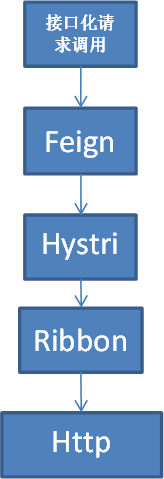

# day10

# 课程管理-删除视屏接口

创建InitVodUtils工具类

```java
public class InitVodClient {

    public static DefaultAcsClient initVodClient(String accessKeyId, String accessKeySecret) throws ClientException {

        String regionId = "cn-shanghai";  // 点播服务接入区域

        DefaultProfile profile = DefaultProfile.getProfile(regionId, accessKeyId, accessKeySecret);

        DefaultAcsClient client = new DefaultAcsClient(profile);

        return client;

    }

}
```

在VodController

```java
// 删除阿里云的视频
@DeleteMapping("deleteAlyVideo/{id}")
public R deleteAlyVideo(@PathVariable String id){

    try {
        // 初始化对象
        DefaultAcsClient client = InitVodClient.initVodClient(ConstantVodUtils.ACCESS_KEY_ID, ConstantVodUtils.ACCESS_KEY_SECRET);
        // 创建删除的request请求
        DeleteVideoRequest request = new DeleteVideoRequest();
        // 设置视频id
        request.setVideoIds(id);
        // 调用初始化方法进行删除
        client.getAcsResponse(request);
        return R.ok();
    } catch (ClientException e) {
        e.printStackTrace();
        throw new GuliException(20001,"删除视频失败");
    }
}
```


# 课程管理-删除视屏前端

Api

```vue
   // 删除小节视频
    deleteAlyVideo(id){
        return request({
            url: `/eduvod/video/deleteAlyVideo/${id}`,
            method: 'delete'
          })
    }

```

Video.vue

```vue
methods: {
     // 点击确认的时候删除
     handleVodRemove(){
        video.deleteAlyVideo(this.video.videoSourceId)
          .then(response =>{
             // 提示信息
              this.$message({
                  type: 'success',
                  message: '删除视频成功!'
              });
              fileList: []  // 清空上传列表
              this.video.videoSourceId = ''
              this.video.videoOriginalName = ''
          })
     },
     // 点击x的时候弹框
     beforeVodRemove(file, fileList){
      return this.$confirm(`确定移除 ${ file.name }？`);
     },

```


# 技术点-微服务SpringCloud

## SpringCloud和SpringBoot的关系：

 

SpringBoot是Spring的一套快速配置脚手架，可以基于SpringBoot快速开发单个微服务。SpringCloud是一系列框架的总称。要使用SpringCloud的话必须要基于SpringBoot，而SpringBoot可以单独使用。

 

# Nacos下载安装

**下载地址和版本**

下载地址：https://github.com/alibaba/nacos/releases

下载版本：nacos-server-1.1.4.tar.gz或nacos-server-1.1.4.zip，解压任意目录即可

\- Windows

启动命令：cmd startup.cmd 或者双击startup.cmd运行文件。

访问：http://localhost:8848/nacos

用户名密码：nacos/nacos

# 服务注册（service_edu为例）

## 在service模块配置pom

配置Nacos客户端的pom依赖

```xml
<!--服务注册-->
<dependency>
    <groupId>org.springframework.cloud</groupId>
    <artifactId>spring-cloud-starter-alibaba-nacos-discovery</artifactId>
</dependency>

```

## 添加服务配置信息

配置application.properties，在客户端微服务中添加注册Nacos服务的配置信息

```properties
# nacos服务地址
spring.cloud.nacos.discovery.server-addr=127.0.0.1:8848
```

## 添加Nacos客户端注解

在客户端微服务启动类中添加注解@EnableDiscoveryClient

## 启动客户端微服务

启动注册中心     

启动已注册的微服务，可以在Nacos服务列表中看到被注册的微服务

 

# 课程管理-删除小节删除视频Feign

## 在service模块添加pom依赖

```xml
<!-- 服务调用 -->
<dependency>
    <groupId>org.springframework.cloud</groupId>
    <artifactId>spring-cloud-starter-openfeign</artifactId>
</dependency>
```

## 在调用端的启动类添加注解

```java
@EnableFeignClients // 开启远程调用
```

## 创建包和接口

创建client包

@FeignClient注解用于指定从哪个服务中调用功能 ，名称与被调用的服务名保持一致。

@GetMapping注解用于对被调用的微服务进行地址映射。

@PathVariable注解一定要指定参数名称，否则出错

@Component注解防止，在其他位置注入CodClient时idea报错

```java
@Component
@FeignClient("service-vod")     // 远程调用服务名称
public interface VodClient {

    // 删除阿里云的视频
    // 路径为全路径
    // @PathVariable("id")需要指名参数名字，否则会报错
    @DeleteMapping("/eduvod/video/deleteAlyVideo/{id}")
    public R deleteAlyVideo(@PathVariable("id") String id);
}
```

## 调用微服务

在调用端的VideoServiceImpl中调用client中的方法

```java
// 删除小节 顺便删除视频
@DeleteMapping("{id}")
public R deleteVideo(@PathVariable String id){
    // 根据小节id查询出视频id
    EduVideo eduVideo = eduVideoService.getById(id);
    String videoSourceId = eduVideo.getVideoSourceId();

    // 先判断得到的视频id是否为空
    if (!StringUtils.isEmpty(videoSourceId)){
        // 根据视频id删除阿里云的视频
        vodClient.deleteAlyVideo(videoSourceId);
    }

    eduVideoService.removeById(id);
    return R.ok();
}
```

测试


# 课程管理-删除课程删除视频后端

com.atguigu.vod.controller.VodController

```java
// 删除多个阿里云视频
@RequestMapping("delete-batch")
public R deleteBatch(@RequestParam("videoIddList") List<String> videoIddList){
    vodService.removeMoreVideo(videoIddList);
    return R.ok();
}
```


VodService

```java
// 删除多个阿里云视频
void removeMoreVideo(List<String> videoIddList);
```


VodServiceImpl

```java
// 删除多个阿里云视频
@Override
public void removeMoreVideo(List<String> videoIddList) {
    try {
        // 初始化对象
        DefaultAcsClient client = InitVodClient.initVodClient(ConstantVodUtils.ACCESS_KEY_ID, ConstantVodUtils.ACCESS_KEY_SECRET);
        // 创建删除的request请求
        DeleteVideoRequest request = new DeleteVideoRequest();

        // 将videoIds集合遍历出来，做成1,2,3这样的形式
        String videoIds = StringUtils.join(videoIddList.toArray(), ",");

        // 设置视频id
        request.setVideoIds(videoIds);

        // 调用初始化方法进行删除
        client.getAcsResponse(request);
    } catch (ClientException e) {
        e.printStackTrace();
        throw new GuliException(20001,"删除视频失败");
    }
}
```


# 课程管理-删除课程删除视频远程调用

com.atguigu.eduservice.client.VodClient

```java
// 删除多个阿里云视频
@RequestMapping("/eduvod/video/delete-batch")
public R deleteBatch(@RequestParam("videoIddList") List<String> videoIddList);
```

com.atguigu.eduservice.service.impl.EduVideoServiceImpl

```java
@Service
public class EduVideoServiceImpl extends ServiceImpl<EduVideoMapper, EduVideo> implements EduVideoService {

    @Autowired
    private VodClient vodClient;

    // 根据课程id删除小节
    @Override
    public void removeVideoByCourseId(String courseId) {
        // 根据课程id查询课程所有的视频id
        QueryWrapper<EduVideo> wrapperVideo = new QueryWrapper<>();
        wrapperVideo.eq("course_id",courseId);
        // 只需要这一个字段
        wrapperVideo.select("video_source_id");

        List<EduVideo> eduVideoList = baseMapper.selectList(wrapperVideo);

        // 需要将List<EduVideo>变成List<String>这样
        List<String> videoIds = new ArrayList<>();

        // 遍历eduVideoList，拿到里面的每一个id值
        for (int i = 0; i < eduVideoList.size(); i++) {
            EduVideo eduVideo = eduVideoList.get(i);
            String videoSourceId = eduVideo.getVideoSourceId();
            // 判断videoSourceId是否为空
            if (StringUtils.isEmpty(videoSourceId)){
                // 不为空，将id加入集合
                videoIds.add(videoSourceId);
            }
        }

        // 判断集合videoIds是否为空
        if (videoIds.size() > 0){
            // 调用远程方法，根据多少id进行删除视频
            vodClient.deleteBatch(videoIds);
        }


        QueryWrapper<EduVideo> wrapper = new QueryWrapper<>();
        wrapper.eq("course_id",courseId);
        baseMapper.delete(wrapper);
    }
}
```


# 技术点-SpringCloud调用接口流程

Feign->Hystrix->Ribbon->Http Client



# 课程管理-项目中整合熔断器

导入依赖

```xml
<dependency>
    <groupId>org.springframework.cloud</groupId>
    <artifactId>spring-cloud-starter-netflix-ribbon</artifactId>
</dependency>

<!--hystrix依赖，主要是用  @HystrixCommand -->
<dependency>
    <groupId>org.springframework.cloud</groupId>
    <artifactId>spring-cloud-starter-netflix-hystrix</artifactId>
</dependency>
```

配置文件开启熔断器

```pro
#开启熔断机制
feign.hystrix.enabled=true
# 设置hystrix超时时间，默认1000ms
# hystrix.command.default.execution.isolation.thread.timeoutInMilliseconds=6000
```

编写调用远程方法接口的实现类

```java
@Component
public class VodFileDegradeFeignClient implements VodClient {

    // 熔断器，服务发送错误时调用次方法
    @Override
    public R deleteAlyVideo(String id) {
        return R.error().message("删除视频失败");
    }

    @Override
    public R deleteBatch(List<String> videoIddList) {
        return R.error().message("删除多个视频失败");
    }
}
```

在接口的Feign加入fallback属性

```java
@Component
@FeignClient(name = "service-vod",fallback = VodFileDegradeFeignClient.class)     // 远程调用服务名称
public interface VodClient {
```

修改删除小节的方法，Debug测试

```java
@DeleteMapping("{id}")
public R deleteVideo(@PathVariable String id){
    // 根据小节id查询出视频id
    EduVideo eduVideo = eduVideoService.getById(id);
    String videoSourceId = eduVideo.getVideoSourceId();

    // 先判断得到的视频id是否为空
    if (!StringUtils.isEmpty(videoSourceId)){
        // 根据视频id删除阿里云的视频
        R result = vodClient.deleteAlyVideo(videoSourceId);
        if (result.getCode() == 20001){
            throw new GuliException(20001,"删除视频失败，熔断器...");
        }
    }

    eduVideoService.removeById(id);
    return R.ok();
}
```

