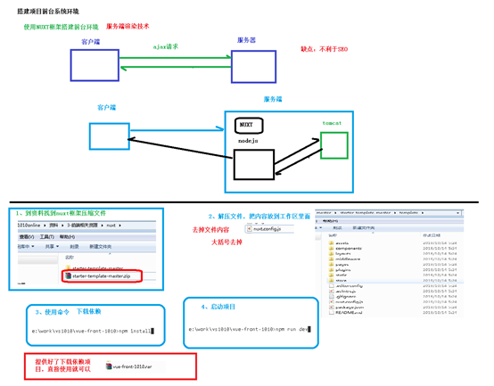
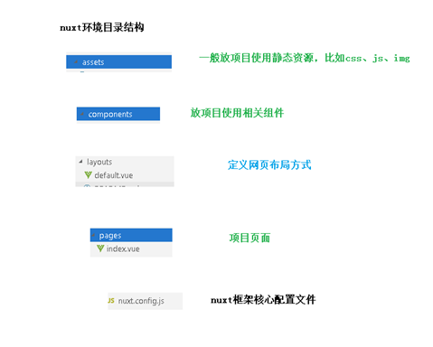
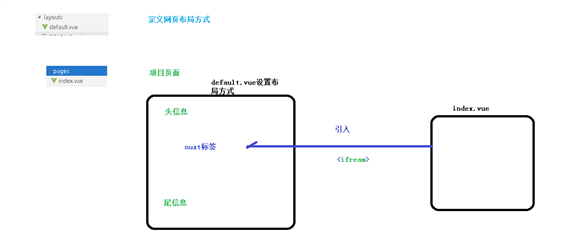
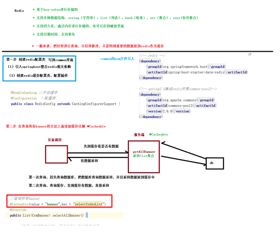
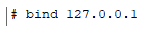
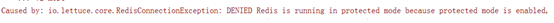
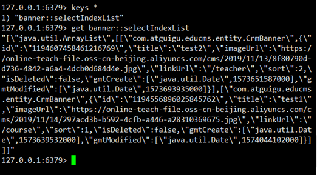



#  day11-首页数据显示 




 {}

# 搭建项目前台环境NUXT {{ sensitive }} 

{}

## 下载压缩包

https://github.com/nuxt-community/starter-template/archive/master.zip

## 解压

将template中的内容复制到 guli

## 修改package.json

name、description、author（必须修改这里，否则项目无法安装）

```js
 "name": "guli",
   "version": "1.0.0",
   "description": "谷粒学院前台网站",
   "author": "Helen <111111111@qq.com>",
```

## 修改nuxt.config.js

修改title: '{{ name }}'、content: '{{escape description }}'

这里的设置最后会显示在页面标题栏和meta数据中

```js
head: {
    title: '谷粒学院 - Java视频|HTML5视频|前端视频|Python视频|大数据视频-自学拿1万+月薪的IT在线视频课程，谷粉力挺，老学员为你推荐',
    meta: [
      { charset: 'utf-8' },
      { name: 'viewport', content: 'width=device-width, initial-scale=1' },
      { hid: 'keywords', name: 'keywords', content: '谷粒学院,IT在线视频教程,Java视频,HTML5视频,前端视频,Python视频,大数据视频' },
      { hid: 'description', name: 'description', content: '谷粒学院是国内领先的IT在线视频学习平台、职业教育平台。截止目前,谷粒学院线上、线下学习人次数以万计！会同上百个知名开发团队联合制定的Java、HTML5前端、大数据、Python等视频课程，被广大学习者及IT工程师誉为：业界最适合自学、代码量最大、案例最多、实战性最强、技术最前沿的IT系列视频课程！' }
    ],
    link: [
      { rel: 'icon', type: 'image/x-icon', href: '/favicon.ico' }
    ]
  },

```

## 安装依赖

```bash
npm install
```

## 测试运行

```bash
npm run dev
```

## 幻灯片插件

```bash
npm install vue-awesome-swiper
```

在 plugins 文件夹下新建文件 nuxt-swiper-plugin.js，内容是

```js
import Vue from 'vue'
import VueAwesomeSwiper from 'vue-awesome-swiper/dist/ssr'

Vue.use(VueAwesomeSwiper)
```

 

在 nuxt.config.js 文件中配置插件

将 plugins 和 css节点 复制到 module.exports节点下

```js
module.exports = {
  plugins: [
    { src: '~/plugins/nuxt-swiper-plugin.js', ssr: false }
  ],
  css: [
    'swiper/dist/css/swiper.css'
  ],
```


# NUXT框架介绍

## 目录介绍



## 页面加载方式




# 整合项目首页面

## 页面布局

## 复制静态资源

将静态原型中的css、img、js、photo目录拷贝至assets目录下 

将favicon.ico复制到static目录下

## 定义布局

我们可以把页头和页尾提取出来，形成布局页

修改layouts目录下default.vue，从静态页面中复制首页，修改了原始文件中的资源路径为~/assets/，将主内容区域的内容替换成<nuxt />

内容如下：

完整的内容如下

```vue
<template>
   <div class="in-wrap">
     <!-- 公共头引入 -->
     <header id="header">
       <section class="container">
         <h1 id="logo">
           <a href="#" title="谷粒学院">
             
           </a>
         </h1>
         <div class="h-r-nsl">
           <ul class="nav">
             <router-link to="/" tag="li" active-class="current" exact>
               <a>首页</a>
             </router-link>
             <router-link to="/course" tag="li" active-class="current">
               <a>课程</a>
             </router-link>
             <router-link to="/teacher" tag="li" active-class="current">
               <a>名师</a>
             </router-link>
             <router-link to="/article" tag="li" active-class="current">
               <a>文章</a>
             </router-link>
             <router-link to="/qa" tag="li" active-class="current">
               <a>问答</a>
             </router-link>
           </ul>
           <!-- / nav -->
           <ul class="h-r-login">
             <li id="no-login">
               <a href="/sing_in" title="登录">
                 <em class="icon18 login-icon">&nbsp;</em>
                 <span class="vam ml5">登录</span>
               </a>
               |
               <a href="/sign_up" title="注册">
                 <span class="vam ml5">注册</span>
               </a>
             </li>
             <li class="mr10 undis" id="is-login-one">
               <a href="#" title="消息" id="headerMsgCountId">
                 <em class="icon18 news-icon">&nbsp;</em>
               </a>
               <q class="red-point" style="display: none">&nbsp;</q>
             </li>
             <li class="h-r-user undis" id="is-login-two">
               <a href="#" title>
                 
                 <span class="vam disIb" id="userName"></span>
               </a>
               <a href="javascript:void(0)" title="退出" onclick="exit();" class="ml5">退出</a>
             </li>
             <!-- /未登录显示第1 li；登录后显示第2，3 li -->
           </ul>
           <aside class="h-r-search">
             <form action="#" method="post">
               <label class="h-r-s-box">
                 <input type="text" placeholder="输入你想学的课程" name="queryCourse.courseName" value>
                 <button type="submit" class="s-btn">
                   <em class="icon18">&nbsp;</em>
                 </button>
               </label>
             </form>
           </aside>
         </div>
         <aside class="mw-nav-btn">
           <div class="mw-nav-icon"></div>
         </aside>
         <div class="clear"></div>
       </section>
     </header>
     <!-- /公共头引入 -->
     <nuxt/>
     <!-- 公共底引入 -->
     <footer id="footer">
       <section class="container">
         <div class>
           <h4 class="hLh30">
             <span class="fsize18 f-fM c-999">友情链接</span>
           </h4>
           <ul class="of flink-list">
             <li>
               <a href="http://www.atguigu.com/" title="尚硅谷" target="_blank">尚硅谷</a>
             </li>
           </ul>
           <div class="clear"></div>
         </div>
         <div class="b-foot">
           <section class="fl col-7">
             <section class="mr20">
               <section class="b-f-link">
                 <a href="#" title="关于我们" target="_blank">关于我们</a>|
                 <a href="#" title="联系我们" target="_blank">联系我们</a>|
                 <a href="#" title="帮助中心" target="_blank">帮助中心</a>|
                 <a href="#" title="资源下载" target="_blank">资源下载</a>|
                 <span>服务热线：010-56253825(北京) 0755-85293825(深圳)</span>
                 <span>Email：info@atguigu.com</span>
               </section>
               <section class="b-f-link mt10">
                 <span>©2018课程版权均归谷粒学院所有 京ICP备17055252号</span>
               </section>
             </section>
           </section>
           <aside class="fl col-3 tac mt15">
             <section class="gf-tx">
               <span>
                 
               </span>
             </section>
             <section class="gf-tx">
               <span>
                 
               </span>
             </section>
           </aside>
           <div class="clear"></div>
         </div>
       </section>
     </footer>
     <!-- /公共底引入 -->
   </div>
 </template>
 <script>
 import "~/assets/css/reset.css";
 import "~/assets/css/theme.css";
 import "~/assets/css/global.css";
 import "~/assets/css/web.css";
 export default {};
 </script>
```

## 定义首页面

（不包含幻灯片）

修改pages/index.vue：

修改了原始文件中的资源路径为~/assets/

内容如下：

```vue
<template>
   <div>
      <!-- 幻灯片 开始 -->
      
      <!-- 幻灯片 结束 -->

      <div id="aCoursesList">
       <!-- 网校课程 开始 -->
       <div>
         <section class="container">
           <header class="comm-title">
             <h2 class="tac">
               <span class="c-333">热门课程</span>
             </h2>
           </header>
           <div>
             <article class="comm-course-list">
               <ul class="of" id="bna">
                 <li>
                   <div class="cc-l-wrap">
                     <section class="course-img">
                       
                       <div class="cc-mask">
                         <a href="#" title="开始学习" class="comm-btn c-btn-1">开始学习</a>
                       </div>
                     </section>
                     <h3 class="hLh30 txtOf mt10">
                       <a href="#" title="听力口语" class="course-title fsize18 c-333">听力口语</a>
                     </h3>
                     <section class="mt10 hLh20 of">
                       <span class="fr jgTag bg-green">
                         <i class="c-fff fsize12 f-fA">免费</i>
                       </span>
                       <span class="fl jgAttr c-ccc f-fA">
                         <i class="c-999 f-fA">9634人学习</i>
                         |
                         <i class="c-999 f-fA">9634评论</i>
                       </span>
                     </section>
                   </div>
                 </li>
                 <li>
                   <div class="cc-l-wrap">
                     <section class="course-img">
                       
                       <div class="cc-mask">
                         <a href="#" title="开始学习" class="comm-btn c-btn-1">开始学习</a>
                       </div>
                     </section>
                     <h3 class="hLh30 txtOf mt10">
                       <a href="#" title="Java精品课程" class="course-title fsize18 c-333">Java精品课程</a>
                     </h3>
                     <section class="mt10 hLh20 of">
                       <span class="fr jgTag bg-green">
                         <i class="c-fff fsize12 f-fA">免费</i>
                       </span>
                       <span class="fl jgAttr c-ccc f-fA">
                         <i class="c-999 f-fA">501人学习</i>
                         |
                         <i class="c-999 f-fA">501评论</i>
                       </span>
                     </section>
                   </div>
                 </li>
                 <li>
                   <div class="cc-l-wrap">
                     <section class="course-img">
                       
                       <div class="cc-mask">
                         <a href="#" title="开始学习" class="comm-btn c-btn-1">开始学习</a>
                       </div>
                     </section>
                     <h3 class="hLh30 txtOf mt10">
                       <a href="#" title="C4D零基础" class="course-title fsize18 c-333">C4D零基础</a>
                     </h3>
                     <section class="mt10 hLh20 of">
                       <span class="fr jgTag bg-green">
                         <i class="c-fff fsize12 f-fA">免费</i>
                       </span>
                       <span class="fl jgAttr c-ccc f-fA">
                         <i class="c-999 f-fA">300人学习</i>
                         |
                         <i class="c-999 f-fA">300评论</i>
                       </span>
                     </section>
                   </div>
                 </li>
                 <li>
                   <div class="cc-l-wrap">
                     <section class="course-img">
                       
                       <div class="cc-mask">
                         <a href="#" title="开始学习" class="comm-btn c-btn-1">开始学习</a>
                       </div>
                     </section>
                     <h3 class="hLh30 txtOf mt10">
                       <a href="#" title="数学给宝宝带来的兴趣" class="course-title fsize18 c-333">数学给宝宝带来的兴趣</a>
                     </h3>
                     <section class="mt10 hLh20 of">
                       <span class="fr jgTag bg-green">
                         <i class="c-fff fsize12 f-fA">免费</i>
                       </span>
                       <span class="fl jgAttr c-ccc f-fA">
                         <i class="c-999 f-fA">256人学习</i>
                         |
                         <i class="c-999 f-fA">256评论</i>
                       </span>
                     </section>
                   </div>
                 </li>
                 <li>
                   <div class="cc-l-wrap">
                     <section class="course-img">
                       
                       <div class="cc-mask">
                         <a href="#" title="开始学习" class="comm-btn c-btn-1">开始学习</a>
                       </div>
                     </section>
                     <h3 class="hLh30 txtOf mt10">
                       <a
                         href="#"
                         title="零基础入门学习Python课程学习"
                         class="course-title fsize18 c-333"
                       >零基础入门学习Python课程学习</a>
                     </h3>
                     <section class="mt10 hLh20 of">
                       <span class="fr jgTag bg-green">
                         <i class="c-fff fsize12 f-fA">免费</i>
                       </span>
                       <span class="fl jgAttr c-ccc f-fA">
                         <i class="c-999 f-fA">137人学习</i>
                         |
                         <i class="c-999 f-fA">137评论</i>
                       </span>
                     </section>
                   </div>
                 </li>
                 <li>
                   <div class="cc-l-wrap">
                     <section class="course-img">
                       
                       <div class="cc-mask">
                         <a href="#" title="开始学习" class="comm-btn c-btn-1">开始学习</a>
                       </div>
                     </section>
                     <h3 class="hLh30 txtOf mt10">
                       <a href="#" title="MySql从入门到精通" class="course-title fsize18 c-333">MySql从入门到精通</a>
                     </h3>
                     <section class="mt10 hLh20 of">
                       <span class="fr jgTag bg-green">
                         <i class="c-fff fsize12 f-fA">免费</i>
                       </span>
                       <span class="fl jgAttr c-ccc f-fA">
                         <i class="c-999 f-fA">125人学习</i>
                         |
                         <i class="c-999 f-fA">125评论</i>
                       </span>
                     </section>
                   </div>
                 </li>
                 <li>
                   <div class="cc-l-wrap">
                     <section class="course-img">
                       
                       <div class="cc-mask">
                         <a href="#" title="开始学习" class="comm-btn c-btn-1">开始学习</a>
                       </div>
                     </section>
                     <h3 class="hLh30 txtOf mt10">
                       <a href="#" title="搜索引擎优化技术" class="course-title fsize18 c-333">搜索引擎优化技术</a>
                     </h3>
                     <section class="mt10 hLh20 of">
                       <span class="fr jgTag bg-green">
                         <i class="c-fff fsize12 f-fA">免费</i>
                       </span>
                       <span class="fl jgAttr c-ccc f-fA">
                         <i class="c-999 f-fA">123人学习</i>
                         |
                         <i class="c-999 f-fA">123评论</i>
                       </span>
                     </section>
                   </div>
                 </li>
                 <li>
                   <div class="cc-l-wrap">
                     <section class="course-img">
                       
                       <div class="cc-mask">
                         <a href="#" title="开始学习" class="comm-btn c-btn-1">开始学习</a>
                       </div>
                     </section>
                     <h3 class="hLh30 txtOf mt10">
                       <a href="#" title="20世纪西方音乐" class="course-title fsize18 c-333">20世纪西方音乐</a>
                     </h3>
                     <section class="mt10 hLh20 of">
                       <span class="fr jgTag bg-green">
                         <i class="c-fff fsize12 f-fA">免费</i>
                       </span>
                       <span class="fl jgAttr c-ccc f-fA">
                         <i class="c-999 f-fA">34人学习</i>
                         |
                         <i class="c-999 f-fA">34评论</i>
                       </span>
                     </section>
                   </div>
                 </li>
               </ul>
               <div class="clear"></div>
             </article>
             <section class="tac pt20">
               <a href="#" title="全部课程" class="comm-btn c-btn-2">全部课程</a>
             </section>
           </div>
         </section>
       </div>
       <!-- /网校课程 结束 -->
       <!-- 网校名师 开始 -->
       <div>
         <section class="container">
           <header class="comm-title">
             <h2 class="tac">
               <span class="c-333">名师大咖</span>
             </h2>
           </header>
           <div>
             <article class="i-teacher-list">
               <ul class="of">
                 <li>
                   <section class="i-teach-wrap">
                     <div class="i-teach-pic">
                       <a href="/teacher/1" title="姚晨">
                         
                       </a>
                     </div>
                     <div class="mt10 hLh30 txtOf tac">
                       <a href="/teacher/1" title="姚晨" class="fsize18 c-666">姚晨</a>
                     </div>
                     <div class="hLh30 txtOf tac">
                       <span class="fsize14 c-999">北京师范大学法学院副教授</span>
                     </div>
                     <div class="mt15 i-q-txt">
                       <p
                         class="c-999 f-fA"
                       >北京师范大学法学院副教授、清华大学法学博士。自2004年至今已有9年的司法考试培训经验。长期从事司法考试辅导，深知命题规律，了解解题技巧。内容把握准确，授课重点明确，层次分明，调理清晰，将法条法理与案例有机融合，强调综合，深入浅出。</p>
                     </div>
                   </section>
                 </li>
                 <li>
                   <section class="i-teach-wrap">
                     <div class="i-teach-pic">
                       <a href="/teacher/1" title="谢娜">
                         
                       </a>
                     </div>
                     <div class="mt10 hLh30 txtOf tac">
                       <a href="/teacher/1" title="谢娜" class="fsize18 c-666">谢娜</a>
                     </div>
                     <div class="hLh30 txtOf tac">
                       <span class="fsize14 c-999">资深课程设计专家，专注10年AACTP美国培训协会认证导师</span>
                     </div>
                     <div class="mt15 i-q-txt">
                       <p
                         class="c-999 f-fA"
                       >十年课程研发和培训咨询经验，曾任国企人力资源经理、大型外企培训经理，负责企业大学和培训体系搭建；曾任专业培训机构高级顾问、研发部总监，为包括广东移动、东莞移动、深圳移动、南方电网、工商银行、农业银行、民生银行、邮储银行、TCL集团、清华大学继续教育学院、中天路桥、广西扬翔股份等超过200家企业提供过培训与咨询服务，并担任近50个大型项目的总负责人。</p>
                     </div>
                   </section>
                 </li>
                 <li>
                   <section class="i-teach-wrap">
                     <div class="i-teach-pic">
                       <a href="/teacher/1" title="刘德华">
                         
                       </a>
                     </div>
                     <div class="mt10 hLh30 txtOf tac">
                       <a href="/teacher/1" title="刘德华" class="fsize18 c-666">刘德华</a>
                     </div>
                     <div class="hLh30 txtOf tac">
                       <span class="fsize14 c-999">上海师范大学法学院副教授</span>
                     </div>
                     <div class="mt15 i-q-txt">
                       <p
                         class="c-999 f-fA"
                       >上海师范大学法学院副教授、清华大学法学博士。自2004年至今已有9年的司法考试培训经验。长期从事司法考试辅导，深知命题规律，了解解题技巧。内容把握准确，授课重点明确，层次分明，调理清晰，将法条法理与案例有机融合，强调综合，深入浅出。</p>
                     </div>
                   </section>
                 </li>
                 <li>
                   <section class="i-teach-wrap">
                     <div class="i-teach-pic">
                       <a href="/teacher/1" title="周润发">
                         
                       </a>
                     </div>
                     <div class="mt10 hLh30 txtOf tac">
                       <a href="/teacher/1" title="周润发" class="fsize18 c-666">周润发</a>
                     </div>
                     <div class="hLh30 txtOf tac">
                       <span class="fsize14 c-999">考研政治辅导实战派专家，全国考研政治命题研究组核心成员。</span>
                     </div>
                     <div class="mt15 i-q-txt">
                       <p
                         class="c-999 f-fA"
                       >法学博士，北京师范大学马克思主义学院副教授，专攻毛泽东思想概论、邓小平理论，长期从事考研辅导。出版著作两部，发表学术论文30余篇，主持国家社会科学基金项目和教育部重大课题子课题各一项，参与中央实施马克思主义理论研究和建设工程项目。</p>
                     </div>
                   </section>
                 </li>
               </ul>
               <div class="clear"></div>
             </article>
             <section class="tac pt20">
               <a href="#" title="全部讲师" class="comm-btn c-btn-2">全部讲师</a>
             </section>
           </div>
         </section>
       </div>
       <!-- /网校名师 结束 -->
     </div>
   </div>
 </template>
 <script>
 export default {
 }
 </script>
  <script>
 export default {
   data () {
     return {
       swiperOption: {
         //配置分页
         pagination: {
           el: '.swiper-pagination'//分页的dom节点
         },
         //配置导航
         navigation: {
           nextEl: '.swiper-button-next',//下一页dom节点
           prevEl: '.swiper-button-prev'//前一页dom节点
         }
       }
     }
   }
 }
 </script>
```

## 幻灯片插件

```vue
<!-- 幻灯片 开始 -->
      <div v-swiper:mySwiper="swiperOption">
          <div class="swiper-wrapper">
              <div class="swiper-slide" style="background: #040B1B;">
                  <a target="_blank" href="/">
                      
                  </a>
              </div>
              <div class="swiper-slide" style="background: #040B1B;">
                  <a target="_blank" href="/">
                      
                  </a>
              </div>
          </div>
          <div class="swiper-pagination swiper-pagination-white"></div>
          <div class="swiper-button-prev swiper-button-white" slot="button-prev"></div>
          <div class="swiper-button-next swiper-button-white" slot="button-next"></div>
      </div>
      <!-- 幻灯片 结束 -->

```

Script

```vue
<script>
 export default {
   data () {
     return {
       swiperOption: {
         //配置分页
         pagination: {
           el: '.swiper-pagination'//分页的dom节点
         },
         //配置导航
         navigation: {
           nextEl: '.swiper-button-next',//下一页dom节点
           prevEl: '.swiper-button-prev'//前一页dom节点
         }
       }
     }
   }
 }
 </script>

```

## 启动项目报错解决方案

Could not compile template.......swiper\dist\css\swiper.css

```
P168报错:ERROR Could not compile template.......swiper\dist\css\swiper.css

因为我们导入的`import swiper/css/swiper.css`在低版本中有，Swiper 6.0.0或者更高版本就不是这个导入地址了，所以解决方案有两种：

方案一：
导入`import swiper/swiper-bundle.css`， 同时删除`import swiper/css/swiper.css`

方案二：
把安装的vue-awesome-swiper版本回退到低版本，这样就可以保留`import swiper/css/swiper.css`:
指令为: `npm i vue-awesome-swiper@3.1.3 --save`

或者 将package.js里面的dependencies下的vue-awesome-swiper: ^4.x.x改为3.1.3,然后npm install 在之后启动还会报一个错:

potentially fixable with the `--fix` option

解决办法:

找到 nuxt.config.js在extend (config, { isDev, isClient }) {}括号内最后面添加options: {

fix: true

}

也就是:extend (config, { isDev, isClient }) {
if (isDev && isClient) {
config.module.rules.push({
enforce: pre,
test: /\.(js|vue)$/,
loader: eslint-loader,
exclude: /(node_modules)/,
options: {
fix: true
}
})
}
}

```

# 整合课程和名师页面

## 课程列表页面

创建 pages/course/index.vue

```vue
<template>
   <div id="aCoursesList" class="bg-fa of">
     <!-- /课程列表 开始 -->
     <section class="container">
       <header class="comm-title">
         <h2 class="fl tac">
           <span class="c-333">全部课程</span>
         </h2>
       </header>
       <section class="c-sort-box">
         <section class="c-s-dl">
           <dl>
             <dt>
               <span class="c-999 fsize14">课程类别</span>
             </dt>
             <dd class="c-s-dl-li">
               <ul class="clearfix">
                 <li>
                   <a title="全部" href="#">全部</a>
                 </li>
                 <li>
                   <a title="数据库" href="#">数据库</a>
                 </li>
                 <li class="current">
                   <a title="外语考试" href="#">外语考试</a>
                 </li>
                 <li>
                   <a title="教师资格证" href="#">教师资格证</a>
                 </li>
                 <li>
                   <a title="公务员" href="#">公务员</a>
                 </li>
                 <li>
                   <a title="移动开发" href="#">移动开发</a>
                 </li>
                 <li>
                   <a title="操作系统" href="#">操作系统</a>
                 </li>
               </ul>
             </dd>
           </dl>
           <dl>
             <dt>
               <span class="c-999 fsize14"></span>
             </dt>
             <dd class="c-s-dl-li">
               <ul class="clearfix">
                 <li>
                   <a title="职称英语" href="#">职称英语</a>
                 </li>
                 <li>
                   <a title="英语四级" href="#">英语四级</a>
                 </li>
                 <li>
                   <a title="英语六级" href="#">英语六级</a>
                 </li>
               </ul>
             </dd>
           </dl>
           <div class="clear"></div>
         </section>
         <div class="js-wrap">
           <section class="fr">
             <span class="c-ccc">
               <i class="c-master f-fM">1</i>/
               <i class="c-666 f-fM">1</i>
             </span>
           </section>
           <section class="fl">
             <ol class="js-tap clearfix">
               <li>
                 <a title="关注度" href="#">关注度</a>
               </li>
               <li>
                 <a title="最新" href="#">最新</a>
               </li>
               <li class="current bg-orange">
                 <a title="价格" href="#">价格&nbsp;
                   <span>↓</span>
                 </a>
               </li>
             </ol>
           </section>
         </div>
         <div class="mt40">
           <!-- /无数据提示 开始-->
           <section class="no-data-wrap">
             <em class="icon30 no-data-ico">&nbsp;</em>
             <span class="c-666 fsize14 ml10 vam">没有相关数据，小编正在努力整理中...</span>
           </section>
           <!-- /无数据提示 结束-->
           <article class="comm-course-list">
             <ul class="of" id="bna">
               <li>
                 <div class="cc-l-wrap">
                   <section class="course-img">
                     
                     <div class="cc-mask">
                       <a href="/course/1" title="开始学习" class="comm-btn c-btn-1">开始学习</a>
                     </div>
                   </section>
                   <h3 class="hLh30 txtOf mt10">
                     <a href="/course/1" title="听力口语" class="course-title fsize18 c-333">听力口语</a>
                   </h3>
                   <section class="mt10 hLh20 of">
                     <span class="fr jgTag bg-green">
                       <i class="c-fff fsize12 f-fA">免费</i>
                     </span>
                     <span class="fl jgAttr c-ccc f-fA">
                       <i class="c-999 f-fA">9634人学习</i>
                       |
                       <i class="c-999 f-fA">9634评论</i>
                     </span>
                   </section>
                 </div>
               </li>
               <li>
                 <div class="cc-l-wrap">
                   <section class="course-img">
                     
                     <div class="cc-mask">
                       <a href="/course/1" title="开始学习" class="comm-btn c-btn-1">开始学习</a>
                     </div>
                   </section>
                   <h3 class="hLh30 txtOf mt10">
                     <a href="/course/1" title="Java精品课程" class="course-title fsize18 c-333">Java精品课程</a>
                   </h3>
                   <section class="mt10 hLh20 of">
                     <span class="fr jgTag bg-green">
                       <i class="c-fff fsize12 f-fA">免费</i>
                     </span>
                     <span class="fl jgAttr c-ccc f-fA">
                       <i class="c-999 f-fA">501人学习</i>
                       |
                       <i class="c-999 f-fA">501评论</i>
                     </span>
                   </section>
                 </div>
               </li>
               <li>
                 <div class="cc-l-wrap">
                   <section class="course-img">
                     
                     <div class="cc-mask">
                       <a href="/course/1" title="开始学习" class="comm-btn c-btn-1">开始学习</a>
                     </div>
                   </section>
                   <h3 class="hLh30 txtOf mt10">
                     <a href="/course/1" title="C4D零基础" class="course-title fsize18 c-333">C4D零基础</a>
                   </h3>
                   <section class="mt10 hLh20 of">
                     <span class="fr jgTag bg-green">
                       <i class="c-fff fsize12 f-fA">免费</i>
                     </span>
                     <span class="fl jgAttr c-ccc f-fA">
                       <i class="c-999 f-fA">300人学习</i>
                       |
                       <i class="c-999 f-fA">300评论</i>
                     </span>
                   </section>
                 </div>
               </li>
               <li>
                 <div class="cc-l-wrap">
                   <section class="course-img">
                     
                     <div class="cc-mask">
                       <a href="/course/1" title="开始学习" class="comm-btn c-btn-1">开始学习</a>
                     </div>
                   </section>
                   <h3 class="hLh30 txtOf mt10">
                     <a href="/course/1" title="数学给宝宝带来的兴趣" class="course-title fsize18 c-333">数学给宝宝带来的兴趣</a>
                   </h3>
                   <section class="mt10 hLh20 of">
                     <span class="fr jgTag bg-green">
                       <i class="c-fff fsize12 f-fA">免费</i>
                     </span>
                     <span class="fl jgAttr c-ccc f-fA">
                       <i class="c-999 f-fA">256人学习</i>
                       |
                       <i class="c-999 f-fA">256评论</i>
                     </span>
                   </section>
                 </div>
               </li>
               <li>
                 <div class="cc-l-wrap">
                   <section class="course-img">
                     
                     <div class="cc-mask">
                       <a href="/course/1" title="开始学习" class="comm-btn c-btn-1">开始学习</a>
                     </div>
                   </section>
                   <h3 class="hLh30 txtOf mt10">
                     <a
                       href="/course/1"
                       title="零基础入门学习Python课程学习"
                       class="course-title fsize18 c-333"
                     >零基础入门学习Python课程学习</a>
                   </h3>
                   <section class="mt10 hLh20 of">
                     <span class="fr jgTag bg-green">
                       <i class="c-fff fsize12 f-fA">免费</i>
                     </span>
                     <span class="fl jgAttr c-ccc f-fA">
                       <i class="c-999 f-fA">137人学习</i>
                       |
                       <i class="c-999 f-fA">137评论</i>
                     </span>
                   </section>
                 </div>
               </li>
               <li>
                 <div class="cc-l-wrap">
                   <section class="course-img">
                     
                     <div class="cc-mask">
                       <a href="/course/1" title="开始学习" class="comm-btn c-btn-1">开始学习</a>
                     </div>
                   </section>
                   <h3 class="hLh30 txtOf mt10">
                     <a href="/course/1" title="MySql从入门到精通" class="course-title fsize18 c-333">MySql从入门到精通</a>
                   </h3>
                   <section class="mt10 hLh20 of">
                     <span class="fr jgTag bg-green">
                       <i class="c-fff fsize12 f-fA">免费</i>
                     </span>
                     <span class="fl jgAttr c-ccc f-fA">
                       <i class="c-999 f-fA">125人学习</i>
                       |
                       <i class="c-999 f-fA">125评论</i>
                     </span>
                   </section>
                 </div>
               </li>
               <li>
                 <div class="cc-l-wrap">
                   <section class="course-img">
                     
                     <div class="cc-mask">
                       <a href="/course/1" title="开始学习" class="comm-btn c-btn-1">开始学习</a>
                     </div>
                   </section>
                   <h3 class="hLh30 txtOf mt10">
                     <a href="/course/1" title="搜索引擎优化技术" class="course-title fsize18 c-333">搜索引擎优化技术</a>
                   </h3>
                   <section class="mt10 hLh20 of">
                     <span class="fr jgTag bg-green">
                       <i class="c-fff fsize12 f-fA">免费</i>
                     </span>
                     <span class="fl jgAttr c-ccc f-fA">
                       <i class="c-999 f-fA">123人学习</i>
                       |
                       <i class="c-999 f-fA">123评论</i>
                     </span>
                   </section>
                 </div>
               </li>
               <li>
                 <div class="cc-l-wrap">
                   <section class="course-img">
                     
                     <div class="cc-mask">
                       <a href="/course/1" title="开始学习" class="comm-btn c-btn-1">开始学习</a>
                     </div>
                   </section>
                   <h3 class="hLh30 txtOf mt10">
                     <a href="/course/1" title="20世纪西方音乐" class="course-title fsize18 c-333">20世纪西方音乐</a>
                   </h3>
                   <section class="mt10 hLh20 of">
                     <span class="fr jgTag bg-green">
                       <i class="c-fff fsize12 f-fA">免费</i>
                     </span>
                     <span class="fl jgAttr c-ccc f-fA">
                       <i class="c-999 f-fA">34人学习</i>
                       |
                       <i class="c-999 f-fA">34评论</i>
                     </span>
                   </section>
                 </div>
               </li>
             </ul>
             <div class="clear"></div>
           </article>
         </div>
         <!-- 公共分页 开始 -->
         <div>
           <div class="paging">
             <a class="undisable" title>首</a>
             <a id="backpage" class="undisable" href="#" title>&lt;</a>
             <a href="#" title class="current undisable">1</a>
             <a href="#" title>2</a>
             <a id="nextpage" href="#" title>&gt;</a>
             <a href="#" title>末</a>
             <div class="clear"></div>
           </div>
         </div>
         <!-- 公共分页 结束 -->
       </section>
     </section>
     <!-- /课程列表 结束 -->
   </div>
 </template>
 <script>
 export default {};
 </script>
```

## 课程详情页面

创建 pages/course/_id.vue

```vue
<template>
   <div id="aCoursesList" class="bg-fa of">
     <!-- /课程详情 开始 -->
     <section class="container">
       <section class="path-wrap txtOf hLh30">
         <a href="#" title class="c-999 fsize14">首页</a>
         \
         <a href="#" title class="c-999 fsize14">课程列表</a>
         \
         <span class="c-333 fsize14">Java精品课程</span>
       </section>
       <div>
         <article class="c-v-pic-wrap" style="height: 357px;">
           <section class="p-h-video-box" id="videoPlay">
             
           </section>
         </article>
         <aside class="c-attr-wrap">
           <section class="ml20 mr15">
             <h2 class="hLh30 txtOf mt15">
               <span class="c-fff fsize24">Java精品课程</span>
             </h2>
             <section class="c-attr-jg">
               <span class="c-fff">价格：</span>
               <b class="c-yellow" style="font-size:24px;">￥0.00</b>
             </section>
             <section class="c-attr-mt c-attr-undis">
               <span class="c-fff fsize14">主讲： 唐嫣&nbsp;&nbsp;&nbsp;</span>
             </section>
             <section class="c-attr-mt of">
               <span class="ml10 vam">
                 <em class="icon18 scIcon"></em>
                 <a class="c-fff vam" title="收藏" href="#" >收藏</a>
               </span>
             </section>
             <section class="c-attr-mt">
               <a href="#" title="立即观看" class="comm-btn c-btn-3">立即观看</a>
             </section>
           </section>
         </aside>
         <aside class="thr-attr-box">
           <ol class="thr-attr-ol clearfix">
             <li>
               <p>&nbsp;</p>
               <aside>
                 <span class="c-fff f-fM">购买数</span>
                 <br>
                 <h6 class="c-fff f-fM mt10">150</h6>
               </aside>
             </li>
             <li>
               <p>&nbsp;</p>
               <aside>
                 <span class="c-fff f-fM">课时数</span>
                 <br>
                 <h6 class="c-fff f-fM mt10">20</h6>
               </aside>
             </li>
             <li>
               <p>&nbsp;</p>
               <aside>
                 <span class="c-fff f-fM">浏览数</span>
                 <br>
                 <h6 class="c-fff f-fM mt10">501</h6>
               </aside>
             </li>
           </ol>
         </aside>
         <div class="clear"></div>
       </div>
       <!-- /课程封面介绍 -->
       <div class="mt20 c-infor-box">
         <article class="fl col-7">
           <section class="mr30">
             <div class="i-box">
               <div>
                 <section id="c-i-tabTitle" class="c-infor-tabTitle c-tab-title">
                   <a name="c-i" class="current" title="课程详情">课程详情</a>
                 </section>
               </div>
               <article class="ml10 mr10 pt20">
                 <div>
                   <h6 class="c-i-content c-infor-title">
                     <span>课程介绍</span>
                   </h6>
                   <div class="course-txt-body-wrap">
                     <section class="course-txt-body">
                       <p>
                         Java的发展历史，可追溯到1990年。当时Sun&nbsp;Microsystem公司为了发展消费性电子产品而进行了一个名为Green的项目计划。该计划
                         负责人是James&nbsp;Gosling。起初他以C++来写一种内嵌式软件，可以放在烤面包机或PAD等小型电子消费设备里，使得机器更聪明，具有人工智
                         能。但他发现C++并不适合完成这类任务！因为C++常会有使系统失效的程序错误，尤其是内存管理，需要程序设计师记录并管理内存资源。这给设计师们造成
                         极大的负担，并可能产生许多bugs。&nbsp;
                         <br>为了解决所遇到的问题，Gosling决定要发展一种新的语言，来解决C++的潜在性危险问题，这个语言名叫Oak。Oak是一种可移植性语言，也就是一种平台独立语言，能够在各种芯片上运行。
                         <br>1994年，Oak技术日趋成熟，这时网络正开始蓬勃发展。Oak研发小组发现Oak很适合作为一种网络程序语言。因此发展了一个能与Oak配合的浏
                         览器--WebRunner，后更名为HotJava，它证明了Oak是一种能在网络上发展的程序语言。由于Oak商标已被注册，工程师们便想到以自己常
                         享用的咖啡(Java)来重新命名，并于Sun&nbsp;World&nbsp;95中被发表出来。
                       </p>
                     </section>
                   </div>
                 </div>
                 <!-- /课程介绍 -->
                 <div class="mt50">
                   <h6 class="c-g-content c-infor-title">
                     <span>课程大纲</span>
                   </h6>
                   <section class="mt20">
                     <div class="lh-menu-wrap">
                       <menu id="lh-menu" class="lh-menu mt10 mr10">
                         <ul>
                           <!-- 文件目录 -->
                           <li class="lh-menu-stair">
                             <a href="javascript: void(0)" title="第一章" class="current-1">
                               <em class="lh-menu-i-1 icon18 mr10"></em>第一章
                             </a>
                             <ol class="lh-menu-ol" style="display: block;">
                               <li class="lh-menu-second ml30">
                                 <a href="#" title>
                                   <span class="fr">
                                     <i class="free-icon vam mr10">免费试听</i>
                                   </span>
                                   <em class="lh-menu-i-2 icon16 mr5">&nbsp;</em>第一节
                                 </a>
                               </li>
                               <li class="lh-menu-second ml30">
                                 <a href="#" title class="current-2">
                                   <em class="lh-menu-i-2 icon16 mr5">&nbsp;</em>第二节
                                 </a>
                               </li>
                             </ol>
                           </li>
                         </ul>
                       </menu>
                     </div>
                   </section>
                 </div>
                 <!-- /课程大纲 -->
               </article>
             </div>
           </section>
         </article>
         <aside class="fl col-3">
           <div class="i-box">
             <div>
               <section class="c-infor-tabTitle c-tab-title">
                 <a title href="javascript:void(0)">主讲讲师</a>
               </section>
               <section class="stud-act-list">
                 <ul style="height: auto;">
                   <li>
                     <div class="u-face">
                       <a href="#">
                         
                       </a>
                     </div>
                     <section class="hLh30 txtOf">
                       <a class="c-333 fsize16 fl" href="#">周杰伦</a>
                     </section>
                     <section class="hLh20 txtOf">
                       <span class="c-999">毕业于北京大学数学系</span>
                     </section>
                   </li>
                 </ul>
               </section>
             </div>
           </div>
         </aside>
         <div class="clear"></div>
       </div>
     </section>
     <!-- /课程详情 结束 -->
   </div>
 </template>
 <script>
 export default {};
 </script>
 
```


## 名师列表页面

创建 pages/teacher/index.vue

```vue
<template>
   <div id="aCoursesList" class="bg-fa of">
     <!-- 讲师列表 开始 -->
     <section class="container">
       <header class="comm-title all-teacher-title">
         <h2 class="fl tac">
           <span class="c-333">全部讲师</span>
         </h2>
         <section class="c-tab-title">
           <a id="subjectAll" title="全部" href="#">全部</a>
           <!-- <c:forEach var="subject" items="${subjectList }">
                             <a id="${subject.subjectId}" title="${subject.subjectName }" href="javascript:void(0)" onclick="submitForm(${subject.subjectId})">${subject.subjectName }</a>
           </c:forEach>-->
         </section>
       </header>
       <section class="c-sort-box unBr">
         <div>
           <!-- /无数据提示 开始-->
           <section class="no-data-wrap">
             <em class="icon30 no-data-ico">&nbsp;</em>
             <span class="c-666 fsize14 ml10 vam">没有相关数据，小编正在努力整理中...</span>
           </section>
           <!-- /无数据提示 结束-->
           <article class="i-teacher-list">
             <ul class="of">
               <li>
                 <section class="i-teach-wrap">
                   <div class="i-teach-pic">
                     <a href="/teacher/1" title="姚晨" target="_blank">
                       
                     </a>
                   </div>
                   <div class="mt10 hLh30 txtOf tac">
                     <a href="/teacher/1" title="姚晨" target="_blank" class="fsize18 c-666">姚晨</a>
                   </div>
                   <div class="hLh30 txtOf tac">
                     <span class="fsize14 c-999">北京师范大学法学院副教授、清华大学法学博士。自2004年至今已有9年的司法考试培训经验。长期从事司法考试辅导，深知命题规律，了解解题技巧。内容把握准确，授课重点明确，层次分明，调理清晰，将法条法理与案例有机融合，强调综合，深入浅出。</span>
                   </div>
                   <div class="mt15 i-q-txt">
                     <p class="c-999 f-fA">北京师范大学法学院副教授</p>
                   </div>
                 </section>
               </li>
               <li>
                 <section class="i-teach-wrap">
                   <div class="i-teach-pic">
                     <a href="/teacher/1" title="谢娜" target="_blank">
                       
                     </a>
                   </div>
                   <div class="mt10 hLh30 txtOf tac">
                     <a href="/teacher/1" title="谢娜" target="_blank" class="fsize18 c-666">谢娜</a>
                   </div>
                   <div class="hLh30 txtOf tac">
                     <span class="fsize14 c-999">十年课程研发和培训咨询经验，曾任国企人力资源经理、大型外企培训经理，负责企业大学和培训体系搭建；曾任专业培训机构高级顾问、研发部总监，为包括广东移动、东莞移动、深圳移动、南方电网、工商银行、农业银行、民生银行、邮储银行、TCL集团、清华大学继续教育学院、中天路桥、广西扬翔股份等超过200家企业提供过培训与咨询服务，并担任近50个大型项目的总负责人。</span>
                   </div>
                   <div class="mt15 i-q-txt">
                     <p class="c-999 f-fA">资深课程设计专家，专注10年AACTP美国培训协会认证导师</p>
                   </div>
                 </section>
               </li>
               <li>
                 <section class="i-teach-wrap">
                   <div class="i-teach-pic">
                     <a href="/teacher/1" title="刘德华" target="_blank">
                       
                     </a>
                   </div>
                   <div class="mt10 hLh30 txtOf tac">
                     <a href="/teacher/1" title="刘德华" target="_blank" class="fsize18 c-666">刘德华</a>
                   </div>
                   <div class="hLh30 txtOf tac">
                     <span class="fsize14 c-999">上海师范大学法学院副教授、清华大学法学博士。自2004年至今已有9年的司法考试培训经验。长期从事司法考试辅导，深知命题规律，了解解题技巧。内容把握准确，授课重点明确，层次分明，调理清晰，将法条法理与案例有机融合，强调综合，深入浅出。</span>
                   </div>
                   <div class="mt15 i-q-txt">
                     <p class="c-999 f-fA">上海师范大学法学院副教授</p>
                   </div>
                 </section>
               </li>
               <li>
                 <section class="i-teach-wrap">
                   <div class="i-teach-pic">
                     <a href="/teacher/1" title="周润发" target="_blank">
                       
                     </a>
                   </div>
                   <div class="mt10 hLh30 txtOf tac">
                     <a href="/teacher/1" title="周润发" target="_blank" class="fsize18 c-666">周润发</a>
                   </div>
                   <div class="hLh30 txtOf tac">
                     <span class="fsize14 c-999">法学博士，北京师范大学马克思主义学院副教授，专攻毛泽东思想概论、邓小平理论，长期从事考研辅导。出版著作两部，发表学术论文30余篇，主持国家社会科学基金项目和教育部重大课题子课题各一项，参与中央实施马克思主义理论研究和建设工程项目。</span>
                   </div>
                   <div class="mt15 i-q-txt">
                     <p class="c-999 f-fA">考研政治辅导实战派专家，全国考研政治命题研究组核心成员。</p>
                   </div>
                 </section>
               </li>
               <li>
                 <section class="i-teach-wrap">
                   <div class="i-teach-pic">
                     <a href="/teacher/1" title="钟汉良" target="_blank">
                       
                     </a>
                   </div>
                   <div class="mt10 hLh30 txtOf tac">
                     <a href="/teacher/1" title="钟汉良" target="_blank" class="fsize18 c-666">钟汉良</a>
                   </div>
                   <div class="hLh30 txtOf tac">
                     <span class="fsize14 c-999">具备深厚的数学思维功底、丰富的小学教育经验，授课风格生动活泼，擅长用形象生动的比喻帮助理解、简单易懂的语言讲解难题，深受学生喜欢</span>
                   </div>
                   <div class="mt15 i-q-txt">
                     <p class="c-999 f-fA">毕业于师范大学数学系，热爱教育事业，执教数学思维6年有余</p>
                   </div>
                 </section>
               </li>
               <li>
                 <section class="i-teach-wrap">
                   <div class="i-teach-pic">
                     <a href="/teacher/1" title="唐嫣" target="_blank">
                       
                     </a>
                   </div>
                   <div class="mt10 hLh30 txtOf tac">
                     <a href="/teacher/1" title="唐嫣" target="_blank" class="fsize18 c-666">唐嫣</a>
                   </div>
                   <div class="hLh30 txtOf tac">
                     <span class="fsize14 c-999">中国科学院数学与系统科学研究院应用数学专业博士，研究方向为数字图像处理，中国工业与应用数学学会会员。参与全国教育科学“十五”规划重点课题“信息化进程中的教育技术发展研究”的子课题“基与课程改革的资源开发与应用”，以及全国“十五”科研规划全国重点项目“掌上型信息技术产品在教学中的运用和开发研究”的子课题“用技术学数学”。</span>
                   </div>
                   <div class="mt15 i-q-txt">
                     <p class="c-999 f-fA">中国人民大学附属中学数学一级教师</p>
                   </div>
                 </section>
               </li>
               <li>
                 <section class="i-teach-wrap">
                   <div class="i-teach-pic">
                     <a href="/teacher/1" title="周杰伦" target="_blank">
                       
                     </a>
                   </div>
                   <div class="mt10 hLh30 txtOf tac">
                     <a href="/teacher/1" title="周杰伦" target="_blank" class="fsize18 c-666">周杰伦</a>
                   </div>
                   <div class="hLh30 txtOf tac">
                     <span class="fsize14 c-999">中教一级职称。讲课极具亲和力。</span>
                   </div>
                   <div class="mt15 i-q-txt">
                     <p class="c-999 f-fA">毕业于北京大学数学系</p>
                   </div>
                 </section>
               </li>
               <li>
                 <section class="i-teach-wrap">
                   <div class="i-teach-pic">
                     <a href="/teacher/1" title="陈伟霆" target="_blank">
                       
                     </a>
                   </div>
                   <div class="mt10 hLh30 txtOf tac">
                     <a href="/teacher/1" title="陈伟霆" target="_blank" class="fsize18 c-666">陈伟霆</a>
                   </div>
                   <div class="hLh30 txtOf tac">
                     <span
                       class="fsize14 c-999"
                     >政治学博士、管理学博士后，北京师范大学马克思主义学院副教授。多年来总结出了一套行之有效的应试技巧与答题方法，针对性和实用性极强，能帮助考生在轻松中应考，在激励的竞争中取得高分，脱颖而出。</span>
                   </div>
                   <div class="mt15 i-q-txt">
                     <p class="c-999 f-fA">长期从事考研政治课讲授和考研命题趋势与应试对策研究。考研辅导新锐派的代表。</p>
                   </div>
                 </section>
               </li>
             </ul>
             <div class="clear"></div>
           </article>
         </div>
         <!-- 公共分页 开始 -->
         <div>
           <div class="paging">
             <!-- undisable这个class是否存在，取决于数据属性hasPrevious -->
             <a href="#" title="首页">首</a>
             <a href="#" title="前一页">&lt;</a>
             <a href="#" title="第1页" class="current undisable">1</a>
             <a href="#" title="第2页">2</a>
             <a href="#" title="后一页">&gt;</a>
             <a href="#" title="末页">末</a>
             <div class="clear"></div>
           </div>
         </div>
         <!-- 公共分页 结束 -->
       </section>
     </section>
     <!-- /讲师列表 结束 -->
   </div>
 </template>
 <script>
 export default {};
 </script>

```

## 名师详情页面

创建 pages/teacher/_id.vue

修改资源路径为~/assets/

```vue
<template>
   <div id="aCoursesList" class="bg-fa of">
     <!-- 讲师介绍 开始 -->
     <section class="container">
       <header class="comm-title">
         <h2 class="fl tac">
           <span class="c-333">讲师介绍</span>
         </h2>
       </header>
       <div class="t-infor-wrap">
         <!-- 讲师基本信息 -->
         <section class="fl t-infor-box c-desc-content">
           <div class="mt20 ml20">
             <section class="t-infor-pic">
               
             </section>
             <h3 class="hLh30">
               <span class="fsize24 c-333">姚晨&nbsp;高级讲师</span>
             </h3>
             <section class="mt10">
               <span class="t-tag-bg">北京师范大学法学院副教授</span>
             </section>
             <section class="t-infor-txt">
               <p
                 class="mt20"
               >北京师范大学法学院副教授、清华大学法学博士。自2004年至今已有9年的司法考试培训经验。长期从事司法考试辅导，深知命题规律，了解解题技巧。内容把握准确，授课重点明确，层次分明，调理清晰，将法条法理与案例有机融合，强调综合，深入浅出。</p>
             </section>
             <div class="clear"></div>
           </div>
         </section>
         <div class="clear"></div>
       </div>
       <section class="mt30">
         <div>
           <header class="comm-title all-teacher-title c-course-content">
             <h2 class="fl tac">
               <span class="c-333">主讲课程</span>
             </h2>
             <section class="c-tab-title">
               <a href="javascript: void(0)">&nbsp;</a>
             </section>
           </header>
           <!-- /无数据提示 开始-->
           <section class="no-data-wrap">
             <em class="icon30 no-data-ico">&nbsp;</em>
             <span class="c-666 fsize14 ml10 vam">没有相关数据，小编正在努力整理中...</span>
           </section>
           <!-- /无数据提示 结束-->
           <article class="comm-course-list">
             <ul class="of">
               <li>
                 <div class="cc-l-wrap">
                   <section class="course-img">
                     
                     <div class="cc-mask">
                       <a href="#" title="开始学习" target="_blank" class="comm-btn c-btn-1">开始学习</a>
                     </div>
                   </section>
                   <h3 class="hLh30 txtOf mt10">
                     <a href="#" title="零基础入门学习Python课程学习" target="_blank" class="course-title fsize18 c-333">零基础入门学习Python课程学习</a>
                   </h3>
                 </div>
               </li>
               <li>
                 <div class="cc-l-wrap">
                   <section class="course-img">
                     
                     <div class="cc-mask">
                       <a href="#" title="开始学习" target="_blank" class="comm-btn c-btn-1">开始学习</a>
                     </div>
                   </section>
                   <h3 class="hLh30 txtOf mt10">
                     <a href="#" title="影想力摄影小课堂" target="_blank" class="course-title fsize18 c-333">影想力摄影小课堂</a>
                   </h3>
                 </div>
               </li>
               <li>
                 <div class="cc-l-wrap">
                   <section class="course-img">
                     
                     <div class="cc-mask">
                       <a href="#" title="开始学习" target="_blank" class="comm-btn c-btn-1">开始学习</a>
                     </div>
                   </section>
                   <h3 class="hLh30 txtOf mt10">
                     <a href="#" title="数学给宝宝带来的兴趣" target="_blank" class="course-title fsize18 c-333">数学给宝宝带来的兴趣</a>
                   </h3>
                 </div>
               </li>
               <li>
                 <div class="cc-l-wrap">
                   <section class="course-img">
                     
                     <div class="cc-mask">
                       <a href="#" title="开始学习" target="_blank" class="comm-btn c-btn-1">开始学习</a>
                     </div>
                   </section>
                   <h3 class="hLh30 txtOf mt10">
                     <a href="#" title="国家教师资格考试专用" target="_blank" class="course-title fsize18 c-333">国家教师资格考试专用</a>
                   </h3>
                 </div>
               </li>
             </ul>
             <div class="clear"></div>
           </article>
         </div>
       </section>
     </section>
     <!-- /讲师介绍 结束 -->
   </div>
 </template>
 <script>
 export default {};
 </script>
```


# 首页数据显示-banner接口

## 在service模块下创建子模块service-cms

### 使用代码生成器生成banner代码

（1）创建crm_banner表

（2）生成代码

 

### 配置application.properties

```properties
# 服务端口
server.port=8004

# 服务名
spring.application.name=service-cms

# mysql数据库连接
spring.datasource.driver-class-name=com.mysql.cj.jdbc.Driver
spring.datasource.url=jdbc:mysql://localhost:3306/guli?serverTimezone=GMT%2B8
spring.datasource.username=root
spring.datasource.password=root

#返回json的全局时间格式
spring.jackson.date-format=yyyy-MM-dd HH:mm:ss
spring.jackson.time-zone=GMT+8

#配置mapper xml文件的路径
mybatis-plus.mapper-locations=classpath:com/atguigu/educms/mapper/xml/*.xml

#mybatis日志
mybatis-plus.configuration.log-impl=org.apache.ibatis.logging.stdout.StdOutImpl

```

### 创建启动类

```java
@SpringBootApplication
@ComponentScan(basePackages = {"com.atguigu"})  // 指定扫描位置
@MapperScan("com.atguigu.educms.mapper")
public class CmsApplication {

    public static void main(String[] args) {
        SpringApplication.run(CmsApplication.class,args);
    }

}
```

## 创建banner服务接口

### 1、创建banner后台管理接口

**banner****后台分页查询、添加、修改、删除接口**

```java
@RestController
@RequestMapping("/educms/banneradmin")
@CrossOrigin
public class BannerAdminController {

    @Autowired
    private CrmBannerService crmBannerService;

    // 获取分页列表
    @GetMapping("pageBanner/{page}/{limit}")
    public R pageBanner(@PathVariable long page,@PathVariable long limit){
        Page<CrmBanner> bannerPage = new Page<>(page, limit);
        crmBannerService.page(bannerPage, null);
        return R.ok().data("list",bannerPage.getRecords()).data("total",bannerPage.getTotal());
    }

    // 根据id查询banner
    @GetMapping("getBannerById/{id}")
    public R getBannerById(@PathVariable String id){
        CrmBanner banner = crmBannerService.getById(id);
        return R.ok().data("banner",banner);
    }

    // 添加banner
    @PostMapping("addBanner")
    public R addBanner(@RequestBody CrmBanner banner){
        crmBannerService.save(banner);
        return R.ok();
    }

    // 修改
    @PostMapping("updateBanner")
    public R updateBanner(@RequestBody CrmBanner banner){
        crmBannerService.updateById(banner);
        return R.ok();
    }

    // 删除
    @DeleteMapping("deleteBanner/{id}")
    public R deleteBanner(@PathVariable String id){
        crmBannerService.removeById(id);
        return R.ok();
    }

}
```

### 创建banner前台查询接口

**首页获取banner数据接口**

```java
@RestController
@RequestMapping("/educms/ bannerfront")
@CrossOrigin
public class BannerFrontController {

    @Autowired
    private CrmBannerService crmBannerService;

    // 显示所有banner
    @GetMapping("getAllBanner")
    public R getAllBanner(){
        List<CrmBanner> list = crmBannerService.list(null);
        return R.ok().data("list",list);
    }
}
```

修改前台banner查询所有的方法

```java
@RestController
@RequestMapping("/educms/bannerfront")
@CrossOrigin
public class BannerFrontController {

    @Autowired
    private CrmBannerService crmBannerService;

    // 显示所有banner
    @GetMapping("getAllBanner")
    public R getAllBanner(){
        List<CrmBanner> list = crmBannerService.selectAllBanner();
        return R.ok().data("list",list);
    }
}
```

Impl

```java
@Service
public class CrmBannerServiceImpl extends ServiceImpl<CrmBannerMapper, CrmBanner> implements CrmBannerService {

    // 显示所有banner
    @Override
    public List<CrmBanner> selectAllBanner() {
        // 根据id降序，查询前2两条记录
        QueryWrapper<CrmBanner> wrapper = new QueryWrapper<>();
        wrapper.orderByDesc("id");
        wrapper.last("limit 2");
        List<CrmBanner> list = baseMapper.selectList(wrapper);
        return list;
    }
}
```


# 首页数据显示-热门课程和名师接口

为了调用方便，直接在eduservice中写com.atguigu.eduservice.controller.front;

```java
@RestController
@RequestMapping("eduservice/index")
@CrossOrigin
public class IndexController {

    @Autowired
    private EduTeacherService teacherService;

    @Autowired
    private EduCourseService courseService;

    // 根据id降序查询出前8个热门课程，前4个名师

    @GetMapping("index")
    public R index(){
        // 课程
        QueryWrapper<EduCourse> CourseWrapper = new QueryWrapper<>();
        CourseWrapper.orderByDesc("id");
        CourseWrapper.last("limit 8");
        List<EduCourse> courseList = courseService.list(CourseWrapper);

        // 名师
        QueryWrapper<EduTeacher> teacherWrapper = new QueryWrapper<>();
        teacherWrapper.orderByDesc("id");
        teacherWrapper.last("limit 4");
        List<EduTeacher> teacherList = teacherService.list(teacherWrapper);

        return R.ok().data("courseList",courseList).data("teacherList",teacherList);
    }
}
```


# 首页数据显示-banner显示前端

## 封装axios

我们可以参考guli-admin将axios操作封装起来

下载axios ，使用命令 **npm install axios**

创建utils文件夹，utils下创建request.js

```js
import axios from 'axios'

// 创建axios实例
const service = axios.create({
  baseURL: 'http://localhost:9001', // api的base_url
  timeout: 20000 // 请求超时时间
})

export default service
```

## 首页banner数据显示

### 创建api文件夹，创建banner.js文件

**banner.js**

```js
import request from '@/utils/request'
export default {
    // 查询前两条banner，幻灯片
  getListBanner() {
    return request({
      url: `/educms/bannerfront/getAllBanner`,
      method: 'get'
    })
  }
}

```

### 在首页面引入，调用实现

```vue
<script>

import banner from "@/api/banner"

 export default {
   data () {
     return {
       swiperOption: {
         //配置分页
         pagination: {
           el: '.swiper-pagination'//分页的dom节点
         },
         //配置导航
         navigation: {
           nextEl: '.swiper-button-next',//下一页dom节点
           prevEl: '.swiper-button-prev'//前一页dom节点
         }
       },
       // 定义banner数组
        bannerList: {}
     }
   },
   created(){
     this.getAllBanner()
   },
   methods:{
     getAllBanner(){
       banner.getListBanner()
        .then(response =>{
          this.bannerList = response.data.data.list
        })
     }
   }
 }
 </script>
```


### 在页面遍历显示banner

```vue
      <!-- 幻灯片 开始 -->
      <div v-swiper:mySwiper="swiperOption">
          <div class="swiper-wrapper">

              <div v-for="banner in bannerList" :key="banner.id" class="swiper-slide" style="background: #040B1B;">
                  <a target="_blank" :href="banner.linkUrl">
                      
                  </a>
              </div>

          </div>
          <div class="swiper-pagination swiper-pagination-white"></div>
          <div class="swiper-button-prev swiper-button-white" slot="button-prev"></div>
          <div class="swiper-button-next swiper-button-white" slot="button-next"></div>
      </div>
      <!-- 幻灯片 结束 -->

```


# 首页数据显示-热门课程和名师列表前端

Api/index.js

```js
import request from '@/utils/request'
export default {
    // 首页数据
  getIndexdata() {
    return request({
      url: `/eduservice/indexfront/index`,
      method: 'get'
    })
  }
}
```

Pages/index.vue

导入依赖

```vue
import index from '@/api/index'
```

初始化数组

```vue
       teacherList:[],
        courseList:[]
```

调用方法

```vue
   methods:{
     // 得到首页数据
     getIndexDate(){
       index.getIndexdata()
        .then(response =>{
          this.courseList = response.data.data.courseList
          this.teacherList = response.data.data.teacherList
        })
     },
```

Templates，遍历和名师

```vue
 <!-- 网校课程 开始 -->
       <div>
         <section class="container">
           <header class="comm-title">
             <h2 class="tac">
               <span class="c-333">热门课程</span>
             </h2>
           </header>
           <div>
             <article class="comm-course-list">
               <ul class="of" id="bna">
                 <li v-for="course in courseList" :key="course.id">
                   <div class="cc-l-wrap">
                     <section class="course-img">
                       
                       <div class="cc-mask">
                         <a href="#" title="开始学习" class="comm-btn c-btn-1">开始学习</a>
                       </div>
                     </section>
                     <h3 class="hLh30 txtOf mt10">
                       <a href="#" :title="course.title" class="course-title fsize18 c-333">{{course.title}}</a>
                     </h3>
                     <section class="mt10 hLh20 of">
                       <span class="fr jgTag bg-green" :v-if="Number(course.price === 0)">
                         <i class="c-fff fsize12 f-fA">免费</i>
                       </span>
                       <span class="fl jgAttr c-ccc f-fA">
                         <i class="c-999 f-fA">9634人学习</i>
                         |
                         <i class="c-999 f-fA">9634评论</i>
                       </span>
                     </section>
                   </div>
                 </li>
                 
               </ul>
               <div class="clear"></div>
             </article>
             <section class="tac pt20">
               <a href="#" title="全部课程" class="comm-btn c-btn-2">全部课程</a>
             </section>
           </div>
         </section>
       </div>
       <!-- /网校课程 结束 -->
       <!-- 网校名师 开始 -->
       <div>
         <section class="container">
           <header class="comm-title">
             <h2 class="tac">
               <span class="c-333">名师大咖</span>
             </h2>
           </header>
           <div>
             <article class="i-teacher-list">
               <ul class="of">
                 <li v-for="teacher in teacherList" :key="teacher.id">
                   <section class="i-teach-wrap">
                     <div class="i-teach-pic">
                       <a href="/teacher/1" :title="teacher.name">
                         
                       </a>
                     </div>
                     <div class="mt10 hLh30 txtOf tac">
                       <a href="/teacher/1" title="teacher.name" class="fsize18 c-666">{{teacher.name}}</a>
                     </div>
                     <div class="hLh30 txtOf tac">
                       <span class="fsize14 c-999">{{teacher.level}}</span>
                     </div>
                     <div class="mt15 i-q-txt">
                       <p
                         class="c-999 f-fA"
                       >{{teacher.intro}}</p>
                     </div>
                   </section>
                 </li>
                 
               </ul>
               <div class="clear"></div>
             </article>
             <section class="tac pt20">
               <a href="#" title="全部讲师" class="comm-btn c-btn-2">全部讲师</a>
             </section>
           </div>
         </section>
       </div>
       <!-- /网校名师 结束 -->
```


# 首页数据显示-redis回顾




# 首页数据显示-添加redis缓存

## 在common模块添加依赖

由于redis缓存是公共应用，所以我们把依赖与配置添加到了common模块下面，在common模块pom.xml下添加以下依赖

```xml
<!-- redis -->
<dependency>
    <groupId>org.springframework.boot</groupId>
    <artifactId>spring-boot-starter-data-redis</artifactId>
</dependency>
<!-- spring2.X集成redis所需common-pool2-->
<dependency>
    <groupId>org.apache.commons</groupId>
    <artifactId>commons-pool2</artifactId>
    <version>2.6.0</version>
</dependency
```

## 在service-base模块添加redis配置类

```java
@EnableCaching  // 开启缓存
@Configuration  // 配置类
public class RedisConfig {

    @Bean
    public RedisTemplate<String, Object> redisTemplate(RedisConnectionFactory factory) {
        RedisTemplate<String, Object> template = new RedisTemplate<>();
        RedisSerializer<String> redisSerializer = new StringRedisSerializer();
        Jackson2JsonRedisSerializer jackson2JsonRedisSerializer = new Jackson2JsonRedisSerializer(Object.class);
        ObjectMapper om = new ObjectMapper();
        om.setVisibility(PropertyAccessor.ALL, JsonAutoDetect.Visibility.ANY);
        om.enableDefaultTyping(ObjectMapper.DefaultTyping.NON_FINAL);
        jackson2JsonRedisSerializer.setObjectMapper(om);
        template.setConnectionFactory(factory);
        //key序列化方式
        template.setKeySerializer(redisSerializer);
        //value序列化
        template.setValueSerializer(jackson2JsonRedisSerializer);
        //value hashmap序列化
        template.setHashValueSerializer(jackson2JsonRedisSerializer);
        return template;
    }

    @Bean
    public CacheManager cacheManager(RedisConnectionFactory factory) {
        RedisSerializer<String> redisSerializer = new StringRedisSerializer();
        Jackson2JsonRedisSerializer jackson2JsonRedisSerializer = new Jackson2JsonRedisSerializer(Object.class);
        //解决查询缓存转换异常的问题
        ObjectMapper om = new ObjectMapper();
        om.setVisibility(PropertyAccessor.ALL, JsonAutoDetect.Visibility.ANY);
        om.enableDefaultTyping(ObjectMapper.DefaultTyping.NON_FINAL);
        jackson2JsonRedisSerializer.setObjectMapper(om);
        // 配置序列化（解决乱码的问题）,过期时间600秒
        RedisCacheConfiguration config = RedisCacheConfiguration.defaultCacheConfig()
                .entryTtl(Duration.ofSeconds(600))
                .serializeKeysWith(RedisSerializationContext.SerializationPair.fromSerializer(redisSerializer))
                .serializeValuesWith(RedisSerializationContext.SerializationPair.fromSerializer(jackson2JsonRedisSerializer))
                .disableCachingNullValues();
        RedisCacheManager cacheManager = RedisCacheManager.builder(factory)
                .cacheDefaults(config)
                .build();
        return cacheManager;
    }

}
```


## 在接口中添加redis缓存

由于首页数据变化不是很频繁，而且首页访问量相对较大，所以我们有必要把首页接口数据缓存到redis缓存中，减少数据库压力和提高访问速度。

改造service-cms模块首页banner接口，首页课程与讲师接口类似

**Spring Boot****缓存注解**


### （1）缓存@Cacheable

根据方法对其返回结果进行缓存，下次请求时，如果缓存存在，则直接读取缓存数据返回；如果缓存不存在，则执行方法，并把返回的结果存入缓存中。一般用在查询方法上。

查看源码，属性值如下：

| **属性/****方法名** | **解释**                                         |
| ------------------- | ------------------------------------------------ |
| value               | 缓存名，必填，它指定了你的缓存存放在哪块命名空间 |
| cacheNames          | 与 value 差不多，二选一即可                      |
| key                 | 可选属性，可以使用 SpEL 标签自定义缓存的key      |

### （2）缓存@CachePut

使用该注解标志的方法，每次都会执行，并将结果存入指定的缓存中。其他方法可以直接从响应的缓存中读取缓存数据，而不需要再去查询数据库。一般用在新增方法上。

查看源码，属性值如下：

| **属性/****方法名** | **解释**                                         |
| ------------------- | ------------------------------------------------ |
| value               | 缓存名，必填，它指定了你的缓存存放在哪块命名空间 |
| cacheNames          | 与 value 差不多，二选一即可                      |
| key                 | 可选属性，可以使用 SpEL 标签自定义缓存的key      |

### （3）缓存@CacheEvict

使用该注解标志的方法，会清空指定的缓存。一般用在更新或者删除方法上

查看源码，属性值如下：

| **属性/****方法名** | **解释**                                                     |
| ------------------- | ------------------------------------------------------------ |
| value               | 缓存名，必填，它指定了你的缓存存放在哪块命名空间             |
| cacheNames          | 与 value 差不多，二选一即可                                  |
| key                 | 可选属性，可以使用 SpEL 标签自定义缓存的key                  |
| allEntries          | 是否清空所有缓存，默认为 false。如果指定为 true，则方法调用后将立即清空所有的缓存 |
| beforeInvocation    | 是否在方法执行前就清空，默认为 false。如果指定为 true，则在方法执行前就会清空缓存 |

 

添加@Cacheable注解在查询banner的方法上

```java
@Service
public class CrmBannerServiceImpl extends ServiceImpl<CrmBannerMapper, CrmBanner> implements CrmBannerService {

    // 显示所有banner
    @Cacheable(value = "banner",key = "'selectIndexList'")
    @Override
    public List<CrmBanner> selectAllBanner() {
        // 根据id降序，查询前2两条记录
        QueryWrapper<CrmBanner> wrapper = new QueryWrapper<>();
        wrapper.orderByDesc("id");
        wrapper.last("limit 2");
        List<CrmBanner> list = baseMapper.selectList(wrapper);
        return list;
    }
}
```


## 启动redis服务

### 连接redis服务可能遇到的问题

连接redis服务可能遇到的问题

（1）关闭liunx防火墙

service firewalld stop

（2）找到redis配置文件， 注释一行配置



（3）如果出现下面错误提示




修改 protected-mode yes

改为

protected-mode no


### banner接口改造

**在service-cms模块配置文件添加redis配置**

```properties
spring.redis.host=192.168.242.3
spring.redis.port=6379
spring.redis.password=123456
spring.redis.database= 0
spring.redis.timeout=1800000
spring.redis.lettuce.pool.max-active=20
spring.redis.lettuce.pool.max-wait=-1
#最大阻塞等待时间(负数表示没限制)
spring.redis.lettuce.pool.max-idle=5
spring.redis.lettuce.pool.min-idle=0
```

启动测试，在redis中添加了key



**通过源码查看到key生成的规则**

```java
package org.springframework.data.redis.cache;

@FunctionalInterface
public interface CacheKeyPrefix {
    String compute(String var1);

    static CacheKeyPrefix simple() {
        return (name) -> {
            return name + "::";
        };
    }
}
```


