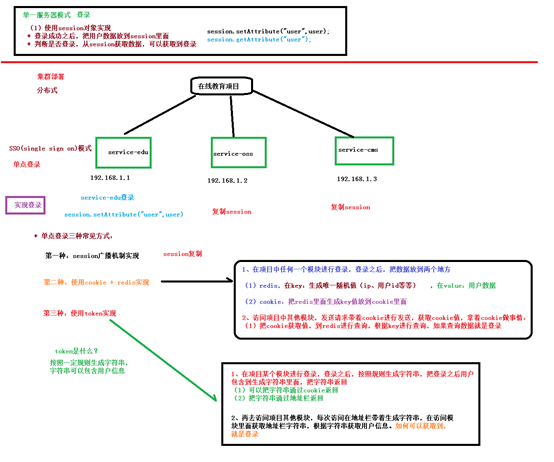
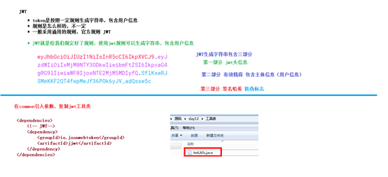
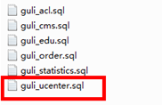
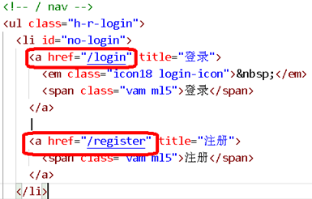
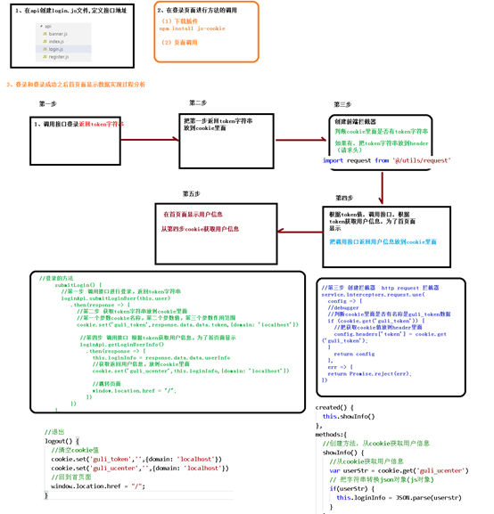

# Day12-登录业务

# 登录业务介绍（单点登录）



# Jwt介绍



# 整合JWT令牌

## 1、在common_utils模块中添加jwt工具依赖

在pom中添加

```xml
<dependencies>
    <!-- JWT -->
    <dependency>
        <groupId>io.jsonwebtoken</groupId>
        <artifactId>jjwt</artifactId>
    </dependency>
</dependencies>
```

## 创建JWT工具类

```java
public class JwtUtils {

    // 常量
    public static final long EXPIRE = 1000 * 60 * 60 * 24;     // token过期时间
    public static final String APP_SECRET = "ukc8BDbRigUDaY6pZFfWus2jZWLPHO";   // 秘钥

    // 生成token字符串的方法
    public static String getJwtToken(String id, String nickname){

        String JwtToken = Jwts.builder()
                // 头信息
                .setHeaderParam("typ", "JWT")
                .setHeaderParam("alg", "HS256")

                .setSubject("guli-user")
                .setIssuedAt(new Date())
                .setExpiration(new Date(System.currentTimeMillis() + EXPIRE))

                .claim("id", id)    // 设置token主体部分，存储用户信息
                .claim("nickname", nickname)
                .signWith(SignatureAlgorithm.HS256, APP_SECRET)
                .compact();
        return JwtToken;
    }

    /**
     * 判断token是否存在与有效
     * @param jwtToken
     * @return
     */
    public static boolean checkToken(String jwtToken) {
        if(StringUtils.isEmpty(jwtToken)) return false;
        try {
            Jwts.parser().setSigningKey(APP_SECRET).parseClaimsJws(jwtToken);
        } catch (Exception e) {
            e.printStackTrace();
            return false;
        }
        return true;
    }

    /**
     * 判断token是否存在与有效
     * @param request
     * @return
     */
    public static boolean checkToken(HttpServletRequest request) {
        try {
            String jwtToken = request.getHeader("token");
            if(StringUtils.isEmpty(jwtToken)) return false;
            Jwts.parser().setSigningKey(APP_SECRET).parseClaimsJws(jwtToken);
        } catch (Exception e) {
            e.printStackTrace();
            return false;
        }
        return true;
    }

    /**
     * 根据token获取会员id
     * @param request
     * @return
     */
    public static String getMemberIdByJwtToken(HttpServletRequest request) {
        String jwtToken = request.getHeader("token");
        if(StringUtils.isEmpty(jwtToken)) return "";
        Jws<Claims> claimsJws = Jwts.parser().setSigningKey(APP_SECRET).parseClaimsJws(jwtToken);
        Claims claims = claimsJws.getBody();
        return (String)claims.get("id");
    }

}
```


# 整合阿里云短信

## 新建短信微服务

1、在service模块下创建子模块service-msm

2、创建controller和service代码

3、配置application.properties

```properties
# 服务端口
server.port=8005

# 服务名
spring.application.name=service-msm

# mysql数据库连接
spring.datasource.driver-class-name=com.mysql.cj.jdbc.Driver
spring.datasource.url=jdbc:mysql://localhost:3306/guli?serverTimezone=GMT%2B8
spring.datasource.username=root
spring.datasource.password=root

# redis
spring.redis.host=192.168.242.3
spring.redis.password=123456
spring.redis.port=6379
spring.redis.database= 0
spring.redis.timeout=1800000
spring.redis.lettuce.pool.max-active=20
spring.redis.lettuce.pool.max-wait=-1

#最大阻塞等待时间(负数表示没限制)
spring.redis.lettuce.pool.max-idle=5
spring.redis.lettuce.pool.min-idle=0

#最小空闲
#返回json的全局时间格式
spring.jackson.date-format=yyyy-MM-dd HH:mm:ss
spring.jackson.time-zone=GMT+8

#配置mapper xml文件的路径
mybatis-plus.mapper-locations=classpath:com/atguigu/edumsm/mapper/xml/*.xml

#mybatis日志
mybatis-plus.configuration.log-impl=org.apache.ibatis.logging.stdout.StdOutImpl
```

4、创建启动类

创建MsmApplication.java

```java
@ComponentScan({"com.atguigu"})
@SpringBootApplication(exclude = DataSourceAutoConfiguration.class)     // 去掉数据库自动装配
public class MsmApplication {

    public static void main(String[] args) {
        SpringApplication.run(MsmApplication.class,args);
    }

}
```

## 编写发送短信接口

1、在service-msm的pom中引入依赖

```xml
<dependencies>
    <dependency>
        <groupId>com.alibaba</groupId>
        <artifactId>fastjson</artifactId>
    </dependency>
    <dependency>
        <groupId>com.aliyun</groupId>
        <artifactId>aliyun-java-sdk-core</artifactId>
    </dependency>
</dependencies>
```

2、编写controller，根据手机号发送短信

```java
@RestController
@RequestMapping("/edumsm/msm")
@CrossOrigin
public class MsmController {

    @Autowired
    private MsmService msmService;

    @Autowired
    private RedisTemplate<String,String> redisTemplate;

    // 发送验证码
    @GetMapping(value = "send/{phone}")
    public R code(@PathVariable String phone) {

        // 1.先从redis中查询，如果查询出来就发送
        String code = redisTemplate.opsForValue().get(phone);
        if (!StringUtils.isEmpty(code)){
            return R.ok();
        }

        // 2.查询不出来，在发送阿里云短信
        // 随机生成验证码
        code = RandomUtil.getFourBitRandom();

        Map<String,Object> param = new HashMap<>();

        param.put("code", code);
        boolean isSend = msmService.send(phone, param);
        if(isSend) {
            redisTemplate.opsForValue().set(phone,code,5,TimeUnit.MINUTES);
            return R.ok();
        } else {
            return R.error().message("发送短信失败");
        }
    }
}
```

3、编写service

```java
@Service
public class MsmServiceImpl implements MsmService {

    // 发送验证码
    @Override
    public boolean send(String phone, Map<String, Object> param) {
        if(StringUtils.isEmpty(phone)) return false;
        DefaultProfile profile =
                DefaultProfile.getProfile("default", "LTAIq6nIPY09VROj", "FQ7UcixT9wEqMv9F35nORPqKr8XkTF");
        IAcsClient client = new DefaultAcsClient(profile);
        CommonRequest request = new CommonRequest();
        //request.setProtocol(ProtocolType.HTTPS);
        request.setMethod(MethodType.POST);

        request.setDomain("dysmsapi.aliyuncs.com");
        request.setVersion("2017-05-25");
        request.setAction("SendSms");

        request.putQueryParameter("PhoneNumbers", phone);
        request.putQueryParameter("SignName", "我的谷粒在线教育网站");
        request.putQueryParameter("TemplateCode", "SMS_180051135");
        request.putQueryParameter("TemplateParam", JSONObject.toJSONString(param));

        try {
            CommonResponse response = client.getCommonResponse(request);
            System.out.println(response.getData());
            return response.getHttpResponse().isSuccess();
        } catch (Exception e) {
            e.printStackTrace();
        }
        return false;
    }
}
```


## 云市场的短信验证码接收

这里我使用的是阿里云的云市场的，不用阿里云的短信服务

Controller

```java
// 用阿里云的云市场短信服务
@GetMapping("sendByPhone/{phone}")
public R sendByPhone(@PathVariable String phone){

    // 1.先从redis中取验证码
    String code = redisTemplate.opsForValue().get(phone);
    if (!StringUtils.isEmpty(code)){
        return R.ok();
    }

    code = RandomUtil.getFourBitRandom();

    // 2.如果redis没有，再发送短信
    boolean isSend = msmService.sendCodeByPhone(phone,code);

    if (isSend){
        redisTemplate.opsForValue().set(phone,code,5,TimeUnit.MINUTES);
        return R.ok();
    } else {
        return R.error().message("发送验证码失败");
    }

}
```

serviceImpl

```java
// 用阿里云的云市场短信服务
@Override
public boolean sendCodeByPhone(String phone, String code) {

    if(StringUtils.isEmpty(phone)) return false;

    String host = "https://gyytz.market.alicloudapi.com";
    String path = "/sms/smsSend";
    String method = "POST";
    String appcode = "9……………2";

    Map<String, String> headers = new HashMap<String, String>();

    //最后在header中的格式(中间是英文空格)为Authorization:APPCODE 83359fd73fe94948385f570e3c139105
    headers.put("Authorization", "APPCODE " + appcode);

    Map<String, String> querys = new HashMap<String, String>();

    querys.put("mobile", phone);
    querys.put("param", "**code**:"+code+",**minute**:5");
    querys.put("smsSignId", "2e65b1bb3d054466b82f0c9d125465e2");
    querys.put("templateId", "908e94ccf08b4476ba6c876d13f084ad");
    Map<String, String> bodys = new HashMap<String, String>();


    try {
        /**
         * 重要提示如下:
         * HttpUtils请从
         * https://github.com/aliyun/api-gateway-demo-sign-java/blob/master/src/main/java/com/aliyun/api/gateway/demo/util/HttpUtils.java
         * 下载
         *
         * 相应的依赖请参照
         * https://github.com/aliyun/api-gateway-demo-sign-java/blob/master/pom.xml
         */
        HttpResponse response = HttpUtils.doPost(host, path, method, headers, querys, bodys);
        System.out.println(response.toString());
        //获取response的body
        //System.out.println(EntityUtils.toString(response.getEntity()));
        return true;
    } catch (Exception e) {
        e.printStackTrace();
        return false;
    }

}
```


# 登录功能接口

## 新建用户微服务

### 1、在service模块下创建子模块service-ucenter

### 2、使用代码生成器生成代码

（1）创建ucenter_member表



生成代码

### 3、配置application.properties

```properties
# 服务端口
server.port=8006

# 服务名
spring.application.name=service-ucenter

# mysql数据库连接
spring.datasource.driver-class-name=com.mysql.cj.jdbc.Driver
spring.datasource.url=jdbc:mysql://localhost:3306/guli?serverTimezone=GMT%2B8
spring.datasource.username=root
spring.datasource.password=root

spring.redis.host=192.168.242.3
spring.redis.password=123456
spring.redis.port=6379
spring.redis.database= 0
spring.redis.timeout=1800000
spring.redis.lettuce.pool.max-active=20
spring.redis.lettuce.pool.max-wait=-1

#最大阻塞等待时间(负数表示没限制)
spring.redis.lettuce.pool.max-idle=5
spring.redis.lettuce.pool.min-idle=0

#最小空闲
#返回json的全局时间格式
spring.jackson.date-format=yyyy-MM-dd HH:mm:ss
spring.jackson.time-zone=GMT+8

#配置mapper xml文件的路径
mybatis-plus.mapper-locations=classpath:com/atguigu/educenter/mapper/xml/*.xml

#mybatis日志
mybatis-plus.configuration.log-impl=org.apache.ibatis.logging.stdout.StdOutImpl
```


### 创建启动类

创建ServiceUcApplication.java

```java
@SpringBootApplication
@ComponentScan({"com.atguigu"})     // 整合swagger
@MapperScan("com.atguigu.educenter.mapper") // 扫描mapper
public class UcenterApplication {

    public static void main(String[] args) {
        SpringApplication.run(UcenterApplication.class,args);
    }

}
```


## 创建登录接口

### Controller

```java
@RestController
@RequestMapping("/educenter/member")
@CrossOrigin
public class UcenterMemberController {

    @Autowired
    private UcenterMemberService memberService;

    // 登录
    @GetMapping("login")
    public R login(@RequestBody UcenterMember member){
        String token = memberService.login(member);
// 返回token，用jwt生成

        return R.ok().data("token",token);
    }

    // 注册


}
```

### ServiceImpl

```java
@Service
public class UcenterMemberServiceImpl extends ServiceImpl<UcenterMemberMapper, UcenterMember> implements UcenterMemberService {

    // 登录
@Override
public String login(UcenterMember member) {
    // 获取传过来的手机号码和密码
    String mobile = member.getMobile();
    String password = member.getPassword();

    // 判断手机号码是否为空
    if (StringUtils.isEmpty(mobile)){
        throw new GuliException(20001,"登录失败");
    }
    // 判断密码是否为空
    if (StringUtils.isEmpty(password)){
        throw new GuliException(20001,"登录失败");
    }

    // 根据手机号码从数据库中查询对象
    QueryWrapper<UcenterMember> wrapper = new QueryWrapper<>();
    wrapper.eq("mobile",mobile);
    UcenterMember mobileMember = baseMapper.selectOne(wrapper);

    // 如果查出来的对象为空
    if (mobileMember == null){
        throw new GuliException(20001,"登录失败");
    }
    // 判断传进来的密码和数据库查出来的是否一致
    // 先将传进来的密码加密，再和数据库的比较
    if (!MD5.encrypt(password).equals(mobileMember.getPassword())){
        throw new GuliException(20001,"登录失败");
    }

    // 判断是否被禁用
    if (mobileMember.getIsDisabled()){
        throw new GuliException(20001,"登录失败");
    }

    // 如果上面的校验都过了，说明可以登录,利用jwt工具生成token，并放回
    String jwtToken = JwtUtils.getJwtToken(mobileMember.getId(), mobileMember.getNickname());

    return jwtToken;
}

}
```


### MD5

```java
import java.security.MessageDigest;
import java.security.NoSuchAlgorithmException;


public final class MD5 {

    public static String encrypt(String strSrc) {
        try {
            char hexChars[] = { '0', '1', '2', '3', '4', '5', '6', '7', '8',
                    '9', 'a', 'b', 'c', 'd', 'e', 'f' };
            byte[] bytes = strSrc.getBytes();
            MessageDigest md = MessageDigest.getInstance("MD5");
            md.update(bytes);
            bytes = md.digest();
            int j = bytes.length;
            char[] chars = new char[j * 2];
            int k = 0;
            for (int i = 0; i < bytes.length; i++) {
                byte b = bytes[i];
                chars[k++] = hexChars[b >>> 4 & 0xf];
                chars[k++] = hexChars[b & 0xf];
            }
            return new String(chars);
        } catch (NoSuchAlgorithmException e) {
            e.printStackTrace();
            throw new RuntimeException("MD5加密出错！！+" + e);
        }
    }


}
```


### 测试

出现异常

```bash
org.springframework.http.converter.HttpMessageNotReadableException: Required request body is missing: public com.atguigu.commonutils.R com.atguigu.educenter.controller.UcenterMemberController.login(com.atguigu.educenter.entity.UcenterMember)
```

经过排查，发现是controller的注解写错，把@GetMapping改成@PostMapping即可


## 创建注册接口

### RegisterVo

```java
@Data
public class RegisterVo {

   @ApiModelProperty(value = "昵称")
   private String nickname;

   @ApiModelProperty(value = "手机号")
   private String mobile;

   @ApiModelProperty(value = "密码")
   private String password;

   @ApiModelProperty(value = "验证码")
    private String code;
   
}
```

### Controller

```java
// 注册
@PostMapping("register")
public R registerUser(@RequestBody RegisterVo registerVo){
    memberService.register(registerVo);
    return R.ok();
}
```

### serviceImpl

```java
// 注册
@Override
public void register(RegisterVo registerVo) {
    // 获取注册信息
    String nickname = registerVo.getNickname();
    String mobile = registerVo.getMobile();
    String password = registerVo.getPassword();
    String code = registerVo.getCode();

    // 判断非空
    if (StringUtils.isEmpty(nickname) || StringUtils.isEmpty(mobile)
            || StringUtils.isEmpty(password) || StringUtils.isEmpty(code)){
        throw new GuliException(20001,"注册失败，注册信息不能为空");
    }

    // 判断验证码，从redis中取出来
    String mobileCode = redisTemplate.opsForValue().get(mobile);
    if (!code.equals(mobileCode)){
        throw new GuliException(20001,"注册失败，验证码错误");
    }
    // 判断手机号码时候已经在数据库中
    QueryWrapper<UcenterMember> wrapper = new QueryWrapper<>();
    wrapper.eq("mobile",mobile);
    Integer count = baseMapper.selectCount(wrapper);

    if (count > 0){
        // 如果大于0，说明数据库中已经存在
        throw new GuliException(20001,"注册失败，手机号已经存在");
    }

    // 将注册对象添加到数据库中
    UcenterMember ucenterMember = new UcenterMember();
    ucenterMember.setNickname(registerVo.getNickname());
    ucenterMember.setMobile(registerVo.getMobile());
    ucenterMember.setPassword(MD5.encrypt(registerVo.getPassword()));
    ucenterMember.setIsDisabled(false);     // 是否被禁用
    ucenterMember.setAvatar("http://thirdwx.qlogo.cn/mmopen/vi_32/Q0j4TwGTfTKxCqRzuYWQmpwiaqQEjNxbC7WicebicXQusU306jgmfoOzUcFg1qaDq5BStiblwBjw5dUOblQ2gUicQOQ/132");

    baseMapper.insert(ucenterMember);

}
```


测试，先往redis中存验证码，再用swagger测试。

 

## 根据token获取用户信息接口

Controller

```java
// 根据token获取用户信息
@GetMapping("getMemberInfo")
public R getMemberInfo(HttpServletRequest request){
    // 根据token获取用户信息
    String memberId = JwtUtils.getMemberIdByJwtToken(request);

    // 根据id查询用户对象
    UcenterMember member = memberService.getById(memberId);
    return R.ok().data("userInfo",member);
}
```


# 整合登录和注册页面

## 一、在nuxt环境中安装插件

### 1、安装element-ui 和 vue-qriously

（1）执行命令安装

npm install element-ui

npm install vue-qriously

 

### 2、修改配置文件 nuxt-swiper-plugin.js，使用插件

nuxt-swiper-plugin.js

```js
import Vue from 'vue'
import VueAwesomeSwiper from 'vue-awesome-swiper/dist/ssr'
import VueQriously from 'vue-qriously'
import ElementUI from 'element-ui' //element-ui的全部组件
import 'element-ui/lib/theme-chalk/index.css'//element-ui的css
Vue.use(ElementUI) //使用elementUI
Vue.use(VueQriously)
Vue.use(VueAwesomeSwiper)
```

## 二、用户注册功能前端整合

### 1、在api文件夹中创建注册的js文件，定义接口

**register.js**

```js
import request from '@/utils/request'
export default {
    // 根据手机号码发送验证码
  getCode(mobile) {
    return request({
      url: `/edumsm/msm/sendByPhone/${mobile}`,
      method: 'get'
    })
  },
  // 注册
  registerMember(formItem){
    return request({
      url: `/educenter/member/register`,
      method: 'post',
      data:formItem
    })
  }
}
```

### 2、在pages文件夹中创建注册页面，调用方法

**（1）在layouts创建布局页面**

**sign.vue**

```vue
<template>
  <div class="sign">
    <!--标题-->
    <div class="logo">
      
    </div>
    <!--表单-->
    <nuxt/>
  </div>
</template>
```

**（2）创建注册页面**

**修改layouts文件夹里面default.vue页面，修改登录和注册超链接地址**



**在pages文件夹下，创建注册和登录页面**

**register.vue**

```vue
<template>
   <div class="main">
     <div class="title">
       <a href="/login">登录</a>
       <span>·</span>
       <a class="active" href="/register">注册</a>
     </div>
     <div class="sign-up-container">
       <el-form ref="userForm" :model="params">
         <el-form-item class="input-prepend restyle" prop="nickname" :rules="[{ required: true, message: '请输入你的昵称', trigger: 'blur' }]">
           <div>
             <el-input type="text" placeholder="你的昵称" v-model="params.nickname"/>
             <i class="iconfont icon-user"/>
           </div>
         </el-form-item>
         <el-form-item class="input-prepend restyle no-radius" prop="mobile" :rules="[{ required: true, message: '请输入手机号码', trigger: 'blur' },{validator: checkPhone, trigger: 'blur'}]">
           <div>
             <el-input type="text" placeholder="手机号" v-model="params.mobile"/>
             <i class="iconfont icon-phone"/>
           </div>
         </el-form-item>
         <el-form-item class="input-prepend restyle no-radius" prop="code" :rules="[{ required: true, message: '请输入验证码', trigger: 'blur' }]">
           <div style="width: 100%;display: block;float: left;position: relative">
             <el-input type="text" placeholder="验证码" v-model="params.code"/>
             <i class="iconfont icon-phone"/>
           </div>
           <div class="btn" style="position:absolute;right: 0;top: 6px;width: 40%;">
             <a href="javascript:" type="button" @click="getCodeFun()" :value="codeTest" style="border: none;background-color: none">{{codeTest}}</a>
           </div>
         </el-form-item>
         <el-form-item class="input-prepend" prop="password" :rules="[{ required: true, message: '请输入密码', trigger: 'blur' }]">
           <div>
             <el-input type="password" placeholder="设置密码" v-model="params.password"/>
             <i class="iconfont icon-password"/>
           </div>
         </el-form-item>
         <div class="btn">
           <input type="button" class="sign-up-button" value="注册" @click="submitRegister()">
         </div>
         <p class="sign-up-msg">
           点击 “注册” 即表示您同意并愿意遵守简书
           <br>
           <a target="_blank" href="http://www.jianshu.com/p/c44d171298ce">用户协议</a>
           和
           <a target="_blank" href="http://www.jianshu.com/p/2ov8x3">隐私政策</a> 。
         </p>
       </el-form>
       <!-- 更多注册方式 -->
       <div class="more-sign">
         <h6>社交帐号直接注册</h6>
         <ul>
           <li><a id="weixin" class="weixin" target="_blank" href="http://huaan.free.idcfengye.com/api/ucenter/wx/login"><i
             class="iconfont icon-weixin"/></a></li>
           <li><a id="qq" class="qq" target="_blank" href="#"><i class="iconfont icon-qq"/></a></li>
         </ul>
       </div>
     </div>
   </div>
 </template>
 <script>
   import '~/assets/css/sign.css'
   import '~/assets/css/iconfont.css'
   import registerApi from '@/api/register'
   export default {
     layout: 'sign',
     data() {
       return {
         params: {
           mobile: '',
           code: '',
           nickname: '',
           password: ''
         },
         sending: true,      //是否发送验证码
         second: 60,        //倒计时间
         codeTest: '获取验证码'
       }
     },
     methods: {
       // 获取验证码
       getCodeFun(){
         registerApi.getCode(this.params.mobile)
          .then(response =>{
            this.sending = false
            // 倒计时
            this.timeDown()
          })
       },

      // 倒计时
      timeDown() {
        let result = setInterval(() => {
          --this.second;
          this.codeTest = this.second
          if (this.second < 1) {
            clearInterval(result);
            this.sending = true;
            //this.disabled = false;
            this.second = 60;
            this.codeTest = "获取验证码"
          }
        }, 1000);

      },
       // 注册
       submitRegister(){
         registerApi.registerMember(this.params)
          .then(response =>{
            //提示注册成功
              this.$message({
                type: 'success',
                message: "注册成功"
              })
              
            // 跳转至登录页面
            this.$router.push({path:'/login'})
          })
       },
       
       checkPhone (rule, value, callback) {
         //debugger
         if (!(/^1[34578]\d{9}$/.test(value))) {
           return callback(new Error('手机号码格式不正确'))
         }
         return callback()
       }
     }
   }
</script>
```


## 三、用户登录功能前端整合

登录功能流程分析：

1、 点击登录，调用接口返回登录的token信息

2、 将返回的token存放到cookie中

3、 创建拦截器，判断cookie中是否有token，如果有就将token设置到请求头header中

4、 根据token调用接口，返回用户信息

5、 根据返回的用户信息，在页面显示对应的数据



### 1、在api文件夹中创建登录的js文件，定义接口

**login.js**

```js
import request from '@/utils/request'
export default {
    // 登录
  submitLoginUser(userInfo) {
    return request({
      url: `/educenter/member/login`,
      method: 'post',
      data:userInfo
    })
  },
  // 根据token获取用户信息
  getUserInfo(){
    return request({
      url: `/educenter/member/getMemberInfo`,
      method: 'get'
    })
  }
}
```

### 2、在pages文件夹中创建登录页面，调用方法

（1）安装js-cookie插件

npm install js-cookie

（2）login.vue

```vue
<template>
   <div class="main">
     <div class="title">
       <a class="active" href="/login">登录</a>
       <span>·</span>
       <a href="/register">注册</a>
     </div>
     <div class="sign-up-container">
       <el-form ref="userForm" :model="user">
         <el-form-item class="input-prepend restyle" prop="mobile" :rules="[{ required: true, message: '请输入手机号码', trigger: 'blur' },{validator: checkPhone, trigger: 'blur'}]">
           <div >
             <el-input type="text" placeholder="手机号" v-model="user.mobile"/>
             <i class="iconfont icon-phone" />
           </div>
         </el-form-item>
         <el-form-item class="input-prepend" prop="password" :rules="[{ required: true, message: '请输入密码', trigger: 'blur' }]">
           <div>
             <el-input type="password" placeholder="密码" v-model="user.password"/>
             <i class="iconfont icon-password"/>
           </div>
         </el-form-item>
         <div class="btn">
           <input type="button" class="sign-in-button" value="登录" @click="submitLogin()">
         </div>
       </el-form>
       <!-- 更多登录方式 -->
       <div class="more-sign">
         <h6>社交帐号登录</h6>
         <ul>
           <li><a id="weixin" class="weixin" target="_blank" href="http://qy.free.idcfengye.com/api/ucenter/weixinLogin/login"><i class="iconfont icon-weixin"/></a></li>
           <li><a id="qq" class="qq" target="_blank" href="#"><i class="iconfont icon-qq"/></a></li>
         </ul>
       </div>
     </div>
   </div>
 </template>
 <script>
   import '~/assets/css/sign.css'
   import '~/assets/css/iconfont.css'

   import cookie from 'js-cookie'
   import loginApi from '@/api/login'
   export default {
     layout: 'sign',
     data () {
       return {
         user:{
           mobile:'',
           password:''
         },
         loginInfo:{}
       }
     },
     methods: {
       // 登录
       submitLogin(){
         // 第一步调用接口获取登录token值
         loginApi.submitLoginUser(this.user)
          .then(response =>{
            // 第二步，将获取到的token值放到cookie中
            cookie.set('guli_token',response.data.data.token,{ domain: 'localhost' })

            // 第四步，根据token的值，调用接口，获取用户数据，并存入cookie中
            loginApi.getUserInfo()
              .then(response =>{
                this.loginInfo = response.data.data.userInfo
                // 将得到的用户信息存入cookie中
                cookie.set("guli_ucenter",JSON.stringify(this.loginInfo),{ domain: 'localhost' })
                // 跳转页面
                window.location.href = "/"
              })
          })
          
       },
       checkPhone (rule, value, callback) {
         //debugger
         if (!(/^1[34578]\d{9}$/.test(value))) {
           return callback(new Error('手机号码格式不正确'))
         }
         return callback()
       }
     }
   }
 </script>

<style>

   .el-form-item__error{

    z-index: 9999999;

  }

</style>
```


### 3、在request.js添加拦截器，用于传递token信息

```js

import axios from 'axios'
import cookie from 'js-cookie'
import { MessageBox, Message } from 'element-ui'
// 创建axios实例
const service = axios.create({
  baseURL: 'http://localhost:9001', // api的base_url
  timeout: 20000 // 请求超时时间
})

// 第三步，编写一个拦截器
// http request 拦截器
service.interceptors.request.use(
  config => {
  //debugger
  if (cookie.get('guli_token')) {
    // 将token的值存入到请求头中
    config.headers['token'] = cookie.get('guli_token');
  }
    return config
  },
  err => {
  return Promise.reject(err);
})

// http response 拦截器
service.interceptors.response.use(
  response => {
    //debugger
    if (response.data.code == 28004) {
        console.log("response.data.resultCode是28004")
        // 返回 错误代码-1 清除ticket信息并跳转到登录页面
        //debugger
        window.location.href="/login"
        return
    }else{
      if (response.data.code !== 20000) {
        //25000：订单支付中，不做任何提示
        if(response.data.code != 25000) {
          Message({
            message: response.data.message || 'error',
            type: 'error',
            duration: 5 * 1000
          })
        }
      } else {
        return response;
      }
    }
  },
  error => {
    return Promise.reject(error.response)   // 返回接口返回的错误信息
});

export default service
```


### 4、修改layouts中的default.vue页面

（1）显示登录之后的用户信息

```vue
<script>
 import "~/assets/css/reset.css";
 import "~/assets/css/theme.css";
 import "~/assets/css/global.css";
 import "~/assets/css/web.css";
   import cookie from 'js-cookie'
   import loginApi from '@/api/login'
 export default {
   data(){
     return{
      token: '',
      loginInfo: {
        id: '',
        age: '',
        avatar: '',
        mobile: '',
        nickname: '',
        sex: ''
      }
     }
   },
   created(){
    this.showUserInfo()
   },
   methods:{
     // 显示用户信息，从cookie中取出用户信息
     showUserInfo(){
       loginApi.getUserInfo()
       .then(response =>{
         // 第五步，从cookie中取出用户信息，取出来的是字符串
          var userStr = cookie.get("guli_ucenter")
          // 判断取出来的字符串是有为空
          if(userStr){
          // 将取出来的字符串转为json，并赋值给loginInfo
          this.loginInfo = JSON.parse(userStr)
          }

       })
     }
   }
 };
 </script>
```


（2）default.vue页面显示登录之后的用户信息

```vue
<!-- / nav -->
          <ul class="h-r-login">
              <li v-if="!loginInfo.id" id="no-login">
                  <a href="/login" title="登录">
                      <em class="icon18 login-icon">&nbsp;</em>
                      <span class="vam ml5">登录</span>
                  </a>
                  |
                  <a href="/register" title="注册">
                      <span class="vam ml5">注册</span>
                  </a>
              </li>
              <li v-if="loginInfo.id" id="is-login-one" class="mr10">
                  <a id="headerMsgCountId" href="#" title="消息">
                      <em class="icon18 news-icon">&nbsp;</em>
                  </a>
                  <q class="red-point" style="display: none">&nbsp;</q>
              </li>
              <li v-if="loginInfo.id" id="is-login-two" class="h-r-user">
                  <a href="/ucenter" title>
                      
                      <span id="userName" class="vam disIb">{{ loginInfo.nickname }}</span>
                  </a>
                  <a href="javascript:void(0);" title="退出" @click="logout()" class="ml5">退出</a>
              </li>
              <!-- /未登录显示第1 li；登录后显示第2，3 li -->
          </ul>
```


## 退出登录

methods

```vue
     // 退出登录
     logout(){
       cookie.set('guli_token','',{ domain: 'localhost' })
       cookie.set("guli_ucenter",'',{ domain: 'localhost' })

       // 跳转页面
       window.location.href = "/"
     }
```

