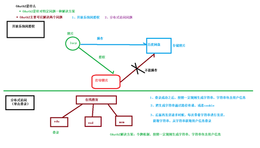
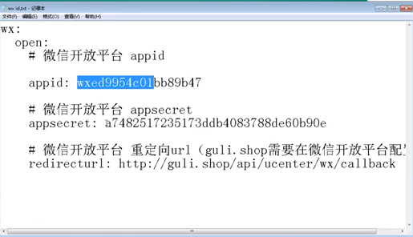
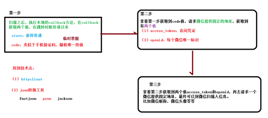
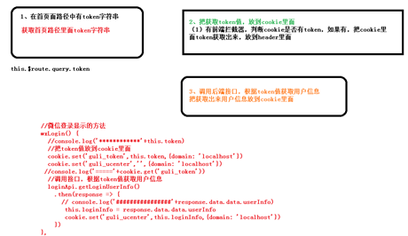

# Day13-微信登录

# OAuth2介绍

OAuth2解决方案:令牌机制，按照一定规则生成字符串，字符串包含用户信息



# 微信扫描登录-生成授权url（生成二维码）

## 后端开发

### 1、添加配置

application.properties添加相关配置信息

```properties
# 微信开放平台 appid
wx.open.app_id=wxed9954c01bb89b47
# 微信开放平台 appsecret
wx.open.app_secret=a7482517235173ddb4083788de60b90e
# 微信开放平台 重定向url
wx.open.redirect_url=http://localhost:8160/api/ucenter/wx/callback
```



### 2、创建常量类

创建util包，创建ConstantPropertiesUtil.java常量类

```java
@Component
public class ConstantWxUtil implements InitializingBean {

    @Value("${wx.open.app_id}")
    private String appId;

    @Value("${wx.open.app_secret}")
    private String appSecret;

    @Value("${wx.open.redirect_url}")
    private String redirectUrl;

    public static String WX_OPEN_APP_ID;
    public static String WX_OPEN_APP_SECRET;
    public static String WX_OPEN_REDIRECT_URL;

    @Override
    public void afterPropertiesSet() throws Exception {
        WX_OPEN_APP_ID = appId;
        WX_OPEN_APP_SECRET = appSecret;
        WX_OPEN_REDIRECT_URL = redirectUrl;
    }
}
```

### 3、创建controller

guli-microservice-ucenter微服务中创建api包

api包中创建WxApiController

```java
@CrossOrigin
@Controller // 这里不需要返回数据，所以用controller
@RequestMapping("/api/ucenter/wx")
public class WxApiController {

    @GetMapping("login")
    public String getWxCode(){
        // 微信开放平台授权baseUrl
        String baseUrl = "https://open.weixin.qq.com/connect/qrconnect" +
        "?appid=%s" +
        "&redirect_uri=%s" +
        "&response_type=code" +
        "&scope=snsapi_login" +
        "&state=%s" +
        "#wechat_redirect";

        // redirect_url需要转码
        String redirectUrl = ConstantWxUtil.WX_OPEN_REDIRECT_URL;
        try {
            redirectUrl = URLEncoder.encode(redirectUrl, "utf-8");
        } catch (Exception e) {
            e.printStackTrace();
        }

        // 生成url
        String url = String.format(
                baseUrl,
                ConstantWxUtil.WX_OPEN_APP_ID,
                redirectUrl,
                "atguigu"
        );

        return "redirect:"+url;
    }

}
```


### 测试：

访问：http://localhost:8006/api/ucenter/wx/login 

发现错误

```
redirect_uri 参数错误
```

解决方案

```
微信扫码失效的，使用新的，首先将模块启动端口改成8160（一定得是这个，其他的没用），其次将redirect_url 改为：http://localhost:8160/api/ucenter/wx/callback，还需要将Nginx的配置改成对应的url
```


# 微信扫描登录-开发回调url（获取扫描人的信息）

扫描之后获取扫描人信息流程分析



## 一、准备工作

### 1、全局配置的跳转路径

```properties
# 微信开放平台 重定向url
wx.open.redirect_url=http://localhost:8160/api/ucenter/wx/callback
```

### 2、修改当前项目启动端口号为8160

### 3、测试回调是否可用

在WxApiController中添加方法

```java
@GetMapping("callback")
public String callback(String code, String state, HttpSession session) {
   //得到授权临时票据code
   System.out.println("code = " + code);
   System.out.println("state = " + state);
}
```

## 二、后台开发

### 1、添加依赖

```xml
<dependencies>
    <!--httpclient-->
    <dependency>
        <groupId>org.apache.httpcomponents</groupId>
        <artifactId>httpclient</artifactId>
    </dependency>
    <!--commons-io-->
    <dependency>
        <groupId>commons-io</groupId>
        <artifactId>commons-io</artifactId>
    </dependency>
    <!--gson-->
    <dependency>
        <groupId>com.google.code.gson</groupId>
        <artifactId>gson</artifactId>
    </dependency>
</dependencies>
```

### 2、创建httpclient工具类

放入util包

```java
package com.atguigu.educenter.utils;

import org.apache.commons.io.IOUtils;
import org.apache.commons.lang.StringUtils;
import org.apache.http.Consts;
import org.apache.http.HttpEntity;
import org.apache.http.HttpResponse;
import org.apache.http.NameValuePair;
import org.apache.http.client.HttpClient;
import org.apache.http.client.config.RequestConfig;
import org.apache.http.client.config.RequestConfig.Builder;
import org.apache.http.client.entity.UrlEncodedFormEntity;
import org.apache.http.client.methods.HttpGet;
import org.apache.http.client.methods.HttpPost;
import org.apache.http.conn.ConnectTimeoutException;
import org.apache.http.conn.ssl.SSLConnectionSocketFactory;
import org.apache.http.conn.ssl.SSLContextBuilder;
import org.apache.http.conn.ssl.TrustStrategy;
import org.apache.http.conn.ssl.X509HostnameVerifier;
import org.apache.http.entity.ContentType;
import org.apache.http.entity.StringEntity;
import org.apache.http.impl.client.CloseableHttpClient;
import org.apache.http.impl.client.HttpClients;
import org.apache.http.impl.conn.PoolingHttpClientConnectionManager;
import org.apache.http.message.BasicNameValuePair;

import javax.net.ssl.SSLContext;
import javax.net.ssl.SSLException;
import javax.net.ssl.SSLSession;
import javax.net.ssl.SSLSocket;
import java.io.IOException;
import java.net.SocketTimeoutException;
import java.security.GeneralSecurityException;
import java.security.cert.CertificateException;
import java.security.cert.X509Certificate;
import java.util.ArrayList;
import java.util.List;
import java.util.Map;
import java.util.Map.Entry;
import java.util.Set;

/**
 *  依赖的jar包有：commons-lang-2.6.jar、httpclient-4.3.2.jar、httpcore-4.3.1.jar、commons-io-2.4.jar
 * @author zhaoyb
 *
 */
public class HttpClientUtils {

    public static final int connTimeout=10000;
    public static final int readTimeout=10000;
    public static final String charset="UTF-8";
    private static HttpClient client = null;

    static {
        PoolingHttpClientConnectionManager cm = new PoolingHttpClientConnectionManager();
        cm.setMaxTotal(128);
        cm.setDefaultMaxPerRoute(128);
        client = HttpClients.custom().setConnectionManager(cm).build();
    }

    public static String postParameters(String url, String parameterStr) throws ConnectTimeoutException, SocketTimeoutException, Exception{
        return post(url,parameterStr,"application/x-www-form-urlencoded",charset,connTimeout,readTimeout);
    }

    public static String postParameters(String url, String parameterStr,String charset, Integer connTimeout, Integer readTimeout) throws ConnectTimeoutException, SocketTimeoutException, Exception{
        return post(url,parameterStr,"application/x-www-form-urlencoded",charset,connTimeout,readTimeout);
    }

    public static String postParameters(String url, Map<String, String> params) throws ConnectTimeoutException,
            SocketTimeoutException, Exception {
        return postForm(url, params, null, connTimeout, readTimeout);
    }

    public static String postParameters(String url, Map<String, String> params, Integer connTimeout,Integer readTimeout) throws ConnectTimeoutException,
            SocketTimeoutException, Exception {
        return postForm(url, params, null, connTimeout, readTimeout);
    }

    public static String get(String url) throws Exception {
        return get(url, charset, null, null);
    }

    public static String get(String url, String charset) throws Exception {
        return get(url, charset, connTimeout, readTimeout);
    }

    /**
     * 发送一个 Post 请求, 使用指定的字符集编码.
     *
     * @param url
     * @param body RequestBody
     * @param mimeType 例如 application/xml "application/x-www-form-urlencoded" a=1&b=2&c=3
     * @param charset 编码
     * @param connTimeout 建立链接超时时间,毫秒.
     * @param readTimeout 响应超时时间,毫秒.
     * @return ResponseBody, 使用指定的字符集编码.
     * @throws ConnectTimeoutException 建立链接超时异常
     * @throws SocketTimeoutException  响应超时
     * @throws Exception
     */
    public static String post(String url, String body, String mimeType,String charset, Integer connTimeout, Integer readTimeout)
            throws ConnectTimeoutException, SocketTimeoutException, Exception {
        HttpClient client = null;
        HttpPost post = new HttpPost(url);
        String result = "";
        try {
            if (StringUtils.isNotBlank(body)) {
                HttpEntity entity = new StringEntity(body, ContentType.create(mimeType, charset));
                post.setEntity(entity);
            }
            // 设置参数
            Builder customReqConf = RequestConfig.custom();
            if (connTimeout != null) {
                customReqConf.setConnectTimeout(connTimeout);
            }
            if (readTimeout != null) {
                customReqConf.setSocketTimeout(readTimeout);
            }
            post.setConfig(customReqConf.build());

            HttpResponse res;
            if (url.startsWith("https")) {
                // 执行 Https 请求.
                client = createSSLInsecureClient();
                res = client.execute(post);
            } else {
                // 执行 Http 请求.
                client = HttpClientUtils.client;
                res = client.execute(post);
            }
            result = IOUtils.toString(res.getEntity().getContent(), charset);
        } finally {
            post.releaseConnection();
            if (url.startsWith("https") && client != null&& client instanceof CloseableHttpClient) {
                ((CloseableHttpClient) client).close();
            }
        }
        return result;
    }


    /**
     * 提交form表单
     *
     * @param url
     * @param params
     * @param connTimeout
     * @param readTimeout
     * @return
     * @throws ConnectTimeoutException
     * @throws SocketTimeoutException
     * @throws Exception
     */
    public static String postForm(String url, Map<String, String> params, Map<String, String> headers, Integer connTimeout,Integer readTimeout) throws ConnectTimeoutException,
            SocketTimeoutException, Exception {

        HttpClient client = null;
        HttpPost post = new HttpPost(url);
        try {
            if (params != null && !params.isEmpty()) {
                List<NameValuePair> formParams = new ArrayList<NameValuePair>();
                Set<Entry<String, String>> entrySet = params.entrySet();
                for (Entry<String, String> entry : entrySet) {
                    formParams.add(new BasicNameValuePair(entry.getKey(), entry.getValue()));
                }
                UrlEncodedFormEntity entity = new UrlEncodedFormEntity(formParams, Consts.UTF_8);
                post.setEntity(entity);
            }

            if (headers != null && !headers.isEmpty()) {
                for (Entry<String, String> entry : headers.entrySet()) {
                    post.addHeader(entry.getKey(), entry.getValue());
                }
            }
            // 设置参数
            Builder customReqConf = RequestConfig.custom();
            if (connTimeout != null) {
                customReqConf.setConnectTimeout(connTimeout);
            }
            if (readTimeout != null) {
                customReqConf.setSocketTimeout(readTimeout);
            }
            post.setConfig(customReqConf.build());
            HttpResponse res = null;
            if (url.startsWith("https")) {
                // 执行 Https 请求.
                client = createSSLInsecureClient();
                res = client.execute(post);
            } else {
                // 执行 Http 请求.
                client = HttpClientUtils.client;
                res = client.execute(post);
            }
            return IOUtils.toString(res.getEntity().getContent(), "UTF-8");
        } finally {
            post.releaseConnection();
            if (url.startsWith("https") && client != null
                    && client instanceof CloseableHttpClient) {
                ((CloseableHttpClient) client).close();
            }
        }
    }


    /**
     * 发送一个 GET 请求
     *
     * @param url
     * @param charset
     * @param connTimeout  建立链接超时时间,毫秒.
     * @param readTimeout  响应超时时间,毫秒.
     * @return
     * @throws ConnectTimeoutException   建立链接超时
     * @throws SocketTimeoutException   响应超时
     * @throws Exception
     */
    public static String get(String url, String charset, Integer connTimeout,Integer readTimeout)
            throws ConnectTimeoutException,SocketTimeoutException, Exception {

        HttpClient client = null;
        HttpGet get = new HttpGet(url);
        String result = "";
        try {
            // 设置参数
            Builder customReqConf = RequestConfig.custom();
            if (connTimeout != null) {
                customReqConf.setConnectTimeout(connTimeout);
            }
            if (readTimeout != null) {
                customReqConf.setSocketTimeout(readTimeout);
            }
            get.setConfig(customReqConf.build());

            HttpResponse res = null;

            if (url.startsWith("https")) {
                // 执行 Https 请求.
                client = createSSLInsecureClient();
                res = client.execute(get);
            } else {
                // 执行 Http 请求.
                client = HttpClientUtils.client;
                res = client.execute(get);
            }

            result = IOUtils.toString(res.getEntity().getContent(), charset);
        } finally {
            get.releaseConnection();
            if (url.startsWith("https") && client != null && client instanceof CloseableHttpClient) {
                ((CloseableHttpClient) client).close();
            }
        }
        return result;
    }


    /**
     * 从 response 里获取 charset
     *
     * @param ressponse
     * @return
     */
    @SuppressWarnings("unused")
    private static String getCharsetFromResponse(HttpResponse ressponse) {
        // Content-Type:text/html; charset=GBK
        if (ressponse.getEntity() != null  && ressponse.getEntity().getContentType() != null && ressponse.getEntity().getContentType().getValue() != null) {
            String contentType = ressponse.getEntity().getContentType().getValue();
            if (contentType.contains("charset=")) {
                return contentType.substring(contentType.indexOf("charset=") + 8);
            }
        }
        return null;
    }


    /**
     * 创建 SSL连接
     * @return
     * @throws GeneralSecurityException
     */
    private static CloseableHttpClient createSSLInsecureClient() throws GeneralSecurityException {
        try {
            SSLContext sslContext = new SSLContextBuilder().loadTrustMaterial(null, new TrustStrategy() {
                public boolean isTrusted(X509Certificate[] chain,String authType) throws CertificateException {
                    return true;
                }
            }).build();

            SSLConnectionSocketFactory sslsf = new SSLConnectionSocketFactory(sslContext, new X509HostnameVerifier() {

                @Override
                public boolean verify(String arg0, SSLSession arg1) {
                    return true;
                }

                @Override
                public void verify(String host, SSLSocket ssl)
                        throws IOException {
                }

                @Override
                public void verify(String host, X509Certificate cert)
                        throws SSLException {
                }

                @Override
                public void verify(String host, String[] cns,
                                   String[] subjectAlts) throws SSLException {
                }

            });

            return HttpClients.custom().setSSLSocketFactory(sslsf).build();

        } catch (GeneralSecurityException e) {
            throw e;
        }
    }

    public static void main(String[] args) {
        try {
            String str= post("https://localhost:443/ssl/test.shtml","name=12&page=34","application/x-www-form-urlencoded", "UTF-8", 10000, 10000);
            //String str= get("https://localhost:443/ssl/test.shtml?name=12&page=34","GBK");
            /*Map<String,String> map = new HashMap<String,String>();
            map.put("name", "111");
            map.put("page", "222");
            String str= postForm("https://localhost:443/ssl/test.shtml",map,null, 10000, 10000);*/
            System.out.println(str);
        } catch (ConnectTimeoutException e) {
            // TODO Auto-generated catch block
            e.printStackTrace();
        } catch (SocketTimeoutException e) {
            // TODO Auto-generated catch block
            e.printStackTrace();
        } catch (Exception e) {
            // TODO Auto-generated catch block
            e.printStackTrace();
        }
    }

}
```

### 3、创建回调controller方法

在WxApiController.java中添加如下方法

```java

// 2.获取扫描人信息，添加数据
@GetMapping("callback")
public String callback(String code,String state){
    try {
        // 1.获取code和state

        // 2.根据获取到的code和state，去请求微信固定的地址，获取access_token
        String baseAccessTokenUrl = "https://api.weixin.qq.com/sns/oauth2/access_token" +
                "?appid=%s" +
                "&secret=%s" +
                "&code=%s" +
                "&grant_type=authorization_code";

        String accessTokenUrl = String.format(
                baseAccessTokenUrl,
                ConstantWxUtil.WX_OPEN_APP_ID,
                ConstantWxUtil.WX_OPEN_APP_SECRET,
                code);

        // 请求拼接好的url，得到返回的access_token和openid
        // 使用HTTPClient发送请求
        String accessTokenInfo = HttpClientUtils.get(accessTokenUrl);

        //System.out.println("accessTokenInfo:"+accessTokenInfo);

        // 从获取到的accessTokenInfo中将accessToken和openid取出来
        // 将获取到的accessTokenInfo字符串转换为map，利用gson
        Gson gson = new Gson();
        HashMap mapAccessToken = gson.fromJson(accessTokenInfo, HashMap.class);

        String accessToken = (String) mapAccessToken.get("access_token");
        String openid = (String) mapAccessToken.get("openid");

        // 根据accessToken和openid去请求微信固定的地址，获取用户信息
        // 拼接地址
        //访问微信的资源服务器，获取用户信息
        String baseUserInfoUrl = "https://api.weixin.qq.com/sns/userinfo" +
        "?access_token=%s" +
        "&openid=%s";

        String userInfoUrl = String.format(baseUserInfoUrl, accessToken, openid);
        
        // 根据userInfoUrl调用HTTPClient,发送请求
        String userInfo = HttpClientUtils.get(userInfoUrl);
        //System.out.println("userInfo="+userInfo);

        // 将获取到的用户信息字符串转换给map
        HashMap userInfoMap = gson.fromJson(userInfo, HashMap.class);
        String nickname = (String) userInfoMap.get("nickname"); // 昵称
        String headimgurl = (String) userInfoMap.get("headimgurl");  // 头像

        // 把扫描人的信息加到数据库中
        // 先判断数据库是否已经存在
        UcenterMember member = memberService.getOpenIdMember(openid);
        if (member == null){
            // 说明没有，直接添加
            member = new UcenterMember();
            member.setId(openid);
            member.setNickname(nickname);
            member.setAvatar(headimgurl);

            memberService.save(member);
        }
        // 登录成功之后，跳转到首页
        return "redirect:http://localhost:3000";
    } catch (Exception e) {
        e.printStackTrace();
        throw new GuliException(20001,"登录失败");
    }
    
}
```

### 4、业务层

业务接口：MemberService.java

```java
// 把扫描人的信息加到数据库中
UcenterMember getOpenIdMember(String openid);
```

业务实现：MemberServiceImpl.java

```java
// 根据openID查询用户
@Override
public UcenterMember getOpenIdMember(String openid) {
    QueryWrapper<UcenterMember> wrapper = new QueryWrapper<>();
    wrapper.eq("openid",openid);
    UcenterMember member = baseMapper.selectOne(wrapper);
    return member;
}
```

# 微信扫描登录-功能完善和整合jwt令牌

把第3步换了位置，由于cookie不能跨域，所以整合jwt将用户信息转换成token字符串，通过路径传递。

```java
// 2.获取扫描人信息，添加数据
@GetMapping("callback")
public String callback(String code,String state){
    try {
        // 1.获取code和state

        // 2.根据获取到的code和state，去请求微信固定的地址，获取access_token
        String baseAccessTokenUrl = "https://api.weixin.qq.com/sns/oauth2/access_token" +
                "?appid=%s" +
                "&secret=%s" +
                "&code=%s" +
                "&grant_type=authorization_code";

        String accessTokenUrl = String.format(
                baseAccessTokenUrl,
                ConstantWxUtil.WX_OPEN_APP_ID,
                ConstantWxUtil.WX_OPEN_APP_SECRET,
                code);

        // 请求拼接好的url，得到返回的access_token和openid
        // 使用HTTPClient发送请求
        String accessTokenInfo = HttpClientUtils.get(accessTokenUrl);

        //System.out.println("accessTokenInfo:"+accessTokenInfo);

        // 从获取到的accessTokenInfo中将accessToken和openid取出来
        // 将获取到的accessTokenInfo字符串转换为map，利用gson
        Gson gson = new Gson();
        HashMap mapAccessToken = gson.fromJson(accessTokenInfo, HashMap.class);

        String accessToken = (String) mapAccessToken.get("access_token");
        String openid = (String) mapAccessToken.get("openid");


        // 把扫描人的信息加到数据库中
        // 先判断数据库是否已经存在
        UcenterMember member = memberService.getOpenIdMember(openid);
        if (member == null){
            // 说明没有，直接添加

            // 3.根据accessToken和openid去请求微信固定的地址，获取用户信息
            // 拼接地址
            //访问微信的资源服务器，获取用户信息
            String baseUserInfoUrl = "https://api.weixin.qq.com/sns/userinfo" +
                    "?access_token=%s" +
                    "&openid=%s";

            String userInfoUrl = String.format(baseUserInfoUrl, accessToken, openid);

            // 根据userInfoUrl调用HTTPClient,发送请求
            String userInfo = HttpClientUtils.get(userInfoUrl);
            //System.out.println("userInfo="+userInfo);

            // 将获取到的用户信息字符串转换给map
            HashMap userInfoMap = gson.fromJson(userInfo, HashMap.class);
            String nickname = (String) userInfoMap.get("nickname"); // 昵称
            String headimgurl = (String) userInfoMap.get("headimgurl");  // 头像

            member = new UcenterMember();
            member.setOpenid(openid);
            member.setNickname(nickname);
            member.setAvatar(headimgurl);

            memberService.save(member);
        }

        // 由于cookie不能跨域，所以需要用jwt生成token信息，通过路径传递
        String jwtToken = JwtUtils.getJwtToken(member.getId(), member.getNickname());
        // 登录成功之后，跳转到首页
        return "redirect:http://localhost:3000?token="+jwtToken;

    } catch (Exception e) {
        e.printStackTrace();
        throw new GuliException(20001,"登录失败");
    }

}
```

# 微信扫描登录-首页面显示信息



## 1、修改default.vue页面脚本

```vue
export default {
     layout: 'sign',
     data () {
       return {
         user:{
           mobile:'',
           password:''
         },
         loginInfo:{}
       }
     },
     methods: {

       // 登录
       submitLogin(){
         // 第一步调用接口获取登录token值
         loginApi.submitLoginUser(this.user)
          .then(response =>{
            // 第二步，将获取到的token值放到cookie中
            cookie.set('guli_token',response.data.data.token,{ domain: 'localhost' })

            // 第四步，根据token的值，调用接口，获取用户数据，并存入cookie中
            loginApi.getUserInfo()
              .then(response =>{
                this.loginInfo = response.data.data.userInfo
                // 将得到的用户信息存入cookie中
                cookie.set("guli_ucenter",JSON.stringify(this.loginInfo),{ domain: 'localhost' })
                // 跳转页面
                window.location.href = "/"
              })
          })
          
       },
       checkPhone (rule, value, callback) {
         //debugger
         if (!(/^1[34578]\d{9}$/.test(value))) {
           return callback(new Error('手机号码格式不正确'))
         }
         return callback()
       }
     }
   }
```

