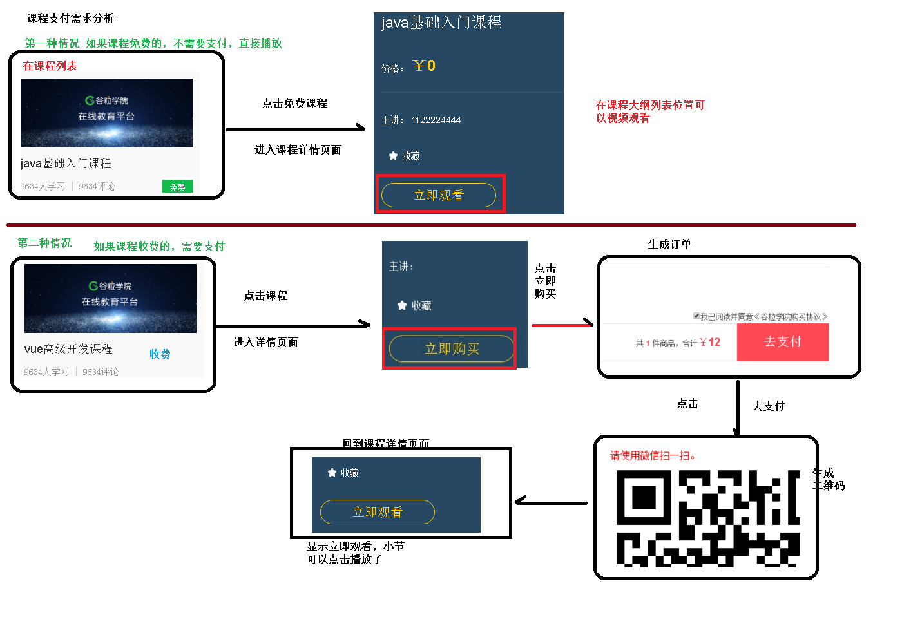

# day15-课程评论分析_支付功能

# 课程评论实现过程分析(TODO)


## 一、数据库设计

### 1、数据库

edu_comment

### **2、数据表**

```java
guli_edu.sql
```

## **二、创建课程评论接口**

### 1、在service-edu模块，生成课程评论代码

（1）使用mp代码生成器生成

### 2、在service-ucenter模块，创建接口

（1）实现用户id获取用户信息，返回用户信息对象

```java
//根据token字符串获取用户信息
@PostMapping("getInfoUc/{id}")
public com.atguigu.commonutils.vo.UcenterMember getInfo(@PathVariable String id) {
        //根据用户id获取用户信息
        UcenterMember ucenterMember = memberService.getById(id);
        com.atguigu.commonutils.vo.UcenterMember memeber = new com.atguigu.commonutils.vo.UcenterMember();
        BeanUtils.copyProperties(ucenterMember,memeber);
        return memeber;
}
```


### **3、创建课程评论controller**

（1）在service-edu模块创建client，实现微服务调用

```java
@Component
@FeignClient(name="service-ucenter",fallback = UcenterClientImpl.class)
public interface UcenterClient {
    //根据用户id获取用户信息
    @GetMapping("/ucenterservice/member/getUcenterPay/{memberId}")
    public UcenterMemberPay getUcenterPay(@PathVariable("memberId") String memberId);
}
@Component
public class UcenterClientImpl implements UcenterClient {
    @Override
    public UcenterMemberPay getUcenterPay(String memberId) {
        return null;
    }
}
```

（2）创建评论列表和添加评论接口

```java
@RestController
@RequestMapping("/eduservice/comment")
@CrossOrigin
public class CommentFrontController {
    @Autowired
    private CommentService commentService;
    @Autowired
    private UcenterClient ucenterClient;
    //根据课程id查询评论列表
    @ApiOperation(value = "评论分页列表")
    @GetMapping("{page}/{limit}")
    public R index(
            @ApiParam(name = "page", value = "当前页码", required = true)
            @PathVariable Long page,
            @ApiParam(name = "limit", value = "每页记录数", required = true)
            @PathVariable Long limit,
            @ApiParam(name = "courseQuery", value = "查询对象", required = false)
                    String courseId) {
        Page<Comment> pageParam = new Page<>(page, limit);
        QueryWrapper<Comment> wrapper = new QueryWrapper<>();
        wrapper.eq("course_id",courseId);
        commentService.page(pageParam,wrapper);
        List<Comment> commentList = pageParam.getRecords();
        Map<String, Object> map = new HashMap<>();
        map.put("items", commentList);
        map.put("current", pageParam.getCurrent());
        map.put("pages", pageParam.getPages());
        map.put("size", pageParam.getSize());
        map.put("total", pageParam.getTotal());
        map.put("hasNext", pageParam.hasNext());
        map.put("hasPrevious", pageParam.hasPrevious());
        return R.ok().data(map);
    }
    @ApiOperation(value = "添加评论")
    @PostMapping("auth/save")
    public R save(@RequestBody Comment comment, HttpServletRequest request) {
        String memberId = JwtUtils.getMemberIdByJwtToken(request);
        if(StringUtils.isEmpty(memberId)) {
            return R.error().code(28004).message("请登录");
        }
        comment.setMemberId(memberId);
        UcenterMemberPay ucenterInfo = ucenterClient.getUcenterPay(memberId);
        comment.setNickname(ucenterInfo.getNickname());
        comment.setAvatar(ucenterInfo.getAvatar());
        commentService.save(comment);
        return R.ok();
    }
}
```

## 三、课程评论前端整合

### 1、在api创建commonedu.js

```js
import request from '@/utils/request'
export default {
  getPageList(page, limit, courseId) {
    return request({
      url: `/eduservice/comment/${page}/${limit}`,
      method: 'get',
      params: {courseId}
    })
  },
  addComment(comment) {
    return request({
      url: `/eduservice/comment/auth/save`,
      method: 'post',
      data: comment
    })
  }
}
```

### 2、在课程详情页面，调用方法 _id.vue

```vue
import comment from '@/api/commonedu'
2
 3
<script>
4
import course from '@/api/course'
5
import comment from '@/api/commonedu'
6
export default {
      //和页面异步开始的
   asyncData({ params, error }) {
     return {courseId: params.id}
   },
   data() {
     return {
       data:{},
       page:1,
       limit:4,
       total:10,
       comment:{
         content:'',
         courseId:''
       },
       courseInfo:{},
       chapterVideoList:[],
       isbuyCourse:false
     }
   },
   created() {
     this.initCourseInfo()
     this.initComment()
   },
   methods:{
     //获取课程详情
     initCourseInfo() {
       course.getCourseInfo(this.courseId)
             .then(response => {
               this.courseInfo=response.data.data.courseFrontInfo
               this.chapterVideoList=response.data.data.chapterVideoList
               this.isbuyCourse=response.data.data.isbuyCourse
             })
     },
     initComment(){
        comment.getPageList(this.page, this.limit, this.courseId).then(response => {
            this.data = response.data.data
        })
     },
     addComment(){
         this.comment.courseId = this.courseId
         this.comment.teacherId = this.courseInfo.teacherId
         comment.addComment(this.comment).then(response => {
             if(response.data.success){
                 this.comment.content = ''
                 this.initComment()
             }
         })
     },
     gotoPage(page){
           comment.getPageList(page, this.limit,this.courseId).then(response => {
               this.data = response.data.data
           })
       }
   }
 };
 </script>
```

### 3、在课程详情页面 _id.vue显示评论

```js
<div class="mt50 commentHtml"><div>
       <h6 class="c-c-content c-infor-title" id="i-art-comment">
         <span class="commentTitle">课程评论</span>
       </h6>
       <section class="lh-bj-list pr mt20 replyhtml">
         <ul>
           <li class="unBr">
             <aside class="noter-pic">
               
               </aside>
             <div class="of">
               <section class="n-reply-wrap">
                 <fieldset>
                   <textarea name="" v-model="comment.content" placeholder="输入您要评论的文字" id="commentContent"></textarea>
                 </fieldset>
                 <p class="of mt5 tar pl10 pr10">
                   <span class="fl "><tt class="c-red commentContentmeg" style="display: none;"></tt></span>
                   <input type="button" @click="addComment()" value="回复" class="lh-reply-btn">
                 </p>
               </section>
             </div>
           </li>
         </ul>
       </section>
       <section class="">
           <section class="question-list lh-bj-list pr">
             <ul class="pr10">
               <li v-for="(comment,index) in data.items" v-bind:key="index">
                   <aside class="noter-pic">
                     
                     </aside>
                   <div class="of">
                     <span class="fl"> 
                     <font class="fsize12 c-blue"> 
                       {{comment.nickname}}</font>
                     <font class="fsize12 c-999 ml5">评论：</font></span>
                   </div>
                   <div class="noter-txt mt5">
                     <p>{{comment.content}}</p>
                   </div>
                   <div class="of mt5">
                     <span class="fr"><font class="fsize12 c-999 ml5">{{comment.gmtCreate}}</font></span>
                   </div>
                 </li>
               </ul>
           </section>
         </section>
         <!-- 公共分页 开始 -->
         <div class="paging">
             <!-- undisable这个class是否存在，取决于数据属性hasPrevious -->
             <a
             :class="{undisable: !data.hasPrevious}"
             href="#"
             title="首页"
             @click.prevent="gotoPage(1)">首</a>
             <a
             :class="{undisable: !data.hasPrevious}"
             href="#"
             title="前一页"
             @click.prevent="gotoPage(data.current-1)">&lt;</a>
             <a
             v-for="page in data.pages"
             :key="page"
             :class="{current: data.current == page, undisable: data.current == page}"
             :title="'第'+page+'页'"
             href="#"
             @click.prevent="gotoPage(page)">{{ page }}</a>
             <a
             :class="{undisable: !data.hasNext}"
             href="#"
             title="后一页"
             @click.prevent="gotoPage(data.current+1)">&gt;</a>
             <a
             :class="{undisable: !data.hasNext}"
             href="#"
             title="末页"
             @click.prevent="gotoPage(data.pages)">末</a>
             <div class="clear"/>
         </div>
         <!-- 公共分页 结束 -->
       </div>
     </div>
```


# 课程支付功能0

## 需求分析



## 所需接口


## 创建支付模块和准备

1、在service模块下创建子模块service_order

2、在service_order模块中引入依赖

```xml
<dependencies>
    <dependency>
        <groupId>com.github.wxpay</groupId>
        <artifactId>wxpay-sdk</artifactId>
        <version>0.0.3</version>
    </dependency>
    <dependency>
        <groupId>com.alibaba</groupId>
        <artifactId>fastjson</artifactId>
    </dependency>
</dependencies>
```

3、创建支付相关的表

4、使用代码生成器生成相关代码

5、编写application.properties配置文件

```properties
# 服务端口
server.port=8007

# 服务名
spring.application.name=service-order

# mysql数据库连接
spring.datasource.driver-class-name=com.mysql.cj.jdbc.Driver
spring.datasource.url=jdbc:mysql://localhost:3306/guli?serverTimezone=GMT%2B8
spring.datasource.username=root
spring.datasource.password=root

#返回json的全局时间格式
spring.jackson.date-format=yyyy-MM-dd HH:mm:ss
spring.jackson.time-zone=GMT+8

#配置mapper xml文件的路径
mybatis-plus.mapper-locations=classpath:com/atguigu/eduorder/mapper/xml/*.xml

#mybatis日志
mybatis-plus.configuration.log-impl=org.apache.ibatis.logging.stdout.StdOutImpl

# nacos服务地址
spring.cloud.nacos.discovery.server-addr=127.0.0.1:8848

#开启熔断机制
#feign.hystrix.enabled=true
# 设置hystrix超时时间，默认1000ms
#hystrix.command.default.execution.isolation.thread.timeoutInMilliseconds=3000
```


## 开发创建订单接口

1、编写订单controller

```java
@RestController
@RequestMapping("/eduorder/order")
@CrossOrigin
public class OrderController {

    @Autowired
    private OrderService orderService;

    // 根据课程id，生成订单的方法，返回订单号
    @PostMapping("createOrder/{id}")
    public R saveOrder(@PathVariable String id, HttpServletRequest request){

        String orderId = orderService.createOrder(id,JwtUtils.getMemberIdByJwtToken(request));
        return R.ok().data("orderId",orderId);
    }

}
```

2、在service_edu创建接口

（1）实现根据课程id获取课程信息，返回课程信息对象(所需要的返回对象，直接复制原来的实体类到公共模块即可)

```java
// 根据课程id，查询课程信息
@PostMapping("getCourseInfoOrder/{id}")
public CourseWebVoOrder getCourseInfoOrder(@PathVariable String id){
    CourseWebVo courseInfo = courseService.getBaseCourseInfo(id);
    CourseWebVoOrder courseWebVoOrder = new CourseWebVoOrder();
    BeanUtils.copyProperties(courseInfo,courseWebVoOrder);
    return courseWebVoOrder;
}
```

3、在service_ucenter创建接口

（1）实现用户id获取用户信息，返回用户信息对象

```java
// 根据用户id查询用户信息，前台
@PostMapping("getUserInfoOrder/{id}")
public UcenterMemberOrder getUserInfoOrder(@PathVariable String id){
    UcenterMember member = memberService.getById(id);
    UcenterMemberOrder ucenterMemberOrder = new UcenterMemberOrder();
    BeanUtils.copyProperties(member,ucenterMemberOrder);
    return ucenterMemberOrder;
}
```

4、编写订单service

（1）在service_order模块创建接口，实现远程调用

**EduClient**

```java
@Component
@FeignClient(name = "service-edu")
public interface EduClient {
    // 根据课程id，查询课程信息
    @PostMapping("/eduservice/coursefront/getCourseInfoOrder/{id}")
    public CourseWebVoOrder getCourseInfoOrder(@PathVariable("id") String id);

}
```

**UcenterClient**

```java
@Component
@FeignClient(name = "service-ucenter")
public interface UcenterClient {
    // 根据用户id查询用户信息，前台
    @PostMapping("/educenter/member/getUserInfoOrder/{id}")
    public UcenterMemberOrder getUserInfoOrder(@PathVariable("id") String id);

}
```

(2）在service_order模块编写创建订单service

```java
@Service
public class OrderServiceImpl extends ServiceImpl<OrderMapper, Order> implements OrderService {

    @Autowired
    private EduClient eduClient;

    @Autowired
    private UcenterClient ucenterClient;

    // 根据课程id，生成订单的方法，返回订单号
    @Override
    public String createOrder(String courseId, String memberId) {
        // 1.根据课程id查询课程信息
        CourseWebVoOrder courseInfoOrder = eduClient.getCourseInfoOrder(courseId);

        // 2.根据用户id，查询用户信息
        UcenterMemberOrder userInfoOrder = ucenterClient.getUserInfoOrder(memberId);

        // 加到数据库
        Order order = new Order();
        order.setOrderNo(OrderNoUtil.getOrderNo());                 // 订单号
        order.setCourseId(courseId);
        order.setCourseTitle(courseInfoOrder.getTitle());
        order.setCourseCover(courseInfoOrder.getCover());
        order.setTeacherName(courseInfoOrder.getTeacherName());
        order.setTotalFee(courseInfoOrder.getPrice());
        order.setMemberId(memberId);
        order.setMobile(userInfoOrder.getMobile());
        order.setNickname(userInfoOrder.getNickname());

        order.setStatus(0);     // 订单状态（0：未支付 1：已支付）
        order.setPayType(1);    // 支付类型（1：微信 2：支付宝）

        baseMapper.insert(order);

        // 返回订单号
        return order.getOrderNo();
    }
}
```

**OrderNoUtil**

```java
/**
 * 订单号工具类
 *
 * @author qy
 * @since 1.0
 */
public class OrderNoUtil {

    /**
     * 获取订单号
     * @return
     */
    public static String getOrderNo() {
        SimpleDateFormat sdf = new SimpleDateFormat("yyyyMMddHHmmss");
        String newDate = sdf.format(new Date());
        String result = "";
        Random random = new Random();
        for (int i = 0; i < 3; i++) {
            result += random.nextInt(10);
        }
        return newDate + result;
    }

}
```


## 开发获取订单接口 

1、在订单controller创建根据id获取订单信息接口

```java
// 根据订单号查询订单信息
@GetMapping("getOrder/{orderId}")
public R getOrder(@PathVariable String orderId){
    QueryWrapper<Order> wrapper = new QueryWrapper<>();
    wrapper.eq("order_no",orderId);
    Order order = orderService.getOne(wrapper);
    return R.ok().data("item",order);
}
```


## 生成订单前端整合

### 页面样式修改

**1、复制样式文件到assets**


**2、修改default.vue页面**

```vue
import '~/assets/css/reset.css'
import '~/assets/css/theme.css'
import '~/assets/css/global.css'
import '~/assets/css/web.css'
import '~/assets/css/base.css'
import '~/assets/css/activity_tab.css'
import '~/assets/css/bottom_rec.css'
import '~/assets/css/nice_select.css'
import '~/assets/css/order.css'
import '~/assets/css/swiper-3.3.1.min.css'
import "~/assets/css/pages-weixinpay.css"
```

### **课程支付前端**

1、在api文件夹下创建order.js文件

```js
import request from '@/utils/request'
export default {
  // 创建订单
  createOrder(courseId) {
    return request({
      url: `/eduorder/order/createOrder/${courseId}`,
      method: 'post'
    })
  },
  // 根据订单号查询订单信息
  getOrderInfo(id) {
    return request({
      url: `/eduorder/order/getOrder/${id}`,
      method: 'get'
    })
  }
}
```

2、在课程详情页面中添加创建订单方法

在“立即购买”位置添加事件


```vue
   methods:{
      // 创建订单
      createOrder(){
        order.createOrder(this.courseId)
          .then(response =>{
            // 获取返回的订单号
            // 将订单号放在路径上跳转订单显示页面
            this.$router.push({path:'/order/'+response.data.data.orderId })
          })
      }
   }
```

### **创建订单页面，显示订单信息**

在pages下面创建order文件夹，创建_oid.vue页面

在_oid.vue页面调用方法，获取订单信息

（1）页面部分

```vue
<template>
   <div class="Page Confirm">
     <div class="Title">
       <h1 class="fl f18">订单确认</h1>
       
       <div class="clear"></div>
     </div>
     <form name="flowForm" id="flowForm" method="post" action="">
       <table class="GoodList">
         <tbody>
         <tr>
           <th class="name">商品</th>
           <th class="price">原价</th>
           <th class="priceNew">价格</th>
         </tr>
         </tbody>
         <tbody>
         <!-- <tr>
           <td colspan="3" class="Title red f18 fb"><p>限时折扣</p></td>
         </tr> -->
         <tr>
           <td colspan="3" class="teacher">讲师：{{order.teacherName}}</td>
         </tr>
         <tr class="good">
           <td class="name First">
             <a target="_blank" :href="'https://localhost:3000/course/'+order.courseId">
               </a>
             <div class="goodInfo">
               <input type="hidden" class="ids ids_14502" value="14502">
               <a target="_blank" :href="'https://localhost:3000/course/'+ order.courseId">{{order.courseTitle}}</a>
             </div>
           </td>
           <td class="price">
             <p>￥<strong>{{order.totalFee}}</strong></p>
             <!-- <span class="discName red">限时8折</span> -->
           </td>
           <td class="red priceNew Last">￥<strong>{{order.totalFee}}</strong></td>
         </tr>
         <tr>
           <td class="Billing tr" colspan="3">
             <div class="tr">
               <p>共 <strong class="red">1</strong> 件商品，合计<span
                 class="red f20">￥<strong>{{order.totalFee}}</strong></span></p>
             </div>
           </td>
         </tr>
         </tbody>
       </table>
       <div class="Finish">
         <div class="fr" id="AgreeDiv">
           <label for="Agree"><p class="on"><input type="checkbox" checked="checked">我已阅读并同意<a href="javascript:" target="_blank">《谷粒学院购买协议》</a></p></label>
         </div>
         <div class="clear"></div>
         <div class="Main fl">
           <div class="fl">
             <a :href="'/course/'+order.courseId">返回课程详情页</a>
           </div>
           <div class="fr">
             <p>共 <strong class="red">1</strong> 件商品，合计<span class="red f20">￥<strong
               id="AllPrice">{{order.totalFee}}</strong></span></p>
           </div>
         </div>
         <input name="score" value="0" type="hidden" id="usedScore">
         <button class="fr redb" type="button" id="submitPay" @click="toPay()">去支付</button>
         <div class="clear"></div>
       </div>
     </form>
   </div>
 </template>
```

（2）调用部分

```vue
 <script>
     import orderApi from "@/api/order"
 export default {
     // 订单详情
     asyncData({params,error}){
         return orderApi.getOrderInfo(params.oid)
            .then(response =>{
                return{
                    order:response.data.data.item
                }
            })
     }
 }
 </script>
```


## 生成微信支付二维码接口

需要用的信息


### 1、编写controller

```java
@RestController
@RequestMapping("/eduorder/paylog")
@CrossOrigin
public class PayLogController {

    @Autowired
    private PayLogService payLogService;

    // 生成微信支付二维码
    @GetMapping("createNative/{orderNo}")
    public R createNative(@PathVariable String orderNo){
        // 需要返回二维码和订单信息
        Map map = payLogService.createNative(orderNo);
        return R.ok().data(map);
    }
}
```

### **2、编写service**


```java
1@Service
public class PayLogServiceImpl extends ServiceImpl<PayLogMapper, PayLog> implements PayLogService {

    @Autowired
    private OrderService orderService;

    // 生成微信支付二维码
    @Override
    public Map createNative(String orderNo) {

        try {
            // 1.根据订单号，查询订单信息
            QueryWrapper<Order> wrapper = new QueryWrapper<>();
            wrapper.eq("order_no",orderNo);
            Order order = orderService.getOne(wrapper);

            // 2.用map封装生成二维码需要的参数
            Map m = new HashMap();
            m.put("appid", "wx74862e0dfcf69954");
            m.put("mch_id", "1558950191");
            m.put("nonce_str", WXPayUtil.generateNonceStr());   // 生成随机的字符串，让每一个二维码都不一样
            m.put("body", order.getCourseTitle());  // 课程标题
            m.put("out_trade_no", orderNo);         // 订单号
            // 将BigDecimal类型先转换为long，再转换为字符串
            m.put("total_fee", order.getTotalFee().multiply(new BigDecimal("100")).longValue()+"");
            m.put("spbill_create_ip", "127.0.0.1");
            m.put("notify_url", "http://guli.shop/api/order/weixinPay/weixinNotify\n");
            m.put("trade_type", "NATIVE");

            // 3.用client发送请求
            HttpClient client = new HttpClient("https://api.mch.weixin.qq.com/pay/unifiedorder");

            // client 设置参数
            client.setXmlParam(WXPayUtil.generateSignedXml(m, "T6m9iK73b0kn9g5v426MKfHQH7X8rKwb"));
            client.setHttps(true);
            client.post();

            // 返回数据，xml格式
            String xml = client.getContent();
            // 利用微信提供的工具类将xml格式转换为map格式
            Map<String, String> resultMap = WXPayUtil.xmlToMap(xml);

            // 4.封装最后的数据
            Map map = new HashMap<>();
            map.put("out_trade_no", orderNo);
            map.put("course_id", order.getCourseId());
            map.put("total_fee", order.getTotalFee());
            map.put("result_code", resultMap.get("result_code"));
            map.put("code_url", resultMap.get("code_url"));

            //微信支付二维码2小时过期，可采取2小时未支付取消订单
            //redisTemplate.opsForValue().set(orderNo, map, 120, TimeUnit.MINUTES);
            // 将封装好的map返回
            return map;
        } catch (Exception e) {
            e.printStackTrace();
            throw new GuliException(20001,"生成二维码失败");
        }

    }
}
```


## 查询订单支付状态接口

### **1、编写controller**

```java
// 根据订单号查询支付状态
@GetMapping("queryPayStatus/{orderNo}")
public R queryPayStatus(@PathVariable String orderNo){
    // 根据订单号查询支付状态
    Map<String,String> map = payLogService.queryPayStatus(orderNo);

    // 判断返回的map是否为空
    if (map == null){
        return R.error().message("支付失败");
    }

    //支付成功
    if (map.get("trade_state").equals("SUCCESS")){
        // 向表里面添加记录，更支付状态
        payLogService.updataOrderStatus(map);
        return R.ok().message("支付成功");
    }

    return R.ok().message("支付中");
}
```

### 2、编写service，更新订单状态

```java
// 向表里面添加记录，更支付状态
@Override
public void updataOrderStatus(Map<String,String> map) {
    // 获取订单号id
    String orderNo = map.get("out_trade_no");

    // 根据订单号，查询订单信息
    QueryWrapper<Order> wrapper = new QueryWrapper<>();
    wrapper.eq("order_no",orderNo);
    Order order = orderService.getOne(wrapper);

    // 判断是否已支付
    if (order.getStatus().intValue() == 1){
        return;
    }
    // 如果没有支付,则设置支付状态
    order.setStatus(1);
    orderService.updateById(order);

    //记录支付日志
    PayLog payLog=new PayLog();
    payLog.setOrderNo(order.getOrderNo());          // 支付订单号
    payLog.setPayTime(new Date());                  // 支付时间
    payLog.setPayType(1);                           // 支付类型 1微信
    payLog.setTotalFee(order.getTotalFee());        // 总金额(分)
    payLog.setTradeState(map.get("trade_state"));   // 支付状态
    payLog.setTransactionId(map.get("transaction_id")); // 流水号
    payLog.setAttr(JSONObject.toJSONString(map));   // 将其他信息加入以json的格式加入到数据库
    baseMapper.insert(payLog);//插入到支付日志表

}
```


## 生成微信支付二维码

（1）页面部分

```vue
<template>
   <div class="cart py-container">
     <!--主内容-->
     <div class="checkout py-container  pay">
       <div class="checkout-tit">
         <h4 class="fl tit-txt"><span class="success-icon"></span><span class="success-info">订单提交成功，请您及时付款！订单号：{{payObj.out_trade_no}}</span>
         </h4>
         <span class="fr"><em class="sui-lead">应付金额：</em><em class="orange money">￥{{payObj.total_fee}}</em></span>
         <div class="clearfix"></div>
       </div>
       <div class="checkout-steps">
         <div class="fl weixin">微信支付</div>
         <div class="fl sao">
           <p class="red">请使用微信扫一扫。</p>
           <div class="fl code">
             <!--  -->
             <!-- <qriously value="weixin://wxpay/bizpayurl?pr=R7tnDpZ" :size="338"/> -->
             <qriously :value="payObj.code_url" :size="338"/>
             <div class="saosao">
               <p>请使用微信扫一扫</p>
               <p>扫描二维码支付</p>
             </div>
           </div>
         </div>
         <div class="clearfix"></div>
         <!-- <p><a href="pay.html" target="_blank">> 其他支付方式</a></p> -->
       </div>
     </div>
   </div>
 </template>
```


（2）调用部分

```vue
 <script>
     import orderApi from "@/api/order"
 export default {
     // 生成支付二维码
     asyncData({params,error}){
         return orderApi.createNative(params.pid)
            .then(response =>{
                return{
                    payObj: response.data.data
                }
            })
     },
     data(){
         return{
             time1:''
         }
     },
     // 页面渲染之后执行
     mounted(){
      //在页面渲染之后执行
      //每隔三秒，去查询一次支付状态
      this.timer1 = setInterval(() => {
        this.queryPayStatus(this.payObj.out_trade_no)
      }, 3000);

     },
     methods:{
         // 查询订单状态
         queryPayStatus(out_trade_no){
             orderApi.getPayStatus(out_trade_no)
                .then(response =>{
                        if (response.data.success) {
                            //如果支付成功，清除定时器
                            clearInterval(this.timer1)
                            this.$message({
                                type: 'success',
                                message: '支付成功!'
                             })
                            //跳转到课程详情页面观看视频
                            this.$router.push({path: '/course/' + this.payObj.course_id})
                    }
                })
         }
     }
 }
 </script>
```

