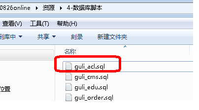

# day17-canal_Gateway网关_权限管理

# canal数据同步【TODO】

Linux中还没装数据库


# SpringCloud-Gateway网关

## 创建api-gateway模块（网关服务）

1、在infrastructure模块下创建api_gateway模块

2、在pom.xml引入依赖

```xml
<dependencies>
    <dependency>
        <groupId>com.atguigu</groupId>
        <artifactId>common_utils</artifactId>
        <version>0.0.1-SNAPSHOT</version>
    </dependency>
    <dependency>
        <groupId>org.springframework.cloud</groupId>
        <artifactId>spring-cloud-starter-alibaba-nacos-discovery</artifactId>
    </dependency>
    <dependency>
        <groupId>org.springframework.cloud</groupId>
        <artifactId>spring-cloud-starter-gateway</artifactId>
    </dependency>
    <!--gson-->
    <dependency>
        <groupId>com.google.code.gson</groupId>
        <artifactId>gson</artifactId>
    </dependency>
    <!--服务调用-->
    <dependency>
        <groupId>org.springframework.cloud</groupId>
        <artifactId>spring-cloud-starter-openfeign</artifactId>
    </dependency>
</dependencies>
```

3、编写application.properties配置文件

```properties
# 服务端口
server.port=8222
# 服务名
spring.application.name=service-gateway
# nacos服务地址
spring.cloud.nacos.discovery.server-addr=127.0.0.1:8848
#使用服务发现路由
spring.cloud.gateway.discovery.locator.enabled=true
#服务路由名小写
#spring.cloud.gateway.discovery.locator.lower-case-service-id=true
#设置路由id
spring.cloud.gateway.routes[0].id=service-acl
#设置路由的uri
spring.cloud.gateway.routes[0].uri=lb://service-acl
#设置路由断言,代理servicerId为auth-service的/auth/路径
spring.cloud.gateway.routes[0].predicates= Path=/*/acl/**
#配置service-edu服务
spring.cloud.gateway.routes[1].id=service-edu
spring.cloud.gateway.routes[1].uri=lb://service-edu
spring.cloud.gateway.routes[1].predicates= Path=/eduservice/**
#配置service-ucenter服务
spring.cloud.gateway.routes[2].id=service-ucenter
spring.cloud.gateway.routes[2].uri=lb://service-ucenter
spring.cloud.gateway.routes[2].predicates= Path=/ucenterservice/**
#配置service-ucenter服务
spring.cloud.gateway.routes[3].id=service-cms
spring.cloud.gateway.routes[3].uri=lb://service-cms
spring.cloud.gateway.routes[3].predicates= Path=/cmsservice/**
```

4、编写启动类

```java
@SpringBootApplication
@EnableDiscoveryClient
public class ApiGatewayApplication {

    public static void main(String[] args) {
        SpringApplication.run(ApiGatewayApplication.class,args);
    }

}
```

## 网关相关配置

**1、网关解决跨域问题**


```java
@Configuration
public class CorsConfig {
    @Bean
    public CorsWebFilter corsFilter() {
        CorsConfiguration config = new CorsConfiguration();
        config.addAllowedMethod("*");
        config.addAllowedOrigin("*");
        config.addAllowedHeader("*");
        UrlBasedCorsConfigurationSource source = new UrlBasedCorsConfigurationSource(new PathPatternParser());
        source.registerCorsConfiguration("/**", config);
        return new CorsWebFilter(source);
    }
}
```

**2、全局Filter，统一处理会员登录与外部不允许访问的服务**

```java
/**
 * <p>
 * 全局Filter，统一处理会员登录与外部不允许访问的服务
 * </p>
 */
@Component
public class AuthGlobalFilter implements GlobalFilter, Ordered {
    private AntPathMatcher antPathMatcher = new AntPathMatcher();
    @Override
    public Mono<Void> filter(ServerWebExchange exchange, GatewayFilterChain chain) {
        ServerHttpRequest request = exchange.getRequest();
        String path = request.getURI().getPath();
        //谷粒学院api接口，校验用户必须登录
        if(antPathMatcher.match("/api/**/auth/**", path)) {
            List<String> tokenList = request.getHeaders().get("token");
            if(null == tokenList) {
                ServerHttpResponse response = exchange.getResponse();
                return out(response);
            } else {
//                Boolean isCheck = JwtUtils.checkToken(tokenList.get(0));
//                if(!isCheck) {
                ServerHttpResponse response = exchange.getResponse();
                return out(response);
//                }
            }
        }
        //内部服务接口，不允许外部访问
        if(antPathMatcher.match("/**/inner/**", path)) {
            ServerHttpResponse response = exchange.getResponse();
            return out(response);
        }
        return chain.filter(exchange);
    }
    @Override
    public int getOrder() {
        return 0;
    }
    private Mono<Void> out(ServerHttpResponse response) {
        JsonObject message = new JsonObject();
        message.addProperty("success", false);
        message.addProperty("code", 28004);
        message.addProperty("data", "鉴权失败");
        byte[] bits = message.toString().getBytes(StandardCharsets.UTF_8);
        DataBuffer buffer = response.bufferFactory().wrap(bits);
        //response.setStatusCode(HttpStatus.UNAUTHORIZED);
        //指定编码，否则在浏览器中会中文乱码
        response.getHeaders().add("Content-Type", "application/json;charset=UTF-8");
        return response.writeWith(Mono.just(buffer));
    }
}
```


**3、自定义异常处理**

服务网关调用服务时可能会有一些异常或服务不可用，它返回错误信息不友好，需要我们覆盖处理

ErrorHandlerConfig

```java
/**
 * <p>
 * 全局Filter，统一处理会员登录与外部不允许访问的服务
 * </p>
 */
@Configuration
@EnableConfigurationProperties({ServerProperties.class, ResourceProperties.class})
public class ErrorHandlerConfig {
    private final ServerProperties serverProperties;
    private final ApplicationContext applicationContext;
    private final ResourceProperties resourceProperties;
    private final List<ViewResolver> viewResolvers;
    private final ServerCodecConfigurer serverCodecConfigurer;
    public ErrorHandlerConfig(ServerProperties serverProperties,
                              ResourceProperties resourceProperties,
                              ObjectProvider<List<ViewResolver>> viewResolversProvider,
                              ServerCodecConfigurer serverCodecConfigurer,
                              ApplicationContext applicationContext) {
        this.serverProperties = serverProperties;
        this.applicationContext = applicationContext;
        this.resourceProperties = resourceProperties;
        this.viewResolvers = viewResolversProvider.getIfAvailable(Collections::emptyList);
        this.serverCodecConfigurer = serverCodecConfigurer;
    }
    @Bean
    @Order(Ordered.HIGHEST_PRECEDENCE)
    public ErrorWebExceptionHandler errorWebExceptionHandler(ErrorAttributes errorAttributes) {
        JsonExceptionHandler exceptionHandler = new JsonExceptionHandler(
                errorAttributes,
                this.resourceProperties,
                this.serverProperties.getError(),
                this.applicationContext);
        exceptionHandler.setViewResolvers(this.viewResolvers);
        exceptionHandler.setMessageWriters(this.serverCodecConfigurer.getWriters());
        exceptionHandler.setMessageReaders(this.serverCodecConfigurer.getReaders());
        return exceptionHandler;
    }
}
```

JsonExceptionHandler

```java
/**
 * 自定义异常处理
 * <p>异常时用JSON代替HTML异常信息<p>
 */
public class JsonExceptionHandler extends DefaultErrorWebExceptionHandler {
    public JsonExceptionHandler(ErrorAttributes errorAttributes, ResourceProperties resourceProperties,
                                ErrorProperties errorProperties, ApplicationContext applicationContext) {
        super(errorAttributes, resourceProperties, errorProperties, applicationContext);
    }

    /**
     * 获取异常属性
     */
    @Override
    protected Map<String, Object> getErrorAttributes(ServerRequest request, boolean includeStackTrace) {
        Map<String, Object> map = new HashMap<>();
        map.put("success", false);
        map.put("code", 20005);
        map.put("message", "网关失败");
        map.put("data", null);
        return map;
    }

    /**
     * 指定响应处理方法为JSON处理的方法
     *
     * @param errorAttributes
     */
    @Override
    protected RouterFunction<ServerResponse> getRoutingFunction(ErrorAttributes errorAttributes) {
        return RouterFunctions.route(RequestPredicates.all(), this::renderErrorResponse);
    }

    /**
     * 根据code获取对应的HttpStatus
     *
     * @param errorAttributes
     */
//    @Override
//    protected HttpStatus getHttpStatus(Map<String, Object> errorAttributes) {
//        return HttpStatus.OK;
//    }
}
```


# 权限管理-表结构和关系


# 权限管理

**1、在service模块下创建子模块service-acl**

**2、在service_acl模块中引入依赖**

```xml
<dependencies>
    <dependency>
        <groupId>com.atguigu</groupId>
        <artifactId>spring_security</artifactId>
        <version>0.0.1-SNAPSHOT</version>
    </dependency>
    <dependency>
        <groupId>com.alibaba</groupId>
        <artifactId>fastjson</artifactId>
    </dependency>
</dependencies>
```

**3、创建权限管理相关的表**



**4、复制权限管理接口代码**

**5、复制整合Spring Security代码**

**（1）在common模块下创建子模块spring_security**

**6、编写application.properties配置文件**

```properties
# 服务端口
server.port=8009
# 服务名
spring.application.name=service-acl

# mysql数据库连接
spring.datasource.driver-class-name=com.mysql.cj.jdbc.Driver
spring.datasource.url=jdbc:mysql://localhost:3306/guli?serverTimezone=GMT%2B8
spring.datasource.username=root
spring.datasource.password=root

#返回json的全局时间格式
spring.jackson.date-format=yyyy-MM-dd HH:mm:ss
spring.jackson.time-zone=GMT+8

spring.redis.host=192.168.44.132
spring.redis.port=6379
spring.redis.database= 0
spring.redis.timeout=1800000

spring.redis.lettuce.pool.max-active=20
spring.redis.lettuce.pool.max-wait=-1
#最大阻塞等待时间(负数表示没限制)
spring.redis.lettuce.pool.max-idle=5
spring.redis.lettuce.pool.min-idle=0
#最小空闲

#配置mapper xml文件的路径
mybatis-plus.mapper-locations=classpath:com/atguigu/aclservice/mapper/xml/*.xml

# nacos服务地址
spring.cloud.nacos.discovery.server-addr=127.0.0.1:8848

#mybatis日志
mybatis-plus.configuration.log-impl=org.apache.ibatis.logging.stdout.StdOutImpl
```


# 权限管理-查询所有菜单-递归

controller

```java
// 获取全部菜单1
@ApiOperation(value = "查询所有菜单1")
@GetMapping
public R indexAllPermission1() {
    List<Permission> list =  permissionService.queryAllMenuGuli1();
    return R.ok().data("children",list);
}
```

service

```java
// 获取全部菜单1
List<Permission> queryAllMenuGuli1();
```

serviceImpl

```java
// 获取全部菜单1
@Override
public List<Permission> queryAllMenuGuli1() {
    // 1.查询所有的菜单
    QueryWrapper<Permission> wrapper = new QueryWrapper<>();
    wrapper.orderByDesc("id");
    List<Permission> permissionList = baseMapper.selectList(wrapper);
    // 按照要求把所有的菜单进行封装返回
    List<Permission> resultList = bulidPermission1(permissionList);
    return resultList;
}

// 遍历所有的菜单，将得到的数据进行封装
public static List<Permission> bulidPermission1(List<Permission> permissionList) {

    // 构建一个集合，用于最终的数据封装
    List<Permission> finalList = new ArrayList<>();

    // 2.遍历所有的菜单，找到一级菜单
    for (Permission permissionNode : permissionList) {
        // 判断是否是一级菜单，一级菜单的id为0，即找到递归查询的入口
        if ("0".equals(permissionNode.getPid())){
            // 将它的level层级设置为1
            permissionNode.setLevel(1);
            // 根据顶层菜单，递归查询下面的子菜单，并加入到最终的集合
            finalList.add(selectChildren1(permissionNode,permissionList));
        }
    }
    return finalList;
}

// 查询子菜单
public static Permission selectChildren1(Permission permissionNode, List<Permission> permissionList) {
    // 先初始化父菜单的子菜单
    permissionNode.setChildren(new ArrayList<>());

    // 遍历所有的菜单，查到子菜单
    for (Permission it : permissionList) {
        // 判断子菜单是否属于父菜单，条件为子菜单的pid等于父菜单的id
        if (it.getPid().equals(permissionNode.getId())){
            // 将子菜单的level+1
            Integer level = permissionNode.getLevel() + 1;
            it.setLevel(level );

            // 添加之前应该判断子菜单是否为空，如果为空，初始化
            if (permissionNode.getChildren() == null){
                permissionNode.setChildren(new ArrayList<>());
            }

            // 将查询出来的菜单放到该父菜单下的子菜单中
            // 再以这个菜单为父菜单，继续查询该菜单下的子菜单，即递归查询子菜单
            permissionNode.getChildren().add(selectChildren1(it,permissionList));

        }
    }
    // 最后返回父菜单
    return permissionNode;
}
```


# 权限管理-递归删除菜单

controller

```java
@ApiOperation(value = "递归删除菜单1")
@DeleteMapping("remove/{id}")
public R remove(@PathVariable String id) {
    permissionService.removeChildByIdGuli1(id);
    return R.ok();
}
```

service

```java
// 递归删除菜单1
void removeChildByIdGuli1(String id);
```

serviceImpl

```java
// =--------------递归删除菜单---------------------
// 递归删除菜单1
@Override
public void removeChildByIdGuli1(String id) {
    // 先创建一个集合，用于封装所有需要删除的id
    List<String> idList = new ArrayList<>();
    // 查询要删除的id下面的所有的子菜单的id
    this.selectPermissionChildById1111(id,idList);

    // 将需要删除的结点也加入到集合
    idList.add(id);
    baseMapper.deleteBatchIds(idList);
}

// 递归查询要删除的id下面所有的子菜单的id
private void selectPermissionChildById1111(String id, List<String> idList) {
    // 根据id查询出该菜单才所有的子菜单id
    QueryWrapper<Permission> wrapper = new QueryWrapper<>();
    wrapper.eq("pid",id);
    wrapper.select("id");
    // 查询出来的子菜单id
    List<Permission> selectIdList = baseMapper.selectList(wrapper);

    // 遍历查询出来的子菜单id，加入到idList集合中
    selectIdList.stream().forEach(item ->{
        idList.add(item.getId());
        // 再以这个结点递归查询他下面的子菜单
        this.selectPermissionChildById1111(item.getId(),idList);
    });
}
```


# 权限管理-角色分配菜单

controller

```java
@ApiOperation(value = "给角色分配权限1")
@PostMapping("/doAssign")
public R doAssign(String roleId,String[] permissionId) {
    permissionService.saveRolePermissionRealtionShipGuli11(roleId,permissionId);
    return R.ok();
}
```

service

```java
// 给角色分配菜单
void saveRolePermissionRealtionShipGuli11(String roleId, String[] permissionId);
```

serviceImpl

```java
// =--------------给角色分配菜单----------------
@Override
public void saveRolePermissionRealtionShipGuli11(String roleId, String[] permissionIds) {
    // 先创建一个集合，用于封装需要添加的数据
    List<RolePermission> rolePermissionList = new ArrayList<>();

    // 遍历permissionIds，得到要添加的每一个菜单id
    for (String permissionId : permissionIds) {
        // 构造一个RolePermission对象
        RolePermission rolePermission = new RolePermission();
        // 设置rolePermission的角色id
        rolePermission.setRoleId(roleId);
        // 设置rolePermission的菜单id
        rolePermission.setPermissionId(permissionId);

        // 将封装好的rolePermission对象加入到rolePermissionList中
        rolePermissionList.add(rolePermission);
    }
    // 调用方法，加入到数据库中，由于操作的是角色菜单表，因此需要注入rolePermissionService
    rolePermissionService.saveBatch(rolePermissionList);
}
```

