# day18-权限管理 Nacos 配置中心 Git

# 权限管理-SpringSecurity介绍

## 授权和认证实现思路

用户先进行输入账号密码登录，从数据库中查询数据，如果登录成功，将用户的用户名作为key，将从数据库中查询出来的权限作为value存到redis中。登录成功后，返回token，将token存到cookie中并且在请起头header也存放token信息。接着SpringSecurity再请求头header中获取token信息，从token信息中解析出用户名，根据用户名去redis中查询该用户所有的权限，最后，SpringSecurity根据查询出来的权限赋予用户相当于的权限，可以进行对应的操作。

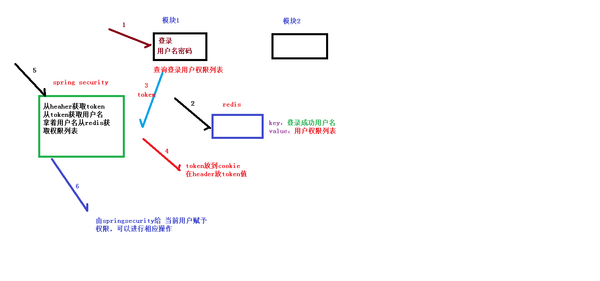

# 权限管理-整合SpringSecurity

**1、在common下创建spring_security模块**

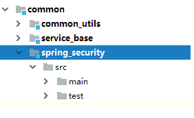


**2、在spring_security引入相关依赖**

```xml
<dependencies>
    <dependency>
        <groupId>com.atguigu</groupId>
        <artifactId>common_utils</artifactId>
        <version>0.0.1-SNAPSHOT</version>
    </dependency>
    <!-- Spring Security依赖 -->
    <dependency>
        <groupId>org.springframework.boot</groupId>
        <artifactId>spring-boot-starter-security</artifactId>
    </dependency>

    <dependency>
        <groupId>io.jsonwebtoken</groupId>
        <artifactId>jjwt</artifactId>
    </dependency>
</dependencies>
```


**3、在service_acl引入\**spring_security\**依赖**

```xml
<dependency>
    <groupId>com.atguigu</groupId>
    <artifactId>spring_security</artifactId>
    <version>0.0.1-SNAPSHOT</version>
</dependency>
```

**代码结构说明：**

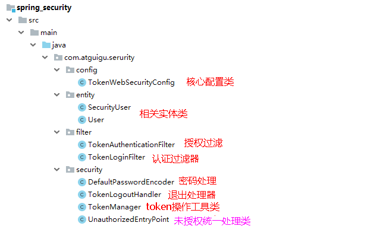


**4、创建spring security核心配置类**

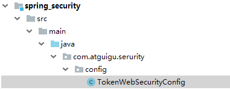

Spring Security的核心配置就是继承WebSecurityConfigurerAdapter并注解@EnableWebSecurity的配置。

这个配置指明了用户名密码的处理方式、请求路径的开合、登录登出控制等和安全相关的配置

```java
package com.atguigu.serurity.config;

import com.atguigu.serurity.filter.TokenAuthenticationFilter;
import com.atguigu.serurity.filter.TokenLoginFilter;
import com.atguigu.serurity.security.DefaultPasswordEncoder;
import com.atguigu.serurity.security.TokenLogoutHandler;
import com.atguigu.serurity.security.TokenManager;
import com.atguigu.serurity.security.UnauthorizedEntryPoint;
import org.springframework.beans.factory.annotation.Autowired;
import org.springframework.context.annotation.Configuration;
import org.springframework.data.redis.core.RedisTemplate;
import org.springframework.security.config.annotation.authentication.builders.AuthenticationManagerBuilder;
import org.springframework.security.config.annotation.method.configuration.EnableGlobalMethodSecurity;
import org.springframework.security.config.annotation.web.builders.HttpSecurity;
import org.springframework.security.config.annotation.web.builders.WebSecurity;
import org.springframework.security.config.annotation.web.configuration.EnableWebSecurity;
import org.springframework.security.config.annotation.web.configuration.WebSecurityConfigurerAdapter;
import org.springframework.security.core.userdetails.UserDetailsService;

/**
 * <p>
 * Security配置类
 * </p>
 *
 * @author qy
 * @since 2019-11-18
 */
@Configuration
@EnableWebSecurity
@EnableGlobalMethodSecurity(prePostEnabled = true)
public class TokenWebSecurityConfig extends WebSecurityConfigurerAdapter {

    private UserDetailsService userDetailsService;
    private TokenManager tokenManager;
    private DefaultPasswordEncoder defaultPasswordEncoder;
    private RedisTemplate redisTemplate;

    @Autowired
    public TokenWebSecurityConfig(UserDetailsService userDetailsService, DefaultPasswordEncoder defaultPasswordEncoder,
                                  TokenManager tokenManager, RedisTemplate redisTemplate) {
        this.userDetailsService = userDetailsService;
        this.defaultPasswordEncoder = defaultPasswordEncoder;
        this.tokenManager = tokenManager;
        this.redisTemplate = redisTemplate;
    }

    /**
     * 配置设置
     * @param http
     * @throws Exception
     */
    @Override
    protected void configure(HttpSecurity http) throws Exception {
        http.exceptionHandling()
                .authenticationEntryPoint(new UnauthorizedEntryPoint())
                .and().csrf().disable()
                .authorizeRequests()
                .anyRequest().authenticated()
                .and().logout().logoutUrl("/admin/acl/index/logout")
                .addLogoutHandler(new TokenLogoutHandler(tokenManager,redisTemplate)).and()
                .addFilter(new TokenLoginFilter(authenticationManager(), tokenManager, redisTemplate))
                .addFilter(new TokenAuthenticationFilter(authenticationManager(), tokenManager, redisTemplate)).httpBasic();
    }

    /**
     * 密码处理
     * @param auth
     * @throws Exception
     */
    @Override
    public void configure(AuthenticationManagerBuilder auth) throws Exception {
        auth.userDetailsService(userDetailsService).passwordEncoder(defaultPasswordEncoder);
    }

    /**
     * 配置哪些请求不拦截
     * @param web
     * @throws Exception
     */
    @Override
    public void configure(WebSecurity web) throws Exception {
        web.ignoring().antMatchers("/api/**",
                "/swagger-resources/**", "/webjars/**", "/v2/**", "/swagger-ui.html/**"
               );
    }
}
```

**5、创建认证授权相关的工具类**

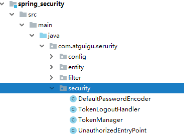

（1）DefaultPasswordEncoder：密码处理的方法

```java
package com.atguigu.serurity.security;

import com.atguigu.commonutils.MD5;
import org.springframework.security.crypto.password.PasswordEncoder;
import org.springframework.stereotype.Component;

/**
 * <p>
 * t密码的处理方法类型
 * </p>
 *
 * @author qy
 * @since 2019-11-08
 */
@Component
public class DefaultPasswordEncoder implements PasswordEncoder {

    public DefaultPasswordEncoder() {
        this(-1);
    }

    /**
     * @param strength
     *            the log rounds to use, between 4 and 31
     */
    public DefaultPasswordEncoder(int strength) {

    }

    public String encode(CharSequence rawPassword) {
        return MD5.encrypt(rawPassword.toString());
    }

    public boolean matches(CharSequence rawPassword, String encodedPassword) {
        return encodedPassword.equals(MD5.encrypt(rawPassword.toString()));
    }
}
```

（2）TokenManager：token操作的工具类

```java
package com.atguigu.serurity.security;

import io.jsonwebtoken.CompressionCodecs;
import io.jsonwebtoken.Jwts;
import io.jsonwebtoken.SignatureAlgorithm;
import org.springframework.stereotype.Component;

import java.util.Date;

/**
 * <p>
 * token管理
 * </p>
 *
 * @author qy
 * @since 2019-11-08
 */
@Component
public class TokenManager {

    private long tokenExpiration = 24*60*60*1000;
    private String tokenSignKey = "123456";

    public String createToken(String username) {
        String token = Jwts.builder().setSubject(username)
                .setExpiration(new Date(System.currentTimeMillis() + tokenExpiration))
                .signWith(SignatureAlgorithm.HS512, tokenSignKey).compressWith(CompressionCodecs.GZIP).compact();
        return token;
    }

    public String getUserFromToken(String token) {
        String user = Jwts.parser().setSigningKey(tokenSignKey).parseClaimsJws(token).getBody().getSubject();
        return user;
    }

    public void removeToken(String token) {
        //jwttoken无需删除，客户端扔掉即可。
    }

}

```

（3）TokenLogoutHandler：退出实现

```java
package com.atguigu.serurity.security;

import com.atguigu.commonutils.R;
import com.atguigu.commonutils.ResponseUtil;
import org.springframework.data.redis.core.RedisTemplate;
import org.springframework.security.core.Authentication;
import org.springframework.security.web.authentication.logout.LogoutHandler;

import javax.servlet.http.HttpServletRequest;
import javax.servlet.http.HttpServletResponse;

/**
 * <p>
 * 登出业务逻辑类
 * </p>
 *
 * @author qy
 * @since 2019-11-08
 */
public class TokenLogoutHandler implements LogoutHandler {

    private TokenManager tokenManager;
    private RedisTemplate redisTemplate;

    public TokenLogoutHandler(TokenManager tokenManager, RedisTemplate redisTemplate) {
        this.tokenManager = tokenManager;
        this.redisTemplate = redisTemplate;
    }

    @Override
    public void logout(HttpServletRequest request, HttpServletResponse response, Authentication authentication) {
        String token = request.getHeader("token");
        if (token != null) {
            tokenManager.removeToken(token);

            //清空当前用户缓存中的权限数据
            String userName = tokenManager.getUserFromToken(token);
            redisTemplate.delete(userName);
        }
        ResponseUtil.out(response, R.ok());
    }

}
```

（4）UnauthorizedEntryPoint：未授权统一处理

```java
package com.atguigu.serurity.security;

import com.atguigu.commonutils.R;
import com.atguigu.commonutils.ResponseUtil;
import org.springframework.security.core.AuthenticationException;
import org.springframework.security.web.AuthenticationEntryPoint;

import javax.servlet.ServletException;
import javax.servlet.http.HttpServletRequest;
import javax.servlet.http.HttpServletResponse;
import java.io.IOException;

/**
 * <p>
 * 未授权的统一处理方式
 * </p>
 *
 * @author qy
 * @since 2019-11-08
 */
public class UnauthorizedEntryPoint implements AuthenticationEntryPoint {

    @Override
    public void commence(HttpServletRequest request, HttpServletResponse response,
                         AuthenticationException authException) throws IOException, ServletException {

        ResponseUtil.out(response, R.error());
    }
}

```

**6、创建认证授权实体类**

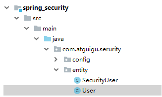

**（1）SecutityUser**

```java
package com.atguigu.serurity.entity;

import lombok.Data;
import lombok.extern.slf4j.Slf4j;
import org.springframework.security.core.GrantedAuthority;
import org.springframework.security.core.authority.SimpleGrantedAuthority;
import org.springframework.security.core.userdetails.UserDetails;
import org.springframework.util.StringUtils;

import java.util.ArrayList;
import java.util.Collection;
import java.util.List;

/**
 * <p>
 * 安全认证用户详情信息
 * </p>
 *
 * @author qy
 * @since 2019-11-08
 */
@Data
@Slf4j
public class SecurityUser implements UserDetails {

    //当前登录用户
    private transient User currentUserInfo;

    //当前权限
    private List<String> permissionValueList;

    public SecurityUser() {
    }

    public SecurityUser(User user) {
        if (user != null) {
            this.currentUserInfo = user;
        }
    }

    @Override
    public Collection<? extends GrantedAuthority> getAuthorities() {
        Collection<GrantedAuthority> authorities = new ArrayList<>();
        for(String permissionValue : permissionValueList) {
            if(StringUtils.isEmpty(permissionValue)) continue;
            SimpleGrantedAuthority authority = new SimpleGrantedAuthority(permissionValue);
            authorities.add(authority);
        }

        return authorities;
    }

    @Override
    public String getPassword() {
        return currentUserInfo.getPassword();
    }

    @Override
    public String getUsername() {
        return currentUserInfo.getUsername();
    }

    @Override
    public boolean isAccountNonExpired() {
        return true;
    }

    @Override
    public boolean isAccountNonLocked() {
        return true;
    }

    @Override
    public boolean isCredentialsNonExpired() {
        return true;
    }

    @Override
    public boolean isEnabled() {
        return true;
    }
}

```

**（2）User**

```java
package com.atguigu.serurity.entity;

import io.swagger.annotations.ApiModel;
import io.swagger.annotations.ApiModelProperty;
import lombok.Data;

import java.io.Serializable;

/**
 * <p>
 * 用户实体类
 * </p>
 *
 * @author qy
 * @since 2019-11-08
 */
@Data
@ApiModel(description = "用户实体类")
public class User implements Serializable {

	private static final long serialVersionUID = 1L;

	@ApiModelProperty(value = "微信openid")
	private String username;

	@ApiModelProperty(value = "密码")
	private String password;

	@ApiModelProperty(value = "昵称")
	private String nickName;

	@ApiModelProperty(value = "用户头像")
	private String salt;

	@ApiModelProperty(value = "用户签名")
	private String token;

}


```

**7、创建认证和授权的filter**

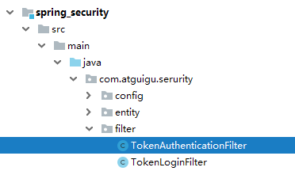

**（1）TokenLoginFilter：认证的filter**

```java
package com.atguigu.serurity.filter;

import com.atguigu.commonutils.R;
import com.atguigu.commonutils.ResponseUtil;
import com.atguigu.serurity.entity.SecurityUser;
import com.atguigu.serurity.entity.User;
import com.atguigu.serurity.security.TokenManager;
import com.fasterxml.jackson.databind.ObjectMapper;
import org.springframework.data.redis.core.RedisTemplate;
import org.springframework.security.authentication.AuthenticationManager;
import org.springframework.security.authentication.UsernamePasswordAuthenticationToken;
import org.springframework.security.core.Authentication;
import org.springframework.security.core.AuthenticationException;
import org.springframework.security.web.authentication.UsernamePasswordAuthenticationFilter;
import org.springframework.security.web.util.matcher.AntPathRequestMatcher;

import javax.servlet.FilterChain;
import javax.servlet.ServletException;
import javax.servlet.http.HttpServletRequest;
import javax.servlet.http.HttpServletResponse;
import java.io.IOException;
import java.util.ArrayList;

/**
 * <p>
 * 登录过滤器，继承UsernamePasswordAuthenticationFilter，对用户名密码进行登录校验
 * </p>
 *
 * @author qy
 * @since 2019-11-08
 */
public class TokenLoginFilter extends UsernamePasswordAuthenticationFilter {

    private AuthenticationManager authenticationManager;
    private TokenManager tokenManager;
    private RedisTemplate redisTemplate;

    public TokenLoginFilter(AuthenticationManager authenticationManager, TokenManager tokenManager, RedisTemplate redisTemplate) {
        this.authenticationManager = authenticationManager;
        this.tokenManager = tokenManager;
        this.redisTemplate = redisTemplate;
        this.setPostOnly(false);
        this.setRequiresAuthenticationRequestMatcher(new AntPathRequestMatcher("/admin/acl/login","POST"));
    }

    @Override
    public Authentication attemptAuthentication(HttpServletRequest req, HttpServletResponse res)
            throws AuthenticationException {
        try {
            User user = new ObjectMapper().readValue(req.getInputStream(), User.class);

            return authenticationManager.authenticate(new UsernamePasswordAuthenticationToken(user.getUsername(), user.getPassword(), new ArrayList<>()));
        } catch (IOException e) {
            throw new RuntimeException(e);
        }

    }

    /**
     * 登录成功
     * @param req
     * @param res
     * @param chain
     * @param auth
     * @throws IOException
     * @throws ServletException
     */
    @Override
    protected void successfulAuthentication(HttpServletRequest req, HttpServletResponse res, FilterChain chain,
                                            Authentication auth) throws IOException, ServletException {
        SecurityUser user = (SecurityUser) auth.getPrincipal();
        String token = tokenManager.createToken(user.getCurrentUserInfo().getUsername());
        redisTemplate.opsForValue().set(user.getCurrentUserInfo().getUsername(), user.getPermissionValueList());

        ResponseUtil.out(res, R.ok().data("token", token));
    }

    /**
     * 登录失败
     * @param request
     * @param response
     * @param e
     * @throws IOException
     * @throws ServletException
     */
    @Override
    protected void unsuccessfulAuthentication(HttpServletRequest request, HttpServletResponse response,
                                              AuthenticationException e) throws IOException, ServletException {
        ResponseUtil.out(response, R.error());
    }
}

```

（2）TokenAuthenticationFilter：
授权filter

```java
package com.atguigu.serurity.filter;

import com.atguigu.commonutils.R;
import com.atguigu.commonutils.ResponseUtil;
import com.atguigu.serurity.security.TokenManager;
import org.springframework.data.redis.core.RedisTemplate;
import org.springframework.security.authentication.AuthenticationManager;
import org.springframework.security.authentication.UsernamePasswordAuthenticationToken;
import org.springframework.security.core.GrantedAuthority;
import org.springframework.security.core.authority.SimpleGrantedAuthority;
import org.springframework.security.core.context.SecurityContextHolder;
import org.springframework.security.web.authentication.www.BasicAuthenticationFilter;
import org.springframework.util.StringUtils;

import javax.servlet.FilterChain;
import javax.servlet.ServletException;
import javax.servlet.http.HttpServletRequest;
import javax.servlet.http.HttpServletResponse;
import java.io.IOException;
import java.util.ArrayList;
import java.util.Collection;
import java.util.List;

/**
 * <p>
 * 访问过滤器
 * </p>
 *
 * @author qy
 * @since 2019-11-08
 */
public class TokenAuthenticationFilter extends BasicAuthenticationFilter {
    private TokenManager tokenManager;
    private RedisTemplate redisTemplate;

    public TokenAuthenticationFilter(AuthenticationManager authManager, TokenManager tokenManager,RedisTemplate redisTemplate) {
        super(authManager);
        this.tokenManager = tokenManager;
        this.redisTemplate = redisTemplate;
    }

    @Override
    protected void doFilterInternal(HttpServletRequest req, HttpServletResponse res, FilterChain chain)
            throws IOException, ServletException {
        logger.info("================="+req.getRequestURI());
        if(req.getRequestURI().indexOf("admin") == -1) {
            chain.doFilter(req, res);
            return;
        }

        UsernamePasswordAuthenticationToken authentication = null;
        try {
            authentication = getAuthentication(req);
        } catch (Exception e) {
            ResponseUtil.out(res, R.error());
        }

        if (authentication != null) {
            SecurityContextHolder.getContext().setAuthentication(authentication);
        } else {
            ResponseUtil.out(res, R.error());
        }
        chain.doFilter(req, res);
    }

    private UsernamePasswordAuthenticationToken getAuthentication(HttpServletRequest request) {
        // token置于header里
        String token = request.getHeader("token");
        if (token != null && !"".equals(token.trim())) {
            String userName = tokenManager.getUserFromToken(token);

            List<String> permissionValueList = (List<String>) redisTemplate.opsForValue().get(userName);
            Collection<GrantedAuthority> authorities = new ArrayList<>();
            for(String permissionValue : permissionValueList) {
                if(StringUtils.isEmpty(permissionValue)) continue;
                SimpleGrantedAuthority authority = new SimpleGrantedAuthority(permissionValue);
                authorities.add(authority);
            }

            if (!StringUtils.isEmpty(userName)) {
                return new UsernamePasswordAuthenticationToken(userName, token, authorities);
            }
            return null;
        }
        return null;
    }
}
```


# Ncaos配置中心-读取配置文件

## 1、在Nacos创建统一配置文件

**（1）点击创建按钮**

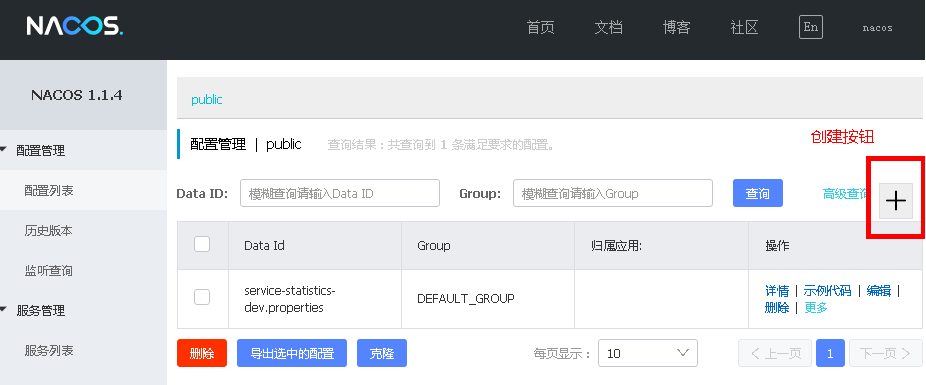

**（2）输入配置信息**

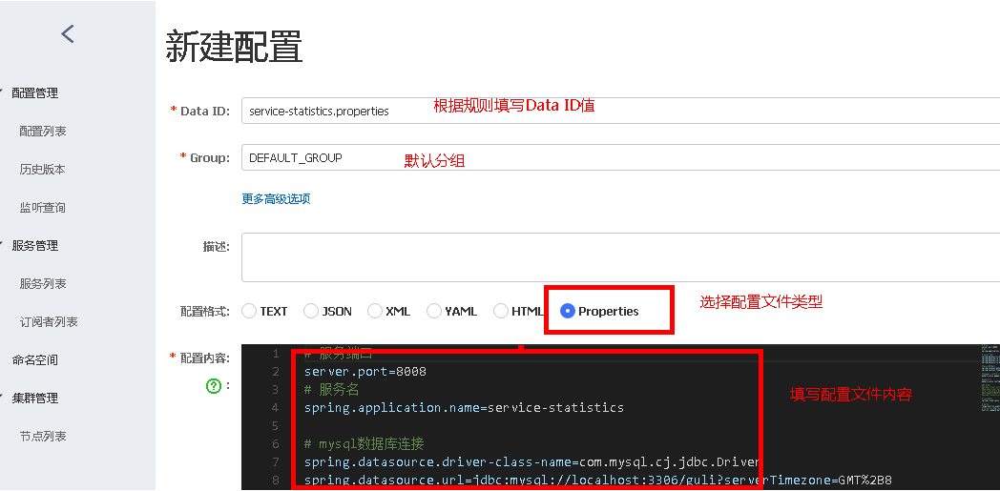

**a）Data ID 的完整规则格式如下**

**${prefix}-${spring.profile.active}.${file-extension}**

**- prefix** 服务名 

**- spring.profiles.active=dev** 即为当前环境对应的 profile。 注意：当 spring.profiles.active 为空时，对应的连接符 - 也将不存在，dataId 的拼接格式变成 ${prefix}.${file-extension}

**- file-exetension** 为配置内容的数据格式，可以通过配置项 spring.cloud.nacos.config.file-extension 来配置。目前只支持 properties 和 yaml 类型

## 2、以service-statistics模块为例

**（1）在service中引入依赖**

```xml
<dependencies>
    <dependency>
        <groupId>org.springframework.cloud</groupId>
        <artifactId>spring-cloud-starter-alibaba-nacos-config</artifactId>
    </dependency>
</dependencies>
```

**（2）创建bootstrap.properties配置文件**

```properties
#配置中心地址
spring.cloud.nacos.config.server-addr=127.0.0.1:8848
spring.profiles.active=dev
# 该配置影响统一配置中心中的dataId
spring.application.name=service-statistics
```

**（3）把项目之前的application.properties内容注释，启动项目查看效果**

## **3、补充：springboot配置文件加载顺序**

其实yml和properties文件是一样的原理，且一个项目上要么yml或者properties，二选一的存在。推荐使用yml，更简洁。

bootstrap与application
**（1）加载顺序**
这里主要是说明application和bootstrap的加载顺序。

bootstrap.yml（bootstrap.properties）先加载
application.yml（application.properties）后加载
bootstrap.yml 用于应用程序上下文的引导阶段。

bootstrap.yml 由父Spring ApplicationContext加载。

父ApplicationContext 被加载到使用 application.yml 的之前。

**（2）配置区别**
bootstrap.yml 和application.yml 都可以用来配置参数。

bootstrap.yml 可以理解成系统级别的一些参数配置，这些参数一般是不会变动的。
application.yml 可以用来定义应用级别的。


# Nacos配置中心-命名空间切换

**1、创建命名空间**

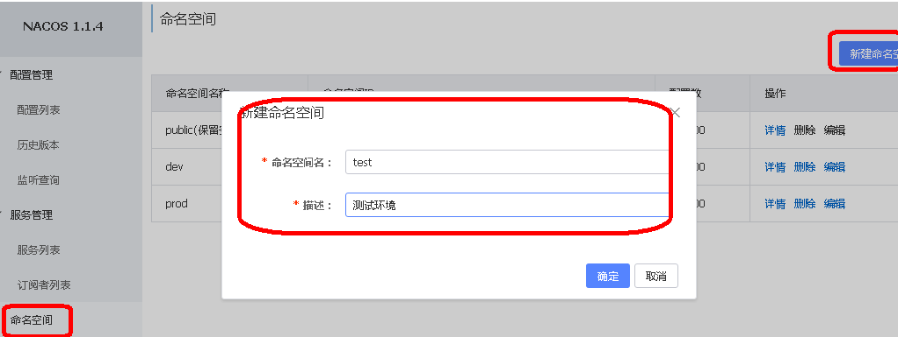

默认只有public，新建了dev、test和prod命名空间

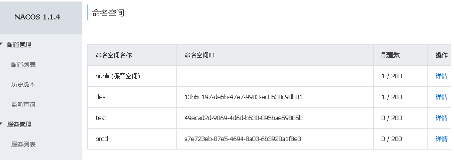

**2、克隆配置**

**（1）切换到配置列表：**

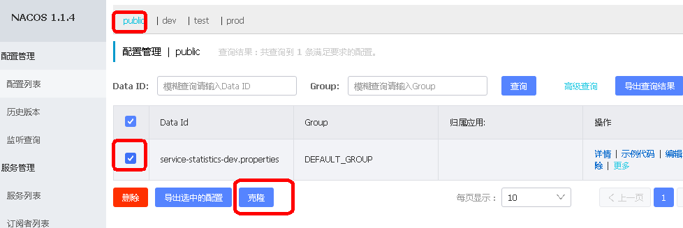

**可以发现有四个名称空间：public（默认）以及我们自己添加的3个名称空间（prod、dev、test），可以点击查看每个名称空间下的配置文件，当然现在只有public下有一个配置。默认情况下，项目会到public下找 服务名.properties文件。接下来，在dev名称空间中也添加一个nacos-provider.properties配置。这时有两种方式：第一，切换到dev名称空间，添加一个新的配置文件。缺点：每个环境都要重复配置类似的项目第二，直接通过clone方式添加配置，并修改即可。推荐**

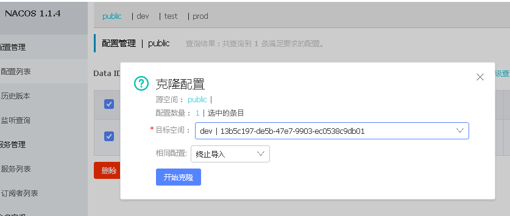

**点击编辑：修改配置内容，端口号改为8013以作区分**

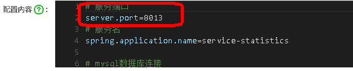

**在项目模块中，修改bootstrap.properties添加如下配置**

**namespace的值为：**

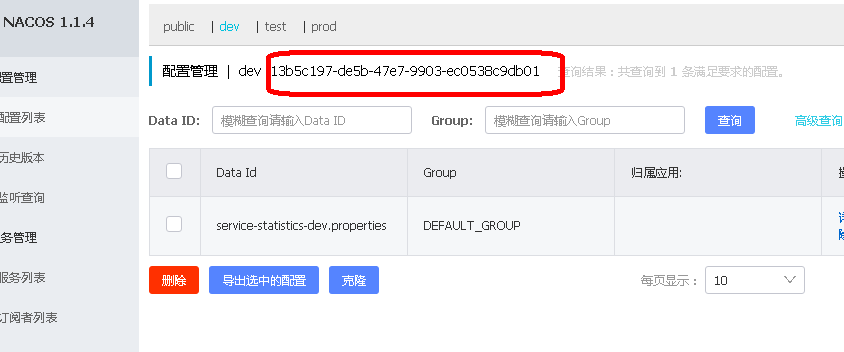

**重启服务提供方服务，测试修改之后是否生效**


# Nacos配置中心-多配置文件加载

在一些情况下需要加载多个配置文件。假如现在dev名称空间下有三个配置文件：service-statistics.properties、redis.properties、jdbc.properties

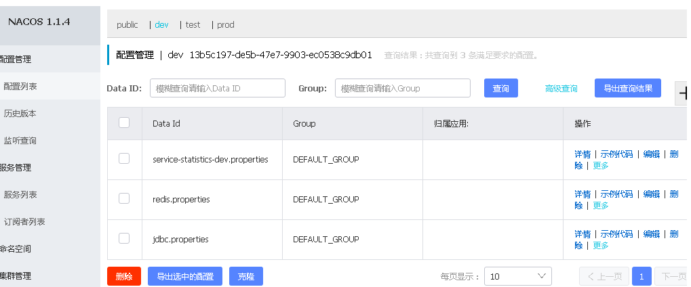

**添加配置，加载多个配置文件**

```properties
spring.cloud.nacos.config.server-addr=127.0.0.1:8848
spring.profiles.active=dev
# 该配置影响统一配置中心中的dataId，之前已经配置过
spring.application.name=service-statistics
spring.cloud.nacos.config.namespace=13b5c197-de5b-47e7-9903-ec0538c9db01
spring.cloud.nacos.config.ext-config[0].data-id=redis.properties
# 开启动态刷新配置，否则配置文件修改，工程无法感知
spring.cloud.nacos.config.ext-config[0].refresh=true
spring.cloud.nacos.config.ext-config[1].data-id=jdbc.properties
```


# 远程Git仓库-提交代码（idea提交）

1. 在gitee新创建一个仓库

2. 在idea设置git的路径

   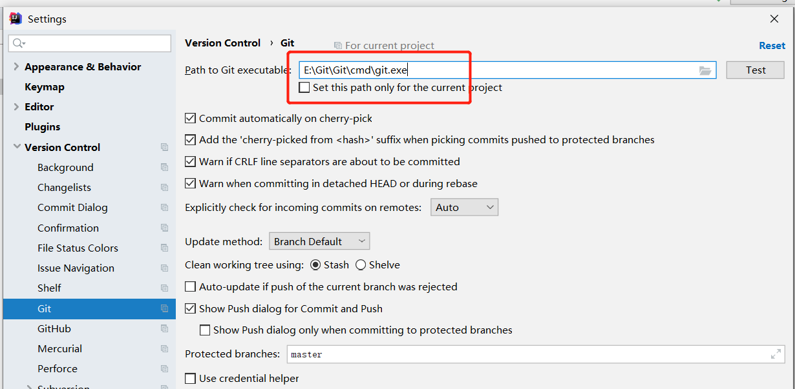

   

   3. 创建一个本地git仓库，一般以项目为仓库

      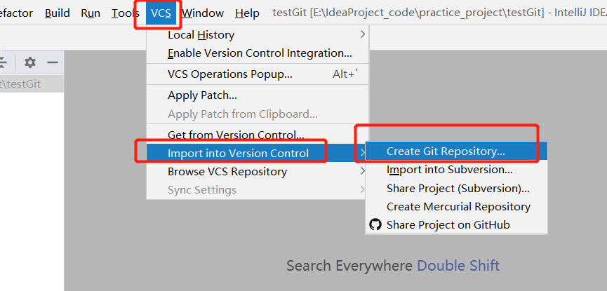

   4. 选中项目根目录右键，点击git，选中add，添加到本地仓库

      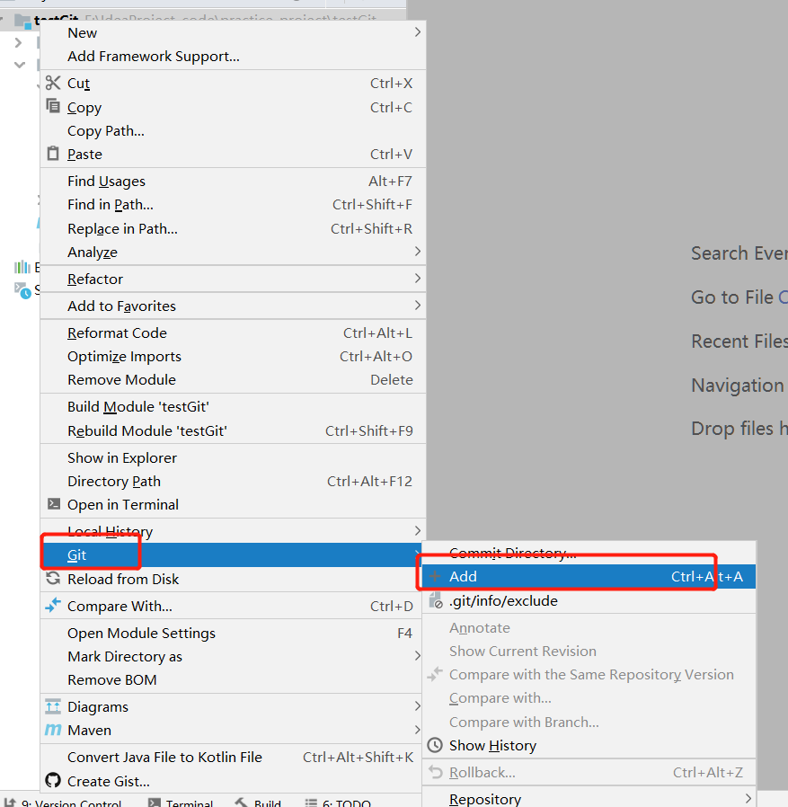

   5. 设置要提交的远程仓库地址

      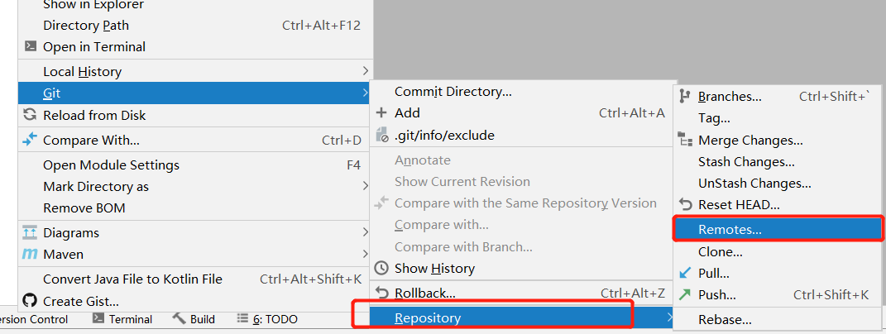

   6. 输入url，第一次需要输入用户名和密码验证

      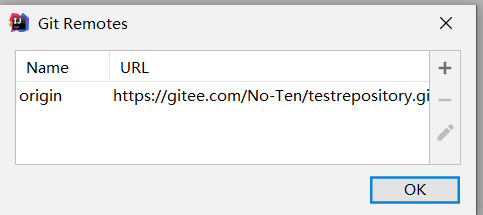

   7. 添加好url后，点击git，选中commit Directory

      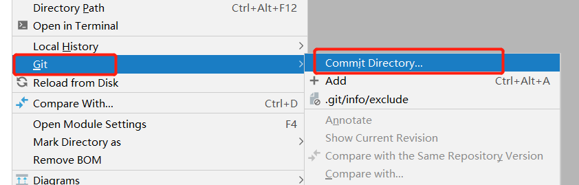

   8. 填好信息，点击提交

      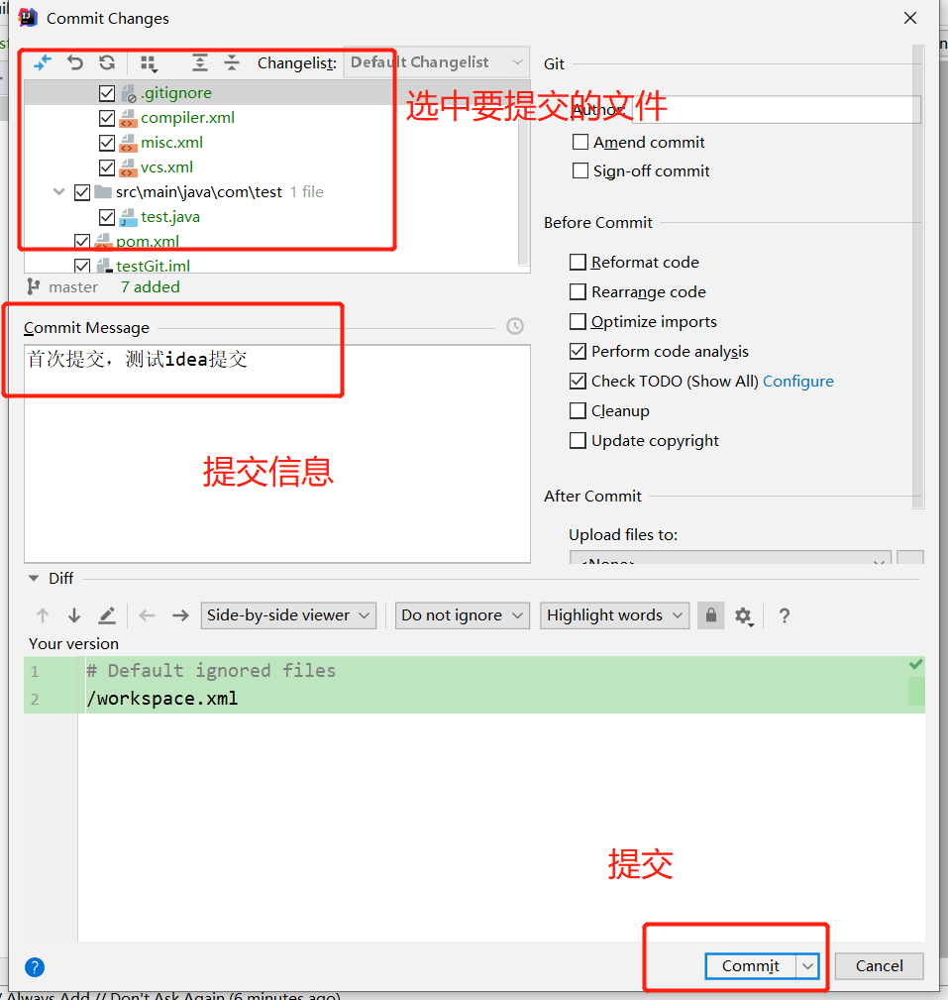

      

      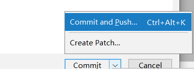

      

   9. 忽略警告，继续提交

      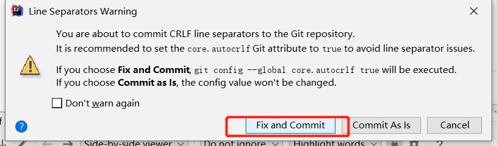

   10. 点击push

       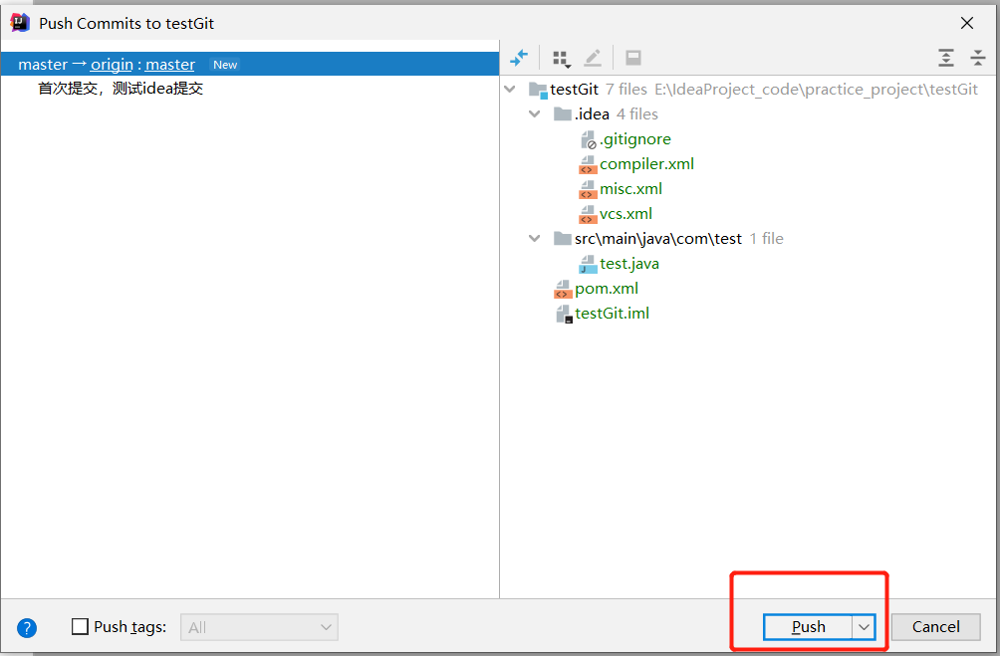

   11. 输入用户名和密码验证

       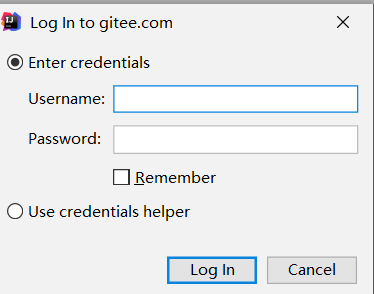

   12. idea提示成功

       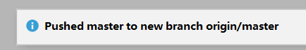

   13. 来到gitee的仓库中查看，已成功

       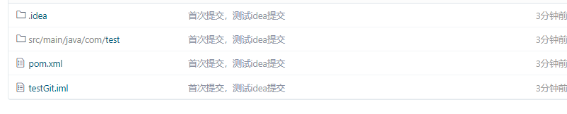


**如何让本地仓库与远程仓库断开连接？**

找version control,选中要断开的仓库，点击减号，最后OK

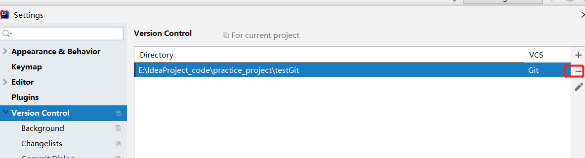

来到项目的本地目录下，将.git文件夹删除，需要打开查看隐藏文件

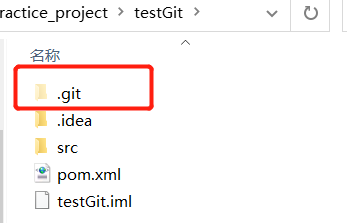


