# postgresql笔记


# 特点

postgresql数据库的主要特点如下：

- 免费
- 速度快
- 平台可移植行
- 丰富的接口
- 面向对象特性
- 安全性
- 配合的开源软件很多


# window安装

# Linux安装

.run包，直接运行

```bash
ps aux | grep postgresql

./pg_ctl stop -D /PostgreSQL/9.3/data		# 关闭服务
./pg_ctl start -D /PostgreSQL/9.3/data -l /PostgreSQL/9.3/data/server.log	# 启动服务
```


# pgAdmin客户端工具使用


# 使用pgAdmin工具操作数据库对象

略

# 利用sql语言操作数据库对象

```sql
create database db_pg;

create database db_pg1;

alter database db_pg rename to db_pg2;

alter database db_pg2 connection limit 20;

drop database db_pg1;

drop database db_pg2;
```

报错，先断开连接，再修改或者删除

```
ERROR:  database "db_pg" is being accessed by other users
DETAIL:  There are 2 other sessions using the database.
SQL 状态: 55006
```


# 利用sql语言操作数据表对象

```sql
create table student(
	id int,
	name varchar(10),
	birthday date,
	score numeric(5,2)
);

alter table student rename to student1;

alter table student1 rename id to bh;

alter table student1 alter column name type varchar(30);

alter table student1 drop column birthday;

alter table student1 add column address varchar(100);

drop table student1;

drop table if exists student1;
```


# postgresql常用数据类型

## 数值类型

整数类型：

```bash
SMALLINT 	// 小范围整数，取值范围：-32768~32767
INT(INTEGER) 	// 普通大小整数-2147483648~2147483647
```

任意精度浮点数类型

```bash
REAL	// 6位十进制数字精度
NUMERIC(m,n) // 任意精度类型 m表示字段长度，n表示精度，假如m为5的时候，1000.00会报错，而100.00不会，但是100.888没事，结果显示的是100.89
```


### 例子

```sql
create table temp(
	x smallint,
	y int,
	z real,
	n numeric(5,2)
);

insert into temp values(1,2,4.11,100.00);

insert into temp values(1,2,4.11,1000.00);

insert into temp values(1,2,4.11,100.888);

select * from temp;
```


ERROR:  numeric field overflow DETAIL:  A field with precision 5, scale 2 must round to an absolute value less than 10^3. SQL 状态: 22003


## 时间类型


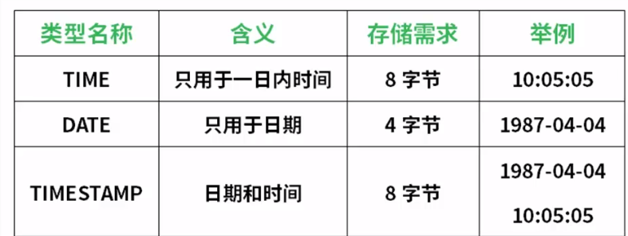


## 字符串类型


```sql
select * from concat( '(', ch, ')'),
	concat( '(', vch, ')'),
	concat( '(', t, ')'),
from temp3;
```

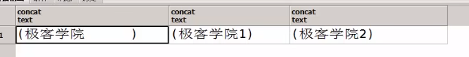


## 选择正确的数据类型

主要目的：优化存储区，提高数据库性能

- 正确使用整数类型和浮点数类型
- 日期与时间类型
- CHAR与VARCHAR之间的特点与选择

char：固定长度，不足的后面会以空格补齐，检索效率高

varchar：变长字符串，有长度限制，不足的不会以空格填充。

# postgresql运算符

## 算术运算符

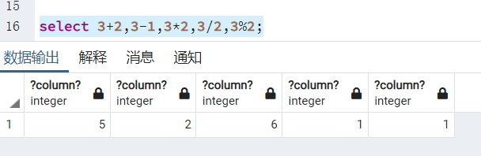


## 比较运算符

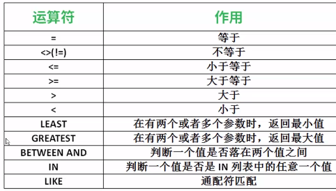


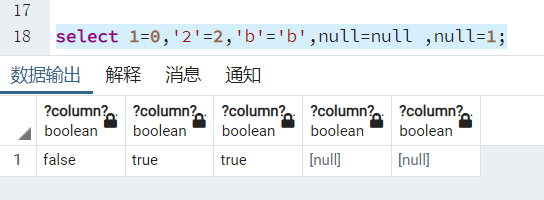


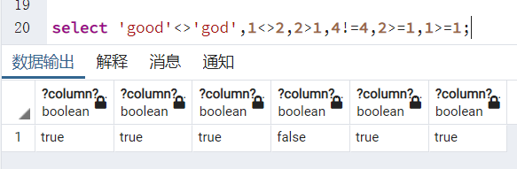


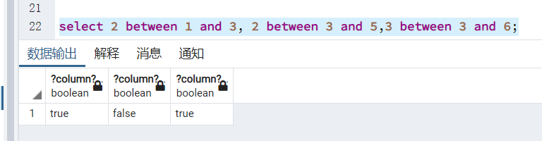


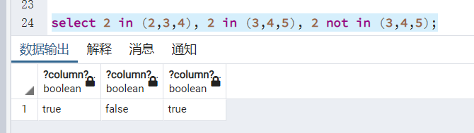


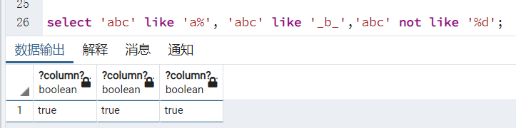


## 逻辑运算符

**NOT 逻辑非**

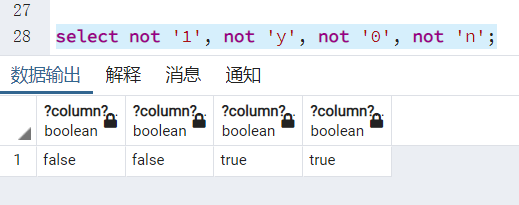

1：真，y：真，0：假，n：假


**AND 逻辑与**

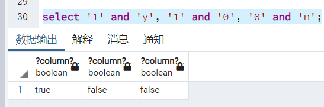


**OR 逻辑或**

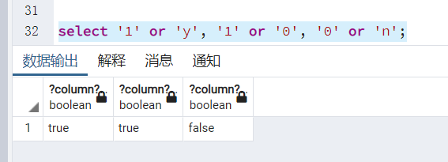


## 运算符的优先级

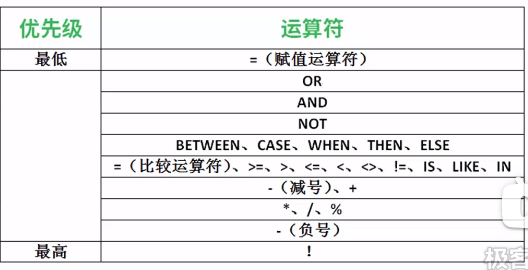


# postgresql常用函数

## 函数的作用

## 常用数值函数

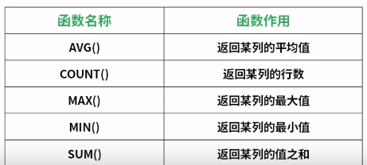


## 常用的字符串函数

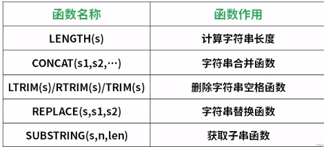


## 常用的日期和时间函数


```sql
select e_no,e_name,e_hireDate,extract(year from e_hireDate), extract(month from e_hireDate),extract(day from e_hireDate) from employee;
```


# 自定义函数

## 语法

基本语法格式

```sql
create function				// 声明创建函数
	add(integer,integer)	// 定义函数名称，参数类型
returns integer 			// 定义函数返回值
	AS 'select $1 + $2'		// 定义函数体
language sql				// 用以实现函数的语言的名字
returns null on null input;	// 定义参数为null时处理情况
```


```sql
create function add(integer,integer)
returns integer as 'select $1 + $2;'
language sql
returns null on null input;

select add(1,2);
```


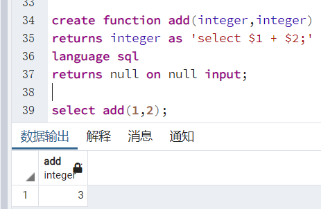


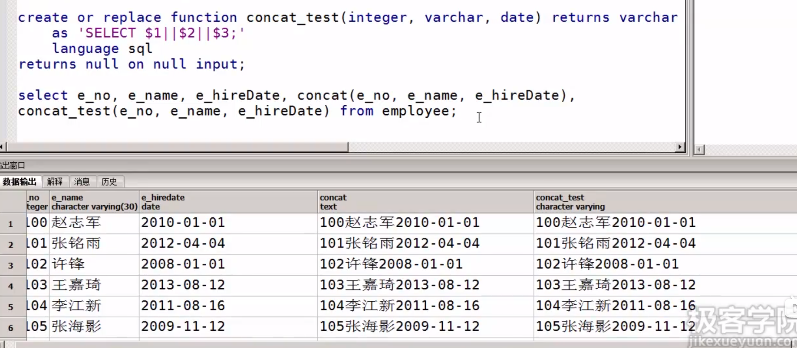


删除一个函数

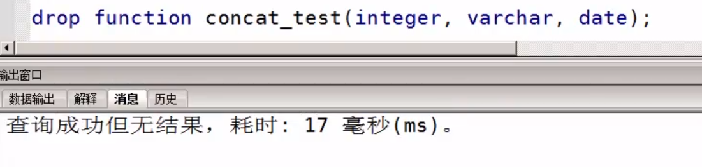


# postgresql数据库索引

## 索引的作用

提高检索的速度，相当于一本书的目录，可以根据目录快速找到想要找的内容。


## 索引的分类

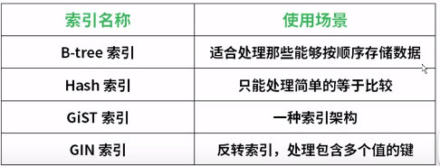


## 索引的创建和删除

```sql
create index emp_name_index on employee(e_name); 		// 默认btree索引

drop index emp_name_index;
```


## 使用索引的优点和缺点

优点：

- 提高数据的查询速度
- 加速表与表之间的连接

缺点：

- 创建和维护索引需要耗费时间
- 需要占用磁盘空间


# postgresql数据库视图

## 视图的含义

避免每次多表查询的时候都要编写复杂的SQL语句，可以直接创建视图，下次需要用到的时候直接用创建好的视图即可，不用关注底层的细节。

## 视图的创建

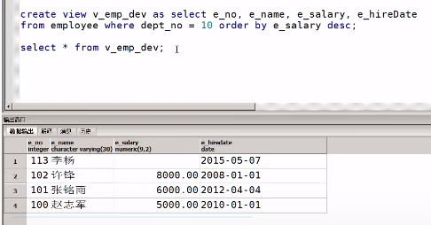


```sql
select view v_emp_dev as select e_no, e_name,e_salary,e_hireDate from employee where dept_no = 10 order by e_salary desc;		// 创建视图

select * from v_emp_dev;	// 查看视图


```


## 视图的删除

```sql
drop view v_emp_dev;		// 删除视图
```


## 视图的作用

- 简单化
- 安全化
- 逻辑数据独立性


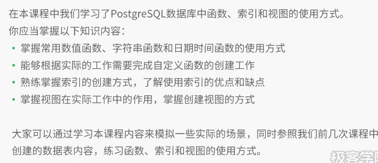


# 简单数据插入操作

向单表中插入数据

```sql
create table temp(
	x smallint,
	y int,
	z real,
	n numeric(5,2)
);

insert into temp values(1,2,4.11,100.00);
insert into temp (x,y,z) values (3,4,5.01);
select * from temp;
```


# 数据批量插入操作

利用insert批量插入数据

```sql
insert into temp values
(1,2,4.11,100.00),
(2,2,4.11,100.00),
(3,2,4.11,100.00); 
```

利用select批量插入数据

```sql
insert into student_new select * from student;		// 向student_new的表格插入从student表查询出来的所有的内容
```

利用select批量插入指定的属性

```sql
insert into student_new (id,name) select id,name from student;
```

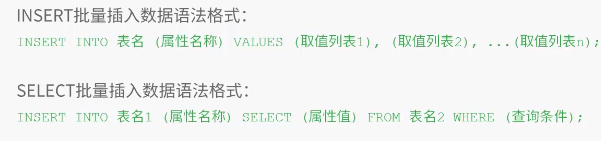


# 数据更新操作

```sql
# 指定条件更新数据
update student set name = 'zhangsan' where id = 1;

# 批量更新数据
update student set score = 0;	// 将该表的score都改为0

# 将指定结果更新到对应的字段
update student set score = 1.5 + 1 where id  = '1';
```


# 数据删除操作

 ```sql
delete from student where id = 1;

delete from student where between '1999-01-01' and '1999-02-01';

delete from student;

truncate table student_new;		// 清空这个表所有的数据 
 ```


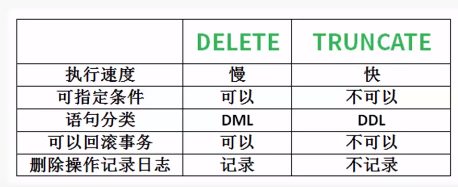


# postgresql数据表主键和外键

## 如何定义主键约束

```sql
create table temp(
	id int primary key,		// 列级约束
    name varchar(10),
    salary numeric(5,2)
);
```


```sql
create table temp2(
	id int,
    name varchar(10),
    salary numeric(5,2),
    constraint pk_temp primary key(id)		// 表级约束
);
```


## 如何定义外键约束

```sql
create table temp2(
	id int,
    name varchar(10),
    salary numeric(5,2),
    tempId int,
    constraint pk_temp foreign key(tempId) references temp(id)
);
```


## 主键约束和外键约束的作用

主键约束作用：

- 唯一标识一条记录
- 提高数据的检索效率

外键约束作用：

- 保证数据的完整性
- 提高数据的检索效率


# postgresql数据表非空约束、唯一约束、默认值约束介绍

非空约束：not null

唯一约束：unique

默认约束：default


## 作用

- 维护数据的完整性
- 在业务面保证数据正确性


# 简单数据查询操作

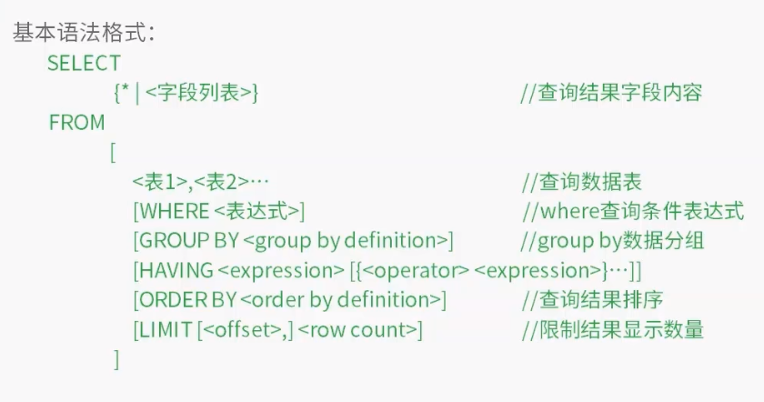


# 单表指定条件查询

in

```sql
select * from t where t_no in (20,30);
```

between and 

like


# 单表指定条件复杂查询操作

查询空值内容

and、or多条件查询

查询结果集排序

limit关键字查询

```sql
select * from t limit 5 offset 5;	# 显示前5条，忽略5条，即忽略前5条，从第6条开始显示5条。
```


```sql
select * from t limit 5 offset ((页码 -1) * 5);
```


# 多表复杂查询操作


# 子查询操作


```sql
select * from emp where exists (select d_no from dept where id_name = '开发部');	# 如果exists后面的查询为真，则将结果为真传到前面的查询中，返回所有的结果。
```

|| 拼接

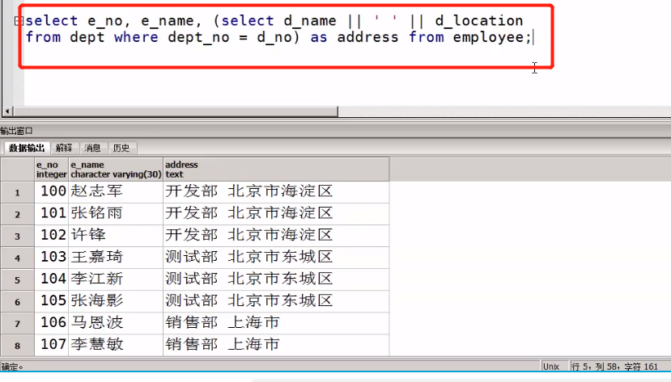


# 查询结果集合并操作


```sql
select * from e where dept_no in (10,20)
union all
select * from e where e_salary > 5000;
```

上面有重复的值，因为有数据是满足两个查询语句的。

如何避免？使用union即可。上下两个列需要一致，如果不存在可以用null占位。


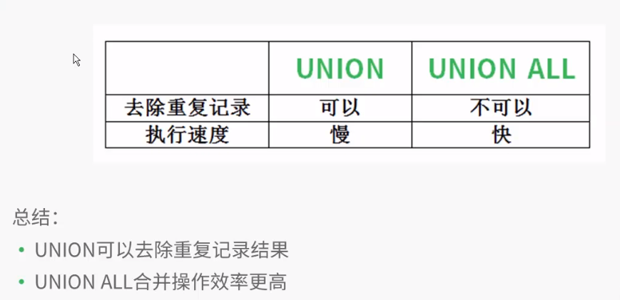


