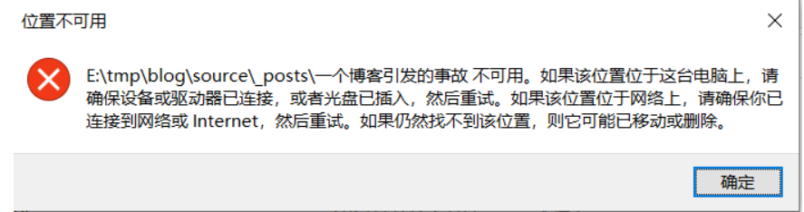
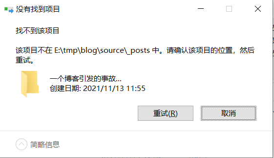

# 一个博客引发的事故...

<!--more-->

前几天，不知道抽了哪根筋儿，突然想整个属于自己的博客，写点小笔记啥的。于是这段故事就开始了...

简单说一下搭建的过程，网上找了一些资料，目前大部分博客的搭建都是用Hexo+GitHub(或者是gitee)，而我为什么用GitHub，不用gitee呢？其实一开始我是用gitee的，但是等到了部署的那一刻，就是需要生成gitee page的时候，gitee是需要实名的。需要实名的心里有些忐忑（隐私？），不过呢想想可以部署自己的博客，需要实名也很正常，毕竟网络嘛...那就整呗。那么问题就来了，gitee不仅需要实名，还要上传id card正反面，还要求手持。看到这的时候，立马放弃。

那么，还能选谁？只能选GitHub了，即使他是海外的，速度提不上，但也不是没有好处的嘛。对于我这些追求简单、高效的人来说（一个字，懒！），这个无非是个不错的选择。部署地方选好了，那就大门大吉了嘛？众所周知，GitHub是一个聚集全球顶级程序员的一个优秀平台...扯远了，简单点就是一个老外的网站。既然是老外的网站，那就避免不了语种问题。所谓的英格拉丝，这是最令人头痛的，所谓操作一步查一次字典，甚至一个单词查了好几遍（很简单，因为忘了）。但是这就能扼杀我搭建博客的心了嘛？果然，功夫不负有心人，我还是顺利搭建好了。原本在我以为这一切都这么结束了的时候，好戏才刚刚开始...

GitHub的仓库已经准备好了，接着就到了选博客的主题。作为一个有审美观的人（假的），在选主题这一块必须得拿捏。然而，hexo的主题页都被我从头翻到尾了，还是没找到自己想要的。接着又去下载一个nexT，还是木好看...这个时候突然想起了以前看到的一个博客，他的主题很不错，我也挺喜欢的。于是我就跑去他的博客里，试着把它的源码给扒拉下来。结果发现这个主题就是fluid，也就是hexo里面的主题，接着就简单了，后面的就略过了，无非就是改改改，头大头大头大。

费了我九牛二虎之力，接着就来到了作为一个堂堂正正的博主（你就吹！），最关心的问题就是写博客，写文章。一开始上传了一篇纯文字的文章，问题不大，效果很好。接着再测试一下图片是否能上传成功，很不幸，没能成功。于是乎，又在各大博客平台遨游，寻找解决问题的办法。我差不多将里面的方法都试了一遍，发现上面的方法基本上都是图片的路径问题。那么直到我看到了这一篇博客（链接放最后），他的方法和其他人的一样，但是唯一不同的就是，别人的方法只说了方法，没有思路，他写了他解决方案的思路。这一点必须点个赞。最后我虽然不是用他的方法解决问题的，但是我是用这种思路去分析问题的，原本发现是我的站点的路径写错了(%^$#&#^($))。这里又花了一天。

经过这一天多的时间，所有的环境基本上都搭建好了，文章也写了好几篇（拷贝的），在本地测试的也有没问题。既然都弄好了，那么接下来干嘛呢，那当然是部署到GitHub上面啦，这样才能通过外网访问嘛。就在昨晚打算把代码部署到GitHub上面就睡觉的，这个时候发现部署失败了。原因是多了一个文件夹。那我就寻思着，那就删了呗。问题真的有那么简单嘛？显然不是的，不然我也不会写这一篇博客了。删除的时候，他说在系统找不到这个文件。（完蛋，说到这里的时候，想着去找个图片展示一下的。在网上复制了一个图片，发现在我保存博客的文件夹多了一个一模一样的文件夹，寻思着就删除呗，噩梦又来了....@#￥&*￥%&*￥&，没错就是下面这个图，不是网上找的，这是第二次了，也就是写这篇文章的时候....先不说了，我要去解决了）

又过了小一会儿，我弄好了，现在继续写着。现在我知道了方法之后，解决这个很简单，就那么两分钟的事情。然而，在我写这篇博客的前一天晚上，我是整到凌晨1点多都没法解决的。找遍了所有的解决方法，什么别写一个.bat的文件，什么让系统进入安全模式，什么360粉碎文件等等，都没用！在我们凌晨2点多，准备睡觉的时候，在手机上寻找问题解决方案的时候，发现了一个另外的解决方案，那就是用大白菜U盘启动盘来解决。第二天早上，我照着昨晚的印象去试了一下，直接打开我的电脑，找到相当于的文件，点击删除。很激动，也很不幸，还是这样，删不了。我想了想，会不会是我的方法错了？于是，我专门跑去找利用大白菜彻底删除文件的操作流程。有一个方法就是在分区里面找到对应的文件，右键，点击彻底删除或强制删除，确定。（不过要确保你要删的不是系统文件，不然你的电脑会开不了机。）完事！没错，就是这么简单。上面的截图就是刚刚发生的，顺手给截下来的。

至于是什么原因导致的呢，仔细想了想，应该不是病毒，也不是系统问题。经过几次的测试，我看到了当我复制图片进我现在用的编辑md文件的编辑器的时候（Typora），他就会在文件当前目录自动创建一个文件夹来存放我的图片。恍然大悟，原来是我前面搭建博客的时候设置的路径错了，导致图片复制进来，找不到他自动创建存放图片的文件夹，但是又得要创建这么一个文件夹出来。我猜应该就这样，设置和实际冲突，然后系统就找不到这个文件的路径，就出现了上面的找不到该项目的问题了。

看到这里，也差不多结束了。但是不得不说，能看到这里的，都是顶呱呱的。满满的干货（都是废话），学的不是解决方案，是解决问题的思路（奇怪的知识又增加了）。就这样吧，我要把这个博客部署到远程了。拜拜~

