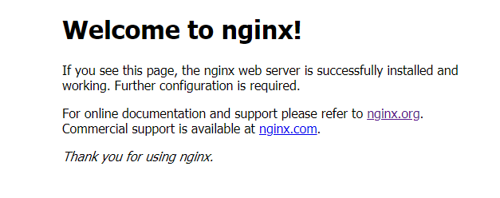
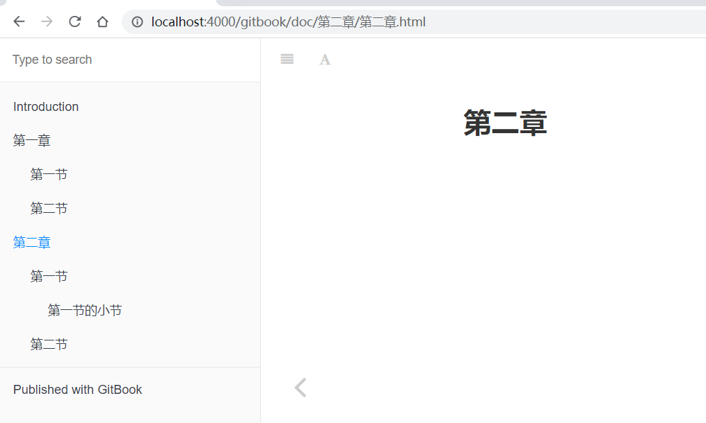

# 快速搭建个人电子书Gitbook并部署到GitHub Pages和Nginx

# 前提

- [nodejs](https://nodejs.org/en/)
- [git](https://git-scm.com/)
- [GitHub账号](https://github.com/)
- Markdown编辑器，这里推荐[Typora](https://www.typora.net/)

以上准备好之后就可以开始搭建了。

# 本地搭建

## 全局安装gitbook-cli工具

```bash
npm install gitbook-cli -g
```

检查版本

```bash
gitbook --version
```

如果出现版本号，说明安装成功。

```bash
CLI version: 2.3.2
GitBook version: 3.2.3
```

如果有报类型找不到的错误，可能是nodejs的版本过高导致的，可以将版本，我这里用的是nodejs 12+的。

## 本地初始化一本电子书

创建目录

```bash
mkdir gitbook
cd gitbook
```

初始化电子书

```bash
gitbook init
```

成功之后会如下

```bash
E:\temp\gitbook>gitbook init
warn: no summary file in this book
info: create README.md
info: create SUMMARY.md
info: initialization is finished

E:\temp\gitbook>
```

README.md为简介文档，SUMMARY.md为所要创建的电子书的目录文档，自动生成。

## SUMMARY.md文件的格式

目录的Markdown语法格式如下

```
* [第一章](doc/第一章/第一章.md)
  * [第一节](doc/第一章/第一节.md)
  * [第二节](doc/第一章/第二节.md)
* [第二章](doc/第二章/第二章.md)
  * [第一节](doc/第二章/第一节.md)
    * [第一节的小节](doc/第二章/第一节/第一节的小节.md)
  * [第二节](doc/第二章/第二节.md)
```

效果如下


## 生成电子书

由于上面我们自定义了电子书的目录，所以现在需要重新初始化一下

```bash
gitbook init
```

如下。

```bash
E:\temp\gitbook>gitbook init
info: create doc/第一章/第一章.md
info: create doc/第一章/第一节.md
info: create doc/第一章/第二节.md
info: create doc/第二章/第二章.md
info: create doc/第二章/第一节.md
info: create doc/第二章/第一节/第一节的小节.md
info: create doc/第二章/第二节.md
info: create SUMMARY.md
info: initialization is finished

E:\temp\gitbook>
```

启动电子书，在本地测试。访问http://localhost:4000进行测试，如果你想指定端口可以执行 gitbook serve --port 8888

```bash
gitbook serve
```

效果如下，到这里一本电子书已经搭建完毕了，剩下的就是尽情挥洒你的文笔了。


## 文档打包

可以使用gitbook build打包你的项目

```bash
E:\temp\gitbook>gitbook build
info: 7 plugins are installed
info: 6 explicitly listed
info: loading plugin "highlight"... OK
info: loading plugin "search"... OK
info: loading plugin "lunr"... OK
info: loading plugin "sharing"... OK
info: loading plugin "fontsettings"... OK
info: loading plugin "theme-default"... OK
info: found 8 pages
info: found 7 asset files
info: >> generation finished with success in 1.1s !

E:\temp\gitbook>
```

这时会生成一个_book的文件，这个文件就是生成的静态网页，如果是部署到自己的云服务器，直接拿这个文件去部署即可，入口为index.html。


# 部署到GitHub Pages

## 在GitHub上面创建一个repository

这个仓库主要是存储你的项目和部署项目用到。

## 将本地项目推到GitHub

编写一个.gitignore文件，忽略_book文件

```bash
# 忽略gitbook生成的项目目录
_book
```

依次执行下面的代码，将项目推到GitHub

```bash
git init
git add .
git commit -m "first commit"
git remote add origin https:你自己的仓库地址
git push -u origin master


git init
git add .
git commit -m "first commit"
git remote add origin git@github.com:No-Ten/testGitBook.git
git push -u origin master
```

执行完上面的命令之后，你的项目就会在GitHub上面啦


## 生成项目并推到GitHub的pages分支上

这里为了便捷，直接编写了一个脚本deploy.sh执行，也可以手动输入。

```bash
echo '执行命令：gitbook build .'
gitbook build .

# 进入_book文件
echo "执行命令：cd ./_book\n"
cd ./_book

# 将_book初始化为git的仓库，方便推送到GitHub上面
echo "执行命令：git init"
git init

# 保存所有的修改
echo "执行命令：git add ."
git add .

# 把修改的文件提交
echo "执行命令：git commit -m 'deploy'"
git commit -m "deploy"

# 发布
echo "执行命令：git push -f 自己的仓库地址 master:gh-pages"
git push -f https://github.com/xxxx/xxx.git master:gh-pages

# 返回上一级目录
echo "回到刚才工作目录"
cd -
```

文件保存之后，在终端下面执行，需要再git bash下面执行。

```bash
bash deploy.sh
```

执行成功之后，如果在GitHub上面看到有index.html说明已经成功了。


## 设置GitHub pages访问路径

在github网站上的仓库里面点击`Settings` -> `GitHub Pages`选项中 -> `Source`里面选择`gh-pages branch` 然后点击`Save`按钮，然后在`GitHub Pages`下面就会看见一个网址，这个网址就是最终的网站。
最终效果如下图所示：


我这里了的GitHub pages的路径是自动设置好了，所以直接访问即可。到这里属于自己的电子书就搭建完成了，尽情享受吧！！！


# gitbook的一些实用插件

这里不多说，直接上链接。

https://segmentfault.com/a/1190000019806829


# 利用Nginx部署到本地或者远程服务器

下载[Nginx](http://nginx.org/)

下载好后再Nginx的conf文件夹里面找到nginx.conf文件，在server 添加一个监听

```bash
	server{
		listen       4000;
		server_name  localhost;
		
		location  /gitbook {
			alias  E:/temp/gitbook/_book;
			index index.html index.html;
			autoindex on;
		}
	}
```

启动nginx ，双击nginx会闪退，可以在Nginx当前目录打开终端，执行下面的命令

```bash
nginx.exe
```

停止Nginx

```bash
nginx -s stop
```


访问测试，一般的Nginx都是80端口，可以直接访问localhost就可以看到nginx的页面了



加上我们gitbook的路径localhost:4000/gitbook



到这里，利用Nginx部署就完成了，远程的一样，稍微修改一下即可。


