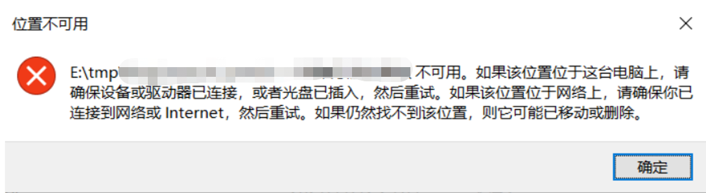
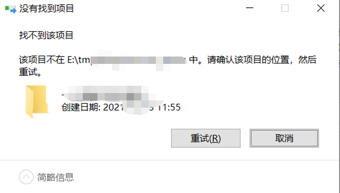
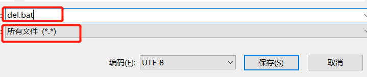
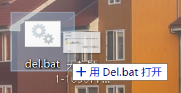
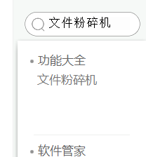
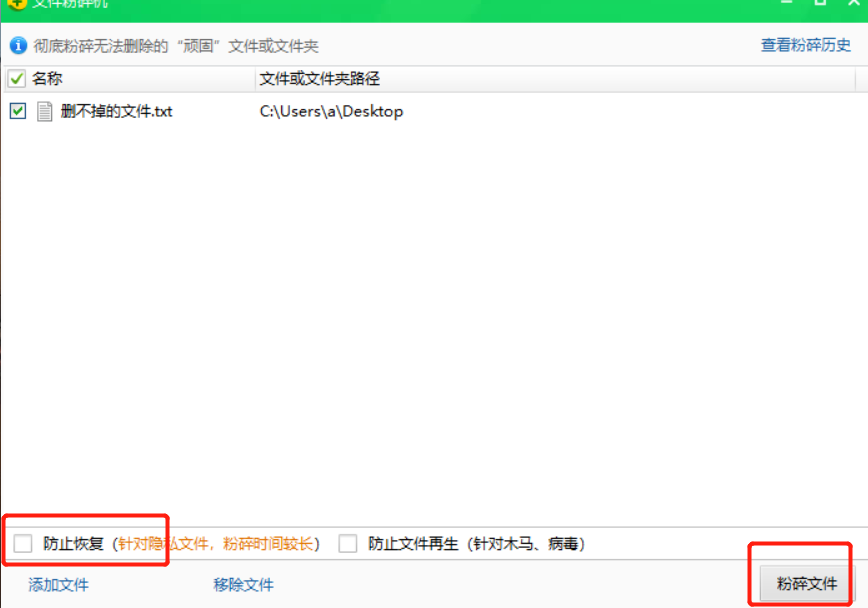
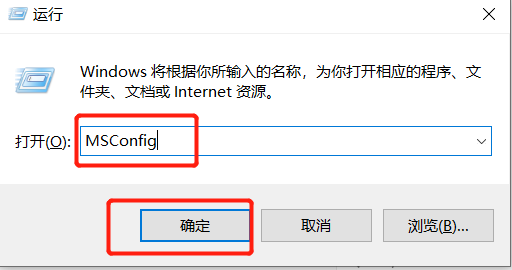
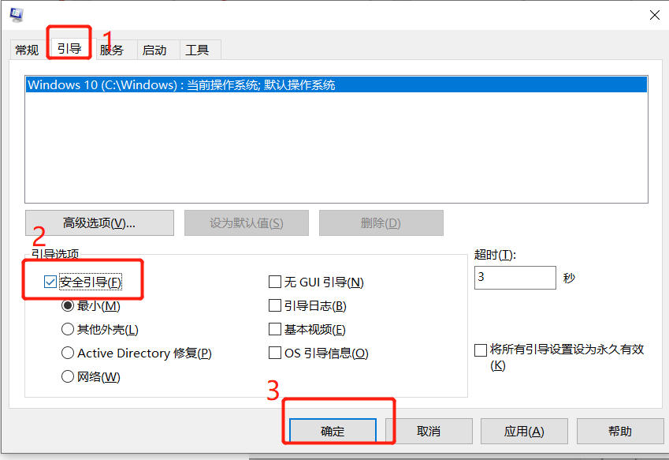
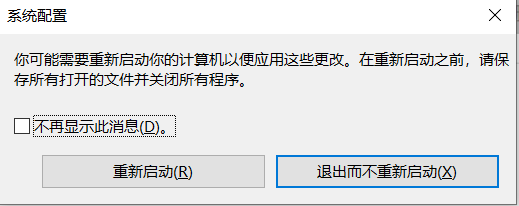
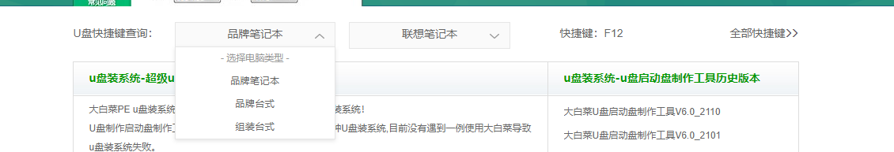

# 找不到该项目，位置不可

最近遇到了一个问题，那就是删除文件的时候，文件删不掉，说找不到该项目，位置不可用。

我找了很多资料，分别是下面几种。第一个是，写一个.bat的删除文件，第二个是用360的粉碎文件，第三个是进去安全模式，第四个是用U盘启动盘删除。**注意：如果前面三个都试过了，建议直接跳到第四个，亲测有效！！**

**第一种：编写.bat文件**

1.  在电脑桌面，新建一个文本文件，把下面的代码复制进去

DEL /F /A /Q \\?\%1
RD /S /Q \\?\%1

2. 点击另存为，选择所有文件，随便起个名字，把后缀改为.bat，确定保存即可

   

3. 接着把需要删除的文件拖到这个.bat文件上面就可以删除了。

但是对于我的这个文件没用。

**第二种：用360粉碎文件**

1. 打开360，搜索文件粉碎机

   

2. 把要删除的文件拖进来，点击粉碎文件

   

   但是这个方法，对我来说，还是不管用。

   

   **第三种方法：进去安全模式**

   1. win+R，输入MSConfig，回车

      

   2. 选择引导，在引导选项中勾上安全引导，点击确定。（也可以在开机的时候按快捷键进去安全模式，不同牌子的电脑有些区别，可自行去了解）

      

   3. 确定之后会询问你是否重新启动，确保电脑已经保存所有文件，避免重启时丢失，选择重启启动即可。

      

   4. 重启之后电脑会进入一个比较原始的画面，不用管他，直接找到删不掉文件的所在位置，和常规操作一样，右键删除，看看是否成功。

   5. 如果没有成功，先把所有窗口都关闭回到桌面，把开机自动进去安全模式的功能给关了，win+r，输入MSConfig，引导，把安全引导的勾勾给去掉，确定，重新启动即可。

   

   如果用了上面几个方法都没用，请不要放弃，因为我也试过了，都没生效，下面是第四个方法，亲测有效！！！！。

**第四个方法：U盘启动盘删除**

前提：要有U盘启动盘。

我这里用的是大白菜，如果没有可以去大白菜官网参考教程制作http://www.winbaicai.com/

提示一点：制作U盘启动盘的时候最好用空的U盘，以免重要文件丢失。

1. 有了U盘启动盘之后，在大白菜官网查询如何通过U盘启动系统的快捷键，根据自身电脑选择即可。

   

2. 准备好工具之后，把电脑关机，插入U盘启动盘，开机的时候，按对应的快捷键（如果怕进入不了，可以多按几次）

3. 进入之后，有好几个选项，选择通过USB启动。

4. 进去到大白菜的界面之后，观察首页有没有启动pe系统选项，如果没有就选择其他，进入其他里面就有了，选择pe启动，确定即可。

5. 进入pe系统之后，这又有两个方法。

6.  4.1就是打开我的电脑，找到文件所在位置，点击删除，看看能否成功，如果成功就可以了，不成功的话，接着下面的方法。

7. 4.2返回pe系统的桌面，找到分区工具，打开电脑所有的文件都可以在里面找到

8. 找到要删除的文件，右键，选择强制删除就可以了（**注意：要确保你要删除的不是系统文件，否则会导致系统文件受损，电脑开不了机！！**）

OK，到这里文件就删除了，我的成功。

分析一下产生删不掉文件的原因：

经过测试，我之所以会产生这删不掉的文件，是因为我用的md文件编辑软件的图片存储路径弄错了。正常情况下是`./${filename}`这样的，而我手误，把./中的.写成了,才导致的。把他改成正确的路径就没事了。