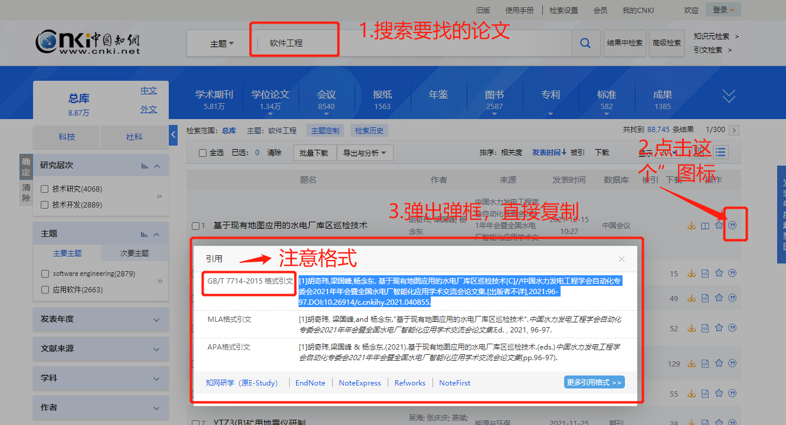
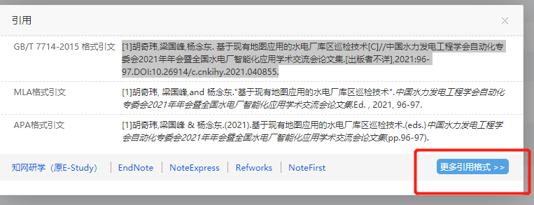
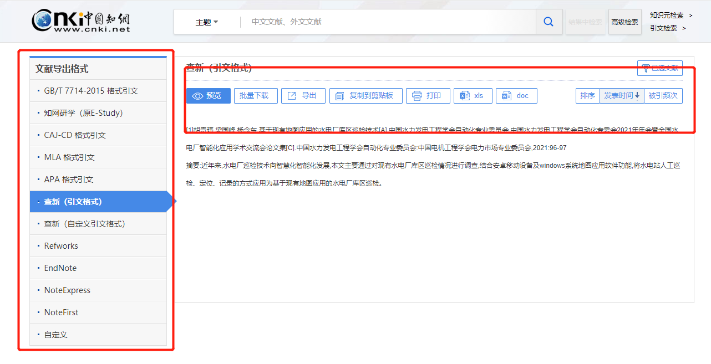
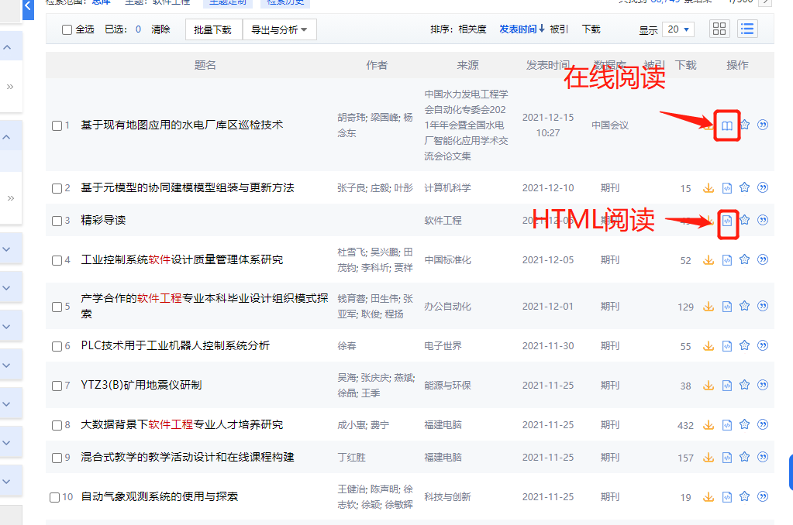
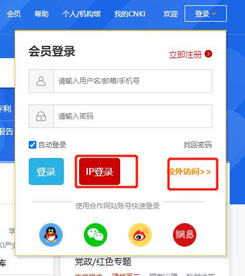
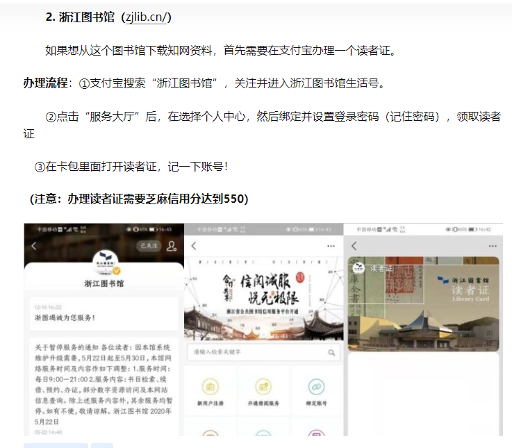
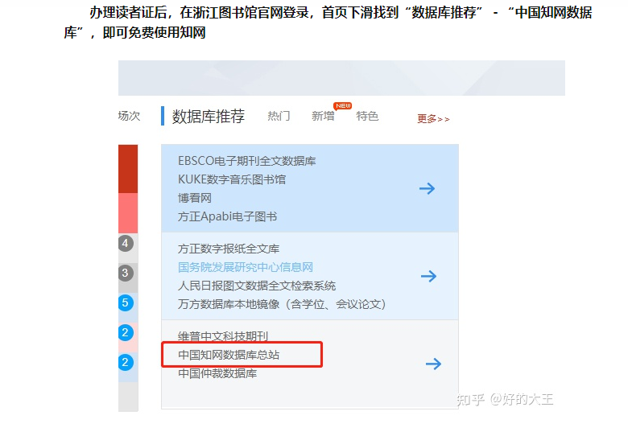
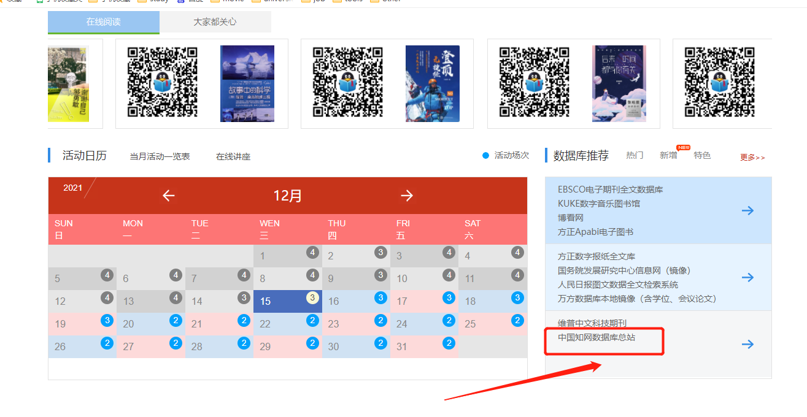
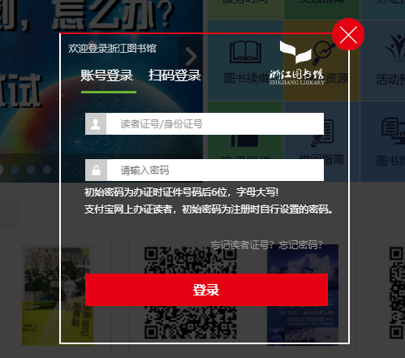

# 校外如何访问知网

<!--more-->

# 如何引用文献

打开中国官网https://www.cnki.net/

如果想更换其他格式，可以点击更多格式

按照格式复制即可

# 如何阅读

## 在线阅读

如果没有登录，只可以查看前面几页。登录了之后会发现需要购买。

## HTML阅读

没有预览，直接购买。

# 如何免费上知网

先了解一下知网可以通过账号登录，也看通过IP地址登录的

## 校内访问

连接校园网，通过IP登录

## 校外访问

1. 通过学校的提供的VPN（这个需要学校购买知网数据库才有，我们学校有购买，可能仅限校内，没有VPN，校外无法访问）

2. 通过一些有购买知网数据库的图书馆账号登录。这个是具体操作https://zhuanlan.zhihu.com/p/344063925

   （我还没试过）**推荐用浙江省图书馆的**

如果嫌弃上面这个链接太多不想看的话，我直接挑出来给大家。

这是浙江省图书馆地址：https://www.zjlib.cn/

拖到网站底部，找到中国知网

登录上去之后该怎么操作就怎么操作，看论文，引文献等等。

如果这个不行就在上面操作的链接中更换其他省的图书馆即可。

# 看论文网站

中国知网：https://www.cnki.net/

维普：http://www.cqvip.com/

万方：https://www.wanfangdata.com.cn/index.html

上面三个是官方的，下面几个是仿的，不过也可以试着找找，看看有没有找到

ReadPaper：https://readpaper.com/

iData：https://www.cn-ki.net/

（据说iData这个每天可以免费下载5篇，不知道真假，不过他的注册需要手机号，且不支持QQ邮箱）

如果担心隐私泄露，建议选择官方的。